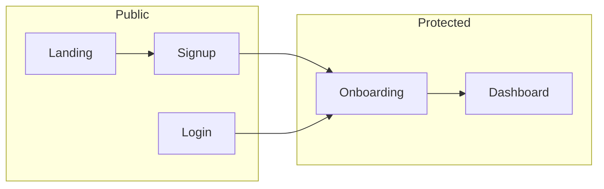

# Authentication & access security

> **Not legal advice.** Review with counsel for GDPR/CCPA obligations.

## Auth flow (high level)

- **Supabase Auth** handles sessions (cookies via `@supabase/ssr`).
- **Server layouts / route handlers** must enforce workspace membership and roles.

## Route access map (intent)

| Area | Access |
|------|--------|
| `/`, `/pricing`, `/demo`, `/beta`, `/integrations`, `/legal/*`, `/solutions/*` | Public |
| `/login`, `/signup`, `/auth/*` | Public |
| `/dashboard/*` | Authenticated members |
| `/dashboard/developer`, `/dashboard/beta-applications` | **Owner** only (enforced in layout/shell) |
| Demo deep-links | May bypass full auth depending on implementation — keep demo data synthetic |

## Role permission matrix (baseline)

| Capability | Owner | Manager | Staff | Read-only |
|------------|-------|---------|-------|-----------|
| Billing / plan | ✓ | — | — | — |
| Integrations / secrets | ✓ | partial | — | — |
| Orders / production | ✓ | ✓ | ✓ | view |
| Settings / exports | ✓ | ✓ | — | — |
| Developer diagnostics | ✓ | — | — | — |

*(Adjust to match your Prisma `Role` enum and server checks.)*

## Password reset & email confirmation

- Configure Supabase email templates and **Site URL** / redirect URLs.
- Document support steps for “did not receive email” (spam folder, resend, domain verification).

## Team invitations

- If invitations are placeholders, ensure **no privilege escalation** via guessed tokens — use signed, expiring tokens server-side.

## Public order lookup

- Any public tracking page must return **sanitized** fields only (no PII beyond what customer already knows).

## Account deletion / export

- CSV exports: see `docs/DATA_EXPORTS.md`.
- Deletion placeholder: communicate timeline and legal retention requirements after counsel review.

## Hardening checklist

- [ ] Service role key never exposed to client
- [ ] Webhooks verify signatures
- [ ] `ENCRYPTION_KEY` present in prod for stored integration credentials
- [ ] Rate-limit auth endpoints if abuse observed (future)
