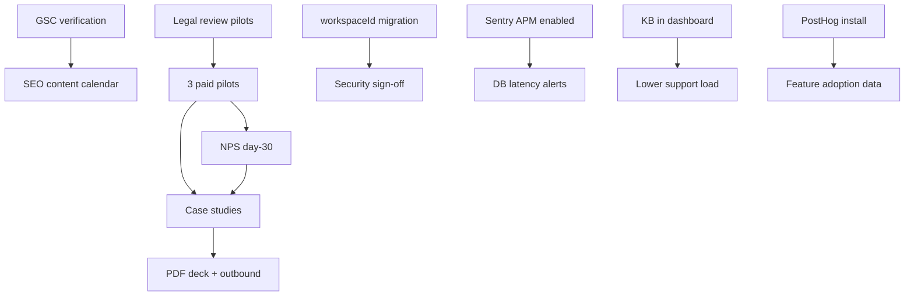

# KitchenOS — GTM & Engineering Execution Plan

**Date:** 2026-05-24  
**Source audit:** `docs/ultimate-audit-24may2026.md`  
**Goal:** Close Tech 88 / GTM 52 gap with a single linked roadmap (90 days)

---

## North star

| Metric | Today | Day 90 target |
|--------|-------|----------------|
| Paying MRR | $0 | ≥ $300 (3 pilots on Pro/Team) |
| Written case studies | 0 | 2 (named or anonymized) |
| workspaceId migration | 39 / 219 user-scoped models | ≥ 180 scoped |
| GSC verified | ❌ | ✅ + sitemap submitted |
| Product analytics | GA4 only | PostHog + GA4 |
| APM | Sentry DSN optional | Sentry traces ≥10% prod |

---

## Dependency graph

---

## Week-by-week (90 days)

### Weeks 1–2 — Unblock GTM & visibility

| # | Action | Owner | Doc / code | Done when |
|---|--------|-------|------------|-----------|
| 1 | Google Search Console | Marketing | `docs/GSC_SETUP.md` | Domain verified, sitemap submitted |
| 2 | Legal review (pilot ToS) | Legal | External counsel | Pilot agreement template signed off |
| 3 | PDF sales deck | Marketing/Design | **https://os-kitchen.com/deck** → Print PDF | 12-slide PDF shared in outbound |
| 4 | Enable Sentry APM | DevOps | `SENTRY_DSN` + `SENTRY_TRACES_SAMPLE_RATE=0.1` | Health shows traces, alerts configured |
| 5 | PostHog (optional env) | Engineering | `NEXT_PUBLIC_POSTHOG_KEY` | Events on signup, pilot start, order created |
| 6 | workspaceId audit in CI | Engineering | `npm run workspace:audit` in CI | Fails if `needs_migration` count increases |

### Weeks 3–6 — Pilots

| # | Action | Owner | Doc | Done when |
|---|--------|-------|-----|-----------|
| 7 | Qualify 50 operators | Sales | `docs/pilot-program.md` | 10 calls, 5 qualified |
| 8 | Onboard 3 pilots | CS + Product | `docs/PILOT_ONBOARDING_RUNBOOK.md` | All live on production |
| 9 | Pilot success criteria | PM | Per-vertical metrics in runbook | Baseline + day-60 targets recorded |
| 10 | NPS at day 30 | CS | In-app prompt (`NpsSurveyPrompt`) | ≥ 2 responses per pilot |

### Weeks 7–12 — Proof & scale

| # | Action | Owner | Done when |
|---|--------|-------|-----------|
| 11 | 2 case studies published | Marketing | On `/blog` or `/customers` |
| 12 | 2 blog posts / month | Marketing | Content calendar row in Notion/Sheet |
| 13 | Compare pages +4 | SEO | Olo, Deliverect, R365, TouchBistro |
| 14 | workspaceId phase 5+ backfill | Engineering | Audit: ≤ 20 models `needs_migration` |
| 15 | First hire JD posted | HR/CEO | LinkedIn live |

---

## P0–P3 tracker (linked to codebase)

| ID | Item | Priority | Status | Implementation |
|----|------|----------|--------|----------------|
| GTM-01 | 0 paying customers | P0 | 🔴 Open | `docs/pilot-program.md`, runbook |
| GTM-02 | GSC not connected | P0 | 🟡 Doc ready | `docs/GSC_SETUP.md` — **manual 15 min** |
| SEC-01 | workspaceId ~18% models scoped | P0 | 🟡 In progress | `npm run workspace:audit`, backfill phases |
| HR-01 | Bus factor = 1 | P0 | 🔴 Open | `docs/adr/`, CONTRIBUTING, hiring JD |
| OPS-01 | No APM | P1 | 🟡 Config ready | Set `SENTRY_DSN` in Vercel |
| MKT-01 | Content calendar | P1 | 🔴 Open | See § Content calendar below |
| PRD-01 | Aggregator menu sync | P1 | 🔴 Open | DoorDash/Uber — post-pilot |
| SAL-01 | PDF deck | P1 | 🟢 Page live | `/deck` → Print PDF; source `docs/sales-deck.md` |
| CS-01 | NPS | P1 | 🟢 Scaffold | `components/dashboard/nps-survey-prompt.tsx` |
| LEG-01 | Legal draft | P2 | 🟡 | Counsel before pilot contract |
| DATA-01 | PostHog | P2 | 🟢 Scaffold | `components/analytics/posthog-provider.tsx` |
| SEC-02 | Experimental crons | P2 | 🟢 CI exists | `validate:cron-inventory` |
| QA-01 | Coverage % | P3 | 🟢 CI added | `npm run test:coverage`, threshold ramp |

---

## Content calendar (minimum viable)

| Week | Type | Topic | Target keyword |
|------|------|-------|----------------|
| W1 | How-to | Weekly meal prep order flow | meal prep software |
| W2 | Compare | KitchenOS vs MarketMan (meal prep) | marketman alternative meal prep |
| W3 | Case study | Pilot #1 (anonymized OK) | ghost kitchen software |
| W4 | How-to | KDS setup for small restaurant | kitchen display system |
| W5–12 | Repeat | 2 posts/month | Rotate solution + compare |

---

## Pilot verticals & success criteria

| Vertical | Readiness | Primary modules | Day-60 success |
|----------|-----------|-----------------|----------------|
| Meal prep | 95% | meal-plans, production, packing, routes | +30% orders/week, <2% pack errors |
| Ghost kitchen | 85% | brands, pos, kitchen | 2 brands live, KDS <15m avg |
| Café | 80% | pos, tables, storefront | 50+ POS orders/week |

Full checklist: `docs/PILOT_ONBOARDING_RUNBOOK.md`.

---

## Engineering gates (do not skip)

1. **Before pilot #1:** Legal sign-off, `workspace:audit` baseline saved, Sentry DSN live.
2. **Before pilot #2:** KB articles reachable from `/dashboard/support/kb`, NPS prompt enabled.
3. **Before public case study:** Written permission + metrics verified in dashboard exports.

---

## Related documents

| Document | Purpose |
|----------|---------|
| `docs/ultimate-audit-24may2026.md` | 25-department scores |
| `docs/PILOT_ONBOARDING_RUNBOOK.md` | Day 0–30 operator onboarding |
| `docs/WEEK_1_LAUNCH_CHECKLIST.md` | Week 1 master checklist |
| `docs/GSC_SETUP.md` | Search Console |
| `docs/ops/PRODUCTION_OBSERVABILITY_SETUP.md` | Sentry + PostHog |
| `/deck` | Print-ready sales deck |
| `npm run gtm:week1` | Automated Week 1 gate |
| `docs/pilot-program.md` | Offer & pricing |
| `docs/sales-deck.md` | Deck source |
| `docs/adr/README.md` | Architecture decisions |
| `CONTRIBUTING.md` | Dev + security workflow |

---

*Owner: CEO/Founder · Review weekly · Next review: 2026-06-07*
