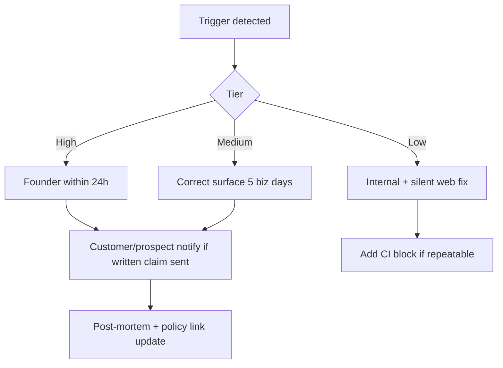

# AI crisis communication template — OS Kitchen

**Policy:** `ai-crisis-communication-template-v1`  
**Date:** 2026-06-02  
**Owner:** Founder + Marketing + Legal (review)  
**Scope:** **Reputational / claims corrections** when AI or product capabilities are **misstated** publicly — distinct from SEV-1 production incidents  
**Status:** Active template — **0 crises executed · pre-revenue baseline**  
**Parent:** [`ai-honesty-policy.md`](./ai-honesty-policy.md) · [`incident-response-process.md`](./incident-response-process.md) · [`sales-safe-claims-registry.md`](./sales-safe-claims-registry.md)

Use this playbook when OS Kitchen **overclaims AI capabilities**, **hides preview/BETA labels in public media**, or **must retract marketing copy** — per [`ai-honesty-policy.md`](./ai-honesty-policy.md) § “When we get it wrong.”

**Not for:** Database outages, payment bugs, or security breaches — use [`incident-response-process.md`](./incident-response-process.md) first; add AI honesty correction only if claims were involved.

**Honesty rule:** Corrections must be **specific, dated, and narrower than the original overclaim** — never replace one exaggeration with another.

---

## Trigger scenarios

| ID | Scenario | Example | Comms tier |
|----|----------|---------|:----------:|
| **C1** | Forbidden phrase published | “Untouchable AI moat,” “SOC 2 certified,” “AGI manager” | **High** |
| **C2** | Maturity mislabel | LIVE integration claimed; actually BETA | **High** |
| **C3** | Demo / webinar slip | Kitchen camera shown without preview banner; synthetic as live | **Medium** |
| **C4** | Sales deck / email overreach | Guaranteed margin lift; autonomous purchasing | **Medium** |
| **C5** | Press / social misquote | Journalist amplifies inaccurate capability | **Medium** |
| **C6** | CI miss merged to `main` | `verify-claims` should have blocked phrase | **Low** (internal-first) |
| **C7** | Module outage misread as “AI failed operators” | Briefing empty due to config — not model hallucination | **Low** |



---

## Response SLA (claims incidents)

| Tier | Ack internal | Correct public surface | Notify written recipients |
|:----:|:------------:|:----------------------:|:-------------------------:|
| **High** | **4h** business | **24h** | **48h** if LOI/proposal affected |
| **Medium** | **1 business day** | **5 business days** | Case-by-case |
| **Low** | **2 business days** | Next deploy | Not required |

Aligned with [`ai-honesty-policy.md`](./ai-honesty-policy.md): correct within **5 business days** minimum; **High** tier accelerates.

---

## Incident log (fill per event)

| Field | Value |
|-------|-------|
| **Incident ID** | `AI-CRISIS-YYYY-MM-DD-NN` |
| **Detected by** | |
| **Date detected** | |
| **Scenario ID** | C1–C7 |
| **Tier** | High / Medium / Low |
| **Incorrect claim (exact quote)** | |
| **Surfaces affected** | Web / deck / email / webinar / press / social |
| **Audience exposed** | Prospects / customers / public / internal only |
| **Correct statement** | |
| **Root cause** | Human error / demo script / CI gap / third-party quote |
| **Owner** | Founder |
| **Closed date** | |

---

## Step-by-step response

| Step | Action | Owner |
|:----:|--------|-------|
| 1 | **Stop amplification** — pause ads, unpublish post, pull deck slide | Marketing |
| 2 | **Capture evidence** — screenshot, URL, email PDF, recording timestamp | Marketing |
| 3 | **Draft correction** — use templates below; Legal review if High tier | Founder |
| 4 | **Fix surfaces** — deploy copy change; run `MARKETING_CLAIMS_STRICT=1 npm run verify-claims` | Eng + Marketing |
| 5 | **Notify** — email prospects/customers who received incorrect claim in writing | CS / Founder |
| 6 | **Public correction** — LinkedIn / changelog / `/legal/ai-honesty` footnote if public | Marketing |
| 7 | **Post-mortem** — 30 min; CI phrase add; update training deck | Founder + Eng |
| 8 | **Log** — append to internal incident log; optional execution-log note | PM |

**Escalate to SEV-1** if incident involves tenant data, payments, or cross-tenant exposure — parallel track in [`incident-response-process.md`](./incident-response-process.md).

---

## Template A — Internal alert (Slack / email)

**Subject:** `[AI-CRISIS] {tier} — incorrect claim: {short summary}`

```text
Team — we identified an inaccurate AI/product claim on {surface}.

Incorrect: "{exact quote}"
Correct: "{replacement language}"
Tier: {High/Medium/Low}
Actions:
- {Owner} fixes {URL/deck} by {date}
- Do not forward old deck/link — use {corrected URL}
- Sales: use sales-limitation-sheet.md for live calls until fix ships

Policy: docs/ai-honesty-policy.md
Log ID: AI-CRISIS-{date}
```

---

## Template B — Prospect / customer correction email

**Subject:** Correction regarding OS Kitchen AI capabilities

```text
Hi {Name},

I'm writing to correct information we shared on {date} via {email/deck/demo}.

We stated: "{incorrect claim}"

That was inaccurate. The accurate description is:

"{correct claim — e.g., 'Our daily briefing is deterministic from your workspace data, not autonomous AGI. Kitchen Camera runs in preview mode until you connect hardware. DoorDash integration is BETA, not LIVE.'}"

We corrected {website/deck/material} on {date}. We apologize for the confusion.

If you have questions, reply here or see our AI honesty policy: {link to /legal/ai-honesty or ai-honesty-policy.md public page when live}.

{Founder name}
OS Kitchen
```

**Do not:** Offer credits or SLA concessions not in contract unless Legal approves.

---

## Template C — Public LinkedIn / social correction

```text
Correction — we overstated OS Kitchen AI capabilities in a recent post.

We said: "{short incorrect phrase}"
Accurate: "{honest replacement — e.g., '7 proprietary AI modules in production at qualified maturity — preview/synthetic modes labeled in product'}"

We've updated the original material. Full policy: {URL}

#RestaurantTech #AIHonesty
```

Pin correction if original post had high reach. Do **not** delete original without correction note (transparency).

---

## Template D — Press / analyst statement (High tier)

```text
FOR IMMEDIATE RELEASE — Statement correction

OS Kitchen issued materials on {date} that implied {incorrect capability}.

We clarify:
- {Bullet 1 — factual limit}
- {Bullet 2 — maturity label}
- {Bullet 3 — no customer impact OR describe impact honestly}

OS Kitchen maintains a public AI honesty policy and automated claims review in CI.
Contact: {founder email}

###
```

Legal review required before send.

---

## Template E — Changelog / website footnote

```markdown
### Correction ({YYYY-MM-DD})

We corrected copy on {page/feature} that implied {incorrect claim}.
Accurate description: {correct claim}. See [AI honesty policy](/legal/ai-honesty).
```

---

## Correct replacement phrases (quick reference)

| Overclaim | Use instead |
|-----------|-------------|
| “Autonomous AI manager” | “Deterministic daily briefing from workspace signals” |
| “Untouchable moat” | “7 proprietary AI modules in production at qualified maturity” |
| “Live computer vision” | “Camera-ready platform; preview mode until hardware connected” |
| “All integrations LIVE” | “BETA until Integration Health smoke PASS — see limitation sheet” |
| “Guaranteed ROI / margin lift” | “Illustrative ROI calculator — not a guarantee” |
| “SOC 2 certified” | “SOC 2 readiness assessment internal — not certified” |
| “Trusted by hundreds of restaurants” | “Recruiting design partners — 0 signed customers as of {date}” |

Source: [`sales-safe-claims-registry.md`](./sales-safe-claims-registry.md) · [`ai-moats-honest-positioning.md`](./ai-moats-honest-positioning.md)

---

## Post-mortem checklist

| # | Item | Done |
|---|------|:----:|
| 1 | Root cause category (human / process / tool) | ☐ |
| 2 | `verify-claims` extended if new phrase | ☐ |
| 3 | Demo script / webinar deck updated | ☐ |
| 4 | [`forbidden-claims-training.md`](../marketing/forbidden-claims-training.md) refresh scheduled | ☐ |
| 5 | [`mvp-marketing-dashboard.md`](./mvp-marketing-dashboard.md) red alert logged | ☐ |
| 6 | Policy version bump if material | ☐ |

---

## Roles

| Role | Responsibility |
|------|----------------|
| **Founder** | Tier High ack; external statements; customer emails |
| **Marketing** | Surface fixes; social corrections; changelog |
| **Engineering** | CI block; deploy copy fixes |
| **Sales** | Stop using old materials; limitation sheet on calls |
| **Legal** | Review High tier external comms (when engaged) |

---

## Related documents

| Doc | Use |
|-----|-----|
| [`ai-honesty-policy.md`](./ai-honesty-policy.md) | Public commitment + “when we get it wrong” |
| [`incident-response-process.md`](./incident-response-process.md) | Production SEV incidents |
| [`webinar-strategy.md`](./webinar-strategy.md) | Demo slip prevention |
| [`demo-video-script-today.md`](./demo-video-script-today.md) | Recording honesty |
| [`feature-announcement-template.md`](./feature-announcement-template.md) | Avoid overclaim on launch |

---

## Revision history

| Version | Date | Change |
|---------|------|--------|
| `ai-crisis-communication-template-v1` | 2026-06-02 | Initial templates — Task 112 |

**Next action:** Store blank incident log tab in marketing drive; link from founder onboarding checklist.
