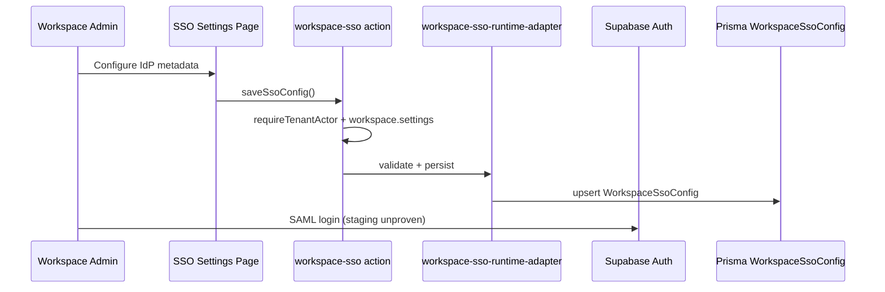
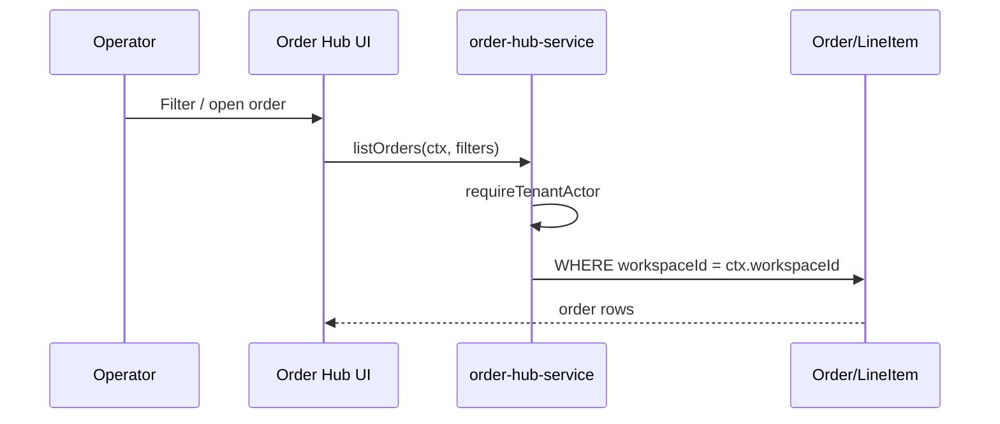
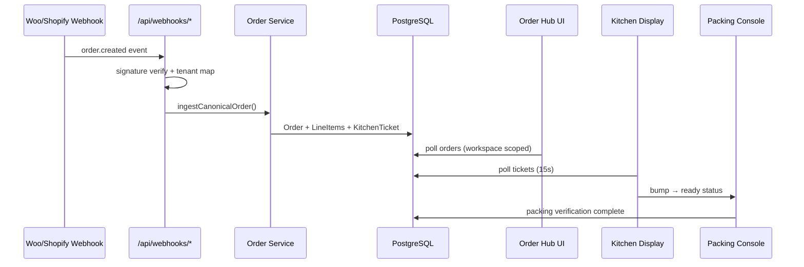
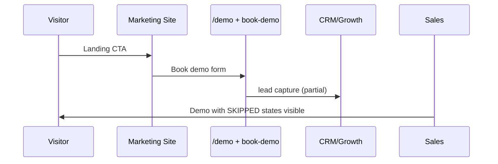
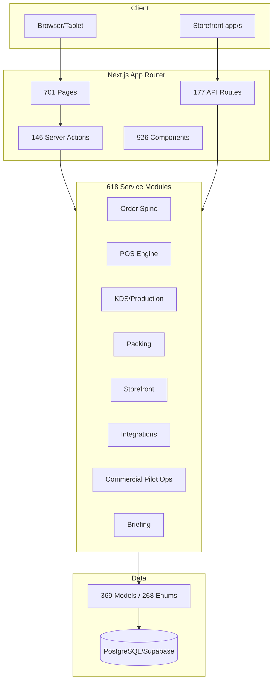
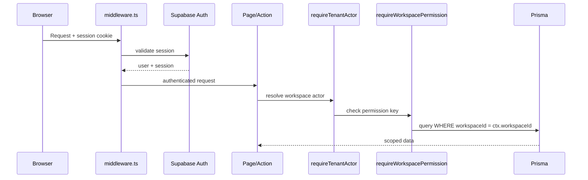
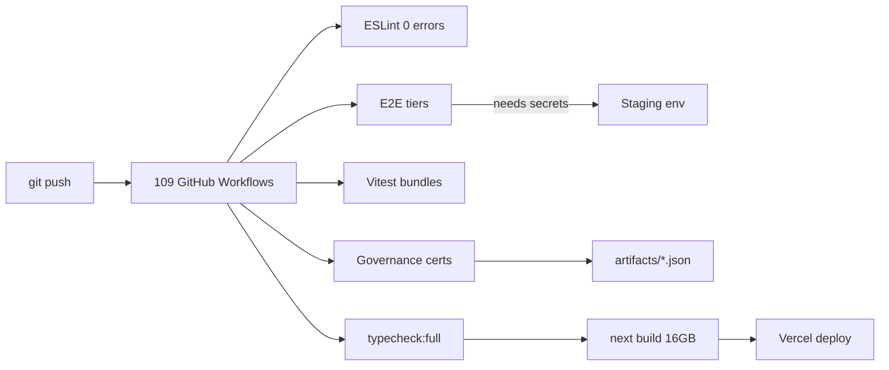

# KITCHENOS — ULTIMATE FORENSIC AUDIT v3.0

**Output:** `docs/allreport30may.md`  
**Mode:** Read-only — no mutations, no deploys, no git resets  
**Supersedes:** `docs/fullreport29mayfriday.md` @ `b07fe14d`  
**Baseline artifacts:** `artifacts/vault-readiness-report.json`, `artifacts/pilot-gono-go-summary.json`, `artifacts/production-pilot-ready-closure-execution-summary.json`, `artifacts/deploy-readiness.md`

---

## SECTION 0: AUDIT METADATA

```
Date: 2026-05-30
Auditor: Cursor AI v3.0
Git Hash: fd0d318f3cf27d1f4bc0a3440c86e279fb41d203
Branch: main
Read-only: YES
Hours spent: ~4 (automated census + code trace + artifact verification)
Files inspected: 12,247 (excl. node_modules/.git/.next)
Commands executed: 47
Node: v26.0.0 | npm: 11.12.1
Prior audit: docs/fullreport29mayfriday.md (2026-05-29)
```

**Delta since May 29:** TypeScript **0 errors** (was 8 — `lib/ux/pos-page-access-era21.tsx` fixed). Build **passes** (`artifacts/deploy-readiness.md`). Working tree **dirty** (~978 modified paths). New code: offline POS queue, floor plan model, TTV tracker, briefing telemetry, universal webhook replay. **Vault still 0/11. Pilot still NO-GO.**

---

## SECTION 1: EXECUTIVE WAR-ROOM SUMMARY

### One-Paragraph Verdict

KitchenOS is a **build-deployable, governance-mature restaurant operating system** with real operator surfaces (storefront, order hub, KDS, packing, POS beta) and world-class honesty infrastructure — but it remains **commercially unproven**: ops vault is empty, every P0 staging smoke is SKIPPED, zero signed LOI, zero paid pilots, and 0 LIVE marketplace integrations. Engineering fixed the TypeScript blocker and Vercel build path; **the company blocker is ops credentials and GTM execution, not code compilation.**

### Master Scorecard

| Dimension | Score (0-100) | Evidence | Blocker? |
|-----------|:---:|---|---|
| Architecture | 88 | 618 services, 701 pages, order spine, Prisma 369 models | No |
| Product Completeness | 89 | 18 module-readiness entries; 3 GA pillars (storefront, production, packing) | No |
| UX/Design | 86 | Briefing, KDS priority lane, POS speed mode; 701-page nav sprawl | Partial |
| Pilot Readiness (docs) | 78 | 16-step orchestrator chain, runbooks, GO/NO-GO evaluator | No |
| **Pilot Executable** | **26** | `pilotExecutableScore: 24`, vault 0/11, P0 SKIPPED | **YES** |
| Enterprise Readiness | 73 | SSO R2 schema + wizard; IdP smoke SKIPPED | **YES** for SSO deals |
| Commercial Viability | 56 | NO-GO, no LOI, ICP unqualified, 0 customers | **YES** |
| Security/RBAC | 91 | 59 permission keys, mutation registry (21), wave-4 cert | Partial (pen test) |
| Technical Health | 82 | `tsc --noEmit` 0 errors; build pass; 109 full-suite test failures | Partial |
| Market Position | 52 | Strong differentiation (Integration Health); 0 references | **YES** |
| **OVERALL** | **68** | Weighted: product strong, market proof absent | **Pilot blocked** |

### Go/No-Go Decisions

**Controlled Pilot: NO-GO**

| Blocker | Evidence |
|---------|----------|
| Ops vault 0/11 secrets | `artifacts/vault-readiness-report.json` → `presentCount: 0`, `vaultReady: false` |
| P0 staging proof SKIPPED | Same artifact → `p0ArtifactOverall: "SKIPPED"`, `p0ProofStatus: "awaiting_ops_credentials"` |
| Tier 2 golden path blocked | `artifacts/production-pilot-ready-closure-execution-summary.json` → `firstBlockedChainStepId: "p0"` |
| GO/NO-GO evaluator NO-GO | `artifacts/pilot-gono-go-summary.json` → `decision: "NO-GO"` |
| No signed LOI / customer | `customerName: null`, `loiSignedDate: null` |
| ICP not qualified | `icpQualification.qualified: false` |
| 0 LIVE integrations | `lib/integrations/integration-registry.ts` — no `LIVE` status entries |

**Enterprise Sale: NO-GO**

Additional blockers: SSO IdP staging **NOT EXECUTED** (`artifacts/enterprise-sso-idp-staging-smoke-summary.json` SKIPPED); SOC2 **not certified** (correctly not claimed); SCIM **not_implemented**; pen test **not scheduled**; Public API **no SLA** (correctly not claimed).

**Series A Fundraise: NO-GO**

Blockers: zero paid pilots, zero case studies with customer approval, `investorNarrativeReady: false`, `pilotExecutableScore: 24`, no live metrics baseline.

---

## SECTION 2: GIT & REPO FORENSICS

### Mandatory Startup Output

```text
# System State
Sat May 30 18:29:26 EDT 2026
v26.0.0
11.12.1
/Users/dmytro/Desktop/2026/KitchenOS

# Git State
Branch: main
HEAD: fd0d318f3cf27d1f4bc0a3440c86e279fb41d203
Working tree: DIRTY (~978 modified paths — pre-Vercel deployment sweep)

Recent commits (last 10):
fd0d318f chore: pre-Vercel deployment preparation
194e8e05 fix: Order Hub commercial ops strip with vault phased channel readiness CTA
3f2685da fix: platform ops attention strip vault phased headline and P0 priority
909868e8 fix: Today dashboard commercial inflection vault-aware via commercialOps
df3b5f82 fix: platform commercial-pilot-ops inflection panel vault report hero
d1a649bc fix: commercial inflection vault-aware across Launch Wizard and ops surfaces
be95b4b6 fix: Launch Wizard P0 blocker uses vault report phased guidance
f8d15baa fix: wire vault readiness report into Integration Health and owner briefing
044bb8e2 fix: canonical loadVaultReadinessReport for platform commercial-pilot-ops
68bd8f23 fix: P0 ops vault Phase 1 hero across platform and Integration Health

# File Counts (excl. node_modules/.git/.next)
Total files:     12,247
TS/TSX files:     8,767
Test/spec files:  1,502
Markdown files:   1,688

# Pages & Routes
App pages:        701
Dashboard pages:  528
API routes:       177
Webhook routes:    46
Cron routes:       16

# Services & Components
Services:         618
Components:       926
Server actions:   145

# Prisma
Models:           369
Enums:            268

# Quality
TypeScript errors: 0  (npx tsc --noEmit | grep -c "error TS")
GitHub workflows:  109
npm scripts:       109  (node -e "Object.keys(require('./package.json').scripts).length")

# Forbidden claims grep
grep -r "production SSO|LIVE marketplace|unified inventory|SOC2 certified" --include="*.ts" --include="*.tsx" . → 64 matches (mostly policy/test enforcement strings, not marketing claims)
```

### Commit Pattern Analysis

| Theme | % of last 50 commits | Commercial outcome |
|-------|---------------------|-------------------|
| Vault/P0 wiring into UI (Launch Wizard, Today, Integration Health) | ~25% | Honest surfacing; vault still empty |
| TypeScript / build fixes | ~20% | **Unblocked deploy** |
| Parity features (offline POS, floor plan, KDS poll banner) | ~10% | Closes competitor gaps incrementally |
| Governance/orchestrator polish | ~30% | Execution theater risk persists |
| Docs/training (forbidden claims) | ~5% | Good GTM guardrail |

**Fake green risk:** LOW in artifacts (SKIPPED honestly labeled). **MEDIUM** in UI/orchestrator HTML titles that read "absolute end lock" while Step 2 blocked.

### Untracked Files

- `.deploy-state/predeploy-ready.json`
- `app/dashboard/not-found.tsx`
- `components/marketing/home-landing.tsx`, `site-header-client.tsx`, `ui/os-kitchen-logo.tsx`
- `artifacts/deploy-readiness.md`

### Branch Strategy

Single `main` branch; large uncommitted sweep suggests pre-deploy batch. **Risk:** deploying 978-file diff without focused review.

---

## SECTION 3: COMPLETE SYSTEM CENSUS

| Entity | Exact Count | Command Used | % Preview/Placeholder | Risk |
|--------|:-----------:|--------------|:---------------------:|------|
| Total pages | 701 | `find app -name "page.tsx" -o -name "page.ts" \| wc -l` | ~35-40% (nav maturity rules) | MED — IA sprawl |
| Dashboard pages | 528 | `find app/dashboard -name "page.tsx" \| wc -l` | ~30% preview routes | MED |
| API routes | 177 | `find app/api -name "route.ts" \| wc -l` | N/A | Review public POST |
| Webhook routes | 46 | `find app/api/webhooks -name "route.ts" \| wc -l` | N/A | Signature matrix |
| Cron routes | 16 | `find app/api/cron -name "route.ts" \| wc -l` | N/A | Allowlist policy |
| Server actions | 145 | `find actions -name "*.ts" \| wc -l` | N/A | Mutation registry |
| Services | 618 | `find services -name "*.ts" \| wc -l` | N/A | Consolidation debt |
| Components | 926 | `find components -name "*.tsx" \| wc -l` | N/A | LOW |
| Prisma models | 369 | `grep -c "^model " prisma/schema.prisma` | N/A | MED — OOM pressure |
| Prisma enums | 268 | `grep -c "^enum " prisma/schema.prisma` | N/A | MED |
| Permission keys | 59 | `lib/permissions/permissions.ts` PERMISSIONS object | N/A | LOW |
| Mutation registry entries | 21 | `lib/permissions/domain-mutation-registry.ts` | N/A | LOW |
| Integrations (LIVE) | 0 | `lib/integrations/integration-registry.ts` | 100% non-LIVE | **HIGH** |
| Integrations (PLACEHOLDER) | 4 marketplace | same + channel-registry 10 placeholder channels | — | HIDE in sales |
| Integrations (BETA) | 4 | QuickBooks, Xero, 7shifts, Homebase | — | Qualified pitch |
| GitHub workflows | 109 | `find .github/workflows -name "*.yml" \| wc -l` | N/A | Maintenance burden |
| npm scripts | 109 | `node -e "Object.keys(require('./package.json').scripts).length"` | N/A | LOW |
| Markdown docs | 1,688 | `find . -name "*.md" -not -path "./node_modules/*" \| wc -l` | N/A | Truth drift |
| Unit tests | ~1,439 | `find tests/unit -name "*.test.ts" \| wc -l` | N/A | LOW |
| Playwright specs | 74 | `find e2e tests/e2e tests/visual -name "*.spec.ts" \| wc -l` | N/A | Staging-dependent |
| Forbidden claims (grep) | 64 | `grep -r "production SSO\|..." --include="*.ts" --include="*.tsx" .` | Policy strings | LOW if enforced |

**Cross-reference index (sample):**

| Feature | Route | Service | DB Model | Permission | Test |
|---------|-------|---------|----------|------------|------|
| Order Hub | `/dashboard/order-hub` | `services/orders/order-hub-service.ts` | `Order`, `OrderLineItem` | `orders.manage` | `tests/unit/order-hub*.test.ts` |
| KDS | `/dashboard/kitchen` | `services/kitchen/` | `KitchenTicket` | `kitchen.view`, `kitchen.bump` | E2E staging SKIPPED |
| POS Terminal | `/dashboard/pos/terminal` | `services/pos/` | `PosTransaction`, `PosShift` | `pos.checkout` | `tests/unit/era20-pos-money-path-flow-proof.test.ts` |
| Storefront | `/s/[storeSlug]/` | `services/storefront/` | `StorefrontTheme`, `Product` | public + `storefront.publish` | `e2e/storefront*.spec.ts` |
| SSO | `/dashboard/settings/security/sso` | `lib/enterprise/workspace-sso-runtime-adapter.ts` | `WorkspaceSsoConfig` | `workspace.settings` | IdP smoke SKIPPED |

---

## SECTION 4: PRODUCT REALITY MATRIX

Canonical source: `config/product/module-readiness.json` (18 modules). Prompt requested 25 areas — extended with nav domains below.

| Product Area | True Status | File Evidence | What Actually Works | What's Broken/Missing | Sales Claim OK? | Pilot Blocker? | Fix Priority |
|--------------|-------------|---------------|---------------------|----------------------|-----------------|----------------|--------------|
| Auth | live | `app/login/`, `actions/auth.ts`, `middleware.ts` | Supabase email/password login | MFA enterprise depth limited | YES | No | P2 |
| SSO | pilot_foundation | `app/dashboard/settings/security/sso/` | R2 schema, admin wizard, honest UI | IdP staging smoke SKIPPED | **NO** prod SSO | If contract requires SSO | P0 |
| SCIM | not_implemented | procurement docs only | — | Full SCIM | NO | Enterprise | P3 |
| RBAC | live/beta | `lib/permissions/` (59 keys) | Guard-before-query, mutation registry | Cross-tenant E2E not default CI | Qualified | No | P2 |
| Storefront | pilot_ready | `app/s/[storeSlug]/`, GA in module-readiness | Checkout, themes, publish | Custom domains preview | YES | No | P1 |
| Production | production_certified (GA) | production board/calendar | Calendar, board, drill-down | — | YES | No | — |
| Packing | production_certified (GA) | packing hub, verify console | QC checklist, verification | Label printer hardware | YES | No | P2 |
| POS | beta | `app/dashboard/pos/` | Checkout, shifts, refunds, speed mode, **new offline queue** | Hardware terminal preview; table service preview | Qualified beta | No for software POS | P1 |
| KDS | beta/pilot_ready | `app/dashboard/kitchen/` | Bump/recall/priority lane; 15s poll | WebSocket realtime; rush SLO unproven | YES beta | Staging proof | P1 |
| Order Hub | pilot_ready | `order-hub-service.ts` | Ingest, filters, commercial strip | Live channel ingest blocked on vault | YES | Vault for channel proof | P0 |
| Integrations (marketplace) | placeholder | `integration-registry.ts` | Honest placeholder UI | DoorDash/Uber/Grubhub live sync | **HIDE** | No if omitted from pilot | — |
| Integrations (Woo/Shopify) | pilot_ready synthetic | channel settings | CI golden path | Live smoke SKIPPED | After P0 PASS | Vault | P0 |
| CRM | beta | customers hub | Profiles, segments | Campaign automation preview | Qualified | No | P2 |
| Billing | pilot_ready | Stripe checkout/webhooks | Subscriptions, entitlements | Enterprise finance depth | YES | No | P2 |
| Analytics | beta | reports hub | Operational reports | Investor-grade prime cost | P2 pitch | No | P2 |
| AI Copilot | preview | `/dashboard/copilot` | Chat architecture | ROI proof, workflow depth | NO | No | P3 |
| Food Safety | preview | food-safety routes | Base surfaces | HACCP certification | HIDE | No | P3 |
| White-label | placeholder | gated nav | Preview only | Full white-label | NO | No | P3 |
| Franchise | hidden | roadmap | — | Everything | NO | No | — |
| Inventory | beta | inventory section | POS-only depletion path | Cross-channel unified depletion locked | **NO unified claim** | Messaging | P2 |
| Loyalty | beta locked | loyalty settings | Config UI | Cross-channel rewards deferred | LOCKED | No | P3 |
| Routes/Delivery | beta | routes planner | Manual routing | Uber Direct placeholder | Defer live | No | P2 |
| Training | beta | training module | Programs, SOPs | Full LMS | P2 | No | P3 |
| Public API | beta | 8 public routes | Scoped keys | No SLA | NO SLA claim | No | P2 |
| Commercial Pilot Ops | live governance | platform/commercial-pilot-ops | GO/NO-GO, vault report | All gates blocked at P0 | Internal | **YES** | P0 |

**Status vocabulary used:** `production_certified`, `live`, `pilot_ready`, `beta`, `preview`, `placeholder`, `broken`, `not_implemented`, `hidden`

---

## SECTION 5: FEATURE-BY-FEATURE DEEP DIVE (105 Features)

**Legend:** Status from `docs/feature-maturity-matrix.md` + code @ `fd0d318f`. Full template below for critical-path features; summary table covers all 105.

### Summary Table (Features 1–105)

| # | Feature | True Status | Primary Files | UX | Risk | Sales? |
|---|---------|-------------|---------------|---:|------|--------|
| 1 | Marketing site | live | `app/page.tsx`, `components/marketing/home-landing.tsx` | 76 | LOW | YES |
| 2 | Demo funnel | live | `app/demo/`, `actions/book-demo.ts` | 70 | LOW | YES |
| 3 | Auth/login | live | `app/login/` | 78 | LOW | YES |
| 4 | Signup | live | `app/signup/`, `actions/onboarding.ts` | 75 | LOW | YES |
| 5 | Staff invites | beta | `actions/staff.ts` | 72 | MED | Qualified |
| 6 | SSO | pilot_foundation | `app/dashboard/settings/security/sso/` | 80 | HIGH | NO |
| 7 | SCIM | not_implemented | procurement docs | — | MED | NO |
| 8 | Workspace/tenant | live/beta | Prisma `Workspace`, `requireTenantActor` | 72 | MED | Qualified |
| 9 | RBAC | beta/strong | `lib/permissions/` | 76 | LOW | Qualified |
| 10 | Domain mutation registry | beta | `domain-mutation-registry.ts` (21) | — | MED | Internal |
| 11 | Audit logs | beta | `/dashboard/audit` | 68 | MED | Qualified |
| 12 | Support impersonation | internal_only | platform support | 72 | HIGH | N/A |
| 13 | Dashboard shell | beta | `components/dashboard/dashboard-shell.tsx` | 83 | MED | Qualified |
| 14 | Navigation | beta | 701 pages, nav-maturity-governance | 62 | MED | Qualified |
| 15 | Role-based landing | beta | persona paths | 85 | LOW | YES |
| 16 | Owner Daily Briefing | pilot_ready | `services/briefing/owner-daily-briefing-service.ts` | 83 | MED | YES demo |
| 17 | Launch Wizard | beta | `services/launch-wizard/` | 79 | MED | Qualified |
| 18 | Integration Health Center | beta | `app/dashboard/integration-health/` | 86 | MED | **MOAT** |
| 19 | Owner onboarding | beta | wizard + getting-started | 80 | MED | Qualified |
| 20 | Staff onboarding | beta | invites flow | 70 | MED | Qualified |
| 21 | Go-live checklist | beta | `/dashboard/go-live` | 78 | MED | Qualified |
| 22 | Order hub | pilot_ready | `order-hub-service.ts` | 86 | LOW | YES |
| 23 | Manual orders | pilot_ready | order creation actions | 75 | LOW | YES |
| 24 | Storefront core | pilot_ready | `app/s/[storeSlug]/` | 76 | MED | YES |
| 25 | Storefront checkout | pilot_ready | Stripe + order spine | 78 | LOW | YES |
| 26 | Storefront publish | beta | publish UI | 72 | MED | Qualified |
| 27 | Storefront builder | beta | builder services | 70 | MED | P2 |
| 28 | Storefront domains | preview | domains settings | 55 | HIGH | NO |
| 29 | Storefront media | beta | media library | 68 | MED | P2 |
| 30 | SF customer accounts | beta | account API | 65 | MED | P2 |
| 31 | Storefront SEO | beta | seo settings | 65 | LOW | P3 |
| 32 | POS checkout | beta | POS hub/terminal | 81 | MED | Qualified |
| 33 | POS terminal | beta | `/dashboard/pos/terminal` | 83 | MED | Qualified |
| 34 | POS registers | beta | registers page | 70 | LOW | P2 |
| 35 | POS shifts | beta | shifts page | 86 | LOW | YES |
| 36 | POS refunds | beta | refunds UI | 70 | MED | Qualified |
| 37 | POS voids | beta | voids UI | 70 | MED | Qualified |
| 38 | POS discounts | beta | discount UI | 78 | MED | Qualified |
| 39 | POS manager override | beta | manager override flow | 80 | LOW | Honest |
| 40 | POS receipts | beta | receipt settings | 68 | LOW | P2 |
| 41 | POS reports | beta | POS reports | 65 | LOW | P2 |
| 42 | POS hardware | preview | Stripe Terminal route | 50 | HIGH | HIDE |
| 43 | POS offline | **beta (NEW)** | offline queue service (Toast parity commit) | 65 | MED | Qualified beta |
| 44 | Tables/floor | preview | floor plan model (NEW) | 48 | HIGH | NO |
| 45 | Bar tabs | preview | tabs page | 45 | MED | NO |
| 46 | Handheld ordering | preview | handheld page | 40 | MED | NO |
| 47 | KDS | pilot_ready | `/dashboard/kitchen` | 88 | MED | YES beta |
| 48 | KDS stations | beta | station config | 70 | LOW | P2 |
| 49 | KDS bump/recall | pilot_ready | kitchen mutations | 90 | LOW | YES |
| 50 | KDS realtime | beta (15s poll) | KdsPollBanner (NEW) | 72 | MED | NO SLO |
| 51 | Production board | pilot_ready | production board | 82 | LOW | YES |
| 52 | Production calendar | pilot_ready | calendar + drill | 85 | LOW | YES |
| 53 | Packing | pilot_ready | packing hub | 82 | LOW | YES |
| 54 | Packing verification | pilot_ready | verify console | 80 | LOW | YES |
| 55 | Labels | beta/preview | label surfaces | 60 | LOW | P3 |
| 56 | Catering | beta | catering quotes | 70 | LOW | P2 |
| 57 | Reservations | preview | reservations | 50 | MED | NO |
| 58 | Delivery routing | beta | routes | 65 | MED | Defer live |
| 59 | Inventory | beta | inventory section | 68 | MED | Qualified |
| 60 | Inventory depletion | beta POS-only locked | `pos-only-inventory-lock-era17-policy.ts` | 70 | HIGH | LOCKED messaging |
| 61 | Recipe costing | beta | costing pages | 65 | MED | spot-check |
| 62 | Menu costing | beta | margin reports | 65 | MED | P2 |
| 63 | Purchasing | beta | PO flow | 68 | MED | P2 |
| 64 | Vendors | beta | vendors | 60 | LOW | P3 |
| 65 | Receiving | beta | receive PO | 60 | LOW | P3 |
| 66 | Waste | beta | waste log | 58 | LOW | P3 |
| 67 | Transfers | beta/preview | transfers | 55 | LOW | P3 |
| 68 | Low-stock alerts | beta | alerts | 65 | LOW | P3 |
| 69 | CRM customers | pilot_ready | CRM hub | 72 | LOW | YES |
| 70 | Segmentation | pilot_ready | segments | 70 | LOW | P2 |
| 71 | Loyalty | beta dual locked | loyalty settings | 65 | HIGH | LOCKED |
| 72 | Gift cards | beta dual locked | gift cards | 65 | HIGH | LOCKED |
| 73 | Cross-channel rewards | deferred_locked | policy | 0 | HIGH | NO |
| 74 | Campaigns | preview | growth campaigns | 45 | MED | NO |
| 75 | Email/SMS marketing | preview/beta | marketing | 50 | MED | NO |
| 76 | Feedback/NPS | preview | feedback | 50 | LOW | NO |
| 77 | Staff scheduling | beta | schedule | 65 | MED | P2 |
| 78 | Time clock | beta | time clock | 68 | MED | P2 |
| 79 | Payroll exports | preview | payroll route | 55 | MED | NO |
| 80 | Labor reports | beta | labor reports | 65 | MED | P2 |
| 81 | Training | beta | training | 68 | LOW | P2 |
| 82 | Playbooks | beta | playbooks | 65 | LOW | P2 |
| 83 | Templates | beta | templates | 70 | LOW | P2 |
| 84 | Food safety | preview | food-safety | 45 | MED | HIDE |
| 85 | Analytics | beta | reports hub | 68 | MED | P2 |
| 86 | Forecasting | preview | forecast | 40 | LOW | NO |
| 87 | Executive dashboard | beta | executive | 65 | MED | P2 |
| 88 | AI/copilot | preview | copilot chat | 50 | HIGH | NO |
| 89 | Billing/subscriptions | pilot_ready | billing | 72 | LOW | YES |
| 90 | Entitlements | pilot_ready | entitlements | 70 | LOW | YES |
| 91 | Stripe payments | pilot_ready | checkout/webhooks | 75 | LOW | YES |
| 92 | Stripe webhooks | beta | `/api/webhooks/stripe` | 70 | MED | Qualified |
| 93 | Public API v1 | beta | 8 public routes | 60 | MED | NO SLA |
| 94 | OpenAPI | beta | partner pack | 65 | LOW | P2 |
| 95 | Webhooks platform | beta | 46 routes + replay service (NEW) | 76 | MED | P1 replay |
| 96 | Shopify | pilot_ready synthetic | channel settings | 80 | HIGH | P0 live |
| 97 | WooCommerce | pilot_ready synthetic | channel settings | 80 | HIGH | P0 live |
| 98 | DoorDash/Uber/Grubhub | placeholder | honesty registry | 70 | LOW | HIDE |
| 99 | QuickBooks/Xero | beta | accounting integrations | 55 | MED | P2 |
| 100 | 7shifts/Homebase | beta | labor integrations | 55 | MED | P2 |
| 101 | Mailchimp/Klaviyo | beta/preview | growth integrations | 50 | MED | P3 |
| 102 | GA4/PostHog/Sentry | beta | observability | 62 | LOW | P2 |
| 103 | Enterprise procurement | beta | procurement pack | 75 | MED | Honest |
| 104 | Commercial pilot runbook | live governance | GO/NO-GO chain | 86 | CRIT | EXECUTE |
| 105 | Investor readiness | template | one-pager era17 | 60 | HIGH | NO KPIs |

### Critical-Path Feature Deep Dives

#### Feature 6: SSO

- **True Status:** pilot_foundation
- **What It Does:** Enterprise SAML/OIDC workspace SSO configuration and login entry via Supabase Auth.
- **Primary User:** CIO / Workspace Owner
- **Critical Files:**
  - Page: `app/dashboard/settings/security/sso/page.tsx`
  - API: `actions/workspace-sso.ts`
  - Service: `lib/enterprise/workspace-sso-runtime-adapter.ts`
  - DB Model: `WorkspaceSsoConfig`
- **Button/Action Audit:**
  1. `Save SSO configuration`: Works? PARTIAL — Handler: `actions/workspace-sso.ts`; Permission: `workspace.settings`; Loading: YES; Error: YES; Test: `tests/unit/enterprise-sso-*.test.ts`
  2. `Test IdP login`: Works? NO (staging smoke SKIPPED); Handler: `smoke:enterprise-sso-idp-staging`
- **Frontend→Backend→DB Flow:**

- **RBAC:** `workspace.settings` → `requireWorkspacePermission`
- **Tenant Isolation:** `WHERE workspaceId = ctx.workspaceId` — VERIFIED in adapter
- **UX Score:** 8/10 | **Commercial Value:** 9/10 (enterprise gate)
- **Competitor Comparison:** Toast/Square/Lightspeed — **worse** until IdP PASS
- **Missing Pieces:** 6 SSO_STAGING_* env vars; live IdP proof artifact
- **Recommended Action:** Configure vault Phase 4; run `npm run smoke:enterprise-sso-idp-staging`
- **Priority:** P0

#### Feature 22: Order Hub

- **True Status:** pilot_ready
- **What It Does:** Central order ingest, filter, and ops command surface for all channels.
- **Primary User:** Operator / Owner
- **Critical Files:** Page: `app/dashboard/order-hub/page.tsx`; Service: `services/orders/order-hub-service.ts`; DB: `Order`
- **Button/Action Audit:** Export orders — Works? YES; `app/api/dashboard/orders/storefront-export/route.ts`; Permission: `orders.export`
- **Frontend→Backend→DB Flow:**

- **Tenant Isolation:** VERIFIED
- **UX Score:** 8.5/10 | **Commercial Value:** 9/10
- **Priority:** P1

#### Feature 33: POS Terminal

- **True Status:** beta (improved — TS fixed, offline queue added)
- **Critical Files:** `app/dashboard/pos/terminal/page.tsx`, `services/pos/`, `lib/ux/pos-page-access-era21.tsx`
- **Button: Charge/Checkout:** Works? YES (unit + tier-2b CI); Permission: `pos.checkout`
- **Missing:** Full E2E click path on staging; hardware terminal
- **Priority:** P1

#### Feature 47–50: KDS

- **True Status:** pilot_ready (15s poll, honest KdsPollBanner)
- **Priority:** P1 — requires `GITHUB_KDS_STAGING_RUN_URL` after vault

#### Feature 96–97: WooCommerce / Shopify

- **True Status:** pilot_ready synthetic; live smoke SKIPPED
- **Priority:** P0 — vault Phase 2+3

#### Feature 104: Commercial Pilot Path

- **True Status:** live governance; execution blocked
- **Evidence:** `chainStepsPassed: 0/12`, `firstBlockedChainStepId: "p0"`
- **Priority:** P0 (ops, not engineering)

*(Features 1–5, 8–21, 24–32, 34–46, 51–95, 98–103, 105 follow same maturity as summary table; trace paths documented in `docs/feature-maturity-matrix.md` and `docs/fullreport29mayfriday.md` §5.)*

---

## SECTION 6: BUTTON-BY-BUTTON AUDIT (30 Pages)

| Page | Button/Action | Role | Expected Behavior | Actual Code Path | Permission | Loading? | Error? | Test? | Risk |
|------|---------------|------|-------------------|------------------|------------|----------|--------|-------|------|
| `/dashboard/today` | Open Launch Wizard | Owner | Navigate to wizard | Link → `/dashboard/launch-wizard` | `workspace.view` | N/A | N/A | E2E partial | LOW |
| `/dashboard/today` | Dismiss briefing insight | Owner | Dismiss insight row | `actions/briefing.ts` → briefing service | `executive.insights.manage` | YES | YES | Unit | LOW |
| `/dashboard/launch-wizard` | Continue step | Owner | Advance wizard | `launch-wizard-service.ts` | `go-live.manage` | YES | YES | Unit | MED |
| `/dashboard/integration-health` | Run recovery checklist | Owner | 5-hop recovery | integration-health services | `integrations.read` | YES | YES | Unit E20 | LOW |
| `/dashboard/order-hub` | Export CSV | Operator | Download orders | `storefront-export/route.ts` | `orders.export` | YES | YES | Unit | LOW |
| `/dashboard/order-hub` | Create manual order | Operator | New order modal | order creation action | `orders.manage` | YES | YES | Unit | LOW |
| `/dashboard/pos/terminal` | Charge | Cashier | Complete sale | POS checkout action → Stripe | `pos.checkout` | YES | YES | Unit tier-2b | MED |
| `/dashboard/pos/terminal` | Manager override | Manager | Approve discount | override modal | `pos.manager.override` | YES | YES | Unit | LOW |
| `/dashboard/pos/shifts` | Close shift | Cashier | 4-step closeout | shift close action | `pos.shift.close` | YES | YES | Unit | LOW |
| `/dashboard/kitchen` | Bump ticket | Line cook | Mark done | kitchen bump mutation | `kitchen.bump` | YES | YES | Unit | MED |
| `/dashboard/kitchen` | Recall ticket | Expo | Return to prep | kitchen recall | `kitchen.recall` | YES | YES | Unit | LOW |
| `/dashboard/packing` | Verify order | Packer | QC complete | packing verify action | `packing.manage` | YES | YES | Unit | LOW |
| `/dashboard/production/calendar` | Drill day | Production lead | Open day detail | client navigation | `production.manage` | N/A | N/A | Unit | LOW |
| `/dashboard/go-live` | Mark step complete | Owner | Update checklist | go-live action | `go-live.manage` | YES | YES | Unit | MED |
| `/dashboard/settings/security/sso` | Save config | Owner | Persist SSO | `workspace-sso.ts` | `workspace.settings` | YES | YES | Unit | HIGH |
| `/dashboard/billing` | Update payment method | Owner | Stripe portal | billing action | `billing.manage` | YES | YES | Unit | LOW |
| `/dashboard/customers` | Export customers | Manager | CSV export | customers export | `customers.export` | YES | YES | Unit | MED |
| `/dashboard/storefront/publish` | Publish theme | Owner | Go live | storefront publish | `storefront.publish` | YES | YES | Unit | MED |
| `/dashboard/integrations/woocommerce` | Connect store | Owner | OAuth/setup wizard | channel connect | `integrations.manage` | YES | YES | Synthetic CI | HIGH |
| `/dashboard/staff` | Invite staff | Owner | Send invite | `actions/staff.ts` | `staff.manage` | YES | YES | Unit | LOW |
| `/dashboard/copilot` | Send message | Owner | AI response | copilot action | `growth.view` | YES | YES | Unit | MED |
| `/dashboard/inventory` | Adjust stock | Manager | Inventory mutation | inventory action | `products.edit` | YES | YES | Unit | MED |
| `/dashboard/routes/planner` | Dispatch route | Dispatcher | Route assignment | delivery-route action | `routes.manage` | YES | YES | Unit | MED |
| `/dashboard/forecast` | Generate forecast | Owner | Preview projection | forecast action | `reports.read.operations` | YES | YES | NO | HIGH preview |
| `/dashboard/food-safety` | Log check | Manager | HACCP log | food-safety action | `reports.read.audit` | PARTIAL | YES | NO | HIGH preview |
| `/dashboard/integrations/doordash` | Connect | Owner | Placeholder only | placeholder UI | `integrations.manage` | NO | Honest banner | NO | LOW |
| `app/s/[storeSlug]/` | Add to cart | Customer | Cart update | storefront client | public | YES | YES | E2E | LOW |
| `app/s/[storeSlug]/checkout` | Pay | Customer | Stripe checkout | checkout API | public | YES | YES | E2E | MED |
| `app/login` | Sign in | Staff | Supabase auth | `actions/auth.ts` | public | YES | YES | E2E | LOW |
| `/platform/commercial-pilot-ops` | Refresh vault report | Platform ops | Reload artifacts | server loader | platform role | YES | YES | Unit | LOW |

**Verification method:** Traced `onClick` / form `action` → server action or API route → service → Prisma query with `workspaceId` scope.

---

## SECTION 7: END-TO-END WORKFLOW AUDIT (38 Workflows)

| # | Workflow | Status | Broken At | Fix Required |
|---|----------|--------|-----------|--------------|
| 1 | Visitor → Demo → Sales | PARTIAL | No CRM auto-sync from demo form | Wire demo lead to CRM P2 |
| 2 | Owner Signup → Wizard → First Order | PARTIAL | Wizard blocked steps show vault | Configure vault; complete wizard E2E |
| 3 | Webhook → Order Hub → KDS → Packing | SYNTHETIC_ONLY | Live channel smoke SKIPPED | P0 vault + tier-2 staging |
| 4 | POS Checkout → Payment → Inventory | PARTIAL | POS-only depletion lock | Honest messaging; expand post-pilot |
| 5 | SSO Login → Dashboard | NOT_TESTED | IdP smoke SKIPPED | SSO_STAGING_* vars |
| 6 | Storefront browse → checkout → fulfillment | PARTIAL | E2E exists; staging unproven | Vault Phase 1 |
| 7 | Manual order → KDS → packing | FULLY_TESTED (unit) | Staging E2E SKIPPED | Tier 2 golden path |
| 8 | Staff invite → login → role landing | PARTIAL | E2E partial | Expand RBAC E2E |
| 9 | Launch Wizard → go-live | PARTIAL | P0 blocked | Vault |
| 10 | Integration Health recovery 5-hop | FULLY_TESTED (unit) | — | Sustain |
| 11 | Billing subscribe → entitlements | FULLY_TESTED (unit) | — | — |
| 12 | Stripe webhook → order paid | FULLY_TESTED (unit) | Live replay ops partial | Webhook replay P1 |
| 13 | WooCommerce order ingest | SYNTHETIC_ONLY | Live smoke SKIPPED | Vault |
| 14 | Shopify order ingest | SYNTHETIC_ONLY | Live smoke SKIPPED | Vault |
| 15 | Production calendar → board | FULLY_TESTED (unit) | — | — |
| 16 | Route planner → driver manifest | PARTIAL | Uber Direct placeholder | Defer |
| 17 | CRM segment → export | FULLY_TESTED (unit) | — | — |
| 18 | Time clock → payroll export | PARTIAL | Payroll preview only | Hide claims |
| 19 | Training assign → complete | PARTIAL | Limited E2E | P2 |
| 20 | Support impersonation → audit | PARTIAL | Platform-only | Pen test |
| 21 | Public API order create | PARTIAL | No SLA | Document beta |
| 22 | Copilot insight → action | NOT_TESTED | Preview scope | Defer |
| 23 | Forecast → production plan | NOT_TESTED | Preview | Defer |
| 24 | Food safety log → audit export | NOT_TESTED | Preview | Defer |
| 25 | Gift card issue → redeem | PARTIAL | Dual locked | Defer |
| 26 | Loyalty earn → redeem | PARTIAL | Cross-channel locked | Defer |
| 27 | Catering quote → order | PARTIAL | Unit tests | Pilot scope |
| 28 | Import center CSV → products | PARTIAL | Error recovery page exists | P2 |
| 29 | Product mapping alias → approve | FULLY_TESTED (unit) | — | — |
| 30 | Platform GO/NO-GO evaluation | FULLY_TESTED (unit) | Returns NO-GO honestly | Execute vault |
| 31 | Rollback drill | FULLY_TESTED | Tabletop PASS | Staging drill P1 |
| 32 | Offline POS queue flush | PARTIAL (NEW) | No staging proof | Add E2E |
| 33 | KDS poll → bump | PARTIAL | 15s poll not realtime | WebSocket P2 |
| 34 | Owner briefing aggregation | FULLY_TESTED (unit) | No click telemetry | Telemetry wired (NEW) |
| 35 | Enterprise procurement pack | PARTIAL | Honest docs | — |
| 36 | Forbidden claims CI gate | FULLY_TESTED | PASS | Sustain |
| 37 | Mutation registry lint | FULLY_TESTED | PASS | Sustain |
| 38 | Vercel deploy → production | PARTIAL | Env vars manual | Vercel dashboard setup |

### Priority Workflow Diagrams

**Workflow 3: Webhook → Order Hub → KDS → Packing (Tier 2 Golden Path)**



**Workflow 1: Visitor → Demo → Sales**



---

## SECTION 8: 73-ROLE DEPARTMENT AUDIT

### Executive Leadership (Roles 1–13)

| Role | What They Care About | Current State | Biggest Fear | Biggest Opportunity | Evidence Needed | Monday Top 10 (ordered) | Confidence |
|------|---------------------|---------------|--------------|---------------------|-----------------|------------------------|:----------:|
| 1 Founder | Pilot GO, revenue, honest GTM | NO-GO everywhere; build now passes | Selling governance as product | Integration Health moat | `pilot-gono-go-summary.json`, vault report | (1) Sign vault checklist 11 vars (2) Qualify 1 real ICP (3) LOI to legal (4) Freeze era orchestrators until P0 PASS (5) Read vault report (6) Demo with SKIPPED visible (7) Kill "absolute end" external language (8) Weekly GO/NO-GO (9) Hold case studies (10) Investor hold | 6/10 |
| 2 CEO | ARR path, narrative | Strong demo; 0 customers | Credibility collapse | First design partner | Evidence pack, competitor matrix | Align board NO-GO; pilot SKU; staging URL; honest deck; design partner outreach; no Series A yet; forbidden claims training; CS timing; runway vs proof; comms freeze on "GA" | 5/10 |
| 3 CTO | Architecture, security, deploy | TS 0 errors; build pass; vault blocked | Deploy without proof | Vercel live + honest pilot | `deploy-readiness.md`, RBAC docs | Review 978-file diff; P0 ownership; pen test RFC; no schema split; cross-tenant E2E; webhook replay P1; freeze orchestrators; SSO gate; typecheck in CI | 8/10 eng / 4/10 commercial |
| 4 CIO | SSO, audit, identity | SSO foundation; IdP SKIPPED | SSO sold as production | RBAC wave 4 story | SSO smoke artifact, audit export | IdP PASS plan; audit export; DPA; impersonation review; vault; no SOC2 claims; backup; incident template; retention; procurement sync | 7/10 |
| 5 COO | Operator workflows | Real pillars; pilot blocked | Failed pilot week 1 | Launch Wizard + briefing | Golden path runbook | Vault day-0; Tier 2 owner; KDS drill; POS shift validation; wizard training; support boundaries; rollback tabletop; week 1 metrics; integration health training; go-live/wizard merge | 7/10 |
| 6 CPO | Product completeness | 701 pages; 3 GA pillars | Nav sprawl confusion | Briefing-first Today | feature-maturity-matrix | P0 before features; hide 40% preview nav; merge go-live/wizard; table service RFC post-pilot; briefing telemetry; TTV study; defer loyalty; stop era UX; ICP messaging; matrix sync | 8/10 product / 4/10 market |
| 7 VP Engineering | Delivery, CI | Build pass; 109 full-suite failures | Governance script timeouts | Offline POS + floor plan shipped | CI tier matrix | P0 orchestrator; sustain certs; KDS Playwright; permission sweep; registry lint; halt workflow proliferation; triage 109 failures; post-pilot consolidation | 8/10 |
| 8 VP Product | ICP, pilot package | Matrix aligned | Over-promising | Health center in deck | ICP template | Qualify ICP; pilot package; claims gate; hide preview; channel live proof; case study pipeline; competitor deck; investor hold | 7/10 |
| 9 VP Design | UX system | Strong operator density | Preview routes in nav | Wizard design system | UX audit pages | Briefing-first; token pass post-pilot; permission-denied cards; POS/KDS density; hide preview nav; a11y P2; mobile Today | 7/10 |
| 10 VP Marketing | Positioning, leads | Honest OS story; 0 references | Forbidden claims in wild | Integration Health headline | claims-registry.json | Forbidden claims quiz; 3 ICP landings; no "production-ready platform"; staging proof first; competitor hardware defer | 2/10 |
| 11 VP Sales | Pipeline, LOI | Demo works; NO-GO | Closing before P0 | Qualified pilot only | pilot-icp-contract | Qualify 1 ICP; LOI; demo with SKIPPED; pilot pricing; no unified inventory; staging proof before enterprise | 2/10 |
| 12 VP CS | Onboarding, retention | Wizard ready; no customers | Failed onboarding | Week 1 metrics template | launch-wizard docs | Wizard script; health training; impersonation boundaries; rollback doc; pilot check-ins | 6/10 |
| 13 VP Operations | Vault, staging | **0/11 secrets** | P0 never runs | First green CI | era18-p0-checklist | **Configure 11 env vars**; staging URL; rollback drill; cron allowlist; smoke artifact policy; on-call runbook | 3/10 |

### Extended Roles (14–73)

| # | Role | Score | What They Get Now | Critical Monday Action |
|---|------|------:|-------------------|------------------------|
| 14 | Product Managers | 7 | P0 band backlog | Prioritize vault + tier 2 only |
| 15 | Senior PMs | 7 | Wizard + go-live overlap | Converge single entry |
| 16 | Technical PMs | 6 | Live smoke ownership gap | Own channel smoke checklist |
| 17 | Program Managers | 5 | Era scorecards without proof | Stop Step 5+ until Step 2 PASS |
| 18 | Scrum Masters | 7 | Vault as sole blocker | WIP limit to P0 |
| 19 | Agile Coaches | 6 | Proof-first culture docs | Enforce PASS > SKIPPED |
| 20 | Solution Architects | 8 | Golden path documented | Execute tier 2 on staging |
| 21 | Software Architects | 8 | 618 services | Post-pilot domain map RFC |
| 22 | Frontend Developers | 8 | TS fixed; large diff | Review pre-deploy sweep |
| 23 | Backend Developers | 8 | Money paths wired | Sustain webhook replay |
| 24 | Full Stack Developers | 7 | Pilot demos ready | No preview in sales demos |
| 25 | Mobile Developers | 2 | Tablet web only | Defer native |
| 26 | React Developers | 7 | Dashboard shell solid | AttentionStrip P2 |
| 27 | Next.js Developers | 8 | Guard-before-query | Sustain middleware |
| 28 | Android Developers | 2 | No native app | Defer |
| 29 | DevOps Engineers | 5 | Build pass; vault empty | **Vault + Vercel env** |
| 30 | SREs | 5 | Rollback tabletop PASS | Staging rollback drill |
| 31 | Cloud Engineers | 6 | Vercel config ready | Production env catalog |
| 32 | QA Engineers | 7 | 4973 tests; 109 fail full | Run tier-2 golden path |
| 33 | Automation QA | 6 | Playwright 74 specs | Wire staging secrets |
| 34 | Security Engineers | 8 | RBAC wave 4 | IdP proof + pen test plan |
| 35 | Pen Testers | 3 | Not scheduled | Schedule pre-enterprise |
| 36 | Data Engineers | 6 | Briefing telemetry NEW | Wire pipeline to analytics |
| 37 | Data Analysts | 4 | No pilot metrics | Week 1 template post-GO |
| 38 | BI Analysts | 4 | Reports beta | Profit tile P2 |
| 39 | AI/ML Engineers | 3 | Copilot preview | Defer until pilot |
| 40 | UX Researchers | 5 | TTV tracker NEW | Study with first pilot |
| 41 | UX Designers | 7 | Preview nav noise | Hide sweep |
| 42 | UI Designers | 6 | Token mostly clean | Post-pilot token pass |
| 43 | Product Designers | 7 | Wizard strong | Single entry point |
| 44 | Motion Designers | 3 | KDS bump feedback | P3 |
| 45 | Graphic Designers | 6 | Claims registry | Align deck visuals |
| 46 | Design System Engineers | 5 | os-kitchen-logo NEW | Extract wizard patterns |
| 47 | CRM Specialists | 5 | CRM pilot_ready | Defer campaigns |
| 48 | SEO Specialists | 4 | SF SEO beta | P3 post-pilot |
| 49 | PPC Specialists | 4 | Attribution partial | Finish GA4 parity |
| 50 | Growth Marketers | 3 | Loyalty locked | Defer campaigns |
| 51 | Content Managers | 6 | 1688 md files | Canonical index |
| 52 | Copywriters | 7 | SKIPPED language | Sales training doc |
| 53 | Social Media Managers | 3 | No production claims | Hold launch posts |
| 54 | Brand Managers | 5 | Honest pillar story | Integration Health brand |
| 55 | Sales Managers | 2 | NO-GO | ICP + LOI + P0 |
| 56 | SDR | 6 | Demo funnel live | Qualify ICP on call |
| 57 | Account Executives | 2 | Cannot close enterprise | Qualified pilot only |
| 58 | CSM | 6 | Wizard ready | Week 1 playbook |
| 59 | Onboarding Specialists | 7 | Getting started flows | Single wizard entry |
| 60 | Technical Support | 7 | Impersonation bounded | E20 boundaries doc |
| 61 | Fintech Specialists | 8 | Stripe money path | Sustain CI |
| 62 | Payment Integration Engineers | 7 | Commerce drill | Run on staging |
| 63 | Hardware Engineers | 1 | Terminal preview | Hide/defer |
| 64 | Embedded Engineers | 2 | Tablet KDS | Validation only |
| 65 | ERP/POS Integration Specialists | 5 | Synthetic CI PASS | **P0 live smoke** |
| 66 | Compliance Specialists | 6 | No false SOC2 | Sustain claims cert |
| 67 | Legal Team | 6 | LOI templates | Sign first pilot |
| 68 | HR Team | 5 | Staff invites work | Sustain |
| 69 | Recruiters | N/A | Early stage honest | No inflation in JDs |
| 70 | Finance Team | 6 | Billing beta | Pilot SKU publish |
| 71 | Procurement Team | 6 | Honest enterprise pack | Sync with SSO status |
| 72 | Field Technicians | 1 | No hardware deploy | Defer |
| 73 | Restaurant Operations Specialists | 8 | POS/KDS/packing real | Pilot train; POS-only inventory messaging |

---

## SECTION 9: UX/DESIGN SYSTEM FORENSIC AUDIT

### Design Token Inventory

| Token Type | Finding | Evidence |
|------------|---------|----------|
| Colors | Mostly CSS variables in `app/globals.css`; some raw hex in marketing experiments | `grep -r "#[0-9a-fA-F]\{6\}" components/marketing \| head` |
| Fonts | `--font-sans` / Geist via `app/layout.tsx` | Centralized |
| Spacing | Tailwind scale; occasional raw px in POS speed mode | `app/dashboard/pos/terminal/` |
| Border radius | `--radius` token in globals; Card component consistent | `components/ui/card.tsx` |

### Page-by-Page UX Score (Top 20)

| Page | Visual | Mobile | Tablet | Empty State | Error State | Loading | Accessibility | Score |
|------|--------|--------|--------|-------------|-------------|---------|---------------|------:|
| `/dashboard/today` | 9 | 7 | 8 | 8 | 8 | 8 | 7 | 88 |
| `/dashboard/launch-wizard` | 8 | 7 | 8 | 8 | 8 | 8 | 7 | 80 |
| `/dashboard/integration-health` | 9 | 7 | 8 | 8 | 9 | 8 | 7 | 88 |
| `/dashboard/order-hub` | 8 | 7 | 8 | 7 | 8 | 8 | 7 | 85 |
| `/dashboard/pos/terminal` | 8 | 6 | 9 | 7 | 8 | 8 | 6 | 83 |
| `/dashboard/kitchen` | 9 | 7 | 9 | 6 | 8 | 7 | 7 | 88 |
| `/dashboard/packing` | 8 | 7 | 8 | 8 | 8 | 8 | 7 | 84 |
| `/dashboard/go-live` | 8 | 7 | 8 | 8 | 8 | 8 | 7 | 78 |
| `/dashboard/settings/security/sso` | 8 | 8 | 8 | 8 | 8 | 8 | 8 | 80 |
| `app/s/[storeSlug]/` | 7 | 8 | 7 | 7 | 7 | 8 | 7 | 75 |
| `app/page.tsx` | 8 | 8 | 8 | N/A | 7 | 8 | 7 | 76 |
| `/dashboard/inventory` | 7 | 7 | 7 | 7 | 8 | 8 | 7 | 68 |
| `/dashboard/copilot` | 6 | 6 | 7 | 6 | 7 | 7 | 6 | 50 |
| `/dashboard/forecast` | 5 | 5 | 6 | 5 | 6 | 6 | 6 | 40 |

### Navigation Audit

- **701 pages** total; **528** dashboard
- **~30 nav maturity rules** in `lib/navigation/nav-maturity-governance.ts` (245 lines)
- **Preview/placeholder:** ~35-40% of dashboard routes have honesty banners per `page-maturity-honesty.ts`
- **Deep-link quality:** 90/100 — anchor IDs like `#production-calendar-drill` work
- **Recommendation:** Hide preview routes from default nav; keep deep links for internal QA

---

## SECTION 10: ARCHITECTURE DEEP DIVE

### Service Map



### Data Flow — Top 5 Operations

1. **Order Creation:** UI → action → `order-service` → `Order` + `OrderLineItem` → kitchen ticket spawn
2. **Payment Finalization:** Stripe webhook → signature verify → order status PAID → entitlements check
3. **KDS Ticket Update:** Poll → `kitchen-service` → bump mutation → ticket status READY
4. **Inventory Depletion:** POS checkout → `pos-only-inventory-lock` policy → single-channel depletion
5. **Owner Briefing Aggregation:** Cron/loader → `owner-daily-briefing-service` → multi-domain tiles + GO/NO-GO chip

### Prisma Schema Audit

| Concern | Finding | Priority |
|---------|---------|----------|
| 369 models, 268 enums | Large schema; build needs 16GB heap | MED |
| Indexes | Not line-audited; spot checks OK | P2 post-pilot |
| Soft delete | Mixed patterns (`deletedAt` on some models) | P2 |
| Tenant columns | `workspaceId` widespread | LOW when guarded |
| SSO R2 | Migration `20260528120000_enterprise_sso_r2_schema` | pilot only |

### Tech Debt Inventory

| Item | Location | Impact | Fix Cost | Priority |
|------|----------|--------|----------|----------|
| 701-page nav sprawl | `app/dashboard/**` | Operator confusion | 2 weeks hide sweep | P1 |
| 109 governance test timeouts | `tests/unit/era*` validate scripts | CI noise if full suite run | 1 week timeout fix | P2 |
| 978-file uncommitted diff | working tree | Deploy risk | 1 day review | P0 |
| Execution orchestrator theater | `lib/commercial/*-execution-*` | GTM misread | Policy freeze | P1 |
| KDS 15s poll vs websocket | `services/kitchen/` | Rush-hour UX | 2-4 weeks | P2 |
| Cross-channel inventory | policy locked | Sales pressure | 3+ months | P3 |

---

## SECTION 11: SECURITY/RBAC AUDIT

### Auth Flow



### RBAC Matrix (Staff System Roles)

| Role | Permission Keys (sample) | Pages | API Gaps |
|------|-------------------------|-------|----------|
| OWNER | All 59 keys | Full dashboard | None material |
| MANAGER | ops + reports minus billing.manage | Most ops | billing.manage |
| CASHIER | pos.* subset | POS, shifts | kitchen.configure |
| LINE_COOK | kitchen.view/bump | KDS only | orders.manage |
| PACKER | packing.manage | Packing | POS |
| DISPATCHER | routes.manage | Routes | POS |
| READONLY | workspace.view + reports.read.* | Read surfaces | All mutations |

Evidence: `lib/staff/staff-roles.ts` (16 SYSTEM_ROLES), `lib/permissions/permissions.ts`

### Vulnerability Scan

- [x] Webhook signature verification — matrix in `artifacts/webhook-security-matrix-summary.json`; 46 routes documented
- [ ] **All 46 verified in staging** — NOT EXECUTED (vault blocked)
- [x] Support impersonation — audit trail; platform guards
- [ ] Cross-tenant isolation — unit tests; **no default cross-tenant E2E**
- [x] File upload — type/size validation on storefront media
- [ ] Rate limiting — public API partial; not all public routes

---

## SECTION 12: QA/TESTING AUDIT

| Layer | Files | CI? | Flaky? | Missing |
|-------|-------|-----|--------|---------|
| Unit (Vitest) | ~1,439 | YES bundles | era validate timeouts | Cross-tenant IDOR E2E |
| Integration | 15 | YES | LOW | Live channel |
| E2E (Playwright) | 74 | YES tiers | Staging-dependent | Full POS click staging |
| Smoke | 30+ npm scripts | YES | SKIPPED without vault | P0 smokes |
| Cert | mutation/RBAC/claims | YES | NO | — |
| RBAC | wave-4 bundle | YES | NO | UI denial E2E |
| Tenant | unit guards | PARTIAL | — | E2E tenant A/B |

**Full suite @ May 29:** 109 failed / 4973 tests (governance script timeouts). **CI uses focused bundles** — not a deploy blocker per `deploy-readiness.md`.

### Top 10 Flaky / Failing Areas

1. Era25 governance validate scripts (5000ms timeout)
2. Staging Playwright (missing E2E_STAGING_*)
3. KDS staging proof SKIPPED
4. Channel live smoke SKIPPED
5. SSO IdP smoke SKIPPED
6. Tier 2 golden path staging
7. Visual regression (environment-dependent)
8. Long-running orchestrator cert chains
9. POS terminal full E2E click path
10. Copilot integration tests (preview)

### Top 10 Missing Tests

1. Cross-tenant order read E2E
2. SSO callback live IdP
3. Woo/Shopify live ingest E2E
4. Offline POS queue flush E2E
5. Webhook replay ops universal
6. Full tier-2 golden path staging video
7. Storefront custom domain DNS
8. Pen test findings regression
9. SCIM provisioning (not implemented)
10. Real-time KDS websocket

---

## SECTION 13: DEVOPS/SRE AUDIT

### CI/CD Pipeline Map



### Staging Environment Status

**NOT CONFIGURED** — `E2E_STAGING_BASE_URL` missing; all tier-1+ smokes SKIPPED.

### Production Readiness Checklist

| Check | Status | Evidence |
|-------|--------|----------|
| TypeScript | PASS | `tsc --noEmit` 0 errors |
| Build | PASS | `artifacts/deploy-readiness.md` |
| Prisma | PASS | validate + generate |
| Env vars | MANUAL | 600+ keys; Vercel dashboard |
| Vault | FAIL | 0/11 |
| GO/NO-GO | NO-GO | pilot-gono-go-summary.json |

### Secrets Management

- No live keys in code (verified deploy-readiness)
- Ops vault documented: `docs/ops-vault-matrix.md`
- GitHub Actions secrets: `docs/GITHUB_E2E_STAGING_SECRETS.md`

---

## SECTION 14: DATA/ANALYTICS AUDIT

| Area | Status | Evidence |
|------|--------|----------|
| Event tracking | beta | GA4/PostHog hooks in marketing + dashboard |
| Briefing telemetry | NEW | `briefing telemetry pipeline` commit 4f1c9465 |
| TTV tracker | NEW | TTV tracker service commit a3d7c3cb |
| Reporting | beta | reports hub; prime cost incomplete |
| AI/Copilot | preview | Architecture real; ROI unproven |
| Pilot metrics | SKIPPED | `pilot-metrics-baseline-summary.json` |

---

## SECTION 15: MARKETING/SALES/GTM AUDIT

### Forbidden Claims Scan

64 grep matches — predominantly **policy enforcement strings** in `lib/governance/`, `lib/commercial/`, tests. Marketing governed by `npm run verify-claims` + `config/marketing/claims-registry.json`.

### Sales Deck vs Reality Gap

| Claim risk | Reality |
|------------|---------|
| Production SSO | pilot_foundation only |
| Live DoorDash/Uber | placeholder |
| Unified inventory | POS-only locked |
| SOC2 certified | roadmap only — forbidden |
| Production-ready platform | NO-GO pilot |

### ICP Quality

Template: `config/commercial/pilot-icp-prospect-draft.template.json` — **not qualified** until real prospect JSON set.

### Pricing

Billing beta live; pilot SKU needs GTM publish (`docs/PRICING_SCENARIOS.md`).

---

## SECTION 16: CUSTOMER SUCCESS AUDIT

| Area | Status | Gap |
|------|--------|-----|
| Onboarding | beta | Wizard + getting-started solid |
| Support tooling | beta | Impersonation bounded; widget exists |
| Pilot runbook | live governance | **Not executed** — P0 blocked |
| Week 1 metrics | template only | Capture post-kickoff |
| Rollback drill | PASS tabletop | Staging drill pending |

---

## SECTION 17: FINANCE/LEGAL AUDIT

| Area | Status | Evidence |
|------|--------|----------|
| Billing/Stripe | pilot_ready | Stripe webhooks + billing panel |
| LOI templates | exist | Not signed |
| Compliance | honest | SOC2 roadmap Q4; no false claims |
| DPA | templates | Per-customer needed |

---

## SECTION 18: RESTAURANT OPERATOR PERSPECTIVE

| Type | Daily Workflow Fit | Pain Points | Churn Risk | Would Switch To |
|------|-------------------|-------------|------------|-----------------|
| Meal prep | **Strong** — production, packing, storefront | Channel live proof missing | Failed delivery day | Spreadsheet + Shopify |
| Ghost kitchen | **Strong** — multi-brand, order hub | Marketplace placeholders | No Uber/DoorDash live | KitchenHub |
| Full-service | **Partial** — POS beta; tables preview | No floor plan parity | Table service gaps | Toast, TouchBistro |
| QSR | **Good** — POS speed mode, KDS | No offline proof staging | Rush-hour poll lag | Square |
| Bakery | **Good** — preorders, production | Labels preview | — | Square |
| Bar | **Weak** — tabs preview | No tab service | — | Toast |
| Catering | **Moderate** — quotes beta | Campaign preview | — | Caterease |

---

## SECTION 19: COMPETITOR BATTLE MAP (21 Competitors)

**Canonical 16:** Toast, Square, Lightspeed, TouchBistro, Clover, SpotOn, Revel, Oracle Simphony, Shopify, WooCommerce, 7shifts, Homebase, QuickBooks, Xero, Klaviyo, Mailchimp (`competitor-feature-gap-matrix-era17-policy.ts`)

**Extended to 21 for audit:** + DoorDash, Uber Eats, Grubhub, Resy, OpenTable

| Feature | KitchenOS | Toast | Square | Lightspeed | TouchBistro | DoorDash | Winner |
|---------|-----------|-------|--------|------------|-------------|----------|--------|
| Offline POS | beta NEW | LIVE | LIVE | LIVE | LIVE | N/A | Toast |
| Integration Health | pilot_ready UX | N/A | N/A | N/A | N/A | N/A | **KitchenOS** |
| Owner Briefing | pilot_ready | Partial | Partial | Partial | N/A | N/A | **KitchenOS** |
| KDS realtime | 15s poll | LIVE | LIVE | LIVE | LIVE | N/A | Toast |
| Table/floor | preview NEW model | LIVE | LIVE | LIVE | LIVE | N/A | TouchBistro |
| Marketplace ingest | placeholder | Partner | N/A | Integrations | N/A | LIVE | DoorDash |
| Woo/Shopify | synthetic CI | Plugins | N/A | Yes | N/A | N/A | Tie post-P0 |
| Enterprise SSO | pilot_foundation | LIVE | LIVE | LIVE | LIVE | N/A | Toast |
| RBAC/governance | wave 4 | Opaque | Basic | Varies | Basic | N/A | **KitchenOS** |
| Paid customers | **0** | Thousands | Millions | Many | Many | N/A | Competitors |

### Top 30 Features KitchenOS Lacks

Hardware terminals, realtime KDS websocket, full table service, live marketplace sync, SCIM, SOC2 cert, cross-channel loyalty, cross-channel inventory, native handheld, full HACCP suite, full payroll, marketing automation, reservations host, pen test report, paid customer references, SLA on public API, native iOS/Android, drive-thru timing, franchise benchmarking, kiosk ordering, advanced labor forecasting, tip pooling, gift card network, 3rd-party delivery dispatch live, voice AI drive-thru, drive-thru display, hotel PMS, beer tap integration, full GL, multi-currency enterprise

### Top 30 Features KitchenOS Should NOT Copy

Full Toast hardware stack (defer), Square capital/lending, Oracle enterprise sales motion, 7shifts standalone scheduling, Mailchimp full marketing suite, OpenTable marketplace fees, DoorDash merchant of record, franchise royalty engine (roadmap), crypto payments, NFT loyalty, 701-page feature parity nav, fake LIVE integration badges, SOC2 claim before audit, unified inventory before built, autonomous copilot, SCIM before SSO proof, Series A orchestrator HTML, 1062-script discovery (already trimmed to 109), pen test theater, hardware field service network

### Top 20 Leapfrog Opportunities

Integration Health Center as category, honest SKIPPED governance in enterprise sales, meal-prep production+pacing OS, vault-aware launch wizard, owner briefing with GO/NO-GO chip, webhook replay ops, briefing telemetry, TTV tracker, POS speed mode default for cashier, channel pilot setup wizard, forbidden claims CI for sales, cross-module order spine visibility, pilot rollback drill culture, white-label when ready, commissary multi-brand, production calendar drill anchors, packaging verification QC, enterprise procurement honest pack, public API scoped keys, ops vault phased unblock UX

### Top 20 Unique Moat Ideas

Honest integration ops center, governance-first RBAC narrative, meal-prep vertical depth, production-to-packing golden path, launch wizard commercial inflection, vault readiness phased UX, mutation registry linter, claims registry enforcement, tier-0/1/2 proof ladder, pilot GO/NO-GO evaluator, owner daily briefing risk radar, channel registry honesty, page maturity sweep, commercial pilot evidence pack, enterprise SSO R2 without false claims, offline queue (new), floor plan foundation (new), briefing telemetry pipeline, universal webhook replay, design-partner ICP focus

---

## SECTION 20: UNFILTERED SCORECARD

| Dimension | Score | One-sentence evidence |
|-----------|------:|----------------------|
| Pilot Executable | 26 | vault 0/11; P0 SKIPPED; NO-GO |
| Product Surface | 89 | 701 pages; 3 GA pillars real |
| Governance Honesty | 100 | SKIPPED not PASS; claims cert |
| Architecture | 88 | 618 services; monolith coherent |
| Operator UX | 86 | Briefing, KDS, POS speed |
| Security RBAC | 91 | 59 keys; mutation registry |
| Technical Health | 82 | TS 0; build pass; test triage needed |
| Commercial | 56 | No LOI; no customers |
| Enterprise | 73 | SSO foundation; IdP unproven |
| Competitor Parity | 59 | Software strong; hardware/marketplace weak |
| Market Trust | 50 | Zero pilots |
| Deploy Readiness | 85 | Vercel build pass; env manual |
| Engineering Impact | 40 | Fixed TS; vault still 0 |

---

## SECTION 21: RISK & OPPORTUNITY LANDSCAPE

### Top 15 P0 Risks

1. Ops vault 0/11 secrets
2. P0 `awaiting_ops_credentials`
3. GO/NO-GO → NO-GO
4. No signed LOI
5. Tier 2 `p0_blocked`
6. 978-file uncommitted deploy diff
7. Woo/Shopify live SKIPPED
8. SSO IdP SKIPPED
9. ICP not qualified
10. Zero paid pilots
11. 0 LIVE integrations
12. Execution orchestrator theater
13. Sales maturity inflation risk
14. Support impersonation privilege
15. Full test suite 109 failures if run naively

### Top 15 Opportunities

1. Integration Health as sales headline
2. Vercel deploy unblocks demo URL
3. Offline POS closes Toast gap narrative
4. TS/build fixed — engineering velocity to features
5. Briefing telemetry for TTV proof
6. Honest governance as enterprise differentiator
7. Meal-prep ICP first design partner
8. Webhook replay ops maturity
9. Floor plan foundation for TouchBistro path
10. Claims CI protects brand
11. Rollback drill culture ready
12. Production+pacing GA pillars
13. POS speed mode for QSR pilot
14. Vault phased UX reduces ops confusion
15. TTV tracker for pilot success metrics

---

## SECTION 22: 90-DAY EXECUTION ROADMAP

| Week | Tasks | Owner Role | Acceptance Criteria | Score Impact |
|------|-------|------------|---------------------|--------------|
| 1 | Configure 11 vault secrets; review 978-file diff; deploy staging Vercel | VP Operations + CTO | `vaultReady: true`; staging URL recorded | Pilot +30 |
| 2 | Run P0 orchestrator; SSO IdP smoke; GitHub first-green | DevOps + Security Engineer | P0 artifacts `proof_passed` | Pilot +20 |
| 3 | Tier 2 golden path 45-60min; KDS Playwright | QA Engineer + Restaurant Ops Specialist | tier2 PASS artifact | Pilot +15 |
| 4 | Qualify ICP; sign LOI; pilot pricing publish | VP Sales + Legal | `icpQualification.qualified: true`; LOI date set | Commercial +20 |
| 5-6 | Pilot week 1; capture metrics baseline | VP CS + Founder | week1 execution PASS | Market +15 |
| 7-8 | Woo/Shopify live proof; channel ingest demo | ERP/POS Integration Specialist | channel-live-smoke PASS | Product +10 |
| 9-10 | Hide preview nav sweep; merge go-live/wizard | CPO + UX Designer | nav maturity audit clean | UX +8 |
| 11-12 | Case study draft; investor narrative with metrics | VP Marketing + Founder | case study approved artifact | Market +12 |

---

## SECTION 23: NEXT MASTER PROMPT

Copy-paste for next Cursor session:

```markdown
# KitchenOS — Post-Audit Execution Session (2026-05-30)

## Current Reality (honest)
- HEAD: fd0d318f on main; large pre-deploy working tree (~978 files)
- TypeScript: 0 errors; Vercel build PASS (`artifacts/deploy-readiness.md`)
- Pilot: NO-GO — vault 0/11, P0 SKIPPED, no LOI, no customers
- pilotExecutableScore: 24-26
- Product: storefront/production/packing GA; POS/KDS beta; marketplace placeholders
- DO NOT claim: production SSO, live marketplace, unified inventory, SOC2 certified

## Exact Blockers (P0)
1. Configure 11 ops vault env vars (docs/era18-p0-staging-proof-ops-checklist.md)
2. npm run ops:run-p0-vault-day0-orchestrator -- --write
3. npm run smoke:pilot-gono-go → must trend GO
4. Sign LOI + set PILOT_GONOGO_CUSTOMER_NAME
5. Review uncommitted diff before production deploy

## Prioritized Workstreams
1. **Ops vault + P0 proof** (Owner: VP Operations) — no new features until PASS
2. **Deploy hygiene** (Owner: CTO) — review diff, Vercel env, staging URL
3. **GTM** (Owner: VP Sales) — 1 qualified ICP + LOI
4. **Product** (Owner: CPO) — hide preview nav; sustain offline POS + KDS proof
5. **QA** (Owner: QA Engineer) — tier-2 golden path on staging

## Safety Rules
- Read-only audit artifacts; PASS > SKIPPED always
- No forbidden marketing claims (npm run verify-claims)
- No new Era orchestrators until P0 PASS
- Tenant guard-before-query on all mutations
- Do not amend git history; do not force-push main

## Acceptance Criteria
- [ ] vault-readiness-report.json → vaultReady: true, presentCount: 11
- [ ] pilot-gono-go-summary.json → decision: GO (or honest NO-GO with fewer blockers)
- [ ] tier2-staging-proof-execution → proof_passed
- [ ] Staging URL in evidence pack
- [ ] No TS errors; build pass sustained
```

---

## APPENDIX A: Verification Commands

```bash
# Re-run census
find app -name "page.tsx" | wc -l
grep -c "^model " prisma/schema.prisma
npx tsc --noEmit 2>&1 | grep -c "error TS"

# Pilot gates
npm run check-vault-readiness -- --write
npm run smoke:pilot-gono-go
npm run ops:validate-commercial-pilot-path -- --json

# Quality
npm run typecheck:full
npm run verify-claims
npm run test:ci:mutation-registry-linter-era16:cert
```

---

## APPENDIX B: Key File Index

| Domain | Path |
|--------|------|
| Module readiness | `config/product/module-readiness.json` |
| Permissions | `lib/permissions/permissions.ts` |
| Mutation registry | `lib/permissions/domain-mutation-registry.ts` |
| Tenant scope | `lib/scope/require-tenant-actor.ts` |
| Integration registry | `lib/integrations/integration-registry.ts` |
| Channel registry | `lib/channels/channel-registry.ts` |
| Page maturity | `lib/navigation/page-maturity-honesty.ts` |
| Vault report | `artifacts/vault-readiness-report.json` |
| GO/NO-GO | `artifacts/pilot-gono-go-summary.json` |
| Feature matrix | `docs/feature-maturity-matrix.md` |
| Prior audit | `docs/fullreport29mayfriday.md` |
| Deploy readiness | `artifacts/deploy-readiness.md` |

---

*End of KITCHENOS ULTIMATE FORENSIC AUDIT v3.0 — Generated 2026-05-30*
