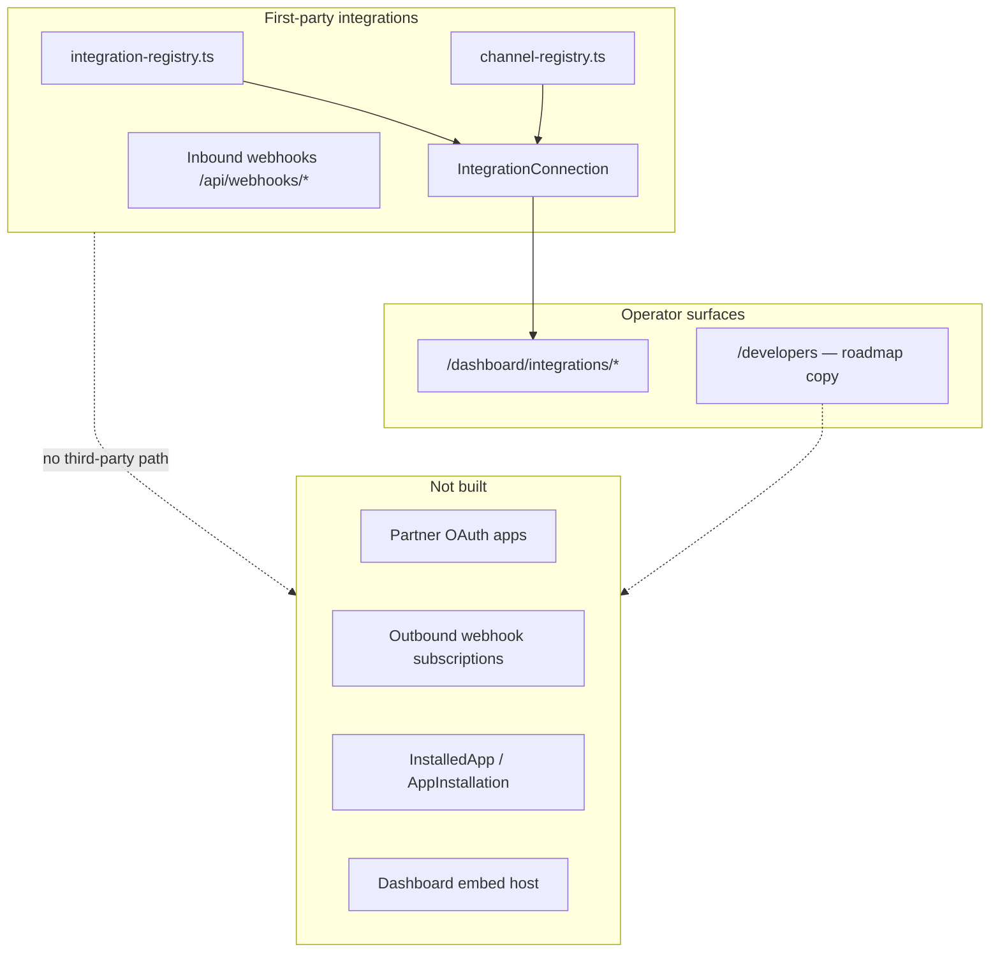

# App Marketplace RFC — Third-Party Extension Platform

**Status:** Phase 1–4 shipped (directory · outbound webhooks · OAuth sandbox · review + embed BETA) — full marketplace **not implemented**  
**Audience:** Platform, Integrations, Security, Product, Commercial, Partnerships  
**Tracker:** `app-marketplace-rfc` (competitor parity cycle 21)  
**Related:** [`lib/integrations/integration-registry.ts`](../lib/integrations/integration-registry.ts) · [`lib/channels/channel-registry.ts`](../lib/channels/channel-registry.ts) · [`app/developers/page.tsx`](../app/developers/page.tsx) · [`docs/scim-provisioning-rfc.md`](./scim-provisioning-rfc.md) · [`docs/INTEGRATION_MATURITY_MATRIX.md`](./INTEGRATION_MATURITY_MATRIX.md)

---

## Summary

**Toast, Square, and Shopify** ship app marketplaces where third parties install OAuth apps, subscribe to webhooks, embed UI in admin, and extend merchant workflows without forking core POS. KitchenOS today has a **first-party integration registry** (DoorDash, Shopify, QuickBooks, etc.), inbound provider webhooks, and a **developer marketing page marked roadmap** — but **no installable third-party app model**, no partner OAuth, no outbound event subscriptions for external apps, and no review/certification pipeline.

This RFC documents the gap, compares platform options, and recommends a **phased path**: curated partner directory → scoped partner API + outbound webhooks → OAuth app install with sandbox review → optional embedded admin surfaces.

**Recommendation:** Do **not** claim “app marketplace” or “developer ecosystem” in sales decks until Phase 1 (curated directory + partner onboarding playbook) ships. Enterprise API remains gated; marketplace is a separate commercial surface.

---

## Problem

| Requirement | Merchant / partner expectation | KitchenOS today |
|-------------|----------------------------------|-----------------|
| Browse and install apps | Self-serve catalog with ratings, categories | Static `INTEGRATION_REGISTRY` — first-party only |
| OAuth install flow | Merchant grants scoped access to partner app | Per-integration manual API keys in env / connection settings |
| Outbound webhooks to partners | `order.created`, `inventory.updated` subscriptions | Inbound provider webhooks only; `/developers/webhooks` is roadmap copy |
| Embedded UI in dashboard | iFrame or App Bridge in settings sidebar | No extension host, no signed embed tokens |
| Partner revenue share / billing | Platform billing for app subscriptions | Not designed |
| App review & security | Sandboxed apps, permission manifest | No partner app entity in schema |
| Multi-tenant isolation | App sees only installing workspace | Workspace scoping exists for first-party code paths — **not exposed to third parties** |

**Competitive context:** Toast App Marketplace and Square App Marketplace are procurement checkboxes for mid-market restaurants. Shopify App Store sets the bar for OAuth, scopes, and webhook HMAC. KitchenOS wins on **kitchen-native ops** but loses platform deals when buyers expect extensibility without professional services.

---

## Competitor reference (high level)

| Platform | Model | KitchenOS gap |
|----------|--------|---------------|
| **Toast** | Partner API + marketplace listing + Toast-funded integrations | No public partner API productization |
| **Square** | OAuth + Webhooks + App Marketplace SDK | No OAuth app registration |
| **Shopify** | App Bridge, Admin API, webhooks, billing API | Shopify is **inbound channel** only — not an OS Kitchen app host |
| **Lightspeed** | Extension marketplace (region-specific) | No extension manifest |

**Honesty:** KitchenOS `/developers` page already states API/webhooks/SDK are **roadmap** — this RFC formalizes what “marketplace” would require beyond that page.

---

## Current KitchenOS architecture



| Component | Path | Notes |
|-----------|------|-------|
| Integration registry | `lib/integrations/integration-registry.ts` | LIVE/BETA/PLACEHOLDER; env-based |
| Channel registry | `lib/channels/channel-registry.ts` | Sales channel cards |
| Connections | `IntegrationConnection` + `settingsJson` | Tenant-scoped credentials |
| Inbound webhooks | `app/api/webhooks/*`, replay jobs | Provider → KitchenOS |
| Public API | Enterprise-gated v1 (see developers docs) | Not partner-OAuth |
| Workspace isolation | `workspace-resource-scope.ts` | Internal services only |
| Developer marketing | `app/developers/page.tsx` | Explicit roadmap honesty |

**Storage gap:** No `PartnerApp`, `AppInstallation`, `WebhookSubscription`, or `OAuthClient` models in Prisma.

---

## Options compared

### Option A — Curated partner directory only (recommended Phase 1)

Static or CMS-driven catalog linking to **first-party or SI-built** integrations; manual onboarding; no third-party OAuth.

| Pros | Cons |
|------|------|
| Low engineering cost (1–2 weeks) | Not a true marketplace |
| Honest “partner program” positioning | No self-serve install |
| Reuses existing integration setup routes | Partners still need PS engagement |

**Fit:** Pilot GTM — list certified SI partners + BETA integrations with setup guides.

Deliverables:

- `docs/partner-integration-program.md` + `/partners` catalog data source
- Dashboard “Extensions” hub reading from `config/commercial/partner-apps.json`
- Partner application form → internal review queue

---

### Option B — Partner API + outbound webhooks (recommended Phase 2)

Documented REST API (workspace-scoped API keys or mTLS) + merchant-configured outbound webhook endpoints with HMAC signing, retries, and event catalog.

| Dimension | Assessment |
|-----------|------------|
| Effort | **4–6 weeks** — subscription CRUD, delivery worker, signing |
| Risk | Medium — PII in payloads, retry storms |
| Depends on | Public API stability, rate limits, audit logging |

Event catalog (initial):

- `order.created`, `order.updated`, `order.completed`
- `product.updated`, `inventory.adjusted`
- `staff.shift_started` (optional labor partners)

**Not** full marketplace — partners integrate via docs + keys, not OAuth app store.

---

### Option C — OAuth 2.0 app install + permission manifest (Phase 3)

Partners register apps; merchants install via OAuth; scopes map to existing RBAC (`integrations.manage`, `orders.read`, etc.).

| Dimension | Assessment |
|-----------|------------|
| Effort | **8–12 weeks** — OAuth server, consent UI, token storage, scope enforcement |
| Risk | High — token leakage, scope creep, support burden |
| Prerequisite | Phase 2 webhook/API hardening + security review |

Proposed scopes (draft):

| Scope | Maps to |
|-------|---------|
| `read:orders` | Order list/detail API |
| `write:products` | Product CRUD (pilot subset) |
| `read:inventory` | Inventory levels |
| `manage:webhooks` | Outbound subscription CRUD |

---

### Option D — Full marketplace + embedded apps (Phase 4+)

App Bridge–style iframe embeds in dashboard, partner billing, app review pipeline, sandbox stores.

| Dimension | Assessment |
|-----------|------------|
| Effort | **6+ months** — platform team |
| Risk | Very high — XSS, PCI adjacent flows, SLA |
| Prerequisite | OAuth, webhook platform, legal (DPAs), partner contracts |

**Not recommended before PMF.** Revisit when ≥3 paying partners commit to build on platform.

---

## Recommended phased roadmap

| Phase | Scope | Exit criteria | Sales honesty |
|-------|--------|---------------|---------------|
| **0 (this RFC)** | Document gap + options | RFC merged; tracker done | “Roadmap — no marketplace yet” |
| **1** | Curated partner directory + certification checklist | `/dashboard/integrations/extensions` lists approved partners | “Partner integrations — contact sales” |
| **2** | Outbound webhooks + documented partner API keys | Merchant can register URL; events deliver with HMAC | “Partner webhooks beta” |
| **3** | OAuth app registration + install flow | Sandbox app installs in test workspace | “Developer platform beta” |
| **4** | Review pipeline + optional embed host | 1–2 lighthouse partner apps live | “App marketplace pilot” |
| **5 (shipped)** | Partner billing meters + publisher statements | Platform accrues install fees; statements finalize/paid workflow | “Partner billing beta” |
| **6 (shipped)** | Stripe Connect Express payouts to publishers | Onboard publishers, transfer on finalized statements | “Publisher payouts via Stripe Connect (pilot)” |

---

## Proposed data model (Phase 2–3)

```prisma
// Illustrative — not migrated in Phase 0

model PartnerApp {
  id            String   @id @default(uuid())
  slug          String   @unique
  name          String
  publisherName String
  status        String   // draft | review | published | suspended
  scopes        String[] // OAuth scopes
  redirectUris  String[]
  createdAt     DateTime @default(now())
}

model AppInstallation {
  id            String   @id @default(uuid())
  workspaceId   String
  partnerAppId  String
  installedBy   String
  accessTokenHash String? // or refresh token family
  scopesGranted String[]
  status        String   // active | revoked
  installedAt   DateTime @default(now())
  @@unique([workspaceId, partnerAppId])
}

model OutboundWebhookSubscription {
  id          String   @id @default(uuid())
  workspaceId String
  url         String
  events      String[]
  secret      String   // HMAC signing
  active      Boolean  @default(true)
}
```

Phase 1 can avoid migrations — use `config/commercial/partner-apps.json` + `IntegrationConnection.provider = "partner:{slug}"`.

---

## Security & compliance

| Topic | Requirement |
|-------|-------------|
| Tenant isolation | Every API/webhook call resolves `workspaceId`; no cross-tenant IDs in URLs |
| PII minimization | Webhook payloads exclude full card data; hash customer email option |
| Signing | HMAC-SHA256 `X-KitchenOS-Signature` + timestamp tolerance |
| Rate limits | Reuse `consumeRateLimitToken` per installation |
| Audit | `recordAuditLog` on install, revoke, scope change |
| Review | Static analysis + manual checklist before `published` (Phase 3+) |
| SOC2 narrative | Marketplace **not** in SOC2 scope until Phase 3 operational |

Align with [`docs/scim-provisioning-rfc.md`](./scim-provisioning-rfc.md) — enterprise IdP provisioning is orthogonal; marketplace apps use OAuth, not SCIM.

---

## API & permissions (Phase 2+)

| Action | Permission | Notes |
|--------|------------|-------|
| List partner directory | Authenticated tenant | Read-only catalog |
| Create webhook subscription | `integrations.manage` | Workspace admin |
| Install OAuth app | `workspace.admin` + consent screen | Phase 3 |
| Revoke installation | `workspace.admin` | Immediate token invalidation |

Developer docs surface:

- Extend `/developers/docs` with OpenAPI for partner endpoints (Phase 2)
- Webhook event schemas + retry semantics (mirror Stripe-style docs)

---

## Testing strategy

| Layer | Coverage |
|-------|----------|
| Unit | Webhook payload builders, HMAC verification, scope checker |
| Integration | Mock partner receiver — delivery + retry backoff |
| E2E | Install sandbox app → receive `order.created` in webhook.site fixture |
| Security | IDOR tests on installation IDs; cross-workspace denial |
| Honesty | `integration-honesty.ts` / marketing claims — no “marketplace” until Phase 1 |

---

## Risks & open questions

1. **Build vs buy** — Could PartnerStack / crossbeam suffice for Phase 1 directory only?
2. **Revenue share** — Toast/Square take %; KitchenOS has no billing API for apps yet.
3. **Support ownership** — Partner bugs vs core bugs; need tier-2 routing before Phase 3.
4. **PCI scope** — Apps must not touch card PAN; document forbidden scopes.
5. **Channel registry overlap** — Marketplace apps ≠ sales channels; keep `channel-registry.ts` separate from `partner-apps.json`.
6. **Duplicate “marketplace” language** — Delivery aggregators are “marketplaces” in ops docs; use **“App Marketplace”** or **“Extension Platform”** in product copy to avoid confusion with DoorDash/Uber.

**Open questions for product:**

- Is pilot ICP asking for self-serve apps or SI-led integrations?
- Should Phase 2 webhooks be available on **Growth** tier or Enterprise only?
- Priority vs **restaurant capital/lending RFC** (cycle 22) — both are platform bets.

---

## Conscious non-goals (pilot)

- Public app store with consumer ratings/reviews (Phase 4+ at earliest)
- Partner-built POS payment apps touching card data
- Revenue sharing / app billing in Phase 1–2
- Replacing first-party BETA integrations with partner-maintained clones
- Shopify-style theme app extensions on storefront (separate RFC if needed)

---

## References

- [Toast Partner Connect / Integrations](https://pos.toasttab.com/partners)
- [Square App Marketplace](https://developer.squareup.com/docs/app-marketplace)
- [Shopify app architecture](https://shopify.dev/docs/apps/build)
- KitchenOS: `app/developers/page.tsx`, `lib/integrations/integration-registry.ts`
- KitchenOS: `docs/INTEGRATION_MATURITY_MATRIX.md`, `docs/KITCHENOS_FINAL_PRODUCT_AND_COMPETITOR_ANALYSIS.md` (marketplace competitive notes)

---

## Decision log

| Date | Decision |
|------|----------|
| 2026-05-31 | RFC accepted as Phase 0; implementation deferred; recommend Option A (curated directory) for first GTM slice, Option B before OAuth |
| 2026-05-31 | **Phase 1 shipped:** `config/commercial/partner-apps.json`, `services/platform/extensions-catalog-service.ts`, `/dashboard/integrations/extensions` |
| 2026-05-31 | **Phase 2 shipped:** outbound webhook subscriptions + delivery worker + `/dashboard/integrations/outbound-webhooks` |
| 2026-05-31 | **Phase 3 shipped:** OAuth sandbox apps + consent + token endpoint + `koa_` API tokens |
| 2026-05-31 | **Phase 4 shipped:** `PartnerOAuthAppRegistry` review pipeline, `/platform/partner-apps`, `/developers/apps/register`, embedded admin host + `POST /api/embed/partner-app/verify` |
| 2026-05-31 | **Phase 5 shipped:** `PartnerBillingAccount` + meter events + statements, install/revoke hooks, `/platform/partner-billing`, config rates in `config/platform/partner-billing.json` |
| 2026-05-31 | **Phase 6 shipped:** Stripe Connect Express publisher onboarding, transfer payouts on finalized statements, `account.updated` sync, `MARKETPLACE_PARTNER_STRIPE_CONNECT=1` feature flag |
| 2026-05-31 | **Phase 7 shipped:** `API_REQUEST` + `WEBHOOK_DELIVERY` revenue share meters, `revenueShareBps` applied at statement accrual, partner attribution on outbound webhooks |

### Phase 6 — Stripe Connect payouts (shipped)

| Component | Path / detail |
|-----------|---------------|
| Feature flag | `MARKETPLACE_PARTNER_STRIPE_CONNECT=1` + `STRIPE_CONNECT_CLIENT_ID` |
| Connect onboarding | `services/platform/partner-stripe-connect-service.ts` — Express account + Account Link |
| Payout execution | `executePartnerStatementStripePayout` — `stripe.transfers.create` with idempotency |
| Dry run | `PARTNER_STRIPE_PAYOUT_DRY_RUN=1` for staging without live transfers |
| Webhook | `account.updated` refreshes `PartnerBillingAccount` connect fields |
| Platform UI | Connect status column, **Connect Stripe** + **Send Stripe payout** actions |
| Prisma | `stripeConnectAccountId`, `stripeTransferId`, `payoutStatus` on billing models |

### Phase 7 — Revenue share meters (shipped)

| Meter | Hook | Unit rate config |
|-------|------|------------------|
| `API_REQUEST` | `lib/api-public/guard.ts` after partner OAuth success | `defaultApiRequestFeeCentsPerCall` |
| `WEBHOOK_DELIVERY` | `outbound-webhook-delivery-service.ts` on HTTP 2xx | `defaultWebhookDeliveryFeeCentsPerDelivery` |

**Accrual:** gross meter revenue × `revenueShareBps` → publisher statement payout (Stripe transfer amount).

**Attribution:** outbound subscriptions auto-link single webhook-capable partner install per workspace; explicit `partnerClientId` on subscription when ambiguous.

---
