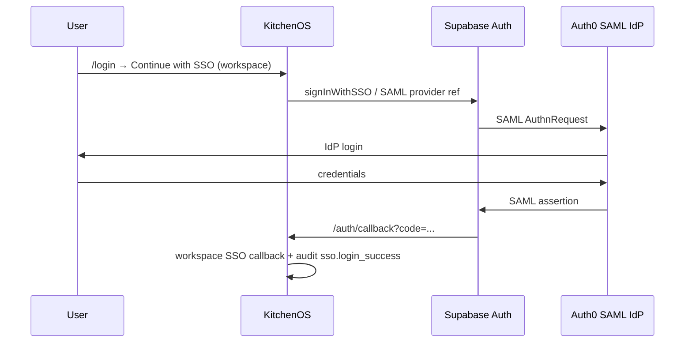

# Auth0 → Supabase SAML → KitchenOS

**Status:** canonical setup for Auth0 as enterprise IdP  
**Date:** 2026-06-01

KitchenOS does **not** use `@auth0/nextjs-auth0` as the primary session layer. The app already runs on **Supabase Auth** (`lib/auth.ts`, `middleware.ts` → `updateSession`, `/auth/callback` for OAuth/SSO). Installing the Auth0 Next.js SDK on `/auth/login` and `/auth/callback` would collide with Supabase and break login, onboarding, and workspace SSO.

Use **Auth0 as a SAML identity provider** wired into Supabase Auth, then KitchenOS workspace SSO pilot settings — the same path as Okta and Microsoft Entra ID.

---

## Why not the Auth0 Next.js SDK prompt?

| Auth0 SDK prompt | KitchenOS reality |
|------------------|-------------------|
| `proxy.ts` / `middleware.ts` replaces session middleware | Existing `middleware.ts` handles Supabase sessions, storefront routing, API auth |
| `/auth/callback` owned by Auth0 SDK | `/auth/callback/route.ts` is Supabase OAuth/SSO callback |
| Replace `app/login` with redirect to `/auth/login` | Login page has email/password + workspace SSO entry (`SsoLoginEntry`) |
| Dual session model (Auth0 cookie + Supabase) | Single source of truth: Supabase session + Prisma user |

---

## Architecture



---

## Auth0 tenant (staging reference)

Set these in **ops vault / Vercel secrets** — never commit real values to git:

| Variable | Example / purpose |
|----------|-------------------|
| `AUTH0_DOMAIN` | `dev-vwp7b8po8nz3lqps.us.auth0.com` |
| `AUTH0_CLIENT_ID` | Auth0 application client ID (SAML app) |
| `AUTH0_CLIENT_SECRET` | From Auth0 Dashboard → Application → Settings |

KitchenOS staging smoke uses **`SSO_STAGING_*`** vars (see below), not `AUTH0_*` SDK vars (`AUTH0_SECRET`, `APP_BASE_URL`).

---

## Step 1 — Supabase SAML service provider

1. Supabase Dashboard → **Authentication** → **SSO** (or SAML providers).
2. Create a SAML provider for the pilot workspace domain.
3. Copy **ACS URL** (Assertion Consumer Service) and **Entity ID** (SP audience).
4. Save the provider **UUID / reference** → this becomes `SSO_STAGING_SUPABASE_PROVIDER_REF` and workspace `supabaseProviderRef` in Settings → Security → SSO pilot.

---

## Step 2 — Auth0 SAML IdP application

1. Auth0 Dashboard → **Applications** → **Create Application** → **Regular Web Application**.
2. Open the app → **Addons** → enable **SAML2 WEB APP**.
3. Configure the SAML addon (JSON settings):

```json
{
  "audience": "<SUPABASE_ENTITY_ID>",
  "recipient": "<SUPABASE_ACS_URL>",
  "mappings": {
    "email": "http://schemas.xmlsoap.org/ws/2005/05/identity/claims/emailaddress",
    "name": "http://schemas.xmlsoap.org/ws/2005/05/identity/claims/name"
  },
  "nameIdentifierFormat": "urn:oasis:names:tc:SAML:1.1:nameid-format:emailAddress",
  "signResponse": true,
  "signatureAlgorithm": "rsa-sha256",
  "digestAlgorithm": "sha256"
}
```

4. **Usage** tab → download **Identity Provider Metadata** (or note Issuer / SSO URL / certificate).
5. Upload IdP metadata (or paste cert + SSO URL) into the Supabase SAML provider from Step 1.
6. Auth0 → **User Management** → create or import a test user with email `@SSO_STAGING_ALLOWED_DOMAIN`.

---

## Step 3 — KitchenOS workspace SSO pilot

1. Dashboard → **Settings** → **Security** → **SSO pilot**.
2. Set **IdP vendor** → **Auth0**.
3. Set **Allowed domains** → e.g. `pilot.example.com`.
4. Set **Supabase provider ref** → UUID from Step 1.
5. Move pilot phase to **PILOT_ACTIVE** on staging only.

Existing login UX stays on `/login`; SSO users use **Continue with SSO** (`SsoLoginEntry`) with the workspace ID.

---

## Step 4 — Staging smoke env vars

Configure in local ops shell or GitHub Actions secrets (see `docs/enterprise-sso-idp-staging-smoke-plan.md`):

```bash
E2E_STAGING_BASE_URL=https://staging.yourdomain.com
SSO_STAGING_WORKSPACE_ID=<pilot-workspace-uuid>
SSO_STAGING_IDP_VENDOR=AUTH0
SSO_STAGING_ALLOWED_DOMAIN=pilot.example.com
SSO_STAGING_TEST_EMAIL=staff@pilot.example.com
SSO_STAGING_SUPABASE_PROVIDER_REF=<supabase-saml-provider-uuid>
```

Run prerequisite check:

```bash
npm run smoke:enterprise-sso-idp-staging
```

Cycle 2 operator proof (browser login + screenshot + audit ref) is unchanged — see the enterprise SSO smoke plan.

---

## Troubleshooting

| Symptom | Check |
|---------|--------|
| Redirect loop after Auth0 login | ACS URL / Entity ID mismatch between Auth0 addon and Supabase provider |
| `sso.login_denied` / wrong domain | `allowedDomains` on workspace SSO settings vs test user email |
| Callback 404 | Do **not** mount Auth0 SDK on `/auth/callback` — Supabase owns this route |
| Vendor mismatch in audit | Workspace SSO `idpVendor` must be `AUTH0`; re-login after admin change |

---

## Related docs

- `docs/enterprise-sso-idp-staging-smoke-plan.md` — Okta / Entra / Auth0 smoke matrix
- `docs/ops-vault-matrix.md` — vault keys for P0 SSO proof
- `docs/GITHUB_E2E_STAGING_SECRETS.md` — CI secret names
