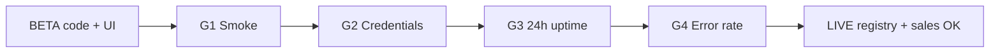

# BETA → LIVE integration roadmap

**Policy:** `beta-to-live-roadmap-v1`  
**Updated:** 2026-06-02  
**Owner:** PM + Integration engineering  
**Gate:** [`live-integration-definition-of-done.md`](./live-integration-definition-of-done.md) (G1–G4)  
**Snapshot:** **0 LIVE** third-party integrations · **7 BETA** · **1 PLACEHOLDER** (`lib/integrations/integration-registry.ts`)

This roadmap defines **promotion order and quarterly targets** for moving partner integrations from BETA to LIVE. Code shipped does not change registry labels — only gate PASS + sign-off does.

**Honesty rule:** Until a row below shows **LIVE signed**, sales must use BETA / qualified-pilot language per [`sales-safe-claims-registry.md`](./sales-safe-claims-registry.md).

---

## Executive summary

| Priority | Integration | Registry | Why first | Target LIVE window |
|:--------:|-------------|----------|-----------|-------------------|
| **#1** | **WooCommerce** | Channel (`NEEDS_CREDENTIALS`) | Mature smoke scripts, no partner program gate, highest pilot demand | **Q3 2026** (staging PASS → 1 prod tenant) |
| **#2** | **DoorDash** | BETA | Broad delivery demand; webhook + menu code exists — partner cert is blocker | **Q3–Q4 2026** (reference tenant pilot) |
| **#3** | **QuickBooks** | BETA | Accounting export demand; OAuth scaffold — lower ops risk than multi-webhook delivery | **Q4 2026** |

**Not in top-3 queue (H2 2026):** Grubhub, Uber Eats, Xero, 7shifts, Homebase — promote only after #1–#3 sign-off or explicit pilot contract. **Uber Direct** remains PLACEHOLDER until [`uber-direct-implementation-plan.md`](./uber-direct-implementation-plan.md) (Task 72).

**Shopify** runs **parallel track** with WooCommerce (same channel family, shared smokes) — promote to LIVE in the **same sprint** as Woo once both G1 artifacts PASS; do not claim Shopify LIVE if Woo alone passes.

---

## Promotion framework (all integrations)

Every BETA → LIVE transition follows the same four gates:

| Gate | Requirement | Evidence |
|:----:|-------------|----------|
| **G1** | Smoke pass on deployed env | Artifact `proof_passed` / `overall: PASS` |
| **G2** | Real credentials on reference tenant | Partner-issued keys; `CONNECTED` row |
| **G3** | 24h uptime | No Sev-1; Integration Health ≠ `down` > 30 min |
| **G4** | Error rate < 1% | Webhook + API over same 24h window |

Plus promotion checklist (registry update, claims CI, GTM brief) — see LIVE DoD § Promotion checklist.



---

## Priority #1 — WooCommerce (channel)

### Current state

| Dimension | Status |
|-----------|--------|
| Registry | `channel-registry.ts` — `statusType: NEEDS_CREDENTIALS`, `supportsLiveMode: true` |
| Code | REST sync, webhooks `/api/webhooks/woocommerce`, encrypted credentials |
| Smokes | `npm run smoke:woo-live` · `era17-channel-live-smoke-woo-v1` cert tests |
| G1 today | **SKIPPED** — staging vault `awaiting_ops_credentials` |
| Sales | ONLY_WITH_CAVEAT — “test shop / qualified pilot” |

### Workstream to LIVE

| Phase | Work | Owner | Exit |
|-------|------|-------|------|
| **W1** | Populate staging vault (Woo test shop keys) | Ops | G1 smoke `proof_passed` on staging |
| **W2** | Reference pilot tenant connects production Woo store | CS + customer | G2 PASS |
| **W3** | 24h production watch (orders + webhooks) | Ops + Eng | G3 + G4 PASS |
| **W4** | Registry `statusType` → LIVE; update maturity matrix | Eng + Founder | Sign-off row complete |
| **W5** | Release note + sales brief | PM | [`release-notes-process.md`](./release-notes-process.md) |

### Commands

```bash
npm run smoke:woo-live          # write artifact
npm run smoke:woo-shopify-live  # paired channel bundle
npm run smoke:p0-staging-proof-unblock
```

### Risks

| Risk | Mitigation |
|------|------------|
| Vault never populated | Blocker on [`staging-environment-checklist.md`](./staging-environment-checklist.md) |
| Customer uses plugin version we haven't tested | Document supported Woo versions in pilot SOW |
| Claiming LIVE before Shopify parity | Promote both channels together or caveat Shopify separately |

**Deep dive:** [`channel-pilot-playbook-era17.md`](./channel-pilot-playbook-era17.md) · [`WOO_SHOPIFY_TEST_SHOP_SETUP.md`](./WOO_SHOPIFY_TEST_SHOP_SETUP.md)

---

## Priority #2 — DoorDash

### Current state

| Dimension | Status |
|-----------|--------|
| Registry | `integration-registry.ts` — BETA |
| Code | Webhook ingest, poll cron, menu sync, Drive delivery scaffold |
| Smokes | Unit + E2E; **no** `smoke:channel-live-doordash` artifact yet |
| Partner | Merchant program approval required |
| G1–G4 | None PASS |

### Workstream to LIVE

| Phase | Work | Owner | Exit |
|-------|------|-------|------|
| **D1** | Ship `smoke:channel-live-doordash` script + artifact | Eng | G1 on staging |
| **D2** | DoorDash sandbox → production merchant onboarding (1 reference store) | Partnerships + customer | G2 PASS |
| **D3** | Register prod webhooks; run 24h with real order volume | Ops | G3 + G4 PASS |
| **D4** | Flip `INTEGRATION_REGISTRY` status to LIVE | Eng + Founder | Sign-off |
| **D5** | 30-day post-promotion watch | Ops | Error rate stable |

### Dependencies

- WooCommerce LIVE **not required** for DoorDash LIVE, but **pilot narrative** should lead with Woo for ecommerce before delivery marketplace claims.
- Webhook signature matrix row must show **verified** ([`artifacts/webhook-signature-matrix.md`](../artifacts/webhook-signature-matrix.md)).

**Deep dive:** [`doordash-live-integration-plan.md`](./doordash-live-integration-plan.md)

---

## Priority #3 — QuickBooks

### Current state

| Dimension | Status |
|-----------|--------|
| Registry | BETA — `QUICKBOOKS_CLIENT_ID` |
| Code | OAuth connect, export paths (BETA maturity) |
| Smokes | OAuth + export smoke on staging tenant (manual / partial) |
| Risk profile | Lower webhook volume than delivery — good third LIVE candidate |

### Workstream to LIVE

| Phase | Work | Owner | Exit |
|-------|------|-------|------|
| **Q1** | Formalize `smoke:quickbooks-live` artifact (connect + export + token refresh) | Eng | G1 PASS |
| **Q2** | Intuit production app review + pilot customer OAuth | Partnerships | G2 PASS |
| **Q3** | 24h sync window (scheduled export + manual retry) | Ops | G3 + G4 PASS |
| **Q4** | Registry LIVE + accountant-facing docs | PM + Eng | Sign-off |

### Notes

- **Xero** follows QuickBooks — reuse OAuth/export playbook; do not parallel-promote unless separate pilot contract.
- Accounting LIVE ≠ tax advice — keep disclaimers in [`sales-limitation-sheet.md`](./sales-limitation-sheet.md) (Task 58).

---

## Secondary queue (after top 3)

| Integration | Registry | Suggested trigger to start | Blocker |
|-------------|----------|---------------------------|---------|
| **Shopify** | Channel NEEDS_CREDENTIALS | With Woo #1 | Same vault/smoke ops as Woo |
| **Grubhub** | BETA | DoorDash LIVE + shared delivery playbook | Partner access |
| **Uber Eats** | BETA | DoorDash LIVE | Partner access + webhook cert |
| **Xero** | BETA | QuickBooks LIVE | OAuth app review |
| **7shifts** | BETA | Labor pilot contract | API key + sync smoke |
| **Homebase** | BETA | Labor pilot contract | API key + sync smoke |
| **Uber Direct** | PLACEHOLDER | Task 72 plan approved | No production path |

---

## Quarterly timeline (2026)

| Quarter | Milestone | Integrations |
|---------|-----------|--------------|
| **Q3** | First external LIVE | WooCommerce (+ Shopify paired) |
| **Q3–Q4** | Delivery reference LIVE | DoorDash (1 tenant) |
| **Q4** | Finance connector LIVE | QuickBooks |
| **Q1 2027** | Delivery parity | Grubhub / Uber Eats (if partner gates clear) |
| **H1 2027** | Labor + alt accounting | 7shifts, Homebase, Xero |

Dates slip if G1 remains SKIPPED — **do not compress G3/G4** to hit marketing deadlines.

---

## RACI (promotion program)

| Activity | PM | Integration Eng | Ops | Founder | Sales |
|----------|:--:|:-----------------:|:---:|:-------:|:-----:|
| Maintain this roadmap | A | C | I | C | I |
| Build smoke artifacts | C | R | I | — | — |
| Staging vault + webhooks | C | C | R | — | — |
| Reference tenant selection | R | I | C | A | C |
| G1–G4 evidence collection | C | R | R | I | — |
| LIVE sign-off | C | R | C | A | I |
| Update sales registry | R | C | — | A | R |

---

## Sales & GTM rules during roadmap

| Situation | Say | Do not say |
|-----------|-----|------------|
| Prospect asks “Do you integrate with DoorDash?” | “DoorDash is in **qualified beta** — production LIVE follows partner certification.” | “Full DoorDash integration live today” |
| Woo pilot signed | “WooCommerce **test shop** golden path — staging smoke in progress.” | “All Woo stores production-certified” |
| After Woo LIVE sign-off | “WooCommerce available for production use” + scope notes | “Every Woo plugin/version supported” |
| Accounting RFP | “QuickBooks connector in beta; LIVE targeted Q4 with pilot customer.” | “Native QuickBooks certified” |

Cross-reference: [`sales-safe-claims-registry.md`](./sales-safe-claims-registry.md) · [`integration-health-sales-deck-v2.md`](./integration-health-sales-deck-v2.md)

---

## Metrics & review cadence

Track in monthly integration review (align with [`pilot-metrics-review-process.md`](./pilot-metrics-review-process.md) R2/R4):

| Metric | Target |
|--------|--------|
| Integrations with G1 PASS artifact | ≥ 1 by end Q3 |
| Integrations LIVE (signed) | 1 (Woo) → 2 (DoorDash) → 3 (QuickBooks) |
| BETA count | Decrease only after sign-off — never by label edit alone |
| Post-LIVE error rate | < 1% sustained |
| Sales claim violations | 0 (`verify-claims` CI) |

---

## Decision log

| Date | Decision | Rationale |
|------|----------|-----------|
| 2026-06-02 | Priority order Woo → DoorDash → QuickBooks | Woo: lowest partner friction + existing smokes; DoorDash: revenue pull; QB: finance wedge without delivery ops complexity |
| 2026-06-02 | Shopify paired with Woo, not separate priority slot | Shared channel architecture and smoke bundle |
| 2026-06-02 | Uber Direct excluded until PLACEHOLDER resolved | No LIVE path in code |

---

## Related docs & tasks

| Resource | Topic |
|----------|-------|
| [`live-integration-definition-of-done.md`](./live-integration-definition-of-done.md) | G1–G4 gates |
| [`doordash-live-integration-plan.md`](./doordash-live-integration-plan.md) | DoorDash workstream detail |
| [`channel-pilot-playbook-era17.md`](./channel-pilot-playbook-era17.md) | Woo/Shopify pilot |
| [`staging-environment-checklist.md`](./staging-environment-checklist.md) | Vault + webhooks |
| [`release-notes-process.md`](./release-notes-process.md) | Announce LIVE promotions |
| Task 58 | `sales-limitation-sheet.md` |
| Task 102 | `integration-escalation-matrix.md` |

---

## Next actions

1. **Ops:** Unblock Woo G1 — populate staging Woo test shop credentials (`awaiting_ops_credentials`).
2. **Eng:** Create DoorDash live smoke script (D1 in DoorDash plan).
3. **PM:** Add integration promotion status to monthly founder review agenda.
