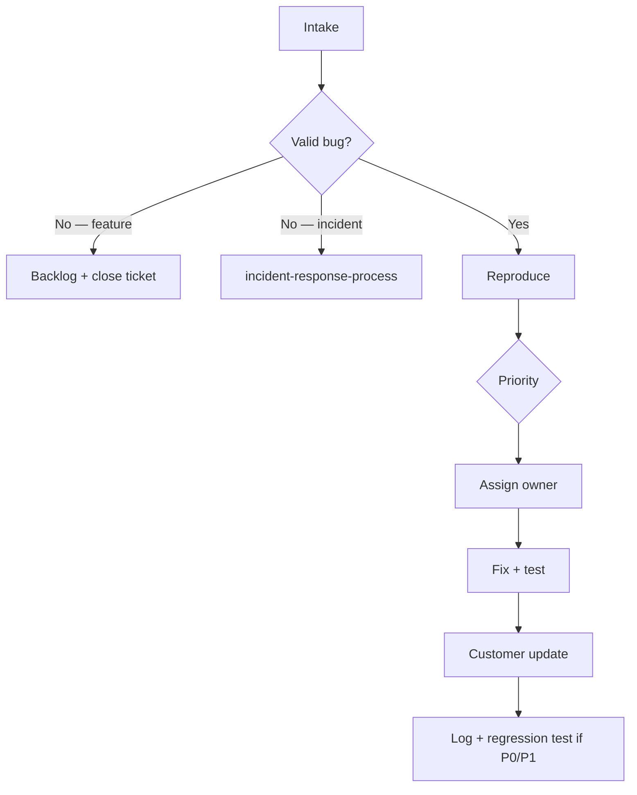

# Bug triage process — OS Kitchen

**Policy:** `bug-triage-process-v1`  
**Date:** 2026-06-02  
**Owner:** Engineering + CS + Founder  
**Status:** Active — pre-pilot baseline (**0 active pilots**, pilot **NO-GO**)  
**Parent:** [`incident-response-process.md`](./incident-response-process.md) · [`customer-success-playbook.md`](./customer-success-playbook.md) · [`integration-escalation-matrix.md`](./integration-escalation-matrix.md)

This document defines how OS Kitchen **intakes, classifies, prioritizes, assigns, and resolves bugs** — distinct from **incidents** (outages, SEV-1/2) and **feature requests**. Use it for support tickets, Sentry alerts, CI failures, and internal QA findings.

**Honesty rule:** Business-hours triage until hire #2 — no contracted bug-fix SLA without [`support-tier-plan.md`](./support-tier-plan.md).

**Key distinction:**

| Type | Trigger | Process |
|------|---------|---------|
| **Bug** | Incorrect behavior vs documented spec | This doc |
| **Incident** | Outage, data risk, SEV-1/2 impact | [`incident-response-process.md`](./incident-response-process.md) |
| **Feature request** | New capability or change in scope | Backlog / product review — not triaged as P0 bug |

---

## Intake channels

| Channel | Source | Default owner | Notes |
|---------|--------|---------------|-------|
| **Support inbox** | `/dashboard/support` · customer tickets | CS → Eng | [`SUPPORT_INBOX.md`](./SUPPORT_INBOX.md) |
| **Sentry** | Production/staging errors | Eng (on-call) | [`sentry-setup.md`](./sentry-setup.md) |
| **CI / smoke failure** | GitHub Actions post-merge | Eng | Block release train if P0 |
| **Internal QA** | E2E, unit tests, manual staging | Eng/QA | File GitHub issue with repro |
| **Integration Health** | Webhook failures, BETA flake | Eng | [`integration-escalation-matrix.md`](./integration-escalation-matrix.md) |
| **Security report** | IDOR, auth bypass suspicion | Eng + Founder | **Upgrade to incident** immediately |

All intakes must have: **repro steps**, **tenant/workspace id** (if applicable), **environment** (prod/staging/local), **screenshot or Sentry link**.

---

## Priority definitions

| Priority | Label | Definition | Examples | First response | Target fix |
|:--------:|-------|------------|----------|:--------------:|:----------:|
| **P0** | Blocker | Production broken for any tenant; data loss risk; payment error | Checkout 500 · cross-tenant leak · cron stopped globally | **1h** (business hrs) | **Same day** or escalate to incident |
| **P1** | Critical | Major workflow broken for pilot tenant | KDS not updating · invite flow broken · webhook ingest stopped (tenant) | **4h** | **24–48h** |
| **P2** | High | Degraded workflow; workaround exists | Slow list · wrong label · BETA integration flake | **1 business day** | Next release train |
| **P3** | Medium | Minor UX / edge case | Copy error · filter bug · mobile layout | **2 business days** | Backlog sprint |
| **P4** | Low | Cosmetic / internal-only | Tooltip typo · dev-only warning | Backlog | When convenient |

**Upgrade rules:**

- Any tenant-data doubt → **P0** + incident process
- Payment or Stripe webhook signature fail → **P0**
- BETA integration-only → cap at **P2** unless pilot contract says otherwise
- Feature disguised as bug → reclassify to backlog with customer note

---

## Triage workflow

### Step 1 — Triage (daily or on intake for P0/P1)

| Check | Action |
|-------|--------|
| Reproducible? | If not, request more info; park at P3 until repro |
| Regression? | `git bisect` or compare to last green deploy |
| Scope | Single tenant vs platform-wide |
| Security? | Run cross-tenant isolation mental check |
| Duplicate? | Link to existing ticket/issue |

**Triage owner (June 2026):** Founder (eng + CS).

### Step 2 — Classify

Apply labels:

| Label | When |
|-------|------|
| `area:orders` `area:kds` `area:pos` `area:integrations` `area:marketplace` `area:auth` `area:billing` | Product surface |
| `env:prod` `env:staging` | Environment |
| `tenant:<id>` | Scoped repro (internal only — redact in customer comms) |
| `beta-integration` | BETA partner path — cite limitation sheet |
| `regression` | Worked in previous release |
| `needs-test` | Fix merged without test — block close |

### Step 3 — Assign & track

| Priority | Tracking | Close criteria |
|----------|----------|------------------|
| P0/P1 | GitHub issue + support ticket linked | Fix deployed · smoke pass · customer confirmed or 24h silence |
| P2 | GitHub issue | Fix in release notes · staging verified |
| P3/P4 | GitHub issue or backlog doc | Fix or wontfix with reason |

**Release train:** P0 blocks deploy. P1 should ride hotfix or next daily deploy.

---

## Bug vs incident escalation

| Symptom | Route |
|---------|-------|
| Sustained prod 5xx · total outage | **Incident** SEV-1/2 |
| Cross-tenant data visible | **Incident** SEV-1 |
| Single tenant checkout fail | **Bug** P1 (upgrade if widespread) |
| Webhook signature failures (platform route) | **Incident** + integration L2 |
| Single BETA integration flake | **Bug** P2 + integration L1 |
| Sentry noise (benign 404) | **Bug** P4 or mute with rule |

See severity mapping in [`incident-response-process.md`](./incident-response-process.md) and integration levels in [`integration-escalation-matrix.md`](./integration-escalation-matrix.md).

---

## Support ticket handling

Aligned with [`SUPPORT_INBOX.md`](./SUPPORT_INBOX.md):

| Ticket tag | Default priority | Triage action |
|------------|:----------------:|---------------|
| `critical` | P0/P1 | Ack within 1h business · eng ping |
| `integrations` | P2 | Check Integration Health · BETA label in reply |
| `billing` | P1 | Verify Stripe logs · no double-charge |
| `bug` | P2–P3 | Request repro · assign eng |
| `question` | — | CS self-serve · docs link |

**Customer comms template (bug acknowledged):**

> We’ve reproduced [issue] in [environment]. Priority: [P1/P2]. Target: [timeframe]. Workaround: [if any]. We’ll update you when fix is deployed.

Do **not** promise LIVE integration fixes for BETA paths — cite [`sales-limitation-sheet.md`](./sales-limitation-sheet.md).

---

## QA & regression gates

| Gate | When | Action |
|------|------|--------|
| Unit + E2E green | Every PR | Block merge on fail |
| P0 staging smokes | Pre-pilot deploy | [`staging-environment-checklist.md`](./staging-environment-checklist.md) |
| Cross-tenant E2E | Auth/marketplace changes | `e2e/cross-tenant-isolation.spec.ts` |
| Forbidden claims | Marketing/docs PRs | CI scan |

**Post-fix requirement:** P0/P1 bugs require a regression test or smoke step added before close.

---

## Metrics (internal — no external SLA claims)

Track weekly in founder review (pre-pilot: baseline only):

| Metric | Target (directional) |
|--------|------------------------|
| P0 open count | 0 |
| P1 mean time to fix | < 48h |
| Reopened rate | < 10% |
| Sentry unresolved > 7d | Trend down |
| Tickets > 7d without update | 0 for P0/P1 |

**June 2026 baseline:** No pilot customers — metrics are engineering hygiene only, not contractual KPIs.

---

## Roles & RACI

| Activity | Eng | CS | Founder |
|----------|:---:|:--:|:-------:|
| Daily triage queue | **R** | C | A |
| P0 ack + fix | **R** | I | A |
| Customer status update | C | **R** | A |
| Incident escalation | **R** | R | **A** |
| Regression test add | **R** | — | C |
| Backlog grooming | C | C | **A** |

R = responsible · A = accountable · C = consulted · I = informed

---

## Related documents

| Doc | Use |
|-----|-----|
| [`incident-response-process.md`](./incident-response-process.md) | Outages, SEV, customer breach comms |
| [`integration-escalation-matrix.md`](./integration-escalation-matrix.md) | Partner/integration failures |
| [`pilot-acceptance-criteria.md`](./pilot-acceptance-criteria.md) | Pilot bug thresholds |
| [`release-notes-process.md`](./release-notes-process.md) | Customer-visible fix communication |
| [`bus-factor-mitigation.md`](./bus-factor-mitigation.md) | Single-owner triage risk |

---

## Revision history

| Version | Date | Change |
|---------|------|--------|
| `bug-triage-process-v1` | 2026-06-02 | Initial process — Task 104 · NO-GO baseline |

**Next review:** First pilot kickoff or hire #2 (whichever comes first).
