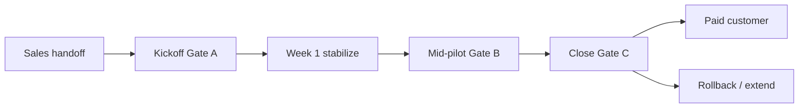

# Customer Success Playbook — OS Kitchen

**Policy:** `customer-success-playbook-v1`  
**Date:** 2026-06-02  
**Owner:** Founder + CS (founder-led until hire #2)  
**Audience:** CS, Sales handoff, Integration support  
**Status:** **Pre-customer** — playbook ready; **0 active pilots** · pilot NO-GO until staging proof PASS

This playbook defines **how OS Kitchen onboard, supports, and retains design partners and paid pilots** — from LOI handoff through conversion or rollback. It is the CS operating system; engineering smokes and legal SOW remain authoritative for scope.

**Hard rule:** CS does **not** upgrade integration labels, case studies, or KPI claims without artifact PASS and written customer approval — same bar as [`pilot-metrics-review-process.md`](./pilot-metrics-review-process.md).

**Related:** [`pilot-execution-checklist.md`](./pilot-execution-checklist.md) · [`pilot-acceptance-criteria.md`](./pilot-acceptance-criteria.md) · [`sales-limitation-sheet.md`](./sales-limitation-sheet.md) · [`incident-response-process.md`](./incident-response-process.md) · [`q3-2026-okrs.md`](./q3-2026-okrs.md)

---

## Executive summary

| Dimension | June 2026 baseline |
|-----------|-------------------|
| Active paying customers | **0** |
| Design partners (signed LOI) | **0** |
| CS headcount | **Founder** (bus factor 1) |
| Support SLA | Business-hours email — **no 24/7** default |
| Primary CS motion | White-glove **design partner pilot** (60–90 days) |
| Success definition | Gate C conversion **or** documented learnings + rollback |

**CS mission (Q3):** Make the **first qualified pilot** succeed on staging → limited production without overclaiming — unlock O1 in [`q3-2026-okrs.md`](./q3-2026-okrs.md).

---

## Customer lifecycle map

| Phase | Duration | CS primary goal | Gate |
|-------|----------|-----------------|------|
| **Pre-kickoff** | LOI −14d → Day 0 | Staging ready · workspace plan · metrics calendar | Gate A prep |
| **Launch** | Day 0–7 | First order path · golden path sign-off | Gate A |
| **Adoption** | Day 7–45 | Weekly sync · baseline metrics · health green | Gate B |
| **Decision** | Day 45–90 | Convert · extend · rollback | Gate C |

Checklist mapping: [`pilot-execution-checklist.md`](./pilot-execution-checklist.md) steps 7–16.

---

## Roles & handoffs

### Sales → CS handoff (required before step 7)

Complete **CS handoff form** (copy into CRM):

| Field | Source |
|-------|--------|
| Customer name + vertical | LOI / SOW |
| ICP qualification | `PILOT_GONOGO_ICP_INPUT_JSON` PASS |
| Signed LOI date | Step 2 |
| Scope (channels, modules) | Exhibit A |
| Honesty constraints discussed | [`sales-limitation-sheet.md`](./sales-limitation-sheet.md) sent? |
| Customer ops lead (name, email, timezone) | Kickoff invite |
| Success metrics (Exhibit C) | Customized targets — not template |
| Risk flags | Offline POS need · SSO required · marketplace-only |

**Reject handoff if:** No LOI · ICP fails · limitation sheet not sent · P0 smokes SKIPPED without remediation owner.

### CS ↔ Engineering ↔ Integration

| Topic | CS owns | Escalate to |
|-------|---------|-------------|
| Workspace provision, invites | **CS** | Eng if RBAC block |
| Launch Wizard walkthrough | **CS** | Product doc gap |
| Channel connect (BETA labels) | **Integration** | CS communicates status |
| Sev-1/2 incidents | **CS comms** | On-call Eng ([`incident-response-process.md`](./incident-response-process.md)) |
| Metrics capture | **CS** | Founder at R3/R4 |
| Case study request | **CS draft** | Founder + Legal approval |

---

## Pre-kickoff CS checklist (steps 1–6)

Before provisioning workspace (pilot checklist step 7):

| # | Action | Evidence |
|---|--------|----------|
| 1 | Confirm Gate A prerequisites with Ops | P0 smokes PASS · staging checklist |
| 2 | Schedule R1 metrics capture (Day 7–14 hold) | Calendar invite with customer ops lead |
| 3 | Run R0 template metrics smoke | `npm run smoke:pilot-metrics-baseline -- --template-only` → SKIPPED OK |
| 4 | Prepare kickoff deck (Today + 2 modules max) | [`sales-demo-environment.md`](./sales-demo-environment.md) |
| 5 | Create pilot workspace slug + owner invite draft | Reserved slug list |
| 6 | Send pre-read: limitation sheet + rollback summary | Email logged in CRM |

---

## Day 0 kickoff (60–90 min)

**Attendees:** CS (lead) · Customer ops lead · Integration (if channel in SOW) · Founder (optional)

**Agenda:**

| Block | Time | Content |
|-------|------|---------|
| Welcome + honesty | 10 min | BETA posture · Integration Health · no LIVE claims yet |
| Success metrics | 10 min | Exhibit C targets · R1 date |
| Workspace live | 15 min | Login · Launch Wizard · team invites |
| Golden path demo | 20 min | Order → KDS → packing ([`PILOT_ONBOARDING_RUNBOOK.md`](./PILOT_ONBOARDING_RUNBOOK.md)) |
| Support + escalation | 10 min | Email · `/dashboard/support` · Sev definitions |
| Rollback acknowledgment | 5 min | [`commercial-pilot-runbook.md`](./commercial-pilot-runbook.md) rollback steps |

**Exit criteria (Gate A partial):** Customer ops lead completes **one test order** end-to-end on staging.

**CS deliverables within 24h:**
- Kickoff notes in CRM
- Weekly sync series booked (Step 14)
- Support ticket channel confirmed

---

## Week 1 — Stabilize (CS cadence)

| Day | CS action |
|-----|-----------|
| 1–2 | Check first live order path (Step 11) · Integration Health review |
| 3 | Troubleshoot blockers from Today Command Center |
| 5 | 15-min async check-in (Slack/email) |
| 7 | Start R1 baseline data collection ([`pilot-metrics-review-process.md`](./pilot-metrics-review-process.md)) |

### Week 1 health signals

| Signal | Green | Yellow | Red |
|--------|-------|--------|-----|
| Orders in hub | ≥1/day on service days | Sporadic manual entry only | Zero after Day 5 |
| KDS usage | Bumped during service | Viewed only | Not opened |
| Support tickets | 0–1 low severity | 2–3 Sev-3 | Any Sev-2 open >24h |
| Operator attendance | Kickoff + 1 check-in | Missed one sync | Ghosting >7 days |
| Integration honesty | Customer accepts BETA labels | Confusion | Customer told LIVE incorrectly |

**Red → escalate to Founder within 24h** with written remediation plan.

---

## Weekly sync (Step 14 — 30–45 min)

**Standing agenda:**

1. **Today snapshot** — blockers, readiness score (customer screen share)
2. **Orders & ops** — volume trend vs R1 baseline
3. **Integrations** — health rows · planned connects · no label upgrades without G1–G4
4. **Support** — open tickets · Sev status
5. **Next week** — one concrete operator action item
6. **CS notes** — log in CRM · tag product gaps

**Attendance target:** ≥80% through mid-pilot (Gate B criterion B6 in [`pilot-acceptance-criteria.md`](./pilot-acceptance-criteria.md)).

**Do not use weekly sync to:** Preview unreleased features as committed · Promise LIVE dates without Integration sign-off.

---

## Customer health score (internal)

Directional score for founder reviews — **not** a customer-facing metric.

| Component | Weight | Green (3) | Yellow (2) | Red (1) |
|-----------|:------:|-----------|------------|---------|
| Product usage | 30% | Golden path + KDS weekly | Partial path | Stalled |
| Metrics trend | 25% | R1 captured · stable/up | R1 late | No baseline |
| Support load | 20% | ≤1 ticket/wk Sev-3 | 2–3 tickets | Sev-2+ open |
| Engagement | 15% | Sync attendance ≥80% | 50–79% | <50% |
| Honesty alignment | 10% | Limitations understood | Minor drift | LIVE overclaim incident |

**Score:** Weighted average 1.0–3.0 · **≥2.4** = healthy · **<2.0** = at-risk → Founder call within 48h.

---

## Mid-pilot review (Gate B — Day 30–45)

CS prepares **mid-pilot packet** for Founder:

| Section | Content |
|---------|---------|
| Health score | Current + trend |
| KPI table | Six metrics vs Exhibit C ([`pilot-metrics-review-process.md`](./pilot-metrics-review-process.md)) |
| Integration status | BETA/LIVE truth vs registry |
| Open incidents | Sev-1/2 history |
| Product gaps | Top 3 blockers filed |
| Recommendation | **Continue** · **Conditional** · **Stop** |

**Founder decision:** GO / CONDITIONAL / NO-GO → logged in `pilot-gono-go-summary.json` (Step 15).

**CS comms template (conditional):**

> We’re seeing [specific gap]. Here’s a 2-week remediation plan with owners on both sides. We’ll re-review on [date] before expanding scope or production traffic.

---

## Pilot close (Gate C — Day 60–90)

| Outcome | CS actions |
|---------|------------|
| **Convert to paid** | Renewal SOW · billing setup · transition to “customer” tier support |
| **Extend LOI** | New end date · revised Exhibit C · reset Gate B date |
| **Rollback** | Execute drill · export data offer · post-mortem ([`pilot-rollback-drill-era17.md`](./pilot-rollback-drill-era17.md)) |

**Case study / logo:** Only with **written approval** after Gate C convert — Legal review · no metrics without R1+R3 PASS.

---

## Support channels & SLAs

| Channel | Surface | Response target (business hours) |
|---------|---------|----------------------------------|
| Email | support@ (or founder alias) | Sev-2: **4h** · Sev-3: **1 business day** |
| In-app | `/dashboard/support` | Same as email |
| KB | `/dashboard/support/kb` | Self-serve first line |
| Emergency | Founder phone (pilot SOW only if listed) | Sev-1: **15 min** ack best effort |

**Not included in pilot default:** 24/7 · Slack Connect · dedicated CSM — see [`support-tier-plan.md`](./support-tier-plan.md) (Task 114).

---

## Escalation matrix (CS view)

| Situation | Severity | CS action | Escalate |
|-----------|----------|-----------|----------|
| Cross-tenant data concern | SEV-1 | Stop comms to other tenants · acknowledge customer | On-call Eng + Founder immediately |
| Checkout / payment blocked | SEV-2 | Gather order ID · workaround | Eng within 1h |
| BETA integration down | SEV-2–3 | Integration Health screenshot · honest ETA | Integration engineer |
| Customer asks for LIVE claim in marketing | — | **Decline** · cite registry | Founder if pressure |
| Feature request | — | Log · no commit date | Product backlog |
| Churn risk (health <2.0) | — | Remediation plan | Founder within 48h |

Full process: [`incident-response-process.md`](./incident-response-process.md)

---

## Expansion & upsell (post-conversion only)

**Not active until first paid customer.** When eligible:

| Motion | Trigger | CS approach |
|--------|---------|-------------|
| Plan upgrade | Hitting order limits · multi-location need | `/pricing` tier comparison · no hidden fees |
| Second integration LIVE | Woo LIVE success | Integration Health proof before sell |
| Marketplace buyer | PO workflow adopted | [`marketplace-pricing-strategy.md`](./marketplace-pricing-strategy.md) — buyer fee = $0 |
| AI module depth | Operator using briefing daily | One module expand · qualified maturity caveat |

**Forbidden upsell:** Uber Direct · SOC2 · SSO production · “enterprise-ready day one”

---

## CS tooling checklist

| Tool | Purpose | Status |
|------|---------|--------|
| CRM / spreadsheet | Handoff + health score | Required |
| `artifacts/pilot-gono-go-summary.json` | GO/NO-GO evidence | Automated smokes |
| `artifacts/pilot-metrics-baseline-summary.json` | KPI artifact | Post-R1 |
| Calendar | Weekly sync + R1/R3/R5 | Required |
| Loom / screen record | Async training clips | Optional |
| Notion pilot tracker | 16-step checklist copy | Recommended |

---

## Communication templates

### Post-kickoff (Day 0)

**Subject:** OS Kitchen pilot kickoff — next steps & support

> Thanks for kickoff today. Your workspace is live at [URL].  
> **This week:** complete one test order (Orders → Kitchen → Packing).  
> **Support:** reply to this email or use in-app Support.  
> **Honesty:** integrations marked BETA in Integration Health are not production-certified yet.  
> Attached: limitation sheet recap · weekly sync invite.

### Weekly sync recap

**Subject:** OS Kitchen pilot — week [N] recap

> **Done:** [operator actions]  
> **Metrics:** [orders/day trend — internal numbers only unless approved]  
> **Blockers:** [list + owner]  
> **Next week:** [one action item]  
> **Open tickets:** [IDs]

### Mid-pilot conditional

See mid-pilot section above.

### Pilot close — convert

**Subject:** OS Kitchen — pilot conversion next steps

> Based on Gate C review [date], we recommend moving to paid [plan].  
> Attached: renewal SOW draft · updated support terms.  
> Case study / logo: optional exhibit — reply if interested.

---

## Q3 2026 CS priorities

From [`q3-2026-okrs.md`](./q3-2026-okrs.md):

| OKR | CS contribution |
|-----|-----------------|
| O1 · 1.3 Gate A kickoff | Execute this playbook Day 0–7 |
| O1 · 1.4 Metrics baseline | R1 owner |
| O2 · 2.5 Demo workspace | Reset golden scenario weekly |
| O4 · 4.4 Logged demos | N/A — Sales; CS supports post-LOI only |

---

## What CS must never do

| Forbidden | Why |
|-----------|-----|
| Mark integration LIVE in customer comms | Registry + G1–G4 only |
| Share another tenant’s data | Tenant isolation |
| Promise roadmap dates without Founder | Contract risk |
| Publish metrics in marketing | R1/R3 artifact + approval |
| Skip rollback briefing | Gate A8 requirement |
| Imply 24/7 support | Not contracted |

Enforced culturally + [`sales-safe-claims-registry.md`](./sales-safe-claims-registry.md) · forbidden claims CI.

---

## Related documents

| Doc | Use |
|-----|-----|
| [`pilot-execution-checklist.md`](./pilot-execution-checklist.md) | 16 steps |
| [`pilot-acceptance-criteria.md`](./pilot-acceptance-criteria.md) | Gates A/B/C |
| [`pilot-metrics-review-process.md`](./pilot-metrics-review-process.md) | R0–R5 reviews |
| [`PILOT_ONBOARDING_RUNBOOK.md`](./PILOT_ONBOARDING_RUNBOOK.md) | Day 0–30 detail |
| [`commercial-pilot-runbook.md`](./commercial-pilot-runbook.md) | Rollback + SOW |
| [`sales-demo-environment.md`](./sales-demo-environment.md) | Pre-sale demo |
| [`design-partner-email-sequence.md`](./design-partner-email-sequence.md) | Pre-LOI nurture |
| [`case-study-template.md`](./case-study-template.md) | Post-convert only |

---

*Generated as Task 99 — P2 PM. Next: [`ai-honesty-policy.md`](./ai-honesty-policy.md) (Task 100).*
