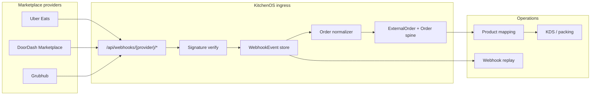

# Delivery Aggregator Integration Plan

**Audience:** Integration engineering, VP Operations, Product  
**Status:** Roadmap — DoorDash, Uber Eats, and Grubhub remain **PLACEHOLDER** in `lib/integrations/integration-registry.ts`  
**Related:** [`ops-vault-matrix.md`](./ops-vault-matrix.md) · [`feature-maturity-matrix.md`](./feature-maturity-matrix.md) · [`EXTERNAL_READY_REPORT.md`](./EXTERNAL_READY_REPORT.md)

---

## Executive summary

KitchenOS treats third-party delivery marketplaces as **honest placeholders** until partner credentials, signed webhooks, and live order normalization are proven in staging. WooCommerce and Shopify are the live channel spine; aggregators extend inbound order volume without replacing the direct-order / storefront path.

| Provider | Registry status | Code maturity | Partner gate |
|----------|-----------------|---------------|--------------|
| **Uber Eats** | PLACEHOLDER | Webhook route + HMAC verify + inbound normalizer skeleton | Uber developer / brand approval |
| **DoorDash** | PLACEHOLDER | Drive sync scaffold; quote/delivery stubs return `ok: false` | DoorDash Developer + merchant onboarding |
| **Grubhub** | PLACEHOLDER | Credential check + list history only | Grubhub for Restaurants API access |

**Honesty rule:** No marketing claim of “live DoorDash / Uber Eats / Grubhub sync” until registry status moves to `BETA` with staging smoke **PASS** (`lib/governance/marketing-claims-governance-policy.ts`).

---

## Current codebase map

| Area | Path | Notes |
|------|------|-------|
| Registry | `lib/integrations/integration-registry.ts` | `status: "PLACEHOLDER"` for all three |
| Placeholder honesty | `lib/integrations/integration-honesty.ts` | UI must not show green OK |
| Uber Eats webhook | `app/api/webhooks/uber-eats/orders/route.ts` | `cid` query param, HMAC-SHA256, `createWebhookEvent` |
| Uber Eats adapter | `services/integrations/uber-eats.ts`, `inbound-order.service.ts` | Normalizer skeleton; live API calls disabled |
| DoorDash service | `services/integrations/doordash/doordash-service.ts` | All live flows return placeholder messages |
| DoorDash Drive sync | `services/integrations/doordash/order-sync.service.ts` | JWT bearer to Drive v2 — **not wired to UI** |
| Grubhub service | `services/integrations/grubhub/grubhub-service.ts` | No outbound API calls |
| Dashboard pages | `app/dashboard/integrations/{doordash,grubhub,uber-eats}/` | Preparation + audit history only |
| Prisma models | `DoorDashDelivery`, `GrubhubDelivery`, `IntegrationProvider.UBER_EATS` | Historical scaffolding rows |

**Not in scope for this plan:** **Uber Direct** (`uber-direct`) — last-mile dispatch stub; separate from marketplace order ingestion.

---

## Shared architecture (target)

**Reuse from Woo/Shopify:**

- `createWebhookEvent` / idempotency via `externalEventId`
- `processInbound*` → `ExternalOrder` → internal `Order`
- Product mapping workbench for SKU / modifier aliasing
- Webhook replay (`services/webhooks/webhook-replay-service.ts`) for transient failures

---

## Provider 1 — Uber Eats (Priority P0)

### Why first

Most production-adjacent code already exists: signed webhook route, connection-scoped secrets, inbound processor hook, dashboard settings form, and menu-sync placeholder service.

### Official API surface (research)

| Capability | Uber Eats API (Marketplace) | KitchenOS target |
|------------|----------------------------|------------------|
| Auth | OAuth 2.0 client credentials (`client_id`, `client_secret`) per store | Encrypt in `IntegrationConnection.settingsJson`; token refresh job |
| Order ingestion | **Webhooks** (order notification events) + optional polling | Primary: webhook at `/api/webhooks/uber-eats/orders?cid=` |
| Menu sync | Menu API (items, modifiers, availability) | Phase 2 — after order path green |
| Order lifecycle | Accept / deny / ready / cancel via Order API | Phase 1 — map to KDS bump + status callbacks |
| Store metadata | Store API | Connection validation smoke |

**Documentation:** [Uber Eats Marketplace API](https://developer.uber.com/docs/eats) (partner-gated).

### Authentication

| Variable | Scope | Notes |
|----------|-------|-------|
| `UBER_EATS_CLIENT_ID` | Global fallback / smoke | Per-connection preferred |
| `UBER_EATS_CLIENT_SECRET` | Encrypted per connection | Via `ENCRYPTION_KEY` |
| `UBER_EATS_WEBHOOK_SECRET` | Per-store signing secret | Fallback if connection has no secret |
| Store UUID | Per connection | Required for menu + order API calls |

**Flow:** Client credentials → short-lived access token → Bearer on API calls. Rotate tokens in a cron or on 401.

### Webhook format (current implementation)

| Field | Value |
|-------|-------|
| URL | `POST /api/webhooks/uber-eats/orders?cid=<connectionId>` |
| Headers | `X-Uber-Eats-Signature` or `X-Uber-Signature` (HMAC-SHA256 over raw body) |
| Body | JSON order / event payload (official shape TBD per Uber provisioning) |
| Idempotency | `event_id` or `id` → `WebhookEvent.externalEventId` |
| Invalid sig | 401 + `markWebhookProcessed(..., false)` + ops signal |

**Gap:** `normalizeUberEatsOrder()` uses stub field mapping (`id`, `display_id`, `state`). Replace with official payload schema once partner docs are available.

### Implementation phases

| Phase | Deliverable | Exit criteria |
|-------|-------------|---------------|
| **UE-1** | Partner credentials in vault + connection UI | Staging connection saved; encryption configured |
| **UE-2** | Official normalizer + `ExternalOrder` persistence | Staging webhook replay smoke PASS |
| **UE-3** | Accept / ready callbacks to Uber | Order appears in Order Hub + KDS within 15s |
| **UE-4** | Menu sync (read + push availability) | Product mapping conflicts < threshold in pilot |

### Env / vault rows (add to ops matrix when live)

- `UBER_EATS_CLIENT_ID`, `UBER_EATS_CLIENT_SECRET`, `UBER_EATS_WEBHOOK_SECRET`, `UBER_EATS_STORE_ID` (staging smoke tenant)

---

## Provider 2 — DoorDash (Priority P1)

DoorDash spans **two products**; KitchenOS must not conflate them.

### 2A — DoorDash Drive (courier dispatch)

| Item | Detail |
|------|--------|
| Use case | Merchant-owned orders → request Dasher pickup/delivery |
| API | [DoorDash Drive API](https://developer.doordash.com/docs/drive) v2 |
| Auth | JWT signed with developer `signing_secret` + `developer_id` (not raw API key in prod) |
| Base URL | `DOORDASH_DRIVE_API_BASE` (default `https://openapi.doordash.com/drive/v2`) |
| Webhooks | Delivery status callbacks (created, picked_up, delivered, cancelled) |
| Existing code | `order-sync.service.ts` — accept/status PATCH (JWT placeholder uses `apiKey` as bearer — **must align with official JWT builder**) |

**Current env (preparation only):** `DOORDASH_API_KEY`, `DOORDASH_MERCHANT_ID` — registry lists these; Drive officially uses developer portal credentials.

### 2B — DoorDash Marketplace (order marketplace)

| Item | Detail |
|------|--------|
| Use case | Orders placed on DoorDash app → ingest into KitchenOS |
| API | Marketplace / POS integration (partner program) |
| Auth | OAuth or API keys per merchant — program-specific |
| Webhooks | Order create / cancel / status (format from partner pack) |
| Existing code | **None** — no `/api/webhooks/doordash/*` route yet |

### Authentication (target)

| Product | Credentials | Storage |
|---------|-------------|---------|
| Drive | `developer_id`, `key_id`, `signing_secret` | Workspace env + encrypted connection |
| Marketplace | Merchant / store tokens from partner onboarding | `IntegrationConnection` |

### Webhook format (to implement)

| Route (proposed) | `POST /api/webhooks/doordash/orders?cid=` |
|------------------|-------------------------------------------|
| Signature | Provider-specific (DoorDash docs: typically HMAC header on raw body) |
| Events | `order.created`, `order.cancelled`, delivery status for Drive |
| Storage | Same `WebhookEvent` pipeline as Uber Eats |

### Implementation phases

| Phase | Deliverable | Priority |
|-------|-------------|----------|
| **DD-1** | Fix Drive JWT auth helper; disable placeholder in `doordash-service` for quote/create when creds valid | P1 |
| **DD-2** | Drive webhook route + status → `DoorDashDelivery` model sync | P1 |
| **DD-3** | Marketplace partner enrollment + order webhook | P2 (blocked on DoorDash partnership) |
| **DD-4** | Menu sync (Marketplace) | P3 |

---

## Provider 3 — Grubhub (Priority P2)

### Official API surface (research)

| Capability | Grubhub for Restaurants | KitchenOS target |
|------------|-------------------------|------------------|
| Auth | API key + merchant / store ID | `GRUBHUB_API_KEY`, `GRUBHUB_MERCHANT_ID` |
| Order ingestion | Webhooks + REST order pull | Webhook primary |
| Menu | Menu endpoints (catalog sync) | Phase 2 |
| Status updates | Confirm, ready, out for delivery | Phase 1 |

**Documentation:** Grubhub developer portal (merchant/partner access required).

### Authentication

| Variable | Notes |
|----------|-------|
| `GRUBHUB_API_KEY` | Server-side only |
| `GRUBHUB_MERCHANT_ID` | Maps to store / brand |

Store encrypted per connection when multi-tenant production path ships.

### Webhook format (to implement)

| Route (proposed) | `POST /api/webhooks/grubhub/orders?cid=` |
|------------------|------------------------------------------|
| Signature | Confirm with Grubhub integration pack (often shared secret HMAC) |
| Payload | Order JSON with line items, modifiers, fulfillment type |
| Idempotency | External order ID → `WebhookEvent` |

**Gap:** No webhook route exists; `createGrubhubOrder()` always returns placeholder.

### Implementation phases

| Phase | Deliverable |
|-------|-------------|
| **GH-1** | Partner API access + staging merchant |
| **GH-2** | Webhook route + signature audit entry (46→47 routes) |
| **GH-3** | Normalizer → `ExternalOrder` + Order Hub |
| **GH-4** | Menu sync + availability |

---

## Cross-cutting requirements

### Product mapping

Aggregator menus use external SKUs and modifier trees. Before pilot:

1. Import or webhook-seed catalog snapshots.
2. Run mapping workbench (`/dashboard/product-mapping/*`).
3. Block auto-fulfillment when unmapped line items exceed policy threshold.

### Security

- All new webhook routes must pass `scripts/audit-webhook-signatures.ts`.
- Per-connection secrets via `getWebhookSecret(conn)`; no global secret in production.
- Rate limiting (`lib/rate-limit.ts` when shipped) on public webhook paths.

### Observability

- Reuse `emitWebhookSignatureInvalid` ops signals.
- Dashboard: `/dashboard/sales-channels/webhooks` + replay for aggregator events.
- Integration health cards show **Placeholder** until live smoke PASS.

### Testing strategy

| Test | Type | Dependency |
|------|------|------------|
| Signature verification unit tests | Jest | None |
| Inbound normalizer fixtures | Jest | Official payload samples from partners |
| Staging webhook inject | Script (pattern: `smoke-woocommerce-live.ts`) | Vault + test merchant |
| Order → KDS E2E | Playwright | `e2e/kds-staging.spec.ts` (future cycle) |

---

## Priority roadmap (recommended)

| Order | Provider | Scope | Est. effort | Blocker |
|-------|----------|-------|-------------|---------|
| **1** | Uber Eats | Webhook + normalizer + accept/ready | 3–4 weeks | Uber partner approval |
| **2** | DoorDash Drive | JWT auth fix + Drive webhooks + dispatch UI | 2–3 weeks | Developer portal credentials |
| **3** | Grubhub | Webhook + normalizer | 3–4 weeks | API partner access |
| **4** | DoorDash Marketplace | Full order ingest | 4–6 weeks | Marketplace partnership |
| **5** | All | Menu bi-directional sync | 4+ weeks each | Mapping UX maturity |

**Pilot recommendation:** Ship **Uber Eats UE-2** first for one staging brand; parallel **DoorDash Drive DD-1** for operators who own delivery logistics; defer Grubhub until UE staging smoke is green.

---

## Registry promotion criteria

Move integration from `PLACEHOLDER` → `BETA` when **all** are true:

1. Partner credentials configured in staging vault (not necessarily all 11 global secrets).
2. Signed webhook route audited and merged.
3. Staging smoke: synthetic or sandbox order → `ExternalOrder` → visible in Order Hub.
4. Product mapping policy documented for pilot tenant.
5. Marketing claims governance updated — no “live” language until `BETA`.

Move `BETA` → `LIVE` after 30-day pilot with replay-tested failure recovery and operator sign-off.

---

## Human gates (VP Ops / Partnerships)

| Gate | Owner | Action |
|------|-------|--------|
| Uber Eats developer account | Partnerships | Apply at Uber developer portal; link store UUID |
| DoorDash developer account | Partnerships | Enroll in Drive; separate marketplace POS inquiry |
| Grubhub API access | Partnerships | Merchant services / integration request |
| Staging credentials in vault | VP Ops | Extend vault matrix when aggregator smokes are scheduled |
| Legal / brand | Legal | Marketplace trademark usage on `/integrations/*` pages |

---

## Next engineering cycles (from execution tree)

After this document:

1. **KDS WebSocket RFC** — real-time bump for aggregator-sourced tickets (`docs/kds-websocket-rfc.md`).
2. **Aggregator staging smokes** — `scripts/smoke-uber-eats-live.ts` (pattern from Woo/Shopify).
3. **DoorDash webhook route** — new file under `app/api/webhooks/doordash/`.
4. **Signature audit refresh** — re-run audit when routes added.

---

## References

- Integration registry: `lib/integrations/integration-registry.ts`
- Uber Eats webhook: `app/api/webhooks/uber-eats/orders/route.ts`
- Webhook signature audit: `artifacts/webhook-signature-audit.json`
- Era competitor map: `docs/era17-product-gap-and-competitor-map-2026-05-28.md`
- Marketing claims: `lib/governance/marketing-claims-governance-policy.ts`
