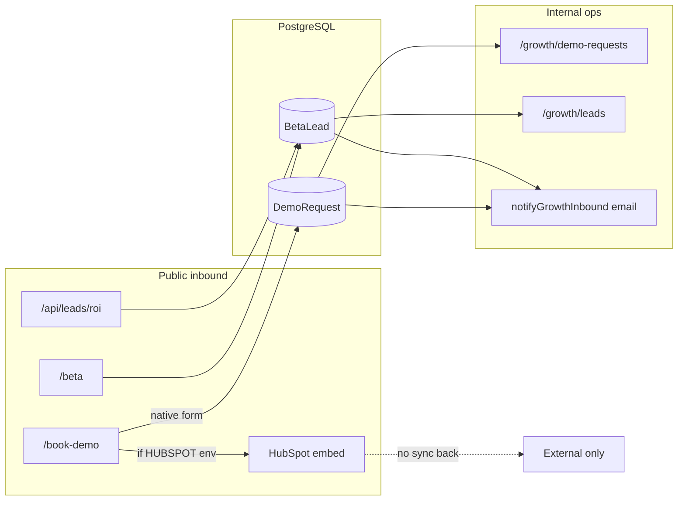

# Demo → CRM Integration Plan

**Status:** **PARTIAL** — native capture works; unified lifecycle + external CRM sync not wired  
**Updated:** 2026-06-01  
**Audience:** GTM, Sales ops, Engineering  
**Workflow audit:** [`fullreport1june.md`](./fullreport1june.md) § Workflow 1 — *Visitor → Demo → Sales*  
**Related:** [`GTM_SALES_PLAYBOOK.md`](./GTM_SALES_PLAYBOOK.md) · [`DEMO_WORKSPACE_SYSTEM.md`](./DEMO_WORKSPACE_SYSTEM.md) · [`crm-loyalty-growth-roadmap.md`](./crm-loyalty-growth-roadmap.md)

---

## Executive summary

KitchenOS captures inbound interest through **three parallel paths** that do not fully converge:

| Path | Storage | CRM surface | External sync |
|------|---------|-------------|---------------|
| Book demo (`/book-demo`) | `DemoRequest` | `/dashboard/growth/demo-requests` | HubSpot embed **or** email ping only |
| Beta waitlist (`/beta`) | `BetaLead` | `/dashboard/growth/leads` kanban | Email ping only |
| ROI calculator | `BetaLead` (`source: roi`) | Same kanban | Email ping only |

**Gap:** No automatic `DemoRequest` → `BetaLead` merge, no HubSpot outbound API, no UTM on demo form, no demo-session attribution on lead record. Sales ops must manually bridge records.

**Goal:** Single lifecycle record from first touch → demo scheduled → pilot LOI — with honest fallbacks when HubSpot env is unset.

**Do not claim:** “Full marketing automation,” “HubSpot-native CRM,” or “closed-loop attribution” until Phase 2 artifact PASS.

---

## Current architecture (as shipped)



### What works today

| Capability | Evidence | Status |
|------------|----------|--------|
| Native demo form + validation | `actions/book-demo.ts` → `prisma.demoRequest` | ✅ |
| Rate limit + honeypot | `consumeRateLimitToken`, `company_hp` | ✅ |
| HubSpot embed fallback | `components/marketing/hubspot-embed.tsx` | ✅ when env set |
| Beta lead scoring + kanban | `lib/growth/lead-scoring.ts`, `/growth/leads` | ✅ |
| Manual beta → demo convert | `convertBetaLeadToDemoRequest()` in `actions/growth.ts` | ✅ manual |
| Demo request status board | `/dashboard/growth/demo-requests` | ✅ |
| Founder email ping | `lib/growth/growth-notify.ts` | ⚠️ skipped if `GROWTH_NOTIFY_EMAIL` unset |
| Interactive demo CTA post-submit | `DemoRequestForm` → `/demo` | ✅ |
| Product events (ROI) | `captureProductEvent("roi_lead_submitted")` | ✅ |

### What is missing (PARTIAL root cause)

| Gap | Impact | Priority |
|-----|--------|----------|
| `DemoRequest` not linked to `BetaLead` on create | Duplicate records; kanban blind to demo-only leads | **P1** |
| HubSpot submissions stay in HubSpot only | No OS Kitchen lifecycle stage | **P1** |
| No UTM / referrer on `submitDemoRequest` | Attribution broken for paid campaigns | **P1** |
| No demo session → lead id (`/demo` anonymous) | Cannot score engaged visitors | **P2** |
| No HubSpot Contacts API push from native forms | Manual double entry for sales | **P2** |
| No Calendly webhook → `DEMO_SCHEDULED` stage | Calendar link is external only | **P2** |
| No smoke artifact for funnel integrity | Cannot cert “CRM wired” | **P1** |

---

## Target lifecycle (unified model)

Use existing `GrowthLifecycleStage` lanes in `lib/growth/growth-funnel.ts`:

| Stage | Trigger | Owner action |
|-------|---------|--------------|
| `VISITOR` | Product event / page view (optional) | — |
| `LEAD` | Beta or ROI submit | Auto |
| `MQL` | Lead score ≥ threshold | Auto (`scoreBetaLead`) |
| `SQL` | ICP fit confirmed | Sales manual |
| `DEMO_SCHEDULED` | Demo request or Calendly webhook | Auto + manual |
| `TRIAL_STARTED` | Workspace provisioned | CS |
| `ACTIVATED` | First live order | Ops |
| `PAYING` | Signed pilot SOW | Sales |

**Canonical rule:** Every inbound email should resolve to **one** `BetaLead` row; `DemoRequest` becomes a child event or linked foreign key — not a separate silo.

---

## Phase 1 — Unify native capture (1 week)

**Exit:** Demo submit creates/updates `BetaLead`; single kanban view; smoke artifact draft.

### 1.1 — Link `DemoRequest` → `BetaLead`

| Task | Detail |
|------|--------|
| Schema | Add `betaLeadId` optional FK on `DemoRequest`; or `demoRequestId` on `BetaLead` |
| `submitDemoRequest` | Upsert `BetaLead` by email; set `lifecycleStage: DEMO_SCHEDULED` or `SQL` |
| Dedup | Match on normalized email; merge fields (don't overwrite scored data) |
| Revalidate | `/dashboard/growth/leads` + `/growth/demo-requests` |

### 1.2 — UTM + attribution on book-demo

| Field | Source |
|-------|--------|
| `utmSource`, `utmMedium`, `utmCampaign` | Hidden fields from landing query string (mirror beta form) |
| `referrer` | `document.referrer` or server `Referer` header |
| `landingPath` | First path seen (session cookie `kos_first_touch`) |

Wire in `DemoRequestForm` + `submitDemoRequest` schema (already on `BetaLead`).

### 1.3 — Env + notifications

| Variable | Purpose |
|----------|---------|
| `GROWTH_NOTIFY_EMAIL` | Founder inbox — **required for ops alert** |
| `RESEND_API_KEY` | Email transport |
| `NEXT_PUBLIC_CALENDLY_URL` | Optional self-serve scheduling link |

Document in [`vercel-env-vars-production.md`](./vercel-env-vars-production.md) GTM section.

### 1.4 — Smoke artifact

Add `npm run smoke:demo-crm-funnel` → `artifacts/demo-crm-funnel-summary.json`:

```json
{
  "demoCreatesBetaLead": true,
  "utmCaptured": true,
  "notifyConfigured": true,
  "hubspotOptional": true,
  "overall": "PASSED"
}
```

**Pass criteria (Phase 1):** Native demo path creates linked `BetaLead`; UTM persisted; notify not silently skipped in staging test.

---

## Phase 2 — HubSpot bidirectional (2 weeks, optional)

**Only when** `HUBSPOT_PRIVATE_APP_TOKEN` + portal ID configured. **Do not block pilot** on HubSpot.

### 2.1 — Outbound: native form → HubSpot Contact

| Step | Implementation |
|------|----------------|
| On `submitDemoRequest` success | Server-side `POST /crm/v3/objects/contacts` |
| Properties map | `email`, `firstname`, `company`, `business_type`, `utm_*`, `lifecyclestage` |
| Idempotency | Store `hubspotContactId` on `BetaLead` |
| Failure | Log + continue — OS Kitchen DB is source of truth |

New service: `services/growth/hubspot-sync-service.ts` (server-only).

### 2.2 — Inbound: HubSpot form webhook (when embed used)

| Step | Implementation |
|------|----------------|
| Route | `POST /api/webhooks/hubspot/form-submission` |
| Verify | HubSpot v3 signature |
| Upsert | `BetaLead` + optional `DemoRequest` stub |
| Stage | `DEMO_SCHEDULED` if form id = demo form |

**Env:**

| Variable | Scope |
|----------|-------|
| `NEXT_PUBLIC_HUBSPOT_PORTAL_ID` | Client embed |
| `NEXT_PUBLIC_HUBSPOT_DEMO_FORM_ID` | Book demo |
| `NEXT_PUBLIC_HUBSPOT_SALES_FORM_ID` | Contact sales |
| `HUBSPOT_PRIVATE_APP_TOKEN` | Server API (secret) |
| `HUBSPOT_WEBHOOK_SECRET` | Inbound verification |

### 2.3 — Deprecate dual-path confusion

| Config | UX |
|--------|-----|
| HubSpot env **set** | Embed + **background sync to BetaLead** via webhook |
| HubSpot env **unset** | Native form only — full Phase 1 path |

Remove “either/or with zero sync” as end state.

---

## Phase 3 — Demo engagement attribution (post-pilot)

| Task | Detail |
|------|--------|
| Demo session cookie | `kos_demo_sid` on `/demo/*` |
| Link on convert | Pass `demoSessionId` when user later submits beta/demo |
| Events | `demo_scenario_completed`, `demo_time_on_site` → `captureProductEvent` |
| Sales view | Show engagement summary on `/growth/leads/[id]` |

Reference: [`GOLDEN_DEMO_SCENARIOS.md`](./GOLDEN_DEMO_SCENARIOS.md), `scripts/check-demo-scenarios.ts`.

---

## Phase 4 — Calendly + pilot handoff

| Integration | Stage update | Owner |
|-------------|--------------|-------|
| Calendly webhook | `DEMO_SCHEDULED` | Auto |
| Manual “Mark SQL” on lead detail | `SQL` | Sales |
| `convertBetaLeadToDemoRequest` | Keep as explicit action | Sales |
| Pilot SOW signed | `PAYING` + link workspace id | CS |

Calendly env: `CALENDLY_WEBHOOK_SIGNING_KEY`, `NEXT_PUBLIC_CALENDLY_URL`.

---

## Dashboard IA (no new nav sprawl)

| Route | Role after Phase 1 |
|-------|-------------------|
| `/dashboard/growth/leads` | **Primary** — all lifecycle stages |
| `/dashboard/growth/demo-requests` | Detail drill-down or merged tab |
| `/dashboard/growth/onboarding-calls` | Link `demoRequestId` / `betaLeadId` |
| `/dashboard/founder` | KPI tile: demoRequests + betaLeads (existing) |

Recommendation: add **“Demo events”** panel on lead detail instead of separate ops queue long-term.

---

## ICP routing rules

| `businessType` | Auto-tag | Sales playbook |
|----------------|----------|----------------|
| `MEAL_PREP` | `icp_primary` | [`GTM_SALES_PLAYBOOK.md`](./GTM_SALES_PLAYBOOK.md) meal prep track |
| `GHOST_KITCHEN` | `icp_primary` | Multi-brand demo scenario |
| `RESTAURANT` | `icp_secondary` | Qualify preorder complexity |
| Other | `review_required` | Manual SQL gate |

Use existing `scoreBetaLead` + [`icp-qualification-check.ts`](../scripts/icp-qualification-check.ts) output in lead detail.

---

## Honest sales / marketing wording

**Allowed now:**

- “Book a demo — we respond manually with honest scope”
- “Beta waitlist with ICP scoring”
- “Interactive product demo at `/demo`”

**Allowed after Phase 1 PASS:**

- “Demo requests flow into our growth pipeline with UTM attribution”

**Allowed after Phase 2 + HubSpot configured:**

- “HubSpot-integrated inbound (under NDA / your portal)”

**Not allowed:**

- “Marketing automation suite”
- “Full CDP” or “closed-loop campaign attribution”
- “Instant calendar booking” (unless Calendly webhook live)

---

## Verification checklist

| # | Check | Phase |
|---|-------|-------|
| 1 | Demo submit creates `BetaLead` with same email | 1 |
| 2 | UTM fields populated from campaign URL | 1 |
| 3 | `GROWTH_NOTIFY_EMAIL` delivers in staging | 1 |
| 4 | `smoke:demo-crm-funnel` → PASS | 1 |
| 5 | HubSpot contact id on lead (when token set) | 2 |
| 6 | HubSpot embed submission appears in kanban | 2 |
| 7 | Demo scenario completion visible on lead | 3 |
| 8 | Calendly booking sets `DEMO_SCHEDULED` | 4 |

---

## Ownership & timeline

| Phase | Window | DRI | Blocked by |
|-------|--------|-----|------------|
| 1 — Unify native | Pilot Week −2 | Growth eng | None — ship without vault |
| 2 — HubSpot | Post-LOI or GTM hire | Sales ops | `HUBSPOT_PRIVATE_APP_TOKEN` |
| 3 — Demo attribution | Post-pilot Month 1 | Product | Demo analytics spec |
| 4 — Calendly | When sales capacity | Sales | Webhook signing key |

**Current blocker for “FULLY_TESTED” workflow:** Phase 1 not implemented — status remains **PARTIAL**.

---

## References (code)

| Component | Path |
|-----------|------|
| Demo submit | `actions/book-demo.ts` |
| Beta submit | `actions/beta.ts` |
| ROI lead API | `app/api/leads/roi/route.ts` |
| HubSpot embed | `components/marketing/hubspot-embed.tsx` |
| Book demo section | `components/book-demo/book-demo-form-section.tsx` |
| Lead kanban | `app/dashboard/growth/leads/page.tsx` |
| Demo requests board | `app/dashboard/growth/demo-requests/page.tsx` |
| Convert action | `actions/growth.ts` → `convertBetaLeadToDemoRequest` |
| Notify | `lib/growth/growth-notify.ts` |
| Lifecycle stages | `lib/growth/growth-funnel.ts` |
