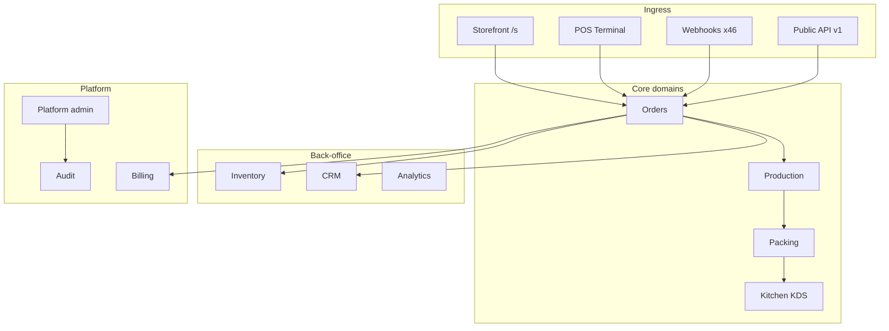

# KitchenOS Domain Map — Service Boundaries & Consolidation Plan

**Status:** Canonical post-pilot architecture reference  
**Generated:** 2026-05-31 (Cycle 83)  
**Scope:** `services/**/*.ts` — **619 modules** (excludes `*.test.ts`)  
**Related:** [`engineering-domain-map-draft.md`](./engineering-domain-map-draft.md) · [`artifacts/prisma-performance-audit.json`](../artifacts/prisma-performance-audit.json) · [`pen-test-plan.md`](./pen-test-plan.md)

---

## Executive summary

KitchenOS is a **modular monolith**: one Next.js app, one Prisma schema (369 models), services grouped by top-level folder under `services/`. The codebase is coherent for pilot delivery but **oversplit** in storefront experiments and near-duplicate domain folders.

| Metric | Value |
|--------|------|
| Total service modules | **619** |
| Top-level service domains | **~95** folders |
| Largest domain | **storefront** (193 files, incl. 60 `_experiments`) |
| Production-critical domains | Orders, POS, Storefront checkout, Integrations, Kitchen/KDS |
| Consolidation timing | **Post-first-paid-pilot** — no schema splits before P0 PASS |

**Honesty:** This map is for engineering navigation and merge planning. It does **not** claim microservice extraction or bounded-context isolation is complete.

---

## Domain grouping

Services are grouped into **12 product domains** plus **platform / commercial / quarantine** buckets. Counts are `.ts` files under `services/{domain}/`.

### Tier 1 — Revenue & operations (pilot-critical)

| Domain | Services | Primary paths | Key modules | Mutation / RBAC |
|--------|----------|---------------|-------------|-----------------|
| **Orders** | 12 | `services/orders/`, `services/order-hub/` | order-creation, order-detail, aggregation, order-hub | `order_create`, order lifecycle |
| **POS** | 18 | `services/pos/`, `actions/pos.ts` | checkout, shifts, void/refund, offline queue, terminal | `pos.access`, `pos_mutations` |
| **Storefront (core)** | ~133 | `services/storefront/` (excl. `_experiments`) | checkout, catalog, domains, Stripe connect, cart | `storefront_manage` |
| **Kitchen / KDS** | 4 | `services/kitchen-screen/`, `services/kitchen/`, `services/kds-websocket.ts` | daily queue, realtime transport | `kitchen_daily` |
| **Production** | 4 | `services/production/` | calendar, daily queue, generate-production | `production_calendar` |
| **Packing** | 3 | `services/packing/`, `services/packing-verification/` | queue, verify console | `packing_mutations` |
| **Integrations** | 25 | `services/integrations/`, `services/webhooks/`, `services/channels/` | Woo/Shopify, channel sync, webhook ingest/replay | `integrations_manage`, `channels_manage` |
| **Delivery & routes** | 7 | `services/delivery/`, `services/routes/` | slots, Uber Direct, route planner | delivery guards |

### Tier 2 — Back-office (beta / pilot-ready)

| Domain | Services | Primary paths | Notes |
|--------|----------|---------------|-------|
| **CRM & customers** | 18 | `services/crm/`, `services/customers/` | Segments, metrics, churn — merge candidate |
| **Inventory & purchasing** | 24 | `services/inventory/`, `services/purchasing/`, `services/ingredient-demand/` | PO, receiving, demand runs |
| **Menus & products** | 8 | `services/menus/`, `services/products/`, `services/product-mapping/` | Catalog, mapping workbench |
| **Staff & labor** | 11 | `services/staff/`, `services/labor/`, `services/training/` | Scheduling, time clock |
| **Costing & accounting** | 22 | `services/costing/`, `services/accounting/` | P&L, AP, OCR preview |
| **Analytics & reports** | 20 | `services/analytics/`, `services/reports/`, `services/executive/`, `services/forecast/` | Executive dashboard, saved reports |
| **Implementation & go-live** | 12 | `services/implementation/`, `services/go-live/`, `services/onboarding/` | Wizard, readiness |

### Tier 3 — Platform, growth, commercial

| Domain | Services | Primary paths | Notes |
|--------|----------|---------------|-------|
| **Platform admin** | 19 | `services/platform/` | Support sessions, impersonation, workspace health |
| **Developer / Public API** | 15 | `services/developer/` | API keys, webhook monitor, scopes |
| **Billing** | 8 | `services/billing/`, `services/payments/` | Stripe, entitlements — merge candidate |
| **Growth & beta** | 23 | `services/growth/`, `services/beta/`, `services/beta-ops/`, `services/partner/` | Leads, cohorts, partner ops |
| **Commercial / pilot** | 3 | `services/commercial/` | GO/NO-GO, era policies |
| **Security & audit** | 12 | `services/security/`, `services/audit/`, `services/activity/` | Rate limits, audit query/export |
| **Observability** | 8 | `services/observability/`, `services/incidents/` | Ops signals, incident rollup |
| **Cron & jobs** | 11 | `services/cron/`, `services/jobs/`, `services/queue/` | Scheduled tasks, webhook workers |

### Tier 4 — Supporting & niche

| Domain | Services | Examples |
|--------|----------|----------|
| Food safety | 5 | `food-safety/`, allergen, temperature |
| Catering & meal plans | 7 | quotes, meal-plan generator |
| Franchise & commissary | 5 | multi-unit, transfers |
| Marketing & loyalty | 4 | campaigns (preview), gift cards |
| AI / copilot | 8 | kitchen-ai, copilot (preview) |
| Storefront builder | 7 | theme, media, page builder |
| Misc single-file | ~15 | `email-service.ts`, `ttv-tracker.ts`, `demo-data.ts`, … |

### Quarantine — storefront experiments (do not merge into core)

| Bucket | Services | Path | Action |
|--------|----------|------|--------|
| **Storefront `_experiments`** | **60** | `services/storefront/_experiments/` | **Keep isolated** — EU AI Act sync, multiverse CRDT, D TN mesh, etc. Not pilot paths. Candidate for deletion or feature-flag archive post-pilot. |

---

## Architecture diagram



---

## Merge recommendations

Priority merges reduce import sprawl and duplicate guards. **Do not execute until first paid pilot closes** (schema stability gate).

| Priority | Merge target | Sources | Files saved (est.) | Rationale |
|----------|--------------|---------|-------------------|-----------|
| **P0** | `services/orders/` | `order-hub/` (3) | 3 | Order hub is thin wrapper over order spine |
| **P0** | `services/crm/` | `customers/` (2) | 2 | Single customer domain language |
| **P1** | `services/locations/` | `location/` (2) | 2 | Duplicate naming (`location` vs `locations`) |
| **P1** | `services/import-export/` | `import/` (2), `import-center/` (2), `imports/` (1) | 5 | One import center surface |
| **P1** | `services/kitchen-screen/` | `kitchen/` (1) | 1 | KDS is the product name |
| **P1** | `services/billing/` | `payments/` (1) | 1 | Stripe + terminal share billing boundary |
| **P1** | `services/forecast/` | `forecasting/` (1) | 1 | Duplicate forecast naming |
| **P2** | `services/analytics/` | `reports/` (2), `executive/` (2) | 4 | Reporting rollup under analytics |
| **P2** | `services/audit/` | `activity/` (1) | 1 | Activity feed is audit-adjacent |
| **P2** | `services/beta/` | `beta-ops/` (2) | 2 | Single beta pipeline |
| **P2** | `services/delivery/` | `routes/` (2) | 2 | Last-mile + route planner |
| **P3** | `services/storefront/` | `storefront-builder/` (7) | 7 | Builder is storefront subdomain |
| **P3** | Archive or delete | `storefront/_experiments/` (60) | 60 | Non-pilot experiment sync services |

**Estimated reduction after P0–P2 merges:** ~25 modules  
**Estimated reduction if experiments archived:** ~85 modules (~14% of codebase)

---

## Do-not-merge (explicit boundaries)

| Boundary | Reason |
|----------|--------|
| `services/platform/` ↔ tenant dashboards | Cross-tenant support; separate RBAC (`platform:*`) |
| `services/integrations/` ↔ `services/webhooks/` | Ingress (stateless routes) vs business processors — keep split |
| `services/commercial/` ↔ product code | Era policy / GO-NO-GO artifacts; no runtime coupling |
| `services/security/` ↔ `lib/rate-limit*` | Adapter layer stays in `lib/`; service consumes |
| Prisma schema splits | **Forbidden pre-pilot** — 369 models, single migration stream |

---

## Cross-reference: actions & app routes

| Domain | Server actions | Dashboard routes |
|--------|----------------|------------------|
| Orders | `actions/orders.ts`, `actions/order-hub.ts` | `/dashboard/orders`, `/dashboard/order-hub` |
| POS | `actions/pos.ts` | `/dashboard/pos` |
| Storefront | `actions/storefront/*` | `/dashboard/storefront/*`, `/s/[storeSlug]` |
| Integrations | `actions/integrations/*` | `/dashboard/sales-channels/*` |
| Platform | `actions/platform-*` | `/platform/*` |

Mutation registry: `lib/permissions/domain-mutation-registry.ts` (21 domains, 59 permission keys).

---

## Consolidation phases (post-pilot)

| Phase | Weeks | Scope | Exit criteria |
|-------|-------|-------|---------------|
| **1** | 1–2 | P0 merges (orders, crm) + delete dead experiment imports | CI green, no duplicate order write paths |
| **2** | 2–3 | P1 merges (import, locations, kitchen, billing) | Import center single entry; location service unified |
| **3** | 3–4 | P2 merges (analytics, beta, delivery) | Report builder uses one analytics service |
| **4** | 4–6 | `_experiments` archive or move to `packages/experiments/` | Storefront core ≤140 files; pilot deploy size ↓ |

---

## Verification

```bash
# Regenerate counts (approximate)
find services -name '*.ts' ! -name '*.test.ts' | wc -l

# Domain breakdown
find services -name '*.ts' ! -name '*.test.ts' | sed 's|services/||;s|/[^/]*$||' | awk -F/ '{print $1}' | sort | uniq -c | sort -rn
```

**Next doc cycles:** [`soft-delete-standard.md`](./soft-delete-standard.md) (cycle 84) · [`vercel-env-vars.md`](./vercel-env-vars.md) (cycle 85)
