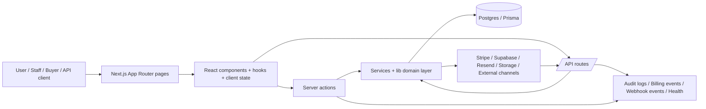

> **DEPRECATED — Historical audit (2026-05-26).** Do not use for release or sales decisions.  
> **Canonical source:** [`docs/canonical-doc-index.md`](./canonical-doc-index.md) → [`full-strategic-reaudit-2026-05-27.md`](./full-strategic-reaudit-2026-05-27.md), [`system-reality-model.md`](./system-reality-model.md).

# Enterprise Full Audit — 26 May
Read-only audit based on direct code inspection, targeted command execution, and machine-generated repository inventories. No production code was modified.
## 1. Executive Summary
KitchenOS is not a thin MVP. It is a very large, feature-broad Next.js 15 SaaS/POS platform with real billing, storefront checkout, canonical order creation, multi-workspace scoping, a large Prisma/Postgres schema, and a strong amount of docs/tests/audit intent already in place.

The strongest parts of the system today are:
- the canonical order creation path and its reuse across manual, POS, storefront, and public API flows;
- Stripe billing/webhook handling with idempotency and event logging;
- tenant-owner scoping foundations;
- broad documentation and test intent;
- a mature public storefront checkout path relative to the rest of the project.

The biggest risks are not “missing app code” but governance consistency:
- authorization is not uniformly enforced across the very large server-action/API surface;
- the POS surface is UX-rich but not permission-complete;
- several integrations are surfaced while still placeholder-only;
- release/ops tooling is partially broken (`validate-production-crons`) and the full typecheck currently OOMs;
- public file/media handling is not enterprise-safe yet.

Commercial conclusion:
- Suitable for founder-led pilots and selective SMB/restaurant deployments if scope is tightly controlled.
- Not ready for security review, enterprise procurement, or broad-channel “all integrations live” claims.
- Valuable codebase with significant replacement cost, but current state is not due-diligence clean enough for an enterprise buyer without a hardening phase.
## 2. Overall Score 0–100
- Overall score: **58 / 100**
- Interpretation: strong product/code breadth, mid-stage production governance, not enterprise-ready.
## 3. Department Scores
- Product / market narrative: **71 / 100**
- Frontend / UX implementation depth: **68 / 100**
- Backend / API architecture: **64 / 100**
- Database / data model maturity: **63 / 100**
- QA / automated verification: **66 / 100**
- Security / compliance posture: **52 / 100**
- DevOps / release readiness: **49 / 100**
- Marketing / growth readiness: **69 / 100**
- Sales readiness: **57 / 100**
- Enterprise readiness: **41 / 100**
## 4. Audit Evidence Snapshot
- Verified repository inventory: **698** page routes, **296** API routes, **693** exported action functions, **362** Prisma models, **266** enums, **335** tests, **1414** docs.
- Verified executable signal: API route classification audit passed with **296/296** routes classified (`137 cron`, `46 webhook`, `54 session`, `39 storefront`, `8 public`, others internal/health/invite).
- Verified executable signal: targeted critical-path tests passed (**5 files / 14 tests**): `public-api-auth`, `storefront-webhook-secret`, `pos-checkout-canonical`, `api-health-contract`, `order-creation-action-canonical`.
- Verified executable signal: full TypeScript verification did **not** complete; it failed with Node heap OOM (exit 134).
- Verified executable signal: `validate-production-crons.ts` failed at runtime on module resolution before doing its intended safety validation.
- Verified code scan: only **6 / 144** action files use centralized mutation RBAC (`requireMutationPermission`); **115 / 144** use tenant resolution without that explicit mutation capability layer.
- Verified code scan: only one real route applies explicit cross-site mutation origin protection (`/api/internal/dsr/export`).
## 5. Architecture Map

Key architectural observations:
- The repo uses a broad App Router surface with server components plus client-heavy operational modules.
- `services/orders/order-creation-service.ts` is a strong canonical seam and should remain the center of truth.
- Tenant ownership is resolved through owner/workspace mapping rather than pure row-level role partitioning.
- Operational complexity is high because cron/webhook/experiment surfaces are already very large.
## 6. Full Feature Inventory
### Feature: Marketing site and lead capture
- Feature name: Marketing site and lead capture
- Business purpose: Acquire restaurants/meal-prep/catering leads and route them into trial/demo funnels.
- User roles: Visitors, founders, marketing, sales
- User flow: Landing page -> hero CTA -> signup, demo, capabilities, or demo request form -> demo request persisted -> growth notification.
- UI elements: Site header, hero, trust strips, pricing, testimonials, FAQ, demo request form, cookie consent banner.
- Frontend files: app/page.tsx, components/landing/hero-section.tsx, components/marketing/site-header.tsx, app/book-demo/page.tsx, components/book-demo/demo-request-form.tsx
- Backend/API files: actions/book-demo.ts
- Database models: DemoRequest
- External integrations: HubSpot embed (conditional), Cookie consent / analytics tags
- Current status: Real and largely functional.
- What works: Metadata-driven marketing pages exist; demo form persists records; honeypot and rate limit exist; CTA surface is broad.
- What is broken: Inline validation and accessibility error feedback are light; growth path instrumentation is partial; Calendly/HubSpot are env-dependent.
- What is missing: Unified CRM attribution, richer funnel analytics, deterministic marketing event map.
- Edge cases: Spam, repeat submissions, marketing consent variations, missing env for embedded forms.
- Security considerations: Honeypot plus rate limits; still dependent on permissive CSP and optional third-party scripts.
- Performance considerations: Mostly static marketing content; Framer Motion and rich hero visuals need bundle vigilance.
- Analytics/tracking: Hero A/B view/CTA tracking and marketing consent hooks exist; broader funnel attribution is incomplete.
- Tests existing: Marketing a11y and signup smoke exist.
- Tests missing: Full CTA-to-demo conversion instrumentation audit and SEO regression matrix.
- Recommended improvements: Consolidate funnel events, add inline validation, and align CRM capture states.
- Owner roles: Growth PM, Frontend, Marketing Ops
- Priority: P1
- Estimated effort: 1-2 weeks

### Feature: Auth and account bootstrap
- Feature name: Auth and account bootstrap
- Business purpose: Create and authenticate KitchenOS users, bootstrap app user/profile/workspace state, and route them into onboarding or dashboard.
- User roles: Owners, staff, platform admins
- User flow: Signup/Login form -> `actions/auth.ts` -> Supabase auth -> `ensureAppUser` -> profile/subscription/settings/workspace bootstrap -> redirect.
- UI elements: Login form, signup form, forgot-password flow, theme toggle, post-auth redirects.
- Frontend files: app/login/page.tsx, components/auth/login-form.tsx, app/signup/page.tsx, components/auth/signup-form.tsx
- Backend/API files: actions/auth.ts, lib/auth.ts
- Database models: UserProfile, Subscription, KitchenSettings, ActivationState, Workspace
- External integrations: Supabase Auth, Referral attachment, Usage tracking
- Current status: Real and core-functional.
- What works: Server-side Zod validation, pending states, redirect safety, profile bootstrap, referral attach hook.
- What is broken: Role model is still coarse; some flows depend on duplicated role logic elsewhere; no enterprise SSO/SAML.
- What is missing: MFA for normal users, SSO, SCIM, enterprise invite lifecycle beyond storefront-specific invites.
- Edge cases: Existing email signup, unconfirmed email, deleted accounts, missing profile rows.
- Security considerations: Supabase auth and safe redirects are present; enterprise auth controls remain roadmap-level.
- Performance considerations: Low concern relative to the rest of the app.
- Analytics/tracking: Account creation usage event exists; login instrumentation is minimal.
- Tests existing: Public auth smoke and role navigation tests exist.
- Tests missing: End-to-end password reset, invite acceptance, and cross-role login matrix.
- Recommended improvements: Promote role/capability model and add enterprise auth controls.
- Owner roles: Backend, Security, Product
- Priority: P1
- Estimated effort: 2-4 weeks

### Feature: Dashboard shell and workspace navigation
- Feature name: Dashboard shell and workspace navigation
- Business purpose: Provide the main authenticated operating shell, module gating, nav discovery, support widgets, and tenant-aware context.
- User roles: Owners, staff, platform superadmin/support
- User flow: Session user -> tenant actor -> profile/settings/workspace -> billing/module gates -> dashboard shell -> nav rendering and module route gate.
- UI elements: Sidebar nav, breadcrumbs, support widget, NPS prompt, pilot notices, module route gate.
- Frontend files: app/dashboard/layout.tsx, components/dashboard/dashboard-nav.tsx, components/dashboard/dashboard-shell.tsx
- Backend/API files: lib/scope/cached-tenant.ts, lib/permissions/resolve-ui-permissions.ts, services/modules/module-release-service.ts
- Database models: UserProfile, KitchenSettings, KitchenModulePreference, Workspace, Brand
- External integrations: Supabase session, Billing access
- Current status: Real but operationally dense.
- What works: Central shell resolves tenant context, nav release profile, demo/support banners, and disabled modules.
- What is broken: UI gating is more mature than server-side mutation gating; nav surface is extremely large and complex.
- What is missing: A simpler, role-consistent navigation baseline for first customers and enterprise deployments.
- Edge cases: Platform super bypass, demo mode, incomplete onboarding, multi-brand workspace switching.
- Security considerations: Session required, but downstream module actions are not uniformly capability-gated.
- Performance considerations: Very large dashboard route surface increases build/typecheck/memory cost.
- Analytics/tracking: NPS prompt exists; dashboard event coverage is inconsistent.
- Tests existing: Dashboard shell tests and access denial E2E exist.
- Tests missing: Route-level regression coverage for major nav families and module gating.
- Recommended improvements: Reduce default nav surface and unify route + mutation permissions.
- Owner roles: Frontend, Product, Platform
- Priority: P1
- Estimated effort: 2-3 weeks

### Feature: Manual order center
- Feature name: Manual order center
- Business purpose: Allow staff to create, view, update, and operationalize weekly preorder/manual orders.
- User roles: Owner, manager, customer service, catering sales, authorized staff
- User flow: Order form -> `actions/orders.ts#createOrder` or `actions/order-creation.ts#createOrderViaCenterAction` -> canonical order creation service -> DB order + order items -> notifications and CRM updates.
- UI elements: Order form, product selection, totals, notes, status updates, order detail surfaces.
- Frontend files: app/dashboard/orders/new/page.tsx, components/dashboard/order-create-form.tsx, components/dashboard/orders/order-center.tsx
- Backend/API files: actions/orders.ts, actions/order-creation.ts, services/orders/order-creation-service.ts
- Database models: Order, OrderItem, KitchenCustomer, AuditLog
- External integrations: Email notifications, Push notifications, CRM metrics recompute
- Current status: Real and architecturally one of the stronger flows.
- What works: Canonical create path centralizes pricing, validation, PII encryption, audit logging, and CRM side effects.
- What is broken: Authorization for create path still includes duplicated hardcoded role logic in some entrypoints.
- What is missing: Uniform order permission model and broader negative-case UI messaging.
- Edge cases: No active menu, invalid product/menu association, monthly plan limit, missing customer data.
- Security considerations: Order PII is encrypted; audit logging exists; authorization consistency is still incomplete.
- Performance considerations: Service is centralized and reasonably efficient for the current scale.
- Analytics/tracking: Limited business analytics hooks for manual order creation.
- Tests existing: Canonical order creation unit and integration tests exist.
- Tests missing: Role-denial, concurrent create, and cross-workspace negative tests per entrypoint.
- Recommended improvements: Remove duplicated role logic and instrument first-order / order-created product events.
- Owner roles: Backend, Product, QA
- Priority: P0
- Estimated effort: 1 week

### Feature: Storefront checkout and public order capture
- Feature name: Storefront checkout and public order capture
- Business purpose: Let external customers browse a storefront, price carts, place pay-later or online-paid orders, and receive confirmations.
- User roles: Public customers, storefront owners, support
- User flow: Storefront page -> cart -> checkout client -> `submitPublicStorefrontOrder` -> shipping/tax/rules/price version checks -> DB storefrontOrder + internal Order -> optional Stripe Checkout -> webhook finalization -> confirmation page.
- UI elements: Fulfillment toggle, payment mode selector, customer fields, allergy input, pickup slot selector, delivery quote, promo code, terms checkbox, Turnstile, order summary.
- Frontend files: app/s/[storeSlug]/checkout/page.tsx, components/storefront/store-checkout-client.tsx
- Backend/API files: actions/storefront-order.ts, app/api/storefront/shipping/quote/route.ts, services/storefront/storefront-stripe-checkout-service.ts
- Database models: StorefrontSettings, StorefrontOrder, StorefrontOrderItem, Order, OrderItem, StorefrontDiscount, PickupWindow, StorefrontConversionEvent
- External integrations: Stripe Checkout, Turnstile, Email confirmations, Storefront analytics
- Current status: Real and comparatively mature.
- What works: Good validation depth: closure windows, blackout dates, fulfillment rules, pickup slot exhaustion, price-version drift, rate limiting, Turnstile, duplicate checkout suppression, promo handling, payment branching.
- What is broken: File upload scanning is stub elsewhere in storefront; online checkout readiness depends on configuration complexity; some analytics and rollback behaviors are partial.
- What is missing: Robust retry/rollback observability for failed online checkout after order creation; richer guest-account lifecycle and customer account UX.
- Edge cases: Delivery disabled, slot sold out, stale price version, duplicate submission, daily limits, missing Stripe readiness.
- Security considerations: PII is encrypted and rate limits exist; public uploads and media policy still need hardening.
- Performance considerations: Heavy but mostly acceptable; many checks happen server-side in a single submission path.
- Analytics/tracking: First-party storefront events and conversion rows exist.
- Tests existing: Storefront order flow, cart, pricing, tax, and many phase tests exist.
- Tests missing: Full production-like Stripe success/failure rollback matrix across connect/platform modes.
- Recommended improvements: Strengthen payment failure recovery and finalize security around uploads/media.
- Owner roles: Full Stack, Payments, QA, Security
- Priority: P0
- Estimated effort: 2-3 weeks

### Feature: POS terminal and counter checkout
- Feature name: POS terminal and counter checkout
- Business purpose: Support touch-first counter sales, offline queueing, CRM attach, loyalty/gift card use, and Stripe terminal placeholders.
- User roles: Restaurant staff, cashiers, managers
- User flow: POS terminal UI -> local cart/customer/register selection -> `posCheckoutAction` -> `checkoutPosSale` -> canonical order creation -> POS transaction/payment rows -> optional terminal capture via `/api/pos/terminal`.
- UI elements: Product tiles, cart, register/staff selectors, payment mode selector, customer search/quick-create, offline status, hardware link, tap-to-pay flow.
- Frontend files: app/dashboard/pos/terminal/page.tsx, components/dashboard/pos-terminal-client.tsx
- Backend/API files: actions/pos.ts, services/pos/pos-checkout-service.ts, app/api/pos/terminal/route.ts, services/payments/stripe-terminal-service.ts
- Database models: POSRegister, POSShift, POSTransaction, POSPayment, Order, OrderItem, POSAuditEvent
- External integrations: Stripe Terminal, CRM, Gift cards, Loyalty
- Current status: Real but not yet governance-complete.
- What works: Counter UX is rich; offline queue exists; checkout feeds canonical order flow; receipt and audit rows are created.
- What is broken: Role/permission enforcement for checkout/register/shift/hardware paths is incomplete; terminal payment mode still uses placeholder labels in several places.
- What is missing: Tighter cashier/manager controls, hardware lifecycle governance, stronger offline replay observability.
- Edge cases: Offline cash vs online card restrictions, missing register, missing staff, gift card/loyalty failures.
- Security considerations: Needs stronger server-side RBAC; financial operations are otherwise audited.
- Performance considerations: Client is heavy but suited for touch-first UX; offline sync path adds operational complexity.
- Analytics/tracking: POS analytics service exists, but comprehensive operator analytics coverage is not yet proven.
- Tests existing: POS canonical tests and POS E2E references exist.
- Tests missing: Denied-access and shift/register management matrix coverage.
- Recommended improvements: Lock down permissions and replace remaining placeholder terminology for terminal capture.
- Owner roles: Backend, Frontend, QA, Restaurant Operations
- Priority: P0
- Estimated effort: 1-2 weeks

### Feature: Billing and subscription lifecycle
- Feature name: Billing and subscription lifecycle
- Business purpose: Sell plans, enforce entitlements, track invoices, and sync Stripe subscription state.
- User roles: Owners, billing admins, finance, platform admins
- User flow: Billing page -> checkout route -> Stripe Checkout -> Stripe webhook -> subscription/invoice sync -> billing events and access changes.
- UI elements: Billing pages, checkout buttons, invoices, success/cancel pages, admin controls.
- Frontend files: app/dashboard/billing/page.tsx, components/dashboard/billing/checkout-buttons.tsx
- Backend/API files: app/api/billing/checkout/route.ts, app/api/checkout/route.ts, app/api/webhooks/stripe/route.ts, services/billing/subscription-service.ts
- Database models: Subscription, BillingCustomer, BillingEvent, InvoiceRecord
- External integrations: Stripe Checkout, Stripe webhooks, Customer portal
- Current status: Real and one of the stronger governance areas.
- What works: Server-resolved price IDs, webhook signature verification, billing event logging, invoice persistence, idempotency guard on billing events.
- What is broken: Legacy/duplicate route family increases drift risk; no enterprise contract billing workflow beyond admin override patterns.
- What is missing: Cleaner route consolidation, full revenue operations reporting, and enterprise invoice workflows.
- Edge cases: Missing Stripe config, repeated webhook events, payment failure, missing customer mapping.
- Security considerations: Strong relative to the rest of the repo; no raw card handling; webhook signature checks are present.
- Performance considerations: Low to moderate risk; Stripe round-trips dominate latency.
- Analytics/tracking: Billing events are stored; product-side funnel analytics can be stronger.
- Tests existing: Billing and Stripe contract/integration tests exist.
- Tests missing: Route family drift and end-to-end portal alias behavior.
- Recommended improvements: Consolidate endpoints and formalize enterprise billing operations.
- Owner roles: Backend, Finance Ops, QA
- Priority: P1
- Estimated effort: 1 week

### Feature: Public API
- Feature name: Public API
- Business purpose: Expose tenant-scoped orders/products/customers/inventory for external integrations and enterprise access.
- User roles: External integrators, enterprise customers, solutions engineers
- User flow: Bearer API key -> public API guard -> rate limit -> endpoint logic -> tenant-scoped Prisma query / canonical order create path -> JSON response.
- UI elements: Developer docs and API docs pages; API key management surfaces elsewhere.
- Frontend files: app/developers/page.tsx, app/developers/docs/page.tsx, app/api/docs/page.tsx
- Backend/API files: app/api/public/v1/orders/route.ts, lib/api-public/guard.ts, lib/api-public/auth.ts, lib/api-public/resolve-enterprise-api.ts
- Database models: ApiKey, Order, Product, KitchenCustomer
- External integrations: External bearer-key clients
- Current status: Real but limited in scope.
- What works: Bearer API keys are hashed, entitlement-gated, rate-limited, and order creation reuses canonical service.
- What is broken: Error model is still basic; public API breadth is narrow relative to enterprise expectations.
- What is missing: Versioning maturity, richer DTO docs, webhook/event subscriptions, full audit and SLA story.
- Edge cases: Unauthorized key, rate limit misconfiguration, plan not entitled, missing paid subscription.
- Security considerations: Good baseline guard pattern; key hashing salt depends on env posture.
- Performance considerations: Simple queries today, but scalability depends on indexes and pagination maturity.
- Analytics/tracking: Limited API usage analytics beyond key `lastUsedAt` and usage events.
- Tests existing: Public API auth/tenant isolation tests exist.
- Tests missing: Formal OpenAPI contract and backward-compatibility policy checks across versions.
- Recommended improvements: Expand API governance and lifecycle management before enterprise promises.
- Owner roles: Backend, Solutions Architecture, Security
- Priority: P1
- Estimated effort: 2-3 weeks

### Feature: Webhook ingestion and async processing
- Feature name: Webhook ingestion and async processing
- Business purpose: Ingest external events (Stripe, WooCommerce, Shopify, Resend, experimental feeds), validate them, and optionally queue processing.
- User roles: Integrations team, platform, support, QA
- User flow: Provider webhook -> signature/bearer guard -> webhook event row -> rate limit -> optional queue job -> processor -> audit/health rows.
- UI elements: Webhook diagnostics, logs, developer pages, platform webhooks views.
- Frontend files: app/platform/webhooks/page.tsx, app/dashboard/developer/webhooks/page.tsx
- Backend/API files: app/api/webhooks/**/*, lib/api/webhook-guard.ts, lib/webhooks/woocommerce-handler.ts, services/webhooks/**/*
- Database models: WebhookEvent, WebhookProcessingJob, ErrorRecoveryItem, IntegrationConnection
- External integrations: Stripe, WooCommerce, Shopify, Resend, many experimental webhook feeds
- Current status: Real but oversized.
- What works: Signature helpers exist; WooCommerce ingestion records events, duplicate suppression, queue mode, and rate limiting.
- What is broken: Surface is much broader than current sellable scope; async/cron governance tooling is not fully stable.
- What is missing: Reduced production surface, stronger observability ownership, clearer provider maturity matrix.
- Edge cases: Duplicate delivery, invalid signature, queue mode misconfiguration, provider-specific auth errors.
- Security considerations: Guard helpers are present; governance burden is the larger risk.
- Performance considerations: Queue mode helps, but huge route count expands operational overhead.
- Analytics/tracking: Operational observability exists, not business analytics.
- Tests existing: Webhook secrets, idempotency, replay, and provider-specific tests exist.
- Tests missing: Provider-by-provider production certification evidence.
- Recommended improvements: Shrink active surface and certify only live integrations.
- Owner roles: Platform, Integrations, Security
- Priority: P1
- Estimated effort: 2-4 weeks

### Feature: Storefront builder, pages, forms, and media
- Feature name: Storefront builder, pages, forms, and media
- Business purpose: Let operators configure a public storefront with pages, sections, forms, redirects, media, markets, and theme assets.
- User roles: Owners, marketers, designers, franchise admins
- User flow: Dashboard storefront admin pages -> actions/services -> Prisma content models -> published storefront rendering.
- UI elements: Builder editors, section library, media library, SEO/social forms, redirects, domains, forms builder.
- Frontend files: app/dashboard/storefront/**/*, components/storefront-builder/**/*, components/storefront/**/*
- Backend/API files: actions/storefront-pages.ts, actions/storefront-forms.ts, actions/storefront-media.ts, services/storefront/storefront-media-upload-service.ts
- Database models: StorefrontSettings, StorefrontPage, StorefrontSection, StorefrontAsset, StorefrontForm, StorefrontFormSubmission, StorefrontRedirect
- External integrations: Supabase/S3 storage, preview token, domain verification
- Current status: Real and broad, but security/compliance hardening is incomplete.
- What works: Content model depth is substantial; preview token flow exists; many builder surfaces are present.
- What is broken: Upload scanning and SVG policy are not enterprise-safe yet; builder surface is very large to govern.
- What is missing: Production-grade content-security policy, asset review workflow, clearer publishing rollback/runbooks.
- Edge cases: Storage missing, preview token missing, domain verification, form attachment abuse.
- Security considerations: Needs stronger file/media hardening before enterprise rollout.
- Performance considerations: Builder surface contributes significantly to codebase size and cognitive load.
- Analytics/tracking: Storefront conversion events exist; builder usage instrumentation is limited.
- Tests existing: Many storefront phase tests and visual tests exist.
- Tests missing: End-to-end publishing rollback and security upload policy tests.
- Recommended improvements: Finish content hardening and reduce sellable surface to the pieces that are truly certified.
- Owner roles: Frontend, Backend, Security, Design System Engineering
- Priority: P1
- Estimated effort: 2-4 weeks

### Feature: Tenant scope and audit logging
- Feature name: Tenant scope and audit logging
- Business purpose: Map session users to owner-scoped data, preserve audit trails, and support support/admin operations.
- User roles: Owners, staff, support, auditors, compliance
- User flow: Session user -> tenant-owner resolution -> owner-scoped Prisma filters -> mutation -> central audit log writer where implemented.
- UI elements: Audit logs pages, platform support/session pages, DSR export route, support tooling.
- Frontend files: app/dashboard/audit-logs/page.tsx, app/platform/support/page.tsx
- Backend/API files: lib/scope/resolve-kitchen-settings-owner.ts, lib/scope/assert-user-workspace-access.ts, services/audit/audit-service.ts
- Database models: Workspace, WorkspaceMember, AuditLog, AuditExport, PlatformSupportSession, ImpersonationSession
- External integrations: Supabase session
- Current status: Real and strategically strong, but not uniformly applied.
- What works: Tenant-owner resolution is explicit; audit log central service redacts metadata and hashes request data.
- What is broken: Audit logging is not universal (only ~48 usages in a 5,249-file scan); many mutations still omit explicit permission + audit pairing.
- What is missing: Consistent audit coverage map and enterprise-grade support session governance story.
- Edge cases: Workspace member to owner mapping, superadmin bypass, DSR export MFA.
- Security considerations: Good foundation, incomplete coverage.
- Performance considerations: Tenant resolution is cached, which helps.
- Analytics/tracking: Audit coverage exceeds analytics coverage for many flows.
- Tests existing: Tenant isolation and platform support tests exist.
- Tests missing: Audit presence assertions for more mutation families.
- Recommended improvements: Make permission+audit wrappers mandatory for critical mutations.
- Owner roles: Security, Backend, Compliance
- Priority: P1
- Estimated effort: 2 weeks

## 7. Full Page Inventory
### Critical page deep audit
#### `/`
- Business goal: Top-of-funnel acquisition and positioning.
- Target user: Anonymous visitor, founder, investor reviewer.
- Main UI blocks: Sticky site header, Hero with A/B CTA tracking, Trust/proof strips, Pricing, Testimonials, FAQ, Footer
- Key buttons / actions: Header sign-in CTA -> `/login`, Header trial CTA -> `/signup`, Hero primary CTA and secondary CTA from variant copy
- States observed: Strong marketing happy path; no deep form states on page itself.
- UX / accessibility notes: Good hierarchy and trust framing; risk of overpromising breadth because marketing surface is broader than live integration readiness.

#### `/signup`
- Business goal: Trial conversion and workspace creation.
- Target user: Prospect / future owner.
- Main UI blocks: Brand header, Trust badges, Signup form, Footer links
- Key buttons / actions: Create account -> `signUpAction`, Footer links to supporting pages
- States observed: Pending state exists (`Creating account...`); failures toast generic server error string; success redirects.
- UX / accessibility notes: Clean and focused, but no inline error association per field and no explicit password strength guidance beyond min length.

#### `/login`
- Business goal: Authenticated re-entry.
- Target user: Existing owner/staff/platform user.
- Main UI blocks: Brand header, Login form, Forgot-password link, Sign-up cross-link
- Key buttons / actions: Sign in -> `signInAction`
- States observed: Pending state exists; query-string auth errors toast on mount.
- UX / accessibility notes: Simple and serviceable; still mostly toast-driven validation feedback.

#### `/book-demo`
- Business goal: Sales-qualified lead capture.
- Target user: Restaurant prospect or buyer.
- Main UI blocks: Intro copy, Cross-links to demo/get-started/capabilities, HubSpot embed or native form
- Key buttons / actions: Request a demo -> `submitDemoRequest`, Open interactive demo, Join beta waitlist, Optional Calendly link
- States observed: Success state is present and useful; no per-field validation messages.
- UX / accessibility notes: Good fallback strategy (HubSpot vs native), but error feedback is coarse and sales ops enrichment is limited.

#### `/dashboard/orders/new`
- Business goal: Manual order creation for internal staff.
- Target user: Authorized owner/manager/customer-service/catering-sales user.
- Main UI blocks: Permission gate message, Customer info form, Fulfillment selector, Line items grid, Estimated total
- Key buttons / actions: Add row, Remove, Create preorder
- States observed: Permission denied state exists; form lacks explicit loading button state; success uses toast and hard redirect.
- UX / accessibility notes: Functional but not resilient; could use inline validation, disabled submit during action, and richer error mapping.

#### `/s/[storeSlug]/checkout`
- Business goal: Public revenue capture.
- Target user: External customer.
- Main UI blocks: Fulfillment selector, Payment selector, Customer/contact inputs, Allergy input, Pickup or delivery date/address, Terms, Turnstile, Order summary
- Key buttons / actions: Pickup, Delivery, Tip presets, Submit CTA, Back to menu
- States observed: Strong handling for loading/submission/empty cart/blocked payment mode/order paused/minimum order/slot unavailable/terms/captcha.
- UX / accessibility notes: One of the best audited flows in the project; remaining gaps are around post-order failure recovery and supporting account lifecycle.

#### `/dashboard/pos/terminal`
- Business goal: Fast counter sale execution.
- Target user: Restaurant staff/cashier/manager.
- Main UI blocks: Online/offline banner, Product search, Quick-order buttons, Product grid, Cart, Register/staff selectors, Customer attach card, Payment mode and terminal actions
- Key buttons / actions: Product tiles, Hardware, Customer quick actions, Quantity bump/remove, Checkout / terminal actions
- States observed: Offline queueing, queued-sales message, CRM customer search errors, pending terminal state.
- UX / accessibility notes: Rich and operationally thoughtful, but security governance (who can do what) is behind the UX maturity.

### Complete route registry appendix
This appendix lists every discovered page route with exact path and backing file. Semantic purpose for every single page was not guessed where code naming alone would have been low-confidence; critical pages are manually audited above.

#### Group `advisory-board` (1 routes)
- `/advisory-board` -> `app/advisory-board/page.tsx`

#### Group `api` (1 routes)
- `/api/docs` -> `app/api/docs/page.tsx`

#### Group `b` (1 routes)
- `/b/[brandSlug]` -> `app/b/[brandSlug]/page.tsx`

#### Group `beta` (1 routes)
- `/beta` -> `app/beta/page.tsx`

#### Group `blog` (7 routes)
- `/blog` -> `app/blog/page.tsx`
- `/blog/ghost-kitchen-setup-complete-guide` -> `app/blog/ghost-kitchen-setup-complete-guide/page.tsx`
- `/blog/how-to-choose-restaurant-pos-2026` -> `app/blog/how-to-choose-restaurant-pos-2026/page.tsx`
- `/blog/how-to-start-meal-prep-business` -> `app/blog/how-to-start-meal-prep-business/page.tsx`
- `/blog/meal-prep-order-queue-cut-packing-errors` -> `app/blog/meal-prep-order-queue-cut-packing-errors/page.tsx`
- `/blog/reduce-food-waste-with-production-planning` -> `app/blog/reduce-food-waste-with-production-planning/page.tsx`
- `/blog/restaurant-pos-comparison-2026` -> `app/blog/restaurant-pos-comparison-2026/page.tsx`

#### Group `book-demo` (1 routes)
- `/book-demo` -> `app/book-demo/page.tsx`

#### Group `capabilities` (1 routes)
- `/capabilities` -> `app/capabilities/page.tsx`

#### Group `case-studies` (1 routes)
- `/case-studies/[slug]` -> `app/case-studies/[slug]/page.tsx`

#### Group `changelog` (1 routes)
- `/changelog` -> `app/changelog/page.tsx`

#### Group `compare` (2 routes)
- `/compare` -> `app/compare/page.tsx`
- `/compare/[slug]` -> `app/compare/[slug]/page.tsx`

#### Group `contact-sales` (1 routes)
- `/contact-sales` -> `app/contact-sales/page.tsx`

#### Group `customers` (2 routes)
- `/customers` -> `app/customers/page.tsx`
- `/customers/[id]` -> `app/customers/[id]/page.tsx`

#### Group `dashboard` (525 routes)
- `/dashboard` -> `app/dashboard/page.tsx`
- `/dashboard/accounting/bank-reconciliation` -> `app/dashboard/accounting/bank-reconciliation/page.tsx`
- `/dashboard/accounting/cash-counts` -> `app/dashboard/accounting/cash-counts/page.tsx`
- `/dashboard/accounting/invoices` -> `app/dashboard/accounting/invoices/page.tsx`
- `/dashboard/accounting/vendor-payments` -> `app/dashboard/accounting/vendor-payments/page.tsx`
- `/dashboard/analytics` -> `app/dashboard/analytics/page.tsx`
- `/dashboard/analytics/catering` -> `app/dashboard/analytics/catering/page.tsx`
- `/dashboard/analytics/channels` -> `app/dashboard/analytics/channels/page.tsx`
- `/dashboard/analytics/customers` -> `app/dashboard/analytics/customers/page.tsx`
- `/dashboard/analytics/delivery` -> `app/dashboard/analytics/delivery/page.tsx`
- `/dashboard/analytics/forecasting` -> `app/dashboard/analytics/forecasting/page.tsx`
- `/dashboard/analytics/inventory` -> `app/dashboard/analytics/inventory/page.tsx`
- `/dashboard/analytics/meal-plans` -> `app/dashboard/analytics/meal-plans/page.tsx`
- `/dashboard/analytics/orders` -> `app/dashboard/analytics/orders/page.tsx`
- `/dashboard/analytics/production` -> `app/dashboard/analytics/production/page.tsx`
- `/dashboard/analytics/reports` -> `app/dashboard/analytics/reports/page.tsx`
- `/dashboard/analytics/revenue` -> `app/dashboard/analytics/revenue/page.tsx`
- `/dashboard/analytics/saved-views` -> `app/dashboard/analytics/saved-views/page.tsx`
- `/dashboard/audit-logs` -> `app/dashboard/audit-logs/page.tsx`
- `/dashboard/audit-logs/retention` -> `app/dashboard/audit-logs/retention/page.tsx`
- `/dashboard/beta-applications` -> `app/dashboard/beta-applications/page.tsx`
- `/dashboard/billing` -> `app/dashboard/billing/page.tsx`
- `/dashboard/billing/cancel` -> `app/dashboard/billing/cancel/page.tsx`
- `/dashboard/billing/cancelled` -> `app/dashboard/billing/cancelled/page.tsx`
- `/dashboard/billing/entitlements` -> `app/dashboard/billing/entitlements/page.tsx`
- `/dashboard/billing/history` -> `app/dashboard/billing/history/page.tsx`
- `/dashboard/billing/invoices` -> `app/dashboard/billing/invoices/page.tsx`
- `/dashboard/billing/payment-method` -> `app/dashboard/billing/payment-method/page.tsx`
- `/dashboard/billing/plans` -> `app/dashboard/billing/plans/page.tsx`
- `/dashboard/billing/settings` -> `app/dashboard/billing/settings/page.tsx`
- `/dashboard/billing/success` -> `app/dashboard/billing/success/page.tsx`
- `/dashboard/billing/usage` -> `app/dashboard/billing/usage/page.tsx`
- `/dashboard/brands` -> `app/dashboard/brands/page.tsx`
- `/dashboard/brands/[brandId]` -> `app/dashboard/brands/[brandId]/page.tsx`
- `/dashboard/brands/[brandId]/reports` -> `app/dashboard/brands/[brandId]/reports/page.tsx`
- `/dashboard/brands/assignment` -> `app/dashboard/brands/assignment/page.tsx`
- `/dashboard/brands/command-center` -> `app/dashboard/brands/command-center/page.tsx`
- `/dashboard/brands/multi-brand-setup` -> `app/dashboard/brands/multi-brand-setup/page.tsx`
- `/dashboard/brands/new` -> `app/dashboard/brands/new/page.tsx`
- `/dashboard/brands/templates` -> `app/dashboard/brands/templates/page.tsx`
- `/dashboard/calendar` -> `app/dashboard/calendar/page.tsx`
- `/dashboard/catering` -> `app/dashboard/catering/page.tsx`
- `/dashboard/catering-quotes` -> `app/dashboard/catering-quotes/page.tsx`
- `/dashboard/catering-quotes/[quoteId]` -> `app/dashboard/catering-quotes/[quoteId]/page.tsx`
- `/dashboard/catering-quotes/accepted` -> `app/dashboard/catering-quotes/accepted/page.tsx`
- `/dashboard/catering-quotes/follow-ups` -> `app/dashboard/catering-quotes/follow-ups/page.tsx`
- `/dashboard/catering-quotes/new` -> `app/dashboard/catering-quotes/new/page.tsx`
- `/dashboard/catering-quotes/pipeline` -> `app/dashboard/catering-quotes/pipeline/page.tsx`
- `/dashboard/catering-quotes/public-proposals` -> `app/dashboard/catering-quotes/public-proposals/page.tsx`
- `/dashboard/catering-quotes/quotes` -> `app/dashboard/catering-quotes/quotes/page.tsx`
- `/dashboard/catering-quotes/reports` -> `app/dashboard/catering-quotes/reports/page.tsx`
- `/dashboard/catering-quotes/settings` -> `app/dashboard/catering-quotes/settings/page.tsx`
- `/dashboard/catering-quotes/templates` -> `app/dashboard/catering-quotes/templates/page.tsx`
- `/dashboard/commissary/transfers` -> `app/dashboard/commissary/transfers/page.tsx`
- `/dashboard/compliance/experiment-audit` -> `app/dashboard/compliance/experiment-audit/page.tsx`
- `/dashboard/copilot` -> `app/dashboard/copilot/page.tsx`
- `/dashboard/copilot/audit` -> `app/dashboard/copilot/audit/page.tsx`
- `/dashboard/copilot/chat` -> `app/dashboard/copilot/chat/page.tsx`
- `/dashboard/copilot/drafts` -> `app/dashboard/copilot/drafts/page.tsx`
- `/dashboard/copilot/insights` -> `app/dashboard/copilot/insights/page.tsx`
- `/dashboard/copilot/settings` -> `app/dashboard/copilot/settings/page.tsx`
- `/dashboard/copilot/sources` -> `app/dashboard/copilot/sources/page.tsx`
- `/dashboard/copilot/summaries` -> `app/dashboard/copilot/summaries/page.tsx`
- `/dashboard/costing` -> `app/dashboard/costing/page.tsx`
- `/dashboard/costing/alerts` -> `app/dashboard/costing/alerts/page.tsx`
- `/dashboard/costing/avt` -> `app/dashboard/costing/avt/page.tsx`
- `/dashboard/costing/channel-fees` -> `app/dashboard/costing/channel-fees/page.tsx`
- `/dashboard/costing/components` -> `app/dashboard/costing/components/page.tsx`
- `/dashboard/costing/items` -> `app/dashboard/costing/items/page.tsx`
- `/dashboard/costing/menus` -> `app/dashboard/costing/menus/page.tsx`
- `/dashboard/costing/recipes-missing` -> `app/dashboard/costing/recipes-missing/page.tsx`
- `/dashboard/costing/reports` -> `app/dashboard/costing/reports/page.tsx`
- `/dashboard/costing/scenarios` -> `app/dashboard/costing/scenarios/page.tsx`
- `/dashboard/costing/settings` -> `app/dashboard/costing/settings/page.tsx`
- `/dashboard/costing/theft` -> `app/dashboard/costing/theft/page.tsx`
- `/dashboard/crm/customers/[customerId]` -> `app/dashboard/crm/customers/[customerId]/page.tsx`
- `/dashboard/customers` -> `app/dashboard/customers/page.tsx`
- `/dashboard/customers/[customerId]` -> `app/dashboard/customers/[customerId]/page.tsx`
- `/dashboard/customers/allergies` -> `app/dashboard/customers/allergies/page.tsx`
- `/dashboard/customers/at-risk` -> `app/dashboard/customers/at-risk/page.tsx`
- `/dashboard/customers/churn-risk` -> `app/dashboard/customers/churn-risk/page.tsx`
- `/dashboard/customers/companies` -> `app/dashboard/customers/companies/page.tsx`
- `/dashboard/customers/dedupe` -> `app/dashboard/customers/dedupe/page.tsx`
- `/dashboard/customers/deduplication` -> `app/dashboard/customers/deduplication/page.tsx`
- `/dashboard/customers/feedback` -> `app/dashboard/customers/feedback/page.tsx`
- `/dashboard/customers/follow-ups` -> `app/dashboard/customers/follow-ups/page.tsx`
- `/dashboard/customers/list` -> `app/dashboard/customers/list/page.tsx`
- `/dashboard/customers/loyalty` -> `app/dashboard/customers/loyalty/page.tsx`
- `/dashboard/customers/new` -> `app/dashboard/customers/new/page.tsx`
- `/dashboard/customers/reports` -> `app/dashboard/customers/reports/page.tsx`
- `/dashboard/customers/segments` -> `app/dashboard/customers/segments/page.tsx`
- `/dashboard/customers/vip` -> `app/dashboard/customers/vip/page.tsx`
- `/dashboard/demo/scenarios` -> `app/dashboard/demo/scenarios/page.tsx`
- `/dashboard/developer` -> `app/dashboard/developer/page.tsx`
- `/dashboard/developer/api-keys` -> `app/dashboard/developer/api-keys/page.tsx`
- `/dashboard/developer/docs` -> `app/dashboard/developer/docs/page.tsx`
- `/dashboard/developer/email-preview` -> `app/dashboard/developer/email-preview/page.tsx`
- `/dashboard/developer/flags` -> `app/dashboard/developer/flags/page.tsx`
- `/dashboard/developer/health` -> `app/dashboard/developer/health/page.tsx`
- `/dashboard/developer/incidents` -> `app/dashboard/developer/incidents/page.tsx`
- `/dashboard/developer/integrations` -> `app/dashboard/developer/integrations/page.tsx`
- `/dashboard/developer/jobs` -> `app/dashboard/developer/jobs/page.tsx`
- `/dashboard/developer/logs` -> `app/dashboard/developer/logs/page.tsx`
- `/dashboard/developer/performance` -> `app/dashboard/developer/performance/page.tsx`
- `/dashboard/developer/releases` -> `app/dashboard/developer/releases/page.tsx`
- `/dashboard/developer/tools` -> `app/dashboard/developer/tools/page.tsx`
- `/dashboard/developer/webhooks` -> `app/dashboard/developer/webhooks/page.tsx`
- `/dashboard/error-recovery` -> `app/dashboard/error-recovery/page.tsx`
- `/dashboard/executive` -> `app/dashboard/executive/page.tsx`
- `/dashboard/executive/brands-locations` -> `app/dashboard/executive/brands-locations/page.tsx`
- `/dashboard/executive/customers` -> `app/dashboard/executive/customers/page.tsx`
- `/dashboard/executive/operations` -> `app/dashboard/executive/operations/page.tsx`
- `/dashboard/executive/profitability` -> `app/dashboard/executive/profitability/page.tsx`
- `/dashboard/executive/report` -> `app/dashboard/executive/report/page.tsx`
- `/dashboard/executive/revenue` -> `app/dashboard/executive/revenue/page.tsx`
- `/dashboard/executive/risks` -> `app/dashboard/executive/risks/page.tsx`
- `/dashboard/food-safety` -> `app/dashboard/food-safety/page.tsx`
- `/dashboard/food-safety/allergens` -> `app/dashboard/food-safety/allergens/page.tsx`
- `/dashboard/food-safety/audits` -> `app/dashboard/food-safety/audits/page.tsx`
- `/dashboard/food-safety/audits/[auditId]` -> `app/dashboard/food-safety/audits/[auditId]/page.tsx`
- `/dashboard/food-safety/checklists` -> `app/dashboard/food-safety/checklists/page.tsx`
- `/dashboard/food-safety/iot-devices` -> `app/dashboard/food-safety/iot-devices/page.tsx`
- `/dashboard/food-safety/temperature` -> `app/dashboard/food-safety/temperature/page.tsx`
- `/dashboard/forecast` -> `app/dashboard/forecast/page.tsx`
- `/dashboard/forecast/[runId]` -> `app/dashboard/forecast/[runId]/page.tsx`
- `/dashboard/forecast/ai` -> `app/dashboard/forecast/ai/page.tsx`
- `/dashboard/forecast/history` -> `app/dashboard/forecast/history/page.tsx`
- `/dashboard/forecast/new` -> `app/dashboard/forecast/new/page.tsx`
- `/dashboard/forecast/settings` -> `app/dashboard/forecast/settings/page.tsx`
- `/dashboard/founder` -> `app/dashboard/founder/page.tsx`
- `/dashboard/franchise/royalties` -> `app/dashboard/franchise/royalties/page.tsx`
- `/dashboard/gift-cards` -> `app/dashboard/gift-cards/page.tsx`
- `/dashboard/go-live` -> `app/dashboard/go-live/page.tsx`
- `/dashboard/go-live/projects/[projectId]` -> `app/dashboard/go-live/projects/[projectId]/page.tsx`
- `/dashboard/go-live/test-run` -> `app/dashboard/go-live/test-run/page.tsx`
- `/dashboard/growth` -> `app/dashboard/growth/page.tsx`
- `/dashboard/growth/accounts` -> `app/dashboard/growth/accounts/page.tsx`
- `/dashboard/growth/advisory-board` -> `app/dashboard/growth/advisory-board/page.tsx`
- `/dashboard/growth/content-library` -> `app/dashboard/growth/content-library/page.tsx`
- `/dashboard/growth/customer-success` -> `app/dashboard/growth/customer-success/page.tsx`
- `/dashboard/growth/demo-requests` -> `app/dashboard/growth/demo-requests/page.tsx`
- `/dashboard/growth/feedback` -> `app/dashboard/growth/feedback/page.tsx`
- `/dashboard/growth/launch-analytics` -> `app/dashboard/growth/launch-analytics/page.tsx`
- `/dashboard/growth/leads` -> `app/dashboard/growth/leads/page.tsx`
- `/dashboard/growth/leads/[id]` -> `app/dashboard/growth/leads/[id]/page.tsx`
- `/dashboard/growth/onboarding-calls` -> `app/dashboard/growth/onboarding-calls/page.tsx`
- `/dashboard/growth/outreach` -> `app/dashboard/growth/outreach/page.tsx`
- `/dashboard/growth/partner-leads` -> `app/dashboard/growth/partner-leads/page.tsx`
- `/dashboard/growth/referrals` -> `app/dashboard/growth/referrals/page.tsx`
- `/dashboard/growth/roadmap` -> `app/dashboard/growth/roadmap/page.tsx`
- `/dashboard/growth/sales-inquiries` -> `app/dashboard/growth/sales-inquiries/page.tsx`
- `/dashboard/growth/usage` -> `app/dashboard/growth/usage/page.tsx`
- `/dashboard/implementation` -> `app/dashboard/implementation/page.tsx`
- `/dashboard/implementation/[projectId]` -> `app/dashboard/implementation/[projectId]/page.tsx`
- `/dashboard/implementation/[projectId]/activity` -> `app/dashboard/implementation/[projectId]/activity/page.tsx`
- `/dashboard/implementation/[projectId]/checklist` -> `app/dashboard/implementation/[projectId]/checklist/page.tsx`
- `/dashboard/implementation/[projectId]/go-live` -> `app/dashboard/implementation/[projectId]/go-live/page.tsx`
- `/dashboard/implementation/[projectId]/integrations` -> `app/dashboard/implementation/[projectId]/integrations/page.tsx`
- `/dashboard/implementation/[projectId]/migration` -> `app/dashboard/implementation/[projectId]/migration/page.tsx`
- `/dashboard/implementation/[projectId]/risks` -> `app/dashboard/implementation/[projectId]/risks/page.tsx`
- `/dashboard/implementation/[projectId]/timeline` -> `app/dashboard/implementation/[projectId]/timeline/page.tsx`
- `/dashboard/implementation/[projectId]/training` -> `app/dashboard/implementation/[projectId]/training/page.tsx`
- `/dashboard/implementation/[projectId]/uat` -> `app/dashboard/implementation/[projectId]/uat/page.tsx`
- `/dashboard/implementation/activity` -> `app/dashboard/implementation/activity/page.tsx`
- `/dashboard/implementation/checklist` -> `app/dashboard/implementation/checklist/page.tsx`
- `/dashboard/implementation/enterprise` -> `app/dashboard/implementation/enterprise/page.tsx`
- `/dashboard/implementation/go-live` -> `app/dashboard/implementation/go-live/page.tsx`
- `/dashboard/implementation/handoff` -> `app/dashboard/implementation/handoff/page.tsx`
- `/dashboard/implementation/integrations` -> `app/dashboard/implementation/integrations/page.tsx`
- `/dashboard/implementation/migration` -> `app/dashboard/implementation/migration/page.tsx`
- `/dashboard/implementation/new` -> `app/dashboard/implementation/new/page.tsx`
- `/dashboard/implementation/projects` -> `app/dashboard/implementation/projects/page.tsx`
- `/dashboard/implementation/reports` -> `app/dashboard/implementation/reports/page.tsx`
- `/dashboard/implementation/risks` -> `app/dashboard/implementation/risks/page.tsx`
- `/dashboard/implementation/training` -> `app/dashboard/implementation/training/page.tsx`
- `/dashboard/implementation/uat` -> `app/dashboard/implementation/uat/page.tsx`
- `/dashboard/import-center` -> `app/dashboard/import-center/page.tsx`
- `/dashboard/import-center/errors` -> `app/dashboard/import-center/errors/page.tsx`
- `/dashboard/import-center/history` -> `app/dashboard/import-center/history/page.tsx`
- `/dashboard/import-center/jobs/[jobId]` -> `app/dashboard/import-center/jobs/[jobId]/page.tsx`
- `/dashboard/import-center/migrate` -> `app/dashboard/import-center/migrate/page.tsx`
- `/dashboard/import-center/settings` -> `app/dashboard/import-center/settings/page.tsx`
- `/dashboard/import-center/templates` -> `app/dashboard/import-center/templates/page.tsx`
- `/dashboard/import-center/upload` -> `app/dashboard/import-center/upload/page.tsx`
- `/dashboard/import-export` -> `app/dashboard/import-export/page.tsx`
- `/dashboard/import-export/export` -> `app/dashboard/import-export/export/page.tsx`
- `/dashboard/import-export/exports` -> `app/dashboard/import-export/exports/page.tsx`
- `/dashboard/import-export/import` -> `app/dashboard/import-export/import/page.tsx`
- `/dashboard/import-export/imports` -> `app/dashboard/import-export/imports/page.tsx`
- `/dashboard/import-export/imports/[jobId]` -> `app/dashboard/import-export/imports/[jobId]/page.tsx`
- `/dashboard/import-export/settings` -> `app/dashboard/import-export/settings/page.tsx`
- `/dashboard/import-export/templates` -> `app/dashboard/import-export/templates/page.tsx`
- `/dashboard/import-export/validation-errors` -> `app/dashboard/import-export/validation-errors/page.tsx`
- `/dashboard/integration-health` -> `app/dashboard/integration-health/page.tsx`
- `/dashboard/integrations` -> `app/dashboard/integrations/page.tsx`
- `/dashboard/integrations/7shifts` -> `app/dashboard/integrations/7shifts/page.tsx`
- `/dashboard/integrations/doordash` -> `app/dashboard/integrations/doordash/page.tsx`
- `/dashboard/integrations/grubhub` -> `app/dashboard/integrations/grubhub/page.tsx`
- `/dashboard/integrations/health` -> `app/dashboard/integrations/health/page.tsx`
- `/dashboard/integrations/homebase` -> `app/dashboard/integrations/homebase/page.tsx`
- `/dashboard/integrations/quickbooks` -> `app/dashboard/integrations/quickbooks/page.tsx`
- `/dashboard/integrations/shopify` -> `app/dashboard/integrations/shopify/page.tsx`
- `/dashboard/integrations/uber-direct` -> `app/dashboard/integrations/uber-direct/page.tsx`
- `/dashboard/integrations/uber-eats` -> `app/dashboard/integrations/uber-eats/page.tsx`
- `/dashboard/integrations/webhooks` -> `app/dashboard/integrations/webhooks/page.tsx`
- `/dashboard/integrations/woocommerce` -> `app/dashboard/integrations/woocommerce/page.tsx`
- `/dashboard/integrations/xero` -> `app/dashboard/integrations/xero/page.tsx`
- `/dashboard/inventory/counts` -> `app/dashboard/inventory/counts/page.tsx`
- `/dashboard/inventory/counts/[countId]` -> `app/dashboard/inventory/counts/[countId]/page.tsx`
- `/dashboard/inventory/demand` -> `app/dashboard/inventory/demand/page.tsx`
- `/dashboard/inventory/demand/settings` -> `app/dashboard/inventory/demand/settings/page.tsx`
- `/dashboard/inventory/receiving` -> `app/dashboard/inventory/receiving/page.tsx`
- `/dashboard/inventory/waste` -> `app/dashboard/inventory/waste/page.tsx`
- `/dashboard/kitchen` -> `app/dashboard/kitchen/page.tsx`
- `/dashboard/kitchen/fullscreen` -> `app/dashboard/kitchen/fullscreen/page.tsx`
- `/dashboard/kitchen/tablet` -> `app/dashboard/kitchen/tablet/page.tsx`
- `/dashboard/locations` -> `app/dashboard/locations/page.tsx`
- `/dashboard/locations/[locationId]` -> `app/dashboard/locations/[locationId]/page.tsx`
- `/dashboard/locations/[locationId]/brands` -> `app/dashboard/locations/[locationId]/brands/page.tsx`
- `/dashboard/locations/[locationId]/fulfillment` -> `app/dashboard/locations/[locationId]/fulfillment/page.tsx`
- `/dashboard/locations/[locationId]/hours` -> `app/dashboard/locations/[locationId]/hours/page.tsx`
- `/dashboard/locations/[locationId]/inventory` -> `app/dashboard/locations/[locationId]/inventory/page.tsx`
- `/dashboard/locations/[locationId]/menus` -> `app/dashboard/locations/[locationId]/menus/page.tsx`
- `/dashboard/locations/[locationId]/orders` -> `app/dashboard/locations/[locationId]/orders/page.tsx`
- `/dashboard/locations/[locationId]/production` -> `app/dashboard/locations/[locationId]/production/page.tsx`
- `/dashboard/locations/[locationId]/profile` -> `app/dashboard/locations/[locationId]/profile/page.tsx`
- `/dashboard/locations/[locationId]/reports` -> `app/dashboard/locations/[locationId]/reports/page.tsx`
- `/dashboard/locations/[locationId]/routes` -> `app/dashboard/locations/[locationId]/routes/page.tsx`
- `/dashboard/locations/[locationId]/settings` -> `app/dashboard/locations/[locationId]/settings/page.tsx`
- `/dashboard/locations/active` -> `app/dashboard/locations/active/page.tsx`
- `/dashboard/locations/assignment` -> `app/dashboard/locations/assignment/page.tsx`
- `/dashboard/locations/new` -> `app/dashboard/locations/new/page.tsx`
- `/dashboard/locations/reports` -> `app/dashboard/locations/reports/page.tsx`
- `/dashboard/locations/settings` -> `app/dashboard/locations/settings/page.tsx`
- `/dashboard/locations/setup` -> `app/dashboard/locations/setup/page.tsx`
- `/dashboard/locations/templates` -> `app/dashboard/locations/templates/page.tsx`
- `/dashboard/marketing/email-campaigns` -> `app/dashboard/marketing/email-campaigns/page.tsx`
- `/dashboard/marketing/holiday-packages` -> `app/dashboard/marketing/holiday-packages/page.tsx`
- `/dashboard/meal-plans` -> `app/dashboard/meal-plans/page.tsx`
- `/dashboard/meal-plans/[planId]` -> `app/dashboard/meal-plans/[planId]/page.tsx`
- `/dashboard/meal-plans/active` -> `app/dashboard/meal-plans/active/page.tsx`
- `/dashboard/meal-plans/customers` -> `app/dashboard/meal-plans/customers/page.tsx`
- `/dashboard/meal-plans/cycles` -> `app/dashboard/meal-plans/cycles/page.tsx`
- `/dashboard/meal-plans/generated` -> `app/dashboard/meal-plans/generated/page.tsx`
- `/dashboard/meal-plans/needs-review` -> `app/dashboard/meal-plans/needs-review/page.tsx`
- `/dashboard/meal-plans/new` -> `app/dashboard/meal-plans/new/page.tsx`
- `/dashboard/meal-plans/paused` -> `app/dashboard/meal-plans/paused/page.tsx`
- `/dashboard/meal-plans/reports` -> `app/dashboard/meal-plans/reports/page.tsx`
- `/dashboard/meal-plans/settings` -> `app/dashboard/meal-plans/settings/page.tsx`
- `/dashboard/meal-plans/templates` -> `app/dashboard/meal-plans/templates/page.tsx`
- `/dashboard/meal-subscriptions` -> `app/dashboard/meal-subscriptions/page.tsx`
- `/dashboard/menu-planner` -> `app/dashboard/menu-planner/page.tsx`
- `/dashboard/menus` -> `app/dashboard/menus/page.tsx`
- `/dashboard/menus/[menuId]` -> `app/dashboard/menus/[menuId]/page.tsx`
- `/dashboard/menus/[menuId]/reports` -> `app/dashboard/menus/[menuId]/reports/page.tsx`
- `/dashboard/menus/new` -> `app/dashboard/menus/new/page.tsx`
- `/dashboard/menus/templates` -> `app/dashboard/menus/templates/page.tsx`
- `/dashboard/notifications` -> `app/dashboard/notifications/page.tsx`
- `/dashboard/notifications/alerts` -> `app/dashboard/notifications/alerts/page.tsx`
- `/dashboard/notifications/log` -> `app/dashboard/notifications/log/page.tsx`
- `/dashboard/notifications/preferences` -> `app/dashboard/notifications/preferences/page.tsx`
- `/dashboard/notifications/provider` -> `app/dashboard/notifications/provider/page.tsx`
- `/dashboard/notifications/retry` -> `app/dashboard/notifications/retry/page.tsx`
- `/dashboard/notifications/rules` -> `app/dashboard/notifications/rules/page.tsx`
- `/dashboard/notifications/settings` -> `app/dashboard/notifications/settings/page.tsx`
- `/dashboard/notifications/templates` -> `app/dashboard/notifications/templates/page.tsx`
- `/dashboard/nutrition-labels` -> `app/dashboard/nutrition-labels/page.tsx`
- `/dashboard/nutrition-labels/import` -> `app/dashboard/nutrition-labels/import/page.tsx`
- `/dashboard/nutrition-labels/items/[productId]` -> `app/dashboard/nutrition-labels/items/[productId]/page.tsx`
- `/dashboard/nutrition-labels/print-queue` -> `app/dashboard/nutrition-labels/print-queue/page.tsx`
- `/dashboard/nutrition-labels/reports` -> `app/dashboard/nutrition-labels/reports/page.tsx`
- `/dashboard/operations/audits` -> `app/dashboard/operations/audits/page.tsx`
- `/dashboard/operations/audits/[auditId]` -> `app/dashboard/operations/audits/[auditId]/page.tsx`
- `/dashboard/operations/checklists` -> `app/dashboard/operations/checklists/page.tsx`
- `/dashboard/operations/compliance` -> `app/dashboard/operations/compliance/page.tsx`
- `/dashboard/order-hub` -> `app/dashboard/order-hub/page.tsx`
- `/dashboard/orders` -> `app/dashboard/orders/page.tsx`
- `/dashboard/orders/[orderId]` -> `app/dashboard/orders/[orderId]/page.tsx`
- `/dashboard/orders/hub` -> `app/dashboard/orders/hub/page.tsx`
- `/dashboard/orders/new` -> `app/dashboard/orders/new/page.tsx`
- `/dashboard/orders/quick` -> `app/dashboard/orders/quick/page.tsx`
- `/dashboard/packing` -> `app/dashboard/packing/page.tsx`
- `/dashboard/packing/reports` -> `app/dashboard/packing/reports/page.tsx`
- `/dashboard/packing/scanner` -> `app/dashboard/packing/scanner/page.tsx`
- `/dashboard/packing/verify` -> `app/dashboard/packing/verify/page.tsx`
- `/dashboard/partner` -> `app/dashboard/partner/page.tsx`
- `/dashboard/playbooks` -> `app/dashboard/playbooks/page.tsx`
- `/dashboard/playbooks/[playbookId]` -> `app/dashboard/playbooks/[playbookId]/page.tsx`
- `/dashboard/playbooks/active` -> `app/dashboard/playbooks/active/page.tsx`
- `/dashboard/playbooks/all` -> `app/dashboard/playbooks/all/page.tsx`
- `/dashboard/playbooks/custom` -> `app/dashboard/playbooks/custom/page.tsx`
- `/dashboard/playbooks/new` -> `app/dashboard/playbooks/new/page.tsx`
- `/dashboard/playbooks/reports` -> `app/dashboard/playbooks/reports/page.tsx`
- `/dashboard/playbooks/runs/[runId]` -> `app/dashboard/playbooks/runs/[runId]/page.tsx`
- `/dashboard/playbooks/schedule` -> `app/dashboard/playbooks/schedule/page.tsx`
- `/dashboard/playbooks/settings` -> `app/dashboard/playbooks/settings/page.tsx`
- `/dashboard/playbooks/templates` -> `app/dashboard/playbooks/templates/page.tsx`
- `/dashboard/pos` -> `app/dashboard/pos/page.tsx`
- `/dashboard/pos/handheld` -> `app/dashboard/pos/handheld/page.tsx`
- `/dashboard/pos/receipts` -> `app/dashboard/pos/receipts/page.tsx`
- `/dashboard/pos/registers` -> `app/dashboard/pos/registers/page.tsx`
- `/dashboard/pos/reports` -> `app/dashboard/pos/reports/page.tsx`
- `/dashboard/pos/settings` -> `app/dashboard/pos/settings/page.tsx`
- `/dashboard/pos/settings/hardware` -> `app/dashboard/pos/settings/hardware/page.tsx`
- `/dashboard/pos/shifts` -> `app/dashboard/pos/shifts/page.tsx`
- `/dashboard/pos/tabs` -> `app/dashboard/pos/tabs/page.tsx`
- `/dashboard/pos/terminal` -> `app/dashboard/pos/terminal/page.tsx`
- `/dashboard/pos/transactions` -> `app/dashboard/pos/transactions/page.tsx`
- `/dashboard/product-mapping` -> `app/dashboard/product-mapping/page.tsx`
- `/dashboard/product-mapping/activity` -> `app/dashboard/product-mapping/activity/page.tsx`
- `/dashboard/product-mapping/aliases` -> `app/dashboard/product-mapping/aliases/page.tsx`
- `/dashboard/product-mapping/approved` -> `app/dashboard/product-mapping/approved/page.tsx`
- `/dashboard/product-mapping/batches` -> `app/dashboard/product-mapping/batches/page.tsx`
- `/dashboard/product-mapping/bulk` -> `app/dashboard/product-mapping/bulk/page.tsx`
- `/dashboard/product-mapping/conflicts` -> `app/dashboard/product-mapping/conflicts/page.tsx`
- `/dashboard/product-mapping/health` -> `app/dashboard/product-mapping/health/page.tsx`
- `/dashboard/product-mapping/modifiers` -> `app/dashboard/product-mapping/modifiers/page.tsx`
- `/dashboard/product-mapping/settings` -> `app/dashboard/product-mapping/settings/page.tsx`
- `/dashboard/product-mapping/suggestions` -> `app/dashboard/product-mapping/suggestions/page.tsx`
- `/dashboard/product-mapping/unmapped` -> `app/dashboard/product-mapping/unmapped/page.tsx`
- `/dashboard/production` -> `app/dashboard/production/page.tsx`
- `/dashboard/production/batches/[batchId]` -> `app/dashboard/production/batches/[batchId]/page.tsx`
- `/dashboard/production/calendar` -> `app/dashboard/production/calendar/page.tsx`
- `/dashboard/production/reports` -> `app/dashboard/production/reports/page.tsx`
- `/dashboard/production/templates` -> `app/dashboard/production/templates/page.tsx`
- `/dashboard/products` -> `app/dashboard/products/page.tsx`
- `/dashboard/products/[productId]` -> `app/dashboard/products/[productId]/page.tsx`
- `/dashboard/products/import` -> `app/dashboard/products/import/page.tsx`
- `/dashboard/products/new` -> `app/dashboard/products/new/page.tsx`
- `/dashboard/purchasing` -> `app/dashboard/purchasing/page.tsx`
- `/dashboard/purchasing/bulk-pricing` -> `app/dashboard/purchasing/bulk-pricing/page.tsx`
- `/dashboard/purchasing/direct-ordering` -> `app/dashboard/purchasing/direct-ordering/page.tsx`
- `/dashboard/purchasing/exports` -> `app/dashboard/purchasing/exports/page.tsx`
- `/dashboard/purchasing/price-history` -> `app/dashboard/purchasing/price-history/page.tsx`
- `/dashboard/purchasing/purchase-orders` -> `app/dashboard/purchasing/purchase-orders/page.tsx`
- `/dashboard/purchasing/purchase-orders/[poId]` -> `app/dashboard/purchasing/purchase-orders/[poId]/page.tsx`
- `/dashboard/purchasing/receiving` -> `app/dashboard/purchasing/receiving/page.tsx`
- `/dashboard/purchasing/reorder-queue` -> `app/dashboard/purchasing/reorder-queue/page.tsx`
- `/dashboard/purchasing/suppliers` -> `app/dashboard/purchasing/suppliers/page.tsx`
- `/dashboard/recipes/yield` -> `app/dashboard/recipes/yield/page.tsx`
- `/dashboard/referrals` -> `app/dashboard/referrals/page.tsx`
- `/dashboard/reports` -> `app/dashboard/reports/page.tsx`
- `/dashboard/reports/[reportKey]` -> `app/dashboard/reports/[reportKey]/page.tsx`
- `/dashboard/reports/enterprise` -> `app/dashboard/reports/enterprise/page.tsx`
- `/dashboard/reports/executive` -> `app/dashboard/reports/executive/page.tsx`
- `/dashboard/reports/financial` -> `app/dashboard/reports/financial/page.tsx`
- `/dashboard/reports/financial/pnl` -> `app/dashboard/reports/financial/pnl/page.tsx`
- `/dashboard/reports/history` -> `app/dashboard/reports/history/page.tsx`
- `/dashboard/reports/labor` -> `app/dashboard/reports/labor/page.tsx`
- `/dashboard/reports/library` -> `app/dashboard/reports/library/page.tsx`
- `/dashboard/reports/menu-engineering` -> `app/dashboard/reports/menu-engineering/page.tsx`
- `/dashboard/reports/operations` -> `app/dashboard/reports/operations/page.tsx`
- `/dashboard/reports/saved` -> `app/dashboard/reports/saved/page.tsx`
- `/dashboard/reports/settings` -> `app/dashboard/reports/settings/page.tsx`
- `/dashboard/reports/tax` -> `app/dashboard/reports/tax/page.tsx`
- `/dashboard/reservations` -> `app/dashboard/reservations/page.tsx`
- `/dashboard/routes` -> `app/dashboard/routes/page.tsx`
- `/dashboard/routes/[routeId]` -> `app/dashboard/routes/[routeId]/page.tsx`
- `/dashboard/routes/[routeId]/driver` -> `app/dashboard/routes/[routeId]/driver/page.tsx`
- `/dashboard/routes/[routeId]/manifest` -> `app/dashboard/routes/[routeId]/manifest/page.tsx`
- `/dashboard/routes/driver` -> `app/dashboard/routes/driver/page.tsx`
- `/dashboard/routes/drivers` -> `app/dashboard/routes/drivers/page.tsx`
- `/dashboard/routes/fleet` -> `app/dashboard/routes/fleet/page.tsx`
- `/dashboard/routes/optimize` -> `app/dashboard/routes/optimize/page.tsx`
- `/dashboard/routes/planner` -> `app/dashboard/routes/planner/page.tsx`
- `/dashboard/routes/reports` -> `app/dashboard/routes/reports/page.tsx`
- `/dashboard/routes/settings` -> `app/dashboard/routes/settings/page.tsx`
- `/dashboard/routes/uber-direct` -> `app/dashboard/routes/uber-direct/page.tsx`
- `/dashboard/routes/zones` -> `app/dashboard/routes/zones/page.tsx`
- `/dashboard/sales-channels` -> `app/dashboard/sales-channels/page.tsx`
- `/dashboard/sales-channels/[providerKey]/setup` -> `app/dashboard/sales-channels/[providerKey]/setup/page.tsx`
- `/dashboard/sales-channels/analytics` -> `app/dashboard/sales-channels/analytics/page.tsx`
- `/dashboard/sales-channels/assistant` -> `app/dashboard/sales-channels/assistant/page.tsx`
- `/dashboard/sales-channels/attention` -> `app/dashboard/sales-channels/attention/page.tsx`
- `/dashboard/sales-channels/available` -> `app/dashboard/sales-channels/available/page.tsx`
- `/dashboard/sales-channels/conflicts` -> `app/dashboard/sales-channels/conflicts/page.tsx`
- `/dashboard/sales-channels/connected` -> `app/dashboard/sales-channels/connected/page.tsx`
- `/dashboard/sales-channels/connections/[connectionId]` -> `app/dashboard/sales-channels/connections/[connectionId]/page.tsx`
- `/dashboard/sales-channels/handoff` -> `app/dashboard/sales-channels/handoff/page.tsx`
- `/dashboard/sales-channels/health` -> `app/dashboard/sales-channels/health/page.tsx`
- `/dashboard/sales-channels/imports/[batchId]` -> `app/dashboard/sales-channels/imports/[batchId]/page.tsx`
- `/dashboard/sales-channels/mapping` -> `app/dashboard/sales-channels/mapping/page.tsx`
- `/dashboard/sales-channels/reliability` -> `app/dashboard/sales-channels/reliability/page.tsx`
- `/dashboard/sales-channels/rules` -> `app/dashboard/sales-channels/rules/page.tsx`
- `/dashboard/sales-channels/settings` -> `app/dashboard/sales-channels/settings/page.tsx`
- `/dashboard/sales-channels/simulator` -> `app/dashboard/sales-channels/simulator/page.tsx`
- `/dashboard/sales-channels/staging` -> `app/dashboard/sales-channels/staging/page.tsx`
- `/dashboard/sales-channels/sync-jobs` -> `app/dashboard/sales-channels/sync-jobs/page.tsx`
- `/dashboard/sales-channels/webhook-lab` -> `app/dashboard/sales-channels/webhook-lab/page.tsx`
- `/dashboard/sales-channels/webhooks` -> `app/dashboard/sales-channels/webhooks/page.tsx`
- `/dashboard/scan` -> `app/dashboard/scan/page.tsx`
- `/dashboard/security/audit-logs` -> `app/dashboard/security/audit-logs/page.tsx`
- `/dashboard/settings` -> `app/dashboard/settings/page.tsx`
- `/dashboard/settings/advanced` -> `app/dashboard/settings/advanced/page.tsx`
- `/dashboard/settings/ai` -> `app/dashboard/settings/ai/page.tsx`
- `/dashboard/settings/automation` -> `app/dashboard/settings/automation/page.tsx`
- `/dashboard/settings/backups` -> `app/dashboard/settings/backups/page.tsx`
- `/dashboard/settings/billing` -> `app/dashboard/settings/billing/page.tsx`
- `/dashboard/settings/branding` -> `app/dashboard/settings/branding/page.tsx`
- `/dashboard/settings/compliance` -> `app/dashboard/settings/compliance/page.tsx`
- `/dashboard/settings/crm` -> `app/dashboard/settings/crm/page.tsx`
- `/dashboard/settings/delivery` -> `app/dashboard/settings/delivery/page.tsx`
- `/dashboard/settings/delivery-zones` -> `app/dashboard/settings/delivery-zones/page.tsx`
- `/dashboard/settings/developer` -> `app/dashboard/settings/developer/page.tsx`
- `/dashboard/settings/domains` -> `app/dashboard/settings/domains/page.tsx`
- `/dashboard/settings/imports` -> `app/dashboard/settings/imports/page.tsx`
- `/dashboard/settings/integrations` -> `app/dashboard/settings/integrations/page.tsx`
- `/dashboard/settings/modules` -> `app/dashboard/settings/modules/page.tsx`
- `/dashboard/settings/notifications` -> `app/dashboard/settings/notifications/page.tsx`
- `/dashboard/settings/notifications/push` -> `app/dashboard/settings/notifications/push/page.tsx`
- `/dashboard/settings/notifications/sms` -> `app/dashboard/settings/notifications/sms/page.tsx`
- `/dashboard/settings/notifications/whatsapp` -> `app/dashboard/settings/notifications/whatsapp/page.tsx`
- `/dashboard/settings/operations` -> `app/dashboard/settings/operations/page.tsx`
- `/dashboard/settings/orders` -> `app/dashboard/settings/orders/page.tsx`
- `/dashboard/settings/packing` -> `app/dashboard/settings/packing/page.tsx`
- `/dashboard/settings/pos` -> `app/dashboard/settings/pos/page.tsx`
- `/dashboard/settings/production` -> `app/dashboard/settings/production/page.tsx`
- `/dashboard/settings/profile` -> `app/dashboard/settings/profile/page.tsx`
- `/dashboard/settings/routes` -> `app/dashboard/settings/routes/page.tsx`
- `/dashboard/settings/security` -> `app/dashboard/settings/security/page.tsx`
- `/dashboard/settings/staff` -> `app/dashboard/settings/staff/page.tsx`
- `/dashboard/settings/storefront` -> `app/dashboard/settings/storefront/page.tsx`
- `/dashboard/settings/white-label` -> `app/dashboard/settings/white-label/page.tsx`
- `/dashboard/settings/workspace` -> `app/dashboard/settings/workspace/page.tsx`
- `/dashboard/staff` -> `app/dashboard/staff/page.tsx`
- `/dashboard/staff/[staffId]` -> `app/dashboard/staff/[staffId]/page.tsx`
- `/dashboard/staff/availability` -> `app/dashboard/staff/availability/page.tsx`
- `/dashboard/staff/certifications` -> `app/dashboard/staff/certifications/page.tsx`
- `/dashboard/staff/drivers` -> `app/dashboard/staff/drivers/page.tsx`
- `/dashboard/staff/payroll` -> `app/dashboard/staff/payroll/page.tsx`
- `/dashboard/staff/reports` -> `app/dashboard/staff/reports/page.tsx`
- `/dashboard/staff/roles` -> `app/dashboard/staff/roles/page.tsx`
- `/dashboard/staff/roster` -> `app/dashboard/staff/roster/page.tsx`
- `/dashboard/staff/schedule` -> `app/dashboard/staff/schedule/page.tsx`
- `/dashboard/staff/shifts` -> `app/dashboard/staff/shifts/page.tsx`
- `/dashboard/staff/time-clock` -> `app/dashboard/staff/time-clock/page.tsx`
- `/dashboard/storefront` -> `app/dashboard/storefront/page.tsx`
- `/dashboard/storefront/advanced` -> `app/dashboard/storefront/advanced/page.tsx`
- `/dashboard/storefront/analytics` -> `app/dashboard/storefront/analytics/page.tsx`
- `/dashboard/storefront/builder` -> `app/dashboard/storefront/builder/page.tsx`
- `/dashboard/storefront/cart-recovery` -> `app/dashboard/storefront/cart-recovery/page.tsx`
- `/dashboard/storefront/catalog` -> `app/dashboard/storefront/catalog/page.tsx`
- `/dashboard/storefront/discounts` -> `app/dashboard/storefront/discounts/page.tsx`
- `/dashboard/storefront/domains` -> `app/dashboard/storefront/domains/page.tsx`
- `/dashboard/storefront/forms` -> `app/dashboard/storefront/forms/page.tsx`
- `/dashboard/storefront/forms/[formId]` -> `app/dashboard/storefront/forms/[formId]/page.tsx`
- `/dashboard/storefront/forms/[formId]/submissions` -> `app/dashboard/storefront/forms/[formId]/submissions/page.tsx`
- `/dashboard/storefront/forms/new` -> `app/dashboard/storefront/forms/new/page.tsx`
- `/dashboard/storefront/fulfillment` -> `app/dashboard/storefront/fulfillment/page.tsx`
- `/dashboard/storefront/gift-cards` -> `app/dashboard/storefront/gift-cards/page.tsx`
- `/dashboard/storefront/inventory` -> `app/dashboard/storefront/inventory/page.tsx`
- `/dashboard/storefront/launch` -> `app/dashboard/storefront/launch/page.tsx`
- `/dashboard/storefront/loyalty` -> `app/dashboard/storefront/loyalty/page.tsx`
- `/dashboard/storefront/marketing` -> `app/dashboard/storefront/marketing/page.tsx`
- `/dashboard/storefront/markets` -> `app/dashboard/storefront/markets/page.tsx`
- `/dashboard/storefront/media` -> `app/dashboard/storefront/media/page.tsx`
- `/dashboard/storefront/menu` -> `app/dashboard/storefront/menu/page.tsx`
- `/dashboard/storefront/notifications` -> `app/dashboard/storefront/notifications/page.tsx`
- `/dashboard/storefront/ordering` -> `app/dashboard/storefront/ordering/page.tsx`
- `/dashboard/storefront/pages` -> `app/dashboard/storefront/pages/page.tsx`
- `/dashboard/storefront/pages/[pageId]` -> `app/dashboard/storefront/pages/[pageId]/page.tsx`
- `/dashboard/storefront/pickup-windows` -> `app/dashboard/storefront/pickup-windows/page.tsx`
- `/dashboard/storefront/preview` -> `app/dashboard/storefront/preview/page.tsx`
- `/dashboard/storefront/products` -> `app/dashboard/storefront/products/page.tsx`
- `/dashboard/storefront/redirects` -> `app/dashboard/storefront/redirects/page.tsx`
- `/dashboard/storefront/referrals` -> `app/dashboard/storefront/referrals/page.tsx`
- `/dashboard/storefront/reservations` -> `app/dashboard/storefront/reservations/page.tsx`
- `/dashboard/storefront/reviews` -> `app/dashboard/storefront/reviews/page.tsx`
- `/dashboard/storefront/schedule` -> `app/dashboard/storefront/schedule/page.tsx`
- `/dashboard/storefront/seo` -> `app/dashboard/storefront/seo/page.tsx`
- `/dashboard/storefront/settings` -> `app/dashboard/storefront/settings/page.tsx`
- `/dashboard/storefront/settings/experiments` -> `app/dashboard/storefront/settings/experiments/page.tsx`
- `/dashboard/storefront/team` -> `app/dashboard/storefront/team/page.tsx`
- `/dashboard/storefront/team/audit` -> `app/dashboard/storefront/team/audit/page.tsx`
- `/dashboard/storefront/theme` -> `app/dashboard/storefront/theme/page.tsx`
- `/dashboard/storefront/website` -> `app/dashboard/storefront/website/page.tsx`
- `/dashboard/storefront/workspace` -> `app/dashboard/storefront/workspace/page.tsx`
- `/dashboard/support` -> `app/dashboard/support/page.tsx`
- `/dashboard/support/[ticketId]` -> `app/dashboard/support/[ticketId]/page.tsx`
- `/dashboard/support/inbox` -> `app/dashboard/support/inbox/page.tsx`
- `/dashboard/support/kb` -> `app/dashboard/support/kb/page.tsx`
- `/dashboard/support/kb/[slug]` -> `app/dashboard/support/kb/[slug]/page.tsx`
- `/dashboard/support/reports` -> `app/dashboard/support/reports/page.tsx`
- `/dashboard/system-health` -> `app/dashboard/system-health/page.tsx`
- `/dashboard/system-health/cron-execution` -> `app/dashboard/system-health/cron-execution/page.tsx`
- `/dashboard/system-health/cron-execution/[slug]` -> `app/dashboard/system-health/cron-execution/[slug]/page.tsx`
- `/dashboard/system-health/data-integrity` -> `app/dashboard/system-health/data-integrity/page.tsx`
- `/dashboard/system-health/incidents` -> `app/dashboard/system-health/incidents/page.tsx`
- `/dashboard/tables` -> `app/dashboard/tables/page.tsx`
- `/dashboard/tasks` -> `app/dashboard/tasks/page.tsx`
- `/dashboard/tasks/[taskId]` -> `app/dashboard/tasks/[taskId]/page.tsx`
- `/dashboard/tasks/calendar` -> `app/dashboard/tasks/calendar/page.tsx`
- `/dashboard/tasks/kanban` -> `app/dashboard/tasks/kanban/page.tsx`
- `/dashboard/tasks/list` -> `app/dashboard/tasks/list/page.tsx`
- `/dashboard/tasks/my` -> `app/dashboard/tasks/my/page.tsx`
- `/dashboard/tasks/new` -> `app/dashboard/tasks/new/page.tsx`
- `/dashboard/tasks/recurring` -> `app/dashboard/tasks/recurring/page.tsx`
- `/dashboard/tasks/reports` -> `app/dashboard/tasks/reports/page.tsx`
- `/dashboard/tasks/settings` -> `app/dashboard/tasks/settings/page.tsx`
- `/dashboard/tasks/templates` -> `app/dashboard/tasks/templates/page.tsx`
- `/dashboard/templates` -> `app/dashboard/templates/page.tsx`
- `/dashboard/templates/[templateKey]` -> `app/dashboard/templates/[templateKey]/page.tsx`
- `/dashboard/templates/[templateKey]/apply` -> `app/dashboard/templates/[templateKey]/apply/page.tsx`
- `/dashboard/templates/all` -> `app/dashboard/templates/all/page.tsx`
- `/dashboard/templates/history` -> `app/dashboard/templates/history/page.tsx`
- `/dashboard/templates/imports` -> `app/dashboard/templates/imports/page.tsx`
- `/dashboard/templates/module-packs` -> `app/dashboard/templates/module-packs/page.tsx`
- `/dashboard/templates/playbooks` -> `app/dashboard/templates/playbooks/page.tsx`
- `/dashboard/templates/starters` -> `app/dashboard/templates/starters/page.tsx`
- `/dashboard/templates/storefront` -> `app/dashboard/templates/storefront/page.tsx`
- `/dashboard/today` -> `app/dashboard/today/page.tsx`
- `/dashboard/training` -> `app/dashboard/training/page.tsx`
- `/dashboard/training/analytics` -> `app/dashboard/training/analytics/page.tsx`
- `/dashboard/training/assignments` -> `app/dashboard/training/assignments/page.tsx`
- `/dashboard/training/certifications` -> `app/dashboard/training/certifications/page.tsx`
- `/dashboard/training/kitchen` -> `app/dashboard/training/kitchen/page.tsx`
- `/dashboard/training/manager` -> `app/dashboard/training/manager/page.tsx`
- `/dashboard/training/packing` -> `app/dashboard/training/packing/page.tsx`
- `/dashboard/training/practice` -> `app/dashboard/training/practice/page.tsx`
- `/dashboard/training/programs` -> `app/dashboard/training/programs/page.tsx`
- `/dashboard/training/programs/[programId]` -> `app/dashboard/training/programs/[programId]/page.tsx`
- `/dashboard/training/simulations` -> `app/dashboard/training/simulations/page.tsx`
- `/dashboard/training/sops` -> `app/dashboard/training/sops/page.tsx`
- `/dashboard/training/tablet` -> `app/dashboard/training/tablet/page.tsx`
- `/dashboard/workspace/experiments` -> `app/dashboard/workspace/experiments/page.tsx`

#### Group `deck` (1 routes)
- `/deck` -> `app/deck/page.tsx`

#### Group `demo` (2 routes)
- `/demo` -> `app/demo/page.tsx`
- `/demo/[slug]` -> `app/demo/[slug]/page.tsx`

#### Group `developers` (3 routes)
- `/developers` -> `app/developers/page.tsx`
- `/developers/docs` -> `app/developers/docs/page.tsx`
- `/developers/webhooks` -> `app/developers/webhooks/page.tsx`

#### Group `driver` (1 routes)
- `/driver` -> `app/driver/page.tsx`

#### Group `forgot-password` (1 routes)
- `/forgot-password` -> `app/forgot-password/page.tsx`

#### Group `get-started` (1 routes)
- `/get-started` -> `app/get-started/page.tsx`

#### Group `help` (12 routes)
- `/help` -> `app/help/page.tsx`
- `/help/billing` -> `app/help/billing/page.tsx`
- `/help/data-export` -> `app/help/data-export/page.tsx`
- `/help/faq` -> `app/help/faq/page.tsx`
- `/help/getting-started` -> `app/help/getting-started/page.tsx`
- `/help/import-export` -> `app/help/import-export/page.tsx`
- `/help/integrations` -> `app/help/integrations/page.tsx`
- `/help/order-hub` -> `app/help/order-hub/page.tsx`
- `/help/packing` -> `app/help/packing/page.tsx`
- `/help/production` -> `app/help/production/page.tsx`
- `/help/products-skus` -> `app/help/products-skus/page.tsx`
- `/help/uber-eats` -> `app/help/uber-eats/page.tsx`

#### Group `implementation-service` (1 routes)
- `/implementation-service` -> `app/implementation-service/page.tsx`

#### Group `integrations` (9 routes)
- `/integrations` -> `app/integrations/page.tsx`
- `/integrations/manual-orders` -> `app/integrations/manual-orders/page.tsx`
- `/integrations/public-storefront` -> `app/integrations/public-storefront/page.tsx`
- `/integrations/shopify` -> `app/integrations/shopify/page.tsx`
- `/integrations/shopify/app` -> `app/integrations/shopify/app/page.tsx`
- `/integrations/uber-direct` -> `app/integrations/uber-direct/page.tsx`
- `/integrations/uber-eats` -> `app/integrations/uber-eats/page.tsx`
- `/integrations/woocommerce` -> `app/integrations/woocommerce/page.tsx`
- `/integrations/woocommerce/extension` -> `app/integrations/woocommerce/extension/page.tsx`

#### Group `invite` (1 routes)
- `/invite/[token]` -> `app/invite/[token]/page.tsx`

#### Group `kds` (1 routes)
- `/kds` -> `app/kds/page.tsx`

#### Group `legal` (7 routes)
- `/legal/acceptable-use` -> `app/legal/acceptable-use/page.tsx`
- `/legal/cookie-policy` -> `app/legal/cookie-policy/page.tsx`
- `/legal/data-rights` -> `app/legal/data-rights/page.tsx`
- `/legal/dpa` -> `app/legal/dpa/page.tsx`
- `/legal/privacy` -> `app/legal/privacy/page.tsx`
- `/legal/security` -> `app/legal/security/page.tsx`
- `/legal/terms` -> `app/legal/terms/page.tsx`

#### Group `locations` (1 routes)
- `/locations/[city]` -> `app/locations/[city]/page.tsx`

#### Group `login` (1 routes)
- `/login` -> `app/login/page.tsx`

#### Group `lp` (2 routes)
- `/lp/[slug]` -> `app/lp/[slug]/page.tsx`
- `/lp/[slug]/[metro]` -> `app/lp/[slug]/[metro]/page.tsx`

#### Group `markets` (4 routes)
- `/markets/canada` -> `app/markets/canada/page.tsx`
- `/markets/europe` -> `app/markets/europe/page.tsx`
- `/markets/united-kingdom` -> `app/markets/united-kingdom/page.tsx`
- `/markets/united-states` -> `app/markets/united-states/page.tsx`

#### Group `onboarding` (1 routes)
- `/onboarding` -> `app/onboarding/page.tsx`

#### Group `order` (1 routes)
- `/order/[token]` -> `app/order/[token]/page.tsx`

#### Group `page.tsx` (1 routes)
- `/page.tsx` -> `app/page.tsx`

#### Group `partner` (5 routes)
- `/partner` -> `app/partner/page.tsx`
- `/partner/clients` -> `app/partner/clients/page.tsx`
- `/partner/clients/[id]` -> `app/partner/clients/[id]/page.tsx`
- `/partner/implementation` -> `app/partner/implementation/page.tsx`
- `/partner/revenue` -> `app/partner/revenue/page.tsx`

#### Group `partners` (1 routes)
- `/partners` -> `app/partners/page.tsx`

#### Group `platform` (48 routes)
- `/platform` -> `app/platform/page.tsx`
- `/platform/accounts` -> `app/platform/accounts/page.tsx`
- `/platform/audit` -> `app/platform/audit/page.tsx`
- `/platform/automations` -> `app/platform/automations/page.tsx`
- `/platform/beta-applications` -> `app/platform/beta-applications/page.tsx`
- `/platform/billing` -> `app/platform/billing/page.tsx`
- `/platform/customer-success` -> `app/platform/customer-success/page.tsx`
- `/platform/dashboard` -> `app/platform/dashboard/page.tsx`
- `/platform/demo` -> `app/platform/demo/page.tsx`
- `/platform/entitlements` -> `app/platform/entitlements/page.tsx`
- `/platform/error-recovery` -> `app/platform/error-recovery/page.tsx`
- `/platform/errors` -> `app/platform/errors/page.tsx`
- `/platform/feature-flags` -> `app/platform/feature-flags/page.tsx`
- `/platform/go-live` -> `app/platform/go-live/page.tsx`
- `/platform/growth-crm` -> `app/platform/growth-crm/page.tsx`
- `/platform/health` -> `app/platform/health/page.tsx`
- `/platform/implementations` -> `app/platform/implementations/page.tsx`
- `/platform/incidents` -> `app/platform/incidents/page.tsx`
- `/platform/integrations` -> `app/platform/integrations/page.tsx`
- `/platform/jobs` -> `app/platform/jobs/page.tsx`
- `/platform/notifications` -> `app/platform/notifications/page.tsx`
- `/platform/organizations` -> `app/platform/organizations/page.tsx`
- `/platform/partner` -> `app/platform/partner/page.tsx`
- `/platform/plans` -> `app/platform/plans/page.tsx`
- `/platform/platform-users` -> `app/platform/platform-users/page.tsx`
- `/platform/pos` -> `app/platform/pos/page.tsx`
- `/platform/preview/[userId]` -> `app/platform/preview/[userId]/page.tsx`
- `/platform/revenue` -> `app/platform/revenue/page.tsx`
- `/platform/roles` -> `app/platform/roles/page.tsx`
- `/platform/runbooks` -> `app/platform/runbooks/page.tsx`
- `/platform/search` -> `app/platform/search/page.tsx`
- `/platform/settings` -> `app/platform/settings/page.tsx`
- `/platform/support` -> `app/platform/support/page.tsx`
- `/platform/support/[ticketId]` -> `app/platform/support/[ticketId]/page.tsx`
- `/platform/support/escalations` -> `app/platform/support/escalations/page.tsx`
- `/platform/support/knowledge-base` -> `app/platform/support/knowledge-base/page.tsx`
- `/platform/support/queue` -> `app/platform/support/queue/page.tsx`
- `/platform/system-health` -> `app/platform/system-health/page.tsx`
- `/platform/tasks/remediation/[taskId]` -> `app/platform/tasks/remediation/[taskId]/page.tsx`
- `/platform/tools` -> `app/platform/tools/page.tsx`
- `/platform/tools/db-health` -> `app/platform/tools/db-health/page.tsx`
- `/platform/training` -> `app/platform/training/page.tsx`
- `/platform/trials` -> `app/platform/trials/page.tsx`
- `/platform/users` -> `app/platform/users/page.tsx`
- `/platform/webhooks` -> `app/platform/webhooks/page.tsx`
- `/platform/workspaces` -> `app/platform/workspaces/page.tsx`
- `/platform/workspaces/[workspaceId]` -> `app/platform/workspaces/[workspaceId]/page.tsx`
- `/platform/workspaces/[workspaceId]/integration-health` -> `app/platform/workspaces/[workspaceId]/integration-health/page.tsx`

#### Group `pricing` (1 routes)
- `/pricing` -> `app/pricing/page.tsx`

#### Group `product` (3 routes)
- `/product` -> `app/product/page.tsx`
- `/product/[slug]` -> `app/product/[slug]/page.tsx`
- `/product/pos-terminal` -> `app/product/pos-terminal/page.tsx`

#### Group `quote` (1 routes)
- `/quote/[token]` -> `app/quote/[token]/page.tsx`

#### Group `resources` (7 routes)
- `/resources` -> `app/resources/page.tsx`
- `/resources/catering-production-workflow` -> `app/resources/catering-production-workflow/page.tsx`
- `/resources/kitchen-production-planning` -> `app/resources/kitchen-production-planning/page.tsx`
- `/resources/meal-prep-operations` -> `app/resources/meal-prep-operations/page.tsx`
- `/resources/packing-labels-for-meal-prep` -> `app/resources/packing-labels-for-meal-prep/page.tsx`
- `/resources/shopify-meal-prep-store` -> `app/resources/shopify-meal-prep-store/page.tsx`
- `/resources/woocommerce-food-orders` -> `app/resources/woocommerce-food-orders/page.tsx`

#### Group `roi-calculator` (1 routes)
- `/roi-calculator` -> `app/roi-calculator/page.tsx`

#### Group `s` (20 routes)
- `/s/[storeSlug]` -> `app/s/[storeSlug]/page.tsx`
- `/s/[storeSlug]/about` -> `app/s/[storeSlug]/about/page.tsx`
- `/s/[storeSlug]/account` -> `app/s/[storeSlug]/account/page.tsx`
- `/s/[storeSlug]/cart` -> `app/s/[storeSlug]/cart/page.tsx`
- `/s/[storeSlug]/catering` -> `app/s/[storeSlug]/catering/page.tsx`
- `/s/[storeSlug]/checkout` -> `app/s/[storeSlug]/checkout/page.tsx`
- `/s/[storeSlug]/collections/[collectionSlug]` -> `app/s/[storeSlug]/collections/[collectionSlug]/page.tsx`
- `/s/[storeSlug]/contact` -> `app/s/[storeSlug]/contact/page.tsx`
- `/s/[storeSlug]/daily-menu` -> `app/s/[storeSlug]/daily-menu/page.tsx`
- `/s/[storeSlug]/faq` -> `app/s/[storeSlug]/faq/page.tsx`
- `/s/[storeSlug]/gift-cards` -> `app/s/[storeSlug]/gift-cards/page.tsx`
- `/s/[storeSlug]/menu` -> `app/s/[storeSlug]/menu/page.tsx`
- `/s/[storeSlug]/order-confirmation/[token]` -> `app/s/[storeSlug]/order-confirmation/[token]/page.tsx`
- `/s/[storeSlug]/order/[token]` -> `app/s/[storeSlug]/order/[token]/page.tsx`
- `/s/[storeSlug]/orders/[orderId]/track` -> `app/s/[storeSlug]/orders/[orderId]/track/page.tsx`
- `/s/[storeSlug]/p/[pageSlug]` -> `app/s/[storeSlug]/p/[pageSlug]/page.tsx`
- `/s/[storeSlug]/policies/privacy` -> `app/s/[storeSlug]/policies/privacy/page.tsx`
- `/s/[storeSlug]/policies/terms` -> `app/s/[storeSlug]/policies/terms/page.tsx`
- `/s/[storeSlug]/products/[productRef]` -> `app/s/[storeSlug]/products/[productRef]/page.tsx`
- `/s/[storeSlug]/track/[orderId]` -> `app/s/[storeSlug]/track/[orderId]/page.tsx`

#### Group `service-areas` (1 routes)
- `/service-areas` -> `app/service-areas/page.tsx`

#### Group `signup` (1 routes)
- `/signup` -> `app/signup/page.tsx`

#### Group `solutions` (2 routes)
- `/solutions` -> `app/solutions/page.tsx`
- `/solutions/[slug]` -> `app/solutions/[slug]/page.tsx`

#### Group `status` (1 routes)
- `/status` -> `app/status/page.tsx`

#### Group `support` (4 routes)
- `/support` -> `app/support/page.tsx`
- `/support/contact` -> `app/support/contact/page.tsx`
- `/support/feature-request` -> `app/support/feature-request/page.tsx`
- `/support/status` -> `app/support/status/page.tsx`

#### Group `trust` (2 routes)
- `/trust` -> `app/trust/page.tsx`
- `/trust/status` -> `app/trust/status/page.tsx`

#### Group `visual-test` (4 routes)
- `/visual-test/checkout-shell` -> `app/visual-test/checkout-shell/page.tsx`
- `/visual-test/collection-preview` -> `app/visual-test/collection-preview/page.tsx`
- `/visual-test/nav-tokens` -> `app/visual-test/nav-tokens/page.tsx`
- `/visual-test/theme-presets` -> `app/visual-test/theme-presets/page.tsx`

## 8. Full API Inventory
### Critical API deep audit
- `GET/POST /api/public/v1/orders`: Enterprise API key-protected order retrieval and order creation. Good reuse of canonical order service and rate limits; output/error shape still basic.
- `POST /api/webhooks/stripe`: One of the strongest endpoints: signature verification, billing-event idempotency, subscription/invoice sync, optional storefront order finalization, and audit logging.
- `POST /api/checkout and POST /api/billing/checkout`: Creates subscription checkout sessions with server-resolved plan/price mapping and rate limiting; duplicated route family should be consolidated.
- `POST /api/storefront/shipping/quote`: Public storefront pricing helper with request validation and rate limits; good for UX, but it expands public calculation surface and should be observed closely.
- `POST /api/storefront/guest-account`: Magic-link account bootstrap from an existing storefront order email; uses Turnstile and rate limits, which is good for abuse control.
- `GET/POST/PUT/DELETE /api/pos/terminal`: Exposes terminal connection token and terminal payment lifecycle; tenant access exists, but explicit POS role checks are missing.
- `POST /api/webhooks/woocommerce`: Good ingestion shape: signature verification, duplicate suppression, event persistence, queue mode, and distributed rate limit.
- `GET /api/health`: High-value readiness endpoint covering DB, env, supabase, queue, observability, rate limit posture, and startup readiness.

### Complete API route appendix
#### API group `accounting` (1 routes)
- `/api/accounting/ocr` [POST] -> `app/api/accounting/ocr/route.ts`

#### API group `billing` (2 routes)
- `/api/billing/checkout` [POST] -> `app/api/billing/checkout/route.ts`
- `/api/billing/portal` [POST] -> `app/api/billing/portal/route.ts`

#### API group `billing-portal` (1 routes)
- `/api/billing-portal` [POST] -> `app/api/billing-portal/route.ts`

#### API group `checkout` (1 routes)
- `/api/checkout` [POST] -> `app/api/checkout/route.ts`

#### API group `compliance` (1 routes)
- `/api/compliance/auditor/experiment-controls` [GET] -> `app/api/compliance/auditor/experiment-controls/route.ts`

#### API group `costing` (1 routes)
- `/api/costing/variance-stream` [GET] -> `app/api/costing/variance-stream/route.ts`

#### API group `cron` (137 routes)
- `/api/cron/antarctic-subglacial-mesh-sync` [GET, POST] -> `app/api/cron/antarctic-subglacial-mesh-sync/route.ts`
- `/api/cron/arctic-quantum-mesh-sync` [GET, POST] -> `app/api/cron/arctic-quantum-mesh-sync/route.ts`
- `/api/cron/basal-ganglia-action-selection-publish-sync` [GET, POST] -> `app/api/cron/basal-ganglia-action-selection-publish-sync/route.ts`
- `/api/cron/brainstem-autonomic-guard-sync` [GET, POST] -> `app/api/cron/brainstem-autonomic-guard-sync/route.ts`
- `/api/cron/cen-cenelec-digital-product-governance-registry-sync` [GET, POST] -> `app/api/cron/cen-cenelec-digital-product-governance-registry-sync/route.ts`
- `/api/cron/cerebellar-motor-organoid-sync` [GET, POST] -> `app/api/cron/cerebellar-motor-organoid-sync/route.ts`
- `/api/cron/cerebellum-motor-refinement-publish-sync` [GET, POST] -> `app/api/cron/cerebellum-motor-refinement-publish-sync/route.ts`
- `/api/cron/cmmc-l3-monitoring` [GET, POST] -> `app/api/cron/cmmc-l3-monitoring/route.ts`
- `/api/cron/cortical-organoid-mesh-sync` [GET, POST] -> `app/api/cron/cortical-organoid-mesh-sync/route.ts`
- `/api/cron/cosmic-web-federation-sync` [GET, POST] -> `app/api/cron/cosmic-web-federation-sync/route.ts`
- `/api/cron/dna-audit-trail-archive` [GET, POST] -> `app/api/cron/dna-audit-trail-archive/route.ts`
- `/api/cron/doordash-sync` [GET] -> `app/api/cron/doordash-sync/route.ts`
- `/api/cron/eo-14110-inventory-seed` [GET, POST] -> `app/api/cron/eo-14110-inventory-seed/route.ts`
- `/api/cron/eu-ai-act-art71-pmm-live-sync` [GET, POST] -> `app/api/cron/eu-ai-act-art71-pmm-live-sync/route.ts`
- `/api/cron/eu-ai-act-live-registry-sync` [GET, POST] -> `app/api/cron/eu-ai-act-live-registry-sync/route.ts`
- `/api/cron/eu-ai-act-seed` [GET, POST] -> `app/api/cron/eu-ai-act-seed/route.ts`
- `/api/cron/eu-ai-office-conformity-sync` [GET, POST] -> `app/api/cron/eu-ai-office-conformity-sync/route.ts`
- `/api/cron/eu-ai-office-continuous-conformity-sync` [GET, POST] -> `app/api/cron/eu-ai-office-continuous-conformity-sync/route.ts`
- `/api/cron/experiment-bq-private-link-audit` [GET, POST] -> `app/api/cron/experiment-bq-private-link-audit/route.ts`
- `/api/cron/fedramp-high-monitoring` [GET, POST] -> `app/api/cron/fedramp-high-monitoring/route.ts`
- `/api/cron/five-eyes-cloud-compact-monitoring` [GET, POST] -> `app/api/cron/five-eyes-cloud-compact-monitoring/route.ts`
- `/api/cron/five-eyes-plus-compact-monitoring` [GET, POST] -> `app/api/cron/five-eyes-plus-compact-monitoring/route.ts`
- `/api/cron/galactic-mesh-sync` [GET, POST] -> `app/api/cron/galactic-mesh-sync/route.ts`
- `/api/cron/heliopause-dtn-sync` [GET, POST] -> `app/api/cron/heliopause-dtn-sync/route.ts`
- `/api/cron/hipaa-baa-evidence-binder` [GET, POST] -> `app/api/cron/hipaa-baa-evidence-binder/route.ts`
- `/api/cron/hippocampal-organoid-mesh-sync` [GET, POST] -> `app/api/cron/hippocampal-organoid-mesh-sync/route.ts`
- `/api/cron/homomorphic-dna-federation-sync` [GET, POST] -> `app/api/cron/homomorphic-dna-federation-sync/route.ts`
- `/api/cron/hypergraph-evolution-anchor` [GET, POST] -> `app/api/cron/hypergraph-evolution-anchor/route.ts`
- `/api/cron/hypergraph-l10-quantum-resilient-anchor` [GET, POST] -> `app/api/cron/hypergraph-l10-quantum-resilient-anchor/route.ts`
- `/api/cron/hypergraph-l11-topological-fault-tolerant-anchor` [GET, POST] -> `app/api/cron/hypergraph-l11-topological-fault-tolerant-anchor/route.ts`
- `/api/cron/hypergraph-l12-categorical-quantum-anchor` [GET, POST] -> `app/api/cron/hypergraph-l12-categorical-quantum-anchor/route.ts`
- `/api/cron/hypergraph-l13-homotopy-type-theoretic-anchor` [GET, POST] -> `app/api/cron/hypergraph-l13-homotopy-type-theoretic-anchor/route.ts`
- `/api/cron/hypergraph-l3-recursive-anchor` [GET, POST] -> `app/api/cron/hypergraph-l3-recursive-anchor/route.ts`
- `/api/cron/hypergraph-l4-meta-anchor` [GET, POST] -> `app/api/cron/hypergraph-l4-meta-anchor/route.ts`
- `/api/cron/hypergraph-l5-compositional-anchor` [GET, POST] -> `app/api/cron/hypergraph-l5-compositional-anchor/route.ts`
- `/api/cron/hypergraph-l6-holographic-anchor` [GET, POST] -> `app/api/cron/hypergraph-l6-holographic-anchor/route.ts`
- `/api/cron/hypergraph-l7-entanglement-anchor` [GET, POST] -> `app/api/cron/hypergraph-l7-entanglement-anchor/route.ts`
- `/api/cron/hypergraph-l8-fault-tolerant-anchor` [GET, POST] -> `app/api/cron/hypergraph-l8-fault-tolerant-anchor/route.ts`
- `/api/cron/hypergraph-l9-byzantine-anchor` [GET, POST] -> `app/api/cron/hypergraph-l9-byzantine-anchor/route.ts`
- `/api/cron/hypergraph-zk-dna-rollup` [GET, POST] -> `app/api/cron/hypergraph-zk-dna-rollup/route.ts`
- `/api/cron/icao-imo-ai-aviation-registry-sync` [GET, POST] -> `app/api/cron/icao-imo-ai-aviation-registry-sync/route.ts`
- `/api/cron/incident-remediation-reminders` [GET, POST] -> `app/api/cron/incident-remediation-reminders/route.ts`
- `/api/cron/indo-pacific-compact-sync` [GET, POST] -> `app/api/cron/indo-pacific-compact-sync/route.ts`
- `/api/cron/intergalactic-mesh-federation-sync` [GET, POST] -> `app/api/cron/intergalactic-mesh-federation-sync/route.ts`
- `/api/cron/irap-essential-eight-monitoring` [GET, POST] -> `app/api/cron/irap-essential-eight-monitoring/route.ts`
- `/api/cron/ismap-nzism-monitoring` [GET, POST] -> `app/api/cron/ismap-nzism-monitoring/route.ts`
- `/api/cron/iso-42001-ai-ms-seed` [GET, POST] -> `app/api/cron/iso-42001-ai-ms-seed/route.ts`
- `/api/cron/iso-42001-cert-body-seed` [GET, POST] -> `app/api/cron/iso-42001-cert-body-seed/route.ts`
- `/api/cron/iso-42001-stage2-surveillance` [GET, POST] -> `app/api/cron/iso-42001-stage2-surveillance/route.ts`
- `/api/cron/iso-iec-ai-standards-harmonization-registry-sync` [GET, POST] -> `app/api/cron/iso-iec-ai-standards-harmonization-registry-sync/route.ts`
- `/api/cron/iso27001-quarterly-attestation` [GET, POST] -> `app/api/cron/iso27001-quarterly-attestation/route.ts`
- `/api/cron/itu-uncitral-digital-commerce-ai-registry-sync` [GET, POST] -> `app/api/cron/itu-uncitral-digital-commerce-ai-registry-sync/route.ts`
- `/api/cron/jupiter-trojan-dtn-lagrange-sync` [GET, POST] -> `app/api/cron/jupiter-trojan-dtn-lagrange-sync/route.ts`
- `/api/cron/kds-overdue-alerts` [GET, POST] -> `app/api/cron/kds-overdue-alerts/route.ts`
- `/api/cron/kuiper-scattered-disk-dtn-aphelion-sync` [GET, POST] -> `app/api/cron/kuiper-scattered-disk-dtn-aphelion-sync/route.ts`
- `/api/cron/lunar-farside-dtn-mesh-sync` [GET, POST] -> `app/api/cron/lunar-farside-dtn-mesh-sync/route.ts`
- `/api/cron/martian-orbital-dtn-relay-sync` [GET, POST] -> `app/api/cron/martian-orbital-dtn-relay-sync/route.ts`
- `/api/cron/meal-plan-auto-renew` [GET, POST] -> `app/api/cron/meal-plan-auto-renew/route.ts`
- `/api/cron/medulla-oblongata-emergency-halt-sync` [GET, POST] -> `app/api/cron/medulla-oblongata-emergency-halt-sync/route.ts`
- `/api/cron/menu-rotation` [GET, POST] -> `app/api/cron/menu-rotation/route.ts`
- `/api/cron/metaverse-finality-seal-crdt-sync` [GET, POST] -> `app/api/cron/metaverse-finality-seal-crdt-sync/route.ts`
- `/api/cron/midbrain-arousal-publish-pacing-sync` [GET, POST] -> `app/api/cron/midbrain-arousal-publish-pacing-sync/route.ts`
- `/api/cron/motor-cortex-execution-publish-sync` [GET, POST] -> `app/api/cron/motor-cortex-execution-publish-sync/route.ts`
- `/api/cron/multiverse-branch-merge-seal-crdt-sync` [GET, POST] -> `app/api/cron/multiverse-branch-merge-seal-crdt-sync/route.ts`
- `/api/cron/multiverse-causality-lock-crdt-sync` [GET, POST] -> `app/api/cron/multiverse-causality-lock-crdt-sync/route.ts`
- `/api/cron/multiverse-counterfactual-crdt-sync` [GET, POST] -> `app/api/cron/multiverse-counterfactual-crdt-sync/route.ts`
- `/api/cron/multiverse-outcome-crdt-sync` [GET, POST] -> `app/api/cron/multiverse-outcome-crdt-sync/route.ts`
- `/api/cron/multiverse-reconciliation-crdt-sync` [GET, POST] -> `app/api/cron/multiverse-reconciliation-crdt-sync/route.ts`
- `/api/cron/multiverse-timeline-seal-crdt-sync` [GET, POST] -> `app/api/cron/multiverse-timeline-seal-crdt-sync/route.ts`
- `/api/cron/neptune-triton-retrograde-dtn-halo-sync` [GET, POST] -> `app/api/cron/neptune-triton-retrograde-dtn-halo-sync/route.ts`
- `/api/cron/nist-ai-rmf-live-control-feed-sync` [GET, POST] -> `app/api/cron/nist-ai-rmf-live-control-feed-sync/route.ts`
- `/api/cron/nist-ai-rmf-seed` [GET, POST] -> `app/api/cron/nist-ai-rmf-seed/route.ts`
- `/api/cron/oecd-state-ag-ai-transparency-mesh-sync` [GET, POST] -> `app/api/cron/oecd-state-ag-ai-transparency-mesh-sync/route.ts`
- `/api/cron/omniverse-causal-graph-crdt-sync` [GET, POST] -> `app/api/cron/omniverse-causal-graph-crdt-sync/route.ts`
- `/api/cron/omniverse-epoch-freeze-crdt-sync` [GET, POST] -> `app/api/cron/omniverse-epoch-freeze-crdt-sync/route.ts`
- `/api/cron/omniverse-epoch-seal-crdt-sync` [GET, POST] -> `app/api/cron/omniverse-epoch-seal-crdt-sync/route.ts`
- `/api/cron/pan-pacific-quantum-mesh-sync` [GET, POST] -> `app/api/cron/pan-pacific-quantum-mesh-sync/route.ts`
- `/api/cron/parallel-universe-merge-crdt-sync` [GET, POST] -> `app/api/cron/parallel-universe-merge-crdt-sync/route.ts`
- `/api/cron/pci-dss-saq-attestation` [GET, POST] -> `app/api/cron/pci-dss-saq-attestation/route.ts`
- `/api/cron/pilot-daily-health` [GET, POST] -> `app/api/cron/pilot-daily-health/route.ts`
- `/api/cron/pluto-charon-binary-dtn-barycenter-sync` [GET, POST] -> `app/api/cron/pluto-charon-binary-dtn-barycenter-sync/route.ts`
- `/api/cron/pons-autonomic-bridge-failover-sync` [GET, POST] -> `app/api/cron/pons-autonomic-bridge-failover-sync/route.ts`
- `/api/cron/pqc-dna-archival-seal` [GET, POST] -> `app/api/cron/pqc-dna-archival-seal/route.ts`
- `/api/cron/prefrontal-ethics-board-sync` [GET, POST] -> `app/api/cron/prefrontal-ethics-board-sync/route.ts`
- `/api/cron/prefrontal-organoid-mesh-sync` [GET, POST] -> `app/api/cron/prefrontal-organoid-mesh-sync/route.ts`
- `/api/cron/premotor-sma-planning-publish-sync` [GET, POST] -> `app/api/cron/premotor-sma-planning-publish-sync/route.ts`
- `/api/cron/pspf-nz-dta-monitoring` [GET, POST] -> `app/api/cron/pspf-nz-dta-monitoring/route.ts`
- `/api/cron/recursive-zk-dna-rollup` [GET, POST] -> `app/api/cron/recursive-zk-dna-rollup/route.ts`
- `/api/cron/reminders` [GET, POST] -> `app/api/cron/reminders/route.ts`
- `/api/cron/saturn-ring-dtn-shepherd-sync` [GET, POST] -> `app/api/cron/saturn-ring-dtn-shepherd-sync/route.ts`
- `/api/cron/soc2-experiment-evidence` [GET, POST] -> `app/api/cron/soc2-experiment-evidence/route.ts`
- `/api/cron/soc2-fedramp-replicate` [GET, POST] -> `app/api/cron/soc2-fedramp-replicate/route.ts`
- `/api/cron/soc2-type2-evidence-binder` [GET, POST] -> `app/api/cron/soc2-type2-evidence-binder/route.ts`
- `/api/cron/soci-nz-gcdo-monitoring` [GET, POST] -> `app/api/cron/soci-nz-gcdo-monitoring/route.ts`
- `/api/cron/spinal-cord-publish-throttle-sync` [GET, POST] -> `app/api/cron/spinal-cord-publish-throttle-sync/route.ts`
- `/api/cron/stateramp-txramp-monitoring` [GET, POST] -> `app/api/cron/stateramp-txramp-monitoring/route.ts`
- `/api/cron/storefront-cart-recovery` [GET, POST] -> `app/api/cron/storefront-cart-recovery/route.ts`
- `/api/cron/storefront-domain-recheck` [GET, POST] -> `app/api/cron/storefront-domain-recheck/route.ts`
- `/api/cron/storefront-edge-sync` [GET, POST] -> `app/api/cron/storefront-edge-sync/route.ts`
- `/api/cron/storefront-experiment-audit-archive` [GET, POST] -> `app/api/cron/storefront-experiment-audit-archive/route.ts`
- `/api/cron/storefront-experiment-audit-control` [GET, POST] -> `app/api/cron/storefront-experiment-audit-control/route.ts`
- `/api/cron/storefront-experiment-auto-conclude` [GET, POST] -> `app/api/cron/storefront-experiment-auto-conclude/route.ts`
- `/api/cron/storefront-experiment-autonomous-scientist` [GET, POST] -> `app/api/cron/storefront-experiment-autonomous-scientist/route.ts`
- `/api/cron/storefront-experiment-causal-discovery` [GET, POST] -> `app/api/cron/storefront-experiment-causal-discovery/route.ts`
- `/api/cron/storefront-experiment-cislunar-dtn-sync` [GET, POST] -> `app/api/cron/storefront-experiment-cislunar-dtn-sync/route.ts`
- `/api/cron/storefront-experiment-contextual-bandit` [GET, POST] -> `app/api/cron/storefront-experiment-contextual-bandit/route.ts`
- `/api/cron/storefront-experiment-crdt-gossip` [GET, POST] -> `app/api/cron/storefront-experiment-crdt-gossip/route.ts`
- `/api/cron/storefront-experiment-dtn-mesh-sync` [GET, POST] -> `app/api/cron/storefront-experiment-dtn-mesh-sync/route.ts`
- `/api/cron/storefront-experiment-ebpf-purge` [GET, POST] -> `app/api/cron/storefront-experiment-ebpf-purge/route.ts`
- `/api/cron/storefront-experiment-feature-store` [GET, POST] -> `app/api/cron/storefront-experiment-feature-store/route.ts`
- `/api/cron/storefront-experiment-global-mesh-sync` [GET, POST] -> `app/api/cron/storefront-experiment-global-mesh-sync/route.ts`
- `/api/cron/storefront-experiment-holdout-decay` [GET, POST] -> `app/api/cron/storefront-experiment-holdout-decay/route.ts`
- `/api/cron/storefront-experiment-holdout-ws-sync` [GET, POST] -> `app/api/cron/storefront-experiment-holdout-ws-sync/route.ts`
- `/api/cron/storefront-experiment-interference-holdout` [GET, POST] -> `app/api/cron/storefront-experiment-interference-holdout/route.ts`
- `/api/cron/storefront-experiment-linucb-realtime` [GET, POST] -> `app/api/cron/storefront-experiment-linucb-realtime/route.ts`
- `/api/cron/storefront-experiment-linucb-stream` [GET, POST] -> `app/api/cron/storefront-experiment-linucb-stream/route.ts`
- `/api/cron/storefront-experiment-mab-update` [GET, POST] -> `app/api/cron/storefront-experiment-mab-update/route.ts`
- `/api/cron/storefront-experiment-multi-agent-orchestrator` [GET, POST] -> `app/api/cron/storefront-experiment-multi-agent-orchestrator/route.ts`
- `/api/cron/storefront-experiment-planet-edge` [GET, POST] -> `app/api/cron/storefront-experiment-planet-edge/route.ts`
- `/api/cron/storefront-experiment-post-publish-guard` [GET, POST] -> `app/api/cron/storefront-experiment-post-publish-guard/route.ts`
- `/api/cron/storefront-experiment-report` [GET, POST] -> `app/api/cron/storefront-experiment-report/route.ts`
- `/api/cron/storefront-experiment-srm` [GET, POST] -> `app/api/cron/storefront-experiment-srm/route.ts`
- `/api/cron/storefront-experiment-vertex-promote` [GET, POST] -> `app/api/cron/storefront-experiment-vertex-promote/route.ts`
- `/api/cron/storefront-ga4-parity` [GET, POST] -> `app/api/cron/storefront-ga4-parity/route.ts`
- `/api/cron/storefront-invite-audit-retention` [GET, POST] -> `app/api/cron/storefront-invite-audit-retention/route.ts`
- `/api/cron/storefront-team-invite-reminders` [GET, POST] -> `app/api/cron/storefront-team-invite-reminders/route.ts`
- `/api/cron/storefront-theme-publish` [GET, POST] -> `app/api/cron/storefront-theme-publish/route.ts`
- `/api/cron/storefront-webhook-retention` [GET, POST] -> `app/api/cron/storefront-webhook-retention/route.ts`
- `/api/cron/thalamus-sensory-gating-publish-sync` [GET, POST] -> `app/api/cron/thalamus-sensory-gating-publish-sync/route.ts`
- `/api/cron/uk-ai-safety-seed` [GET, POST] -> `app/api/cron/uk-ai-safety-seed/route.ts`
- `/api/cron/uk-dsit-algorithmic-transparency-sync` [GET, POST] -> `app/api/cron/uk-dsit-algorithmic-transparency-sync/route.ts`
- `/api/cron/un-ai-office-global-registry-mesh-sync` [GET, POST] -> `app/api/cron/un-ai-office-global-registry-mesh-sync/route.ts`
- `/api/cron/uranus-obliquity-dtn-polar-relay-sync` [GET, POST] -> `app/api/cron/uranus-obliquity-dtn-polar-relay-sync/route.ts`
- `/api/cron/us-ftc-ai-transparency-live-sync` [GET, POST] -> `app/api/cron/us-ftc-ai-transparency-live-sync/route.ts`
- `/api/cron/webhook-jobs` [GET, POST] -> `app/api/cron/webhook-jobs/route.ts`
- `/api/cron/wto-upu-cross-border-ai-trade-registry-sync` [GET, POST] -> `app/api/cron/wto-upu-cross-border-ai-trade-registry-sync/route.ts`
- `/api/cron/zk-dna-rollup` [GET, POST] -> `app/api/cron/zk-dna-rollup/route.ts`

#### API group `dashboard` (7 routes)
- `/api/dashboard/compliance/experiment-audit-download` [GET] -> `app/api/dashboard/compliance/experiment-audit-download/route.ts`
- `/api/dashboard/experiment-publish-preflight` [GET] -> `app/api/dashboard/experiment-publish-preflight/route.ts`
- `/api/dashboard/orders/storefront-export` [GET] -> `app/api/dashboard/orders/storefront-export/route.ts`
- `/api/dashboard/storefront/experiment-audit-export` [GET] -> `app/api/dashboard/storefront/experiment-audit-export/route.ts`
- `/api/dashboard/storefront/experiment-legal-hold` [POST] -> `app/api/dashboard/storefront/experiment-legal-hold/route.ts`
- `/api/dashboard/storefront/experiment-series` [GET] -> `app/api/dashboard/storefront/experiment-series/route.ts`
- `/api/dashboard/storefront/team-invite-audit-export` [GET] -> `app/api/dashboard/storefront/team-invite-audit-export/route.ts`

#### API group `delivery` (4 routes)
- `/api/delivery/cancel` [POST] -> `app/api/delivery/cancel/route.ts`
- `/api/delivery/create` [POST] -> `app/api/delivery/create/route.ts`
- `/api/delivery/quote` [POST] -> `app/api/delivery/quote/route.ts`
- `/api/delivery/track/[orderId]` [No method export detected] -> `app/api/delivery/track/[orderId]/route.ts`

#### API group `export` (9 routes)
- `/api/export` [GET] -> `app/api/export/route.ts`
- `/api/export/allergen-sheet` [GET] -> `app/api/export/allergen-sheet/route.ts`
- `/api/export/franchise-royalties` [GET] -> `app/api/export/franchise-royalties/route.ts`
- `/api/export/nutrition-label` [GET] -> `app/api/export/nutrition-label/route.ts`
- `/api/export/payroll` [GET] -> `app/api/export/payroll/route.ts`
- `/api/export/quickbooks` [GET] -> `app/api/export/quickbooks/route.ts`
- `/api/export/report` [GET] -> `app/api/export/report/route.ts`
- `/api/export/restaurant-pnl` [GET] -> `app/api/export/restaurant-pnl/route.ts`
- `/api/export/xero` [GET] -> `app/api/export/xero/route.ts`

#### API group `gift-cards` (1 routes)
- `/api/gift-cards/balance` [GET] -> `app/api/gift-cards/balance/route.ts`

#### API group `growth` (2 routes)
- `/api/growth/customer-success/export` [GET] -> `app/api/growth/customer-success/export/route.ts`
- `/api/growth/leads/export` [GET] -> `app/api/growth/leads/export/route.ts`

#### API group `health` (1 routes)
- `/api/health` [GET] -> `app/api/health/route.ts`

#### API group `import-center` (2 routes)
- `/api/import-center/[jobId]/errors.csv` [GET] -> `app/api/import-center/[jobId]/errors.csv/route.ts`
- `/api/import-center/templates/[type]` [GET] -> `app/api/import-center/templates/[type]/route.ts`

#### API group `import-export` (1 routes)
- `/api/import-export/template` [GET] -> `app/api/import-export/template/route.ts`

#### API group `import-templates` (1 routes)
- `/api/import-templates/[type]` [GET] -> `app/api/import-templates/[type]/route.ts`

#### API group `inngest` (1 routes)
- `/api/inngest` [No method export detected] -> `app/api/inngest/route.ts`

#### API group `integrations` (9 routes)
- `/api/integrations/7shifts/sync` [POST] -> `app/api/integrations/7shifts/sync/route.ts`
- `/api/integrations/homebase/sync` [POST] -> `app/api/integrations/homebase/sync/route.ts`
- `/api/integrations/shopify/sync-orders` [POST] -> `app/api/integrations/shopify/sync-orders/route.ts`
- `/api/integrations/shopify/sync-products` [POST] -> `app/api/integrations/shopify/sync-products/route.ts`
- `/api/integrations/shopify/test` [POST] -> `app/api/integrations/shopify/test/route.ts`
- `/api/integrations/uber-eats/test` [POST] -> `app/api/integrations/uber-eats/test/route.ts`
- `/api/integrations/woocommerce/sync-orders` [POST] -> `app/api/integrations/woocommerce/sync-orders/route.ts`
- `/api/integrations/woocommerce/sync-products` [POST] -> `app/api/integrations/woocommerce/sync-products/route.ts`
- `/api/integrations/woocommerce/test` [GET, POST] -> `app/api/integrations/woocommerce/test/route.ts`

#### API group `internal` (9 routes)
- `/api/internal/dsr/export` [POST] -> `app/api/internal/dsr/export/route.ts`
- `/api/internal/experiment-dna-audit-block` [POST] -> `app/api/internal/experiment-dna-audit-block/route.ts`
- `/api/internal/experiment-ebpf-sample` [POST] -> `app/api/internal/experiment-ebpf-sample/route.ts`
- `/api/internal/experiment-ethics-review` [POST] -> `app/api/internal/experiment-ethics-review/route.ts`
- `/api/internal/experiment-quantum-seal` [POST] -> `app/api/internal/experiment-quantum-seal/route.ts`
- `/api/internal/experiment-tee-attest` [POST] -> `app/api/internal/experiment-tee-attest/route.ts`
- `/api/internal/experiment-wetware-calibrate` [POST] -> `app/api/internal/experiment-wetware-calibrate/route.ts`
- `/api/internal/experiment-zk-proof` [POST] -> `app/api/internal/experiment-zk-proof/route.ts`
- `/api/internal/stripe/resolve-prices` [GET] -> `app/api/internal/stripe/resolve-prices/route.ts`

#### API group `invite` (1 routes)
- `/api/invite/magic-link` [POST] -> `app/api/invite/magic-link/route.ts`

#### API group `iot` (1 routes)
- `/api/iot/temperature` [POST] -> `app/api/iot/temperature/route.ts`

#### API group `labor` (1 routes)
- `/api/labor/realtime` [GET] -> `app/api/labor/realtime/route.ts`

#### API group `leads` (1 routes)
- `/api/leads/roi` [POST] -> `app/api/leads/roi/route.ts`

#### API group `loyalty` (1 routes)
- `/api/loyalty/balance` [GET] -> `app/api/loyalty/balance/route.ts`

#### API group `notifications` (2 routes)
- `/api/notifications/push/subscribe` [POST] -> `app/api/notifications/push/subscribe/route.ts`
- `/api/notifications/push/vapid-public-key` [GET] -> `app/api/notifications/push/vapid-public-key/route.ts`

#### API group `nps` (1 routes)
- `/api/nps` [POST] -> `app/api/nps/route.ts`

#### API group `openapi.json` (1 routes)
- `/api/openapi.json` [GET] -> `app/api/openapi.json/route.ts`

#### API group `pos` (1 routes)
- `/api/pos/terminal` [DELETE, GET, POST, PUT] -> `app/api/pos/terminal/route.ts`

#### API group `printing` (1 routes)
- `/api/printing/label` [No method export detected] -> `app/api/printing/label/route.ts`

#### API group `public` (8 routes)
- `/api/public/v1/customers` [GET] -> `app/api/public/v1/customers/route.ts`
- `/api/public/v1/inventory` [GET] -> `app/api/public/v1/inventory/route.ts`
- `/api/public/v1/locations` [GET] -> `app/api/public/v1/locations/route.ts`
- `/api/public/v1/orders` [GET, POST] -> `app/api/public/v1/orders/route.ts`
- `/api/public/v1/products` [GET] -> `app/api/public/v1/products/route.ts`
- `/api/public/v1/recipes` [GET, POST] -> `app/api/public/v1/recipes/route.ts`
- `/api/public/v1/staff` [GET] -> `app/api/public/v1/staff/route.ts`
- `/api/public/v1/webhooks` [GET, POST] -> `app/api/public/v1/webhooks/route.ts`

#### API group `purchasing` (1 routes)
- `/api/purchasing/edi/submit` [POST] -> `app/api/purchasing/edi/submit/route.ts`

#### API group `storefront` (39 routes)
- `/api/storefront/account/orders` [POST] -> `app/api/storefront/account/orders/route.ts`
- `/api/storefront/account/reorder` [POST] -> `app/api/storefront/account/reorder/route.ts`
- `/api/storefront/account/reorder/preview` [GET] -> `app/api/storefront/account/reorder/preview/route.ts`
- `/api/storefront/account/session` [GET] -> `app/api/storefront/account/session/route.ts`
- `/api/storefront/account/subscription` [POST] -> `app/api/storefront/account/subscription/route.ts`
- `/api/storefront/analytics` [POST] -> `app/api/storefront/analytics/route.ts`
- `/api/storefront/builder/add` [POST] -> `app/api/storefront/builder/add/route.ts`
- `/api/storefront/builder/publish` [POST] -> `app/api/storefront/builder/publish/route.ts`
- `/api/storefront/builder/remove` [POST] -> `app/api/storefront/builder/remove/route.ts`
- `/api/storefront/builder/reorder` [POST] -> `app/api/storefront/builder/reorder/route.ts`
- `/api/storefront/cart` [DELETE, GET, PATCH, POST] -> `app/api/storefront/cart/route.ts`
- `/api/storefront/cart-recovery` [GET, POST] -> `app/api/storefront/cart-recovery/route.ts`
- `/api/storefront/cart-recovery/unsubscribe` [GET] -> `app/api/storefront/cart-recovery/unsubscribe/route.ts`
- `/api/storefront/catalog` [GET] -> `app/api/storefront/catalog/route.ts`
- `/api/storefront/experiment/auto-conclude/approve` [GET, POST] -> `app/api/storefront/experiment/auto-conclude/approve/route.ts`
- `/api/storefront/experiment/auto-conclude/bulk-approve` [POST] -> `app/api/storefront/experiment/auto-conclude/bulk-approve/route.ts`
- `/api/storefront/experiment/auto-conclude/reject` [GET, POST] -> `app/api/storefront/experiment/auto-conclude/reject/route.ts`
- `/api/storefront/experiment/causal-discovery/approve` [POST] -> `app/api/storefront/experiment/causal-discovery/approve/route.ts`
- `/api/storefront/experiment/orchestrator/approve` [GET, POST] -> `app/api/storefront/experiment/orchestrator/approve/route.ts`
- `/api/storefront/form-submissions-export/[formId]` [GET] -> `app/api/storefront/form-submissions-export/[formId]/route.ts`
- `/api/storefront/forms/upload` [POST] -> `app/api/storefront/forms/upload/route.ts`
- `/api/storefront/guest-account` [POST] -> `app/api/storefront/guest-account/route.ts`
- `/api/storefront/loyalty/balance` [GET] -> `app/api/storefront/loyalty/balance/route.ts`
- `/api/storefront/loyalty/redeem` [POST] -> `app/api/storefront/loyalty/redeem/route.ts`
- `/api/storefront/preview-token` [POST] -> `app/api/storefront/preview-token/route.ts`
- `/api/storefront/qr` [POST] -> `app/api/storefront/qr/route.ts`
- `/api/storefront/resolve-host` [GET] -> `app/api/storefront/resolve-host/route.ts`
- `/api/storefront/resolve-redirect` [GET] -> `app/api/storefront/resolve-redirect/route.ts`
- `/api/storefront/shipping/quote` [POST] -> `app/api/storefront/shipping/quote/route.ts`
- `/api/storefront/theme-experiment` [POST] -> `app/api/storefront/theme-experiment/route.ts`
- `/api/storefront/theme/custom-css` [POST] -> `app/api/storefront/theme/custom-css/route.ts`
- `/api/storefront/theme/preview-cookie` [POST] -> `app/api/storefront/theme/preview-cookie/route.ts`
- `/api/storefront/theme/publish` [POST] -> `app/api/storefront/theme/publish/route.ts`
- `/api/storefront/theme/restore` [POST] -> `app/api/storefront/theme/restore/route.ts`
- `/api/storefront/theme/save` [POST] -> `app/api/storefront/theme/save/route.ts`
- `/api/storefront/theme/save-draft` [POST] -> `app/api/storefront/theme/save-draft/route.ts`
- `/api/storefront/theme/seo-social` [POST] -> `app/api/storefront/theme/seo-social/route.ts`
- `/api/storefront/theme/versions` [GET, POST] -> `app/api/storefront/theme/versions/route.ts`
- `/api/storefront/upsell` [GET] -> `app/api/storefront/upsell/route.ts`

#### API group `webhooks` (46 routes)
- `/api/webhooks/bigquery-bayesian-prior` [POST] -> `app/api/webhooks/bigquery-bayesian-prior/route.ts`
- `/api/webhooks/bigquery-causal-discovery-outcomes` [POST] -> `app/api/webhooks/bigquery-causal-discovery-outcomes/route.ts`
- `/api/webhooks/bigquery-causal-lift` [POST] -> `app/api/webhooks/bigquery-causal-lift/route.ts`
- `/api/webhooks/bigquery-causal-posteriors` [POST] -> `app/api/webhooks/bigquery-causal-posteriors/route.ts`
- `/api/webhooks/bigquery-federated-gradients` [POST] -> `app/api/webhooks/bigquery-federated-gradients/route.ts`
- `/api/webhooks/bigquery-ga4-parity` [POST] -> `app/api/webhooks/bigquery-ga4-parity/route.ts`
- `/api/webhooks/bigquery-global-mesh-outcomes` [POST] -> `app/api/webhooks/bigquery-global-mesh-outcomes/route.ts`
- `/api/webhooks/bigquery-homomorphic-metrics` [POST] -> `app/api/webhooks/bigquery-homomorphic-metrics/route.ts`
- `/api/webhooks/bigquery-interference-matrix` [POST] -> `app/api/webhooks/bigquery-interference-matrix/route.ts`
- `/api/webhooks/bigquery-linucb-weights` [POST] -> `app/api/webhooks/bigquery-linucb-weights/route.ts`
- `/api/webhooks/bigquery-off-policy` [POST] -> `app/api/webhooks/bigquery-off-policy/route.ts`
- `/api/webhooks/bigquery-spillover-daily` [POST] -> `app/api/webhooks/bigquery-spillover-daily/route.ts`
- `/api/webhooks/bigquery-workspace-acl` [POST] -> `app/api/webhooks/bigquery-workspace-acl/route.ts`
- `/api/webhooks/cen-cenelec-digital-product-governance-registry` [POST] -> `app/api/webhooks/cen-cenelec-digital-product-governance-registry/route.ts`
- `/api/webhooks/eu-ai-act-art71-pmm-live` [POST] -> `app/api/webhooks/eu-ai-act-art71-pmm-live/route.ts`
- `/api/webhooks/eu-ai-act-live-registry` [POST] -> `app/api/webhooks/eu-ai-act-live-registry/route.ts`
- `/api/webhooks/eu-ai-office-conformity-sync` [POST] -> `app/api/webhooks/eu-ai-office-conformity-sync/route.ts`
- `/api/webhooks/experiment-cislunar-dtn-bundle` [POST] -> `app/api/webhooks/experiment-cislunar-dtn-bundle/route.ts`
- `/api/webhooks/experiment-dtn-bundle` [POST] -> `app/api/webhooks/experiment-dtn-bundle/route.ts`
- `/api/webhooks/experiment-feature-stream` [POST] -> `app/api/webhooks/experiment-feature-stream/route.ts`
- `/api/webhooks/experiment-feature-stream-flink` [POST] -> `app/api/webhooks/experiment-feature-stream-flink/route.ts`
- `/api/webhooks/experiment-heliopause-dtn-bundle` [POST] -> `app/api/webhooks/experiment-heliopause-dtn-bundle/route.ts`
- `/api/webhooks/experiment-holdout-ws-push` [POST] -> `app/api/webhooks/experiment-holdout-ws-push/route.ts`
- `/api/webhooks/experiment-scientist-proposal` [POST] -> `app/api/webhooks/experiment-scientist-proposal/route.ts`
- `/api/webhooks/icao-imo-ai-aviation-registry` [POST] -> `app/api/webhooks/icao-imo-ai-aviation-registry/route.ts`
- `/api/webhooks/iso-42001-cert-body-attest` [POST] -> `app/api/webhooks/iso-42001-cert-body-attest/route.ts`
- `/api/webhooks/iso-iec-ai-standards-harmonization-registry` [POST] -> `app/api/webhooks/iso-iec-ai-standards-harmonization-registry/route.ts`
- `/api/webhooks/itu-uncitral-digital-commerce-ai-registry` [POST] -> `app/api/webhooks/itu-uncitral-digital-commerce-ai-registry/route.ts`
- `/api/webhooks/nist-ai-rmf-live-control-feed` [POST] -> `app/api/webhooks/nist-ai-rmf-live-control-feed/route.ts`
- `/api/webhooks/oecd-state-ag-ai-transparency-mesh` [POST] -> `app/api/webhooks/oecd-state-ag-ai-transparency-mesh/route.ts`
- `/api/webhooks/resend` [GET, POST] -> `app/api/webhooks/resend/route.ts`
- `/api/webhooks/scim/experiment-auditor` [POST] -> `app/api/webhooks/scim/experiment-auditor/route.ts`
- `/api/webhooks/shopify/app-uninstalled` [POST] -> `app/api/webhooks/shopify/app-uninstalled/route.ts`
- `/api/webhooks/shopify/orders-create` [POST] -> `app/api/webhooks/shopify/orders-create/route.ts`
- `/api/webhooks/shopify/orders-updated` [POST] -> `app/api/webhooks/shopify/orders-updated/route.ts`
- `/api/webhooks/shopify/products-update` [POST] -> `app/api/webhooks/shopify/products-update/route.ts`
- `/api/webhooks/slack/experiment-interactive` [POST] -> `app/api/webhooks/slack/experiment-interactive/route.ts`
- `/api/webhooks/stripe` [POST] -> `app/api/webhooks/stripe/route.ts`
- `/api/webhooks/uber-direct` [POST] -> `app/api/webhooks/uber-direct/route.ts`
- `/api/webhooks/uber-eats/orders` [POST] -> `app/api/webhooks/uber-eats/orders/route.ts`
- `/api/webhooks/uk-dsit-algorithmic-transparency` [POST] -> `app/api/webhooks/uk-dsit-algorithmic-transparency/route.ts`
- `/api/webhooks/un-ai-office-global-registry-mesh` [POST] -> `app/api/webhooks/un-ai-office-global-registry-mesh/route.ts`
- `/api/webhooks/us-ftc-ai-transparency-live` [POST] -> `app/api/webhooks/us-ftc-ai-transparency-live/route.ts`
- `/api/webhooks/vertex-ml-model` [POST] -> `app/api/webhooks/vertex-ml-model/route.ts`
- `/api/webhooks/woocommerce` [POST] -> `app/api/webhooks/woocommerce/route.ts`
- `/api/webhooks/wto-upu-cross-border-ai-trade-registry` [POST] -> `app/api/webhooks/wto-upu-cross-border-ai-trade-registry/route.ts`

## 9. Full Database Inventory
### Database macro read
- Schema scale is very high for the current commercial stage: 362 models and 266 enums.
- Strongest domain clusters are storefront, operations/production, customers/CRM, billing, support, training, analytics, partner, and POS.
- The schema breadth materially exceeds what most first-pilot products can comfortably govern; the risk is not lack of tables but too many half-governed tables.
- For completeness, the appendix below lists every parsed Prisma model and enum directly from `prisma/schema.prisma`.
- Purpose/consumer detail is explicitly traced for critical models in the feature/API sections above; for many long-tail models, naming-only purpose inference would be lower confidence than the raw schema inventory itself.

### Core model commentary
- `UserProfile`, `Workspace`, `WorkspaceMember`, and `KitchenSettings` are the effective identity and tenant spine.
- `Order` / `OrderItem` remain the main internal commerce primitive; `StorefrontOrder` mirrors public-commerce-specific state.
- `Subscription`, `BillingCustomer`, `BillingEvent`, and `InvoiceRecord` form a coherent billing cluster.
- `WebhookEvent`, `WebhookProcessingJob`, `CronExecutionHeartbeat`, and `CronExecutionEvent` show an explicit async-ops model.
- `AuditLog` / `AuditExport` / `AuditRetentionPolicy` provide a useful audit foundation, but coverage is not universal.
- POS has dedicated models (`POSTerminal`, `POSRegister`, `POSShift`, `POSCart`, `POSTransaction`, `POSPayment`, `POSReceipt`, `POSAuditEvent`, etc.), which indicates real domain depth rather than a mock surface.

### Complete model appendix
#### Model `UserProfile`
- Fields:
  - `id                   String   @id @db.Uuid`
  - `email                String   @unique`
  - `fullName             String   @map("full_name")`
  - `companyName          String?  @map("company_name")`
  - `role                 UserRole @default(OWNER)`
  - `onboardingCompleted  Boolean  @default(false) @map("onboarding_completed")`
  - `onboardingStep       Int      @default(0) @map("onboarding_step")`
  - `deletedAt            DateTime? @map("deleted_at")`
  - `deletionRequestedAt  DateTime? @map("deletion_requested_at")`
  - `createdAt            DateTime @default(now()) @map("created_at")`
  - `menus                  Menu[]`
  - `orders                 Order[]`
  - `subscription           Subscription?`
  - `kitchenSettings        KitchenSettings?`
  - `kitchenModulePreferences KitchenModulePreference[]`
  - `notificationLogs       NotificationLog[]`
  - `integrationConnections IntegrationConnection[]`
  - `externalOrders         ExternalOrder[]`
  - `externalProducts       ExternalProduct[]`
  - `orderChannels          OrderChannel[]`
  - `webhookEvents          WebhookEvent[]`
  - `webhookProcessingJobs  WebhookProcessingJob[]`
  - `errorRecoveryItems     ErrorRecoveryItem[]`
  - `acknowledgedCronHeartbeats CronExecutionHeartbeat[] @relation("CronExecutionHeartbeatAcknowledger")`
  - `cronExecutionEventsActed CronExecutionEvent[] @relation("CronExecutionEventActor")`
  - `deliveryDispatches     DeliveryDispatch[]`
  - `menuChannelPublishes   MenuChannelPublish[]`
  - `workspaceProductCategories WorkspaceProductCategory[] @relation("WorkspaceProductCategoryWorkspace")`
  - `storefrontSettings      StorefrontSettings[] @relation("StorefrontOwner")`
  - `storefrontThemePublished StorefrontSettings[] @relation("StorefrontThemePublishedBy")`
  - `storefrontTeamInvitesSent     StorefrontTeamInvite[] @relation("StorefrontTeamInviteInvitedBy")`
  - `storefrontTeamInvitesAccepted StorefrontTeamInvite[] @relation("StorefrontTeamInviteAcceptedBy")`
  - `storefrontTeamInviteEventsActed StorefrontTeamInviteEvent[]`
  - `storefrontOrders        StorefrontOrder[]`
  - `storefrontPages         StorefrontPage[]`
  - `storefrontAssetsUploaded StorefrontAsset[] @relation("StorefrontAssetUploader")`
  - `storefrontAssetsCreated  StorefrontAsset[] @relation("StorefrontAssetCreatedBy")`
  - `storefrontThemes        StorefrontTheme[]`
  - `storefrontDomains       StorefrontDomain[]`
  - `locations               Location[]`
  - `recipes                 Recipe[]`
  - `ingredients             Ingredient[]`
  - `menuTemplates           MenuTemplate[]`
  - `deliveryRoutes          DeliveryRoute[]`
  - `driverAssignedRoutes    DeliveryRoute[] @relation("DeliveryRouteDriver")`
  - `deliveryZones           DeliveryZone[]  @relation("DeliveryZoneOwner")`
  - `driverProfiles          DriverProfile[] @relation("DriverProfileOwner")`
  - `linkedDriverProfiles    DriverProfile[] @relation("DriverProfileLinkedUser")`
  - `kitchenTasksCreated     KitchenTask[]   @relation("KitchenTaskCreatedBy")`
  - `kitchenTasksCompleted   KitchenTask[]   @relation("KitchenTaskCompletedBy")`
  - `kitchenTaskComments     KitchenTaskComment[] @relation("KitchenTaskCommentAuthor")`
  - `kitchenTaskTemplates    KitchenTaskTemplate[] @relation("KitchenTaskTemplateOwner")`
  - `locationAssignmentEvents LocationAssignmentEvent[]`
  - `customerSegments         CustomerSegment[]`
  - `customerMergeCandidates  CustomerMergeCandidate[]`
  - `customerFollowUps        CustomerFollowUp[]`
  - `companyAccounts          CompanyAccount[]`
  - `mealPlans                MealPlan[]`
  - `mealPlanTemplates        MealPlanTemplate[]`
  - `cateringQuoteTemplates   CateringQuoteTemplate[]`
  - `analyticsSnapshots       AnalyticsSnapshot[]`
  - `analyticsEvents          AnalyticsEvent[]`
  - `analyticsSavedViews      AnalyticsSavedView[]`
  - `analyticsAlerts          AnalyticsAlert[]`
  - `forecastRuns             ForecastRun[]`
  - `savedReports             SavedReport[]`
  - `executiveSnapshots       ExecutiveSnapshot[]`
  - `executiveInsights        ExecutiveInsight[]`
  - `copilotInsights          CopilotInsight[]`
  - `copilotConversations     CopilotConversation[]`
  - `copilotActionDrafts      CopilotActionDraft[]`
  - `copilotAuditEvents       CopilotAuditEvent[]`
  - `copilotSettings          CopilotSettings?`
  - `playbooks                Playbook[]`
  - `playbookRuns             PlaybookRun[]`
  - `playbookEvents           PlaybookEvent[]`
  - `templateApplications     TemplateApplication[]`
  - `templateApplicationEvents TemplateApplicationEvent[]`
  - `staffMembers            StaffMember[]`
  - `kitchenTasks            KitchenTask[]`
  - `kitchenCustomers        KitchenCustomer[]`
  - `customerSubscriptions   CustomerSubscription[]`
  - `cateringQuotes          CateringQuote[]`
  - `notificationRules       NotificationRule[]`
  - `notificationTemplates   NotificationTemplate[] @relation("NotificationTemplateWorkspace")`
  - `notificationEvents      NotificationEvent[]    @relation("NotificationEventWorkspace")`
  - `notificationPreferences NotificationPreference[] @relation("NotificationPreferenceWorkspace")`
  - `packingEvents           PackingEvent[]`
  - `ingredientDemandLines   IngredientDemandLine[]`
  - `costSnapshots           CostSnapshot[]`
  - `usageEvents               UsageEvent[]`
  - `activationState           ActivationState?`
  - `appFeedback               AppFeedback[]`
  - `userTourStates            UserTourState[]`
  - `customerHealthSnapshots   CustomerHealthSnapshot[]`
  - `onboardingCalls           OnboardingCall[]`
  - `referralCodes             ReferralCode[]`
  - `customerFeedbacks         CustomerFeedback[]`
  - `deliverySlots             DeliverySlot[]`
  - `iotSensorDevices          IotSensorDevice[]`
  - `pushSubscriptions         PushSubscription[]`
  - `trialState                TrialState?`
  - `lifecycleEvents           LifecycleEvent[]`
  - `lifecycleEmails           LifecycleEmail[]`
  - `cancellationFeedbacks     CancellationFeedback[]`
  - `apiKeys                   ApiKey[]`
  - `implementationProjects    ImplementationProject[]`
  - `importJobs                ImportJob[] @relation("ImportJobOwner")`
  - `importJobsCreated         ImportJob[] @relation("ImportJobCreatedBy")`
  - `channelSyncJobs           ChannelSyncJob[]`
  - `channelSetupProgresses  ChannelSetupProgress[]`
  - `channelCredentialAudits ChannelCredentialAudit[]`
  - `channelImportBatches    ChannelImportBatch[]`
  - `channelConflicts        ChannelConflict[]`
  - `channelRules            ChannelRule[]`
  - `channelImportRollbacks  ChannelImportRollback[]`
  - `channelRetryAttempts    ChannelRetryAttempt[]`
  - `importMappingTemplates    ImportMappingTemplate[]`
  - `productMappings           ProductMapping[]`
  - `productMappingsApproved   ProductMapping[] @relation("ProductMappingApprover")`
  - `productMappingAliases     ProductMappingAlias[] @relation("ProductMappingAliasOwner")`
  - `productMappingEvents      ProductMappingEvent[] @relation("ProductMappingEventActor")`
  - `productMappingEventsPerformed ProductMappingEvent[] @relation("ProductMappingEventPerformer")`
  - `productMappingBatches     ProductMappingImportBatch[] @relation("ProductMappingBatchOwner")`
  - `goLiveProjects            GoLiveProject[] @relation("GoLiveProjectOwner")`
  - `goLiveProjectsLed         GoLiveProject[] @relation("GoLiveProjectGoLiveOwner")`
  - `goLiveChecklistAssigned   GoLiveChecklistItem[] @relation("GoLiveChecklistAssignee")`
  - `goLiveChecklistValidated  GoLiveChecklistItem[] @relation("GoLiveChecklistValidator")`
  - `goLiveSimulationsTriggered GoLiveSimulation[]   @relation("GoLiveSimulationTrigger")`
  - `goLiveApprovals           GoLiveApproval[]      @relation("GoLiveApprovalApprover")`
  - `goLiveIncidentsAssigned   GoLiveIncident[]      @relation("GoLiveIncidentAssignee")`
  - `goLiveIncidentsReported   GoLiveIncident[]      @relation("GoLiveIncidentReporter")`
  - `goLiveRollbackOwned       GoLiveRollbackPlan[]  @relation("GoLiveRollbackOwner")`
  - `goLiveProjectEvents       GoLiveProjectEvent[]  @relation("GoLiveProjectEventActor")`
  - `productionIncidentsAssigned ProductionIncident[] @relation("ProductionIncidentAssignee")`
  - `productionIncidentsAcknowledged ProductionIncident[] @relation("ProductionIncidentAcknowledger")`
  - `productionIncidentsResolved ProductionIncident[] @relation("ProductionIncidentResolver")`
  - `productionIncidentsRemediationOwned ProductionIncident[] @relation("ProductionIncidentRemediationOwner")`
  - `productionIncidentsReviewed ProductionIncident[] @relation("ProductionIncidentReviewer")`
  - `productionIncidentsRemediationControlled ProductionIncident[] @relation("ProductionIncidentRemediationController")`
  - `productionIncidentEventsPerformed ProductionIncidentEvent[] @relation("ProductionIncidentEventActor")`
  - `trainingProgramsOwned     TrainingProgram[]     @relation("TrainingProgramOwner")`
  - `trainingProgramsCreated   TrainingProgram[]     @relation("TrainingProgramCreator")`
  - `trainingAssignmentsWorkspace TrainingAssignment[] @relation("TrainingAssignmentWorkspace")`
  - `trainingAssignmentsAsTrainee TrainingAssignment[] @relation("TrainingAssignmentTrainee")`
  - `trainingAssignmentsAssigned  TrainingAssignment[] @relation("TrainingAssignmentAssignor")`
  - `trainingProgressWorkspace TrainingProgress[]    @relation("TrainingProgressWorkspace")`
  - `trainingProgressAsTrainee TrainingProgress[]    @relation("TrainingProgressTrainee")`
  - `trainingCertsWorkspace    TrainingCertification[] @relation("TrainingCertWorkspace")`
  - `trainingCertsAsRecipient  TrainingCertification[] @relation("TrainingCertRecipient")`
  - `trainingCertsIssued       TrainingCertification[] @relation("TrainingCertIssuer")`
  - `trainingSimulationsWorkspace TrainingSimulation[] @relation("TrainingSimulationWorkspace")`
  - `trainingSimRunsWorkspace  TrainingSimulationRun[] @relation("TrainingSimRunWorkspace")`
  - `trainingSimRunsAsActor    TrainingSimulationRun[] @relation("TrainingSimRunActor")`
  - `trainingDrillsWorkspace   TrainingIncidentDrill[] @relation("TrainingDrillWorkspace")`
  - `trainingQuizAttempts      TrainingQuizAttempt[]  @relation("TrainingQuizAttemptUser")`
  - `sopDocumentsWorkspace     SOPDocument[]         @relation("SOPDocumentWorkspace")`
  - `sopDocumentsCreated       SOPDocument[]         @relation("SOPDocumentCreator")`
  - `sopAcknowledgementsWorkspace SOPAcknowledgement[] @relation("SOPAckWorkspace")`
  - `sopAcknowledgementsByProfile SOPAcknowledgement[] @relation("SOPAckProfile")`
  - `trainingEventsWorkspace   TrainingEvent[]       @relation("TrainingEventWorkspace")`
  - `trainingEventsActor       TrainingEvent[]       @relation("TrainingEventActor")`
  - `staffMembersAsLinkedUser  StaffMember[]         @relation("StaffMemberLinkedUser")`
  - `staffRolesWorkspace       StaffRole[]           @relation("StaffRoleWorkspace")`
  - `staffAvailabilityWorkspace StaffAvailability[]  @relation("StaffAvailabilityWorkspace")`
  - `staffShiftsWorkspace      StaffShift[]          @relation("StaffShiftWorkspace")`
  - `staffCertsWorkspace       StaffCertification[]  @relation("StaffCertWorkspace")`
  - `staffEventsWorkspace      StaffEvent[]          @relation("StaffEventWorkspace")`
  - `staffEventsAsActor        StaffEvent[]          @relation("StaffEventActor")`
  - `billingCustomer           BillingCustomer?      @relation("BillingCustomerWorkspace")`
  - `usageCounters             UsageCounter[]        @relation("UsageCounterWorkspace")`
  - `billingEventsWorkspace    BillingEvent[]        @relation("BillingEventWorkspace")`
  - `billingEventsAsActor      BillingEvent[]        @relation("BillingEventActor")`
  - `invoiceRecords            InvoiceRecord[]       @relation("InvoiceRecordWorkspace")`
  - `entitlementOverrides      EntitlementOverride[] @relation("EntitlementOverrideWorkspace")`
  - `entitlementOverridesAsActor EntitlementOverride[] @relation("EntitlementOverrideActor")`
  - `customerMergeEvents       CustomerMergeEvent[]`
  - `goLiveTestRuns            GoLiveTestRun[]`
  - `partnerAccounts           PartnerAccount[]        @relation("PartnerOwner")`
  - `partnerClients            PartnerClient[]         @relation("PartnerClientUser")`
  - `partnerMemberProfiles     PartnerMember[]         @relation("PartnerMemberUser")`
  - `partnerBillingOwnedAccounts PartnerAccount[]      @relation("PartnerBillingOwner")`
  - `partnerOnboardingManagedAccounts PartnerAccount[] @relation("PartnerOnboardingManager")`
  - `partnerAssignedClients    PartnerClient[]         @relation("PartnerClientManager")`
  - `partnerTicketsAssigned    PartnerManagedTicket[]  @relation("PartnerTicketAssignee")`
  - `ownedWorkspaces           Workspace[]             @relation("WorkspaceOwner")`
  - `ownedOrganizations        Organization[]          @relation("OrganizationOwner")`
  - `organizationMemberships   OrganizationMember[]`
  - `workspaceMemberships      WorkspaceMember[]`
  - `supportTickets            SupportTicket[] @relation("SupportTicketSubmitter")`
  - `assignedSupportTickets    SupportTicket[] @relation("SupportTicketAssignee")`
  - `supportTicketComments     SupportTicketComment[] @relation("SupportTicketCommentAuthor")`
  - `supportTicketEventsPerformed SupportTicketEvent[] @relation("SupportTicketEventActor")`
  - `supportSavedViews         SupportSavedView[] @relation("SupportSavedViewOwner")`
  - `auditLogs                 AuditLog[]`
  - `auditExportsRequested     AuditExport[]         @relation("AuditExportRequester")`
  - `advisoryBoardApplications AdvisoryBoardApplication[]`
  - `automationRules         AutomationRule[]`
  - `platformUserRoles       PlatformUserRole[]`
  - `impersonationsAsAdmin   ImpersonationSession[] @relation("ImpersonationAdmin")`
  - `impersonationsAsTarget  ImpersonationSession[] @relation("ImpersonationTarget")`
  - `supportSessionsAsActor  PlatformSupportSession[] @relation("SupportSessionActor")`
  - `supportSessionsAsTarget PlatformSupportSession[] @relation("SupportSessionTarget")`
  - `internalNotesAuthored   InternalNote[]         @relation("InternalNoteAuthor")`
  - `productionBatches       ProductionBatch[]`
  - `productionWorkItems     ProductionWorkItem[]`
  - `productionStations      ProductionStation[]`
  - `productionStagePresets  ProductionStagePreset[]`
  - `productionTemplates       ProductionTemplate[]`
  - `productionWorkEventsPerformed ProductionWorkEvent[] @relation("ProductionWorkEventActor")`
  - `packingBatches              PackingBatch[]`
  - `packingWaves                PackingWave[]`
  - `packingTasks                PackingTask[]`
  - `labelTemplates              LabelTemplate[]`
  - `ownedPrintedLabels          PrintedLabel[]               @relation("PrintedLabelOwner")`
  - `printedLabelsAsActor        PrintedLabel[]              @relation("PrintedLabelActor")`
  - `packingVerificationAsActor PackingVerificationEvent[] @relation("PackingVerificationActor")`
  - `packingVerificationSessionsStarted PackingVerificationSession[] @relation("VerificationSessionStarted")`
  - `packingVerificationSessionsCompleted PackingVerificationSession[] @relation("VerificationSessionCompleted")`
  - `packingVerificationSessionsWorkspace PackingVerificationSession[] @relation("VerificationSessionWorkspace")`
  - `packingQcEventsPerformed PackingQcEvent[] @relation("PackingQcEventActor")`
  - `packingVerificationOverridesApproved PackingVerificationOverride[] @relation("PackingVerificationOverrideApprover")`
  - `packingScanEvents PackingScanEvent[]`
  - `verifiedPackingItems PackingVerificationItem[] @relation("PackingVerificationItemVerifier")`
  - `nutritionProfilesOwned           NutritionProfile[]           @relation("NutritionProfileOwner")`
  - `nutritionProfilesVerified      NutritionProfile[]           @relation("NutritionProfileVerifier")`
  - `allergenProfilesOwned          AllergenProfile[]            @relation("AllergenProfileOwner")`
  - `allergenProfilesVerified       AllergenProfile[]            @relation("AllergenProfileVerifier")`
  - `ingredientDeclarationsOwned    IngredientDeclaration[]      @relation("IngredientDeclarationOwner")`
  - `ingredientDeclarationsVerified IngredientDeclaration[]      @relation("IngredientDeclarationVerifier")`
  - `labelVerificationEventsOwned   LabelVerificationEvent[]     @relation("LabelVerificationEventOwner")`
  - `labelVerificationEventsActed   LabelVerificationEvent[]     @relation("LabelVerificationEventActor")`
  - `ingredientDemandRuns    IngredientDemandRun[]`
  - `ingredientSubstitutions IngredientSubstitution[]`
  - `inventoryStocks         InventoryStock[]`
  - `wasteEvents             WasteEvent[]`
  - `wasteEventsRecorded     WasteEvent[]             @relation("WasteEventRecordedBy")`
  - `inventoryCounts         InventoryCount[]`
  - `inventoryCountsCounted  InventoryCount[]         @relation("InventoryCountCountedBy")`
  - `ingredientLots          IngredientLot[]`
  - `timeEntries             TimeEntry[]`
  - `temperatureLogs         TemperatureLog[]`
  - `temperatureLogsChecked  TemperatureLog[]         @relation("TemperatureLogCheckedBy")`
  - `foodSafetyChecklists    FoodSafetyChecklist[]`
  - `foodSafetyAudits        FoodSafetyAudit[]`
  - `foodSafetyAuditsCompleted FoodSafetyAudit[]      @relation("FoodSafetyAuditCompletedBy")`
  - `foodSafetyAuditsVerified FoodSafetyAudit[]     @relation("FoodSafetyAuditVerifiedBy")`
  - `foodSafetyCorrectiveActions FoodSafetyCorrectiveAction[]`
  - `foodSafetyCorrectiveVerified FoodSafetyCorrectiveAction[] @relation("FoodSafetyCorrectiveVerifiedBy")`
  - `deliveryProofs          DeliveryProof[]`
  - `pnlSnapshots            PnlSnapshot[]`
  - `menuRotationRules       MenuRotationRule[]`
  - `holidayPackages         HolidayPackage[]`
  - `holidayPackageOrders    HolidayPackageOrder[]`
  - `operationsChecklists    OperationsChecklist[]`
  - `operationsAudits        OperationsAudit[]`
  - `operationsAuditsCompleted OperationsAudit[]    @relation("OperationsAuditCompletedBy")`
  - `supplierInvoices        SupplierInvoice[]`
  - `supplierInvoicesApproved SupplierInvoice[]     @relation("SupplierInvoiceApprovedBy")`
  - `doorDashDeliveries      DoorDashDelivery[]`
  - `grubhubDeliveries       GrubhubDelivery[]`
  - `bankTransactions        BankTransaction[]`
  - `franchises              Franchise[]`
  - `cashCounts              CashCount[]`
  - `cashCountsPerformed     CashCount[]            @relation("CashCountPerformedBy")`
  - `commissaryTransfers     CommissaryTransfer[]`
  - `productionPlanTasks     ProductionPlanTask[]`
  - `loyaltyProgram          LoyaltyProgram?`
  - `loyaltyAccounts         LoyaltyAccount[]`
  - `giftCards               GiftCard[]`
  - `suppliers               Supplier[]`
  - `purchaseOrders          PurchaseOrder[]`
  - `purchaseOrdersCreated   PurchaseOrder[]        @relation("PurchaseOrderCreatedBy")`
  - `purchaseOrdersApproved  PurchaseOrder[]       @relation("PurchaseOrderApprovedBy")`
  - `reorderQueueItems       ReorderQueueItem[]`
  - `receivingEventsRecorded ReceivingEvent[]       @relation("ReceivingActor")`
  - `purchaseApprovals       PurchaseApprovalEvent[] @relation("PurchaseApprovalActor")`
  - `costingRuns             CostingRun[]`
  - `marginRules             MarginRule[]`
  - `channelFeeRules         ChannelFeeRule[]`
  - `laborRates              LaborRate[]`
  - `packagingItems          PackagingItem[]`
  - `priceScenarios          PriceScenario[]`
  - `costingRunsCreated      CostingRun[] @relation("CostingRunCreatedBy")`
  - `exportJobs              ExportJob[]`
  - `exportJobsCreated       ExportJob[] @relation("ExportJobCreatedBy")`
  - `importRollbacksPerformed ImportRollback[] @relation("ImportRollbackActor")`
  - `dataTemplatesOwned      DataTemplate[] @relation("DataTemplateOwner")`
  - `posTerminals            POSTerminal[]`
  - `posRegisters            POSRegister[]`
  - `posCarts                POSCart[]`
  - `posTransactions         POSTransaction[]`
  - `posHeldOrders           POSHeldOrder[]`
  - `posAuditEvents          POSAuditEvent[]`
  - `posInventoryImpacts     PosInventoryImpactEvent[]`
  - `posShifts               POSShift[]`
  - `restaurantTables        RestaurantTable[]`
  - `posTabs                 PosTab[]`
  - `pickupWindows           PickupWindow[]`
- Directives / indexes:
  - `@@map("users")`

#### Model `KitchenSettings`
- Fields:
  - `id                      String        @id @default(uuid()) @db.Uuid`
  - `userId                  String        @unique @map("user_id") @db.Uuid`
  - `workspaceId             String?       @map("workspace_id") @db.Uuid`
  - `businessName            String?       @map("business_name")`
  - `logoUrl                 String?       @map("logo_url")`
  - `businessType            BusinessType? @map("business_type")`
  - `operatingMode           KitchenOperatingMode @default(WEEKLY_PREORDER) @map("operating_mode")`
  - `country                 String?       @map("country") @db.VarChar(120)`
  - `currency                String        @default("USD") @map("currency") @db.VarChar(8)`
  - `pickupAddress           String?       @map("pickup_address") @db.Text`
  - `pickupWindows           String?       @map("pickup_windows") @db.Text`
  - `deliveryEnabled         Boolean       @default(false) @map("delivery_enabled")`
  - `deliveryNotes           String?       @map("delivery_notes") @db.Text`
  - `deliveryRadiusKm        Int?          @map("delivery_radius_km")`
  - `deliveryFee             Decimal?      @map("delivery_fee") @db.Decimal(10, 2)`
  - `orderCutoffTime         String?       @map("order_cutoff_time")`
  - `timezone                String        @default("UTC") @map("timezone")`
  - `kitchenWorkflowDefault  String?       @map("kitchen_workflow_default") @db.Text`
  - `notifyOrderConfirmation Boolean       @default(true) @map("notify_order_confirmation")`
  - `notifyPreorderReminder  Boolean       @default(true) @map("notify_preorder_reminder")`
  - `notifyPickupReminder    Boolean       @default(true) @map("notify_pickup_reminder")`
  - `notifyDeliveryReminder  Boolean       @default(true) @map("notify_delivery_reminder")`
  - `locale                  String        @default("en")`
  - `demoMode                Boolean       @default(false) @map("demo_mode")`
  - `brandColorHex           String?       @map("brand_color_hex") @db.VarChar(16)`
  - `storefrontThemeKey      String?       @map("storefront_theme_key") @db.VarChar(64)`
  - `customDomainHint        String?       @map("custom_domain_hint") @db.VarChar(255)`
  - `emailFooterBranding     String?       @map("email_footer_branding") @db.Text`
  - `hideKitchenOsBranding   Boolean       @default(false) @map("hide_kitchenos_branding")`
  - `taxDisplayName          String?       @map("tax_display_name") @db.VarChar(120)`
  - `defaultTaxRate          Decimal?      @map("default_tax_rate") @db.Decimal(8, 4)`
  - `taxIncludedInPrices     Boolean       @default(false) @map("tax_included_in_prices")`
  - `dateFormatPreference    String?       @map("date_format_preference") @db.VarChar(32)`
  - `weightUnitPreference    String?       @map("weight_unit_preference") @db.VarChar(16)`
  - `distanceUnitPreference  String?       @map("distance_unit_preference") @db.VarChar(16)`
  - `channelHandoffJson      Json?         @map("channel_handoff_json")`
  - `blockPackingWithoutVerifiedAllergen Boolean @default(false) @map("block_packing_without_verified_allergen")`
  - `blockPackingWithoutVerifiedNutrition Boolean @default(false) @map("block_packing_without_verified_nutrition")`
  - `ingredientDemandSettingsJson Json? @map("ingredient_demand_settings_json")`
  - `costingSettingsJson     Json?         @map("costing_settings_json")`
  - `settingsCenterJson      Json?         @map("settings_center_json")`
  - `onboardingAdaptiveJson  Json?         @map("onboarding_adaptive_json")`
  - `posSettingsJson         Json?         @map("pos_settings_json")`
  - `updatedAt               DateTime      @updatedAt @map("updated_at")`
  - `userProfile UserProfile @relation(fields: [userId], references: [id], onDelete: Cascade)`
  - `workspace   Workspace?  @relation(fields: [workspaceId], references: [id], onDelete: SetNull)`
- Directives / indexes:
  - `@@index([workspaceId])`
  - `@@map("kitchen_settings")`

#### Model `KitchenModulePreference`
- Fields:
  - `id          String   @id @default(uuid()) @db.Uuid`
  - `userId      String   @map("user_id") @db.Uuid`
  - `workspaceId String?  @map("workspace_id") @db.Uuid`
  - `moduleKey   String   @map("module_key") @db.VarChar(80)`
  - `enabled   Boolean  @default(true)`
  - `pinned    Boolean  @default(false)`
  - `sortOrder Int      @default(0) @map("sort_order")`
  - `createdAt DateTime @default(now()) @map("created_at")`
  - `updatedAt DateTime @updatedAt @map("updated_at")`
  - `user      UserProfile @relation(fields: [userId], references: [id], onDelete: Cascade)`
  - `workspace Workspace?  @relation(fields: [workspaceId], references: [id], onDelete: SetNull)`
- Directives / indexes:
  - `@@unique([userId, moduleKey])`
  - `@@index([userId])`
  - `@@index([workspaceId])`
  - `@@map("kitchen_module_preferences")`

#### Model `Menu`
- Fields:
  - `id               String   @id @default(uuid()) @db.Uuid`
  - `userId           String   @map("user_id") @db.Uuid`
  - `workspaceId      String?  @map("workspace_id") @db.Uuid`
  - `brandId          String?  @map("brand_id") @db.Uuid`
  - `locationId       String?  @map("location_id") @db.Uuid`
  - `title            String`
  - `description      String?  @db.Text`
  - `strategy         MenuStrategy @default(WEEKLY_PREORDER)`
  - `published        Boolean  @default(false)`
  - `startDate        DateTime @map("start_date") @db.Date`
  - `endDate          DateTime @map("end_date") @db.Date`
  - `preorderDeadline DateTime @map("preorder_deadline")`
  - `preparedDatesJson Json?   @map("prepared_dates_json")`
  - `availabilityJson Json?    @map("availability_json")`
  - `fulfillmentRulesJson Json? @map("fulfillment_rules_json")`
  - `displaySettingsJson  Json? @map("display_settings_json")`
  - `storefrontSettingsJson Json? @map("storefront_settings_json")`
  - `active           Boolean  @default(false)`
  - `catalogOnly      Boolean  @default(false) @map("catalog_only")`
  - `collectionSlug   String?  @map("collection_slug") @db.VarChar(160)`
  - `sortOrder        Int      @default(0) @map("sort_order")`
  - `createdAt        DateTime @default(now()) @map("created_at")`
  - `updatedAt        DateTime @updatedAt @map("updated_at")`
  - `userProfile          UserProfile           @relation(fields: [userId], references: [id], onDelete: Cascade)`
  - `workspace            Workspace?            @relation(fields: [workspaceId], references: [id], onDelete: SetNull)`
  - `location             Location?             @relation(fields: [locationId], references: [id], onDelete: SetNull)`
  - `brand                Brand?                @relation(fields: [brandId], references: [id], onDelete: SetNull)`
  - `brandDefaultFor      Brand[]              @relation("BrandDefaultMenu")`
  - `products             Product[]`
  - `menuChannelPublishes MenuChannelPublish[]`
  - `productAvailabilities ProductAvailability[]`
  - `storefrontsActive    StorefrontSettings[] @relation("StorefrontActiveMenu")`
  - `storefrontMenuPublishes StorefrontMenuPublish[]`
  - `productionBatches       ProductionBatch[]`
  - `profitabilityLines    ProfitabilityLine[]`
  - `priceScenarios        PriceScenario[]`
  - `mealPlanSelections    MealPlanSelection[]`
  - `cateringQuoteItems    CateringQuoteItem[] @relation("CateringQuoteItemMenu")`
  - `forecastLines         ForecastLine[]`
  - `rotationRules         MenuRotationRule[]`
- Directives / indexes:
  - `@@index([userId])`
  - `@@index([userId, createdAt])`
  - `@@index([workspaceId, createdAt])`
  - `@@index([userId, strategy])`
  - `@@index([userId, catalogOnly])`
  - `@@index([userId, collectionSlug])`
  - `@@index([locationId])`
  - `@@index([brandId])`
  - `@@map("menus")`

#### Model `WorkspaceProductCategory`
- Fields:
  - `id        String   @id @default(cuid())`
  - `userId      String  @map("user_id") @db.Uuid`
  - `workspaceId String? @map("workspace_id") @db.Uuid`
  - `code      String   @db.VarChar(64)`
  - `label     String   @db.VarChar(120)`
  - `sortOrder Int      @default(0) @map("sort_order")`
  - `createdAt DateTime @default(now()) @map("created_at")`
  - `userProfile UserProfile @relation("WorkspaceProductCategoryWorkspace", fields: [userId], references: [id], onDelete: Cascade)`
  - `workspace   Workspace?  @relation("WorkspaceProductCategoryWorkspace", fields: [workspaceId], references: [id], onDelete: SetNull)`
- Directives / indexes:
  - `@@unique([userId, code])`
  - `@@index([workspaceId])`
  - `@@index([userId])`
  - `@@map("workspace_product_categories")`

#### Model `Product`
- Fields:
  - `id                   String          @id @default(uuid()) @db.Uuid`
  - `menuId               String          @map("menu_id") @db.Uuid`
  - `workspaceId          String?         @map("workspace_id") @db.Uuid`
  - `brandId              String?         @map("brand_id") @db.Uuid`
  - `title                String`
  - `description          String?         @db.Text`
  - `category             String          @default("OTHER") @db.VarChar(64)`
  - `allergens            String?         @db.Text`
  - `ingredients          String?         @db.Text`
  - `portionSize          String?         @map("portion_size")`
  - `reheatingInstructions String?        @map("reheating_instructions") @db.Text`
  - `kitchenNotes         String?         @map("kitchen_notes") @db.Text`
  - `preparedDate         DateTime        @map("prepared_date") @db.Date`
  - `pickupDate           DateTime?       @map("pickup_date") @db.Date`
  - `deliveryAvailable    Boolean         @default(false) @map("delivery_available")`
  - `active               Boolean         @default(true)`
  - `price                Decimal         @db.Decimal(10, 2)`
  - `image                String?`
  - `publicSlug           String?         @map("public_slug") @db.VarChar(160)`
  - `storefrontVisible    Boolean         @default(true) @map("storefront_visible")`
  - `storefrontFeatured   Boolean         @default(false) @map("storefront_featured")`
  - `posVisible           Boolean         @default(true) @map("pos_visible")`
  - `barcode              String?         @map("barcode") @db.VarChar(64)`
  - `maxStorefrontQuantity Int?           @map("max_storefront_quantity")`
  - `storefrontSeoTitle       String?    @map("storefront_seo_title") @db.VarChar(255)`
  - `storefrontSeoDescription String?    @map("storefront_seo_description") @db.Text`
  - `storefrontOgImageUrl     String?    @map("storefront_og_image_url") @db.Text`
  - `sortOrder            Int             @default(0) @map("sort_order")`
  - `createdAt            DateTime        @default(now()) @map("created_at")`
  - `updatedAt            DateTime        @updatedAt @map("updated_at")`
  - `menu             Menu             @relation(fields: [menuId], references: [id], onDelete: Cascade)`
  - `workspace        Workspace?       @relation(fields: [workspaceId], references: [id], onDelete: SetNull)`
  - `brand            Brand?           @relation(fields: [brandId], references: [id], onDelete: SetNull)`
  - `orderItems       OrderItem[]`
  - `productionTask   ProductionTask?`
  - `externalProducts ExternalProduct[]`
  - `productAvailabilities ProductAvailability[]`
  - `recipe           Recipe?`
  - `nutritionProfile NutritionProfile?`
  - `allergenProfile  AllergenProfile?`
  - `ingredientDeclaration IngredientDeclaration?`
  - `labelVerificationEvents LabelVerificationEvent[]`
  - `costSnapshots         CostSnapshot[]`
  - `profitabilityLines    ProfitabilityLine[]`
  - `productPackagingRules ProductPackagingRule[]`
  - `costComponents        CostComponent[]`
  - `kitchenTasks     KitchenTask[]`
  - `cateringQuoteItems CateringQuoteItem[]`
  - `productMappings    ProductMapping[]`
  - `productMappingAliases ProductMappingAlias[] @relation("ProductMappingAliasTarget")`
  - `storefrontOrderItems StorefrontOrderItem[]`
  - `productionWorkItems ProductionWorkItem[]`
  - `packingTasks        PackingTask[]`
  - `printedLabels       PrintedLabel[]`
  - `packingVerificationItems PackingVerificationItem[]`
  - `priceScenarios           PriceScenario[]`
  - `mealPlanSelections       MealPlanSelection[]`
  - `forecastLines            ForecastLine[]`
  - `storefrontVariants       StorefrontProductVariant[]`
  - `modifierGroups           StorefrontModifierGroup[]`
- Directives / indexes:
  - `@@index([menuId])`
  - `@@index([menuId, sortOrder])`
  - `@@index([menuId, publicSlug])`
  - `@@index([workspaceId, createdAt])`
  - `@@index([workspaceId, active])`
  - `@@index([workspaceId, active, posVisible])`
  - `@@index([workspaceId, category, active])`
  - `@@index([brandId])`
  - `@@map("products")`

#### Model `Order`
- Fields:
  - `id                String           @id @default(uuid()) @db.Uuid`
  - `userId            String           @map("user_id") @db.Uuid`
  - `workspaceId       String?          @map("workspace_id") @db.Uuid`
  - `brandId           String?          @map("brand_id") @db.Uuid`
  - `locationId        String?          @map("location_id") @db.Uuid`
  - `customerId        String?          @map("customer_id") @db.Uuid`
  - `customerName      String           @map("customer_name")`
  - `customerEmail     String           @map("customer_email")`
  - `customerPhone     String?          @map("customer_phone")`
  - `total             Decimal          @db.Decimal(10, 2)`
  - `status            OrderStatus      @default(PENDING)`
  - `/** Widened status string (see lib/orders/order-status.ts). DB enum stays narrow. */`
  - `statusDetail      String?          @map("status_detail") @db.VarChar(40)`
  - `/** Order creation type (manual / preorder / restaurant / etc). */`
  - `orderType         String?          @map("order_type") @db.VarChar(40)`
  - `/** Payment mode (pay-later / invoice / external / placeholder). */`
  - `paymentMode       String?          @map("payment_mode") @db.VarChar(40)`
  - `/** Payment status (unpaid / partial / paid / refunded / void / pending / not_required). */`
  - `paymentStatus     String?          @map("payment_status") @db.VarChar(40)`
  - `/** Where the order came from (MANUAL, STOREFRONT, CHANNEL_IMPORT, MEAL_PLAN, CATERING_QUOTE, ...). */`
  - `creationSource    String?          @map("creation_source") @db.VarChar(40)`
  - `fulfillmentType   FulfillmentType  @default(PICKUP) @map("fulfillment_type")`
  - `/** Widened fulfillment string (dine_in / event_delivery / catering_loadout / 3pd / custom). */`
  - `fulfillmentDetail String?          @map("fulfillment_detail") @db.VarChar(40)`
  - `pickupDate        DateTime?        @map("pickup_date") @db.Date`
  - `fulfillmentWindowStart DateTime?   @map("fulfillment_window_start")`
  - `fulfillmentWindowEnd   DateTime?   @map("fulfillment_window_end")`
  - `pickupLocationId  String?          @map("pickup_location_id") @db.Uuid`
  - `deliveryAddressJson Json?          @map("delivery_address_json")`
  - `notes             String?          @db.Text`
  - `kitchenNotes      String?          @map("kitchen_notes") @db.Text`
  - `packingNotes      String?          @map("packing_notes") @db.Text`
  - `deliveryNotesExt  String?          @map("delivery_notes_ext") @db.Text`
  - `allergyNotes      String?          @map("allergy_notes") @db.Text`
  - `dietaryNotes      String?          @map("dietary_notes") @db.Text`
  - `subtotal          Decimal?         @db.Decimal(10, 2)`
  - `taxAmount         Decimal?         @map("tax_amount") @db.Decimal(10, 2)`
  - `feesAmount        Decimal?         @map("fees_amount") @db.Decimal(10, 2)`
  - `discountAmount    Decimal?         @map("discount_amount") @db.Decimal(10, 2)`
  - `channelProvider   String?          @map("channel_provider") @db.VarChar(40)`
  - `externalOrderIdExt String?         @map("external_order_id_ext") @db.VarChar(255)`
  - `sourceMetadataJson Json?           @map("source_metadata_json")`
  - `publicLookupToken String?          @unique @map("public_lookup_token")`
  - `createdAt         DateTime         @default(now()) @map("created_at")`
  - `updatedAt         DateTime         @updatedAt @map("updated_at")`
  - `channelImportBatchId String?       @map("channel_import_batch_id") @db.Uuid`
  - `channelTraceJson     Json?         @map("channel_trace_json")`
  - `isChannelTestOrder   Boolean       @default(false) @map("is_channel_test_order")`
  - `tableId              String?       @map("table_id") @db.Uuid`
  - `userProfile         UserProfile          @relation(fields: [userId], references: [id], onDelete: Cascade)`
  - `restaurantTable     RestaurantTable?     @relation(fields: [tableId], references: [id], onDelete: SetNull)`
  - `workspace           Workspace?           @relation(fields: [workspaceId], references: [id], onDelete: SetNull)`
  - `brand               Brand?               @relation(fields: [brandId], references: [id], onDelete: SetNull)`
  - `location            Location?            @relation(fields: [locationId], references: [id], onDelete: SetNull)`
  - `kitchenCustomer     KitchenCustomer?     @relation("OrderKitchenCustomer", fields: [customerId], references: [id], onDelete: SetNull)`
  - `orderItems          OrderItem[]`
  - `deliveryDispatches  DeliveryDispatch[]`
  - `deliveryProof       DeliveryProof?`
  - `holidayPackageOrders HolidayPackageOrder[]`
  - `importedFromExternal ExternalOrder?`
  - `storefrontOrder     StorefrontOrder?`
  - `deliveryStops       DeliveryStop[]`
  - `packingEvents       PackingEvent[]`
  - `kitchenTasks        KitchenTask[]`
  - `channelImportBatch  ChannelImportBatch? @relation(fields: [channelImportBatchId], references: [id], onDelete: SetNull)`
  - `productionBatches   ProductionBatch[]`
  - `productionWorkItems ProductionWorkItem[]`
  - `packingTasks        PackingTask[]`
  - `printedLabels       PrintedLabel[]`
  - `packingVerificationEvents PackingVerificationEvent[]`
  - `packingVerificationSessions PackingVerificationSession[]`
  - `packingQcEvents             PackingQcEvent[]`
  - `mealPlanCycle              MealPlanCycle? @relation("MealPlanCycleOrder")`
  - `cateringQuote              CateringQuote? @relation("CateringQuoteConvertedOrder")`
  - `posTransactions            POSTransaction[]`
  - `doorDashDeliveries         DoorDashDelivery[]`
  - `customerFeedbacks          CustomerFeedback[]`
- Directives / indexes:
  - `@@index([userId])`
  - `@@index([userId, createdAt])`
  - `@@index([userId, status])`
  - `@@index([userId, orderType])`
  - `@@index([userId, statusDetail])`
  - `@@index([userId, customerId])`
  - `@@index([workspaceId, createdAt])`
  - `@@index([workspaceId, status])`
  - `@@index([workspaceId, status, createdAt])`
  - `@@index([locationId])`
  - `@@index([brandId])`
  - `@@index([channelImportBatchId])`
  - `@@index([tableId])`
  - `@@map("orders")`

#### Model `OrderItem`
- Fields:
  - `id        String  @id @default(uuid()) @db.Uuid`
  - `orderId   String  @map("order_id") @db.Uuid`
  - `/** Now optional so custom line items can exist without a Product row. */`
  - `productId String? @map("product_id") @db.Uuid`
  - `quantity  Int     @default(1)`
  - `/** Free-text title used for custom lines (cake, package, special). */`
  - `title     String? @db.VarChar(255)`
  - `sku       String? @db.VarChar(120)`
  - `unitPrice Decimal? @map("unit_price") @db.Decimal(10, 2)`
  - `lineTotal Decimal? @map("line_total") @db.Decimal(10, 2)`
  - `notes     String?  @db.Text`
  - `modifiersJson Json? @map("modifiers_json")`
  - `preparedDate  DateTime? @map("prepared_date") @db.Date`
  - `sourceMappingId String? @map("source_mapping_id") @db.Uuid`
  - `order   Order    @relation(fields: [orderId], references: [id], onDelete: Cascade)`
  - `product Product? @relation(fields: [productId], references: [id], onDelete: Restrict)`
  - `packingEvents PackingEvent[]`
  - `productionWorkItems ProductionWorkItem[]`
  - `packingTasks        PackingTask[]`
  - `packingVerificationItems PackingVerificationItem[]`
- Directives / indexes:
  - `@@index([orderId])`
  - `@@index([productId])`
  - `@@map("order_items")`

#### Model `ProductionTask`
- Fields:
  - `id         String   @id @default(uuid()) @db.Uuid`
  - `productId  String   @unique @map("product_id") @db.Uuid`
  - `cooked     Boolean  @default(false)`
  - `packed     Boolean  @default(false)`
  - `labeled    Boolean  @default(false)`
  - `assignedTo String?  @map("assigned_to")`
  - `updatedAt  DateTime @updatedAt @map("updated_at")`
  - `product Product @relation(fields: [productId], references: [id], onDelete: Cascade)`
- Directives / indexes:
  - `@@map("production_tasks")`

#### Model `ProductionBatch`
- Fields:
  - `id                 String                 @id @default(uuid()) @db.Uuid`
  - `userId      String  @map("user_id") @db.Uuid`
  - `workspaceId String? @map("workspace_id") @db.Uuid`
  - `brandId            String?                @map("brand_id") @db.Uuid`
  - `locationId         String?                @map("location_id") @db.Uuid`
  - `menuId             String?                @map("menu_id") @db.Uuid`
  - `orderId            String?                @map("order_id") @db.Uuid`
  - `cateringEventId    String?                @map("catering_event_id") @db.Uuid`
  - `productionDate     DateTime               @map("production_date") @db.Date`
  - `title              String                 @db.VarChar(255)`
  - `mode               ProductionCommandMode  @default(DAILY_PREP)`
  - `status             ProductionBatchStatus  @default(DRAFT)`
  - `priority           ProductionWorkPriority @default(NORMAL)`
  - `sourceType         ProductionSourceType   @default(MANUAL) @map("source_type")`
  - `scaleFactor        Decimal                @default(1) @map("scale_factor") @db.Decimal(8, 2)`
  - `totalItems         Int                    @default(0) @map("total_items")`
  - `completedItems     Int                    @default(0) @map("completed_items")`
  - `estimatedMinutes   Int?                   @map("estimated_minutes")`
  - `actualMinutes      Int?                   @map("actual_minutes")`
  - `assignedStation    String?               @map("assigned_station") @db.VarChar(120)`
  - `assignedToId       String?                @map("assigned_to_id") @db.Uuid`
  - `notes              String?                @db.Text`
  - `createdAt          DateTime               @default(now()) @map("created_at")`
  - `updatedAt          DateTime               @updatedAt @map("updated_at")`
  - `userProfile  UserProfile    @relation(fields: [userId], references: [id], onDelete: Cascade)`
  - `brand        Brand?         @relation(fields: [brandId], references: [id], onDelete: SetNull)`
  - `location     Location?      @relation(fields: [locationId], references: [id], onDelete: SetNull)`
  - `menu         Menu?          @relation(fields: [menuId], references: [id], onDelete: SetNull)`
  - `order        Order?         @relation(fields: [orderId], references: [id], onDelete: SetNull)`
  - `assignedTo   StaffMember?   @relation("ProductionBatchAssignee", fields: [assignedToId], references: [id], onDelete: SetNull)`
  - `workItems    ProductionWorkItem[]`
  - `workEvents   ProductionWorkEvent[]`
  - `packingBatches PackingBatch[]`
  - `workspace   Workspace?  @relation("ProductionBatchWorkspace", fields: [workspaceId], references: [id], onDelete: SetNull)`
- Directives / indexes:
  - `@@index([workspaceId])`
  - `@@index([userId, productionDate])`
  - `@@index([brandId, productionDate])`
  - `@@index([locationId, productionDate])`
  - `@@index([status])`
  - `@@index([orderId])`
  - `@@index([menuId])`
  - `@@map("production_batches")`

#### Model `ProductionWorkItem`
- Fields:
  - `id                String                 @id @default(uuid()) @db.Uuid`
  - `userId      String  @map("user_id") @db.Uuid`
  - `workspaceId String? @map("workspace_id") @db.Uuid`
  - `batchId           String?                @map("batch_id") @db.Uuid`
  - `brandId           String?                @map("brand_id") @db.Uuid`
  - `locationId        String?                @map("location_id") @db.Uuid`
  - `orderId           String?                @map("order_id") @db.Uuid`
  - `orderItemId       String?                @map("order_item_id") @db.Uuid`
  - `productId         String?                @map("product_id") @db.Uuid`
  - `title             String                 @db.VarChar(512)`
  - `description       String?                @db.Text`
  - `quantity          Int                    @default(1)`
  - `unit              String?                @db.VarChar(64)`
  - `station           String?                @db.VarChar(120)`
  - `stage             String?                @db.VarChar(120)`
  - `status            ProductionWorkStatus   @default(TO_PREP)`
  - `priority          ProductionWorkPriority @default(NORMAL)`
  - `sourceType        ProductionSourceType  @default(MANUAL) @map("source_type")`
  - `dueAt             DateTime?              @map("due_at")`
  - `startedAt         DateTime?              @map("started_at")`
  - `completedAt       DateTime?              @map("completed_at")`
  - `assignedToId      String?                @map("assigned_to_id") @db.Uuid`
  - `requiresPacking   Boolean                @default(false) @map("requires_packing")`
  - `requiresLabel     Boolean                @default(false) @map("requires_label")`
  - `allergenWarning   String?                @map("allergen_warning") @db.Text`
  - `notes             String?                @db.Text`
  - `createdAt         DateTime               @default(now()) @map("created_at")`
  - `updatedAt         DateTime               @updatedAt @map("updated_at")`
  - `userProfile UserProfile   @relation(fields: [userId], references: [id], onDelete: Cascade)`
  - `batch       ProductionBatch? @relation(fields: [batchId], references: [id], onDelete: SetNull)`
  - `brand       Brand?        @relation(fields: [brandId], references: [id], onDelete: SetNull)`
  - `location    Location?     @relation(fields: [locationId], references: [id], onDelete: SetNull)`
  - `order       Order?        @relation(fields: [orderId], references: [id], onDelete: SetNull)`
  - `orderItem   OrderItem?    @relation(fields: [orderItemId], references: [id], onDelete: SetNull)`
  - `product     Product?      @relation(fields: [productId], references: [id], onDelete: SetNull)`
  - `assignedTo  StaffMember?  @relation("ProductionWorkAssignee", fields: [assignedToId], references: [id], onDelete: SetNull)`
  - `workEvents  ProductionWorkEvent[]`
  - `workspace   Workspace?  @relation("ProductionWorkItemWorkspace", fields: [workspaceId], references: [id], onDelete: SetNull)`
- Directives / indexes:
  - `@@index([workspaceId])`
  - `@@index([userId])`
  - `@@index([batchId])`
  - `@@index([brandId])`
  - `@@index([locationId])`
  - `@@index([status])`
  - `@@index([station])`
  - `@@index([stage])`
  - `@@index([assignedToId])`
  - `@@index([orderId])`
  - `@@index([productId])`
  - `@@index([dueAt])`
  - `@@map("production_work_items")`

#### Model `ProductionStation`
- Fields:
  - `id             String   @id @default(uuid()) @db.Uuid`
  - `userId      String  @map("user_id") @db.Uuid`
  - `workspaceId String? @map("workspace_id") @db.Uuid`
  - `locationId     String?  @map("location_id") @db.Uuid`
  - `name           String   @db.VarChar(120)`
  - `type           String   @db.VarChar(64)`
  - `capacityUnits  Int      @default(1) @map("capacity_units")`
  - `active         Boolean  @default(true)`
  - `sortOrder      Int      @default(0) @map("sort_order")`
  - `createdAt      DateTime @default(now()) @map("created_at")`
  - `updatedAt      DateTime @updatedAt @map("updated_at")`
  - `userProfile UserProfile @relation(fields: [userId], references: [id], onDelete: Cascade)`
  - `location    Location?   @relation(fields: [locationId], references: [id], onDelete: SetNull)`
  - `workspace   Workspace?  @relation("ProductionStationWorkspace", fields: [workspaceId], references: [id], onDelete: SetNull)`
- Directives / indexes:
  - `@@index([workspaceId])`
  - `@@index([userId])`
  - `@@index([locationId])`
  - `@@index([userId, active])`
  - `@@map("production_stations")`

#### Model `ProductionStagePreset`
- Fields:
  - `id        String                @id @default(uuid()) @db.Uuid`
  - `userId      String  @map("user_id") @db.Uuid`
  - `workspaceId String? @map("workspace_id") @db.Uuid`
  - `mode      ProductionCommandMode @default(DAILY_PREP)`
  - `title     String                @db.VarChar(160)`
  - `sortOrder Int                   @default(0) @map("sort_order")`
  - `color     String?               @db.VarChar(32)`
  - `active    Boolean               @default(true)`
  - `createdAt DateTime              @default(now()) @map("created_at")`
  - `updatedAt DateTime              @updatedAt @map("updated_at")`
  - `userProfile UserProfile @relation(fields: [userId], references: [id], onDelete: Cascade)`
  - `workspace   Workspace?  @relation("ProductionStagePresetWorkspace", fields: [workspaceId], references: [id], onDelete: SetNull)`
- Directives / indexes:
  - `@@index([workspaceId])`
  - `@@index([userId, mode])`
  - `@@map("production_stage_presets")`

#### Model `ProductionWorkEvent`
- Fields:
  - `id           String                  @id @default(uuid()) @db.Uuid`
  - `workItemId   String                  @map("work_item_id") @db.Uuid`
  - `batchId      String?                 @map("batch_id") @db.Uuid`
  - `eventType    ProductionWorkEventType @map("event_type")`
  - `performedBy  String?                 @map("performed_by") @db.Uuid`
  - `metadataJson Json?                   @map("metadata_json")`
  - `createdAt    DateTime                @default(now()) @map("created_at")`
  - `workItem ProductionWorkItem @relation(fields: [workItemId], references: [id], onDelete: Cascade)`
  - `batch    ProductionBatch?   @relation(fields: [batchId], references: [id], onDelete: SetNull)`
  - `actor    UserProfile?       @relation("ProductionWorkEventActor", fields: [performedBy], references: [id], onDelete: SetNull)`
- Directives / indexes:
  - `@@index([workItemId, createdAt])`
  - `@@index([batchId])`
  - `@@map("production_work_events")`

#### Model `ProductionTemplate`
- Fields:
  - `id          String                @id @default(uuid()) @db.Uuid`
  - `userId      String  @map("user_id") @db.Uuid`
  - `workspaceId String? @map("workspace_id") @db.Uuid`
  - `businessMode BusinessType         @map("business_mode")`
  - `mode        ProductionCommandMode @default(DAILY_PREP)`
  - `title       String                @db.VarChar(255)`
  - `stagesJson  Json                  @map("stages_json")`
  - `stationsJson Json                 @map("stations_json")`
  - `tasksJson   Json                  @map("tasks_json")`
  - `active      Boolean               @default(true)`
  - `createdAt   DateTime              @default(now()) @map("created_at")`
  - `updatedAt   DateTime              @updatedAt @map("updated_at")`
  - `userProfile UserProfile @relation(fields: [userId], references: [id], onDelete: Cascade)`
  - `workspace   Workspace?  @relation("ProductionTemplateWorkspace", fields: [workspaceId], references: [id], onDelete: SetNull)`
- Directives / indexes:
  - `@@index([workspaceId])`
  - `@@index([userId])`
  - `@@index([userId, businessMode])`
  - `@@map("production_templates")`

#### Model `Subscription`
- Fields:
  - `id                   String             @id @default(uuid()) @db.Uuid`
  - `userId               String             @unique @map("user_id") @db.Uuid`
  - `workspaceId          String?            @map("workspace_id") @db.Uuid`
  - `stripeCustomerId     String?            @map("stripe_customer_id")`
  - `stripeSubscriptionId String?            @unique @map("stripe_subscription_id")`
  - `plan                 SubscriptionPlan   @default(STARTER)`
  - `status               SubscriptionStatus @default(TRIALING)`
  - `/** Extended status (widened enum); UI source of truth. */`
  - `statusDetail         String?            @map("status_detail") @db.VarChar(40)`
  - `billingMode          BillingMode        @default(STRIPE) @map("billing_mode")`
  - `stripePriceId        String?            @map("stripe_price_id") @db.VarChar(255)`
  - `currentPeriodStart   DateTime?          @map("current_period_start")`
  - `currentPeriodEnd     DateTime?          @map("current_period_end")`
  - `trialStart           DateTime?          @map("trial_start")`
  - `trialEnd             DateTime?          @map("trial_end")`
  - `cancelAtPeriodEnd    Boolean            @default(false) @map("cancel_at_period_end")`
  - `cancelledAt          DateTime?          @map("cancelled_at")`
  - `metadataJson         Json?              @map("metadata_json")`
  - `createdAt            DateTime           @default(now()) @map("created_at")`
  - `updatedAt            DateTime           @updatedAt @map("updated_at")`
  - `userProfile UserProfile @relation(fields: [userId], references: [id], onDelete: Cascade)`
  - `workspace     Workspace?  @relation(fields: [workspaceId], references: [id], onDelete: SetNull)`
- Directives / indexes:
  - `@@index([userId, status])`
  - `@@index([userId, plan])`
  - `@@index([workspaceId])`
  - `@@index([stripeCustomerId])`
  - `@@index([currentPeriodEnd])`
  - `@@map("subscriptions")`

#### Model `BillingCustomer`
- Fields:
  - `id               String   @id @default(uuid()) @db.Uuid`
  - `userId           String   @unique @map("user_id") @db.Uuid`
  - `workspaceId      String?  @map("workspace_id") @db.Uuid`
  - `stripeCustomerId String?  @unique @map("stripe_customer_id") @db.VarChar(255)`
  - `billingEmail     String?  @map("billing_email") @db.VarChar(255)`
  - `billingName      String?  @map("billing_name") @db.VarChar(255)`
  - `billingMode      BillingMode @default(STRIPE) @map("billing_mode")`
  - `createdAt        DateTime @default(now()) @map("created_at")`
  - `updatedAt        DateTime @updatedAt @map("updated_at")`
  - `userProfile UserProfile @relation("BillingCustomerWorkspace", fields: [userId], references: [id], onDelete: Cascade)`
  - `workspace   Workspace?  @relation(fields: [workspaceId], references: [id], onDelete: SetNull)`
- Directives / indexes:
  - `@@index([workspaceId])`
  - `@@map("billing_customers")`

#### Model `UsageCounter`
- Fields:
  - `id          String   @id @default(uuid()) @db.Uuid`
  - `userId      String  @map("user_id") @db.Uuid`
  - `workspaceId String? @map("workspace_id") @db.Uuid`
  - `metricKey   String   @map("metric_key") @db.VarChar(60)`
  - `periodStart DateTime @map("period_start")`
  - `periodEnd   DateTime @map("period_end")`
  - `used        Int      @default(0)`
  - `hardLimit   Int?     @map("hard_limit")`
  - `updatedAt   DateTime @updatedAt @map("updated_at")`
  - `createdAt   DateTime @default(now()) @map("created_at")`
  - `userProfile UserProfile @relation("UsageCounterWorkspace", fields: [userId], references: [id], onDelete: Cascade)`
  - `workspace   Workspace?  @relation("UsageCounterWorkspace", fields: [workspaceId], references: [id], onDelete: SetNull)`
- Directives / indexes:
  - `@@unique([userId, metricKey, periodStart])`
  - `@@index([workspaceId])`
  - `@@index([userId, metricKey])`
  - `@@index([userId, periodEnd])`
  - `@@map("usage_counters")`

#### Model `BillingEvent`
- Fields:
  - `id             String   @id @default(uuid()) @db.Uuid`
  - `userId         String   @map("user_id") @db.Uuid`
  - `workspaceId    String?  @map("workspace_id") @db.Uuid`
  - `eventType      String   @map("event_type") @db.VarChar(80)`
  - `source         String   @default("internal") @db.VarChar(32)`
  - `stripeEventId  String?  @unique @map("stripe_event_id") @db.VarChar(255)`
  - `performedById  String?  @map("performed_by_id") @db.Uuid`
  - `summary        String?  @db.VarChar(500)`
  - `metadataJson   Json?    @map("metadata_json")`
  - `createdAt      DateTime @default(now()) @map("created_at")`
  - `userProfile UserProfile  @relation("BillingEventWorkspace", fields: [userId], references: [id], onDelete: Cascade)`
  - `workspace   Workspace?   @relation(fields: [workspaceId], references: [id], onDelete: SetNull)`
  - `performedBy UserProfile? @relation("BillingEventActor", fields: [performedById], references: [id], onDelete: SetNull)`
- Directives / indexes:
  - `@@index([userId, createdAt])`
  - `@@index([userId, eventType])`
  - `@@index([workspaceId, createdAt])`
  - `@@map("billing_events")`

#### Model `InvoiceRecord`
- Fields:
  - `id                String              @id @default(uuid()) @db.Uuid`
  - `userId            String              @map("user_id") @db.Uuid`
  - `workspaceId       String?             @map("workspace_id") @db.Uuid`
  - `stripeInvoiceId   String?             @unique @map("stripe_invoice_id") @db.VarChar(255)`
  - `number            String?             @db.VarChar(80)`
  - `status            InvoiceRecordStatus @default(DRAFT)`
  - `amountDueCents    Int                 @default(0) @map("amount_due_cents")`
  - `amountPaidCents   Int                 @default(0) @map("amount_paid_cents")`
  - `currency          String              @default("usd") @db.VarChar(8)`
  - `hostedInvoiceUrl  String?             @map("hosted_invoice_url") @db.Text`
  - `invoicePdfUrl     String?             @map("invoice_pdf_url") @db.Text`
  - `issuedAt          DateTime?           @map("issued_at")`
  - `paidAt            DateTime?           @map("paid_at")`
  - `createdAt         DateTime            @default(now()) @map("created_at")`
  - `updatedAt         DateTime            @updatedAt @map("updated_at")`
  - `userProfile UserProfile @relation("InvoiceRecordWorkspace", fields: [userId], references: [id], onDelete: Cascade)`
  - `workspace   Workspace?  @relation(fields: [workspaceId], references: [id], onDelete: SetNull)`
- Directives / indexes:
  - `@@index([userId, status])`
  - `@@index([userId, issuedAt])`
  - `@@index([workspaceId])`
  - `@@map("invoice_records")`

#### Model `EntitlementOverride`
- Fields:
  - `id          String    @id @default(uuid()) @db.Uuid`
  - `userId      String    @map("user_id") @db.Uuid`
  - `workspaceId String?   @map("workspace_id") @db.Uuid`
  - `featureKey  String    @map("feature_key") @db.VarChar(80)`
  - `valueJson   Json      @map("value_json")`
  - `reason      String?   @db.VarChar(500)`
  - `expiresAt   DateTime? @map("expires_at")`
  - `createdById String?   @map("created_by_id") @db.Uuid`
  - `createdAt   DateTime  @default(now()) @map("created_at")`
  - `updatedAt   DateTime  @updatedAt @map("updated_at")`
  - `userProfile UserProfile  @relation("EntitlementOverrideWorkspace", fields: [userId], references: [id], onDelete: Cascade)`
  - `workspace   Workspace?   @relation(fields: [workspaceId], references: [id], onDelete: SetNull)`
  - `createdBy   UserProfile? @relation("EntitlementOverrideActor", fields: [createdById], references: [id], onDelete: SetNull)`
- Directives / indexes:
  - `@@unique([userId, featureKey])`
  - `@@index([userId, expiresAt])`
  - `@@index([workspaceId])`
  - `@@map("entitlement_overrides")`

#### Model `NotificationLog`
- Fields:
  - `id          String           @id @default(uuid()) @db.Uuid`
  - `userId      String           @map("user_id") @db.Uuid`
  - `workspaceId String?          @map("workspace_id") @db.Uuid`
  - `type       NotificationType`
  - `dedupeKey  String           @unique @map("dedupe_key")`
  - `recipient  String`
  - `orderId    String?          @map("order_id") @db.Uuid`
  - `metadata   Json?`
  - `createdAt  DateTime         @default(now()) @map("created_at")`
  - `/** Widened status (see lib/notifications/notification-status.ts). */`
  - `status               String?  @map("status") @db.VarChar(20)`
  - `category             String?  @db.VarChar(32)`
  - `channel              String?  @db.VarChar(24)`
  - `provider             String?  @db.VarChar(24)`
  - `templateKey          String?  @map("template_key") @db.VarChar(80)`
  - `ruleId               String?  @map("rule_id") @db.Uuid`
  - `recipientUserId      String?  @map("recipient_user_id") @db.Uuid`
  - `recipientCustomerId  String?  @map("recipient_customer_id") @db.Uuid`
  - `subject              String?  @db.VarChar(255)`
  - `triggerType          String?  @map("trigger_type") @db.VarChar(60)`
  - `sourceType           String?  @map("source_type") @db.VarChar(60)`
  - `sourceId             String?  @map("source_id") @db.VarChar(255)`
  - `providerMessageId    String?  @map("provider_message_id") @db.VarChar(255)`
  - `errorMessage         String?  @map("error_message") @db.VarChar(1000)`
  - `sentAt               DateTime? @map("sent_at")`
  - `deliveredAt          DateTime? @map("delivered_at")`
  - `failedAt             DateTime? @map("failed_at")`
  - `retryCount           Int       @default(0) @map("retry_count")`
  - `userProfile UserProfile @relation(fields: [userId], references: [id], onDelete: Cascade)`
  - `workspace   Workspace?  @relation(fields: [workspaceId], references: [id], onDelete: SetNull)`
  - `rule        NotificationRule? @relation(fields: [ruleId], references: [id], onDelete: SetNull)`
  - `events      NotificationEvent[]`
- Directives / indexes:
  - `@@index([workspaceId, createdAt])`
  - `@@index([userId, createdAt])`
  - `@@index([userId, status])`
  - `@@index([userId, templateKey])`
  - `@@index([userId, recipient])`
  - `@@index([userId, sourceType, sourceId])`
  - `@@index([providerMessageId])`
  - `@@map("notification_logs")`

#### Model `NotificationTemplate`
- Fields:
  - `id           String   @id @default(uuid()) @db.Uuid`
  - `userId       String   @map("user_id") @db.Uuid`
  - `workspaceId  String?  @map("workspace_id") @db.Uuid`
  - `brandId      String?  @map("brand_id") @db.Uuid`
  - `locationId   String?  @map("location_id") @db.Uuid`
  - `templateKey  String   @map("template_key") @db.VarChar(80)`
  - `category     String   @db.VarChar(32)`
  - `name         String   @db.VarChar(255)`
  - `subject      String   @db.VarChar(255)`
  - `preheader    String?  @db.VarChar(255)`
  - `bodyHtml     String   @map("body_html") @db.Text`
  - `bodyText     String   @map("body_text") @db.Text`
  - `variablesJson Json?   @map("variables_json")`
  - `active       Boolean  @default(true)`
  - `systemTemplate Boolean @default(false) @map("system_template")`
  - `version      Int      @default(1)`
  - `createdAt    DateTime @default(now()) @map("created_at")`
  - `updatedAt    DateTime @updatedAt @map("updated_at")`
  - `userProfile UserProfile @relation("NotificationTemplateWorkspace", fields: [userId], references: [id], onDelete: Cascade)`
  - `workspace   Workspace?  @relation(fields: [workspaceId], references: [id], onDelete: SetNull)`
- Directives / indexes:
  - `@@unique([userId, templateKey, brandId, locationId])`
  - `@@index([userId, templateKey])`
  - `@@index([workspaceId])`
  - `@@index([userId, category])`
  - `@@map("notification_templates")`

#### Model `NotificationEvent`
- Fields:
  - `id              String   @id @default(uuid()) @db.Uuid`
  - `userId          String   @map("user_id") @db.Uuid`
  - `workspaceId     String?  @map("workspace_id") @db.Uuid`
  - `logId           String?  @map("log_id") @db.Uuid`
  - `eventType       String   @map("event_type") @db.VarChar(60)`
  - `provider        String   @db.VarChar(24)`
  - `providerEventId String?  @unique @map("provider_event_id") @db.VarChar(255)`
  - `metadataJson    Json?    @map("metadata_json")`
  - `createdAt       DateTime @default(now()) @map("created_at")`
  - `userProfile UserProfile      @relation("NotificationEventWorkspace", fields: [userId], references: [id], onDelete: Cascade)`
  - `workspace   Workspace?       @relation(fields: [workspaceId], references: [id], onDelete: SetNull)`
  - `log         NotificationLog? @relation(fields: [logId], references: [id], onDelete: SetNull)`
- Directives / indexes:
  - `@@index([userId, createdAt])`
  - `@@index([workspaceId])`
  - `@@index([userId, eventType])`
  - `@@index([logId])`
  - `@@map("notification_events")`

#### Model `NotificationPreference`
- Fields:
  - `id                          String   @id @default(uuid()) @db.Uuid`
  - `userId                      String   @map("user_id") @db.Uuid`
  - `workspaceId                 String?  @map("workspace_id") @db.Uuid`
  - `customerId                  String?  @map("customer_id") @db.Uuid`
  - `staffMemberId               String?  @map("staff_member_id") @db.Uuid`
  - `targetUserId                String?  @map("target_user_id") @db.Uuid`
  - `emailTransactionalEnabled   Boolean  @default(true) @map("email_transactional_enabled")`
  - `emailReminderEnabled        Boolean  @default(true) @map("email_reminder_enabled")`
  - `emailMarketingEnabled       Boolean  @default(false) @map("email_marketing_enabled")`
  - `internalAlertsEnabled       Boolean  @default(true) @map("internal_alerts_enabled")`
  - `mutedUntil                  DateTime? @map("muted_until")`
  - `createdAt                   DateTime @default(now()) @map("created_at")`
  - `updatedAt                   DateTime @updatedAt @map("updated_at")`
  - `userProfile UserProfile @relation("NotificationPreferenceWorkspace", fields: [userId], references: [id], onDelete: Cascade)`
  - `workspace   Workspace?  @relation(fields: [workspaceId], references: [id], onDelete: SetNull)`
- Directives / indexes:
  - `@@unique([userId, customerId])`
  - `@@unique([userId, staffMemberId])`
  - `@@unique([userId, targetUserId])`
  - `@@index([userId])`
  - `@@index([workspaceId])`
  - `@@map("notification_preferences")`

#### Model `IntegrationConnection`
- Fields:
  - `id                       String              @id @default(uuid()) @db.Uuid`
  - `userId                   String              @map("user_id") @db.Uuid`
  - `workspaceId              String?             @map("workspace_id") @db.Uuid`
  - `brandId                  String?             @map("brand_id") @db.Uuid`
  - `provider                 IntegrationProvider`
  - `name                     String              @db.VarChar(255)`
  - `status                   IntegrationStatus   @default(NEEDS_AUTH)`
  - `shopDomain               String?             @map("shop_domain")`
  - `baseUrl                  String?             @map("base_url") @db.Text`
  - `accessTokenEncrypted     String?             @map("access_token_encrypted") @db.Text`
  - `refreshTokenEncrypted    String?             @map("refresh_token_encrypted") @db.Text`
  - `consumerKeyEncrypted     String?             @map("consumer_key_encrypted") @db.Text`
  - `consumerSecretEncrypted  String?             @map("consumer_secret_encrypted") @db.Text`
  - `webhookSecretEncrypted   String?             @map("webhook_secret_encrypted") @db.Text`
  - `externalStoreId          String?             @map("external_store_id")`
  - `scopes                   String?             @db.Text`
  - `lastSyncAt               DateTime?           @map("last_sync_at")`
  - `lastError                String?             @map("last_error") @db.Text`
  - `settingsJson             Json?               @map("settings_json")`
  - `createdAt                DateTime            @default(now()) @map("created_at")`
  - `updatedAt                DateTime            @updatedAt @map("updated_at")`
  - `userProfile          UserProfile           @relation(fields: [userId], references: [id], onDelete: Cascade)`
  - `workspace            Workspace?            @relation(fields: [workspaceId], references: [id], onDelete: SetNull)`
  - `brand                Brand?                @relation(fields: [brandId], references: [id], onDelete: SetNull)`
  - `externalOrders       ExternalOrder[]`
  - `externalProducts     ExternalProduct[]`
  - `webhookEvents        WebhookEvent[]`
  - `menuChannelPublishes MenuChannelPublish[]`
  - `healthChecks         IntegrationHealthCheck[]`
  - `channelSyncJobs      ChannelSyncJob[]`
  - `channelSetupProgress ChannelSetupProgress?`
  - `channelCredentialAudits ChannelCredentialAudit[]`
  - `channelImportBatches ChannelImportBatch[]`
  - `channelRules         ChannelRule[]`
- Directives / indexes:
  - `@@index([userId])`
  - `@@index([workspaceId])`
  - `@@index([userId, provider])`
  - `@@index([workspaceId, provider])`
  - `@@index([provider])`
  - `@@index([brandId])`
  - `@@index([shopDomain])`
  - `@@map("integration_connections")`

#### Model `TrialState`
- Fields:
  - `id             String             @id @default(uuid()) @db.Uuid`
  - `userId      String  @map("user_id") @db.Uuid`
  - `workspaceId String? @map("workspace_id") @db.Uuid`
  - `plan           SubscriptionPlan   @default(STARTER)`
  - `trialStartedAt DateTime           @default(now()) @map("trial_started_at")`
  - `trialEndsAt    DateTime           @map("trial_ends_at")`
  - `convertedAt    DateTime?          @map("converted_at")`
  - `cancelledAt    DateTime?          @map("cancelled_at")`
  - `status         TrialRecordStatus  @default(ACTIVE)`
  - `createdAt      DateTime           @default(now()) @map("created_at")`
  - `updatedAt      DateTime           @updatedAt @map("updated_at")`
  - `userProfile UserProfile @relation(fields: [userId], references: [id], onDelete: Cascade)`
  - `workspace   Workspace?  @relation("TrialStateWorkspace", fields: [workspaceId], references: [id], onDelete: SetNull)`
- Directives / indexes:
  - `@@unique([userId])`
  - `@@index([workspaceId])`
  - `@@map("trial_states")`

#### Model `LifecycleEvent`
- Fields:
  - `id          String   @id @default(uuid()) @db.Uuid`
  - `userId      String   @map("user_id") @db.Uuid`
  - `workspaceId String?  @map("workspace_id") @db.Uuid`
  - `eventName   String   @map("event_name") @db.VarChar(120)`
  - `metadata  Json?`
  - `createdAt DateTime @default(now()) @map("created_at")`
  - `userProfile UserProfile @relation(fields: [userId], references: [id], onDelete: Cascade)`
  - `workspace   Workspace?  @relation(fields: [workspaceId], references: [id], onDelete: SetNull)`
- Directives / indexes:
  - `@@index([userId, createdAt])`
  - `@@index([workspaceId])`
  - `@@index([eventName])`
  - `@@map("lifecycle_events")`

#### Model `LifecycleEmail`
- Fields:
  - `id          String                   @id @default(uuid()) @db.Uuid`
  - `userId      String                   @map("user_id") @db.Uuid`
  - `workspaceId String?                  @map("workspace_id") @db.Uuid`
  - `emailType   String                   @map("email_type") @db.VarChar(80)`
  - `status    LifecycleEmailSendStatus @default(PENDING)`
  - `sentAt    DateTime?                @map("sent_at")`
  - `createdAt DateTime                 @default(now()) @map("created_at")`
  - `userProfile UserProfile @relation(fields: [userId], references: [id], onDelete: Cascade)`
  - `workspace   Workspace?  @relation(fields: [workspaceId], references: [id], onDelete: SetNull)`
- Directives / indexes:
  - `@@index([userId, emailType])`
  - `@@index([workspaceId])`
  - `@@map("lifecycle_emails")`

#### Model `CancellationFeedback`
- Fields:
  - `id          String             @id @default(uuid()) @db.Uuid`
  - `userId      String             @map("user_id") @db.Uuid`
  - `workspaceId String?            @map("workspace_id") @db.Uuid`
  - `reason      String             @db.VarChar(80)`
  - `details     String?            @db.Text`
  - `currentPlan SubscriptionPlan   @map("current_plan")`
  - `createdAt   DateTime           @default(now()) @map("created_at")`
  - `userProfile UserProfile @relation(fields: [userId], references: [id], onDelete: Cascade)`
  - `workspace   Workspace?  @relation(fields: [workspaceId], references: [id], onDelete: SetNull)`
- Directives / indexes:
  - `@@index([userId])`
  - `@@index([workspaceId])`
  - `@@map("cancellation_feedback")`

#### Model `IntegrationHealthCheck`
- Fields:
  - `id            String                  @id @default(uuid()) @db.Uuid`
  - `connectionId  String                  @map("connection_id") @db.Uuid`
  - `status        IntegrationHealthStatus @default(UNKNOWN)`
  - `latencyMs     Int?                    @map("latency_ms")`
  - `errorMessage  String?                 @map("error_message") @db.Text`
  - `checkedAt     DateTime                @default(now()) @map("checked_at")`
  - `connection IntegrationConnection @relation(fields: [connectionId], references: [id], onDelete: Cascade)`
- Directives / indexes:
  - `@@index([connectionId, checkedAt])`
  - `@@map("integration_health_checks")`

#### Model `ApiKey`
- Fields:
  - `id          String    @id @default(uuid()) @db.Uuid`
  - `userId      String    @map("user_id") @db.Uuid`
  - `workspaceId String?   @map("workspace_id") @db.Uuid`
  - `name       String    @db.VarChar(120)`
  - `keyHash    String    @unique @map("key_hash") @db.VarChar(128)`
  - `prefix     String    @db.VarChar(16)`
  - `lastUsedAt DateTime? @map("last_used_at")`
  - `active     Boolean   @default(true)`
  - `createdAt  DateTime  @default(now()) @map("created_at")`
  - `revokedAt  DateTime? @map("revoked_at")`
  - `userProfile UserProfile @relation(fields: [userId], references: [id], onDelete: Cascade)`
  - `workspace   Workspace?  @relation(fields: [workspaceId], references: [id], onDelete: SetNull)`
- Directives / indexes:
  - `@@index([userId])`
  - `@@index([workspaceId])`
  - `@@index([prefix])`
  - `@@map("api_keys")`

#### Model `ExternalOrder`
- Fields:
  - `id                   String                 @id @default(uuid()) @db.Uuid`
  - `userId               String                 @map("user_id") @db.Uuid`
  - `workspaceId          String?                @map("workspace_id") @db.Uuid`
  - `connectionId         String?                @map("connection_id") @db.Uuid`
  - `provider             IntegrationProvider`
  - `externalOrderId      String                 @map("external_order_id") @db.VarChar(255)`
  - `externalOrderNumber  String?                @map("external_order_number")`
  - `sourceStatus         String?                @map("source_status") @db.VarChar(255)`
  - `normalizedStatus     NormalizedOrderStatus? @map("normalized_status")`
  - `customerName         String?                @map("customer_name")`
  - `customerEmail        String?                @map("customer_email")`
  - `customerPhone        String?                @map("customer_phone")`
  - `subtotal             Decimal?               @db.Decimal(12, 2)`
  - `tax                  Decimal?               @db.Decimal(12, 2)`
  - `deliveryFee          Decimal?               @map("delivery_fee") @db.Decimal(12, 2)`
  - `total                Decimal?               @db.Decimal(12, 2)`
  - `currency             String?                @db.VarChar(16)`
  - `fulfillmentType      FulfillmentType?       @map("fulfillment_type")`
  - `pickupTime           DateTime?              @map("pickup_time")`
  - `deliveryTime         DateTime?              @map("delivery_time")`
  - `deliveryAddressJson  Json?                  @map("delivery_address_json")`
  - `rawPayloadJson       Json                   @map("raw_payload_json")`
  - `importedOrderId      String?                @unique @map("imported_order_id") @db.Uuid`
  - `channelImportBatchId String?                @map("channel_import_batch_id") @db.Uuid`
  - `syncStatus           ExternalSyncStatus     @default(PENDING) @map("sync_status")`
  - `createdAt            DateTime               @default(now()) @map("created_at")`
  - `updatedAt            DateTime               @updatedAt @map("updated_at")`
  - `userProfile  UserProfile             @relation(fields: [userId], references: [id], onDelete: Cascade)`
  - `workspace    Workspace?              @relation(fields: [workspaceId], references: [id], onDelete: SetNull)`
  - `connection   IntegrationConnection?  @relation(fields: [connectionId], references: [id], onDelete: SetNull)`
  - `importedOrder Order?               @relation(fields: [importedOrderId], references: [id], onDelete: SetNull)`
  - `channelImportBatch ChannelImportBatch? @relation(fields: [channelImportBatchId], references: [id], onDelete: SetNull)`
- Directives / indexes:
  - `@@unique([connectionId, externalOrderId])`
  - `@@index([userId])`
  - `@@index([workspaceId, createdAt])`
  - `@@index([userId, provider])`
  - `@@index([provider])`
  - `@@index([syncStatus])`
  - `@@index([createdAt])`
  - `@@index([channelImportBatchId])`
  - `@@map("external_orders")`

#### Model `ExternalProduct`
- Fields:
  - `id                 String               @id @default(uuid()) @db.Uuid`
  - `userId             String               @map("user_id") @db.Uuid`
  - `workspaceId        String?              @map("workspace_id") @db.Uuid`
  - `connectionId       String?              @map("connection_id") @db.Uuid`
  - `provider           IntegrationProvider`
  - `externalProductId  String               @map("external_product_id") @db.VarChar(255)`
  - `externalVariantId  String               @default("") @map("external_variant_id") @db.VarChar(255)`
  - `title              String               @db.VarChar(512)`
  - `sku                String?              @db.VarChar(255)`
  - `price              Decimal?             @db.Decimal(12, 2)`
  - `image              String?              @db.Text`
  - `rawPayloadJson     Json                 @map("raw_payload_json")`
  - `mappedProductId    String?              @map("mapped_product_id") @db.Uuid`
  - `createdAt          DateTime             @default(now()) @map("created_at")`
  - `updatedAt          DateTime             @updatedAt @map("updated_at")`
  - `userProfile    UserProfile             @relation(fields: [userId], references: [id], onDelete: Cascade)`
  - `workspace      Workspace?              @relation(fields: [workspaceId], references: [id], onDelete: SetNull)`
  - `connection     IntegrationConnection?  @relation(fields: [connectionId], references: [id], onDelete: SetNull)`
  - `mappedProduct  Product?                @relation(fields: [mappedProductId], references: [id], onDelete: SetNull)`
- Directives / indexes:
  - `@@unique([connectionId, externalProductId, externalVariantId])`
  - `@@index([userId])`
  - `@@index([workspaceId, createdAt])`
  - `@@index([userId, provider])`
  - `@@index([provider])`
  - `@@map("external_products")`

#### Model `OrderChannel`
- Fields:
  - `id          String              @id @default(uuid()) @db.Uuid`
  - `userId      String              @map("user_id") @db.Uuid`
  - `workspaceId String?             @map("workspace_id") @db.Uuid`
  - `name        String              @db.VarChar(255)`
  - `provider  IntegrationProvider`
  - `active    Boolean             @default(true)`
  - `color     String?             @db.VarChar(32)`
  - `createdAt DateTime            @default(now()) @map("created_at")`
  - `updatedAt DateTime            @updatedAt @map("updated_at")`
  - `userProfile UserProfile @relation(fields: [userId], references: [id], onDelete: Cascade)`
  - `workspace   Workspace?  @relation(fields: [workspaceId], references: [id], onDelete: SetNull)`
  - `productAvailabilities ProductAvailability[]`
- Directives / indexes:
  - `@@index([userId])`
  - `@@index([workspaceId])`
  - `@@index([userId, provider])`
  - `@@map("order_channels")`

#### Model `WebhookEvent`
- Fields:
  - `id              String               @id @default(uuid()) @db.Uuid`
  - `userId          String               @map("user_id") @db.Uuid`
  - `workspaceId     String?              @map("workspace_id") @db.Uuid`
  - `provider        IntegrationProvider`
  - `connectionId    String?              @map("connection_id") @db.Uuid`
  - `externalEventId String?              @map("external_event_id") @db.VarChar(512)`
  - `topic           String               @db.VarChar(255)`
  - `payloadJson     Json                 @map("payload_json")`
  - `signatureValid  Boolean              @default(false) @map("signature_valid")`
  - `processed       Boolean              @default(false)`
  - `processingError String?              @map("processing_error") @db.Text`
  - `receivedAt      DateTime             @default(now()) @map("received_at")`
  - `processedAt     DateTime?            @map("processed_at")`
  - `userProfile UserProfile             @relation(fields: [userId], references: [id], onDelete: Cascade)`
  - `workspace   Workspace?              @relation(fields: [workspaceId], references: [id], onDelete: SetNull)`
  - `connection  IntegrationConnection?  @relation(fields: [connectionId], references: [id], onDelete: SetNull)`
  - `importRecords ChannelImportRecord[]`
  - `processingJob WebhookProcessingJob?`
- Directives / indexes:
  - `@@index([userId])`
  - `@@index([workspaceId])`
  - `@@index([workspaceId, receivedAt])`
  - `@@index([userId, receivedAt])`
  - `@@index([userId, processed])`
  - `@@index([provider])`
  - `@@index([connectionId])`
  - `@@index([connectionId, receivedAt])`
  - `@@unique([connectionId, externalEventId])`
  - `@@map("webhook_events")`

#### Model `WebhookProcessingJob`
- Fields:
  - `id             String                     @id @default(uuid()) @db.Uuid`
  - `webhookEventId String                     @unique @map("webhook_event_id") @db.Uuid`
  - `userId      String  @map("user_id") @db.Uuid`
  - `workspaceId String? @map("workspace_id") @db.Uuid`
  - `provider       IntegrationProvider`
  - `status         WebhookProcessingJobStatus @default(QUEUED)`
  - `attemptCount   Int                        @default(0) @map("attempt_count")`
  - `maxAttempts    Int                        @default(8) @map("max_attempts")`
  - `nextAttemptAt  DateTime?                  @map("next_attempt_at")`
  - `lockedAt       DateTime?                  @map("locked_at")`
  - `lastError      String?                    @map("last_error") @db.Text`
  - `createdAt      DateTime                   @default(now()) @map("created_at")`
  - `updatedAt      DateTime                   @updatedAt @map("updated_at")`
  - `webhookEvent WebhookEvent @relation(fields: [webhookEventId], references: [id], onDelete: Cascade)`
  - `userProfile  UserProfile  @relation(fields: [userId], references: [id], onDelete: Cascade)`
  - `workspace   Workspace?  @relation("WebhookProcessingJobWorkspace", fields: [workspaceId], references: [id], onDelete: SetNull)`
- Directives / indexes:
  - `@@index([status, nextAttemptAt])`
  - `@@index([workspaceId])`
  - `@@index([userId, createdAt])`
  - `@@map("webhook_processing_jobs")`

#### Model `CronExecutionHeartbeat`
- Fields:
  - `slug                String   @id @db.VarChar(120)`
  - `productionTier      Boolean  @default(false) @map("production_tier")`
  - `lastStartedAt       DateTime? @map("last_started_at")`
  - `lastSucceededAt     DateTime? @map("last_succeeded_at")`
  - `lastFailedAt        DateTime? @map("last_failed_at")`
  - `lastDurationMs      Int?      @map("last_duration_ms")`
  - `lastStatusCode      Int?      @map("last_status_code")`
  - `consecutiveFailures Int       @default(0) @map("consecutive_failures")`
  - `lastError           String?   @map("last_error") @db.Text`
  - `incidentAcknowledgedAt DateTime? @map("incident_acknowledged_at")`
  - `incidentAcknowledgedForMarker String? @map("incident_acknowledged_for_marker") @db.VarChar(120)`
  - `incidentAcknowledgedByUserId String? @map("incident_acknowledged_by_user_id") @db.Uuid`
  - `autoEscalatedAt     DateTime? @map("auto_escalated_at")`
  - `autoEscalatedForMarker String? @map("auto_escalated_for_marker") @db.VarChar(120)`
  - `autoEscalationReason String? @map("auto_escalation_reason") @db.VarChar(40)`
  - `autoEscalationTicketId String? @map("auto_escalation_ticket_id") @db.Uuid`
  - `autoEscalationTicketRef String? @map("auto_escalation_ticket_ref") @db.VarChar(32)`
  - `autoEscalationFollowUpAt DateTime? @map("auto_escalation_follow_up_at")`
  - `autoEscalationFollowUpForMarker String? @map("auto_escalation_follow_up_for_marker") @db.VarChar(120)`
  - `autoEscalationFollowUpKind String? @map("auto_escalation_follow_up_kind") @db.VarChar(40)`
  - `createdAt           DateTime  @default(now()) @map("created_at")`
  - `updatedAt           DateTime  @updatedAt @map("updated_at")`
  - `incidentAcknowledger UserProfile? @relation("CronExecutionHeartbeatAcknowledger", fields: [incidentAcknowledgedByUserId], references: [id], onDelete: SetNull)`
- Directives / indexes:
  - `@@index([productionTier, lastSucceededAt])`
  - `@@index([productionTier, lastFailedAt])`
  - `@@index([incidentAcknowledgedByUserId])`
  - `@@index([autoEscalatedAt])`
  - `@@index([autoEscalationTicketId])`
  - `@@index([autoEscalationFollowUpAt])`
  - `@@map("cron_execution_heartbeats")`

#### Model `CronExecutionEvent`
- Fields:
  - `id             String   @id @default(uuid()) @db.Uuid`
  - `slug           String   @map("slug") @db.VarChar(120)`
  - `eventType      String   @map("event_type") @db.VarChar(40)`
  - `productionTier Boolean  @default(false) @map("production_tier")`
  - `statusCode     Int?     @map("status_code")`
  - `durationMs     Int?     @map("duration_ms")`
  - `errorMessage   String?  @map("error_message") @db.Text`
  - `incidentMarker String?  @map("incident_marker") @db.VarChar(120)`
  - `actorUserId    String?  @map("actor_user_id") @db.Uuid`
  - `createdAt      DateTime @default(now()) @map("created_at")`
  - `actorUserProfile UserProfile? @relation("CronExecutionEventActor", fields: [actorUserId], references: [id], onDelete: SetNull)`
- Directives / indexes:
  - `@@index([slug, createdAt])`
  - `@@index([eventType, createdAt])`
  - `@@index([actorUserId])`
  - `@@map("cron_execution_events")`

#### Model `ProductionIncident`
- Fields:
  - `id                   String   @id @default(uuid()) @db.Uuid`
  - `source               String   @db.VarChar(40)`
  - `sourceKey            String   @unique @map("source_key") @db.VarChar(191)`
  - `title                String   @db.VarChar(255)`
  - `summary              String   @db.Text`
  - `severity             String   @db.VarChar(20)`
  - `workflowStatus       String   @default("OPEN") @map("workflow_status") @db.VarChar(20)`
  - `href                 String   @db.VarChar(512)`
  - `ownerLabel           String   @map("owner_label") @db.VarChar(255)`
  - `assignedToId         String?  @map("assigned_to_id") @db.Uuid`
  - `acknowledgedAt       DateTime? @map("acknowledged_at")`
  - `acknowledgedByUserId String?  @map("acknowledged_by_user_id") @db.Uuid`
  - `resolvedAt           DateTime? @map("resolved_at")`
  - `resolvedByUserId     String?  @map("resolved_by_user_id") @db.Uuid`
  - `resolutionSummary    String?  @map("resolution_summary") @db.Text`
  - `reviewStatus         String   @default("PENDING") @map("review_status") @db.VarChar(20)`
  - `rootCauseCategory    String?  @map("root_cause_category") @db.VarChar(40)`
  - `remediationOwnerId   String?  @map("remediation_owner_id") @db.Uuid`
  - `remediationDueAt     DateTime? @map("remediation_due_at")`
  - `remediationControlStatus String @default("TRACKING") @map("remediation_control_status") @db.VarChar(30)`
  - `remediationSnoozedUntil DateTime? @map("remediation_snoozed_until")`
  - `remediationControlSummary String? @map("remediation_control_summary") @db.Text`
  - `remediationControlUpdatedAt DateTime? @map("remediation_control_updated_at")`
  - `remediationControlUpdatedByUserId String? @map("remediation_control_updated_by_user_id") @db.Uuid`
  - `reviewSummary        String?  @map("review_summary") @db.Text`
  - `reviewedAt           DateTime? @map("reviewed_at")`
  - `reviewedByUserId     String?  @map("reviewed_by_user_id") @db.Uuid`
  - `autoResolved         Boolean  @default(false) @map("auto_resolved")`
  - `sourceDetectedAt     DateTime? @map("source_detected_at")`
  - `firstSeenAt          DateTime @default(now()) @map("first_seen_at")`
  - `lastSeenAt           DateTime @default(now()) @map("last_seen_at")`
  - `metadataJson         Json?    @map("metadata_json")`
  - `createdAt            DateTime @default(now()) @map("created_at")`
  - `updatedAt            DateTime @updatedAt @map("updated_at")`
  - `assignedTo   UserProfile? @relation("ProductionIncidentAssignee", fields: [assignedToId], references: [id], onDelete: SetNull)`
  - `acknowledgedBy UserProfile? @relation("ProductionIncidentAcknowledger", fields: [acknowledgedByUserId], references: [id], onDelete: SetNull)`
  - `resolvedBy   UserProfile? @relation("ProductionIncidentResolver", fields: [resolvedByUserId], references: [id], onDelete: SetNull)`
  - `remediationOwner UserProfile? @relation("ProductionIncidentRemediationOwner", fields: [remediationOwnerId], references: [id], onDelete: SetNull)`
  - `reviewedBy   UserProfile? @relation("ProductionIncidentReviewer", fields: [reviewedByUserId], references: [id], onDelete: SetNull)`
  - `remediationControlUpdatedBy UserProfile? @relation("ProductionIncidentRemediationController", fields: [remediationControlUpdatedByUserId], references: [id], onDelete: SetNull)`
  - `events       ProductionIncidentEvent[]`
- Directives / indexes:
  - `@@index([source, workflowStatus])`
  - `@@index([assignedToId])`
  - `@@index([acknowledgedByUserId])`
  - `@@index([resolvedByUserId])`
  - `@@index([remediationOwnerId])`
  - `@@index([remediationDueAt])`
  - `@@index([remediationControlStatus])`
  - `@@index([remediationSnoozedUntil])`
  - `@@index([remediationControlUpdatedByUserId])`
  - `@@index([reviewedByUserId])`
  - `@@index([reviewStatus])`
  - `@@index([reviewStatus, remediationDueAt])`
  - `@@index([reviewStatus, remediationControlStatus])`
  - `@@index([lastSeenAt])`
  - `@@index([createdAt])`
  - `@@map("production_incidents")`

#### Model `ProductionIncidentEvent`
- Fields:
  - `id            String   @id @default(uuid()) @db.Uuid`
  - `incidentId     String  @map("incident_id") @db.Uuid`
  - `eventType      String  @map("event_type") @db.VarChar(40)`
  - `summary        String  @db.VarChar(500)`
  - `performedById  String? @map("performed_by_id") @db.Uuid`
  - `metadataJson   Json?   @map("metadata_json")`
  - `createdAt      DateTime @default(now()) @map("created_at")`
  - `incident    ProductionIncident @relation(fields: [incidentId], references: [id], onDelete: Cascade)`
  - `performedBy UserProfile? @relation("ProductionIncidentEventActor", fields: [performedById], references: [id], onDelete: SetNull)`
- Directives / indexes:
  - `@@index([incidentId, createdAt])`
  - `@@index([eventType, createdAt])`
  - `@@index([performedById])`
  - `@@map("production_incident_events")`

#### Model `ErrorRecoveryItem`
- Fields:
  - `id             String                  @id @default(uuid()) @db.Uuid`
  - `source         ErrorRecoverySource`
  - `sourceId       String                  @map("source_id") @db.VarChar(80)`
  - `userId         String                  @map("user_id") @db.Uuid`
  - `workspaceId  String?                 @map("workspace_id") @db.Uuid`
  - `provider       IntegrationProvider?`
  - `eventType      String?                 @map("event_type") @db.VarChar(255)`
  - `webhookEventId String?               @map("webhook_event_id") @db.Uuid`
  - `webhookJobId   String?                 @map("webhook_job_id") @db.Uuid`
  - `status         ErrorRecoveryItemStatus @default(OPEN)`
  - `severity       String                  @default("high") @db.VarChar(32)`
  - `lastError      String?                 @map("last_error") @db.Text`
  - `attempts       Int?`
  - `maxAttempts    Int?                    @map("max_attempts")`
  - `suggestedAction String?                @map("suggested_action") @db.Text`
  - `safeRetryHref  String?                 @map("safe_retry_href") @db.VarChar(512)`
  - `createdAt      DateTime                @default(now()) @map("created_at")`
  - `updatedAt      DateTime                @updatedAt @map("updated_at")`
  - `userProfile UserProfile @relation(fields: [userId], references: [id], onDelete: Cascade)`
  - `workspace   Workspace?  @relation(fields: [workspaceId], references: [id], onDelete: SetNull)`
- Directives / indexes:
  - `@@unique([source, sourceId])`
  - `@@index([userId, status])`
  - `@@index([workspaceId, status])`
  - `@@map("error_recovery_items")`

#### Model `ChannelSyncJob`
- Fields:
  - `id               String               @id @default(uuid()) @db.Uuid`
  - `userId           String               @map("user_id") @db.Uuid`
  - `workspaceId      String?              @map("workspace_id") @db.Uuid`
  - `connectionId     String?              @map("connection_id") @db.Uuid`
  - `provider         IntegrationProvider`
  - `type             ChannelSyncJobType`
  - `status           ChannelSyncJobStatus @default(PENDING)`
  - `startedAt        DateTime             @default(now()) @map("started_at")`
  - `completedAt      DateTime?            @map("completed_at")`
  - `recordsProcessed Int                  @default(0) @map("records_processed")`
  - `recordsCreated   Int                  @default(0) @map("records_created")`
  - `recordsUpdated   Int                  @default(0) @map("records_updated")`
  - `recordsFailed    Int                  @default(0) @map("records_failed")`
  - `errorMessage     String?              @map("error_message") @db.Text`
  - `resultJson       Json?                @map("result_json")`
  - `userProfile UserProfile             @relation(fields: [userId], references: [id], onDelete: Cascade)`
  - `workspace   Workspace?              @relation(fields: [workspaceId], references: [id], onDelete: SetNull)`
  - `connection  IntegrationConnection? @relation(fields: [connectionId], references: [id], onDelete: SetNull)`
- Directives / indexes:
  - `@@index([userId, startedAt])`
  - `@@index([workspaceId, startedAt])`
  - `@@index([connectionId])`
  - `@@map("channel_sync_jobs")`

#### Model `ChannelSetupProgress`
- Fields:
  - `id                 String   @id @default(uuid()) @db.Uuid`
  - `connectionId       String   @unique @map("connection_id") @db.Uuid`
  - `userId             String   @map("user_id") @db.Uuid`
  - `workspaceId        String?  @map("workspace_id") @db.Uuid`
  - `currentStep        Int      @default(0) @map("current_step")`
  - `completedStepsJson Json?    @map("completed_steps_json")`
  - `skippedStepsJson   Json?    @map("skipped_steps_json")`
  - `updatedAt          DateTime @updatedAt @map("updated_at")`
  - `connection  IntegrationConnection @relation(fields: [connectionId], references: [id], onDelete: Cascade)`
  - `userProfile UserProfile           @relation(fields: [userId], references: [id], onDelete: Cascade)`
  - `workspace   Workspace?            @relation(fields: [workspaceId], references: [id], onDelete: SetNull)`
- Directives / indexes:
  - `@@index([userId])`
  - `@@index([workspaceId])`
  - `@@map("channel_setup_progress")`

#### Model `ChannelCredentialAudit`
- Fields:
  - `id           String                     @id @default(uuid()) @db.Uuid`
  - `connectionId String                   @map("connection_id") @db.Uuid`
  - `userId       String                     @map("user_id") @db.Uuid`
  - `workspaceId  String?                    @map("workspace_id") @db.Uuid`
  - `action       ChannelCredentialAuditAction`
  - `performedBy  String                     @map("performed_by") @db.VarChar(320)`
  - `metadata     Json?`
  - `createdAt    DateTime                   @default(now()) @map("created_at")`
  - `connection  IntegrationConnection @relation(fields: [connectionId], references: [id], onDelete: Cascade)`
  - `userProfile UserProfile           @relation(fields: [userId], references: [id], onDelete: Cascade)`
  - `workspace   Workspace?            @relation(fields: [workspaceId], references: [id], onDelete: SetNull)`
- Directives / indexes:
  - `@@index([connectionId, createdAt])`
  - `@@index([workspaceId])`
  - `@@map("channel_credential_audits")`

#### Model `ChannelImportBatch`
- Fields:
  - `id               String                   @id @default(uuid()) @db.Uuid`
  - `userId           String                   @map("user_id") @db.Uuid`
  - `workspaceId      String?                  @map("workspace_id") @db.Uuid`
  - `connectionId     String?                  @map("connection_id") @db.Uuid`
  - `provider         IntegrationProvider`
  - `sourceType       ChannelImportSourceType  @map("source_type")`
  - `status           ChannelImportBatchStatus @default(DRAFT)`
  - `sourceDedupeKey  String                   @unique @map("source_dedupe_key") @db.VarChar(320)`
  - `totalRecords     Int                      @default(0) @map("total_records")`
  - `validRecords     Int                      @default(0) @map("valid_records")`
  - `warningRecords   Int                      @default(0) @map("warning_records")`
  - `errorRecords     Int                      @default(0) @map("error_records")`
  - `importedRecords  Int                      @default(0) @map("imported_records")`
  - `createdAt        DateTime                 @default(now()) @map("created_at")`
  - `updatedAt        DateTime                 @updatedAt @map("updated_at")`
  - `userProfile UserProfile             @relation(fields: [userId], references: [id], onDelete: Cascade)`
  - `connection  IntegrationConnection? @relation(fields: [connectionId], references: [id], onDelete: SetNull)`
  - `records     ChannelImportRecord[]`
  - `conflicts   ChannelConflict[]`
  - `rollbacks   ChannelImportRollback[]`
  - `orders      Order[]`
  - `externalOrders ExternalOrder[]`
- Directives / indexes:
  - `@@index([userId, createdAt])`
  - `@@index([workspaceId, createdAt])`
  - `@@index([userId, status])`
  - `@@index([connectionId])`
  - `@@map("channel_import_batches")`

#### Model `ChannelImportRecord`
- Fields:
  - `id                 String                       @id @default(uuid()) @db.Uuid`
  - `batchId            String                       @map("batch_id") @db.Uuid`
  - `provider           IntegrationProvider`
  - `externalId         String                       @map("external_id") @db.VarChar(255)`
  - `recordType         ChannelImportRecordType      @map("record_type")`
  - `rawPayloadJson     Json                         @map("raw_payload_json")`
  - `normalizedJson     Json?                        @map("normalized_json")`
  - `validationStatus   ChannelRecordValidationStatus @default(VALID) @map("validation_status")`
  - `conflictJson       Json?                        @map("conflict_json")`
  - `suggestedFixJson   Json?                        @map("suggested_fix_json")`
  - `importedEntityId   String?                      @map("imported_entity_id") @db.Uuid`
  - `webhookEventId     String?                      @map("webhook_event_id") @db.Uuid`
  - `importedAt         DateTime?                    @map("imported_at")`
  - `createdAt          DateTime                     @default(now()) @map("created_at")`
  - `updatedAt          DateTime                     @updatedAt @map("updated_at")`
  - `batch        ChannelImportBatch @relation(fields: [batchId], references: [id], onDelete: Cascade)`
  - `webhookEvent WebhookEvent?      @relation(fields: [webhookEventId], references: [id], onDelete: SetNull)`
  - `conflicts    ChannelConflict[]`
- Directives / indexes:
  - `@@index([batchId])`
  - `@@index([provider, externalId])`
  - `@@index([webhookEventId])`
  - `@@unique([batchId, provider, externalId])`
  - `@@map("channel_import_records")`

#### Model `ChannelConflict`
- Fields:
  - `id               String                         @id @default(uuid()) @db.Uuid`
  - `userId           String                         @map("user_id") @db.Uuid`
  - `workspaceId      String?                        @map("workspace_id") @db.Uuid`
  - `batchId          String                         @map("batch_id") @db.Uuid`
  - `recordId         String                         @map("record_id") @db.Uuid`
  - `conflictType     String                         @map("conflict_type") @db.VarChar(80)`
  - `severity         ChannelConflictSeverity`
  - `title            String                         @db.VarChar(255)`
  - `description      String                         @db.Text`
  - `suggestedAction  String?                        @map("suggested_action") @db.Text`
  - `status           ChannelConflictResolutionStatus @default(OPEN)`
  - `resolvedBy       String?                        @map("resolved_by") @db.VarChar(320)`
  - `resolvedAt       DateTime?                      @map("resolved_at")`
  - `createdAt        DateTime                       @default(now()) @map("created_at")`
  - `userProfile UserProfile         @relation(fields: [userId], references: [id], onDelete: Cascade)`
  - `workspace   Workspace?          @relation(fields: [workspaceId], references: [id], onDelete: SetNull)`
  - `batch       ChannelImportBatch  @relation(fields: [batchId], references: [id], onDelete: Cascade)`
  - `record      ChannelImportRecord @relation(fields: [recordId], references: [id], onDelete: Cascade)`
- Directives / indexes:
  - `@@index([userId, status])`
  - `@@index([workspaceId, status])`
  - `@@index([recordId])`
  - `@@index([batchId])`
  - `@@map("channel_conflicts")`

#### Model `ChannelRule`
- Fields:
  - `id              String              @id @default(uuid()) @db.Uuid`
  - `userId          String              @map("user_id") @db.Uuid`
  - `workspaceId     String?             @map("workspace_id") @db.Uuid`
  - `connectionId    String?             @map("connection_id") @db.Uuid`
  - `provider        IntegrationProvider?`
  - `name            String              @db.VarChar(255)`
  - `description     String?             @db.Text`
  - `trigger         ChannelRuleTrigger`
  - `conditionsJson  Json                @map("conditions_json")`
  - `actionsJson     Json                @map("actions_json")`
  - `active            Boolean             @default(true)`
  - `createdAt       DateTime            @default(now()) @map("created_at")`
  - `updatedAt       DateTime            @updatedAt @map("updated_at")`
  - `userProfile UserProfile             @relation(fields: [userId], references: [id], onDelete: Cascade)`
  - `connection  IntegrationConnection? @relation(fields: [connectionId], references: [id], onDelete: SetNull)`
- Directives / indexes:
  - `@@index([userId, active])`
  - `@@map("channel_rules")`

#### Model `ChannelImportRollback`
- Fields:
  - `id                 String   @id @default(uuid()) @db.Uuid`
  - `batchId            String   @map("batch_id") @db.Uuid`
  - `userId             String   @map("user_id") @db.Uuid`
  - `workspaceId        String?  @map("workspace_id") @db.Uuid`
  - `performedBy        String   @map("performed_by") @db.VarChar(320)`
  - `reason             String?  @db.Text`
  - `recordsRolledBack  Int      @default(0) @map("records_rolled_back")`
  - `createdAt          DateTime @default(now()) @map("created_at")`
  - `batch       ChannelImportBatch @relation(fields: [batchId], references: [id], onDelete: Cascade)`
  - `userProfile UserProfile        @relation(fields: [userId], references: [id], onDelete: Cascade)`
  - `workspace   Workspace?         @relation(fields: [workspaceId], references: [id], onDelete: SetNull)`
- Directives / indexes:
  - `@@index([batchId])`
  - `@@index([workspaceId])`
  - `@@map("channel_import_rollbacks")`

#### Model `ChannelRetryAttempt`
- Fields:
  - `id             String                   @id @default(uuid()) @db.Uuid`
  - `userId         String                   @map("user_id") @db.Uuid`
  - `workspaceId    String?                  @map("workspace_id") @db.Uuid`
  - `webhookEventId String?                  @map("webhook_event_id") @db.Uuid`
  - `syncJobId      String?                  @map("sync_job_id") @db.Uuid`
  - `recordId       String?                  @map("record_id") @db.Uuid`
  - `attemptNumber  Int                      @map("attempt_number")`
  - `status         ChannelRetryAttemptStatus`
  - `errorCode      String?                  @map("error_code") @db.VarChar(80)`
  - `createdAt      DateTime                 @default(now()) @map("created_at")`
  - `userProfile UserProfile @relation(fields: [userId], references: [id], onDelete: Cascade)`
  - `workspace   Workspace?  @relation(fields: [workspaceId], references: [id], onDelete: SetNull)`
- Directives / indexes:
  - `@@index([userId, createdAt])`
  - `@@index([workspaceId, createdAt])`
  - `@@index([webhookEventId])`
  - `@@index([syncJobId])`
  - `@@map("channel_retry_attempts")`

#### Model `DeliveryDispatch`
- Fields:
  - `id                String            @id @default(uuid()) @db.Uuid`
  - `userId            String            @map("user_id") @db.Uuid`
  - `workspaceId       String?           @map("workspace_id") @db.Uuid`
  - `orderId           String            @map("order_id") @db.Uuid`
  - `provider          DeliveryProvider  @default(UBER_DIRECT)`
  - `externalDeliveryId String?        @map("external_delivery_id") @db.VarChar(255)`
  - `quoteId           String?           @map("quote_id") @db.VarChar(255)`
  - `status            DeliveryStatus    @default(QUOTE)`
  - `pickupAddressJson Json?             @map("pickup_address_json")`
  - `dropoffAddressJson Json?            @map("dropoff_address_json")`
  - `trackingUrl       String?           @map("tracking_url") @db.Text`
  - `fee               Decimal?          @db.Decimal(12, 2)`
  - `currency          String?           @db.VarChar(16)`
  - `rawPayloadJson    Json?             @map("raw_payload_json")`
  - `createdAt         DateTime          @default(now()) @map("created_at")`
  - `updatedAt         DateTime          @updatedAt @map("updated_at")`
  - `userProfile UserProfile @relation(fields: [userId], references: [id], onDelete: Cascade)`
  - `workspace   Workspace?  @relation(fields: [workspaceId], references: [id], onDelete: SetNull)`
  - `order       Order       @relation(fields: [orderId], references: [id], onDelete: Cascade)`
  - `proof       DeliveryProof?`
- Directives / indexes:
  - `@@index([userId])`
  - `@@index([workspaceId])`
  - `@@index([orderId])`
  - `@@index([provider])`
  - `@@map("delivery_dispatches")`

#### Model `DeliveryProof`
- Fields:
  - `id              String   @id @default(uuid()) @db.Uuid`
  - `userId          String   @map("user_id") @db.Uuid`
  - `workspaceId     String?  @map("workspace_id") @db.Uuid`
  - `orderId         String   @unique @map("order_id") @db.Uuid`
  - `dispatchId      String?  @unique @map("dispatch_id") @db.Uuid`
  - `photoUrl        String?  @map("photo_url") @db.VarChar(512)`
  - `signatureDataUrl  String?  @map("signature_data_url") @db.Text`
  - `driverLabel     String?  @map("driver_label") @db.VarChar(120)`
  - `capturedAt      DateTime @default(now()) @map("captured_at")`
  - `createdAt       DateTime @default(now()) @map("created_at")`
  - `userProfile UserProfile       @relation(fields: [userId], references: [id], onDelete: Cascade)`
  - `workspace   Workspace?        @relation(fields: [workspaceId], references: [id], onDelete: SetNull)`
  - `order       Order             @relation(fields: [orderId], references: [id], onDelete: Cascade)`
  - `dispatch    DeliveryDispatch? @relation(fields: [dispatchId], references: [id], onDelete: SetNull)`
- Directives / indexes:
  - `@@index([userId, capturedAt])`
  - `@@index([workspaceId])`
  - `@@map("delivery_proofs")`

#### Model `PnlSnapshot`
- Fields:
  - `id           String   @id @default(uuid()) @db.Uuid`
  - `userId      String  @map("user_id") @db.Uuid`
  - `workspaceId String? @map("workspace_id") @db.Uuid`
  - `periodKey    String   @map("period_key") @db.VarChar(32)`
  - `periodStart  DateTime @map("period_start") @db.Date`
  - `periodEnd    DateTime @map("period_end") @db.Date`
  - `summaryJson  Json     @map("summary_json")`
  - `linesJson    Json     @map("lines_json")`
  - `status       String   @default("READY") @db.VarChar(32)`
  - `refreshedAt  DateTime @default(now()) @map("refreshed_at")`
  - `createdAt    DateTime @default(now()) @map("created_at")`
  - `userProfile UserProfile @relation(fields: [userId], references: [id], onDelete: Cascade)`
  - `workspace   Workspace?  @relation("PnlSnapshotWorkspace", fields: [workspaceId], references: [id], onDelete: SetNull)`
- Directives / indexes:
  - `@@unique([userId, periodKey])`
  - `@@index([workspaceId])`
  - `@@index([userId, refreshedAt])`
  - `@@map("pnl_snapshots")`

#### Model `MenuRotationRule`
- Fields:
  - `id          String   @id @default(uuid()) @db.Uuid`
  - `userId      String   @map("user_id") @db.Uuid`
  - `workspaceId String?  @map("workspace_id") @db.Uuid`
  - `menuId      String   @map("menu_id") @db.Uuid`
  - `dayOfWeek   Int      @map("day_of_week")`
  - `publishHour Int      @default(6) @map("publish_hour")`
  - `active      Boolean  @default(true)`
  - `lastRunAt   DateTime? @map("last_run_at")`
  - `createdAt   DateTime @default(now()) @map("created_at")`
  - `updatedAt   DateTime @updatedAt @map("updated_at")`
  - `userProfile UserProfile @relation(fields: [userId], references: [id], onDelete: Cascade)`
  - `workspace   Workspace?  @relation(fields: [workspaceId], references: [id], onDelete: SetNull)`
  - `menu        Menu        @relation(fields: [menuId], references: [id], onDelete: Cascade)`
- Directives / indexes:
  - `@@unique([userId, menuId, dayOfWeek])`
  - `@@index([userId, active])`
  - `@@index([workspaceId])`
  - `@@map("menu_rotation_rules")`

#### Model `HolidayPackage`
- Fields:
  - `id            String   @id @default(uuid()) @db.Uuid`
  - `userId        String   @map("user_id") @db.Uuid`
  - `workspaceId   String?  @map("workspace_id") @db.Uuid`
  - `title         String   @db.VarChar(255)`
  - `description   String?  @db.Text`
  - `price         Decimal  @db.Decimal(12, 2)`
  - `currency      String   @default("USD") @db.VarChar(8)`
  - `availableFrom DateTime @map("available_from") @db.Date`
  - `availableUntil DateTime @map("available_until") @db.Date`
  - `productIdsJson Json    @map("product_ids_json")`
  - `active        Boolean  @default(true)`
  - `createdAt     DateTime @default(now()) @map("created_at")`
  - `updatedAt     DateTime @updatedAt @map("updated_at")`
  - `userProfile UserProfile @relation(fields: [userId], references: [id], onDelete: Cascade)`
  - `workspace   Workspace?  @relation(fields: [workspaceId], references: [id], onDelete: SetNull)`
  - `orders      HolidayPackageOrder[]`
- Directives / indexes:
  - `@@index([userId, active])`
  - `@@index([workspaceId])`
  - `@@map("holiday_packages")`

#### Model `HolidayPackageOrder`
- Fields:
  - `id            String   @id @default(uuid()) @db.Uuid`
  - `userId        String   @map("user_id") @db.Uuid`
  - `workspaceId   String?  @map("workspace_id") @db.Uuid`
  - `packageId     String   @map("package_id") @db.Uuid`
  - `orderId       String?  @map("order_id") @db.Uuid`
  - `customerEmail String   @map("customer_email") @db.VarChar(255)`
  - `customerName  String?  @map("customer_name") @db.VarChar(255)`
  - `status        String   @default("PENDING") @db.VarChar(32)`
  - `createdAt     DateTime @default(now()) @map("created_at")`
  - `userProfile UserProfile    @relation(fields: [userId], references: [id], onDelete: Cascade)`
  - `workspace   Workspace?   @relation(fields: [workspaceId], references: [id], onDelete: SetNull)`
  - `package     HolidayPackage @relation(fields: [packageId], references: [id], onDelete: Cascade)`
  - `order       Order?         @relation(fields: [orderId], references: [id], onDelete: SetNull)`
- Directives / indexes:
  - `@@index([userId, createdAt])`
  - `@@index([workspaceId])`
  - `@@index([packageId])`
  - `@@map("holiday_package_orders")`

#### Model `MenuChannelPublish`
- Fields:
  - `id               String             @id @default(uuid()) @db.Uuid`
  - `userId           String             @map("user_id") @db.Uuid`
  - `workspaceId      String?            @map("workspace_id") @db.Uuid`
  - `menuId           String             @map("menu_id") @db.Uuid`
  - `connectionId     String             @map("connection_id") @db.Uuid`
  - `provider         IntegrationProvider`
  - `status           PublishStatus      @default(NOT_PUBLISHED)`
  - `lastPublishedAt  DateTime?          @map("last_published_at")`
  - `lastError        String?            @map("last_error") @db.Text`
  - `externalMenuId   String?            @map("external_menu_id") @db.VarChar(255)`
  - `channelMetaJson  Json?              @map("channel_meta_json")`
  - `createdAt        DateTime           @default(now()) @map("created_at")`
  - `updatedAt        DateTime           @updatedAt @map("updated_at")`
  - `userProfile UserProfile             @relation(fields: [userId], references: [id], onDelete: Cascade)`
  - `workspace   Workspace?              @relation(fields: [workspaceId], references: [id], onDelete: SetNull)`
  - `menu        Menu                    @relation(fields: [menuId], references: [id], onDelete: Cascade)`
  - `connection  IntegrationConnection @relation(fields: [connectionId], references: [id], onDelete: Cascade)`
- Directives / indexes:
  - `@@unique([menuId, connectionId])`
  - `@@index([userId])`
  - `@@index([workspaceId])`
  - `@@index([provider])`
  - `@@map("menu_channel_publishes")`

#### Model `BetaApplication`
- Fields:
  - `id                String                 @id @default(uuid()) @db.Uuid`
  - `name              String`
  - `email             String`
  - `phone             String?                @db.VarChar(40)`
  - `businessName      String                 @map("business_name")`
  - `businessType      BusinessType           @map("business_type")`
  - `website           String?                @db.Text`
  - `currentPlatform   String?                @map("current_platform") @db.Text`
  - `weeklyOrderVolume String?                @map("weekly_order_volume") @db.VarChar(120)`
  - `painPoints        String?                @map("pain_points") @db.Text`
  - `status            BetaApplicationStatus  @default(NEW)`
  - `createdAt         DateTime               @default(now()) @map("created_at")`
- Directives / indexes:
  - `@@index([email])`
  - `@@index([status, createdAt])`
  - `@@map("beta_applications")`

#### Model `BetaCohort`
- Fields:
  - `id             String       @id @default(uuid()) @db.Uuid`
  - `name           String       @db.VarChar(200)`
  - `launchDate     DateTime?    @map("launch_date")`
  - `targetVertical BusinessType? @map("target_vertical")`
  - `targetRegion   String?      @map("target_region") @db.VarChar(120)`
  - `notes          String?      @db.Text`
  - `active         Boolean      @default(true)`
  - `createdAt      DateTime     @default(now()) @map("created_at")`
  - `updatedAt      DateTime     @updatedAt @map("updated_at")`
  - `members BetaLead[]`
  - `invites BetaInvitation[]`
- Directives / indexes:
  - `@@index([active, launchDate])`
  - `@@map("beta_cohorts")`

#### Model `BetaLead`
- Fields:
  - `id                   String         @id @default(uuid()) @db.Uuid`
  - `fullName             String         @map("full_name") @db.VarChar(255)`
  - `email                String         @db.VarChar(320)`
  - `phone                String?        @db.VarChar(40)`
  - `businessName         String         @map("business_name") @db.VarChar(255)`
  - `businessWebsite      String?        @map("business_website") @db.Text`
  - `businessType         BusinessType   @map("business_type")`
  - `currentChannels      Json           @map("current_channels")`
  - `weeklyOrderVolume    String?        @map("weekly_order_volume") @db.VarChar(160)`
  - `biggestPain          String?        @map("biggest_pain") @db.Text`
  - `interestedFeatures   Json           @map("interested_features")`
  - `country              String?        @db.VarChar(120)`
  - `timezone             String?        @db.VarChar(120)`
  - `consent              Boolean        @default(false)`
  - `source               String?        @db.VarChar(120)`
  - `referralSnapshot     String?        @map("referral_snapshot") @db.VarChar(80)`
  - `utmSource            String?        @map("utm_source") @db.VarChar(120)`
  - `utmMedium            String?        @map("utm_medium") @db.VarChar(120)`
  - `utmCampaign          String?        @map("utm_campaign") @db.VarChar(120)`
  - `lifecycleStage       String?        @map("lifecycle_stage") @db.VarChar(40)`
  - `ownerUserId          String?        @map("owner_user_id") @db.Uuid`
  - `status               BetaLeadStatus @default(NEW)`
  - `score                Int            @default(0)`
  - `priority             Int            @default(0)`
  - `notes                String?        @db.Text`
  - `createdAt            DateTime       @default(now()) @map("created_at")`
  - `updatedAt            DateTime       @updatedAt @map("updated_at")`
  - `programStage BetaProgramStage @default(NEW) @map("program_stage")`
  - `locationsCount       Int?      @map("locations_count")`
  - `teamSize             Int?      @map("team_size")`
  - `referralSource       String?   @map("referral_source") @db.VarChar(160)`
  - `onboardingReadiness  Int?      @map("onboarding_readiness")`
  - `expansionPotential   Int?      @map("expansion_potential")`
  - `internalTags         Json?     @map("internal_tags")`
  - `founderNotes         String?   @map("founder_notes") @db.Text`
  - `expansionScore       Int?      @map("expansion_score")`
  - `activationProbability Int?     @map("activation_probability")`
  - `riskScore            Int?      @map("risk_score")`
  - `onboardingComplexity Int?      @map("onboarding_complexity")`
  - `estimatedOnboardingDays Int?   @map("estimated_onboarding_days")`
  - `arrPotentialScore    Int?      @map("arr_potential_score")`
  - `pinned               Boolean   @default(false)`
  - `lastActivityAt       DateTime? @map("last_activity_at")`
  - `languages            String?   @db.Text`
  - `integrationsNeeded   String?   @map("integrations_needed") @db.Text`
  - `onboardingUrgency    String?   @map("onboarding_urgency") @db.VarChar(80)`
  - `betaCohortId         String?   @map("beta_cohort_id") @db.Uuid`
  - `approvedAt           DateTime? @map("approved_at")`
  - `rejectedAt           DateTime? @map("rejected_at")`
  - `invitedAt            DateTime? @map("invited_at")`
  - `onboardedAt          DateTime? @map("onboarded_at")`
  - `convertedToCustomerAt DateTime? @map("converted_to_customer_at")`
  - `churnedAt            DateTime? @map("churned_at")`
  - `cohort       BetaCohort?       @relation(fields: [betaCohortId], references: [id], onDelete: SetNull)`
  - `invitations  BetaInvitation[]`
  - `feedback     BetaFeedback[]`
  - `timelineNotes    BetaLeadNote[]`
  - `demoRequests     DemoRequest[]`
  - `onboardingCalls  OnboardingCall[]`
- Directives / indexes:
  - `@@index([email])`
  - `@@index([status, createdAt])`
  - `@@index([businessType])`
  - `@@index([lifecycleStage])`
  - `@@index([utmSource])`
  - `@@index([programStage, createdAt])`
  - `@@index([betaCohortId])`
  - `@@map("beta_leads")`

#### Model `BetaInvitation`
- Fields:
  - `id          String    @id @default(uuid()) @db.Uuid`
  - `betaLeadId  String    @map("beta_lead_id") @db.Uuid`
  - `cohortId    String?   @map("cohort_id") @db.Uuid`
  - `inviteToken String    @unique @map("invite_token") @db.VarChar(64)`
  - `sentAt      DateTime? @map("sent_at")`
  - `acceptedAt  DateTime? @map("accepted_at")`
  - `expiredAt   DateTime? @map("expired_at")`
  - `createdAt   DateTime  @default(now()) @map("created_at")`
  - `betaLead BetaLead   @relation(fields: [betaLeadId], references: [id], onDelete: Cascade)`
  - `cohort   BetaCohort? @relation(fields: [cohortId], references: [id], onDelete: SetNull)`
- Directives / indexes:
  - `@@index([betaLeadId, createdAt])`
  - `@@index([cohortId])`
  - `@@map("beta_invitations")`

#### Model `BetaFeedback`
- Fields:
  - `id               String               @id @default(uuid()) @db.Uuid`
  - `betaLeadId       String               @map("beta_lead_id") @db.Uuid`
  - `category         BetaFeedbackCategory`
  - `severity         BetaFeedbackSeverity @default(MEDIUM)`
  - `feedback         String               @db.Text`
  - `requestedFeature String?              @map("requested_feature") @db.Text`
  - `source           String?              @db.VarChar(80)`
  - `createdAt        DateTime             @default(now()) @map("created_at")`
  - `betaLead BetaLead @relation(fields: [betaLeadId], references: [id], onDelete: Cascade)`
- Directives / indexes:
  - `@@index([betaLeadId, createdAt])`
  - `@@index([category])`
  - `@@map("beta_feedback")`

#### Model `BetaLeadNote`
- Fields:
  - `id         String   @id @default(uuid()) @db.Uuid`
  - `betaLeadId String   @map("beta_lead_id") @db.Uuid`
  - `body       String   @db.Text`
  - `createdAt  DateTime @default(now()) @map("created_at")`
  - `betaLead BetaLead @relation(fields: [betaLeadId], references: [id], onDelete: Cascade)`
- Directives / indexes:
  - `@@index([betaLeadId, createdAt])`
  - `@@map("beta_lead_notes")`

#### Model `DemoRequest`
- Fields:
  - `id                 String             @id @default(uuid()) @db.Uuid`
  - `betaLeadId         String?            @map("beta_lead_id") @db.Uuid`
  - `fullName           String             @map("full_name") @db.VarChar(255)`
  - `email              String             @db.VarChar(320)`
  - `phone              String?            @db.VarChar(40)`
  - `businessName       String             @map("business_name") @db.VarChar(255)`
  - `website            String?            @db.Text`
  - `businessType       BusinessType       @map("business_type")`
  - `currentPlatform    String?            @map("current_platform") @db.Text`
  - `weeklyOrderVolume  String?            @map("weekly_order_volume") @db.VarChar(160)`
  - `painPoints         String?            @map("pain_points") @db.Text`
  - `preferredTime      String?            @map("preferred_time") @db.VarChar(255)`
  - `qualificationScore Int                @default(0) @map("qualification_score")`
  - `assignedToUserId   String?            @map("assigned_to_user_id") @db.Uuid`
  - `meetingUrl         String?            @map("meeting_url") @db.Text`
  - `followUpAt         DateTime?          @map("follow_up_at")`
  - `status             DemoRequestStatus  @default(NEW)`
  - `notes              String?            @db.Text`
  - `createdAt          DateTime           @default(now()) @map("created_at")`
  - `updatedAt          DateTime           @updatedAt @map("updated_at")`
  - `betaLead          BetaLead?          @relation(fields: [betaLeadId], references: [id], onDelete: SetNull)`
  - `onboardingCalls   OnboardingCall[]`
- Directives / indexes:
  - `@@index([email])`
  - `@@index([status, createdAt])`
  - `@@index([betaLeadId])`
  - `@@map("demo_requests")`

#### Model `AppFeedback`
- Fields:
  - `id             String             @id @default(uuid()) @db.Uuid`
  - `userId         String?            @map("user_id") @db.Uuid`
  - `workspaceId    String?            @map("workspace_id") @db.Uuid`
  - `email          String?            @db.VarChar(320)`
  - `type           AppFeedbackType`
  - `title          String             @db.VarChar(255)`
  - `message        String             @db.Text`
  - `route          String             @db.VarChar(512)`
  - `screenshotUrl  String?            @map("screenshot_url") @db.Text`
  - `featureArea    String?            @map("feature_area") @db.VarChar(120)`
  - `priority       AppFeedbackPriority @default(MEDIUM)`
  - `status         AppFeedbackStatus   @default(NEW)`
  - `createdAt      DateTime           @default(now()) @map("created_at")`
  - `updatedAt      DateTime           @updatedAt @map("updated_at")`
  - `userProfile UserProfile? @relation(fields: [userId], references: [id], onDelete: SetNull)`
  - `workspace   Workspace?   @relation(fields: [workspaceId], references: [id], onDelete: SetNull)`
- Directives / indexes:
  - `@@index([userId])`
  - `@@index([workspaceId])`
  - `@@index([status, createdAt])`
  - `@@index([type])`
  - `@@map("app_feedback")`

#### Model `OnboardingCall`
- Fields:
  - `id                   String    @id @default(uuid()) @db.Uuid`
  - `userId               String?   @map("user_id") @db.Uuid`
  - `workspaceId          String?   @map("workspace_id") @db.Uuid`
  - `betaLeadId           String?   @map("beta_lead_id") @db.Uuid`
  - `demoRequestId        String?   @map("demo_request_id") @db.Uuid`
  - `businessName         String    @map("business_name") @db.VarChar(255)`
  - `contactName          String    @map("contact_name") @db.VarChar(255)`
  - `callDate             DateTime  @map("call_date") @db.Date`
  - `stage                String?   @db.VarChar(120)`
  - `goals                String?   @db.Text`
  - `currentWorkflow      String?   @map("current_workflow") @db.Text`
  - `painPoints           String?   @map("pain_points") @db.Text`
  - `integrationsNeeded   String?   @map("integrations_needed") @db.Text`
  - `objections           String?   @db.Text`
  - `nextSteps            String?   @map("next_steps") @db.Text`
  - `nextStepDate         DateTime? @map("next_step_date") @db.Date`
  - `successCriteria      String?   @map("success_criteria") @db.Text`
  - `outcome              String?   @db.Text`
  - `notes                String?   @db.Text`
  - `createdAt            DateTime  @default(now()) @map("created_at")`
  - `updatedAt            DateTime  @updatedAt @map("updated_at")`
  - `userProfile UserProfile? @relation(fields: [userId], references: [id], onDelete: SetNull)`
  - `workspace   Workspace?   @relation(fields: [workspaceId], references: [id], onDelete: SetNull)`
  - `betaLead    BetaLead?    @relation(fields: [betaLeadId], references: [id], onDelete: SetNull)`
  - `demoRequest DemoRequest? @relation(fields: [demoRequestId], references: [id], onDelete: SetNull)`
- Directives / indexes:
  - `@@index([userId])`
  - `@@index([workspaceId])`
  - `@@index([callDate])`
  - `@@map("onboarding_calls")`

#### Model `UsageEvent`
- Fields:
  - `id          String   @id @default(uuid()) @db.Uuid`
  - `userId      String   @map("user_id") @db.Uuid`
  - `workspaceId String?  @map("workspace_id") @db.Uuid`
  - `eventName String   @map("event_name") @db.VarChar(120)`
  - `route     String?  @db.VarChar(512)`
  - `metadata  Json?`
  - `createdAt DateTime @default(now()) @map("created_at")`
  - `userProfile UserProfile @relation(fields: [userId], references: [id], onDelete: Cascade)`
  - `workspace   Workspace?  @relation(fields: [workspaceId], references: [id], onDelete: SetNull)`
- Directives / indexes:
  - `@@index([userId, createdAt])`
  - `@@index([workspaceId, createdAt])`
  - `@@index([eventName, createdAt])`
  - `@@map("usage_events")`

#### Model `ActivationState`
- Fields:
  - `id                       String    @id @default(uuid()) @db.Uuid`
  - `userId                   String    @unique @map("user_id") @db.Uuid`
  - `workspaceId              String?   @map("workspace_id") @db.Uuid`
  - `onboardingCompleted      Boolean   @default(false) @map("onboarding_completed")`
  - `businessSettingsCompleted Boolean  @default(false) @map("business_settings_completed")`
  - `firstMenuCreated         Boolean   @default(false) @map("first_menu_created")`
  - `firstProductCreated      Boolean   @default(false) @map("first_product_created")`
  - `firstOrderCreated        Boolean   @default(false) @map("first_order_created")`
  - `firstProductionCompleted Boolean   @default(false) @map("first_production_completed")`
  - `firstPackingExported     Boolean   @default(false) @map("first_packing_exported")`
  - `firstIntegrationConnected Boolean  @default(false) @map("first_integration_connected")`
  - `billingStarted           Boolean   @default(false) @map("billing_started")`
  - `checklistDismissed       Boolean   @default(false) @map("checklist_dismissed")`
  - `activatedAt              DateTime? @map("activated_at")`
  - `updatedAt                DateTime  @updatedAt @map("updated_at")`
  - `userProfile UserProfile @relation(fields: [userId], references: [id], onDelete: Cascade)`
  - `workspace   Workspace?  @relation(fields: [workspaceId], references: [id], onDelete: SetNull)`
- Directives / indexes:
  - `@@index([workspaceId])`
  - `@@map("activation_states")`

#### Model `ReferralCode`
- Fields:
  - `id              String   @id @default(uuid()) @db.Uuid`
  - `userId      String  @map("user_id") @db.Uuid`
  - `workspaceId String? @map("workspace_id") @db.Uuid`
  - `code            String   @unique @db.VarChar(64)`
  - `active          Boolean  @default(true)`
  - `commissionBps   Int      @default(0) @map("commission_bps")`
  - `affiliateLabel  String?  @map("affiliate_label") @db.VarChar(120)`
  - `createdAt       DateTime @default(now()) @map("created_at")`
  - `userProfile UserProfile      @relation(fields: [userId], references: [id], onDelete: Cascade)`
  - `events      ReferralEvent[]`
  - `workspace   Workspace?  @relation("ReferralCodeWorkspace", fields: [workspaceId], references: [id], onDelete: SetNull)`
- Directives / indexes:
  - `@@index([workspaceId])`
  - `@@index([userId])`
  - `@@map("referral_codes")`

#### Model `CustomerFeedback`
- Fields:
  - `id                String    @id @default(uuid()) @db.Uuid`
  - `userId            String    @map("user_id") @db.Uuid`
  - `workspaceId       String?   @map("workspace_id") @db.Uuid`
  - `customerId        String?   @map("customer_id") @db.Uuid`
  - `orderId           String?   @map("order_id") @db.Uuid`
  - `rating            Int`
  - `comment           String?   @db.Text`
  - `tagsJson          Json?     @map("tags_json")`
  - `negativeRouted    Boolean   @default(false) @map("negative_routed")`
  - `reviewEmailSentAt DateTime? @map("review_email_sent_at")`
  - `createdAt         DateTime  @default(now()) @map("created_at")`
  - `userProfile UserProfile      @relation(fields: [userId], references: [id], onDelete: Cascade)`
  - `workspace   Workspace?       @relation(fields: [workspaceId], references: [id], onDelete: SetNull)`
  - `customer    KitchenCustomer? @relation(fields: [customerId], references: [id], onDelete: SetNull)`
  - `order       Order?           @relation(fields: [orderId], references: [id], onDelete: SetNull)`
- Directives / indexes:
  - `@@index([userId, createdAt])`
  - `@@index([workspaceId, createdAt])`
  - `@@index([orderId])`
  - `@@map("customer_feedback")`

#### Model `ReferralEvent`
- Fields:
  - `id               String   @id @default(uuid()) @db.Uuid`
  - `referralCodeId   String   @map("referral_code_id") @db.Uuid`
  - `email            String   @db.VarChar(320)`
  - `source           String?  @db.VarChar(120)`
  - `convertedUserId  String?  @map("converted_user_id") @db.Uuid`
  - `createdAt        DateTime @default(now()) @map("created_at")`
  - `referralCode ReferralCode @relation(fields: [referralCodeId], references: [id], onDelete: Cascade)`
- Directives / indexes:
  - `@@index([referralCodeId])`
  - `@@index([email])`
  - `@@map("referral_events")`

#### Model `OutreachCampaign`
- Fields:
  - `id          String   @id @default(uuid()) @db.Uuid`
  - `name        String   @db.VarChar(200)`
  - `channel     String   @db.VarChar(60)`
  - `audience    String   @db.VarChar(200)`
  - `status      String   @default("DRAFT") @db.VarChar(40)`
  - `metricsJson Json?    @map("metrics_json")`
  - `createdAt   DateTime @default(now()) @map("created_at")`
  - `updatedAt   DateTime @updatedAt @map("updated_at")`
- Directives / indexes:
  - `@@index([status, createdAt])`
  - `@@map("outreach_campaigns")`

#### Model `CustomerHealthSnapshot`
- Fields:
  - `id          String              @id @default(uuid()) @db.Uuid`
  - `userId      String              @map("user_id") @db.Uuid`
  - `workspaceId String?             @map("workspace_id") @db.Uuid`
  - `score     Int`
  - `status    CustomerHealthLevel`
  - `signals   Json`
  - `createdAt DateTime            @default(now()) @map("created_at")`
  - `userProfile UserProfile @relation(fields: [userId], references: [id], onDelete: Cascade)`
  - `workspace   Workspace?  @relation(fields: [workspaceId], references: [id], onDelete: SetNull)`
- Directives / indexes:
  - `@@index([userId, createdAt])`
  - `@@index([workspaceId, createdAt])`
  - `@@map("customer_health_snapshots")`

#### Model `ReleaseNote`
- Fields:
  - `id          String    @id @default(uuid()) @db.Uuid`
  - `title       String    @db.VarChar(255)`
  - `slug        String    @unique @db.VarChar(160)`
  - `summary     String    @db.Text`
  - `content     String    @db.Text`
  - `version     String    @db.VarChar(32)`
  - `published   Boolean   @default(false)`
  - `publishedAt DateTime? @map("published_at")`
  - `createdAt   DateTime  @default(now()) @map("created_at")`
  - `updatedAt   DateTime  @updatedAt @map("updated_at")`
- Directives / indexes:
  - `@@index([published, publishedAt])`
  - `@@map("release_notes")`

#### Model `UserTourState`
- Fields:
  - `id          String    @id @default(uuid()) @db.Uuid`
  - `userId      String  @map("user_id") @db.Uuid`
  - `workspaceId String? @map("workspace_id") @db.Uuid`
  - `tourName    String    @map("tour_name") @db.VarChar(120)`
  - `completed   Boolean   @default(false)`
  - `dismissed   Boolean   @default(false)`
  - `completedAt DateTime? @map("completed_at")`
  - `updatedAt   DateTime  @updatedAt @map("updated_at")`
  - `userProfile UserProfile @relation(fields: [userId], references: [id], onDelete: Cascade)`
  - `workspace   Workspace?  @relation("UserTourStateWorkspace", fields: [workspaceId], references: [id], onDelete: SetNull)`
- Directives / indexes:
  - `@@unique([userId, tourName])`
  - `@@map("user_tour_states")`

#### Model `Location`
- Fields:
  - `id          String   @id @default(uuid()) @db.Uuid`
  - `userId      String   @map("user_id") @db.Uuid`
  - `workspaceId String?  @map("workspace_id") @db.Uuid`
  - `name        String   @db.VarChar(255)`
  - `slug       String?  @db.VarChar(120)`
  - `type       LocationType @default(RESTAURANT)`
  - `status     LocationStatus @default(ACTIVE)`
  - `addressJson Json?   @map("address_json")`
  - `timezone   String   @default("UTC") @db.VarChar(64)`
  - `phone      String?  @db.VarChar(64)`
  - `email      String?  @db.VarChar(255)`
  - `managerName String? @map("manager_name") @db.VarChar(255)`
  - `active     Boolean  @default(true)`
  - `businessHoursJson      Json? @map("business_hours_json")`
  - `pickupHoursJson        Json? @map("pickup_hours_json")`
  - `deliveryHoursJson      Json? @map("delivery_hours_json")`
  - `closuresJson           Json? @map("closures_json")`
  - `fulfillmentSettingsJson Json? @map("fulfillment_settings_json")`
  - `deliveryZonesJson      Json? @map("delivery_zones_json")`
  - `capacitySettingsJson   Json? @map("capacity_settings_json")`
  - `kitchenStationsJson    Json? @map("kitchen_stations_json")`
  - `inventorySettingsJson  Json? @map("inventory_settings_json")`
  - `taxSettingsJson        Json? @map("tax_settings_json")`
  - `notes                  String? @db.Text`
  - `sortOrder              Int     @default(0) @map("sort_order")`
  - `defaultBrandId      String? @map("default_brand_id") @db.Uuid`
  - `defaultStorefrontId String? @map("default_storefront_id") @db.Uuid`
  - `createdAt  DateTime @default(now()) @map("created_at")`
  - `updatedAt  DateTime @updatedAt @map("updated_at")`
  - `userProfile UserProfile @relation(fields: [userId], references: [id], onDelete: Cascade)`
  - `workspace   Workspace?  @relation(fields: [workspaceId], references: [id], onDelete: SetNull)`
  - `menus       Menu[]`
  - `orders      Order[]`
  - `brands      Brand[]`
  - `productionBatches ProductionBatch[]`
  - `productionWorkItems ProductionWorkItem[]`
  - `productionStations ProductionStation[]`
  - `packingBatches     PackingBatch[]`
  - `packingTasks       PackingTask[]`
  - `inventoryStocks    InventoryStock[]`
  - `inventoryCounts    InventoryCount[]`
  - `temperatureLogs    TemperatureLog[]`
  - `iotSensorDevices   IotSensorDevice[]`
  - `purchaseOrders     PurchaseOrder[]`
  - `profitabilityLines ProfitabilityLine[]`
  - `deliveryRoutes     DeliveryRoute[]`
  - `kitchenTasks       KitchenTask[]`
  - `assignmentEvents   LocationAssignmentEvent[]`
  - `mealPlans          MealPlan[]`
  - `cateringQuotes     CateringQuote[]`
  - `forecastRuns       ForecastRun[]`
  - `playbookRuns       PlaybookRun[]`
  - `goLiveProjects     GoLiveProject[] @relation("GoLiveProjectLocation")`
  - `trainingPrograms   TrainingProgram[] @relation("TrainingProgramLocation")`
  - `sopDocuments       SOPDocument[]     @relation("SOPDocumentLocation")`
  - `staffMembers       StaffMember[]     @relation("StaffMemberLocation")`
  - `staffShifts        StaffShift[]      @relation("StaffShiftLocation")`
  - `posTerminals       POSTerminal[]`
  - `posRegisters       POSRegister[]`
- Directives / indexes:
  - `@@unique([userId, slug])`
  - `@@index([userId])`
  - `@@index([userId, status])`
  - `@@index([workspaceId])`
  - `@@index([type])`
  - `@@index([timezone])`
  - `@@map("locations")`

#### Model `LocationAssignmentEvent`
- Fields:
  - `id           String   @id @default(uuid()) @db.Uuid`
  - `userId       String   @map("user_id") @db.Uuid`
  - `workspaceId  String?  @map("workspace_id") @db.Uuid`
  - `locationId   String?  @map("location_id") @db.Uuid`
  - `target       LocationAssignmentTarget`
  - `targetId     String   @map("target_id") @db.Uuid`
  - `fromLocationId String? @map("from_location_id") @db.Uuid`
  - `performedBy  String?  @map("performed_by") @db.VarChar(255)`
  - `metadataJson Json?    @map("metadata_json")`
  - `createdAt    DateTime @default(now()) @map("created_at")`
  - `userProfile UserProfile @relation(fields: [userId], references: [id], onDelete: Cascade)`
  - `workspace   Workspace?  @relation(fields: [workspaceId], references: [id], onDelete: SetNull)`
  - `location    Location?   @relation(fields: [locationId], references: [id], onDelete: SetNull)`
- Directives / indexes:
  - `@@index([userId, createdAt])`
  - `@@index([workspaceId])`
  - `@@index([locationId, createdAt])`
  - `@@index([target, targetId])`
  - `@@map("location_assignment_events")`

#### Model `StorefrontSettings`
- Fields:
  - `id     String @id @default(uuid()) @db.Uuid`
  - `userId String @map("user_id") @db.Uuid`
  - `workspaceId String? @map("workspace_id") @db.Uuid`
  - `brandId     String? @map("brand_id") @db.Uuid`
  - `isPrimary Boolean @default(true) @map("is_primary")`
  - `storeSlug String @unique @map("store_slug") @db.VarChar(120)`
  - `subdomain String? @map("subdomain") @db.VarChar(120)`
  - `customDomain                      String? @map("custom_domain") @db.VarChar(255)`
  - `customDomainStatus                String?   @map("custom_domain_status") @db.VarChar(32)`
  - `customDomainVerificationToken     String?   @map("custom_domain_verification_token") @db.VarChar(64)`
  - `customDomainLastCheckedAt         DateTime? @map("custom_domain_last_checked_at")`
  - `customDomainLastError             String?   @map("custom_domain_last_error") @db.Text`
  - `primaryDomainMode                 StorefrontPrimaryDomainMode @default(PATH) @map("primary_domain_mode")`
  - `enabled   Boolean @default(false)`
  - `published Boolean @default(true)`
  - `publicName  String  @map("public_name") @db.VarChar(255)`
  - `tagline     String? @map("tagline") @db.VarChar(500)`
  - `description String? @db.Text`
  - `logoUrl     String? @map("logo_url") @db.Text`
  - `faviconUrl  String? @map("favicon_url") @db.Text`
  - `heroImageUrl  String? @map("hero_image_url") @db.Text`
  - `coverImageUrl String? @map("cover_image_url") @db.Text`
  - `brandColor       String? @map("brand_color") @db.VarChar(32)`
  - `secondaryColor   String? @map("secondary_color") @db.VarChar(32)`
  - `backgroundColor  String? @map("background_color") @db.VarChar(32)`
  - `textColor        String? @map("text_color") @db.VarChar(32)`
  - `fontFamily       String? @map("font_family") @db.VarChar(120)`
  - `themePreset      String? @map("theme_preset") @db.VarChar(64)`
  - `layoutPreset     String? @map("layout_preset") @db.VarChar(64)`
  - `currency String @default("USD") @db.VarChar(8)`
  - `locale   String @default("en") @map("locale") @db.VarChar(16)`
  - `timezone String @default("UTC") @db.VarChar(64)`
  - `contactEmail         String? @map("contact_email") @db.VarChar(255)`
  - `contactPhone         String? @map("contact_phone") @db.VarChar(64)`
  - `businessAddressJson  Json?   @map("business_address_json")`
  - `socialLinksJson      Json?   @map("social_links_json")`
  - `seoTitle         String? @map("seo_title") @db.VarChar(255)`
  - `seoDescription   String? @map("seo_description") @db.Text`
  - `seoImageUrl      String? @map("seo_image_url") @db.Text`
  - `canonicalBaseUrl String? @map("canonical_base_url") @db.Text`
  - `robotsPolicy     String? @map("robots_policy") @db.VarChar(64)`
  - `metaPixelId        String? @map("meta_pixel_id") @db.VarChar(64)`
  - `googleAnalyticsId         String? @map("google_analytics_id") @db.VarChar(64)`
  - `googleAnalyticsPropertyId String? @map("google_analytics_property_id") @db.VarChar(32)`
  - `googleTagManagerId        String? @map("google_tag_manager_id") @db.VarChar(64)`
  - `analyticsConsentMode       String  @default("ENABLED_NO_BANNER") @map("analytics_consent_mode") @db.VarChar(32)`
  - `analyticsConsentBannerText String? @map("analytics_consent_banner_text") @db.Text`
  - `analyticsExcludeTestOrders Boolean @default(true) @map("analytics_exclude_test_orders")`
  - `firstPartyAnalyticsMode String @default("ALWAYS_ON") @map("first_party_analytics_mode") @db.VarChar(32)`
  - `publicContactFormId  String? @unique @map("public_contact_form_id") @db.Uuid`
  - `publicCateringFormId String? @unique @map("public_catering_form_id") @db.Uuid`
  - `announcementEnabled Boolean @default(false) @map("announcement_enabled")`
  - `announcementText    String? @map("announcement_text") @db.Text`
  - `closureEnabled        Boolean @default(false) @map("closure_enabled")`
  - `closureMessage        String? @map("closure_message") @db.Text`
  - `closureStartDate      DateTime? @map("closure_start_date") @db.Date`
  - `closureEndDate        DateTime? @map("closure_end_date") @db.Date`
  - `pickupEnabled          Boolean @default(true) @map("pickup_enabled")`
  - `deliveryEnabled        Boolean @default(false) @map("delivery_enabled")`
  - `preorderEnabled        Boolean @default(true) @map("preorder_enabled")`
  - `payLaterOnly           Boolean @default(true) @map("pay_later_only")`
  - `onlinePaymentEnabled   Boolean @default(false) @map("online_payment_enabled")`
  - `stripeConnectAccountId        String?   @map("stripe_connect_account_id") @db.VarChar(64)`
  - `stripeConnectChargesEnabled   Boolean   @default(false) @map("stripe_connect_charges_enabled")`
  - `stripeConnectPayoutsEnabled   Boolean   @default(false) @map("stripe_connect_payouts_enabled")`
  - `stripeConnectDetailsSubmitted Boolean   @default(false) @map("stripe_connect_details_submitted")`
  - `stripeConnectOnboardedAt      DateTime? @map("stripe_connect_onboarded_at")`
  - `stripeApplicationFeeBps       Int?      @map("stripe_application_fee_bps")`
  - `activeMenuId String? @map("active_menu_id") @db.Uuid`
  - `minimumOrderAmount     Decimal? @map("minimum_order_amount") @db.Decimal(12, 2)`
  - `storefrontDeliveryFee  Decimal? @map("storefront_delivery_fee") @db.Decimal(12, 2)`
  - `freeDeliveryThreshold  Decimal? @map("free_delivery_threshold") @db.Decimal(12, 2)`
  - `deliveryRadiusKm       Int?     @map("delivery_radius_km")`
  - `deliveryZonesJson      Json?    @map("delivery_zones_json")`
  - `pickupInstructions     String?  @map("pickup_instructions") @db.Text`
  - `deliveryInstructions   String?  @map("delivery_instructions") @db.Text`
  - `orderCutoffTime        String?  @map("order_cutoff_time") @db.VarChar(8)`
  - `maxOrdersPerDay        Int?     @map("max_orders_per_day")`
  - `termsText              String?  @map("terms_text") @db.Text`
  - `privacyText            String?  @map("privacy_text") @db.Text`
  - `themeDraftJson     Json?     @map("theme_draft_json")`
  - `themePublishedJson Json?     @map("theme_published_json")`
  - `themePublishedAt   DateTime? @map("theme_published_at")`
  - `themePublishedById String?   @map("theme_published_by_id") @db.Uuid`
  - `publicShowNutritionWhenUnverified   Boolean @default(false) @map("public_show_nutrition_when_unverified")`
  - `publicShowAllergensWhenUnverified   Boolean @default(false) @map("public_show_allergens_when_unverified")`
  - `publicShowIngredientsWhenUnverified Boolean @default(false) @map("public_show_ingredients_when_unverified")`
  - `staffCanEditStorefront Boolean @default(false) @map("staff_can_edit_storefront")`
  - `staffCanPublishStorefront Boolean @default(false) @map("staff_can_publish_storefront")`
  - `themePublishAt DateTime? @map("theme_publish_at")`
  - `pagePublishWebhookUrl String? @map("page_publish_webhook_url") @db.Text`
  - `pagePublishWebhookSecret String? @map("page_publish_webhook_secret") @db.Text`
  - `experimentLegalHoldAt DateTime? @map("experiment_legal_hold_at")`
  - `themeExperimentJson Json? @map("theme_experiment_json")`
  - `createdAt DateTime @default(now()) @map("created_at")`
  - `updatedAt DateTime @updatedAt @map("updated_at")`
  - `userProfile UserProfile @relation("StorefrontOwner", fields: [userId], references: [id], onDelete: Cascade)`
  - `themePublishedBy UserProfile? @relation("StorefrontThemePublishedBy", fields: [themePublishedById], references: [id], onDelete: SetNull)`
  - `workspace   Workspace?  @relation(fields: [workspaceId], references: [id], onDelete: SetNull)`
  - `brand       Brand?      @relation(fields: [brandId], references: [id], onDelete: SetNull)`
  - `activeMenu  Menu?       @relation("StorefrontActiveMenu", fields: [activeMenuId], references: [id], onDelete: SetNull)`
  - `pages               StorefrontPage[]`
  - `domains             StorefrontDomain[]`
  - `visits              StorefrontVisit[]`
  - `conversionEvents    StorefrontConversionEvent[]`
  - `contactSubmissions  StorefrontContactSubmission[]`
  - `storefrontOrders    StorefrontOrder[]`
  - `blackoutDates       StorefrontBlackoutDate[]`
  - `discounts           StorefrontDiscount[]`
  - `redirects           StorefrontRedirect[]`
  - `forms               StorefrontForm[]`
  - `publicContactForm  StorefrontForm? @relation("StorefrontPublicContactForm", fields: [publicContactFormId], references: [id], onDelete: SetNull)`
  - `publicCateringForm StorefrontForm? @relation("StorefrontPublicCateringForm", fields: [publicCateringFormId], references: [id], onDelete: SetNull)`
  - `menuPublishes       StorefrontMenuPublish[]`
  - `navigation          StorefrontNavigation?`
  - `footer              StorefrontFooter?`
  - `fulfillmentRules    StorefrontFulfillmentRule[]`
  - `assets              StorefrontAsset[]`
  - `cartRecoveries      StorefrontCartRecovery[]`
  - `edgeSyncJobs             StorefrontEdgeSyncJob[]`
  - `experimentAuditEvents    StorefrontExperimentAuditEvent[]`
  - `productVariants          StorefrontProductVariant[]`
  - `modifierGroups           StorefrontModifierGroup[]`
  - `customers                StorefrontCustomer[]`
  - `teamInvites              StorefrontTeamInvite[]`
  - `teamInviteEvents         StorefrontTeamInviteEvent[]`
  - `giftCards                StorefrontGiftCard[]`
  - `upsellRules              StorefrontUpsellRule[]`
  - `loyaltyProgram           StorefrontLoyaltyProgram?`
  - `loyaltyAccounts          StorefrontLoyaltyAccount[]`
  - `loyaltyTransactions      StorefrontLoyaltyTransaction[]`
  - `reservations             StorefrontReservation[]`
  - `waitlistEntries          StorefrontWaitlistEntry[]`
  - `campaigns                StorefrontCampaign[]`
  - `reviews                  StorefrontReview[]`
  - `customerSessions         StorefrontCustomerSession[]`
  - `productMeta              StorefrontProductMeta[]`
  - `pushSubscriptions        StorefrontPushSubscription[]`
  - `referrals                StorefrontReferral[]`
  - `menuSchedules            StorefrontMenuSchedule[]`
  - `inventoryItems           StorefrontInventoryItem[]`
  - `themeVersions            StorefrontThemeVersion[]`
- Directives / indexes:
  - `@@unique([userId, storeSlug])`
  - `@@index([userId])`
  - `@@index([userId, isPrimary])`
  - `@@index([brandId])`
  - `@@index([workspaceId])`
  - `@@index([enabled, published])`
  - `@@map("storefront_settings")`

#### Model `StorefrontThemeVersion`
- Fields:
  - `id           String   @id @default(uuid()) @db.Uuid`
  - `storefrontId String   @map("storefront_id") @db.Uuid`
  - `themeJson    Json     @map("theme_json")`
  - `createdAt    DateTime @default(now()) @map("created_at")`
  - `storefront StorefrontSettings @relation(fields: [storefrontId], references: [id], onDelete: Cascade)`
- Directives / indexes:
  - `@@index([storefrontId, createdAt])`
  - `@@map("storefront_theme_versions")`

#### Model `StorefrontTeamInvite`
- Fields:
  - `id              String              @id @default(uuid()) @db.Uuid`
  - `storefrontId    String              @map("storefront_id") @db.Uuid`
  - `workspaceId     String              @map("workspace_id") @db.Uuid`
  - `email           String              @db.VarChar(255)`
  - `role            WorkspaceMemberRole @default(STAFF)`
  - `token           String              @unique @db.VarChar(64)`
  - `invitedByUserId String              @map("invited_by_user_id") @db.Uuid`
  - `invitedAt       DateTime            @default(now()) @map("invited_at")`
  - `acceptedAt      DateTime?           @map("accepted_at")`
  - `acceptedUserId  String?             @map("accepted_user_id") @db.Uuid`
  - `lastReminderAt  DateTime?           @map("last_reminder_at")`
  - `expiresAt       DateTime?           @map("expires_at")`
  - `createdAt       DateTime            @default(now()) @map("created_at")`
  - `updatedAt       DateTime            @updatedAt @map("updated_at")`
  - `storefront StorefrontSettings @relation(fields: [storefrontId], references: [id], onDelete: Cascade)`
  - `workspace  Workspace          @relation(fields: [workspaceId], references: [id], onDelete: Cascade)`
  - `invitedBy  UserProfile        @relation("StorefrontTeamInviteInvitedBy", fields: [invitedByUserId], references: [id], onDelete: Cascade)`
  - `acceptedBy UserProfile?       @relation("StorefrontTeamInviteAcceptedBy", fields: [acceptedUserId], references: [id], onDelete: SetNull)`
  - `events     StorefrontTeamInviteEvent[]`
- Directives / indexes:
  - `@@index([storefrontId])`
  - `@@index([workspaceId])`
  - `@@index([email])`
  - `@@map("storefront_team_invites")`

#### Model `StorefrontTeamInviteEvent`
- Fields:
  - `id           String   @id @default(uuid()) @db.Uuid`
  - `inviteId     String?  @map("invite_id") @db.Uuid`
  - `storefrontId String   @map("storefront_id") @db.Uuid`
  - `workspaceId  String   @map("workspace_id") @db.Uuid`
  - `eventType    String   @map("event_type") @db.VarChar(32)`
  - `actorUserId  String?  @map("actor_user_id") @db.Uuid`
  - `targetEmail  String?  @map("target_email") @db.VarChar(255)`
  - `metadataJson Json?    @map("metadata_json")`
  - `createdAt    DateTime @default(now()) @map("created_at")`
  - `invite     StorefrontTeamInvite? @relation(fields: [inviteId], references: [id], onDelete: SetNull)`
  - `storefront StorefrontSettings  @relation(fields: [storefrontId], references: [id], onDelete: Cascade)`
  - `workspace  Workspace           @relation(fields: [workspaceId], references: [id], onDelete: Cascade)`
  - `actor      UserProfile?        @relation(fields: [actorUserId], references: [id], onDelete: SetNull)`
- Directives / indexes:
  - `@@index([storefrontId])`
  - `@@index([inviteId])`
  - `@@map("storefront_team_invite_events")`

#### Model `StorefrontEdgeSyncJob`
- Fields:
  - `id              String                      @id @default(uuid()) @db.Uuid`
  - `storefrontId    String                      @map("storefront_id") @db.Uuid`
  - `storeSlug       String                      @map("store_slug") @db.VarChar(120)`
  - `kind            String                      @default("theme_experiment") @db.VarChar(64)`
  - `payloadJson     Json                        @map("payload_json")`
  - `expectedVersion Int                         @map("expected_version")`
  - `status          StorefrontEdgeSyncJobStatus @default(QUEUED)`
  - `attemptCount    Int                         @default(0) @map("attempt_count")`
  - `maxAttempts     Int                         @default(5) @map("max_attempts")`
  - `nextAttemptAt   DateTime?                   @map("next_attempt_at")`
  - `lastError       String?                     @map("last_error") @db.Text`
  - `createdAt       DateTime                    @default(now()) @map("created_at")`
  - `updatedAt       DateTime                    @updatedAt @map("updated_at")`
  - `storefront StorefrontSettings @relation(fields: [storefrontId], references: [id], onDelete: Cascade)`
- Directives / indexes:
  - `@@index([storefrontId, status])`
  - `@@index([status, nextAttemptAt])`
  - `@@map("storefront_edge_sync_jobs")`

#### Model `StorefrontExperimentAuditEvent`
- Fields:
  - `id           String   @id @default(uuid()) @db.Uuid`
  - `storefrontId String   @map("storefront_id") @db.Uuid`
  - `action       String   @db.VarChar(120)`
  - `severity     String?  @db.VarChar(20)`
  - `source       String?  @db.VarChar(40)`
  - `actorEmail   String?  @map("actor_email") @db.VarChar(255)`
  - `metadataJson Json?    @map("metadata_json")`
  - `createdAt    DateTime @default(now()) @map("created_at")`
  - `storefront StorefrontSettings @relation(fields: [storefrontId], references: [id], onDelete: Cascade)`
- Directives / indexes:
  - `@@index([storefrontId, createdAt(sort: Desc)])`
  - `@@map("storefront_experiment_audit_events")`

#### Model `StorefrontCartRecovery`
- Fields:
  - `id            String    @id @default(uuid()) @db.Uuid`
  - `storefrontId  String    @map("storefront_id") @db.Uuid`
  - `customerEmail String?   @map("customer_email") @db.VarChar(255)`
  - `cartJson      Json      @map("cart_json")`
  - `recoveryToken String    @unique @map("recovery_token") @db.VarChar(64)`
  - `emailed1hAt   DateTime? @map("emailed_1h_at")`
  - `emailed24hAt  DateTime? @map("emailed_24h_at")`
  - `emailed72hAt  DateTime? @map("emailed_72h_at")`
  - `recoveryDiscountPercent Int? @map("recovery_discount_percent")`
  - `convertedAt   DateTime? @map("converted_at")`
  - `marketingConsentAt DateTime? @map("marketing_consent_at")`
  - `unsubscribedAt     DateTime? @map("unsubscribed_at")`
  - `createdAt     DateTime  @default(now()) @map("created_at")`
  - `updatedAt     DateTime  @updatedAt @map("updated_at")`
  - `storefront StorefrontSettings @relation(fields: [storefrontId], references: [id], onDelete: Cascade)`
- Directives / indexes:
  - `@@index([storefrontId, createdAt])`
  - `@@map("storefront_cart_recoveries")`

#### Model `StorefrontPage`
- Fields:
  - `id           String            @id @default(uuid()) @db.Uuid`
  - `userId      String  @map("user_id") @db.Uuid`
  - `workspaceId String? @map("workspace_id") @db.Uuid`
  - `storefrontId String            @map("storefront_id") @db.Uuid`
  - `slug         String            @db.VarChar(160)`
  - `title        String            @db.VarChar(255)`
  - `pageType     StorefrontPageType @map("page_type")`
  - `contentJson  Json              @map("content_json")`
  - `linkedFormId String?           @map("linked_form_id") @db.Uuid`
  - `seoTitle     String?           @map("seo_title") @db.VarChar(255)`
  - `seoDescription String?         @map("seo_description") @db.Text`
  - `published    Boolean           @default(false)`
  - `publishAt    DateTime?         @map("publish_at")`
  - `robotsNoindex Boolean          @default(false) @map("robots_noindex")`
  - `sortOrder    Int               @default(0) @map("sort_order")`
  - `createdAt    DateTime          @default(now()) @map("created_at")`
  - `updatedAt    DateTime          @updatedAt @map("updated_at")`
  - `userProfile UserProfile         @relation(fields: [userId], references: [id], onDelete: Cascade)`
  - `storefront  StorefrontSettings  @relation(fields: [storefrontId], references: [id], onDelete: Cascade)`
  - `linkedForm  StorefrontForm?     @relation(fields: [linkedFormId], references: [id], onDelete: SetNull)`
  - `sections    StorefrontSection[]`
  - `workspace   Workspace?  @relation("StorefrontPageWorkspace", fields: [workspaceId], references: [id], onDelete: SetNull)`
- Directives / indexes:
  - `@@unique([storefrontId, slug])`
  - `@@index([storefrontId, published])`
  - `@@index([storefrontId, sortOrder])`
  - `@@map("storefront_pages")`

#### Model `StorefrontSection`
- Fields:
  - `id          String              @id @default(uuid()) @db.Uuid`
  - `pageId      String              @map("page_id") @db.Uuid`
  - `type        StorefrontSectionType`
  - `contentJson Json                @map("content_json")`
  - `sortOrder   Int                 @default(0) @map("sort_order")`
  - `visible     Boolean             @default(true)`
  - `createdAt   DateTime            @default(now()) @map("created_at")`
  - `updatedAt   DateTime            @updatedAt @map("updated_at")`
  - `page StorefrontPage @relation(fields: [pageId], references: [id], onDelete: Cascade)`
- Directives / indexes:
  - `@@index([pageId, sortOrder])`
  - `@@map("storefront_sections")`

#### Model `StorefrontTheme`
- Fields:
  - `id        String   @id @default(uuid()) @db.Uuid`
  - `userId      String  @map("user_id") @db.Uuid`
  - `workspaceId String? @map("workspace_id") @db.Uuid`
  - `name      String   @db.VarChar(120)`
  - `themeJson Json     @map("theme_json")`
  - `isDefault Boolean  @default(false) @map("is_default")`
  - `createdAt DateTime @default(now()) @map("created_at")`
  - `updatedAt DateTime @updatedAt @map("updated_at")`
  - `userProfile UserProfile @relation(fields: [userId], references: [id], onDelete: Cascade)`
  - `workspace   Workspace?  @relation("StorefrontThemeWorkspace", fields: [workspaceId], references: [id], onDelete: SetNull)`
- Directives / indexes:
  - `@@index([workspaceId])`
  - `@@index([userId])`
  - `@@map("storefront_themes")`

#### Model `StorefrontOrder`
- Fields:
  - `id                   String                 @id @default(uuid()) @db.Uuid`
  - `userId      String  @map("user_id") @db.Uuid`
  - `workspaceId String? @map("workspace_id") @db.Uuid`
  - `storefrontId         String?                @map("storefront_id") @db.Uuid`
  - `internalOrderId      String?                @unique @map("internal_order_id") @db.Uuid`
  - `publicToken          String                 @unique @map("public_token") @db.VarChar(64)`
  - `orderNumber          String?                @map("order_number") @db.VarChar(32)`
  - `customerName         String                 @map("customer_name")`
  - `customerEmail        String                 @map("customer_email")`
  - `customerPhone        String?                @map("customer_phone")`
  - `fulfillmentType      FulfillmentType        @map("fulfillment_type")`
  - `pickupDate           DateTime?              @map("pickup_date") @db.Date`
  - `pickupWindow         String?                @map("pickup_window") @db.VarChar(120)`
  - `deliveryDate         DateTime?              @map("delivery_date") @db.Date`
  - `deliveryWindow       String?                @map("delivery_window") @db.VarChar(120)`
  - `deliveryAddressJson  Json?                  @map("delivery_address_json")`
  - `customerNotes        String?                @map("customer_notes") @db.Text`
  - `subtotal             Decimal                @db.Decimal(12, 2)`
  - `tax                  Decimal                @default(0) @db.Decimal(12, 2)`
  - `deliveryFee          Decimal                @default(0) @map("delivery_fee") @db.Decimal(12, 2)`
  - `discount             Decimal                @default(0) @db.Decimal(12, 2)`
  - `total                Decimal                @db.Decimal(12, 2)`
  - `paymentMode          StorefrontOrderPaymentMode   @default(PAY_LATER) @map("payment_mode")`
  - `paymentStatus        StorefrontOrderPaymentStatus @default(NOT_REQUIRED) @map("payment_status")`
  - `status               StorefrontOrderStatus  @default(SUBMITTED)`
  - `source               String?                @db.VarChar(64)`
  - `cartJson             Json                   @map("cart_json")`
  - `isTestOrder          Boolean                @default(false) @map("is_test_order")`
  - `createdAt            DateTime               @default(now()) @map("created_at")`
  - `updatedAt            DateTime               @updatedAt @map("updated_at")`
  - `userProfile    UserProfile          @relation(fields: [userId], references: [id], onDelete: Cascade)`
  - `storefront     StorefrontSettings?  @relation(fields: [storefrontId], references: [id], onDelete: SetNull)`
  - `internalOrder  Order?               @relation(fields: [internalOrderId], references: [id], onDelete: SetNull)`
  - `lineItems      StorefrontOrderItem[]`
  - `workspace   Workspace?  @relation("StorefrontOrderWorkspace", fields: [workspaceId], references: [id], onDelete: SetNull)`
- Directives / indexes:
  - `@@index([workspaceId])`
  - `@@index([userId])`
  - `@@index([userId, createdAt])`
  - `@@index([userId, status, createdAt])`
  - `@@index([storefrontId, createdAt])`
  - `@@index([storefrontId, status])`
  - `@@map("storefront_orders")`

#### Model `StorefrontOrderItem`
- Fields:
  - `id                String   @id @default(uuid()) @db.Uuid`
  - `storefrontOrderId String   @map("storefront_order_id") @db.Uuid`
  - `productId         String?  @map("product_id") @db.Uuid`
  - `variantId         String?  @map("variant_id") @db.Uuid`
  - `title             String`
  - `description       String?  @db.Text`
  - `quantity          Int`
  - `unitPrice         Decimal  @map("unit_price") @db.Decimal(12, 2)`
  - `total             Decimal  @db.Decimal(12, 2)`
  - `preparedDate      DateTime? @map("prepared_date") @db.Date`
  - `modifiersJson     Json?    @map("modifiers_json")`
  - `notes             String?  @db.Text`
  - `createdAt         DateTime @default(now()) @map("created_at")`
  - `storefrontOrder StorefrontOrder @relation(fields: [storefrontOrderId], references: [id], onDelete: Cascade)`
  - `product         Product?        @relation(fields: [productId], references: [id], onDelete: SetNull)`
  - `variant         StorefrontProductVariant? @relation(fields: [variantId], references: [id], onDelete: SetNull)`
- Directives / indexes:
  - `@@index([storefrontOrderId])`
  - `@@index([variantId])`
  - `@@map("storefront_order_items")`

#### Model `StorefrontContactSubmission`
- Fields:
  - `id           String   @id @default(uuid()) @db.Uuid`
  - `storefrontId String   @map("storefront_id") @db.Uuid`
  - `name         String   @db.VarChar(255)`
  - `email        String   @db.VarChar(255)`
  - `phone        String?  @db.VarChar(64)`
  - `message      String   @db.Text`
  - `type         String   @db.VarChar(64)`
  - `status       String   @default("NEW") @db.VarChar(32)`
  - `metadataJson Json?    @map("metadata_json")`
  - `createdAt    DateTime @default(now()) @map("created_at")`
  - `storefront StorefrontSettings @relation(fields: [storefrontId], references: [id], onDelete: Cascade)`
- Directives / indexes:
  - `@@index([storefrontId, createdAt])`
  - `@@map("storefront_contact_submissions")`

#### Model `StorefrontDomain`
- Fields:
  - `id                 String                     @id @default(uuid()) @db.Uuid`
  - `userId      String  @map("user_id") @db.Uuid`
  - `workspaceId String? @map("workspace_id") @db.Uuid`
  - `storefrontId       String                     @map("storefront_id") @db.Uuid`
  - `domain             String                     @unique @db.VarChar(255)`
  - `type               StorefrontDomainRecordType`
  - `status             StorefrontDomainRecordStatus @default(PENDING)`
  - `verificationToken  String?                    @map("verification_token") @db.VarChar(128)`
  - `dnsInstructionsJson Json?                     @map("dns_instructions_json")`
  - `lastCheckedAt      DateTime?                  @map("last_checked_at")`
  - `createdAt          DateTime                   @default(now()) @map("created_at")`
  - `updatedAt          DateTime                   @updatedAt @map("updated_at")`
  - `userProfile UserProfile        @relation(fields: [userId], references: [id], onDelete: Cascade)`
  - `storefront  StorefrontSettings @relation(fields: [storefrontId], references: [id], onDelete: Cascade)`
  - `workspace   Workspace?  @relation("StorefrontDomainWorkspace", fields: [workspaceId], references: [id], onDelete: SetNull)`
- Directives / indexes:
  - `@@index([storefrontId])`
  - `@@index([workspaceId])`
  - `@@index([userId])`
  - `@@index([domain, status])`
  - `@@map("storefront_domains")`

#### Model `StorefrontVisit`
- Fields:
  - `id            String   @id @default(uuid()) @db.Uuid`
  - `storefrontId  String   @map("storefront_id") @db.Uuid`
  - `path          String   @db.VarChar(512)`
  - `referrer      String?  @db.Text`
  - `userAgentHash String?  @map("user_agent_hash") @db.VarChar(64)`
  - `ipHash        String?  @map("ip_hash") @db.VarChar(64)`
  - `createdAt     DateTime @default(now()) @map("created_at")`
  - `storefront StorefrontSettings @relation(fields: [storefrontId], references: [id], onDelete: Cascade)`
- Directives / indexes:
  - `@@index([storefrontId, createdAt])`
  - `@@map("storefront_visits")`

#### Model `StorefrontConversionEvent`
- Fields:
  - `id           String   @id @default(uuid()) @db.Uuid`
  - `storefrontId String   @map("storefront_id") @db.Uuid`
  - `eventName    String   @map("event_name") @db.VarChar(80)`
  - `metadataJson Json?    @map("metadata_json")`
  - `createdAt    DateTime @default(now()) @map("created_at")`
  - `storefront StorefrontSettings @relation(fields: [storefrontId], references: [id], onDelete: Cascade)`
- Directives / indexes:
  - `@@index([storefrontId, createdAt])`
  - `@@index([storefrontId, eventName])`
  - `@@map("storefront_conversion_events")`

#### Model `StorefrontBlackoutDate`
- Fields:
  - `id           String   @id @default(uuid()) @db.Uuid`
  - `storefrontId String   @map("storefront_id") @db.Uuid`
  - `startDate    DateTime @map("start_date") @db.Date`
  - `endDate      DateTime @map("end_date") @db.Date`
  - `message      String?  @db.Text`
  - `createdAt    DateTime @default(now()) @map("created_at")`
  - `storefront StorefrontSettings @relation(fields: [storefrontId], references: [id], onDelete: Cascade)`
- Directives / indexes:
  - `@@index([storefrontId, startDate])`
  - `@@map("storefront_blackout_dates")`

#### Model `StorefrontDiscount`
- Fields:
  - `id          String                @id @default(uuid()) @db.Uuid`
  - `storefrontId String             @map("storefront_id") @db.Uuid`
  - `code        String               @db.VarChar(64)`
  - `kind        StorefrontDiscountKind`
  - `percentOff  Decimal?             @map("percent_off") @db.Decimal(5, 2)`
  - `amountOff   Decimal?             @map("amount_off") @db.Decimal(12, 2)`
  - `active      Boolean              @default(true)`
  - `maxUses     Int?                 @map("max_uses")`
  - `usesCount   Int                  @default(0) @map("uses_count")`
  - `expiresAt   DateTime?            @map("expires_at")`
  - `createdAt   DateTime             @default(now()) @map("created_at")`
  - `updatedAt   DateTime             @updatedAt @map("updated_at")`
  - `storefront StorefrontSettings @relation(fields: [storefrontId], references: [id], onDelete: Cascade)`
- Directives / indexes:
  - `@@unique([storefrontId, code])`
  - `@@index([storefrontId, active])`
  - `@@map("storefront_discounts")`

#### Model `StorefrontRedirect`
- Fields:
  - `id           String   @id @default(uuid()) @db.Uuid`
  - `storefrontId String   @map("storefront_id") @db.Uuid`
  - `fromPath     String   @map("from_path") @db.VarChar(255)`
  - `toPath       String   @map("to_path") @db.VarChar(512)`
  - `httpStatus   Int      @default(302) @map("http_status")`
  - `hitCount     Int      @default(0) @map("hit_count")`
  - `active       Boolean  @default(true)`
  - `createdAt    DateTime @default(now()) @map("created_at")`
  - `updatedAt    DateTime @updatedAt @map("updated_at")`
  - `storefront StorefrontSettings @relation(fields: [storefrontId], references: [id], onDelete: Cascade)`
- Directives / indexes:
  - `@@unique([storefrontId, fromPath])`
  - `@@index([storefrontId, active])`
  - `@@map("storefront_redirects")`

#### Model `StorefrontForm`
- Fields:
  - `id                 String            @id @default(uuid()) @db.Uuid`
  - `storefrontId       String            @map("storefront_id") @db.Uuid`
  - `slug               String            @db.VarChar(120)`
  - `title              String            @db.VarChar(255)`
  - `formKind           StorefrontFormKind @map("form_kind")`
  - `fieldsJson         Json              @map("fields_json")`
  - `notificationEmail  String?           @map("notification_email") @db.VarChar(255)`
  - `honeypotName      String?           @map("honeypot_name") @db.VarChar(64)`
  - `active             Boolean           @default(true)`
  - `archived           Boolean           @default(false)`
  - `createdAt          DateTime          @default(now()) @map("created_at")`
  - `updatedAt          DateTime          @updatedAt @map("updated_at")`
  - `storefront   StorefrontSettings          @relation(fields: [storefrontId], references: [id], onDelete: Cascade)`
  - `submissions  StorefrontFormSubmission[]`
  - `linkedPages  StorefrontPage[]`
  - `linkedAsContactFor  StorefrontSettings? @relation("StorefrontPublicContactForm")`
  - `linkedAsCateringFor StorefrontSettings? @relation("StorefrontPublicCateringForm")`
- Directives / indexes:
  - `@@unique([storefrontId, slug])`
  - `@@index([storefrontId])`
  - `@@map("storefront_forms")`

#### Model `StorefrontFormSubmission`
- Fields:
  - `id          String   @id @default(uuid()) @db.Uuid`
  - `formId      String   @map("form_id") @db.Uuid`
  - `payloadJson Json     @map("payload_json")`
  - `status      String   @default("NEW") @db.VarChar(32)`
  - `readAt      DateTime? @map("read_at")`
  - `createdAt   DateTime @default(now()) @map("created_at")`
  - `form StorefrontForm @relation(fields: [formId], references: [id], onDelete: Cascade)`
- Directives / indexes:
  - `@@index([formId, createdAt])`
  - `@@map("storefront_form_submissions")`

#### Model `StorefrontMenuPublish`
- Fields:
  - `id                    String    @id @default(uuid()) @db.Uuid`
  - `storefrontId          String    @map("storefront_id") @db.Uuid`
  - `menuId                String    @map("menu_id") @db.Uuid`
  - `publishedAt           DateTime  @default(now()) @map("published_at")`
  - `scheduledUnpublishAt  DateTime? @map("scheduled_unpublish_at")`
  - `snapshotJson          Json?     @map("snapshot_json")`
  - `createdAt             DateTime  @default(now()) @map("created_at")`
  - `storefront StorefrontSettings @relation(fields: [storefrontId], references: [id], onDelete: Cascade)`
  - `menu       Menu               @relation(fields: [menuId], references: [id], onDelete: Cascade)`
- Directives / indexes:
  - `@@index([storefrontId, publishedAt])`
  - `@@index([menuId])`
  - `@@map("storefront_menu_publishes")`

#### Model `StorefrontNavigation`
- Fields:
  - `id           String   @id @default(uuid()) @db.Uuid`
  - `storefrontId String   @unique @map("storefront_id") @db.Uuid`
  - `itemsJson    Json     @map("items_json")`
  - `createdAt    DateTime @default(now()) @map("created_at")`
  - `updatedAt    DateTime @updatedAt @map("updated_at")`
  - `storefront StorefrontSettings @relation(fields: [storefrontId], references: [id], onDelete: Cascade)`
- Directives / indexes:
  - `@@map("storefront_navigations")`

#### Model `StorefrontFooter`
- Fields:
  - `id           String   @id @default(uuid()) @db.Uuid`
  - `storefrontId String   @unique @map("storefront_id") @db.Uuid`
  - `blocksJson   Json     @map("blocks_json")`
  - `createdAt    DateTime @default(now()) @map("created_at")`
  - `updatedAt    DateTime @updatedAt @map("updated_at")`
  - `storefront StorefrontSettings @relation(fields: [storefrontId], references: [id], onDelete: Cascade)`
- Directives / indexes:
  - `@@map("storefront_footers")`

#### Model `StorefrontFulfillmentRule`
- Fields:
  - `id           String   @id @default(uuid()) @db.Uuid`
  - `storefrontId String   @map("storefront_id") @db.Uuid`
  - `label        String   @db.VarChar(120)`
  - `priority     Int      @default(0)`
  - `active       Boolean  @default(true) @map("active")`
  - `rulesJson    Json     @map("rules_json")`
  - `createdAt    DateTime @default(now()) @map("created_at")`
  - `updatedAt    DateTime @updatedAt @map("updated_at")`
  - `storefront StorefrontSettings @relation(fields: [storefrontId], references: [id], onDelete: Cascade)`
- Directives / indexes:
  - `@@index([storefrontId, priority])`
  - `@@map("storefront_fulfillment_rules")`

#### Model `StorefrontAsset`
- Fields:
  - `id            String   @id @default(uuid()) @db.Uuid`
  - `userId      String  @map("user_id") @db.Uuid`
  - `workspaceId String? @map("workspace_id") @db.Uuid`
  - `storefrontId  String?  @map("storefront_id") @db.Uuid`
  - `url           String   @db.Text`
  - `kind          String   @db.VarChar(64)`
  - `label         String?  @db.VarChar(255)`
  - `storageProvider String? @map("storage_provider") @db.VarChar(32)`
  - `storageKey      String? @map("storage_key") @db.Text`
  - `mimeType        String? @map("mime_type") @db.VarChar(120)`
  - `sizeBytes       Int?    @map("size_bytes")`
  - `altText         String? @map("alt_text") @db.VarChar(500)`
  - `usageType       String? @map("usage_type") @db.VarChar(64)`
  - `createdByUserId String? @map("created_by_user_id") @db.Uuid`
  - `createdAt     DateTime @default(now()) @map("created_at")`
  - `updatedAt     DateTime @updatedAt @map("updated_at")`
  - `userProfile UserProfile         @relation("StorefrontAssetUploader", fields: [userId], references: [id], onDelete: Cascade)`
  - `storefront  StorefrontSettings? @relation(fields: [storefrontId], references: [id], onDelete: SetNull)`
  - `createdBy   UserProfile?        @relation("StorefrontAssetCreatedBy", fields: [createdByUserId], references: [id], onDelete: SetNull)`
  - `workspace   Workspace?  @relation("StorefrontAssetWorkspace", fields: [workspaceId], references: [id], onDelete: SetNull)`
- Directives / indexes:
  - `@@index([workspaceId])`
  - `@@index([userId])`
  - `@@index([storefrontId])`
  - `@@map("storefront_assets")`

#### Model `ProductAvailability`
- Fields:
  - `id             String    @id @default(uuid()) @db.Uuid`
  - `productId      String    @map("product_id") @db.Uuid`
  - `menuId         String    @map("menu_id") @db.Uuid`
  - `channelId      String?   @map("channel_id") @db.Uuid`
  - `availableFrom  DateTime  @map("available_from")`
  - `availableUntil DateTime  @map("available_until")`
  - `maxQuantity    Int?      @map("max_quantity")`
  - `soldQuantity   Int       @default(0) @map("sold_quantity")`
  - `soldOut        Boolean   @default(false) @map("sold_out")`
  - `createdAt      DateTime  @default(now()) @map("created_at")`
  - `updatedAt      DateTime  @updatedAt @map("updated_at")`
  - `product Product      @relation(fields: [productId], references: [id], onDelete: Cascade)`
  - `menu    Menu         @relation(fields: [menuId], references: [id], onDelete: Cascade)`
  - `channel OrderChannel? @relation(fields: [channelId], references: [id], onDelete: SetNull)`
- Directives / indexes:
  - `@@index([menuId])`
  - `@@index([productId])`
  - `@@map("product_availabilities")`

#### Model `StorefrontProductVariant`
- Fields:
  - `id             String   @id @default(uuid()) @db.Uuid`
  - `storefrontId   String   @map("storefront_id") @db.Uuid`
  - `productId      String   @map("product_id") @db.Uuid`
  - `sku            String?  @db.VarChar(64)`
  - `title          String   @db.VarChar(255)`
  - `priceAdjustment Decimal @default(0) @map("price_adjustment") @db.Decimal(10, 2)`
  - `priceOverride   Decimal? @map("price_override") @db.Decimal(10, 2)`
  - `soldOut         Boolean  @default(false) @map("sold_out")`
  - `active          Boolean  @default(true)`
  - `sortOrder       Int      @default(0) @map("sort_order")`
  - `createdAt       DateTime @default(now()) @map("created_at")`
  - `updatedAt       DateTime @updatedAt @map("updated_at")`
  - `storefront   StorefrontSettings @relation(fields: [storefrontId], references: [id], onDelete: Cascade)`
  - `product      Product            @relation(fields: [productId], references: [id], onDelete: Cascade)`
  - `orderItems   StorefrontOrderItem[]`
- Directives / indexes:
  - `@@index([storefrontId, productId])`
  - `@@index([productId, active])`
  - `@@map("storefront_product_variants")`

#### Model `StorefrontModifierGroup`
- Fields:
  - `id            String   @id @default(uuid()) @db.Uuid`
  - `storefrontId  String   @map("storefront_id") @db.Uuid`
  - `productId     String?  @map("product_id") @db.Uuid`
  - `name          String   @db.VarChar(120)`
  - `required      Boolean  @default(false)`
  - `minSelections Int      @default(0) @map("min_selections")`
  - `maxSelections Int      @default(1) @map("max_selections")`
  - `active        Boolean  @default(true)`
  - `sortOrder     Int      @default(0) @map("sort_order")`
  - `createdAt     DateTime @default(now()) @map("created_at")`
  - `updatedAt     DateTime @updatedAt @map("updated_at")`
  - `storefront StorefrontSettings @relation(fields: [storefrontId], references: [id], onDelete: Cascade)`
  - `product    Product?           @relation(fields: [productId], references: [id], onDelete: Cascade)`
  - `options    StorefrontModifierOption[]`
- Directives / indexes:
  - `@@index([storefrontId, productId])`
  - `@@map("storefront_modifier_groups")`

#### Model `StorefrontModifierOption`
- Fields:
  - `id              String   @id @default(uuid()) @db.Uuid`
  - `groupId         String   @map("group_id") @db.Uuid`
  - `name            String   @db.VarChar(120)`
  - `priceAdjustment Decimal  @default(0) @map("price_adjustment") @db.Decimal(10, 2)`
  - `active          Boolean  @default(true)`
  - `sortOrder       Int      @default(0) @map("sort_order")`
  - `createdAt       DateTime @default(now()) @map("created_at")`
  - `updatedAt       DateTime @updatedAt @map("updated_at")`
  - `group StorefrontModifierGroup @relation(fields: [groupId], references: [id], onDelete: Cascade)`
- Directives / indexes:
  - `@@index([groupId, active])`
  - `@@map("storefront_modifier_options")`

#### Model `StorefrontCustomer`
- Fields:
  - `id               String   @id @default(uuid()) @db.Uuid`
  - `storefrontId     String   @map("storefront_id") @db.Uuid`
  - `email            String   @db.VarChar(255)`
  - `supabaseUserId   String?  @unique @map("supabase_user_id") @db.Uuid`
  - `lastOrderAt      DateTime? @map("last_order_at")`
  - `createdAt        DateTime @default(now()) @map("created_at")`
  - `updatedAt        DateTime @updatedAt @map("updated_at")`
  - `storefront      StorefrontSettings       @relation(fields: [storefrontId], references: [id], onDelete: Cascade)`
  - `loyaltyAccounts StorefrontLoyaltyAccount[]`
- Directives / indexes:
  - `@@unique([storefrontId, email])`
  - `@@index([storefrontId, supabaseUserId])`
  - `@@map("storefront_customers")`

#### Model `StorefrontGiftCard`
- Fields:
  - `id              String   @id @default(uuid()) @db.Uuid`
  - `userId      String  @map("user_id") @db.Uuid`
  - `workspaceId String? @map("workspace_id") @db.Uuid`
  - `storefrontId    String   @map("storefront_id") @db.Uuid`
  - `code            String   @unique @db.VarChar(32)`
  - `initialValue    Decimal  @map("initial_value") @db.Decimal(12, 2)`
  - `balance         Decimal  @db.Decimal(12, 2)`
  - `purchasedAt     DateTime @default(now()) @map("purchased_at")`
  - `purchaserEmail  String?  @map("purchaser_email") @db.VarChar(255)`
  - `recipientEmail  String?  @map("recipient_email") @db.VarChar(255)`
  - `recipientName   String?  @map("recipient_name") @db.VarChar(255)`
  - `message         String?  @db.Text`
  - `expiresAt       DateTime? @map("expires_at")`
  - `isActive        Boolean  @default(true) @map("is_active")`
  - `createdAt       DateTime @default(now()) @map("created_at")`
  - `updatedAt       DateTime @updatedAt @map("updated_at")`
  - `storefront   StorefrontSettings @relation(fields: [storefrontId], references: [id], onDelete: Cascade)`
  - `redemptions  StorefrontGiftCardRedemption[]`
  - `workspace   Workspace?  @relation("StorefrontGiftCardWorkspace", fields: [workspaceId], references: [id], onDelete: SetNull)`
- Directives / indexes:
  - `@@index([workspaceId])`
  - `@@index([userId])`
  - `@@index([storefrontId])`
  - `@@map("storefront_gift_cards")`

#### Model `StorefrontGiftCardRedemption`
- Fields:
  - `id         String   @id @default(uuid()) @db.Uuid`
  - `giftCardId String   @map("gift_card_id") @db.Uuid`
  - `orderId    String?  @map("order_id") @db.Uuid`
  - `amount     Decimal  @db.Decimal(12, 2)`
  - `createdAt  DateTime @default(now()) @map("created_at")`
  - `giftCard StorefrontGiftCard @relation(fields: [giftCardId], references: [id], onDelete: Cascade)`
- Directives / indexes:
  - `@@index([giftCardId])`
  - `@@map("storefront_gift_card_redemptions")`

#### Model `StorefrontUpsellRule`
- Fields:
  - `id                String   @id @default(uuid()) @db.Uuid`
  - `userId      String  @map("user_id") @db.Uuid`
  - `workspaceId String? @map("workspace_id") @db.Uuid`
  - `storefrontId      String   @map("storefront_id") @db.Uuid`
  - `triggerProductId  String   @map("trigger_product_id") @db.Uuid`
  - `suggestProductIds String[] @map("suggest_product_ids") @db.Uuid`
  - `displayType       String   @default("CART") @map("display_type") @db.VarChar(32)`
  - `priority          Int      @default(0)`
  - `active            Boolean  @default(true)`
  - `createdAt         DateTime @default(now()) @map("created_at")`
  - `updatedAt         DateTime @updatedAt @map("updated_at")`
  - `storefront StorefrontSettings @relation(fields: [storefrontId], references: [id], onDelete: Cascade)`
  - `workspace   Workspace?  @relation("StorefrontUpsellRuleWorkspace", fields: [workspaceId], references: [id], onDelete: SetNull)`
- Directives / indexes:
  - `@@index([storefrontId])`
  - `@@index([storefrontId, triggerProductId])`
  - `@@map("storefront_upsell_rules")`

#### Model `StorefrontLoyaltyProgram`
- Fields:
  - `id                String   @id @default(uuid()) @db.Uuid`
  - `userId      String  @map("user_id") @db.Uuid`
  - `workspaceId String? @map("workspace_id") @db.Uuid`
  - `storefrontId      String   @unique @map("storefront_id") @db.Uuid`
  - `pointsPerDollar   Decimal  @default(1) @map("points_per_dollar") @db.Decimal(8, 2)`
  - `redeemPoints      Int      @default(200) @map("redeem_points")`
  - `redeemAmount      Decimal  @default(5) @map("redeem_amount") @db.Decimal(12, 2)`
  - `minPointsToRedeem Int      @default(200) @map("min_points_to_redeem")`
  - `expiresInDays     Int?     @map("expires_in_days")`
  - `isActive          Boolean  @default(true) @map("is_active")`
  - `createdAt         DateTime @default(now()) @map("created_at")`
  - `updatedAt         DateTime @updatedAt @map("updated_at")`
  - `storefront StorefrontSettings @relation(fields: [storefrontId], references: [id], onDelete: Cascade)`
  - `workspace   Workspace?  @relation("StorefrontLoyaltyProgramWorkspace", fields: [workspaceId], references: [id], onDelete: SetNull)`
- Directives / indexes:
  - `@@index([workspaceId])`
  - `@@index([userId])`
  - `@@map("storefront_loyalty_programs")`

#### Model `StorefrontLoyaltyAccount`
- Fields:
  - `id             String   @id @default(uuid()) @db.Uuid`
  - `customerId     String   @map("customer_id") @db.Uuid`
  - `storefrontId   String   @map("storefront_id") @db.Uuid`
  - `points         Int      @default(0)`
  - `lifetimePoints Int      @default(0) @map("lifetime_points")`
  - `createdAt      DateTime @default(now()) @map("created_at")`
  - `updatedAt      DateTime @updatedAt @map("updated_at")`
  - `storefront   StorefrontSettings @relation(fields: [storefrontId], references: [id], onDelete: Cascade)`
  - `customer     StorefrontCustomer @relation(fields: [customerId], references: [id], onDelete: Cascade)`
  - `transactions StorefrontLoyaltyTransaction[]`
- Directives / indexes:
  - `@@unique([customerId, storefrontId])`
  - `@@index([storefrontId])`
  - `@@map("storefront_loyalty_accounts")`

#### Model `StorefrontLoyaltyTransaction`
- Fields:
  - `id           String   @id @default(uuid()) @db.Uuid`
  - `accountId    String   @map("account_id") @db.Uuid`
  - `storefrontId String   @map("storefront_id") @db.Uuid`
  - `orderId      String?  @map("order_id") @db.Uuid`
  - `delta        Int`
  - `reason       String   @db.VarChar(120)`
  - `createdAt    DateTime @default(now()) @map("created_at")`
  - `account    StorefrontLoyaltyAccount @relation(fields: [accountId], references: [id], onDelete: Cascade)`
  - `storefront StorefrontSettings       @relation(fields: [storefrontId], references: [id], onDelete: Cascade)`
- Directives / indexes:
  - `@@index([accountId])`
  - `@@map("storefront_loyalty_transactions")`

#### Model `StorefrontReservation`
- Fields:
  - `id              String   @id @default(uuid()) @db.Uuid`
  - `userId      String  @map("user_id") @db.Uuid`
  - `workspaceId String? @map("workspace_id") @db.Uuid`
  - `storefrontId    String   @map("storefront_id") @db.Uuid`
  - `guestName       String   @map("guest_name") @db.VarChar(255)`
  - `guestEmail      String?  @map("guest_email") @db.VarChar(255)`
  - `guestPhone      String?  @map("guest_phone") @db.VarChar(64)`
  - `partySize       Int      @map("party_size")`
  - `reservedAt      DateTime @map("reserved_at")`
  - `durationMinutes Int      @default(90) @map("duration_minutes")`
  - `tableId         String?  @map("table_id") @db.VarChar(64)`
  - `status          String   @default("PENDING") @db.VarChar(32)`
  - `notes           String?  @db.Text`
  - `createdAt       DateTime @default(now()) @map("created_at")`
  - `updatedAt       DateTime @updatedAt @map("updated_at")`
  - `storefront StorefrontSettings @relation(fields: [storefrontId], references: [id], onDelete: Cascade)`
  - `workspace   Workspace?  @relation("StorefrontReservationWorkspace", fields: [workspaceId], references: [id], onDelete: SetNull)`
- Directives / indexes:
  - `@@index([storefrontId, reservedAt])`
  - `@@map("storefront_reservations")`

#### Model `StorefrontWaitlistEntry`
- Fields:
  - `id            String   @id @default(uuid()) @db.Uuid`
  - `userId      String  @map("user_id") @db.Uuid`
  - `workspaceId String? @map("workspace_id") @db.Uuid`
  - `storefrontId  String   @map("storefront_id") @db.Uuid`
  - `customerName  String   @map("customer_name") @db.VarChar(255)`
  - `customerPhone String   @map("customer_phone") @db.VarChar(64)`
  - `partySize     Int      @map("party_size")`
  - `quotedMinutes Int      @default(20) @map("quoted_minutes")`
  - `status        String   @default("WAITING") @db.VarChar(32)`
  - `createdAt     DateTime @default(now()) @map("created_at")`
  - `updatedAt     DateTime @updatedAt @map("updated_at")`
  - `storefront StorefrontSettings @relation(fields: [storefrontId], references: [id], onDelete: Cascade)`
  - `workspace   Workspace?  @relation("StorefrontWaitlistEntryWorkspace", fields: [workspaceId], references: [id], onDelete: SetNull)`
- Directives / indexes:
  - `@@index([storefrontId, status])`
  - `@@map("storefront_waitlist_entries")`

#### Model `StorefrontCampaign`
- Fields:
  - `id           String   @id @default(uuid()) @db.Uuid`
  - `userId      String  @map("user_id") @db.Uuid`
  - `workspaceId String? @map("workspace_id") @db.Uuid`
  - `storefrontId String   @map("storefront_id") @db.Uuid`
  - `name         String   @db.VarChar(255)`
  - `subject      String   @db.VarChar(500)`
  - `bodyHtml     String   @map("body_html") @db.Text`
  - `status       String   @default("DRAFT") @db.VarChar(32)`
  - `sentAt       DateTime? @map("sent_at")`
  - `createdAt    DateTime @default(now()) @map("created_at")`
  - `updatedAt    DateTime @updatedAt @map("updated_at")`
  - `storefront StorefrontSettings @relation(fields: [storefrontId], references: [id], onDelete: Cascade)`
  - `workspace   Workspace?  @relation("StorefrontCampaignWorkspace", fields: [workspaceId], references: [id], onDelete: SetNull)`
- Directives / indexes:
  - `@@index([storefrontId])`
  - `@@map("storefront_campaigns")`

#### Model `StorefrontReview`
- Fields:
  - `id           String   @id @default(uuid()) @db.Uuid`
  - `storefrontId String   @map("storefront_id") @db.Uuid`
  - `orderId      String?  @map("order_id") @db.Uuid`
  - `rating       Int`
  - `title        String?  @db.VarChar(255)`
  - `body         String?  @db.Text`
  - `published    Boolean  @default(false)`
  - `createdAt    DateTime @default(now()) @map("created_at")`
  - `storefront StorefrontSettings @relation(fields: [storefrontId], references: [id], onDelete: Cascade)`
- Directives / indexes:
  - `@@index([storefrontId, published])`
  - `@@map("storefront_reviews")`

#### Model `StorefrontCustomerSession`
- Fields:
  - `id           String   @id @default(uuid()) @db.Uuid`
  - `storefrontId String   @map("storefront_id") @db.Uuid`
  - `sessionKey   String   @map("session_key") @db.VarChar(64)`
  - `startedAt    DateTime @default(now()) @map("started_at")`
  - `endedAt      DateTime? @map("ended_at")`
  - `pageViews    Int      @default(0) @map("page_views")`
  - `converted    Boolean  @default(false)`
  - `revenue      Decimal? @db.Decimal(12, 2)`
  - `storefront StorefrontSettings @relation(fields: [storefrontId], references: [id], onDelete: Cascade)`
- Directives / indexes:
  - `@@index([storefrontId, startedAt])`
  - `@@map("storefront_customer_sessions")`

#### Model `StorefrontProductMeta`
- Fields:
  - `id           String   @id @default(uuid()) @db.Uuid`
  - `storefrontId String   @map("storefront_id") @db.Uuid`
  - `productId    String   @map("product_id") @db.Uuid`
  - `dietaryTags  String[] @map("dietary_tags")`
  - `allergens    String[] @default([])`
  - `createdAt    DateTime @default(now()) @map("created_at")`
  - `updatedAt    DateTime @updatedAt @map("updated_at")`
  - `storefront StorefrontSettings @relation(fields: [storefrontId], references: [id], onDelete: Cascade)`
- Directives / indexes:
  - `@@unique([storefrontId, productId])`
  - `@@map("storefront_product_meta")`

#### Model `StorefrontPushSubscription`
- Fields:
  - `id           String   @id @default(uuid()) @db.Uuid`
  - `storefrontId String   @map("storefront_id") @db.Uuid`
  - `endpoint     String   @unique @db.Text`
  - `p256dh       String   @db.VarChar(255)`
  - `auth         String   @db.VarChar(255)`
  - `customerEmail String? @map("customer_email") @db.VarChar(255)`
  - `createdAt    DateTime @default(now()) @map("created_at")`
  - `storefront StorefrontSettings @relation(fields: [storefrontId], references: [id], onDelete: Cascade)`
- Directives / indexes:
  - `@@index([storefrontId])`
  - `@@map("storefront_push_subscriptions")`

#### Model `StorefrontReferral`
- Fields:
  - `id             String   @id @default(uuid()) @db.Uuid`
  - `storefrontId   String   @map("storefront_id") @db.Uuid`
  - `referrerEmail  String   @map("referrer_email") @db.VarChar(255)`
  - `refereeEmail   String?  @map("referee_email") @db.VarChar(255)`
  - `code           String   @unique @db.VarChar(32)`
  - `rewardGranted  Boolean  @default(false) @map("reward_granted")`
  - `createdAt      DateTime @default(now()) @map("created_at")`
  - `storefront StorefrontSettings @relation(fields: [storefrontId], references: [id], onDelete: Cascade)`
- Directives / indexes:
  - `@@index([storefrontId])`
  - `@@map("storefront_referrals")`

#### Model `StorefrontMenuSchedule`
- Fields:
  - `id           String   @id @default(uuid()) @db.Uuid`
  - `userId      String  @map("user_id") @db.Uuid`
  - `workspaceId String? @map("workspace_id") @db.Uuid`
  - `storefrontId String   @map("storefront_id") @db.Uuid`
  - `menuId       String   @map("menu_id") @db.Uuid`
  - `label        String   @db.VarChar(255)`
  - `startsAt     DateTime @map("starts_at")`
  - `endsAt       DateTime @map("ends_at")`
  - `active       Boolean  @default(true)`
  - `createdAt    DateTime @default(now()) @map("created_at")`
  - `storefront StorefrontSettings @relation(fields: [storefrontId], references: [id], onDelete: Cascade)`
  - `workspace   Workspace?  @relation("StorefrontMenuScheduleWorkspace", fields: [workspaceId], references: [id], onDelete: SetNull)`
- Directives / indexes:
  - `@@index([storefrontId, startsAt])`
  - `@@map("storefront_menu_schedules")`

#### Model `StorefrontInventoryItem`
- Fields:
  - `id           String   @id @default(uuid()) @db.Uuid`
  - `userId      String  @map("user_id") @db.Uuid`
  - `workspaceId String? @map("workspace_id") @db.Uuid`
  - `storefrontId String   @map("storefront_id") @db.Uuid`
  - `productId    String   @map("product_id") @db.Uuid`
  - `quantity     Int      @default(0)`
  - `lowStockAt   Int?     @map("low_stock_at")`
  - `updatedAt    DateTime @updatedAt @map("updated_at")`
  - `storefront StorefrontSettings @relation(fields: [storefrontId], references: [id], onDelete: Cascade)`
  - `workspace   Workspace?  @relation("StorefrontInventoryItemWorkspace", fields: [workspaceId], references: [id], onDelete: SetNull)`
- Directives / indexes:
  - `@@unique([storefrontId, productId])`
  - `@@map("storefront_inventory_items")`

#### Model `MenuTemplate`
- Fields:
  - `id           String   @id @default(uuid()) @db.Uuid`
  - `userId       String   @map("user_id") @db.Uuid`
  - `workspaceId  String?  @map("workspace_id") @db.Uuid`
  - `title        String   @db.VarChar(255)`
  - `description  String?  @db.Text`
  - `templateJson Json     @map("template_json")`
  - `createdAt    DateTime @default(now()) @map("created_at")`
  - `updatedAt    DateTime @updatedAt @map("updated_at")`
  - `userProfile UserProfile @relation(fields: [userId], references: [id], onDelete: Cascade)`
  - `workspace   Workspace?  @relation(fields: [workspaceId], references: [id], onDelete: SetNull)`
- Directives / indexes:
  - `@@index([userId])`
  - `@@index([workspaceId])`
  - `@@map("menu_templates")`

#### Model `Ingredient`
- Fields:
  - `id            String   @id @default(uuid()) @db.Uuid`
  - `userId        String   @map("user_id") @db.Uuid`
  - `workspaceId   String?  @map("workspace_id") @db.Uuid`
  - `name          String   @db.VarChar(255)`
  - `category      String?  @db.VarChar(120)`
  - `unit          String   @db.VarChar(64)`
  - `purchaseUnit  String?  @map("purchase_unit") @db.VarChar(64)`
  - `conversionJson Json?   @map("conversion_json")`
  - `supplier      String?  @db.VarChar(255)`
  - `costPerUnit   Decimal  @map("cost_per_unit") @db.Decimal(12, 4)`
  - `currentStock  Decimal  @default(0) @map("current_stock") @db.Decimal(14, 4)`
  - `parLevel      Decimal  @default(0) @map("par_level") @db.Decimal(14, 4)`
  - `reorderPoint  Decimal? @map("reorder_point") @db.Decimal(14, 4)`
  - `active        Boolean  @default(true)`
  - `createdAt     DateTime @default(now()) @map("created_at")`
  - `updatedAt     DateTime @updatedAt @map("updated_at")`
  - `userProfile          UserProfile           @relation(fields: [userId], references: [id], onDelete: Cascade)`
  - `workspace            Workspace?            @relation(fields: [workspaceId], references: [id], onDelete: SetNull)`
  - `recipeIngredients    RecipeIngredient[]`
  - `ingredientDemandLines IngredientDemandLine[]`
  - `demandRunLines        IngredientDemandRunLine[]`
  - `inventoryStocks      InventoryStock[]`
  - `wasteEvents          WasteEvent[]`
  - `inventoryCountItems  InventoryCountItem[]`
  - `ingredientLots       IngredientLot[]`
  - `supplierInvoiceLines SupplierInvoiceLine[]`
  - `substitutionsFrom    IngredientSubstitution[] @relation("SubstitutionPrimary")`
  - `substitutionsTo      IngredientSubstitution[] @relation("SubstitutionAlternate")`
  - `supplierItems        SupplierItem[]`
  - `reorderQueueItems    ReorderQueueItem[]`
  - `purchaseOrderLines   PurchaseOrderLine[]`
  - `receivingEvents      ReceivingEvent[]`
  - `supplierPriceHistory SupplierPriceHistory[]`
  - `forecastLines           ForecastLine[]`
  - `commissaryTransferLines CommissaryTransferLine[]`
- Directives / indexes:
  - `@@index([userId])`
  - `@@index([workspaceId])`
  - `@@index([userId, name])`
  - `@@index([userId, category])`
  - `@@index([userId, active])`
  - `@@map("ingredients")`

#### Model `Recipe`
- Fields:
  - `id               String   @id @default(uuid()) @db.Uuid`
  - `userId           String   @map("user_id") @db.Uuid`
  - `workspaceId      String?  @map("workspace_id") @db.Uuid`
  - `productId        String   @unique @map("product_id") @db.Uuid`
  - `name             String   @db.VarChar(255)`
  - `yieldQuantity    Decimal  @map("yield_quantity") @db.Decimal(12, 4)`
  - `yieldUnit        String   @map("yield_unit") @db.VarChar(64)`
  - `active           Boolean  @default(true)`
  - `version          Int      @default(1)`
  - `prepTimeMinutes  Int      @default(0) @map("prep_time_minutes")`
  - `cookTimeMinutes  Int      @default(0) @map("cook_time_minutes")`
  - `laborMinutes     Int      @default(0) @map("labor_minutes")`
  - `packagingCost    Decimal  @default(0) @map("packaging_cost") @db.Decimal(12, 2)`
  - `createdAt        DateTime @default(now()) @map("created_at")`
  - `updatedAt        DateTime @updatedAt @map("updated_at")`
  - `userProfile UserProfile        @relation(fields: [userId], references: [id], onDelete: Cascade)`
  - `workspace   Workspace?         @relation(fields: [workspaceId], references: [id], onDelete: SetNull)`
  - `product     Product            @relation(fields: [productId], references: [id], onDelete: Cascade)`
  - `ingredients  RecipeIngredient[]`
  - `subRecipes   RecipeSubRecipe[]  @relation("ParentRecipe")`
  - `usedInRecipes RecipeSubRecipe[] @relation("SubRecipe")`
- Directives / indexes:
  - `@@index([userId])`
  - `@@index([workspaceId])`
  - `@@index([userId, active])`
  - `@@map("recipes")`

#### Model `RecipeSubRecipe`
- Fields:
  - `id          String   @id @default(uuid()) @db.Uuid`
  - `recipeId    String   @map("recipe_id") @db.Uuid`
  - `subRecipeId String   @map("sub_recipe_id") @db.Uuid`
  - `quantity    Decimal  @db.Decimal(14, 4)`
  - `unit        String   @db.VarChar(64)`
  - `createdAt   DateTime @default(now()) @map("created_at")`
  - `recipe    Recipe @relation("ParentRecipe", fields: [recipeId], references: [id], onDelete: Cascade)`
  - `subRecipe Recipe @relation("SubRecipe", fields: [subRecipeId], references: [id], onDelete: Cascade)`
- Directives / indexes:
  - `@@unique([recipeId, subRecipeId])`
  - `@@index([subRecipeId])`
  - `@@map("recipe_sub_recipes")`

#### Model `RecipeIngredient`
- Fields:
  - `id             String   @id @default(uuid()) @db.Uuid`
  - `recipeId       String   @map("recipe_id") @db.Uuid`
  - `ingredientId   String   @map("ingredient_id") @db.Uuid`
  - `quantity       Decimal  @db.Decimal(14, 4)`
  - `unit           String   @db.VarChar(64)`
  - `wastePercent   Decimal  @default(0) @map("waste_percent") @db.Decimal(5, 2)`
  - `notes          String?  @db.Text`
  - `createdAt      DateTime @default(now()) @map("created_at")`
  - `updatedAt      DateTime @updatedAt @map("updated_at")`
  - `recipe     Recipe     @relation(fields: [recipeId], references: [id], onDelete: Cascade)`
  - `ingredient Ingredient @relation(fields: [ingredientId], references: [id], onDelete: Cascade)`
- Directives / indexes:
  - `@@index([recipeId])`
  - `@@index([ingredientId])`
  - `@@map("recipe_ingredients")`

#### Model `CostSnapshot`
- Fields:
  - `id             String   @id @default(uuid()) @db.Uuid`
  - `userId         String   @map("user_id") @db.Uuid`
  - `workspaceId    String?  @map("workspace_id") @db.Uuid`
  - `productId      String   @map("product_id") @db.Uuid`
  - `costingRunId   String?  @map("costing_run_id") @db.Uuid`
  - `ingredientCost Decimal  @map("ingredient_cost") @db.Decimal(12, 2)`
  - `laborCost      Decimal  @map("labor_cost") @db.Decimal(12, 2)`
  - `packagingCost  Decimal  @map("packaging_cost") @db.Decimal(12, 2)`
  - `totalCost      Decimal  @map("total_cost") @db.Decimal(12, 2)`
  - `salePrice      Decimal  @map("sale_price") @db.Decimal(12, 2)`
  - `grossMargin    Decimal  @map("gross_margin") @db.Decimal(12, 2)`
  - `marginPercent  Decimal  @map("margin_percent") @db.Decimal(6, 2)`
  - `createdAt      DateTime @default(now()) @map("created_at")`
  - `userProfile UserProfile @relation(fields: [userId], references: [id], onDelete: Cascade)`
  - `workspace   Workspace?  @relation(fields: [workspaceId], references: [id], onDelete: SetNull)`
  - `product     Product     @relation(fields: [productId], references: [id], onDelete: Cascade)`
  - `costingRun  CostingRun? @relation(fields: [costingRunId], references: [id], onDelete: SetNull)`
- Directives / indexes:
  - `@@index([userId])`
  - `@@index([workspaceId])`
  - `@@index([productId])`
  - `@@index([costingRunId])`
  - `@@map("cost_snapshots")`

#### Model `CostingRun`
- Fields:
  - `id          String           @id @default(uuid()) @db.Uuid`
  - `userId      String           @map("user_id") @db.Uuid`
  - `workspaceId String?          @map("workspace_id") @db.Uuid`
  - `title       String           @db.VarChar(255)`
  - `runType     CostingRunType   @default(FULL) @map("run_type")`
  - `status      CostingRunStatus @default(COMPLETED)`
  - `createdById String?          @map("created_by_id") @db.Uuid`
  - `createdAt   DateTime         @default(now()) @map("created_at")`
  - `userProfile UserProfile          @relation(fields: [userId], references: [id], onDelete: Cascade)`
  - `workspace   Workspace?           @relation(fields: [workspaceId], references: [id], onDelete: SetNull)`
  - `createdBy   UserProfile?         @relation("CostingRunCreatedBy", fields: [createdById], references: [id], onDelete: SetNull)`
  - `lines       ProfitabilityLine[]`
  - `snapshots   CostSnapshot[]`
- Directives / indexes:
  - `@@index([userId, createdAt])`
  - `@@index([workspaceId, createdAt])`
  - `@@index([userId, status])`
  - `@@map("costing_runs")`

#### Model `ProfitabilityLine`
- Fields:
  - `id                   String                     @id @default(uuid()) @db.Uuid`
  - `runId                String                     @map("run_id") @db.Uuid`
  - `productId            String                     @map("product_id") @db.Uuid`
  - `menuId               String?                    @map("menu_id") @db.Uuid`
  - `brandId              String?                    @map("brand_id") @db.Uuid`
  - `locationId           String?                    @map("location_id") @db.Uuid`
  - `channelProvider      String?                    @map("channel_provider") @db.VarChar(80)`
  - `sku                  String?                    @db.VarChar(120)`
  - `itemTitle            String                     @map("item_title") @db.VarChar(512)`
  - `salePrice            Decimal                    @map("sale_price") @db.Decimal(12, 2)`
  - `ingredientCost       Decimal                    @map("ingredient_cost") @db.Decimal(12, 2)`
  - `laborCost            Decimal                    @map("labor_cost") @db.Decimal(12, 2)`
  - `packagingCost        Decimal                    @map("packaging_cost") @db.Decimal(12, 2)`
  - `deliveryCost         Decimal                    @default(0) @map("delivery_cost") @db.Decimal(12, 2)`
  - `platformFee          Decimal                    @default(0) @map("platform_fee") @db.Decimal(12, 2)`
  - `paymentFee           Decimal                    @default(0) @map("payment_fee") @db.Decimal(12, 2)`
  - `overheadCost         Decimal                    @default(0) @map("overhead_cost") @db.Decimal(12, 2)`
  - `wasteCost            Decimal                    @default(0) @map("waste_cost") @db.Decimal(12, 2)`
  - `totalCost            Decimal                    @map("total_cost") @db.Decimal(12, 2)`
  - `grossProfit          Decimal                    @map("gross_profit") @db.Decimal(12, 2)`
  - `grossMarginPercent   Decimal                    @map("gross_margin_percent") @db.Decimal(8, 4)`
  - `foodCostPercent      Decimal                    @map("food_cost_percent") @db.Decimal(8, 4)`
  - `contributionMargin   Decimal                    @map("contribution_margin") @db.Decimal(12, 2)`
  - `suggestedPrice       Decimal?                   @map("suggested_price") @db.Decimal(12, 2)`
  - `warningLevel         ProfitabilityWarningLevel  @default(NONE) @map("warning_level")`
  - `warningReasonsJson   Json?                      @map("warning_reasons_json")`
  - `sourceSummaryJson    Json?                    @map("source_summary_json")`
  - `createdAt            DateTime                   @default(now()) @map("created_at")`
  - `run     CostingRun @relation(fields: [runId], references: [id], onDelete: Cascade)`
  - `product Product    @relation(fields: [productId], references: [id], onDelete: Cascade)`
  - `menu    Menu?      @relation(fields: [menuId], references: [id], onDelete: SetNull)`
  - `brand   Brand?     @relation(fields: [brandId], references: [id], onDelete: SetNull)`
  - `location Location? @relation(fields: [locationId], references: [id], onDelete: SetNull)`
  - `components CostComponent[]`
- Directives / indexes:
  - `@@index([runId])`
  - `@@index([productId])`
  - `@@index([menuId])`
  - `@@index([brandId])`
  - `@@index([locationId])`
  - `@@index([channelProvider])`
  - `@@index([warningLevel])`
  - `@@index([createdAt])`
  - `@@map("profitability_lines")`

#### Model `CostComponent`
- Fields:
  - `id                  String            @id @default(uuid()) @db.Uuid`
  - `productId           String            @map("product_id") @db.Uuid`
  - `profitabilityLineId String?         @map("profitability_line_id") @db.Uuid`
  - `type                CostComponentType`
  - `name                String            @db.VarChar(255)`
  - `amount              Decimal?          @db.Decimal(14, 4)`
  - `unit                String?           @db.VarChar(64)`
  - `cost                Decimal           @db.Decimal(12, 4)`
  - `source              String?           @db.VarChar(120)`
  - `createdAt           DateTime          @default(now()) @map("created_at")`
  - `updatedAt           DateTime          @updatedAt @map("updated_at")`
  - `product            Product             @relation(fields: [productId], references: [id], onDelete: Cascade)`
  - `profitabilityLine  ProfitabilityLine? @relation(fields: [profitabilityLineId], references: [id], onDelete: Cascade)`
- Directives / indexes:
  - `@@index([productId])`
  - `@@index([profitabilityLineId])`
  - `@@index([type])`
  - `@@map("cost_components")`

#### Model `LaborRate`
- Fields:
  - `id          String   @id @default(uuid()) @db.Uuid`
  - `userId      String   @map("user_id") @db.Uuid`
  - `workspaceId String?  @map("workspace_id") @db.Uuid`
  - `role        String   @db.VarChar(120)`
  - `hourlyRate Decimal  @map("hourly_rate") @db.Decimal(12, 4)`
  - `currency   String   @default("USD") @db.VarChar(8)`
  - `active     Boolean  @default(true)`
  - `createdAt  DateTime @default(now()) @map("created_at")`
  - `userProfile UserProfile @relation(fields: [userId], references: [id], onDelete: Cascade)`
  - `workspace   Workspace?  @relation(fields: [workspaceId], references: [id], onDelete: SetNull)`
- Directives / indexes:
  - `@@index([userId, active])`
  - `@@index([workspaceId])`
  - `@@map("labor_rates")`

#### Model `PackagingItem`
- Fields:
  - `id          String   @id @default(uuid()) @db.Uuid`
  - `userId      String   @map("user_id") @db.Uuid`
  - `workspaceId String?  @map("workspace_id") @db.Uuid`
  - `name        String   @db.VarChar(255)`
  - `unitCost    Decimal  @map("unit_cost") @db.Decimal(12, 4)`
  - `supplierId  String?  @map("supplier_id") @db.Uuid`
  - `active      Boolean  @default(true)`
  - `createdAt   DateTime @default(now()) @map("created_at")`
  - `userProfile UserProfile            @relation(fields: [userId], references: [id], onDelete: Cascade)`
  - `workspace   Workspace?             @relation(fields: [workspaceId], references: [id], onDelete: SetNull)`
  - `supplier    Supplier?              @relation(fields: [supplierId], references: [id], onDelete: SetNull)`
  - `productRules ProductPackagingRule[]`
- Directives / indexes:
  - `@@index([userId, active])`
  - `@@index([workspaceId])`
  - `@@map("packaging_items")`

#### Model `ProductPackagingRule`
- Fields:
  - `id              String   @id @default(uuid()) @db.Uuid`
  - `productId       String   @map("product_id") @db.Uuid`
  - `packagingItemId String   @map("packaging_item_id") @db.Uuid`
  - `quantity        Decimal  @db.Decimal(12, 4)`
  - `createdAt       DateTime @default(now()) @map("created_at")`
  - `product       Product       @relation(fields: [productId], references: [id], onDelete: Cascade)`
  - `packagingItem PackagingItem @relation(fields: [packagingItemId], references: [id], onDelete: Cascade)`
- Directives / indexes:
  - `@@unique([productId, packagingItemId])`
  - `@@index([packagingItemId])`
  - `@@map("product_packaging_rules")`

#### Model `ChannelFeeRule`
- Fields:
  - `id               String         @id @default(uuid()) @db.Uuid`
  - `userId           String         @map("user_id") @db.Uuid`
  - `workspaceId      String?        @map("workspace_id") @db.Uuid`
  - `channelProvider  String         @map("channel_provider") @db.VarChar(80)`
  - `feeType          ChannelFeeType @map("fee_type")`
  - `percentage       Decimal        @default(0) @db.Decimal(8, 4)`
  - `fixedAmount      Decimal        @default(0) @map("fixed_amount") @db.Decimal(12, 2)`
  - `active           Boolean        @default(true)`
  - `notes            String?        @db.Text`
  - `createdAt        DateTime       @default(now()) @map("created_at")`
  - `userProfile UserProfile @relation(fields: [userId], references: [id], onDelete: Cascade)`
  - `workspace   Workspace?  @relation(fields: [workspaceId], references: [id], onDelete: SetNull)`
- Directives / indexes:
  - `@@index([userId, channelProvider, active])`
  - `@@index([workspaceId])`
  - `@@map("channel_fee_rules")`

#### Model `MarginRule`
- Fields:
  - `id                   String        @id @default(uuid()) @db.Uuid`
  - `userId               String        @map("user_id") @db.Uuid`
  - `workspaceId          String?       @map("workspace_id") @db.Uuid`
  - `businessMode         BusinessType? @map("business_mode")`
  - `productType          String?       @map("product_type") @db.VarChar(64)`
  - `targetMarginPercent  Decimal       @map("target_margin_percent") @db.Decimal(6, 2)`
  - `warningMarginPercent Decimal       @map("warning_margin_percent") @db.Decimal(6, 2)`
  - `active               Boolean       @default(true)`
  - `createdAt            DateTime      @default(now()) @map("created_at")`
  - `userProfile UserProfile @relation(fields: [userId], references: [id], onDelete: Cascade)`
  - `workspace   Workspace?  @relation(fields: [workspaceId], references: [id], onDelete: SetNull)`
- Directives / indexes:
  - `@@index([userId, active])`
  - `@@index([userId, businessMode])`
  - `@@index([workspaceId])`
  - `@@map("margin_rules")`

#### Model `PriceScenario`
- Fields:
  - `id         String   @id @default(uuid()) @db.Uuid`
  - `userId      String  @map("user_id") @db.Uuid`
  - `workspaceId String? @map("workspace_id") @db.Uuid`
  - `title      String   @db.VarChar(255)`
  - `productId  String?  @map("product_id") @db.Uuid`
  - `menuId     String?  @map("menu_id") @db.Uuid`
  - `scenarioJson Json   @map("scenario_json")`
  - `resultJson   Json?  @map("result_json")`
  - `createdAt  DateTime @default(now()) @map("created_at")`
  - `userProfile UserProfile @relation(fields: [userId], references: [id], onDelete: Cascade)`
  - `product     Product?    @relation(fields: [productId], references: [id], onDelete: SetNull)`
  - `menu        Menu?       @relation(fields: [menuId], references: [id], onDelete: SetNull)`
  - `workspace   Workspace?  @relation("PriceScenarioWorkspace", fields: [workspaceId], references: [id], onDelete: SetNull)`
- Directives / indexes:
  - `@@index([workspaceId])`
  - `@@index([userId, createdAt])`
  - `@@index([productId])`
  - `@@index([menuId])`
  - `@@map("price_scenarios")`

#### Model `IngredientDemandLine`
- Fields:
  - `id                String   @id @default(uuid()) @db.Uuid`
  - `userId            String   @map("user_id") @db.Uuid`
  - `workspaceId       String?  @map("workspace_id") @db.Uuid`
  - `ingredientId      String   @map("ingredient_id") @db.Uuid`
  - `date              DateTime @db.Date`
  - `requiredQuantity  Decimal  @map("required_quantity") @db.Decimal(14, 4)`
  - `stockAvailable    Decimal? @map("stock_available") @db.Decimal(14, 4)`
  - `shortage          Decimal? @db.Decimal(14, 4)`
  - `supplier          String?  @db.VarChar(255)`
  - `relatedProductsJson Json?  @map("related_products_json")`
  - `createdAt         DateTime @default(now()) @map("created_at")`
  - `userProfile UserProfile @relation(fields: [userId], references: [id], onDelete: Cascade)`
  - `workspace   Workspace?  @relation(fields: [workspaceId], references: [id], onDelete: SetNull)`
  - `ingredient  Ingredient  @relation(fields: [ingredientId], references: [id], onDelete: Cascade)`
- Directives / indexes:
  - `@@index([userId, date])`
  - `@@index([workspaceId])`
  - `@@index([ingredientId])`
  - `@@map("ingredient_demand_lines")`

#### Model `IngredientDemandRun`
- Fields:
  - `id                 String                    @id @default(uuid()) @db.Uuid`
  - `userId             String                    @map("user_id") @db.Uuid`
  - `workspaceId        String?                   @map("workspace_id") @db.Uuid`
  - `title              String                    @db.VarChar(255)`
  - `dateFrom           DateTime                  @map("date_from") @db.Date`
  - `dateTo             DateTime                  @map("date_to") @db.Date`
  - `sourceTypesJson    Json                      @map("source_types_json")`
  - `filterBrandId      String?                   @map("filter_brand_id") @db.Uuid`
  - `filterLocationId   String?                   @map("filter_location_id") @db.Uuid`
  - `status             IngredientDemandRunStatus @default(DRAFT)`
  - `totalLines         Int                       @default(0) @map("total_lines")`
  - `shortageLines      Int                       @default(0) @map("shortage_lines")`
  - `estimatedCost      Decimal?                  @map("estimated_cost") @db.Decimal(14, 2)`
  - `warningsJson       Json?                     @map("warnings_json")`
  - `createdById        String?                   @map("created_by_id") @db.Uuid`
  - `reviewedAt         DateTime?                 @map("reviewed_at")`
  - `lockedAt           DateTime?                 @map("locked_at")`
  - `createdAt          DateTime                  @default(now()) @map("created_at")`
  - `updatedAt          DateTime                  @updatedAt @map("updated_at")`
  - `userProfile UserProfile               @relation(fields: [userId], references: [id], onDelete: Cascade)`
  - `workspace   Workspace?                @relation(fields: [workspaceId], references: [id], onDelete: SetNull)`
  - `lines       IngredientDemandRunLine[]`
  - `purchaseOrders PurchaseOrder[]`
- Directives / indexes:
  - `@@index([userId, dateFrom, dateTo])`
  - `@@index([userId, status])`
  - `@@index([workspaceId])`
  - `@@map("ingredient_demand_runs")`

#### Model `IngredientDemandRunLine`
- Fields:
  - `id                   String                       @id @default(uuid()) @db.Uuid`
  - `demandRunId          String                       @map("demand_run_id") @db.Uuid`
  - `ingredientId         String                       @map("ingredient_id") @db.Uuid`
  - `demandDate           DateTime                     @map("demand_date") @db.Date`
  - `requiredQuantity     Decimal                      @map("required_quantity") @db.Decimal(14, 4)`
  - `unit                   String                       @db.VarChar(64)`
  - `availableQuantity      Decimal?                     @map("available_quantity") @db.Decimal(14, 4)`
  - `shortageQuantity       Decimal?                     @map("shortage_quantity") @db.Decimal(14, 4)`
  - `wastePercentApplied    Decimal                      @map("waste_percent_applied") @db.Decimal(8, 4)`
  - `estimatedCost          Decimal?                     @map("estimated_cost") @db.Decimal(14, 2)`
  - `sourceSummaryJson      Json?                        @map("source_summary_json")`
  - `relatedProductsJson    Json?                        @map("related_products_json")`
  - `relatedOrdersJson      Json?                        @map("related_orders_json")`
  - `relatedMenusJson       Json?                        @map("related_menus_json")`
  - `relatedEventsJson      Json?                        @map("related_events_json")`
  - `supplierLabel          String?                      @map("supplier_label") @db.VarChar(255)`
  - `status                 IngredientDemandRunLineStatus @default(OPEN)`
  - `notes                  String?                      @db.Text`
  - `createdAt              DateTime                     @default(now()) @map("created_at")`
  - `demandRun  IngredientDemandRun @relation(fields: [demandRunId], references: [id], onDelete: Cascade)`
  - `ingredient Ingredient          @relation(fields: [ingredientId], references: [id], onDelete: Cascade)`
  - `purchaseOrderLines PurchaseOrderLine[]`
- Directives / indexes:
  - `@@index([demandRunId])`
  - `@@index([ingredientId])`
  - `@@map("ingredient_demand_run_lines")`

#### Model `InventoryStock`
- Fields:
  - `id             String   @id @default(uuid()) @db.Uuid`
  - `userId         String   @map("user_id") @db.Uuid`
  - `workspaceId    String?  @map("workspace_id") @db.Uuid`
  - `ingredientId   String   @map("ingredient_id") @db.Uuid`
  - `locationId     String?  @map("location_id") @db.Uuid`
  - `quantityOnHand Decimal  @map("quantity_on_hand") @db.Decimal(14, 4)`
  - `unit           String   @db.VarChar(64)`
  - `updatedAt      DateTime @updatedAt @map("updated_at")`
  - `userProfile UserProfile @relation(fields: [userId], references: [id], onDelete: Cascade)`
  - `workspace   Workspace?  @relation(fields: [workspaceId], references: [id], onDelete: SetNull)`
  - `ingredient  Ingredient  @relation(fields: [ingredientId], references: [id], onDelete: Cascade)`
  - `location    Location?   @relation(fields: [locationId], references: [id], onDelete: Cascade)`
- Directives / indexes:
  - `@@index([userId, ingredientId])`
  - `@@index([workspaceId])`
  - `@@index([locationId])`
  - `@@map("inventory_stock")`

#### Model `WasteEvent`
- Fields:
  - `id           String      @id @default(uuid()) @db.Uuid`
  - `userId      String  @map("user_id") @db.Uuid`
  - `workspaceId String? @map("workspace_id") @db.Uuid`
  - `ingredientId String      @map("ingredient_id") @db.Uuid`
  - `quantity     Decimal     @db.Decimal(14, 4)`
  - `unit         String      @db.VarChar(64)`
  - `reason       WasteReason`
  - `cost         Decimal     @default(0) @db.Decimal(12, 2)`
  - `notes        String?     @db.Text`
  - `recordedById String      @map("recorded_by_id") @db.Uuid`
  - `createdAt    DateTime    @default(now()) @map("created_at")`
  - `userProfile UserProfile @relation(fields: [userId], references: [id], onDelete: Cascade)`
  - `ingredient  Ingredient  @relation(fields: [ingredientId], references: [id], onDelete: Cascade)`
  - `recordedBy  UserProfile @relation("WasteEventRecordedBy", fields: [recordedById], references: [id], onDelete: Cascade)`
  - `workspace   Workspace?  @relation("WasteEventWorkspace", fields: [workspaceId], references: [id], onDelete: SetNull)`
- Directives / indexes:
  - `@@index([workspaceId])`
  - `@@index([userId, createdAt])`
  - `@@index([ingredientId])`
  - `@@map("waste_events")`

#### Model `InventoryCount`
- Fields:
  - `id          String               @id @default(uuid()) @db.Uuid`
  - `userId      String               @map("user_id") @db.Uuid`
  - `workspaceId String?              @map("workspace_id") @db.Uuid`
  - `locationId  String?              @map("location_id") @db.Uuid`
  - `status      InventoryCountStatus @default(IN_PROGRESS)`
  - `countedById String               @map("counted_by_id") @db.Uuid`
  - `createdAt   DateTime             @default(now()) @map("created_at")`
  - `completedAt DateTime?            @map("completed_at")`
  - `userProfile UserProfile          @relation(fields: [userId], references: [id], onDelete: Cascade)`
  - `workspace   Workspace?           @relation(fields: [workspaceId], references: [id], onDelete: SetNull)`
  - `location    Location?            @relation(fields: [locationId], references: [id], onDelete: SetNull)`
  - `countedBy   UserProfile          @relation("InventoryCountCountedBy", fields: [countedById], references: [id], onDelete: Cascade)`
  - `items       InventoryCountItem[]`
- Directives / indexes:
  - `@@index([userId, createdAt])`
  - `@@index([workspaceId])`
  - `@@map("inventory_counts")`

#### Model `InventoryCountItem`
- Fields:
  - `id               String   @id @default(uuid()) @db.Uuid`
  - `inventoryCountId String   @map("inventory_count_id") @db.Uuid`
  - `ingredientId     String   @map("ingredient_id") @db.Uuid`
  - `expectedQty      Decimal  @default(0) @map("expected_qty") @db.Decimal(14, 4)`
  - `countedQty       Decimal? @map("counted_qty") @db.Decimal(14, 4)`
  - `unit             String   @db.VarChar(64)`
  - `varianceQty      Decimal? @map("variance_qty") @db.Decimal(14, 4)`
  - `varianceCost     Decimal? @map("variance_cost") @db.Decimal(12, 2)`
  - `notes            String?  @db.Text`
  - `inventoryCount InventoryCount @relation(fields: [inventoryCountId], references: [id], onDelete: Cascade)`
  - `ingredient     Ingredient     @relation(fields: [ingredientId], references: [id], onDelete: Cascade)`
- Directives / indexes:
  - `@@index([inventoryCountId])`
  - `@@index([ingredientId])`
  - `@@map("inventory_count_items")`

#### Model `IngredientLot`
- Fields:
  - `id           String   @id @default(uuid()) @db.Uuid`
  - `userId       String   @map("user_id") @db.Uuid`
  - `workspaceId  String?  @map("workspace_id") @db.Uuid`
  - `ingredientId String   @map("ingredient_id") @db.Uuid`
  - `lotNumber    String   @map("lot_number") @db.VarChar(120)`
  - `expiryDate   DateTime @map("expiry_date") @db.Date`
  - `receivedDate DateTime @default(now()) @map("received_date")`
  - `quantity     Decimal  @db.Decimal(14, 4)`
  - `unit         String   @db.VarChar(64)`
  - `remainingQty Decimal  @map("remaining_qty") @db.Decimal(14, 4)`
  - `userProfile UserProfile @relation(fields: [userId], references: [id], onDelete: Cascade)`
  - `workspace   Workspace?  @relation(fields: [workspaceId], references: [id], onDelete: SetNull)`
  - `ingredient  Ingredient  @relation(fields: [ingredientId], references: [id], onDelete: Cascade)`
- Directives / indexes:
  - `@@index([userId, ingredientId, expiryDate])`
  - `@@index([workspaceId])`
  - `@@map("ingredient_lots")`

#### Model `TimeEntry`
- Fields:
  - `id         String          @id @default(uuid()) @db.Uuid`
  - `userId      String  @map("user_id") @db.Uuid`
  - `workspaceId String? @map("workspace_id") @db.Uuid`
  - `staffId    String          @map("staff_id") @db.Uuid`
  - `clockIn    DateTime        @default(now()) @map("clock_in")`
  - `clockOut   DateTime?       @map("clock_out")`
  - `breakStart DateTime?       @map("break_start")`
  - `breakEnd   DateTime?       @map("break_end")`
  - `totalHours Decimal?        @map("total_hours") @db.Decimal(8, 2)`
  - `status     TimeEntryStatus @default(ACTIVE)`
  - `notes      String?         @db.Text`
  - `userProfile UserProfile @relation(fields: [userId], references: [id], onDelete: Cascade)`
  - `staffMember StaffMember @relation(fields: [staffId], references: [id], onDelete: Cascade)`
  - `workspace   Workspace?  @relation("TimeEntryWorkspace", fields: [workspaceId], references: [id], onDelete: SetNull)`
- Directives / indexes:
  - `@@index([workspaceId])`
  - `@@index([userId, staffId, clockIn])`
  - `@@map("time_entries")`

#### Model `TemperatureLog`
- Fields:
  - `id               String          @id @default(uuid()) @db.Uuid`
  - `userId      String  @map("user_id") @db.Uuid`
  - `workspaceId String? @map("workspace_id") @db.Uuid`
  - `locationId       String?         @map("location_id") @db.Uuid`
  - `checkType        TempCheckType   @map("check_type")`
  - `temperature      Decimal         @db.Decimal(6, 2)`
  - `unit             String          @default("F") @db.VarChar(8)`
  - `targetMin        Decimal?        @map("target_min") @db.Decimal(6, 2)`
  - `targetMax        Decimal?        @map("target_max") @db.Decimal(6, 2)`
  - `status           TempCheckStatus @default(OK)`
  - `checkedById      String          @map("checked_by_id") @db.Uuid`
  - `notes            String?         @db.Text`
  - `correctiveAction String?         @map("corrective_action") @db.Text`
  - `createdAt        DateTime        @default(now()) @map("created_at")`
  - `userProfile UserProfile @relation(fields: [userId], references: [id], onDelete: Cascade)`
  - `location    Location?   @relation(fields: [locationId], references: [id], onDelete: SetNull)`
  - `checkedBy   UserProfile @relation("TemperatureLogCheckedBy", fields: [checkedById], references: [id], onDelete: Cascade)`
  - `workspace   Workspace?  @relation("TemperatureLogWorkspace", fields: [workspaceId], references: [id], onDelete: SetNull)`
- Directives / indexes:
  - `@@index([workspaceId])`
  - `@@index([userId, createdAt])`
  - `@@map("temperature_logs")`

#### Model `FoodSafetyChecklist`
- Fields:
  - `id          String                   @id @default(uuid()) @db.Uuid`
  - `userId      String                   @map("user_id") @db.Uuid`
  - `workspaceId String?                  @map("workspace_id") @db.Uuid`
  - `name        String                   @db.VarChar(255)`
  - `frequency FoodSafetyCheckFrequency @default(DAILY)`
  - `createdAt DateTime                 @default(now()) @map("created_at")`
  - `userProfile UserProfile               @relation(fields: [userId], references: [id], onDelete: Cascade)`
  - `workspace   Workspace?                @relation(fields: [workspaceId], references: [id], onDelete: SetNull)`
  - `items       FoodSafetyChecklistItem[]`
  - `audits      FoodSafetyAudit[]`
- Directives / indexes:
  - `@@index([userId])`
  - `@@index([workspaceId])`
  - `@@map("food_safety_checklists")`

#### Model `FoodSafetyChecklistItem`
- Fields:
  - `id          String  @id @default(uuid()) @db.Uuid`
  - `checklistId String  @map("checklist_id") @db.Uuid`
  - `question    String  @db.Text`
  - `required    Boolean @default(true)`
  - `sortOrder   Int     @default(0) @map("sort_order")`
  - `checklist FoodSafetyChecklist @relation(fields: [checklistId], references: [id], onDelete: Cascade)`
- Directives / indexes:
  - `@@index([checklistId])`
  - `@@map("food_safety_checklist_items")`

#### Model `FoodSafetyAudit`
- Fields:
  - `id            String   @id @default(uuid()) @db.Uuid`
  - `userId        String   @map("user_id") @db.Uuid`
  - `workspaceId   String?  @map("workspace_id") @db.Uuid`
  - `checklistId   String   @map("checklist_id") @db.Uuid`
  - `completedById String   @map("completed_by_id") @db.Uuid`
  - `status        String   @default("IN_PROGRESS") @db.VarChar(32)`
  - `correctiveActionRequired Boolean @default(false) @map("corrective_action_required")`
  - `correctiveActionNotes    String? @map("corrective_action_notes") @db.Text`
  - `correctiveDueAt          DateTime? @map("corrective_due_at")`
  - `verifiedAt               DateTime? @map("verified_at")`
  - `verifiedById             String?   @map("verified_by_id") @db.Uuid`
  - `createdAt     DateTime @default(now()) @map("created_at")`
  - `userProfile UserProfile               @relation(fields: [userId], references: [id], onDelete: Cascade)`
  - `workspace   Workspace?                @relation(fields: [workspaceId], references: [id], onDelete: SetNull)`
  - `checklist   FoodSafetyChecklist       @relation(fields: [checklistId], references: [id], onDelete: Cascade)`
  - `completedBy UserProfile               @relation("FoodSafetyAuditCompletedBy", fields: [completedById], references: [id], onDelete: Cascade)`
  - `verifiedBy  UserProfile?              @relation("FoodSafetyAuditVerifiedBy", fields: [verifiedById], references: [id], onDelete: SetNull)`
  - `responses   FoodSafetyAuditResponse[]`
  - `correctiveActions FoodSafetyCorrectiveAction[]`
- Directives / indexes:
  - `@@index([userId, createdAt])`
  - `@@index([userId, status])`
  - `@@index([workspaceId])`
  - `@@map("food_safety_audits")`

#### Model `FoodSafetyCorrectiveAction`
- Fields:
  - `id          String    @id @default(uuid()) @db.Uuid`
  - `auditId     String    @map("audit_id") @db.Uuid`
  - `userId      String    @map("user_id") @db.Uuid`
  - `workspaceId String?   @map("workspace_id") @db.Uuid`
  - `description String    @db.Text`
  - `status      String    @default("OPEN") @db.VarChar(32)`
  - `dueAt       DateTime? @map("due_at")`
  - `completedAt DateTime? @map("completed_at")`
  - `verifiedAt  DateTime? @map("verified_at")`
  - `verifiedById String?  @map("verified_by_id") @db.Uuid`
  - `createdAt   DateTime  @default(now()) @map("created_at")`
  - `audit      FoodSafetyAudit @relation(fields: [auditId], references: [id], onDelete: Cascade)`
  - `userProfile UserProfile    @relation(fields: [userId], references: [id], onDelete: Cascade)`
  - `workspace  Workspace?      @relation(fields: [workspaceId], references: [id], onDelete: SetNull)`
  - `verifiedBy UserProfile?    @relation("FoodSafetyCorrectiveVerifiedBy", fields: [verifiedById], references: [id], onDelete: SetNull)`
- Directives / indexes:
  - `@@index([auditId])`
  - `@@index([userId, status])`
  - `@@index([workspaceId])`
  - `@@map("food_safety_corrective_actions")`

#### Model `FoodSafetyAuditResponse`
- Fields:
  - `id       String  @id @default(uuid()) @db.Uuid`
  - `auditId  String  @map("audit_id") @db.Uuid`
  - `itemId   String  @map("item_id") @db.Uuid`
  - `pass     Boolean`
  - `notes    String? @db.Text`
  - `photoUrl String? @map("photo_url") @db.VarChar(512)`
  - `audit FoodSafetyAudit @relation(fields: [auditId], references: [id], onDelete: Cascade)`
- Directives / indexes:
  - `@@index([auditId])`
  - `@@map("food_safety_audit_responses")`

#### Model `SupplierInvoice`
- Fields:
  - `id            String                @id @default(uuid()) @db.Uuid`
  - `userId      String  @map("user_id") @db.Uuid`
  - `workspaceId String? @map("workspace_id") @db.Uuid`
  - `supplierId    String                @map("supplier_id") @db.Uuid`
  - `invoiceNumber String                @map("invoice_number") @db.VarChar(120)`
  - `invoiceDate   DateTime              @map("invoice_date") @db.Date`
  - `dueDate       DateTime?             @map("due_date") @db.Date`
  - `totalAmount   Decimal               @map("total_amount") @db.Decimal(14, 2)`
  - `taxAmount     Decimal               @default(0) @map("tax_amount") @db.Decimal(14, 2)`
  - `status        SupplierInvoiceStatus @default(PENDING)`
  - `pdfUrl        String?               @map("pdf_url") @db.VarChar(512)`
  - `notes         String?               @db.Text`
  - `approvedById  String?               @map("approved_by_id") @db.Uuid`
  - `createdAt     DateTime              @default(now()) @map("created_at")`
  - `userProfile UserProfile           @relation(fields: [userId], references: [id], onDelete: Cascade)`
  - `supplier    Supplier              @relation(fields: [supplierId], references: [id], onDelete: Restrict)`
  - `approvedBy  UserProfile?          @relation("SupplierInvoiceApprovedBy", fields: [approvedById], references: [id], onDelete: SetNull)`
  - `lineItems   SupplierInvoiceLine[]`
  - `workspace   Workspace?  @relation("SupplierInvoiceWorkspace", fields: [workspaceId], references: [id], onDelete: SetNull)`
- Directives / indexes:
  - `@@index([workspaceId])`
  - `@@index([userId, status])`
  - `@@index([supplierId])`
  - `@@map("supplier_invoices")`

#### Model `SupplierInvoiceLine`
- Fields:
  - `id              String   @id @default(uuid()) @db.Uuid`
  - `invoiceId       String   @map("invoice_id") @db.Uuid`
  - `purchaseOrderId String?  @map("purchase_order_id") @db.Uuid`
  - `ingredientId    String?  @map("ingredient_id") @db.Uuid`
  - `description     String   @db.VarChar(512)`
  - `quantity        Decimal  @db.Decimal(14, 4)`
  - `unitPrice       Decimal  @map("unit_price") @db.Decimal(12, 4)`
  - `totalPrice      Decimal  @map("total_price") @db.Decimal(14, 2)`
  - `receivedQty     Decimal? @map("received_qty") @db.Decimal(14, 4)`
  - `varianceQty     Decimal? @map("variance_qty") @db.Decimal(14, 4)`
  - `variancePrice   Decimal? @map("variance_price") @db.Decimal(14, 2)`
  - `invoice       SupplierInvoice @relation(fields: [invoiceId], references: [id], onDelete: Cascade)`
  - `purchaseOrder PurchaseOrder?  @relation(fields: [purchaseOrderId], references: [id], onDelete: SetNull)`
  - `ingredient    Ingredient?     @relation(fields: [ingredientId], references: [id], onDelete: SetNull)`
- Directives / indexes:
  - `@@index([invoiceId])`
  - `@@map("supplier_invoice_lines")`

#### Model `OperationsChecklist`
- Fields:
  - `id          String                   @id @default(uuid()) @db.Uuid`
  - `userId      String                   @map("user_id") @db.Uuid`
  - `workspaceId String?                  @map("workspace_id") @db.Uuid`
  - `name        String                   @db.VarChar(255)`
  - `frequency OperationsCheckFrequency @default(DAILY)`
  - `createdAt DateTime                 @default(now()) @map("created_at")`
  - `userProfile UserProfile               @relation(fields: [userId], references: [id], onDelete: Cascade)`
  - `workspace   Workspace?                @relation(fields: [workspaceId], references: [id], onDelete: SetNull)`
  - `items       OperationsChecklistItem[]`
  - `audits      OperationsAudit[]`
- Directives / indexes:
  - `@@index([userId])`
  - `@@index([workspaceId])`
  - `@@map("operations_checklists")`

#### Model `OperationsChecklistItem`
- Fields:
  - `id          String  @id @default(uuid()) @db.Uuid`
  - `checklistId String  @map("checklist_id") @db.Uuid`
  - `question    String  @db.Text`
  - `required    Boolean @default(true)`
  - `sortOrder   Int     @default(0) @map("sort_order")`
  - `checklist OperationsChecklist @relation(fields: [checklistId], references: [id], onDelete: Cascade)`
- Directives / indexes:
  - `@@index([checklistId])`
  - `@@map("operations_checklist_items")`

#### Model `OperationsAudit`
- Fields:
  - `id            String   @id @default(uuid()) @db.Uuid`
  - `userId        String   @map("user_id") @db.Uuid`
  - `workspaceId   String?  @map("workspace_id") @db.Uuid`
  - `checklistId   String   @map("checklist_id") @db.Uuid`
  - `completedById String   @map("completed_by_id") @db.Uuid`
  - `notes         String?  @db.Text`
  - `createdAt     DateTime @default(now()) @map("created_at")`
  - `userProfile UserProfile               @relation(fields: [userId], references: [id], onDelete: Cascade)`
  - `workspace   Workspace?                @relation(fields: [workspaceId], references: [id], onDelete: SetNull)`
  - `checklist   OperationsChecklist       @relation(fields: [checklistId], references: [id], onDelete: Cascade)`
  - `completedBy UserProfile               @relation("OperationsAuditCompletedBy", fields: [completedById], references: [id], onDelete: Cascade)`
  - `responses   OperationsAuditResponse[]`
- Directives / indexes:
  - `@@index([userId, createdAt])`
  - `@@index([workspaceId])`
  - `@@map("operations_audits")`

#### Model `OperationsAuditResponse`
- Fields:
  - `id       String  @id @default(uuid()) @db.Uuid`
  - `auditId  String  @map("audit_id") @db.Uuid`
  - `itemId   String  @map("item_id") @db.Uuid`
  - `pass     Boolean`
  - `notes    String? @db.Text`
  - `photoUrl String? @map("photo_url") @db.VarChar(512)`
  - `audit OperationsAudit @relation(fields: [auditId], references: [id], onDelete: Cascade)`
- Directives / indexes:
  - `@@index([auditId])`
  - `@@map("operations_audit_responses")`

#### Model `DoorDashDelivery`
- Fields:
  - `id                 String   @id @default(uuid()) @db.Uuid`
  - `userId             String   @map("user_id") @db.Uuid`
  - `workspaceId        String?  @map("workspace_id") @db.Uuid`
  - `orderId            String?  @map("order_id") @db.Uuid`
  - `externalDeliveryId String?  @map("external_delivery_id") @db.VarChar(120)`
  - `trackingUrl        String?  @map("tracking_url") @db.VarChar(512)`
  - `status             String   @default("PENDING") @db.VarChar(40)`
  - `quoteFee           Decimal? @map("quote_fee") @db.Decimal(12, 2)`
  - `pickupAddress      String?  @map("pickup_address") @db.Text`
  - `deliveryAddress    String?  @map("delivery_address") @db.Text`
  - `createdAt          DateTime @default(now()) @map("created_at")`
  - `updatedAt          DateTime @updatedAt @map("updated_at")`
  - `userProfile UserProfile @relation(fields: [userId], references: [id], onDelete: Cascade)`
  - `workspace   Workspace?  @relation(fields: [workspaceId], references: [id], onDelete: SetNull)`
  - `order       Order?      @relation(fields: [orderId], references: [id], onDelete: SetNull)`
- Directives / indexes:
  - `@@index([userId, createdAt])`
  - `@@index([workspaceId])`
  - `@@index([orderId])`
  - `@@map("doordash_deliveries")`

#### Model `GrubhubDelivery`
- Fields:
  - `id                 String   @id @default(uuid()) @db.Uuid`
  - `userId             String   @map("user_id") @db.Uuid`
  - `workspaceId        String?  @map("workspace_id") @db.Uuid`
  - `orderId            String?  @map("order_id") @db.Uuid`
  - `externalOrderId    String?  @map("external_order_id") @db.VarChar(120)`
  - `status             String   @default("PENDING") @db.VarChar(40)`
  - `createdAt          DateTime @default(now()) @map("created_at")`
  - `updatedAt          DateTime @updatedAt @map("updated_at")`
  - `userProfile UserProfile @relation(fields: [userId], references: [id], onDelete: Cascade)`
  - `workspace   Workspace?  @relation(fields: [workspaceId], references: [id], onDelete: SetNull)`
- Directives / indexes:
  - `@@index([userId, createdAt])`
  - `@@index([workspaceId])`
  - `@@map("grubhub_deliveries")`

#### Model `BankTransaction`
- Fields:
  - `id               String   @id @default(uuid()) @db.Uuid`
  - `userId           String   @map("user_id") @db.Uuid`
  - `workspaceId      String?  @map("workspace_id") @db.Uuid`
  - `date             DateTime`
  - `description      String   @db.VarChar(512)`
  - `amount           Decimal  @db.Decimal(14, 2)`
  - `type             String   @db.VarChar(40)`
  - `category         String?  @db.VarChar(120)`
  - `reconciled       Boolean  @default(false)`
  - `matchedOrderId   String?  @map("matched_order_id") @db.Uuid`
  - `matchedInvoiceId String?  @map("matched_invoice_id") @db.Uuid`
  - `notes            String?  @db.Text`
  - `createdAt        DateTime @default(now()) @map("created_at")`
  - `userProfile UserProfile @relation(fields: [userId], references: [id], onDelete: Cascade)`
  - `workspace   Workspace?  @relation(fields: [workspaceId], references: [id], onDelete: SetNull)`
- Directives / indexes:
  - `@@index([userId, date])`
  - `@@index([userId, reconciled])`
  - `@@index([workspaceId])`
  - `@@map("bank_transactions")`

#### Model `Franchise`
- Fields:
  - `id           String   @id @default(uuid()) @db.Uuid`
  - `userId       String   @map("user_id") @db.Uuid`
  - `workspaceId  String?  @map("workspace_id") @db.Uuid`
  - `name         String   @db.VarChar(255)`
  - `franchiseeId String   @map("franchisee_id") @db.Uuid`
  - `royaltyRate  Decimal  @default(5) @map("royalty_rate") @db.Decimal(5, 2)`
  - `status       String   @default("ACTIVE") @db.VarChar(40)`
  - `createdAt    DateTime @default(now()) @map("created_at")`
  - `userProfile UserProfile @relation(fields: [userId], references: [id], onDelete: Cascade)`
  - `workspace   Workspace?  @relation(fields: [workspaceId], references: [id], onDelete: SetNull)`
- Directives / indexes:
  - `@@index([userId])`
  - `@@index([userId, status])`
  - `@@index([workspaceId])`
  - `@@map("franchises")`

#### Model `CashCount`
- Fields:
  - `id             String   @id @default(uuid()) @db.Uuid`
  - `userId         String   @map("user_id") @db.Uuid`
  - `workspaceId    String?  @map("workspace_id") @db.Uuid`
  - `shiftId        String?  @map("shift_id") @db.VarChar(120)`
  - `countedById    String   @map("counted_by_id") @db.Uuid`
  - `expectedAmount Decimal  @map("expected_amount") @db.Decimal(14, 2)`
  - `countedAmount  Decimal  @map("counted_amount") @db.Decimal(14, 2)`
  - `variance       Decimal  @db.Decimal(14, 2)`
  - `notes          String?  @db.Text`
  - `createdAt      DateTime @default(now()) @map("created_at")`
  - `userProfile UserProfile @relation(fields: [userId], references: [id], onDelete: Cascade)`
  - `workspace   Workspace?  @relation(fields: [workspaceId], references: [id], onDelete: SetNull)`
  - `countedBy   UserProfile @relation("CashCountPerformedBy", fields: [countedById], references: [id], onDelete: Cascade)`
- Directives / indexes:
  - `@@index([userId, createdAt])`
  - `@@index([workspaceId])`
  - `@@map("cash_counts")`

#### Model `CommissaryTransfer`
- Fields:
  - `id             String   @id @default(uuid()) @db.Uuid`
  - `userId         String   @map("user_id") @db.Uuid`
  - `workspaceId    String?  @map("workspace_id") @db.Uuid`
  - `fromLocationId String   @map("from_location_id") @db.Uuid`
  - `toLocationId   String   @map("to_location_id") @db.Uuid`
  - `status         String   @default("PENDING") @db.VarChar(40)`
  - `notes          String?  @db.Text`
  - `createdAt      DateTime @default(now()) @map("created_at")`
  - `receivedAt     DateTime? @map("received_at")`
  - `userProfile UserProfile @relation(fields: [userId], references: [id], onDelete: Cascade)`
  - `workspace   Workspace?  @relation(fields: [workspaceId], references: [id], onDelete: SetNull)`
  - `lines       CommissaryTransferLine[]`
- Directives / indexes:
  - `@@index([userId, createdAt])`
  - `@@index([workspaceId])`
  - `@@map("commissary_transfers")`

#### Model `CommissaryTransferLine`
- Fields:
  - `id           String   @id @default(uuid()) @db.Uuid`
  - `transferId   String   @map("transfer_id") @db.Uuid`
  - `ingredientId String   @map("ingredient_id") @db.Uuid`
  - `quantity     Decimal  @db.Decimal(14, 4)`
  - `unit         String   @db.VarChar(64)`
  - `transfer   CommissaryTransfer @relation(fields: [transferId], references: [id], onDelete: Cascade)`
  - `ingredient Ingredient         @relation(fields: [ingredientId], references: [id], onDelete: Restrict)`
- Directives / indexes:
  - `@@index([transferId])`
  - `@@map("commissary_transfer_lines")`

#### Model `ProductionPlanTask`
- Fields:
  - `id          String   @id @default(uuid()) @db.Uuid`
  - `userId      String  @map("user_id") @db.Uuid`
  - `workspaceId String? @map("workspace_id") @db.Uuid`
  - `title       String   @db.VarChar(255)`
  - `planDate    DateTime @map("plan_date") @db.Date`
  - `status      String   @default("SCHEDULED") @db.VarChar(40)`
  - `batchSize   Int?     @map("batch_size")`
  - `recipeId    String?  @map("recipe_id") @db.Uuid`
  - `notes       String?  @db.Text`
  - `createdAt   DateTime @default(now()) @map("created_at")`
  - `userProfile UserProfile @relation(fields: [userId], references: [id], onDelete: Cascade)`
  - `workspace   Workspace?  @relation("ProductionPlanTaskWorkspace", fields: [workspaceId], references: [id], onDelete: SetNull)`
- Directives / indexes:
  - `@@index([workspaceId])`
  - `@@index([userId, planDate])`
  - `@@map("production_plan_tasks")`

#### Model `LoyaltyProgram`
- Fields:
  - `id                    String   @id @default(uuid()) @db.Uuid`
  - `userId                String   @unique @map("user_id") @db.Uuid`
  - `workspaceId           String?  @map("workspace_id") @db.Uuid`
  - `pointsPerDollar       Decimal  @default(1) @map("points_per_dollar") @db.Decimal(8, 4)`
  - `redeemPointsThreshold Int      @default(100) @map("redeem_points_threshold")`
  - `redeemValueCents      Int      @default(500) @map("redeem_value_cents")`
  - `active                Boolean  @default(true)`
  - `createdAt             DateTime @default(now()) @map("created_at")`
  - `updatedAt             DateTime @updatedAt @map("updated_at")`
  - `userProfile UserProfile @relation(fields: [userId], references: [id], onDelete: Cascade)`
  - `workspace   Workspace?  @relation(fields: [workspaceId], references: [id], onDelete: SetNull)`
- Directives / indexes:
  - `@@index([workspaceId])`
  - `@@map("loyalty_programs")`

#### Model `LoyaltyAccount`
- Fields:
  - `id            String   @id @default(uuid()) @db.Uuid`
  - `userId        String   @map("user_id") @db.Uuid`
  - `workspaceId   String?  @map("workspace_id") @db.Uuid`
  - `customerId    String   @unique @map("customer_id") @db.Uuid`
  - `pointsBalance Int      @default(0) @map("points_balance")`
  - `tier          String   @default("STANDARD") @db.VarChar(40)`
  - `createdAt     DateTime @default(now()) @map("created_at")`
  - `updatedAt     DateTime @updatedAt @map("updated_at")`
  - `userProfile  UserProfile          @relation(fields: [userId], references: [id], onDelete: Cascade)`
  - `workspace    Workspace?           @relation(fields: [workspaceId], references: [id], onDelete: SetNull)`
  - `customer     KitchenCustomer      @relation(fields: [customerId], references: [id], onDelete: Cascade)`
  - `transactions LoyaltyTransaction[]`
- Directives / indexes:
  - `@@index([userId])`
  - `@@index([workspaceId])`
  - `@@map("loyalty_accounts")`

#### Model `LoyaltyTransaction`
- Fields:
  - `id        String                 @id @default(uuid()) @db.Uuid`
  - `accountId String                 @map("account_id") @db.Uuid`
  - `type      LoyaltyTransactionType`
  - `points    Int`
  - `orderId   String?                @map("order_id") @db.Uuid`
  - `notes     String?                @db.Text`
  - `createdAt DateTime               @default(now()) @map("created_at")`
  - `account LoyaltyAccount @relation(fields: [accountId], references: [id], onDelete: Cascade)`
- Directives / indexes:
  - `@@index([accountId, createdAt])`
  - `@@map("loyalty_transactions")`

#### Model `GiftCard`
- Fields:
  - `id             String         @id @default(uuid()) @db.Uuid`
  - `userId         String         @map("user_id") @db.Uuid`
  - `workspaceId    String?        @map("workspace_id") @db.Uuid`
  - `code           String         @db.VarChar(32)`
  - `balance        Decimal        @db.Decimal(12, 2)`
  - `initialBalance Decimal        @map("initial_balance") @db.Decimal(12, 2)`
  - `status         GiftCardStatus @default(ACTIVE)`
  - `purchaserEmail String?        @map("purchaser_email") @db.VarChar(255)`
  - `notes          String?        @db.Text`
  - `createdAt      DateTime       @default(now()) @map("created_at")`
  - `updatedAt      DateTime       @updatedAt @map("updated_at")`
  - `userProfile UserProfile @relation(fields: [userId], references: [id], onDelete: Cascade)`
  - `workspace   Workspace?  @relation(fields: [workspaceId], references: [id], onDelete: SetNull)`
- Directives / indexes:
  - `@@unique([userId, code])`
  - `@@index([userId, status])`
  - `@@index([workspaceId])`
  - `@@map("gift_cards")`

#### Model `IngredientSubstitution`
- Fields:
  - `id                     String   @id @default(uuid()) @db.Uuid`
  - `userId                 String   @map("user_id") @db.Uuid`
  - `workspaceId            String?  @map("workspace_id") @db.Uuid`
  - `ingredientId           String   @map("ingredient_id") @db.Uuid`
  - `substituteIngredientId String   @map("substitute_ingredient_id") @db.Uuid`
  - `conversionRatio        Decimal? @map("conversion_ratio") @db.Decimal(14, 6)`
  - `notes                  String?  @db.Text`
  - `active                 Boolean  @default(true)`
  - `createdAt              DateTime @default(now()) @map("created_at")`
  - `updatedAt              DateTime @updatedAt @map("updated_at")`
  - `userProfile          UserProfile @relation(fields: [userId], references: [id], onDelete: Cascade)`
  - `workspace            Workspace?  @relation(fields: [workspaceId], references: [id], onDelete: SetNull)`
  - `ingredient           Ingredient  @relation("SubstitutionPrimary", fields: [ingredientId], references: [id], onDelete: Cascade)`
  - `substituteIngredient Ingredient  @relation("SubstitutionAlternate", fields: [substituteIngredientId], references: [id], onDelete: Cascade)`
- Directives / indexes:
  - `@@unique([userId, ingredientId, substituteIngredientId])`
  - `@@index([userId, ingredientId])`
  - `@@index([userId, active])`
  - `@@index([workspaceId])`
  - `@@map("ingredient_substitutions")`

#### Model `Supplier`
- Fields:
  - `id                 String   @id @default(uuid()) @db.Uuid`
  - `userId             String   @map("user_id") @db.Uuid`
  - `workspaceId        String?  @map("workspace_id") @db.Uuid`
  - `name               String   @db.VarChar(255)`
  - `contactName        String?  @map("contact_name") @db.VarChar(255)`
  - `email              String?  @db.VarChar(255)`
  - `phone              String?  @db.VarChar(64)`
  - `website            String?  @db.VarChar(512)`
  - `addressJson        Json?    @map("address_json")`
  - `categoriesJson     Json?    @map("categories_json")`
  - `paymentTerms       String?  @map("payment_terms") @db.VarChar(255)`
  - `deliveryDaysJson   Json?    @map("delivery_days_json")`
  - `leadTimeDays       Int?     @map("lead_time_days")`
  - `minimumOrderAmount Decimal? @map("minimum_order_amount") @db.Decimal(12, 2)`
  - `notes              String?  @db.Text`
  - `active             Boolean  @default(true)`
  - `createdAt          DateTime @default(now()) @map("created_at")`
  - `updatedAt          DateTime @updatedAt @map("updated_at")`
  - `userProfile    UserProfile     @relation(fields: [userId], references: [id], onDelete: Cascade)`
  - `workspace      Workspace?      @relation(fields: [workspaceId], references: [id], onDelete: SetNull)`
  - `items          SupplierItem[]`
  - `purchaseOrders PurchaseOrder[]`
  - `supplierInvoices SupplierInvoice[]`
  - `reorderItems   ReorderQueueItem[]`
  - `packagingItems PackagingItem[]`
- Directives / indexes:
  - `@@index([userId])`
  - `@@index([workspaceId])`
  - `@@index([userId, active])`
  - `@@map("suppliers")`

#### Model `SupplierItem`
- Fields:
  - `id               String   @id @default(uuid()) @db.Uuid`
  - `supplierId       String   @map("supplier_id") @db.Uuid`
  - `ingredientId     String   @map("ingredient_id") @db.Uuid`
  - `supplierSku      String?  @map("supplier_sku") @db.VarChar(120)`
  - `supplierName     String?  @map("supplier_name") @db.VarChar(255)`
  - `purchaseUnit     String   @map("purchase_unit") @db.VarChar(64)`
  - `packSize         Decimal? @map("pack_size") @db.Decimal(12, 4)`
  - `unitCost         Decimal  @map("unit_cost") @db.Decimal(12, 4)`
  - `currency         String   @default("USD") @db.VarChar(8)`
  - `minimumQuantity  Decimal? @map("minimum_quantity") @db.Decimal(12, 4)`
  - `leadTimeDays     Int?     @map("lead_time_days")`
  - `active           Boolean  @default(true)`
  - `lastUpdatedAt    DateTime @default(now()) @map("last_updated_at")`
  - `supplier          Supplier           @relation(fields: [supplierId], references: [id], onDelete: Cascade)`
  - `ingredient        Ingredient         @relation(fields: [ingredientId], references: [id], onDelete: Cascade)`
  - `purchaseOrderLines PurchaseOrderLine[]`
  - `priceHistory      SupplierPriceHistory[]`
- Directives / indexes:
  - `@@index([supplierId])`
  - `@@index([ingredientId])`
  - `@@index([supplierId, active])`
  - `@@map("supplier_items")`

#### Model `PurchaseOrder`
- Fields:
  - `id                     String                 @id @default(uuid()) @db.Uuid`
  - `userId      String  @map("user_id") @db.Uuid`
  - `workspaceId String? @map("workspace_id") @db.Uuid`
  - `supplierId             String                 @map("supplier_id") @db.Uuid`
  - `locationId             String?                @map("location_id") @db.Uuid`
  - `brandId                String?                @map("brand_id") @db.Uuid`
  - `demandRunId            String?                @map("demand_run_id") @db.Uuid`
  - `orderNumber            String                 @map("order_number") @db.VarChar(64)`
  - `status                 PurchaseOrderStatus    @default(DRAFT)`
  - `sourceType             PurchaseOrderSourceType @map("source_type")`
  - `requestedDeliveryDate  DateTime?              @map("requested_delivery_date") @db.Date`
  - `sentAt                 DateTime?              @map("sent_at")`
  - `receivedAt             DateTime?              @map("received_at")`
  - `subtotal               Decimal                @default(0) @db.Decimal(14, 2)`
  - `tax                    Decimal                @default(0) @db.Decimal(14, 2)`
  - `shipping               Decimal                @default(0) @db.Decimal(14, 2)`
  - `total                  Decimal                @default(0) @db.Decimal(14, 2)`
  - `notes                  String?                @db.Text`
  - `createdById            String?                @map("created_by_id") @db.Uuid`
  - `approvedById           String?                @map("approved_by_id") @db.Uuid`
  - `createdAt              DateTime               @default(now()) @map("created_at")`
  - `updatedAt              DateTime               @updatedAt @map("updated_at")`
  - `userProfile   UserProfile            @relation(fields: [userId], references: [id], onDelete: Cascade)`
  - `supplier      Supplier               @relation(fields: [supplierId], references: [id], onDelete: Restrict)`
  - `location      Location?              @relation(fields: [locationId], references: [id], onDelete: SetNull)`
  - `brand         Brand?                 @relation(fields: [brandId], references: [id], onDelete: SetNull)`
  - `demandRun     IngredientDemandRun?   @relation(fields: [demandRunId], references: [id], onDelete: SetNull)`
  - `createdBy     UserProfile?           @relation("PurchaseOrderCreatedBy", fields: [createdById], references: [id], onDelete: SetNull)`
  - `approvedBy    UserProfile?           @relation("PurchaseOrderApprovedBy", fields: [approvedById], references: [id], onDelete: SetNull)`
  - `lines         PurchaseOrderLine[]`
  - `receivingEvents ReceivingEvent[]`
  - `approvalEvents  PurchaseApprovalEvent[]`
  - `invoiceLines    SupplierInvoiceLine[]`
  - `workspace   Workspace?  @relation("PurchaseOrderWorkspace", fields: [workspaceId], references: [id], onDelete: SetNull)`
- Directives / indexes:
  - `@@unique([userId, orderNumber])`
  - `@@index([workspaceId])`
  - `@@index([userId, status])`
  - `@@index([supplierId])`
  - `@@index([requestedDeliveryDate])`
  - `@@map("purchase_orders")`

#### Model `PurchaseOrderLine`
- Fields:
  - `id                 String                  @id @default(uuid()) @db.Uuid`
  - `purchaseOrderId    String                  @map("purchase_order_id") @db.Uuid`
  - `ingredientId       String                  @map("ingredient_id") @db.Uuid`
  - `supplierItemId     String?                 @map("supplier_item_id") @db.Uuid`
  - `description        String                  @db.VarChar(512)`
  - `quantity           Decimal                 @db.Decimal(14, 4)`
  - `unit               String                  @db.VarChar(64)`
  - `unitCost           Decimal                 @map("unit_cost") @db.Decimal(12, 4)`
  - `totalCost          Decimal                 @map("total_cost") @db.Decimal(14, 2)`
  - `requiredByDate     DateTime?               @map("required_by_date") @db.Date`
  - `demandRunLineId    String?                 @map("demand_run_line_id") @db.Uuid`
  - `receivedQuantity   Decimal                 @default(0) @map("received_quantity") @db.Decimal(14, 4)`
  - `status               PurchaseOrderLineStatus @default(OPEN)`
  - `notes                String?                 @db.Text`
  - `createdAt            DateTime                @default(now()) @map("created_at")`
  - `updatedAt            DateTime                @updatedAt @map("updated_at")`
  - `purchaseOrder  PurchaseOrder         @relation(fields: [purchaseOrderId], references: [id], onDelete: Cascade)`
  - `ingredient     Ingredient            @relation(fields: [ingredientId], references: [id], onDelete: Restrict)`
  - `supplierItem   SupplierItem?         @relation(fields: [supplierItemId], references: [id], onDelete: SetNull)`
  - `demandRunLine  IngredientDemandRunLine? @relation(fields: [demandRunLineId], references: [id], onDelete: SetNull)`
  - `receivingEvents ReceivingEvent[]`
- Directives / indexes:
  - `@@index([purchaseOrderId])`
  - `@@index([ingredientId])`
  - `@@map("purchase_order_lines")`

#### Model `ReorderQueueItem`
- Fields:
  - `id                        String                 @id @default(uuid()) @db.Uuid`
  - `userId      String  @map("user_id") @db.Uuid`
  - `workspaceId String? @map("workspace_id") @db.Uuid`
  - `ingredientId              String                 @map("ingredient_id") @db.Uuid`
  - `supplierId                String?                @map("supplier_id") @db.Uuid`
  - `sourceType                PurchaseOrderSourceType @map("source_type")`
  - `sourceId                  String?                @map("source_id") @db.VarChar(255)`
  - `requiredQuantity          Decimal                @map("required_quantity") @db.Decimal(14, 4)`
  - `unit                      String                 @db.VarChar(64)`
  - `shortageQuantity          Decimal?               @map("shortage_quantity") @db.Decimal(14, 4)`
  - `suggestedPurchaseQuantity Decimal               @map("suggested_purchase_quantity") @db.Decimal(14, 4)`
  - `urgency                   String                 @default("normal") @db.VarChar(32)`
  - `requiredByDate            DateTime               @map("required_by_date") @db.Date`
  - `status                    ReorderQueueItemStatus @default(OPEN)`
  - `notes                     String?                @db.Text`
  - `createdAt                 DateTime               @default(now()) @map("created_at")`
  - `updatedAt                 DateTime               @updatedAt @map("updated_at")`
  - `userProfile UserProfile @relation(fields: [userId], references: [id], onDelete: Cascade)`
  - `ingredient  Ingredient  @relation(fields: [ingredientId], references: [id], onDelete: Cascade)`
  - `supplier    Supplier?   @relation(fields: [supplierId], references: [id], onDelete: SetNull)`
  - `workspace   Workspace?  @relation("ReorderQueueItemWorkspace", fields: [workspaceId], references: [id], onDelete: SetNull)`
- Directives / indexes:
  - `@@index([workspaceId])`
  - `@@index([userId, status])`
  - `@@index([ingredientId])`
  - `@@map("reorder_queue_items")`

#### Model `ReceivingEvent`
- Fields:
  - `id               String   @id @default(uuid()) @db.Uuid`
  - `purchaseOrderId  String   @map("purchase_order_id") @db.Uuid`
  - `lineId           String?  @map("line_id") @db.Uuid`
  - `ingredientId     String   @map("ingredient_id") @db.Uuid`
  - `receivedQuantity Decimal  @map("received_quantity") @db.Decimal(14, 4)`
  - `unit             String   @db.VarChar(64)`
  - `receivedById     String?  @map("received_by_id") @db.Uuid`
  - `receivedAt       DateTime @default(now()) @map("received_at")`
  - `notes              String?  @db.Text`
  - `purchaseOrder PurchaseOrder      @relation(fields: [purchaseOrderId], references: [id], onDelete: Cascade)`
  - `line          PurchaseOrderLine? @relation(fields: [lineId], references: [id], onDelete: SetNull)`
  - `ingredient    Ingredient         @relation(fields: [ingredientId], references: [id], onDelete: Restrict)`
  - `receivedBy    UserProfile?       @relation("ReceivingActor", fields: [receivedById], references: [id], onDelete: SetNull)`
- Directives / indexes:
  - `@@index([purchaseOrderId])`
  - `@@index([ingredientId])`
  - `@@map("receiving_events")`

#### Model `SupplierPriceHistory`
- Fields:
  - `id             String   @id @default(uuid()) @db.Uuid`
  - `supplierItemId String?  @map("supplier_item_id") @db.Uuid`
  - `ingredientId   String   @map("ingredient_id") @db.Uuid`
  - `oldUnitCost    Decimal? @map("old_unit_cost") @db.Decimal(12, 4)`
  - `newUnitCost    Decimal  @map("new_unit_cost") @db.Decimal(12, 4)`
  - `currency       String   @default("USD") @db.VarChar(8)`
  - `effectiveAt    DateTime @default(now()) @map("effective_at")`
  - `source         String   @db.VarChar(120)`
  - `supplierItem SupplierItem? @relation(fields: [supplierItemId], references: [id], onDelete: SetNull)`
  - `ingredient   Ingredient    @relation(fields: [ingredientId], references: [id], onDelete: Cascade)`
- Directives / indexes:
  - `@@index([ingredientId, effectiveAt])`
  - `@@index([supplierItemId])`
  - `@@map("supplier_price_history")`

#### Model `PurchaseApprovalEvent`
- Fields:
  - `id              String   @id @default(uuid()) @db.Uuid`
  - `purchaseOrderId String   @map("purchase_order_id") @db.Uuid`
  - `action          String   @db.VarChar(120)`
  - `performedById   String?  @map("performed_by_id") @db.Uuid`
  - `notes             String?  @db.Text`
  - `createdAt       DateTime @default(now()) @map("created_at")`
  - `purchaseOrder PurchaseOrder @relation(fields: [purchaseOrderId], references: [id], onDelete: Cascade)`
  - `performedBy   UserProfile?  @relation("PurchaseApprovalActor", fields: [performedById], references: [id], onDelete: SetNull)`
- Directives / indexes:
  - `@@index([purchaseOrderId, createdAt])`
  - `@@map("purchase_approval_events")`

#### Model `NutritionProfile`
- Fields:
  - `id          String  @id @default(uuid()) @db.Uuid`
  - `productId   String  @unique @map("product_id") @db.Uuid`
  - `userId      String  @map("user_id") @db.Uuid`
  - `workspaceId String? @map("workspace_id") @db.Uuid`
  - `calories Int?`
  - `protein  Decimal? @db.Decimal(8, 2)`
  - `carbs                 Decimal? @db.Decimal(8, 2)`
  - `fat                   Decimal? @db.Decimal(8, 2)`
  - `fiber                 Decimal? @db.Decimal(8, 2)`
  - `sugar                 Decimal? @db.Decimal(8, 2)`
  - `sodium                Decimal? @db.Decimal(8, 2)`
  - `servingSize           String?  @map("serving_size") @db.VarChar(120)`
  - `servingSizeUnit       String?  @map("serving_size_unit") @db.VarChar(32)`
  - `totalFat              Decimal? @map("total_fat") @db.Decimal(8, 2)`
  - `saturatedFat          Decimal? @map("saturated_fat") @db.Decimal(8, 2)`
  - `transFat              Decimal? @map("trans_fat") @db.Decimal(8, 2)`
  - `cholesterol           Decimal? @db.Decimal(8, 2)`
  - `totalCarbohydrate     Decimal? @map("total_carbohydrate") @db.Decimal(8, 2)`
  - `dietaryFiber          Decimal? @map("dietary_fiber") @db.Decimal(8, 2)`
  - `totalSugars           Decimal? @map("total_sugars") @db.Decimal(8, 2)`
  - `addedSugars           Decimal? @map("added_sugars") @db.Decimal(8, 2)`
  - `vitaminDMcg           Decimal? @map("vitamin_d_mcg") @db.Decimal(10, 2)`
  - `calciumMg             Decimal? @map("calcium_mg") @db.Decimal(10, 2)`
  - `ironMg                Decimal? @map("iron_mg") @db.Decimal(10, 2)`
  - `potassiumMg           Decimal? @map("potassium_mg") @db.Decimal(10, 2)`
  - `ingredientsText String? @map("ingredients_text") @db.Text`
  - `allergens       String? @db.Text`
  - `sourceType           LabelDataSourceType     @default(MANUAL) @map("source_type")`
  - `verificationStatus   LabelVerificationStatus @default(NOT_STARTED) @map("verification_status")`
  - `verifiedById         String?                 @map("verified_by_id") @db.Uuid`
  - `verifiedAt           DateTime?               @map("verified_at")`
  - `expiresAt            DateTime?               @map("expires_at")`
  - `notes                String?                 @db.Text`
  - `supplierDocumentRef  String?                 @map("supplier_document_ref") @db.VarChar(512)`
  - `labResultRef         String?                 @map("lab_result_ref") @db.VarChar(512)`
  - `createdAt DateTime @default(now()) @map("created_at")`
  - `updatedAt DateTime @updatedAt @map("updated_at")`
  - `product    Product      @relation(fields: [productId], references: [id], onDelete: Cascade)`
  - `owner      UserProfile  @relation("NutritionProfileOwner", fields: [userId], references: [id], onDelete: Cascade)`
  - `workspace  Workspace?   @relation(fields: [workspaceId], references: [id], onDelete: SetNull)`
  - `verifiedBy UserProfile? @relation("NutritionProfileVerifier", fields: [verifiedById], references: [id], onDelete: SetNull)`
- Directives / indexes:
  - `@@index([userId])`
  - `@@index([workspaceId])`
  - `@@index([userId, verificationStatus])`
  - `@@index([verificationStatus])`
  - `@@index([sourceType])`
  - `@@index([expiresAt])`
  - `@@map("nutrition_profiles")`

#### Model `AllergenProfile`
- Fields:
  - `id                 String                  @id @default(uuid()) @db.Uuid`
  - `productId          String                  @unique @map("product_id") @db.Uuid`
  - `userId             String                  @map("user_id") @db.Uuid`
  - `workspaceId        String?                 @map("workspace_id") @db.Uuid`
  - `containsJson       Json                    @map("contains_json")`
  - `mayContainJson     Json                    @map("may_contain_json")`
  - `freeFromJson       Json                    @map("free_from_json")`
  - `crossContactRiskJson Json?               @map("cross_contact_risk_json")`
  - `sourceType         LabelDataSourceType     @default(MANUAL) @map("source_type")`
  - `verificationStatus LabelVerificationStatus @default(NOT_STARTED) @map("verification_status")`
  - `verifiedById       String?                 @map("verified_by_id") @db.Uuid`
  - `verifiedAt         DateTime?               @map("verified_at")`
  - `notes              String?                 @db.Text`
  - `createdAt DateTime @default(now()) @map("created_at")`
  - `updatedAt DateTime @updatedAt @map("updated_at")`
  - `product    Product      @relation(fields: [productId], references: [id], onDelete: Cascade)`
  - `owner      UserProfile  @relation("AllergenProfileOwner", fields: [userId], references: [id], onDelete: Cascade)`
  - `workspace  Workspace?   @relation(fields: [workspaceId], references: [id], onDelete: SetNull)`
  - `verifiedBy UserProfile? @relation("AllergenProfileVerifier", fields: [verifiedById], references: [id], onDelete: SetNull)`
- Directives / indexes:
  - `@@index([userId])`
  - `@@index([workspaceId])`
  - `@@index([userId, verificationStatus])`
  - `@@index([verificationStatus])`
  - `@@map("allergen_profiles")`

#### Model `IngredientDeclaration`
- Fields:
  - `id                 String                  @id @default(uuid()) @db.Uuid`
  - `productId          String                  @unique @map("product_id") @db.Uuid`
  - `userId             String                  @map("user_id") @db.Uuid`
  - `workspaceId        String?                 @map("workspace_id") @db.Uuid`
  - `ingredientsText    String                  @map("ingredients_text") @db.Text`
  - `sourceType         LabelDataSourceType     @default(MANUAL) @map("source_type")`
  - `verificationStatus LabelVerificationStatus @default(NOT_STARTED) @map("verification_status")`
  - `verifiedById       String?                 @map("verified_by_id") @db.Uuid`
  - `verifiedAt         DateTime?               @map("verified_at")`
  - `notes              String?                 @db.Text`
  - `createdAt DateTime @default(now()) @map("created_at")`
  - `updatedAt DateTime @updatedAt @map("updated_at")`
  - `product    Product      @relation(fields: [productId], references: [id], onDelete: Cascade)`
  - `owner      UserProfile  @relation("IngredientDeclarationOwner", fields: [userId], references: [id], onDelete: Cascade)`
  - `workspace  Workspace?   @relation(fields: [workspaceId], references: [id], onDelete: SetNull)`
  - `verifiedBy UserProfile? @relation("IngredientDeclarationVerifier", fields: [verifiedById], references: [id], onDelete: SetNull)`
- Directives / indexes:
  - `@@index([userId])`
  - `@@index([userId, verificationStatus])`
  - `@@index([workspaceId])`
  - `@@index([verificationStatus])`
  - `@@map("ingredient_declarations")`

#### Model `LabelVerificationEvent`
- Fields:
  - `id            String               @id @default(uuid()) @db.Uuid`
  - `userId        String               @map("user_id") @db.Uuid`
  - `workspaceId   String?              @map("workspace_id") @db.Uuid`
  - `productId     String               @map("product_id") @db.Uuid`
  - `profileType   LabelAuditProfileType @map("profile_type")`
  - `action        String               @db.VarChar(80)`
  - `performedById String?              @map("performed_by_id") @db.Uuid`
  - `metadataJson  Json?                @map("metadata_json")`
  - `createdAt     DateTime             @default(now()) @map("created_at")`
  - `owner       UserProfile  @relation("LabelVerificationEventOwner", fields: [userId], references: [id], onDelete: Cascade)`
  - `workspace   Workspace?   @relation(fields: [workspaceId], references: [id], onDelete: SetNull)`
  - `product     Product      @relation(fields: [productId], references: [id], onDelete: Cascade)`
  - `performedBy UserProfile? @relation("LabelVerificationEventActor", fields: [performedById], references: [id], onDelete: SetNull)`
- Directives / indexes:
  - `@@index([userId, createdAt])`
  - `@@index([workspaceId])`
  - `@@index([productId, createdAt])`
  - `@@index([profileType])`
  - `@@map("label_verification_events")`

#### Model `StaffMember`
- Fields:
  - `id        String   @id @default(uuid()) @db.Uuid`
  - `userId      String  @map("user_id") @db.Uuid`
  - `workspaceId String? @map("workspace_id") @db.Uuid`
  - `name      String   @db.VarChar(255)`
  - `email     String?  @db.VarChar(255)`
  - `role      String   @default("staff") @db.VarChar(64)`
  - `active    Boolean  @default(true)`
  - `createdAt DateTime @default(now()) @map("created_at")`
  - `updatedAt DateTime @updatedAt @map("updated_at")`
  - `linkedUserId    String?              @map("linked_user_id") @db.Uuid`
  - `phone           String?              @db.VarChar(64)`
  - `roleType        StaffRoleType        @default(CUSTOM) @map("role_type")`
  - `status          StaffStatus          @default(ACTIVE)`
  - `employmentType  StaffEmploymentType  @default(CUSTOM) @map("employment_type")`
  - `brandId         String?              @map("brand_id") @db.Uuid`
  - `locationId      String?              @map("location_id") @db.Uuid`
  - `customRoleId    String?              @map("custom_role_id") @db.Uuid`
  - `departmentsJson Json?                @map("departments_json")`
  - `permissionsJson Json?                @map("permissions_json")`
  - `availabilityJson Json?               @map("availability_json")`
  - `emergencyContactJson Json?           @map("emergency_contact_json")`
  - `notes           String?              @db.Text`
  - `invitedAt       DateTime?            @map("invited_at")`
  - `archivedAt      DateTime?            @map("archived_at")`
  - `lastActiveAt    DateTime?            @map("last_active_at")`
  - `userProfile UserProfile   @relation(fields: [userId], references: [id], onDelete: Cascade)`
  - `linkedUser  UserProfile?  @relation("StaffMemberLinkedUser", fields: [linkedUserId], references: [id], onDelete: SetNull)`
  - `brand       Brand?        @relation("StaffMemberBrand", fields: [brandId], references: [id], onDelete: SetNull)`
  - `location    Location?     @relation("StaffMemberLocation", fields: [locationId], references: [id], onDelete: SetNull)`
  - `customRole  StaffRole?    @relation("StaffMemberCustomRole", fields: [customRoleId], references: [id], onDelete: SetNull)`
  - `tasks       KitchenTask[] @relation("AssignedStaff")`
  - `assignedProductionBatches ProductionBatch[] @relation("ProductionBatchAssignee")`
  - `assignedProductionWorkItems ProductionWorkItem[] @relation("ProductionWorkAssignee")`
  - `assignedPackingBatches      PackingBatch[]       @relation("PackingBatchAssignee")`
  - `assignedPackingTasks        PackingTask[]        @relation("PackingTaskAssignee")`
  - `trainingAssignmentsAsStaff  TrainingAssignment[] @relation("TrainingAssignmentStaffTrainee")`
  - `trainingProgressAsStaff     TrainingProgress[]   @relation("TrainingProgressStaffTrainee")`
  - `trainingCertsAsStaff        TrainingCertification[] @relation("TrainingCertStaffRecipient")`
  - `trainingSimRunsAsStaff      TrainingSimulationRun[] @relation("TrainingSimRunStaffActor")`
  - `sopAcknowledgementsAsStaff  SOPAcknowledgement[] @relation("SOPAckStaff")`
  - `availability  StaffAvailability[]`
  - `shifts        StaffShift[]`
  - `timeEntries   TimeEntry[]`
  - `certifications StaffCertification[]`
  - `events        StaffEvent[]`
  - `auditLogsAsActor AuditLog[] @relation("AuditLogActorStaff")`
  - `supportTicketComments SupportTicketComment[] @relation("SupportTicketCommentStaff")`
  - `posShiftsOpened       POSShift[]             @relation("PosShiftOpenedBy")`
  - `posShiftsClosed       POSShift[]             @relation("PosShiftClosedBy")`
  - `posCarts              POSCart[]`
  - `posTransactions       POSTransaction[]`
  - `posHeldOrders         POSHeldOrder[]`
  - `posAuditEvents        POSAuditEvent[]`
  - `workspace   Workspace?  @relation("StaffMemberWorkspace", fields: [workspaceId], references: [id], onDelete: SetNull)`
- Directives / indexes:
  - `@@index([workspaceId])`
  - `@@index([userId])`
  - `@@index([userId, status])`
  - `@@index([userId, roleType])`
  - `@@index([userId, locationId])`
  - `@@index([userId, brandId])`
  - `@@index([userId, linkedUserId])`
  - `@@index([userId, email])`
  - `@@map("staff_members")`

#### Model `StaffRole`
- Fields:
  - `id              String   @id @default(uuid()) @db.Uuid`
  - `userId      String  @map("user_id") @db.Uuid`
  - `workspaceId String? @map("workspace_id") @db.Uuid`
  - `key             String   @db.VarChar(80)`
  - `label           String   @db.VarChar(160)`
  - `description     String?  @db.Text`
  - `permissionsJson Json?    @map("permissions_json")`
  - `systemRole      Boolean  @default(false) @map("system_role")`
  - `active          Boolean  @default(true)`
  - `createdAt       DateTime @default(now()) @map("created_at")`
  - `updatedAt       DateTime @updatedAt @map("updated_at")`
  - `userProfile UserProfile  @relation("StaffRoleWorkspace", fields: [userId], references: [id], onDelete: Cascade)`
  - `members     StaffMember[] @relation("StaffMemberCustomRole")`
  - `workspace   Workspace?  @relation("StaffRoleWorkspace", fields: [workspaceId], references: [id], onDelete: SetNull)`
- Directives / indexes:
  - `@@unique([userId, key])`
  - `@@index([workspaceId])`
  - `@@index([userId, active])`
  - `@@map("staff_roles")`

#### Model `StaffAvailability`
- Fields:
  - `id            String   @id @default(uuid()) @db.Uuid`
  - `userId      String  @map("user_id") @db.Uuid`
  - `workspaceId String? @map("workspace_id") @db.Uuid`
  - `staffMemberId String   @map("staff_member_id") @db.Uuid`
  - `dayOfWeek     Int      @map("day_of_week")`
  - `startTime     String   @map("start_time") @db.VarChar(10)`
  - `endTime       String   @map("end_time") @db.VarChar(10)`
  - `available     Boolean  @default(true)`
  - `notes         String?  @db.Text`
  - `createdAt     DateTime @default(now()) @map("created_at")`
  - `updatedAt     DateTime @updatedAt @map("updated_at")`
  - `userProfile UserProfile @relation("StaffAvailabilityWorkspace", fields: [userId], references: [id], onDelete: Cascade)`
  - `staffMember StaffMember @relation(fields: [staffMemberId], references: [id], onDelete: Cascade)`
  - `workspace   Workspace?  @relation("StaffAvailabilityWorkspace", fields: [workspaceId], references: [id], onDelete: SetNull)`
- Directives / indexes:
  - `@@index([workspaceId])`
  - `@@index([userId, staffMemberId])`
  - `@@index([userId, dayOfWeek])`
  - `@@map("staff_availability")`

#### Model `StaffShift`
- Fields:
  - `id            String           @id @default(uuid()) @db.Uuid`
  - `userId      String  @map("user_id") @db.Uuid`
  - `workspaceId String? @map("workspace_id") @db.Uuid`
  - `staffMemberId String           @map("staff_member_id") @db.Uuid`
  - `locationId    String?          @map("location_id") @db.Uuid`
  - `brandId       String?          @map("brand_id") @db.Uuid`
  - `role          StaffRoleType    @default(CUSTOM)`
  - `roleLabel     String?          @map("role_label") @db.VarChar(160)`
  - `shiftDate     DateTime         @map("shift_date") @db.Date`
  - `startTime     String           @map("start_time") @db.VarChar(10)`
  - `endTime       String           @map("end_time") @db.VarChar(10)`
  - `status        StaffShiftStatus @default(SCHEDULED)`
  - `notes         String?          @db.Text`
  - `laborCost     Decimal          @default(0) @map("labor_cost") @db.Decimal(12, 2)`
  - `checkedInAt   DateTime?        @map("checked_in_at")`
  - `completedAt   DateTime?        @map("completed_at")`
  - `createdAt     DateTime         @default(now()) @map("created_at")`
  - `updatedAt     DateTime         @updatedAt @map("updated_at")`
  - `userProfile UserProfile @relation("StaffShiftWorkspace", fields: [userId], references: [id], onDelete: Cascade)`
  - `staffMember StaffMember @relation(fields: [staffMemberId], references: [id], onDelete: Cascade)`
  - `location    Location?   @relation("StaffShiftLocation", fields: [locationId], references: [id], onDelete: SetNull)`
  - `brand       Brand?      @relation("StaffShiftBrand", fields: [brandId], references: [id], onDelete: SetNull)`
  - `workspace   Workspace?  @relation("StaffShiftWorkspace", fields: [workspaceId], references: [id], onDelete: SetNull)`
- Directives / indexes:
  - `@@index([workspaceId])`
  - `@@index([userId, staffMemberId])`
  - `@@index([userId, shiftDate])`
  - `@@index([userId, status])`
  - `@@index([userId, locationId])`
  - `@@map("staff_shifts")`

#### Model `StaffCertification`
- Fields:
  - `id                 String                   @id @default(uuid()) @db.Uuid`
  - `userId      String  @map("user_id") @db.Uuid`
  - `workspaceId String? @map("workspace_id") @db.Uuid`
  - `staffMemberId      String                   @map("staff_member_id") @db.Uuid`
  - `certificationType  String                   @map("certification_type") @db.VarChar(120)`
  - `status             StaffCertificationStatus @default(ACTIVE)`
  - `issuedAt           DateTime?                @map("issued_at")`
  - `expiresAt          DateTime?                @map("expires_at")`
  - `sourceTrainingId   String?                  @map("source_training_id") @db.Uuid`
  - `notes              String?                  @db.Text`
  - `createdAt          DateTime                 @default(now()) @map("created_at")`
  - `updatedAt          DateTime                 @updatedAt @map("updated_at")`
  - `userProfile UserProfile @relation("StaffCertWorkspace", fields: [userId], references: [id], onDelete: Cascade)`
  - `staffMember StaffMember @relation(fields: [staffMemberId], references: [id], onDelete: Cascade)`
  - `workspace   Workspace?  @relation("StaffCertificationWorkspace", fields: [workspaceId], references: [id], onDelete: SetNull)`
- Directives / indexes:
  - `@@index([workspaceId])`
  - `@@index([userId, staffMemberId])`
  - `@@index([userId, status])`
  - `@@index([userId, expiresAt])`
  - `@@map("staff_certifications")`

#### Model `StaffEvent`
- Fields:
  - `id            String   @id @default(uuid()) @db.Uuid`
  - `userId      String  @map("user_id") @db.Uuid`
  - `workspaceId String? @map("workspace_id") @db.Uuid`
  - `staffMemberId String?  @map("staff_member_id") @db.Uuid`
  - `eventType     String   @map("event_type") @db.VarChar(80)`
  - `performedById String?  @map("performed_by_id") @db.Uuid`
  - `summary       String?  @db.VarChar(500)`
  - `metadataJson  Json?    @map("metadata_json")`
  - `createdAt     DateTime @default(now()) @map("created_at")`
  - `userProfile UserProfile  @relation("StaffEventWorkspace", fields: [userId], references: [id], onDelete: Cascade)`
  - `staffMember StaffMember? @relation(fields: [staffMemberId], references: [id], onDelete: SetNull)`
  - `performedBy UserProfile? @relation("StaffEventActor", fields: [performedById], references: [id], onDelete: SetNull)`
  - `workspace   Workspace?  @relation("StaffEventWorkspace", fields: [workspaceId], references: [id], onDelete: SetNull)`
- Directives / indexes:
  - `@@index([workspaceId])`
  - `@@index([userId, createdAt])`
  - `@@index([userId, staffMemberId])`
  - `@@index([userId, eventType])`
  - `@@map("staff_events")`

#### Model `KitchenTask`
- Fields:
  - `id               String             @id @default(uuid()) @db.Uuid`
  - `userId           String             @map("user_id") @db.Uuid`
  - `workspaceId      String?            @map("workspace_id") @db.Uuid`
  - `title            String             @db.VarChar(512)`
  - `description      String?            @db.Text`
  - `taskType         KitchenTaskType    @map("task_type")`
  - `assignedToId     String?            @map("assigned_to_id") @db.Uuid`
  - `relatedOrderId   String?            @map("related_order_id") @db.Uuid`
  - `relatedProductId String?            @map("related_product_id") @db.Uuid`
  - `dueAt            DateTime?          @map("due_at")`
  - `priority         KitchenTaskPriority @default(MEDIUM)`
  - `status           KitchenTaskStatus  @default(OPEN)`
  - `createdAt        DateTime           @default(now()) @map("created_at")`
  - `updatedAt        DateTime           @updatedAt @map("updated_at")`
  - `brandId          String?           @map("brand_id") @db.Uuid`
  - `locationId       String?           @map("location_id") @db.Uuid`
  - `sourceType       KitchenTaskSource @default(MANUAL) @map("source_type")`
  - `sourceId         String?           @map("source_id") @db.Uuid`
  - `sourceLabel      String?           @map("source_label") @db.VarChar(255)`
  - `assignedRole     String?           @map("assigned_role") @db.VarChar(64)`
  - `startedAt        DateTime?         @map("started_at")`
  - `completedAt      DateTime?         @map("completed_at")`
  - `completedById    String?           @map("completed_by_id") @db.Uuid`
  - `blockedReason    String?           @map("blocked_reason") @db.Text`
  - `estimatedMinutes Int?              @map("estimated_minutes")`
  - `actualMinutes    Int?              @map("actual_minutes")`
  - `checklistJson    Json?             @map("checklist_json")`
  - `tagsJson         Json?             @map("tags_json")`
  - `metadataJson     Json?             @map("metadata_json")`
  - `recurrenceRule   String?           @map("recurrence_rule") @db.VarChar(255)`
  - `createdById      String?           @map("created_by_id") @db.Uuid`
  - `userProfile    UserProfile  @relation(fields: [userId], references: [id], onDelete: Cascade)`
  - `workspace      Workspace?   @relation(fields: [workspaceId], references: [id], onDelete: SetNull)`
  - `assignedTo     StaffMember? @relation("AssignedStaff", fields: [assignedToId], references: [id], onDelete: SetNull)`
  - `relatedOrder   Order?       @relation(fields: [relatedOrderId], references: [id], onDelete: SetNull)`
  - `relatedProduct Product?     @relation(fields: [relatedProductId], references: [id], onDelete: SetNull)`
  - `brand          Brand?       @relation(fields: [brandId], references: [id], onDelete: SetNull)`
  - `location       Location?    @relation(fields: [locationId], references: [id], onDelete: SetNull)`
  - `createdBy      UserProfile? @relation("KitchenTaskCreatedBy", fields: [createdById], references: [id], onDelete: SetNull)`
  - `completedBy    UserProfile? @relation("KitchenTaskCompletedBy", fields: [completedById], references: [id], onDelete: SetNull)`
  - `comments       KitchenTaskComment[]`
  - `events         KitchenTaskEvent[]`
  - `recurrence     KitchenTaskRecurrence?`
  - `dependsOn      KitchenTaskDependency[] @relation("KitchenTaskDependent")`
  - `blockedBy      KitchenTaskDependency[] @relation("KitchenTaskBlocker")`
  - `playbookRunSteps PlaybookRunStep[]     @relation("PlaybookRunStepTask")`
- Directives / indexes:
  - `@@index([userId])`
  - `@@index([workspaceId])`
  - `@@index([userId, status])`
  - `@@index([assignedToId, status])`
  - `@@index([dueAt])`
  - `@@index([taskType])`
  - `@@index([sourceType, sourceId])`
  - `@@index([brandId])`
  - `@@index([locationId])`
  - `@@index([status])`
  - `@@map("kitchen_tasks")`

#### Model `KitchenTaskComment`
- Fields:
  - `id        String   @id @default(uuid()) @db.Uuid`
  - `taskId    String   @map("task_id") @db.Uuid`
  - `authorId  String?  @map("author_id") @db.Uuid`
  - `authorLabel String? @map("author_label") @db.VarChar(255)`
  - `content   String   @db.Text`
  - `createdAt DateTime @default(now()) @map("created_at")`
  - `task   KitchenTask  @relation(fields: [taskId], references: [id], onDelete: Cascade)`
  - `author UserProfile? @relation("KitchenTaskCommentAuthor", fields: [authorId], references: [id], onDelete: SetNull)`
- Directives / indexes:
  - `@@index([taskId, createdAt])`
  - `@@map("kitchen_task_comments")`

#### Model `KitchenTaskEvent`
- Fields:
  - `id           String               @id @default(uuid()) @db.Uuid`
  - `taskId       String               @map("task_id") @db.Uuid`
  - `eventType    KitchenTaskEventType @map("event_type")`
  - `performedBy  String?              @map("performed_by") @db.VarChar(255)`
  - `metadataJson Json?                @map("metadata_json")`
  - `createdAt    DateTime             @default(now()) @map("created_at")`
  - `task KitchenTask @relation(fields: [taskId], references: [id], onDelete: Cascade)`
- Directives / indexes:
  - `@@index([taskId, createdAt])`
  - `@@index([eventType])`
  - `@@map("kitchen_task_events")`

#### Model `KitchenTaskTemplate`
- Fields:
  - `id               String               @id @default(uuid()) @db.Uuid`
  - `userId           String               @map("user_id") @db.Uuid`
  - `workspaceId      String?              @map("workspace_id") @db.Uuid`
  - `businessMode     BusinessType?        @map("business_mode")`
  - `title            String               @db.VarChar(512)`
  - `description      String?              @db.Text`
  - `type             KitchenTaskType`
  - `priority         KitchenTaskPriority  @default(MEDIUM)`
  - `assignedRole     String?              @map("assigned_role") @db.VarChar(64)`
  - `checklistJson    Json?                @map("checklist_json")`
  - `tagsJson         Json?                @map("tags_json")`
  - `estimatedMinutes Int?                 @map("estimated_minutes")`
  - `recurrenceRule   String?              @map("recurrence_rule") @db.VarChar(255)`
  - `active           Boolean              @default(true)`
  - `createdAt        DateTime             @default(now()) @map("created_at")`
  - `updatedAt        DateTime             @updatedAt @map("updated_at")`
  - `userProfile UserProfile @relation("KitchenTaskTemplateOwner", fields: [userId], references: [id], onDelete: Cascade)`
  - `workspace   Workspace?  @relation(fields: [workspaceId], references: [id], onDelete: SetNull)`
- Directives / indexes:
  - `@@unique([userId, title])`
  - `@@index([userId, active])`
  - `@@index([workspaceId])`
  - `@@index([businessMode])`
  - `@@map("kitchen_task_templates")`

#### Model `KitchenTaskDependency`
- Fields:
  - `id              String   @id @default(uuid()) @db.Uuid`
  - `taskId          String   @map("task_id") @db.Uuid`
  - `dependsOnTaskId String   @map("depends_on_task_id") @db.Uuid`
  - `createdAt       DateTime @default(now()) @map("created_at")`
  - `task        KitchenTask @relation("KitchenTaskDependent", fields: [taskId], references: [id], onDelete: Cascade)`
  - `dependsOn   KitchenTask @relation("KitchenTaskBlocker", fields: [dependsOnTaskId], references: [id], onDelete: Cascade)`
- Directives / indexes:
  - `@@unique([taskId, dependsOnTaskId])`
  - `@@index([dependsOnTaskId])`
  - `@@map("kitchen_task_dependencies")`

#### Model `KitchenTaskRecurrence`
- Fields:
  - `id        String   @id @default(uuid()) @db.Uuid`
  - `taskId    String   @unique @map("task_id") @db.Uuid`
  - `rule      String   @db.VarChar(255)`
  - `nextRunAt DateTime? @map("next_run_at")`
  - `active    Boolean   @default(true)`
  - `createdAt DateTime  @default(now()) @map("created_at")`
  - `updatedAt DateTime  @updatedAt @map("updated_at")`
  - `task KitchenTask @relation(fields: [taskId], references: [id], onDelete: Cascade)`
- Directives / indexes:
  - `@@index([active, nextRunAt])`
  - `@@map("kitchen_task_recurrences")`

#### Model `KitchenCustomer`
- Fields:
  - `id        String   @id @default(uuid()) @db.Uuid`
  - `userId    String   @map("user_id") @db.Uuid`
  - `workspaceId String? @map("workspace_id") @db.Uuid`
  - `email     String   @db.VarChar(255)`
  - `name      String?  @db.VarChar(255)`
  - `phone     String?  @db.VarChar(64)`
  - `notes     String?  @db.Text`
  - `type   CustomerType   @default(INDIVIDUAL)`
  - `status CustomerStatus @default(ACTIVE)`
  - `firstName    String? @map("first_name") @db.VarChar(120)`
  - `lastName     String? @map("last_name") @db.VarChar(120)`
  - `displayName  String? @map("display_name") @db.VarChar(255)`
  - `companyName  String? @map("company_name") @db.VarChar(255)`
  - `jobTitle     String? @map("job_title") @db.VarChar(120)`
  - `companyAccountId String? @map("company_account_id") @db.Uuid`
  - `defaultAddressJson  Json? @map("default_address_json")`
  - `billingAddressJson  Json? @map("billing_address_json")`
  - `deliveryNotes       String? @map("delivery_notes") @db.Text`
  - `dietaryPreferencesJson Json? @map("dietary_preferences_json")`
  - `allergiesJson          Json? @map("allergies_json")`
  - `dislikesJson           Json? @map("dislikes_json")`
  - `favoriteItemsJson      Json? @map("favorite_items_json")`
  - `tagsJson               Json? @map("tags_json")`
  - `source           CustomerSource @default(MANUAL)`
  - `sourceChannelId  String?        @map("source_channel_id") @db.Uuid`
  - `externalCustomerId String?      @map("external_customer_id") @db.VarChar(255)`
  - `preferredBrandId         String?           @map("preferred_brand_id") @db.Uuid`
  - `preferredLocationId      String?           @map("preferred_location_id") @db.Uuid`
  - `preferredFulfillmentType FulfillmentType?  @map("preferred_fulfillment_type")`
  - `marketingConsent Boolean   @default(false) @map("marketing_consent")`
  - `smsConsent       Boolean   @default(false) @map("sms_consent")`
  - `consentSource    String?   @map("consent_source") @db.VarChar(120)`
  - `consentAt        DateTime? @map("consent_at")`
  - `firstOrderAt        DateTime? @map("first_order_at")`
  - `lastOrderAt         DateTime? @map("last_order_at")`
  - `totalOrders         Int       @default(0) @map("total_orders")`
  - `lifetimeValueCents  Int       @default(0) @map("lifetime_value_cents")`
  - `averageOrderValueCents Int    @default(0) @map("average_order_value_cents")`
  - `repeatPurchaseRate  Float?    @map("repeat_purchase_rate")`
  - `atRiskScore         Int?      @map("at_risk_score")`
  - `lastContactedAt     DateTime? @map("last_contacted_at")`
  - `nextFollowUpAt      DateTime? @map("next_follow_up_at")`
  - `createdAt DateTime @default(now()) @map("created_at")`
  - `updatedAt DateTime @updatedAt @map("updated_at")`
  - `userProfile           UserProfile             @relation(fields: [userId], references: [id], onDelete: Cascade)`
  - `workspace             Workspace?              @relation(fields: [workspaceId], references: [id], onDelete: SetNull)`
  - `subscriptions         CustomerSubscription[]`
  - `mealPlans             MealPlan[]`
  - `packingTasks          PackingTask[]`
  - `deliveryStops         DeliveryStop[]`
  - `addresses             CustomerAddress[]`
  - `crmNotes              CustomerNote[]`
  - `timelineEvents        CustomerTimelineEvent[]`
  - `segmentMemberships    CustomerSegmentMembership[]`
  - `followUps             CustomerFollowUp[]`
  - `consentEvents         CustomerConsentEvent[]`
  - `mergeCandidatesA      CustomerMergeCandidate[] @relation("CustomerMergeCandidateA")`
  - `mergeCandidatesB      CustomerMergeCandidate[] @relation("CustomerMergeCandidateB")`
  - `companyAccount        CompanyAccount?         @relation("CompanyAccountMembers", fields: [companyAccountId], references: [id], onDelete: SetNull)`
  - `primaryOfCompany      CompanyAccount[]        @relation("CompanyAccountPrimaryContact")`
  - `cateringQuotes        CateringQuote[]         @relation("CateringQuoteCustomer")`
  - `cateringQuoteFollowUps CateringQuoteFollowUp[] @relation("CateringQuoteFollowUpCustomer")`
  - `orders                Order[]                 @relation("OrderKitchenCustomer")`
  - `posCarts              POSCart[]`
  - `posTransactions       POSTransaction[]`
  - `loyaltyAccount        LoyaltyAccount?`
  - `customerFeedbacks     CustomerFeedback[]`
- Directives / indexes:
  - `@@unique([userId, email])`
  - `@@index([userId])`
  - `@@index([workspaceId, createdAt])`
  - `@@index([workspaceId, status])`
  - `@@index([userId, status])`
  - `@@index([userId, type])`
  - `@@index([userId, source])`
  - `@@index([userId, lastOrderAt])`
  - `@@index([userId, lifetimeValueCents])`
  - `@@index([phone])`
  - `@@index([preferredBrandId])`
  - `@@index([preferredLocationId])`
  - `@@map("kitchen_customers")`

#### Model `CustomerAddress`
- Fields:
  - `id            String   @id @default(uuid()) @db.Uuid`
  - `customerId    String   @map("customer_id") @db.Uuid`
  - `label         String?  @db.VarChar(120)`
  - `addressJson   Json     @map("address_json")`
  - `deliveryNotes String?  @map("delivery_notes") @db.Text`
  - `isDefault     Boolean  @default(false) @map("is_default")`
  - `createdAt     DateTime @default(now()) @map("created_at")`
  - `updatedAt     DateTime @updatedAt @map("updated_at")`
  - `customer KitchenCustomer @relation(fields: [customerId], references: [id], onDelete: Cascade)`
- Directives / indexes:
  - `@@index([customerId])`
  - `@@map("customer_addresses")`

#### Model `CustomerNote`
- Fields:
  - `id         String                 @id @default(uuid()) @db.Uuid`
  - `customerId String                 @map("customer_id") @db.Uuid`
  - `authorId   String?                @map("author_id") @db.Uuid`
  - `note       String                 @db.Text`
  - `visibility CustomerNoteVisibility @default(INTERNAL)`
  - `createdAt  DateTime               @default(now()) @map("created_at")`
  - `customer KitchenCustomer @relation(fields: [customerId], references: [id], onDelete: Cascade)`
- Directives / indexes:
  - `@@index([customerId, createdAt])`
  - `@@map("customer_notes")`

#### Model `CustomerTimelineEvent`
- Fields:
  - `id           String                    @id @default(uuid()) @db.Uuid`
  - `customerId   String                    @map("customer_id") @db.Uuid`
  - `eventType    CustomerTimelineEventType @map("event_type")`
  - `sourceType   String?                   @map("source_type") @db.VarChar(120)`
  - `sourceId     String?                   @map("source_id") @db.Uuid`
  - `summary      String?                   @db.VarChar(500)`
  - `metadataJson Json?                     @map("metadata_json")`
  - `createdAt    DateTime                  @default(now()) @map("created_at")`
  - `customer KitchenCustomer @relation(fields: [customerId], references: [id], onDelete: Cascade)`
- Directives / indexes:
  - `@@index([customerId, createdAt])`
  - `@@index([eventType])`
  - `@@map("customer_timeline_events")`

#### Model `CustomerSegment`
- Fields:
  - `id          String   @id @default(uuid()) @db.Uuid`
  - `userId      String   @map("user_id") @db.Uuid`
  - `workspaceId String?  @map("workspace_id") @db.Uuid`
  - `name        String   @db.VarChar(120)`
  - `description String?  @db.Text`
  - `rulesJson   Json?    @map("rules_json")`
  - `color       String?  @db.VarChar(32)`
  - `active      Boolean  @default(true)`
  - `builtInKey  String?  @map("built_in_key") @db.VarChar(80)`
  - `createdAt   DateTime @default(now()) @map("created_at")`
  - `updatedAt   DateTime @updatedAt @map("updated_at")`
  - `userProfile UserProfile                  @relation(fields: [userId], references: [id], onDelete: Cascade)`
  - `workspace   Workspace?                   @relation(fields: [workspaceId], references: [id], onDelete: SetNull)`
  - `memberships CustomerSegmentMembership[]`
- Directives / indexes:
  - `@@unique([userId, name])`
  - `@@index([userId, active])`
  - `@@index([workspaceId])`
  - `@@map("customer_segments")`

#### Model `CustomerSegmentMembership`
- Fields:
  - `id         String   @id @default(uuid()) @db.Uuid`
  - `customerId String   @map("customer_id") @db.Uuid`
  - `segmentId  String   @map("segment_id") @db.Uuid`
  - `createdAt  DateTime @default(now()) @map("created_at")`
  - `customer KitchenCustomer @relation(fields: [customerId], references: [id], onDelete: Cascade)`
  - `segment  CustomerSegment @relation(fields: [segmentId], references: [id], onDelete: Cascade)`
- Directives / indexes:
  - `@@unique([customerId, segmentId])`
  - `@@index([segmentId])`
  - `@@map("customer_segment_memberships")`

#### Model `CustomerMergeCandidate`
- Fields:
  - `id              String                       @id @default(uuid()) @db.Uuid`
  - `userId          String                       @map("user_id") @db.Uuid`
  - `workspaceId     String?                      @map("workspace_id") @db.Uuid`
  - `customerAId     String                       @map("customer_a_id") @db.Uuid`
  - `customerBId     String                       @map("customer_b_id") @db.Uuid`
  - `confidenceScore Float                        @map("confidence_score")`
  - `reasonJson      Json?                        @map("reason_json")`
  - `status          CustomerMergeCandidateStatus @default(OPEN)`
  - `createdAt       DateTime                     @default(now()) @map("created_at")`
  - `updatedAt       DateTime                     @updatedAt @map("updated_at")`
  - `userProfile UserProfile     @relation(fields: [userId], references: [id], onDelete: Cascade)`
  - `workspace   Workspace?      @relation(fields: [workspaceId], references: [id], onDelete: SetNull)`
  - `customerA   KitchenCustomer @relation("CustomerMergeCandidateA", fields: [customerAId], references: [id], onDelete: Cascade)`
  - `customerB   KitchenCustomer @relation("CustomerMergeCandidateB", fields: [customerBId], references: [id], onDelete: Cascade)`
- Directives / indexes:
  - `@@unique([userId, customerAId, customerBId])`
  - `@@index([userId, status])`
  - `@@index([workspaceId])`
  - `@@map("customer_merge_candidates")`

#### Model `CustomerFollowUp`
- Fields:
  - `id           String                 @id @default(uuid()) @db.Uuid`
  - `customerId   String                 @map("customer_id") @db.Uuid`
  - `userId       String                 @map("user_id") @db.Uuid`
  - `workspaceId  String?                @map("workspace_id") @db.Uuid`
  - `title        String                 @db.VarChar(255)`
  - `reason       String?                @db.Text`
  - `type         CustomerFollowUpType   @default(GENERAL)`
  - `dueAt        DateTime?              @map("due_at")`
  - `status       CustomerFollowUpStatus @default(OPEN)`
  - `assignedToId String?                @map("assigned_to_id") @db.Uuid`
  - `completedAt  DateTime?              @map("completed_at")`
  - `createdAt    DateTime               @default(now()) @map("created_at")`
  - `updatedAt    DateTime               @updatedAt @map("updated_at")`
  - `customer    KitchenCustomer @relation(fields: [customerId], references: [id], onDelete: Cascade)`
  - `userProfile UserProfile     @relation(fields: [userId], references: [id], onDelete: Cascade)`
  - `workspace   Workspace?      @relation(fields: [workspaceId], references: [id], onDelete: SetNull)`
- Directives / indexes:
  - `@@index([userId, status])`
  - `@@index([workspaceId])`
  - `@@index([userId, dueAt])`
  - `@@index([customerId, status])`
  - `@@map("customer_follow_ups")`

#### Model `CustomerConsentEvent`
- Fields:
  - `id           String              @id @default(uuid()) @db.Uuid`
  - `customerId   String              @map("customer_id") @db.Uuid`
  - `consentType  CustomerConsentType @map("consent_type")`
  - `value        Boolean`
  - `source       String?             @db.VarChar(120)`
  - `performedBy  String?             @map("performed_by") @db.VarChar(255)`
  - `createdAt    DateTime            @default(now()) @map("created_at")`
  - `customer KitchenCustomer @relation(fields: [customerId], references: [id], onDelete: Cascade)`
- Directives / indexes:
  - `@@index([customerId, createdAt])`
  - `@@map("customer_consent_events")`

#### Model `CompanyAccount`
- Fields:
  - `id               String   @id @default(uuid()) @db.Uuid`
  - `userId           String   @map("user_id") @db.Uuid`
  - `workspaceId      String?  @map("workspace_id") @db.Uuid`
  - `name             String   @db.VarChar(255)`
  - `billingEmail     String?  @map("billing_email") @db.VarChar(255)`
  - `phone            String?  @db.VarChar(64)`
  - `addressJson      Json?    @map("address_json")`
  - `primaryContactId String?  @map("primary_contact_id") @db.Uuid`
  - `tagsJson         Json?    @map("tags_json")`
  - `notes            String?  @db.Text`
  - `createdAt        DateTime @default(now()) @map("created_at")`
  - `updatedAt        DateTime @updatedAt @map("updated_at")`
  - `userProfile    UserProfile      @relation(fields: [userId], references: [id], onDelete: Cascade)`
  - `workspace      Workspace?       @relation(fields: [workspaceId], references: [id], onDelete: SetNull)`
  - `members        KitchenCustomer[] @relation("CompanyAccountMembers")`
  - `primaryContact KitchenCustomer?  @relation("CompanyAccountPrimaryContact", fields: [primaryContactId], references: [id], onDelete: SetNull)`
  - `cateringQuotes CateringQuote[]`
- Directives / indexes:
  - `@@index([userId])`
  - `@@index([userId, name])`
  - `@@index([workspaceId])`
  - `@@map("company_accounts")`

#### Model `CustomerSubscription`
- Fields:
  - `id               String                          @id @default(uuid()) @db.Uuid`
  - `userId           String                          @map("user_id") @db.Uuid`
  - `workspaceId      String?                         @map("workspace_id") @db.Uuid`
  - `customerId       String                          @map("customer_id") @db.Uuid`
  - `planName         String                          @map("plan_name") @db.VarChar(255)`
  - `frequency        CustomerSubscriptionFrequency`
  - `mealsPerWeek     Int                             @map("meals_per_week")`
  - `pickupOrDelivery FulfillmentType                 @map("pickup_or_delivery")`
  - `status           CustomerSubscriptionStatus      @default(ACTIVE)`
  - `nextOrderDate    DateTime?                       @map("next_order_date") @db.Date`
  - `notes            String?                         @db.Text`
  - `createdAt        DateTime                        @default(now()) @map("created_at")`
  - `updatedAt        DateTime                        @updatedAt @map("updated_at")`
  - `userProfile UserProfile     @relation(fields: [userId], references: [id], onDelete: Cascade)`
  - `workspace   Workspace?      @relation(fields: [workspaceId], references: [id], onDelete: SetNull)`
  - `customer    KitchenCustomer @relation(fields: [customerId], references: [id], onDelete: Cascade)`
- Directives / indexes:
  - `@@index([userId])`
  - `@@index([workspaceId])`
  - `@@index([customerId])`
  - `@@map("customer_subscriptions")`

#### Model `CateringQuote`
- Fields:
  - `id            String              @id @default(uuid()) @db.Uuid`
  - `userId        String              @map("user_id") @db.Uuid`
  - `workspaceId   String?             @map("workspace_id") @db.Uuid`
  - `customerName  String              @map("customer_name") @db.VarChar(255)`
  - `customerEmail String              @map("customer_email") @db.VarChar(255)`
  - `companyName   String?             @map("company_name") @db.VarChar(255)`
  - `eventDate     DateTime?           @map("event_date") @db.Date`
  - `guestCount    Int?                @map("guest_count")`
  - `budget        Decimal?            @db.Decimal(12, 2)`
  - `status        CateringQuoteStatus @default(DRAFT)`
  - `notes         String?             @db.Text`
  - `subtotal      Decimal             @default(0) @db.Decimal(12, 2)`
  - `tax           Decimal             @default(0) @db.Decimal(12, 2)`
  - `total         Decimal             @default(0) @db.Decimal(12, 2)`
  - `publicToken   String              @unique @map("public_token") @db.VarChar(64)`
  - `createdAt     DateTime            @default(now()) @map("created_at")`
  - `updatedAt     DateTime            @updatedAt @map("updated_at")`
  - `customerId        String?  @map("customer_id") @db.Uuid`
  - `companyAccountId  String?  @map("company_account_id") @db.Uuid`
  - `brandId           String?  @map("brand_id") @db.Uuid`
  - `locationId        String?  @map("location_id") @db.Uuid`
  - `quoteNumber       String?  @map("quote_number") @db.VarChar(40)`
  - `customerPhone     String?  @map("customer_phone") @db.VarChar(64)`
  - `eventName         String?  @map("event_name") @db.VarChar(255)`
  - `eventType         CateringEventType    @default(CUSTOM) @map("event_type")`
  - `serviceStyle      CateringServiceStyle @default(DROP_OFF) @map("service_style")`
  - `pricingMode       CateringPricingMode  @default(FIXED) @map("pricing_mode")`
  - `eventStartTime    DateTime? @map("event_start_time")`
  - `eventEndTime      DateTime? @map("event_end_time")`
  - `eventAddressJson  Json?     @map("event_address_json")`
  - `deliveryRequired  Boolean   @default(false) @map("delivery_required")`
  - `setupRequired     Boolean   @default(false) @map("setup_required")`
  - `staffingRequired  Boolean   @default(false) @map("staffing_required")`
  - `dietaryNotes      String?   @map("dietary_notes") @db.Text`
  - `allergyNotes      String?   @map("allergy_notes") @db.Text`
  - `internalNotes     String?   @map("internal_notes") @db.Text`
  - `clientNotes       String?   @map("client_notes") @db.Text`
  - `serviceFee        Decimal   @default(0) @map("service_fee") @db.Decimal(12, 2)`
  - `deliveryFee       Decimal   @default(0) @map("delivery_fee") @db.Decimal(12, 2)`
  - `setupFee          Decimal   @default(0) @map("setup_fee") @db.Decimal(12, 2)`
  - `staffingFee       Decimal   @default(0) @map("staffing_fee") @db.Decimal(12, 2)`
  - `discount          Decimal   @default(0) @db.Decimal(12, 2)`
  - `estimatedCost     Decimal?  @map("estimated_cost") @db.Decimal(12, 2)`
  - `estimatedMargin   Decimal?  @map("estimated_margin") @db.Decimal(12, 2)`
  - `validUntil        DateTime? @map("valid_until") @db.Date`
  - `publicViewedAt    DateTime? @map("public_viewed_at")`
  - `acceptedAt        DateTime? @map("accepted_at")`
  - `rejectedAt        DateTime? @map("rejected_at")`
  - `convertedOrderId  String?   @unique @map("converted_order_id") @db.Uuid`
  - `createdBy         String?   @map("created_by") @db.VarChar(255)`
  - `userProfile     UserProfile        @relation(fields: [userId], references: [id], onDelete: Cascade)`
  - `workspace       Workspace?         @relation(fields: [workspaceId], references: [id], onDelete: SetNull)`
  - `customer        KitchenCustomer?   @relation("CateringQuoteCustomer", fields: [customerId], references: [id], onDelete: SetNull)`
  - `companyAccount  CompanyAccount?    @relation(fields: [companyAccountId], references: [id], onDelete: SetNull)`
  - `brand           Brand?             @relation(fields: [brandId], references: [id], onDelete: SetNull)`
  - `location        Location?          @relation(fields: [locationId], references: [id], onDelete: SetNull)`
  - `convertedOrder  Order?             @relation("CateringQuoteConvertedOrder", fields: [convertedOrderId], references: [id], onDelete: SetNull)`
  - `items           CateringQuoteItem[]`
  - `packages        CateringQuotePackage[]`
  - `events          CateringQuoteEvent[]`
  - `versions        CateringQuoteVersion[]`
  - `proposalViews   CateringProposalView[]`
  - `followUps       CateringQuoteFollowUp[]`
- Directives / indexes:
  - `@@unique([userId, quoteNumber])`
  - `@@index([userId])`
  - `@@index([userId, status])`
  - `@@index([workspaceId])`
  - `@@index([workspaceId, status])`
  - `@@index([customerId])`
  - `@@index([companyAccountId])`
  - `@@index([brandId])`
  - `@@index([locationId])`
  - `@@index([eventDate])`
  - `@@index([customerEmail])`
  - `@@map("catering_quotes")`

#### Model `CateringQuoteItem`
- Fields:
  - `id              String   @id @default(uuid()) @db.Uuid`
  - `quoteId         String   @map("quote_id") @db.Uuid`
  - `productId       String?  @map("product_id") @db.Uuid`
  - `menuId          String?  @map("menu_id") @db.Uuid`
  - `title           String   @db.VarChar(512)`
  - `description     String?  @db.Text`
  - `lineType        CateringQuoteLineType @default(FOOD) @map("line_type")`
  - `quantity        Int      @default(1)`
  - `unit            String?  @db.VarChar(40)`
  - `unitPrice       Decimal  @map("unit_price") @db.Decimal(12, 2)`
  - `total           Decimal  @db.Decimal(12, 2)`
  - `costEstimate    Decimal? @map("cost_estimate") @db.Decimal(12, 2)`
  - `marginEstimate  Decimal? @map("margin_estimate") @db.Decimal(12, 2)`
  - `sortOrder       Int      @default(0) @map("sort_order")`
  - `notes           String?  @db.Text`
  - `createdAt       DateTime @default(now()) @map("created_at")`
  - `updatedAt       DateTime @default(now()) @updatedAt @map("updated_at")`
  - `quote   CateringQuote @relation(fields: [quoteId], references: [id], onDelete: Cascade)`
  - `product Product?      @relation(fields: [productId], references: [id], onDelete: SetNull)`
  - `menu    Menu?         @relation("CateringQuoteItemMenu", fields: [menuId], references: [id], onDelete: SetNull)`
- Directives / indexes:
  - `@@index([quoteId])`
  - `@@index([quoteId, sortOrder])`
  - `@@index([productId])`
  - `@@map("catering_quote_items")`

#### Model `CateringQuotePackage`
- Fields:
  - `id              String   @id @default(uuid()) @db.Uuid`
  - `quoteId         String   @map("quote_id") @db.Uuid`
  - `title           String   @db.VarChar(255)`
  - `description     String?  @db.Text`
  - `guestCount      Int?     @map("guest_count")`
  - `pricePerPerson  Decimal? @map("price_per_person") @db.Decimal(12, 2)`
  - `total           Decimal  @default(0) @db.Decimal(12, 2)`
  - `linesJson       Json?    @map("lines_json")`
  - `sortOrder       Int      @default(0) @map("sort_order")`
  - `createdAt       DateTime @default(now()) @map("created_at")`
  - `updatedAt       DateTime @default(now()) @updatedAt @map("updated_at")`
  - `quote CateringQuote @relation(fields: [quoteId], references: [id], onDelete: Cascade)`
- Directives / indexes:
  - `@@index([quoteId])`
  - `@@map("catering_quote_packages")`

#### Model `CateringQuoteEvent`
- Fields:
  - `id           String                       @id @default(uuid()) @db.Uuid`
  - `quoteId      String                       @map("quote_id") @db.Uuid`
  - `eventType    CateringQuoteAuditEventType  @map("event_type")`
  - `performedBy  String?                      @map("performed_by") @db.VarChar(255)`
  - `metadataJson Json?                        @map("metadata_json")`
  - `createdAt    DateTime                     @default(now()) @map("created_at")`
  - `quote CateringQuote @relation(fields: [quoteId], references: [id], onDelete: Cascade)`
- Directives / indexes:
  - `@@index([quoteId, createdAt])`
  - `@@map("catering_quote_events")`

#### Model `CateringQuoteVersion`
- Fields:
  - `id            String   @id @default(uuid()) @db.Uuid`
  - `quoteId       String   @map("quote_id") @db.Uuid`
  - `versionNumber Int      @map("version_number")`
  - `snapshotJson  Json     @map("snapshot_json")`
  - `createdBy     String?  @map("created_by") @db.VarChar(255)`
  - `reason        String?  @db.Text`
  - `createdAt     DateTime @default(now()) @map("created_at")`
  - `quote CateringQuote @relation(fields: [quoteId], references: [id], onDelete: Cascade)`
- Directives / indexes:
  - `@@unique([quoteId, versionNumber])`
  - `@@index([quoteId, createdAt])`
  - `@@map("catering_quote_versions")`

#### Model `CateringProposalView`
- Fields:
  - `id             String   @id @default(uuid()) @db.Uuid`
  - `quoteId        String   @map("quote_id") @db.Uuid`
  - `publicToken    String   @map("public_token") @db.VarChar(64)`
  - `viewedAt       DateTime @default(now()) @map("viewed_at")`
  - `ipHash         String?  @map("ip_hash") @db.VarChar(80)`
  - `userAgentHash  String?  @map("user_agent_hash") @db.VarChar(80)`
  - `quote CateringQuote @relation(fields: [quoteId], references: [id], onDelete: Cascade)`
- Directives / indexes:
  - `@@index([quoteId, viewedAt])`
  - `@@index([publicToken])`
  - `@@map("catering_proposal_views")`

#### Model `CateringQuoteFollowUp`
- Fields:
  - `id            String                       @id @default(uuid()) @db.Uuid`
  - `quoteId       String                       @map("quote_id") @db.Uuid`
  - `customerId    String?                      @map("customer_id") @db.Uuid`
  - `title         String                       @db.VarChar(255)`
  - `description   String?                      @db.Text`
  - `dueAt         DateTime                     @map("due_at")`
  - `status        CateringQuoteFollowUpStatus  @default(PENDING)`
  - `assignedToId  String?                      @map("assigned_to_id") @db.Uuid`
  - `completedAt   DateTime?                    @map("completed_at")`
  - `createdBy     String?                      @map("created_by") @db.VarChar(255)`
  - `createdAt     DateTime                     @default(now()) @map("created_at")`
  - `updatedAt     DateTime                     @updatedAt @map("updated_at")`
  - `quote    CateringQuote    @relation(fields: [quoteId], references: [id], onDelete: Cascade)`
  - `customer KitchenCustomer? @relation("CateringQuoteFollowUpCustomer", fields: [customerId], references: [id], onDelete: SetNull)`
- Directives / indexes:
  - `@@index([quoteId, status])`
  - `@@index([dueAt, status])`
  - `@@index([customerId])`
  - `@@map("catering_quote_followups")`

#### Model `CateringQuoteTemplate`
- Fields:
  - `id                 String   @id @default(uuid()) @db.Uuid`
  - `userId             String   @map("user_id") @db.Uuid`
  - `workspaceId        String?  @map("workspace_id") @db.Uuid`
  - `name               String   @db.VarChar(255)`
  - `description        String?  @db.Text`
  - `eventType          CateringEventType    @default(CUSTOM) @map("event_type")`
  - `serviceStyle       CateringServiceStyle @default(DROP_OFF) @map("service_style")`
  - `pricingMode        CateringPricingMode  @default(FIXED) @map("pricing_mode")`
  - `defaultLinesJson   Json?    @map("default_lines_json")`
  - `defaultFeesJson    Json?    @map("default_fees_json")`
  - `defaultNotesJson   Json?    @map("default_notes_json")`
  - `clientCopy         String?  @map("client_copy") @db.Text`
  - `internalChecklist  String?  @map("internal_checklist") @db.Text`
  - `builtInKey         String?  @map("built_in_key") @db.VarChar(80)`
  - `active             Boolean  @default(true)`
  - `createdAt          DateTime @default(now()) @map("created_at")`
  - `updatedAt          DateTime @updatedAt @map("updated_at")`
  - `userProfile UserProfile @relation(fields: [userId], references: [id], onDelete: Cascade)`
  - `workspace   Workspace?  @relation(fields: [workspaceId], references: [id], onDelete: SetNull)`
- Directives / indexes:
  - `@@unique([userId, name])`
  - `@@index([userId, active])`
  - `@@index([workspaceId])`
  - `@@map("catering_quote_templates")`

#### Model `DeliveryRoute`
- Fields:
  - `id                String              @id @default(uuid()) @db.Uuid`
  - `userId            String              @map("user_id") @db.Uuid`
  - `workspaceId       String?             @map("workspace_id") @db.Uuid`
  - `routeDate         DateTime            @map("route_date") @db.Date`
  - `driverName        String?             @map("driver_name") @db.VarChar(255)`
  - `status            DeliveryRouteStatus @default(PLANNED)`
  - `totalStops        Int                 @default(0) @map("total_stops")`
  - `estimatedDistance Decimal?            @map("estimated_distance") @db.Decimal(10, 2)`
  - `estimatedDuration Int?                @map("estimated_duration")`
  - `createdAt         DateTime            @default(now()) @map("created_at")`
  - `updatedAt         DateTime            @updatedAt @map("updated_at")`
  - `brandId             String?              @map("brand_id") @db.Uuid`
  - `locationId          String?              @map("location_id") @db.Uuid`
  - `zoneId              String?              @map("zone_id") @db.Uuid`
  - `driverProfileId     String?              @map("driver_profile_id") @db.Uuid`
  - `driverUserId        String?              @map("driver_user_id") @db.Uuid`
  - `title               String?              @db.VarChar(255)`
  - `mode                DeliveryRouteMode    @default(MEAL_PREP_DELIVERY)`
  - `vehicleName         String?              @map("vehicle_name") @db.VarChar(255)`
  - `deliveryWindowStart DateTime?            @map("delivery_window_start")`
  - `deliveryWindowEnd   DateTime?            @map("delivery_window_end")`
  - `startAddressJson    Json?                @map("start_address_json")`
  - `endAddressJson      Json?                @map("end_address_json")`
  - `notes               String?              @db.Text`
  - `completedStops      Int                  @default(0) @map("completed_stops")`
  - `failedStops         Int                  @default(0) @map("failed_stops")`
  - `mapsUrl             String?              @map("maps_url") @db.Text`
  - `userProfile UserProfile    @relation(fields: [userId], references: [id], onDelete: Cascade)`
  - `workspace   Workspace?     @relation(fields: [workspaceId], references: [id], onDelete: SetNull)`
  - `stops       DeliveryStop[]`
  - `packingBatches PackingBatch[]`
  - `packingWaves   PackingWave[]`
  - `packingTasks   PackingTask[]`
  - `verificationSessions PackingVerificationSession[]`
  - `brand          Brand?         @relation(fields: [brandId], references: [id], onDelete: SetNull)`
  - `location       Location?      @relation(fields: [locationId], references: [id], onDelete: SetNull)`
  - `zone           DeliveryZone?  @relation(fields: [zoneId], references: [id], onDelete: SetNull)`
  - `driverProfile  DriverProfile? @relation(fields: [driverProfileId], references: [id], onDelete: SetNull)`
  - `driverUser     UserProfile?   @relation("DeliveryRouteDriver", fields: [driverUserId], references: [id], onDelete: SetNull)`
  - `events         DeliveryEvent[]`
- Directives / indexes:
  - `@@index([userId, routeDate])`
  - `@@index([workspaceId, routeDate])`
  - `@@index([brandId])`
  - `@@index([locationId])`
  - `@@index([zoneId])`
  - `@@index([driverProfileId])`
  - `@@index([driverUserId])`
  - `@@index([status])`
  - `@@map("delivery_routes")`

#### Model `DeliveryStop`
- Fields:
  - `id                   String             @id @default(uuid()) @db.Uuid`
  - `routeId              String             @map("route_id") @db.Uuid`
  - `orderId              String             @map("order_id") @db.Uuid`
  - `sequence             Int                @default(0)`
  - `customerName         String             @map("customer_name") @db.VarChar(255)`
  - `addressJson          Json               @map("address_json")`
  - `deliveryWindowStart  DateTime?          @map("delivery_window_start")`
  - `deliveryWindowEnd    DateTime?          @map("delivery_window_end")`
  - `status               DeliveryStopStatus @default(PENDING)`
  - `notes                String?            @db.Text`
  - `createdAt            DateTime           @default(now()) @map("created_at")`
  - `updatedAt            DateTime           @updatedAt @map("updated_at")`
  - `customerEmail   String?               @map("customer_email") @db.VarChar(255)`
  - `customerPhone   String?               @map("customer_phone") @db.VarChar(64)`
  - `customerId      String?               @map("customer_id") @db.Uuid`
  - `deliveryNotes   String?               @map("delivery_notes") @db.Text`
  - `packingStatus   String?               @map("packing_status") @db.VarChar(40)`
  - `paymentStatus   String?               @map("payment_status") @db.VarChar(40)`
  - `latitude        Decimal?              @db.Decimal(10, 6)`
  - `longitude       Decimal?              @db.Decimal(10, 6)`
  - `mapsUrl         String?               @map("maps_url") @db.Text`
  - `deliveredAt     DateTime?             @map("delivered_at")`
  - `failedReason    FailedDeliveryReason? @map("failed_reason")`
  - `proofJson       Json?                 @map("proof_json")`
  - `route DeliveryRoute @relation(fields: [routeId], references: [id], onDelete: Cascade)`
  - `order Order         @relation(fields: [orderId], references: [id], onDelete: Cascade)`
  - `customer KitchenCustomer? @relation(fields: [customerId], references: [id], onDelete: SetNull)`
  - `events   DeliveryEvent[]`
- Directives / indexes:
  - `@@index([routeId])`
  - `@@index([orderId])`
  - `@@index([routeId, sequence])`
  - `@@index([status])`
  - `@@map("delivery_stops")`

#### Model `DeliveryZone`
- Fields:
  - `id                    String   @id @default(uuid()) @db.Uuid`
  - `userId                String   @map("user_id") @db.Uuid`
  - `workspaceId           String?  @map("workspace_id") @db.Uuid`
  - `name                  String   @db.VarChar(255)`
  - `description           String?  @db.Text`
  - `postalCodesJson       Json?    @map("postal_codes_json")`
  - `radiusKm              Decimal? @map("radius_km") @db.Decimal(8, 2)`
  - `deliveryFee           Decimal? @map("delivery_fee") @db.Decimal(10, 2)`
  - `minimumOrderAmount    Decimal? @map("minimum_order_amount") @db.Decimal(10, 2)`
  - `maxDeliveriesPerSlot  Int      @default(12) @map("max_deliveries_per_slot")`
  - `active                Boolean  @default(true)`
  - `notes                 String?  @db.Text`
  - `createdAt             DateTime @default(now()) @map("created_at")`
  - `updatedAt             DateTime @updatedAt @map("updated_at")`
  - `userProfile   UserProfile    @relation("DeliveryZoneOwner", fields: [userId], references: [id], onDelete: Cascade)`
  - `workspace     Workspace?     @relation(fields: [workspaceId], references: [id], onDelete: SetNull)`
  - `routes        DeliveryRoute[]`
  - `deliverySlots DeliverySlot[]`
- Directives / indexes:
  - `@@unique([userId, name])`
  - `@@index([userId, active])`
  - `@@index([workspaceId])`
  - `@@map("delivery_zones")`

#### Model `DeliverySlot`
- Fields:
  - `id          String   @id @default(uuid()) @db.Uuid`
  - `userId      String   @map("user_id") @db.Uuid`
  - `workspaceId String?  @map("workspace_id") @db.Uuid`
  - `zoneId      String   @map("zone_id") @db.Uuid`
  - `slotDate    DateTime @map("slot_date") @db.Date`
  - `windowStart String   @map("window_start") @db.VarChar(8)`
  - `windowEnd   String   @map("window_end") @db.VarChar(8)`
  - `maxCapacity Int      @default(10) @map("max_capacity")`
  - `bookedCount Int      @default(0) @map("booked_count")`
  - `active      Boolean  @default(true)`
  - `createdAt   DateTime @default(now()) @map("created_at")`
  - `updatedAt   DateTime @updatedAt @map("updated_at")`
  - `userProfile UserProfile  @relation(fields: [userId], references: [id], onDelete: Cascade)`
  - `workspace   Workspace?   @relation(fields: [workspaceId], references: [id], onDelete: SetNull)`
  - `zone        DeliveryZone @relation(fields: [zoneId], references: [id], onDelete: Cascade)`
- Directives / indexes:
  - `@@unique([zoneId, slotDate, windowStart])`
  - `@@index([userId, slotDate])`
  - `@@index([workspaceId])`
  - `@@map("delivery_slots")`

#### Model `IotSensorDevice`
- Fields:
  - `id          String    @id @default(uuid()) @db.Uuid`
  - `userId      String    @map("user_id") @db.Uuid`
  - `workspaceId String?   @map("workspace_id") @db.Uuid`
  - `deviceId    String    @map("device_id") @db.VarChar(120)`
  - `label      String?   @db.VarChar(255)`
  - `locationId String?   @map("location_id") @db.Uuid`
  - `targetMinF Decimal?  @map("target_min_f") @db.Decimal(6, 2)`
  - `targetMaxF Decimal?  @map("target_max_f") @db.Decimal(6, 2)`
  - `active     Boolean   @default(true)`
  - `lastSeenAt DateTime? @map("last_seen_at")`
  - `lastBattery Int?     @map("last_battery")`
  - `createdAt  DateTime  @default(now()) @map("created_at")`
  - `userProfile UserProfile @relation(fields: [userId], references: [id], onDelete: Cascade)`
  - `workspace   Workspace?  @relation(fields: [workspaceId], references: [id], onDelete: SetNull)`
  - `location    Location?   @relation(fields: [locationId], references: [id], onDelete: SetNull)`
- Directives / indexes:
  - `@@unique([userId, deviceId])`
  - `@@index([userId, active])`
  - `@@index([workspaceId])`
  - `@@map("iot_sensor_devices")`

#### Model `PushSubscription`
- Fields:
  - `id          String   @id @default(uuid()) @db.Uuid`
  - `userId      String   @map("user_id") @db.Uuid`
  - `workspaceId String?  @map("workspace_id") @db.Uuid`
  - `endpoint  String   @db.Text`
  - `p256dh    String   @db.VarChar(255)`
  - `auth      String   @db.VarChar(255)`
  - `createdAt DateTime @default(now()) @map("created_at")`
  - `userProfile UserProfile @relation(fields: [userId], references: [id], onDelete: Cascade)`
  - `workspace   Workspace?  @relation(fields: [workspaceId], references: [id], onDelete: SetNull)`
- Directives / indexes:
  - `@@unique([userId, endpoint])`
  - `@@index([workspaceId])`
  - `@@map("push_subscriptions")`

#### Model `DriverProfile`
- Fields:
  - `id          String   @id @default(uuid()) @db.Uuid`
  - `userId      String   @map("user_id") @db.Uuid`
  - `workspaceId String?  @map("workspace_id") @db.Uuid`
  - `userIdRef String?  @map("user_id_ref") @db.Uuid`
  - `name      String   @db.VarChar(255)`
  - `phone     String?  @db.VarChar(64)`
  - `email     String?  @db.VarChar(255)`
  - `vehicle   String?  @db.VarChar(255)`
  - `active    Boolean  @default(true)`
  - `notes     String?  @db.Text`
  - `createdAt DateTime @default(now()) @map("created_at")`
  - `updatedAt DateTime @updatedAt @map("updated_at")`
  - `userProfile UserProfile     @relation("DriverProfileOwner", fields: [userId], references: [id], onDelete: Cascade)`
  - `workspace   Workspace?      @relation(fields: [workspaceId], references: [id], onDelete: SetNull)`
  - `linkedUser  UserProfile?    @relation("DriverProfileLinkedUser", fields: [userIdRef], references: [id], onDelete: SetNull)`
  - `routes      DeliveryRoute[]`
- Directives / indexes:
  - `@@index([userId, active])`
  - `@@index([workspaceId])`
  - `@@index([userIdRef])`
  - `@@map("driver_profiles")`

#### Model `DeliveryEvent`
- Fields:
  - `id           String            @id @default(uuid()) @db.Uuid`
  - `routeId      String            @map("route_id") @db.Uuid`
  - `stopId       String?           @map("stop_id") @db.Uuid`
  - `orderId      String?           @map("order_id") @db.Uuid`
  - `eventType    DeliveryEventType @map("event_type")`
  - `performedBy  String?           @map("performed_by") @db.VarChar(255)`
  - `metadataJson Json?             @map("metadata_json")`
  - `createdAt    DateTime          @default(now()) @map("created_at")`
  - `route DeliveryRoute @relation(fields: [routeId], references: [id], onDelete: Cascade)`
  - `stop  DeliveryStop? @relation(fields: [stopId], references: [id], onDelete: SetNull)`
- Directives / indexes:
  - `@@index([routeId, createdAt])`
  - `@@index([stopId])`
  - `@@index([eventType])`
  - `@@map("delivery_events")`

#### Model `PackingEvent`
- Fields:
  - `id           String           @id @default(uuid()) @db.Uuid`
  - `userId       String           @map("user_id") @db.Uuid`
  - `workspaceId  String?          @map("workspace_id") @db.Uuid`
  - `orderId      String           @map("order_id") @db.Uuid`
  - `orderItemId  String?          @map("order_item_id") @db.Uuid`
  - `eventType    PackingEventType @map("event_type")`
  - `performedBy  String?          @map("performed_by") @db.VarChar(255)`
  - `notes        String?          @db.Text`
  - `createdAt    DateTime         @default(now()) @map("created_at")`
  - `userProfile UserProfile @relation(fields: [userId], references: [id], onDelete: Cascade)`
  - `workspace   Workspace?  @relation(fields: [workspaceId], references: [id], onDelete: SetNull)`
  - `order       Order       @relation(fields: [orderId], references: [id], onDelete: Cascade)`
  - `orderItem   OrderItem?  @relation(fields: [orderItemId], references: [id], onDelete: SetNull)`
- Directives / indexes:
  - `@@index([userId, orderId])`
  - `@@index([workspaceId])`
  - `@@map("packing_events")`

#### Model `PackingBatch`
- Fields:
  - `id                   String                           @id @default(uuid()) @db.Uuid`
  - `userId               String                           @map("user_id") @db.Uuid`
  - `workspaceId          String?                          @map("workspace_id") @db.Uuid`
  - `brandId              String?                          @map("brand_id") @db.Uuid`
  - `locationId           String?                          @map("location_id") @db.Uuid`
  - `routeId              String?                          @map("route_id") @db.Uuid`
  - `eventId              String?                          @map("event_id") @db.Uuid`
  - `productionBatchId    String?                          @map("production_batch_id") @db.Uuid`
  - `title                String                           @db.VarChar(255)`
  - `packingDate          DateTime                         @map("packing_date") @db.Date`
  - `mode                 PackingCommandMode               @default(MEAL_PREP_PACKING)`
  - `status               PackingBatchStatus               @default(DRAFT)`
  - `fulfillmentType      FulfillmentType?                 @map("fulfillment_type")`
  - `totalOrders          Int                              @default(0) @map("total_orders")`
  - `totalItems           Int                              @default(0) @map("total_items")`
  - `packedItems          Int                              @default(0) @map("packed_items")`
  - `labelStatus          PackingAggregateLabelStatus      @default(PENDING) @map("label_status")`
  - `verificationStatus   PackingAggregateVerificationStatus @default(NOT_STARTED) @map("verification_status")`
  - `assignedToId         String?                          @map("assigned_to_id") @db.Uuid`
  - `notes                String?                          @db.Text`
  - `createdAt            DateTime                         @default(now()) @map("created_at")`
  - `updatedAt            DateTime                         @updatedAt @map("updated_at")`
  - `userProfile       UserProfile       @relation(fields: [userId], references: [id], onDelete: Cascade)`
  - `workspace         Workspace?        @relation(fields: [workspaceId], references: [id], onDelete: SetNull)`
  - `brand             Brand?            @relation(fields: [brandId], references: [id], onDelete: SetNull)`
  - `location          Location?         @relation(fields: [locationId], references: [id], onDelete: SetNull)`
  - `route             DeliveryRoute?    @relation(fields: [routeId], references: [id], onDelete: SetNull)`
  - `productionBatch   ProductionBatch?  @relation(fields: [productionBatchId], references: [id], onDelete: SetNull)`
  - `assignedTo        StaffMember?      @relation("PackingBatchAssignee", fields: [assignedToId], references: [id], onDelete: SetNull)`
  - `tasks               PackingTask[]`
  - `waves               PackingWave[]`
  - `verificationSessions PackingVerificationSession[]`
- Directives / indexes:
  - `@@index([userId, packingDate])`
  - `@@index([workspaceId])`
  - `@@index([brandId, packingDate])`
  - `@@index([locationId, packingDate])`
  - `@@index([status])`
  - `@@index([fulfillmentType])`
  - `@@index([routeId])`
  - `@@map("packing_batches")`

#### Model `PackingWave`
- Fields:
  - `id                String           @id @default(uuid()) @db.Uuid`
  - `userId      String  @map("user_id") @db.Uuid`
  - `workspaceId String? @map("workspace_id") @db.Uuid`
  - `batchId           String?          @map("batch_id") @db.Uuid`
  - `title             String           @db.VarChar(255)`
  - `packingDate       DateTime         @map("packing_date") @db.Date`
  - `fulfillmentType   FulfillmentType? @map("fulfillment_type")`
  - `routeId           String?          @map("route_id") @db.Uuid`
  - `pickupWindow      String?          @map("pickup_window") @db.VarChar(120)`
  - `deliveryWindow    String?          @map("delivery_window") @db.VarChar(120)`
  - `status            PackingBatchStatus @default(ACTIVE)`
  - `createdAt         DateTime         @default(now()) @map("created_at")`
  - `updatedAt         DateTime         @updatedAt @map("updated_at")`
  - `userProfile UserProfile      @relation(fields: [userId], references: [id], onDelete: Cascade)`
  - `batch       PackingBatch?    @relation(fields: [batchId], references: [id], onDelete: SetNull)`
  - `route       DeliveryRoute?   @relation(fields: [routeId], references: [id], onDelete: SetNull)`
  - `tasks       PackingTask[]`
  - `verificationSessions PackingVerificationSession[]`
  - `workspace   Workspace?  @relation("PackingWaveWorkspace", fields: [workspaceId], references: [id], onDelete: SetNull)`
- Directives / indexes:
  - `@@index([workspaceId])`
  - `@@index([userId, packingDate])`
  - `@@index([routeId])`
  - `@@map("packing_waves")`

#### Model `PackingTask`
- Fields:
  - `id                       String              @id @default(uuid()) @db.Uuid`
  - `userId      String  @map("user_id") @db.Uuid`
  - `workspaceId String? @map("workspace_id") @db.Uuid`
  - `batchId                  String?             @map("batch_id") @db.Uuid`
  - `waveId                   String?             @map("wave_id") @db.Uuid`
  - `orderId                  String              @map("order_id") @db.Uuid`
  - `orderItemId              String?             @map("order_item_id") @db.Uuid`
  - `productId                String?             @map("product_id") @db.Uuid`
  - `customerId               String?             @map("customer_id") @db.Uuid`
  - `brandId                  String?             @map("brand_id") @db.Uuid`
  - `locationId               String?             @map("location_id") @db.Uuid`
  - `title                    String              @db.VarChar(512)`
  - `quantity                 Int                 @default(1)`
  - `unit                     String?             @db.VarChar(64)`
  - `fulfillmentType        FulfillmentType     @map("fulfillment_type")`
  - `pickupWindow             String?             @map("pickup_window") @db.VarChar(120)`
  - `deliveryWindow           String?             @map("delivery_window") @db.VarChar(120)`
  - `routeId                  String?             @map("route_id") @db.Uuid`
  - `status                   PackingTaskStatus   @default(QUEUED)`
  - `priority                 PackingTaskPriority @default(NORMAL)`
  - `requiresLabel            Boolean             @default(false) @map("requires_label")`
  - `requiresNutritionLabel   Boolean             @default(false) @map("requires_nutrition_label")`
  - `requiresAllergenCheck    Boolean             @default(false) @map("requires_allergen_check")`
  - `allergenWarningsJson     Json?               @map("allergen_warnings_json")`
  - `labelPrintedAt           DateTime?           @map("label_printed_at")`
  - `packedAt                 DateTime?           @map("packed_at")`
  - `verifiedAt               DateTime?           @map("verified_at")`
  - `assignedToId             String?             @map("assigned_to_id") @db.Uuid`
  - `notes                    String?             @db.Text`
  - `createdAt                DateTime            @default(now()) @map("created_at")`
  - `updatedAt                DateTime            @updatedAt @map("updated_at")`
  - `userProfile   UserProfile            @relation(fields: [userId], references: [id], onDelete: Cascade)`
  - `batch         PackingBatch?          @relation(fields: [batchId], references: [id], onDelete: SetNull)`
  - `wave          PackingWave?           @relation(fields: [waveId], references: [id], onDelete: SetNull)`
  - `order         Order                  @relation(fields: [orderId], references: [id], onDelete: Cascade)`
  - `orderItem     OrderItem?             @relation(fields: [orderItemId], references: [id], onDelete: SetNull)`
  - `product       Product?               @relation(fields: [productId], references: [id], onDelete: SetNull)`
  - `customer      KitchenCustomer?       @relation(fields: [customerId], references: [id], onDelete: SetNull)`
  - `brand         Brand?                 @relation(fields: [brandId], references: [id], onDelete: SetNull)`
  - `location      Location?              @relation(fields: [locationId], references: [id], onDelete: SetNull)`
  - `route         DeliveryRoute?         @relation(fields: [routeId], references: [id], onDelete: SetNull)`
  - `assignedTo    StaffMember?           @relation("PackingTaskAssignee", fields: [assignedToId], references: [id], onDelete: SetNull)`
  - `printedLabels PrintedLabel[]`
  - `verificationEvents PackingVerificationEvent[]`
  - `packingVerificationItems PackingVerificationItem[]`
  - `workspace   Workspace?  @relation("PackingTaskWorkspace", fields: [workspaceId], references: [id], onDelete: SetNull)`
- Directives / indexes:
  - `@@index([workspaceId])`
  - `@@index([userId])`
  - `@@index([userId, status])`
  - `@@index([batchId])`
  - `@@index([waveId])`
  - `@@index([orderId])`
  - `@@index([customerId])`
  - `@@index([brandId])`
  - `@@index([locationId])`
  - `@@index([fulfillmentType])`
  - `@@index([routeId])`
  - `@@index([assignedToId])`
  - `@@map("packing_tasks")`

#### Model `LabelTemplate`
- Fields:
  - `id                 String             @id @default(uuid()) @db.Uuid`
  - `userId             String             @map("user_id") @db.Uuid`
  - `workspaceId        String?            @map("workspace_id") @db.Uuid`
  - `name               String             @db.VarChar(160)`
  - `type               String             @db.VarChar(64)`
  - `packagingLabelType PackagingLabelType @default(COMBINED) @map("packaging_label_type")`
  - `size               String             @db.VarChar(32)`
  - `contentJson        Json               @map("content_json")`
  - `layoutJson         Json?              @map("layout_json")`
  - `active             Boolean            @default(true)`
  - `createdAt          DateTime           @default(now()) @map("created_at")`
  - `updatedAt          DateTime           @updatedAt @map("updated_at")`
  - `userProfile UserProfile    @relation(fields: [userId], references: [id], onDelete: Cascade)`
  - `workspace   Workspace?     @relation(fields: [workspaceId], references: [id], onDelete: SetNull)`
  - `printedLabels PrintedLabel[]`
- Directives / indexes:
  - `@@index([userId])`
  - `@@index([userId, active])`
  - `@@index([workspaceId])`
  - `@@map("label_templates")`

#### Model `PrintedLabel`
- Fields:
  - `id             String             @id @default(uuid()) @db.Uuid`
  - `userId      String  @map("user_id") @db.Uuid`
  - `workspaceId String? @map("workspace_id") @db.Uuid`
  - `packingTaskId  String?            @map("packing_task_id") @db.Uuid`
  - `orderId        String?            @map("order_id") @db.Uuid`
  - `productId      String?            @map("product_id") @db.Uuid`
  - `templateId     String             @map("template_id") @db.Uuid`
  - `type           String             @db.VarChar(64)`
  - `status         PrintedLabelStatus @default(QUEUED)`
  - `copies         Int                @default(1)`
  - `printedAt      DateTime?          @map("printed_at")`
  - `printedById    String?            @map("printed_by_id") @db.Uuid`
  - `createdAt      DateTime           @default(now()) @map("created_at")`
  - `owner       UserProfile   @relation("PrintedLabelOwner", fields: [userId], references: [id], onDelete: Cascade)`
  - `packingTask PackingTask?  @relation(fields: [packingTaskId], references: [id], onDelete: SetNull)`
  - `order       Order?        @relation(fields: [orderId], references: [id], onDelete: SetNull)`
  - `product     Product?      @relation(fields: [productId], references: [id], onDelete: SetNull)`
  - `template    LabelTemplate @relation(fields: [templateId], references: [id], onDelete: Restrict)`
  - `printedBy   UserProfile?  @relation("PrintedLabelActor", fields: [printedById], references: [id], onDelete: SetNull)`
  - `workspace   Workspace?  @relation("PrintedLabelWorkspace", fields: [workspaceId], references: [id], onDelete: SetNull)`
- Directives / indexes:
  - `@@index([workspaceId])`
  - `@@index([userId])`
  - `@@index([userId, status])`
  - `@@index([packingTaskId])`
  - `@@index([orderId])`
  - `@@index([productId])`
  - `@@map("printed_labels")`

#### Model `PackingVerificationEvent`
- Fields:
  - `id            String   @id @default(uuid()) @db.Uuid`
  - `packingTaskId String   @map("packing_task_id") @db.Uuid`
  - `orderId       String   @map("order_id") @db.Uuid`
  - `action        String   @db.VarChar(64)`
  - `performedById String?  @map("performed_by_id") @db.Uuid`
  - `metadataJson  Json?    @map("metadata_json")`
  - `createdAt     DateTime @default(now()) @map("created_at")`
  - `packingTask PackingTask  @relation(fields: [packingTaskId], references: [id], onDelete: Cascade)`
  - `order       Order        @relation(fields: [orderId], references: [id], onDelete: Cascade)`
  - `performedBy UserProfile? @relation("PackingVerificationActor", fields: [performedById], references: [id], onDelete: SetNull)`
- Directives / indexes:
  - `@@index([packingTaskId, createdAt])`
  - `@@index([orderId])`
  - `@@map("packing_verification_events")`

#### Model `PackingVerificationSession`
- Fields:
  - `id              String                           @id @default(uuid()) @db.Uuid`
  - `userId      String  @map("user_id") @db.Uuid`
  - `workspaceId String? @map("workspace_id") @db.Uuid`
  - `orderId         String?                          @map("order_id") @db.Uuid`
  - `packingBatchId  String?                          @map("packing_batch_id") @db.Uuid`
  - `packingWaveId   String?                          @map("packing_wave_id") @db.Uuid`
  - `routeId         String?                          @map("route_id") @db.Uuid`
  - `eventId         String?                          @map("event_id") @db.Uuid`
  - `mode            PackingVerificationSessionMode   @default(ORDER_VERIFY)`
  - `status          PackingVerificationSessionStatus @default(OPEN)`
  - `startedById     String                           @map("started_by_id") @db.Uuid`
  - `completedById   String?                          @map("completed_by_id") @db.Uuid`
  - `startedAt       DateTime                         @default(now()) @map("started_at")`
  - `completedAt     DateTime?                        @map("completed_at")`
  - `notes           String?                          @db.Text`
  - `createdAt       DateTime                         @default(now()) @map("created_at")`
  - `updatedAt       DateTime                         @updatedAt @map("updated_at")`
  - `workspaceOwner UserProfile    @relation("VerificationSessionWorkspace", fields: [userId], references: [id], onDelete: Cascade)`
  - `order         Order?         @relation(fields: [orderId], references: [id], onDelete: Cascade)`
  - `packingBatch  PackingBatch?  @relation(fields: [packingBatchId], references: [id], onDelete: SetNull)`
  - `packingWave   PackingWave?   @relation(fields: [packingWaveId], references: [id], onDelete: SetNull)`
  - `route         DeliveryRoute? @relation(fields: [routeId], references: [id], onDelete: SetNull)`
  - `startedBy     UserProfile    @relation("VerificationSessionStarted", fields: [startedById], references: [id], onDelete: Cascade)`
  - `completedBy   UserProfile?   @relation("VerificationSessionCompleted", fields: [completedById], references: [id], onDelete: SetNull)`
  - `items         PackingVerificationItem[]`
  - `qcEvents      PackingQcEvent[]`
  - `overrides     PackingVerificationOverride[]`
  - `workspace   Workspace?  @relation("PackingVerificationSessionWorkspace", fields: [workspaceId], references: [id], onDelete: SetNull)`
- Directives / indexes:
  - `@@index([workspaceId])`
  - `@@index([userId])`
  - `@@index([userId, status])`
  - `@@index([orderId])`
  - `@@index([packingWaveId])`
  - `@@index([routeId])`
  - `@@index([eventId])`
  - `@@index([status])`
  - `@@map("packing_verification_sessions")`

#### Model `PackingVerificationItem`
- Fields:
  - `id                 String                        @id @default(uuid()) @db.Uuid`
  - `sessionId          String                        @map("session_id") @db.Uuid`
  - `orderItemId        String?                       @map("order_item_id") @db.Uuid`
  - `packingTaskId      String?                       @map("packing_task_id") @db.Uuid`
  - `productId          String?                       @map("product_id") @db.Uuid`
  - `title              String                        @db.VarChar(512)`
  - `expectedQuantity   Int                           @map("expected_quantity")`
  - `verifiedQuantity   Int                           @default(0) @map("verified_quantity")`
  - `status             PackingVerificationItemStatus @default(PENDING)`
  - `allergenCheckStatus String?                      @map("allergen_check_status") @db.VarChar(32)`
  - `labelCheckStatus    String?                      @map("label_check_status") @db.VarChar(32)`
  - `notes              String?                       @db.Text`
  - `verifiedById       String?                       @map("verified_by_id") @db.Uuid`
  - `verifiedAt         DateTime?                     @map("verified_at")`
  - `createdAt          DateTime                      @default(now()) @map("created_at")`
  - `updatedAt          DateTime                      @updatedAt @map("updated_at")`
  - `session     PackingVerificationSession @relation(fields: [sessionId], references: [id], onDelete: Cascade)`
  - `orderItem   OrderItem?                 @relation(fields: [orderItemId], references: [id], onDelete: SetNull)`
  - `packingTask PackingTask?               @relation(fields: [packingTaskId], references: [id], onDelete: SetNull)`
  - `product     Product?                   @relation(fields: [productId], references: [id], onDelete: SetNull)`
  - `verifiedBy  UserProfile?               @relation("PackingVerificationItemVerifier", fields: [verifiedById], references: [id], onDelete: SetNull)`
  - `qcEvents    PackingQcEvent[]`
- Directives / indexes:
  - `@@index([sessionId])`
  - `@@index([sessionId, status])`
  - `@@index([orderItemId])`
  - `@@map("packing_verification_items")`

#### Model `PackingQcEvent`
- Fields:
  - `id             String   @id @default(uuid()) @db.Uuid`
  - `sessionId      String   @map("session_id") @db.Uuid`
  - `itemId         String?  @map("item_id") @db.Uuid`
  - `orderId        String?  @map("order_id") @db.Uuid`
  - `eventType      String   @map("event_type") @db.VarChar(80)`
  - `performedById  String?  @map("performed_by_id") @db.Uuid`
  - `metadataJson   Json?    @map("metadata_json")`
  - `createdAt      DateTime @default(now()) @map("created_at")`
  - `session     PackingVerificationSession  @relation(fields: [sessionId], references: [id], onDelete: Cascade)`
  - `item        PackingVerificationItem?    @relation(fields: [itemId], references: [id], onDelete: SetNull)`
  - `order       Order?                      @relation(fields: [orderId], references: [id], onDelete: SetNull)`
  - `performedBy UserProfile?                @relation("PackingQcEventActor", fields: [performedById], references: [id], onDelete: SetNull)`
- Directives / indexes:
  - `@@index([sessionId, createdAt])`
  - `@@index([orderId])`
  - `@@index([itemId])`
  - `@@map("packing_qc_events")`

#### Model `PackingVerificationOverride`
- Fields:
  - `id           String   @id @default(uuid()) @db.Uuid`
  - `sessionId    String   @map("session_id") @db.Uuid`
  - `reason       String   @db.Text`
  - `approvedById String   @map("approved_by_id") @db.Uuid`
  - `createdAt    DateTime @default(now()) @map("created_at")`
  - `session    PackingVerificationSession @relation(fields: [sessionId], references: [id], onDelete: Cascade)`
  - `approvedBy UserProfile                @relation("PackingVerificationOverrideApprover", fields: [approvedById], references: [id], onDelete: Cascade)`
- Directives / indexes:
  - `@@index([sessionId])`
  - `@@map("packing_verification_overrides")`

#### Model `PackingScanEvent`
- Fields:
  - `id           String   @id @default(uuid()) @db.Uuid`
  - `userId       String   @map("user_id") @db.Uuid`
  - `workspaceId  String?  @map("workspace_id") @db.Uuid`
  - `token        String   @db.VarChar(256)`
  - `tokenType    String   @map("token_type") @db.VarChar(64)`
  - `source       String   @db.VarChar(64)`
  - `success      Boolean  @default(false)`
  - `errorMessage String?  @map("error_message") @db.Text`
  - `scannedAt    DateTime @default(now()) @map("scanned_at")`
  - `userProfile UserProfile @relation(fields: [userId], references: [id], onDelete: Cascade)`
  - `workspace   Workspace?  @relation(fields: [workspaceId], references: [id], onDelete: SetNull)`
- Directives / indexes:
  - `@@index([userId, scannedAt])`
  - `@@index([workspaceId])`
  - `@@index([scannedAt])`
  - `@@map("packing_scan_events")`

#### Model `NotificationRule`
- Fields:
  - `id             String                   @id @default(uuid()) @db.Uuid`
  - `userId         String                   @map("user_id") @db.Uuid`
  - `workspaceId    String?                  @map("workspace_id") @db.Uuid`
  - `type           NotificationType`
  - `enabled        Boolean                  @default(true)`
  - `trigger        NotificationRuleTrigger`
  - `channel        NotificationRuleChannel  @default(EMAIL)`
  - `template       String?                  @db.Text`
  - `timingMinutes  Int                      @default(0) @map("timing_minutes")`
  - `createdAt      DateTime                 @default(now()) @map("created_at")`
  - `updatedAt      DateTime                 @updatedAt @map("updated_at")`
  - `/** Stable string key (preferred over `type` enum for new flows). */`
  - `ruleKey        String? @map("rule_key") @db.VarChar(80)`
  - `category       String? @db.VarChar(32)`
  - `audience       String? @db.VarChar(40)`
  - `templateKey    String? @map("template_key") @db.VarChar(80)`
  - `triggerKey     String? @map("trigger_key") @db.VarChar(60)`
  - `conditionsJson Json?   @map("conditions_json")`
  - `dedupeWindowMinutes Int? @map("dedupe_window_minutes")`
  - `brandId        String? @map("brand_id") @db.Uuid`
  - `locationId     String? @map("location_id") @db.Uuid`
  - `userProfile UserProfile        @relation(fields: [userId], references: [id], onDelete: Cascade)`
  - `workspace   Workspace?         @relation(fields: [workspaceId], references: [id], onDelete: SetNull)`
  - `logs        NotificationLog[]`
- Directives / indexes:
  - `@@unique([userId, ruleKey])`
  - `@@index([userId])`
  - `@@index([workspaceId])`
  - `@@index([userId, enabled])`
  - `@@index([userId, triggerKey])`
  - `@@map("notification_rules")`

#### Model `ImplementationProject`
- Fields:
  - `id                String               @id @default(uuid()) @db.Uuid`
  - `userId            String               @map("user_id") @db.Uuid`
  - `workspaceId       String?              @map("workspace_id") @db.Uuid`
  - `businessName      String               @map("business_name") @db.VarChar(255)`
  - `businessType      String?              @map("business_type") @db.VarChar(120)`
  - `status            ImplementationStatus @default(NOT_STARTED)`
  - `assignedOwner     String?              @map("assigned_owner") @db.VarChar(255)`
  - `targetGoLiveDate  DateTime?            @map("target_go_live_date") @db.Date`
  - `currentPlatform   String?              @map("current_platform") @db.VarChar(255)`
  - `weeklyOrderVolume Int?                 @map("weekly_order_volume")`
  - `notes             String?              @db.Text`
  - `readinessScore    Int?                 @map("readiness_score")`
  - `readinessSnapshotJson Json?            @map("readiness_snapshot_json")`
  - `createdBy         String?              @map("created_by") @db.Uuid`
  - `createdAt         DateTime             @default(now()) @map("created_at")`
  - `updatedAt         DateTime             @updatedAt @map("updated_at")`
  - `userProfile      UserProfile               @relation(fields: [userId], references: [id], onDelete: Cascade)`
  - `workspace        Workspace?                @relation(fields: [workspaceId], references: [id], onDelete: SetNull)`
  - `tasks            ImplementationTask[]`
  - `stakeholders     ImplementationStakeholder[]`
  - `waves            ImplementationWave[]`
  - `risks            ImplementationRisk[]`
  - `signoffs         ImplementationSignoff[]`
  - `phases           ImplementationPhase[]`
  - `checklistItems   ImplementationChecklistItem[]`
  - `events           ImplementationEvent[]`
  - `readinessChecks  GoLiveReadinessCheck[]`
- Directives / indexes:
  - `@@index([userId])`
  - `@@index([workspaceId])`
  - `@@index([status])`
  - `@@index([targetGoLiveDate])`
  - `@@index([assignedOwner])`
  - `@@map("implementation_projects")`

#### Model `ImplementationPhase`
- Fields:
  - `id          String                    @id @default(uuid()) @db.Uuid`
  - `projectId   String                    @map("project_id") @db.Uuid`
  - `key         ImplementationPhaseKey`
  - `name        String                    @db.VarChar(120)`
  - `status      ImplementationPhaseStatus @default(NOT_STARTED)`
  - `sortOrder   Int                       @default(0) @map("sort_order")`
  - `dueDate     DateTime?                 @map("due_date") @db.Date`
  - `completedAt DateTime?                 @map("completed_at")`
  - `notes       String?                   @db.Text`
  - `createdAt   DateTime                  @default(now()) @map("created_at")`
  - `updatedAt   DateTime                  @updatedAt @map("updated_at")`
  - `project        ImplementationProject         @relation(fields: [projectId], references: [id], onDelete: Cascade)`
  - `checklistItems ImplementationChecklistItem[]`
- Directives / indexes:
  - `@@unique([projectId, key])`
  - `@@index([projectId])`
  - `@@map("implementation_phases")`

#### Model `ImplementationChecklistItem`
- Fields:
  - `id                  String                          @id @default(uuid()) @db.Uuid`
  - `projectId           String                          @map("project_id") @db.Uuid`
  - `phaseId             String?                         @map("phase_id") @db.Uuid`
  - `title               String                          @db.VarChar(255)`
  - `description         String?                         @db.Text`
  - `status              ImplementationChecklistStatus   @default(TODO)`
  - `priority            ImplementationChecklistPriority @default(MEDIUM)`
  - `moduleKey           String?                         @map("module_key") @db.VarChar(80)`
  - `actionRoute         String?                         @map("action_route") @db.VarChar(512)`
  - `assignedToId        String?                         @map("assigned_to_id") @db.Uuid`
  - `dueAt               DateTime?                       @map("due_at")`
  - `taskId              String?                         @map("task_id") @db.Uuid`
  - `requiredForGoLive   Boolean                         @default(false) @map("required_for_go_live")`
  - `blockerReason       String?                         @map("blocker_reason") @db.Text`
  - `completedAt         DateTime?                       @map("completed_at")`
  - `metadataJson        Json?                           @map("metadata_json")`
  - `createdAt           DateTime                        @default(now()) @map("created_at")`
  - `updatedAt           DateTime                        @updatedAt @map("updated_at")`
  - `project ImplementationProject @relation(fields: [projectId], references: [id], onDelete: Cascade)`
  - `phase   ImplementationPhase?  @relation(fields: [phaseId], references: [id], onDelete: SetNull)`
- Directives / indexes:
  - `@@index([projectId])`
  - `@@index([phaseId])`
  - `@@index([status])`
  - `@@index([requiredForGoLive])`
  - `@@map("implementation_checklist_items")`

#### Model `ImplementationEvent`
- Fields:
  - `id           String   @id @default(uuid()) @db.Uuid`
  - `projectId    String   @map("project_id") @db.Uuid`
  - `eventType    String   @map("event_type") @db.VarChar(80)`
  - `performedBy  String?  @map("performed_by") @db.VarChar(255)`
  - `summary      String?  @db.VarChar(500)`
  - `metadataJson Json?    @map("metadata_json")`
  - `createdAt    DateTime @default(now()) @map("created_at")`
  - `project ImplementationProject @relation(fields: [projectId], references: [id], onDelete: Cascade)`
- Directives / indexes:
  - `@@index([projectId])`
  - `@@index([createdAt])`
  - `@@map("implementation_events")`

#### Model `GoLiveReadinessCheck`
- Fields:
  - `id           String                @id @default(uuid()) @db.Uuid`
  - `projectId    String                @map("project_id") @db.Uuid`
  - `category     String                @db.VarChar(80)`
  - `title        String                @db.VarChar(255)`
  - `status       GoLiveReadinessStatus @default(NOT_CHECKED)`
  - `required     Boolean               @default(false)`
  - `resultJson   Json?                 @map("result_json")`
  - `actionRoute  String?               @map("action_route") @db.VarChar(512)`
  - `explanation  String?               @db.Text`
  - `checkedAt    DateTime?             @map("checked_at")`
  - `createdAt    DateTime              @default(now()) @map("created_at")`
  - `updatedAt    DateTime              @updatedAt @map("updated_at")`
  - `project ImplementationProject @relation(fields: [projectId], references: [id], onDelete: Cascade)`
- Directives / indexes:
  - `@@unique([projectId, category, title])`
  - `@@index([projectId])`
  - `@@index([required])`
  - `@@map("go_live_readiness_checks")`

#### Model `ImplementationTask`
- Fields:
  - `id          String                     @id @default(uuid()) @db.Uuid`
  - `projectId   String                     @map("project_id") @db.Uuid`
  - `title       String                     @db.VarChar(255)`
  - `description String?                    @db.Text`
  - `category    ImplementationTaskCategory`
  - `status      ImplementationTaskStatus   @default(TODO)`
  - `priority    ImplementationTaskPriority @default(MEDIUM)`
  - `dueDate     DateTime?                  @map("due_date") @db.Date`
  - `assignedTo  String?                    @map("assigned_to") @db.VarChar(255)`
  - `completedAt DateTime?                  @map("completed_at")`
  - `createdAt   DateTime                   @default(now()) @map("created_at")`
  - `updatedAt   DateTime                   @updatedAt @map("updated_at")`
  - `project ImplementationProject @relation(fields: [projectId], references: [id], onDelete: Cascade)`
- Directives / indexes:
  - `@@index([projectId])`
  - `@@index([status])`
  - `@@index([category])`
  - `@@map("implementation_tasks")`

#### Model `ImportJob`
- Fields:
  - `id            String       @id @default(uuid()) @db.Uuid`
  - `userId        String       @map("user_id") @db.Uuid`
  - `workspaceId   String?      @map("workspace_id") @db.Uuid`
  - `type          ImportType`
  - `filename      String       @db.VarChar(512)`
  - `status        ImportStatus @default(UPLOADED)`
  - `totalRows     Int          @default(0) @map("total_rows")`
  - `validRows     Int          @default(0) @map("valid_rows")`
  - `errorRows     Int          @default(0) @map("error_rows")`
  - `fileSize      Int          @default(0) @map("file_size")`
  - `warningRows   Int          @default(0) @map("warning_rows")`
  - `duplicateRows Int          @default(0) @map("duplicate_rows")`
  - `skippedRows   Int          @default(0) @map("skipped_rows")`
  - `updatedRows   Int          @default(0) @map("updated_rows")`
  - `createdRows   Int          @default(0) @map("created_rows")`
  - `rejectedRows  Int          @default(0) @map("rejected_rows")`
  - `commitMode    ImportCommitMode? @map("commit_mode")`
  - `mappingJson   Json?        @map("mapping_json")`
  - `settingsJson  Json?        @map("settings_json")`
  - `previewJson   Json?        @map("preview_json")`
  - `resultJson    Json?        @map("result_json")`
  - `rollbackJson  Json?        @map("rollback_json")`
  - `errorMessage  String?      @map("error_message") @db.Text`
  - `createdById   String?      @map("created_by_id") @db.Uuid`
  - `createdAt     DateTime     @default(now()) @map("created_at")`
  - `validatedAt   DateTime?    @map("validated_at")`
  - `committedAt   DateTime?    @map("committed_at")`
  - `rolledBackAt  DateTime?    @map("rolled_back_at")`
  - `completedAt   DateTime?    @map("completed_at")`
  - `userProfile  UserProfile           @relation("ImportJobOwner", fields: [userId], references: [id], onDelete: Cascade)`
  - `workspace    Workspace?            @relation(fields: [workspaceId], references: [id], onDelete: SetNull)`
  - `createdBy    UserProfile?          @relation("ImportJobCreatedBy", fields: [createdById], references: [id], onDelete: SetNull)`
  - `previewRows  ImportJobPreviewRow[]`
  - `rollbacks    ImportRollback[]`
  - `rowErrors    ImportRowError[]`
  - `stagedOrders StagedOrderImport[]`
- Directives / indexes:
  - `@@index([userId, createdAt])`
  - `@@index([workspaceId, createdAt])`
  - `@@index([type])`
  - `@@index([status])`
  - `@@map("import_jobs")`

#### Model `ImportRowError`
- Fields:
  - `id          String   @id @default(uuid()) @db.Uuid`
  - `importJobId String   @map("import_job_id") @db.Uuid`
  - `rowNumber   Int      @map("row_number")`
  - `field       String?  @db.VarChar(120)`
  - `message     String   @db.Text`
  - `rawRowJson  Json?    @map("raw_row_json")`
  - `createdAt   DateTime @default(now()) @map("created_at")`
  - `importJob ImportJob @relation(fields: [importJobId], references: [id], onDelete: Cascade)`
- Directives / indexes:
  - `@@index([importJobId])`
  - `@@map("import_row_errors")`

#### Model `ImportJobPreviewRow`
- Fields:
  - `id               String                 @id @default(uuid()) @db.Uuid`
  - `importJobId      String                 @map("import_job_id") @db.Uuid`
  - `rowNumber        Int                    @map("row_number")`
  - `rawJson          Json                   @map("raw_json")`
  - `normalizedJson   Json?                  @map("normalized_json")`
  - `validationStatus ImportPreviewRowStatus @default(ERROR) @map("validation_status")`
  - `errorsJson       Json?                  @map("errors_json")`
  - `warningsJson     Json?                  @map("warnings_json")`
  - `action           ImportPreviewRowAction @default(REJECT)`
  - `targetEntityId   String?                @map("target_entity_id") @db.Uuid`
  - `duplicateOfId   String?                @map("duplicate_of_id") @db.Uuid`
  - `importedAt       DateTime?              @map("imported_at")`
  - `createdAt        DateTime               @default(now()) @map("created_at")`
  - `importJob ImportJob @relation(fields: [importJobId], references: [id], onDelete: Cascade)`
- Directives / indexes:
  - `@@index([importJobId])`
  - `@@index([importJobId, validationStatus])`
  - `@@map("import_job_preview_rows")`

#### Model `ImportRollback`
- Fields:
  - `id                String                   @id @default(uuid()) @db.Uuid`
  - `importJobId       String                   @map("import_job_id") @db.Uuid`
  - `performedById     String?                  @map("performed_by_id") @db.Uuid`
  - `reason            String                   @db.Text`
  - `recordsRolledBack Int                      @default(0) @map("records_rolled_back")`
  - `status            ImportRollbackRecordStatus @default(PENDING)`
  - `createdAt         DateTime                 @default(now()) @map("created_at")`
  - `importJob   ImportJob    @relation(fields: [importJobId], references: [id], onDelete: Cascade)`
  - `performedBy UserProfile? @relation("ImportRollbackActor", fields: [performedById], references: [id], onDelete: SetNull)`
- Directives / indexes:
  - `@@index([importJobId])`
  - `@@map("import_rollbacks")`

#### Model `ExportJob`
- Fields:
  - `id           String          @id @default(uuid()) @db.Uuid`
  - `userId       String          @map("user_id") @db.Uuid`
  - `workspaceId  String?         @map("workspace_id") @db.Uuid`
  - `type         String          @db.VarChar(80)`
  - `status       ExportJobStatus @default(COMPLETED)`
  - `filtersJson  Json?           @map("filters_json")`
  - `rowCount     Int             @default(0) @map("row_count")`
  - `fileName     String          @map("file_name") @db.VarChar(512)`
  - `createdById  String?         @map("created_by_id") @db.Uuid`
  - `createdAt    DateTime        @default(now()) @map("created_at")`
  - `completedAt  DateTime?       @map("completed_at")`
  - `userProfile UserProfile  @relation(fields: [userId], references: [id], onDelete: Cascade)`
  - `workspace   Workspace?   @relation(fields: [workspaceId], references: [id], onDelete: SetNull)`
  - `createdBy   UserProfile? @relation("ExportJobCreatedBy", fields: [createdById], references: [id], onDelete: SetNull)`
- Directives / indexes:
  - `@@index([userId, type])`
  - `@@index([userId, createdAt])`
  - `@@index([workspaceId, createdAt])`
  - `@@map("export_jobs")`

#### Model `DataTemplate`
- Fields:
  - `id             String   @id @default(uuid()) @db.Uuid`
  - `userId         String?  @map("user_id") @db.Uuid`
  - `workspaceId    String?  @map("workspace_id") @db.Uuid`
  - `type           String   @db.VarChar(80)`
  - `name           String   @db.VarChar(255)`
  - `description    String?  @db.Text`
  - `columnsJson    Json     @map("columns_json")`
  - `sampleRowsJson Json?    @map("sample_rows_json")`
  - `version        Int      @default(1)`
  - `active         Boolean  @default(true)`
  - `createdAt      DateTime @default(now()) @map("created_at")`
  - `owner     UserProfile? @relation("DataTemplateOwner", fields: [userId], references: [id], onDelete: SetNull)`
  - `workspace Workspace?   @relation(fields: [workspaceId], references: [id], onDelete: SetNull)`
- Directives / indexes:
  - `@@index([type, active])`
  - `@@index([userId, type])`
  - `@@index([workspaceId])`
  - `@@map("data_templates")`

#### Model `ImportMappingTemplate`
- Fields:
  - `id          String     @id @default(uuid()) @db.Uuid`
  - `userId      String     @map("user_id") @db.Uuid`
  - `workspaceId String?    @map("workspace_id") @db.Uuid`
  - `name        String     @db.VarChar(255)`
  - `type        ImportType`
  - `mappingJson Json       @map("mapping_json")`
  - `createdAt   DateTime   @default(now()) @map("created_at")`
  - `updatedAt   DateTime   @updatedAt @map("updated_at")`
  - `userProfile UserProfile @relation(fields: [userId], references: [id], onDelete: Cascade)`
  - `workspace   Workspace?  @relation(fields: [workspaceId], references: [id], onDelete: SetNull)`
- Directives / indexes:
  - `@@unique([userId, name, type])`
  - `@@index([userId, type])`
  - `@@index([workspaceId])`
  - `@@map("import_mapping_templates")`

#### Model `ProductMapping`
- Fields:
  - `id                   String               @id @default(uuid()) @db.Uuid`
  - `userId               String               @map("user_id") @db.Uuid`
  - `workspaceId          String?              @map("workspace_id") @db.Uuid`
  - `brandId              String?              @map("brand_id") @db.Uuid`
  - `locationId           String?              @map("location_id") @db.Uuid`
  - `salesChannelId       String?              @map("sales_channel_id") @db.Uuid`
  - `provider             String               @db.VarChar(80)`
  - `providerKey          ProductMappingProvider? @map("provider_key")`
  - `externalProductId    String               @map("external_product_id") @db.VarChar(255)`
  - `externalVariantId    String?              @map("external_variant_id") @db.VarChar(255)`
  - `externalVariantTitle String?              @map("external_variant_title") @db.VarChar(512)`
  - `externalTitle        String               @map("external_title") @db.VarChar(512)`
  - `externalSku          String?              @map("external_sku") @db.VarChar(255)`
  - `externalCategory     String?              @map("external_category") @db.VarChar(255)`
  - `externalRawJson      Json?                @map("external_raw_json")`
  - `internalProductId    String?              @map("internal_product_id") @db.Uuid`
  - `internalVariantId    String?              @map("internal_variant_id") @db.Uuid`
  - `confidence           Decimal              @default(0) @db.Decimal(5, 2)`
  - `confidenceLabel      ProductMappingConfidence? @map("confidence_label")`
  - `confidenceScore      Decimal?             @map("confidence_score") @db.Decimal(5, 2)`
  - `matchReasonJson      Json?                @map("match_reason_json")`
  - `approvedById         String?              @map("approved_by_id") @db.Uuid`
  - `approvedAt           DateTime?            @map("approved_at")`
  - `rejectedReason       String?              @map("rejected_reason") @db.Text`
  - `lastSeenAt           DateTime?            @map("last_seen_at")`
  - `status               ProductMappingStatus @default(NEEDS_REVIEW)`
  - `createdAt            DateTime             @default(now()) @map("created_at")`
  - `updatedAt            DateTime             @updatedAt @map("updated_at")`
  - `userProfile     UserProfile             @relation(fields: [userId], references: [id], onDelete: Cascade)`
  - `workspace       Workspace?              @relation(fields: [workspaceId], references: [id], onDelete: SetNull)`
  - `approvedBy      UserProfile?            @relation("ProductMappingApprover", fields: [approvedById], references: [id], onDelete: SetNull)`
  - `internalProduct Product?                @relation(fields: [internalProductId], references: [id], onDelete: SetNull)`
  - `modifierMappings ProductModifierMapping[]`
  - `events          ProductMappingEvent[]`
- Directives / indexes:
  - `@@unique([userId, provider, externalProductId, externalVariantId])`
  - `@@index([workspaceId, createdAt])`
  - `@@index([workspaceId, status])`
  - `@@index([userId, status])`
  - `@@index([internalProductId])`
  - `@@index([userId, providerKey])`
  - `@@index([externalSku])`
  - `@@index([externalProductId])`
  - `@@index([userId, confidenceLabel])`
  - `@@index([userId, salesChannelId])`
  - `@@index([userId, brandId])`
  - `@@index([userId, locationId])`
  - `@@map("product_mappings")`

#### Model `ProductMappingAlias`
- Fields:
  - `id                String   @id @default(uuid()) @db.Uuid`
  - `userId            String   @map("user_id") @db.Uuid`
  - `workspaceId       String?  @map("workspace_id") @db.Uuid`
  - `brandId           String?  @map("brand_id") @db.Uuid`
  - `externalTitle     String   @map("external_title") @db.VarChar(512)`
  - `normalizedTitle   String   @map("normalized_title") @db.VarChar(512)`
  - `provider          ProductMappingProvider?`
  - `internalProductId String   @map("internal_product_id") @db.Uuid`
  - `active            Boolean  @default(true)`
  - `createdAt         DateTime @default(now()) @map("created_at")`
  - `updatedAt         DateTime @updatedAt @map("updated_at")`
  - `userProfile     UserProfile @relation("ProductMappingAliasOwner", fields: [userId], references: [id], onDelete: Cascade)`
  - `workspace       Workspace?  @relation(fields: [workspaceId], references: [id], onDelete: SetNull)`
  - `internalProduct Product     @relation("ProductMappingAliasTarget", fields: [internalProductId], references: [id], onDelete: Cascade)`
- Directives / indexes:
  - `@@index([workspaceId, createdAt])`
  - `@@index([userId, normalizedTitle])`
  - `@@index([userId, provider])`
  - `@@index([internalProductId])`
  - `@@map("product_mapping_aliases")`

#### Model `ProductModifierMapping`
- Fields:
  - `id                   String   @id @default(uuid()) @db.Uuid`
  - `productMappingId     String   @map("product_mapping_id") @db.Uuid`
  - `provider             ProductMappingProvider`
  - `externalModifierId   String?  @map("external_modifier_id") @db.VarChar(255)`
  - `externalModifierName String   @map("external_modifier_name") @db.VarChar(255)`
  - `externalOptionName   String?  @map("external_option_name") @db.VarChar(255)`
  - `internalModifierKey  String?  @map("internal_modifier_key") @db.VarChar(255)`
  - `internalOptionValue  String?  @map("internal_option_value") @db.VarChar(255)`
  - `status               ProductModifierMappingStatus @default(UNMAPPED)`
  - `createdAt            DateTime @default(now()) @map("created_at")`
  - `updatedAt            DateTime @updatedAt @map("updated_at")`
  - `productMapping ProductMapping @relation(fields: [productMappingId], references: [id], onDelete: Cascade)`
- Directives / indexes:
  - `@@index([productMappingId])`
  - `@@index([provider])`
  - `@@index([status])`
  - `@@map("product_modifier_mappings")`

#### Model `ProductMappingEvent`
- Fields:
  - `id           String                  @id @default(uuid()) @db.Uuid`
  - `userId      String  @map("user_id") @db.Uuid`
  - `workspaceId String? @map("workspace_id") @db.Uuid`
  - `mappingId    String?                 @map("mapping_id") @db.Uuid`
  - `eventType    ProductMappingEventType`
  - `performedById String?                @map("performed_by_id") @db.Uuid`
  - `metadataJson Json?                   @map("metadata_json")`
  - `createdAt    DateTime                @default(now()) @map("created_at")`
  - `userProfile UserProfile     @relation("ProductMappingEventActor", fields: [userId], references: [id], onDelete: Cascade)`
  - `performedBy UserProfile?    @relation("ProductMappingEventPerformer", fields: [performedById], references: [id], onDelete: SetNull)`
  - `mapping     ProductMapping? @relation(fields: [mappingId], references: [id], onDelete: SetNull)`
  - `workspace   Workspace?  @relation("ProductMappingEventWorkspace", fields: [workspaceId], references: [id], onDelete: SetNull)`
- Directives / indexes:
  - `@@index([workspaceId])`
  - `@@index([userId, createdAt])`
  - `@@index([mappingId])`
  - `@@map("product_mapping_events")`

#### Model `ProductMappingImportBatch`
- Fields:
  - `id              String                 @id @default(uuid()) @db.Uuid`
  - `userId      String  @map("user_id") @db.Uuid`
  - `workspaceId String? @map("workspace_id") @db.Uuid`
  - `provider        ProductMappingProvider`
  - `sourceType      String                 @map("source_type") @db.VarChar(64)`
  - `totalRows       Int                    @default(0) @map("total_rows")`
  - `unmappedCount   Int                    @default(0) @map("unmapped_count")`
  - `suggestedCount  Int                    @default(0) @map("suggested_count")`
  - `approvedCount   Int                    @default(0) @map("approved_count")`
  - `conflictCount   Int                    @default(0) @map("conflict_count")`
  - `metadataJson    Json?                  @map("metadata_json")`
  - `createdAt       DateTime               @default(now()) @map("created_at")`
  - `userProfile UserProfile @relation("ProductMappingBatchOwner", fields: [userId], references: [id], onDelete: Cascade)`
  - `workspace   Workspace?  @relation("ProductMappingImportBatchWorkspace", fields: [workspaceId], references: [id], onDelete: SetNull)`
- Directives / indexes:
  - `@@index([workspaceId])`
  - `@@index([userId, createdAt])`
  - `@@index([userId, provider])`
  - `@@map("product_mapping_import_batches")`

#### Model `CustomerMergeEvent`
- Fields:
  - `id                    String   @id @default(uuid()) @db.Uuid`
  - `userId                String   @map("user_id") @db.Uuid`
  - `workspaceId           String?  @map("workspace_id") @db.Uuid`
  - `primaryCustomerId     String   @map("primary_customer_id") @db.Uuid`
  - `mergedCustomerIdsJson Json     @map("merged_customer_ids_json")`
  - `performedBy           String?  @map("performed_by") @db.VarChar(255)`
  - `createdAt             DateTime @default(now()) @map("created_at")`
  - `userProfile UserProfile @relation(fields: [userId], references: [id], onDelete: Cascade)`
  - `workspace   Workspace?  @relation(fields: [workspaceId], references: [id], onDelete: SetNull)`
- Directives / indexes:
  - `@@index([userId, createdAt])`
  - `@@index([workspaceId, createdAt])`
  - `@@index([primaryCustomerId])`
  - `@@map("customer_merge_events")`

#### Model `StagedOrderImport`
- Fields:
  - `id           String                  @id @default(uuid()) @db.Uuid`
  - `importJobId  String                  @map("import_job_id") @db.Uuid`
  - `rowNumber    Int                     @map("row_number")`
  - `externalRef  String?                 @map("external_ref") @db.VarChar(255)`
  - `status       StagedOrderImportStatus @default(NEEDS_MAPPING)`
  - `issueSummary String?                 @map("issue_summary") @db.Text`
  - `impactJson   Json?                   @map("impact_json")`
  - `rawRowJson   Json                    @map("raw_row_json")`
  - `createdAt    DateTime                @default(now()) @map("created_at")`
  - `updatedAt    DateTime                @updatedAt @map("updated_at")`
  - `importJob ImportJob @relation(fields: [importJobId], references: [id], onDelete: Cascade)`
- Directives / indexes:
  - `@@index([importJobId, status])`
  - `@@map("staged_order_imports")`

#### Model `GoLiveTestRun`
- Fields:
  - `id          String              @id @default(uuid()) @db.Uuid`
  - `userId      String              @map("user_id") @db.Uuid`
  - `workspaceId String?             @map("workspace_id") @db.Uuid`
  - `status      GoLiveTestRunStatus @default(DRAFT)`
  - `resultJson Json?               @map("result_json")`
  - `createdAt  DateTime            @default(now()) @map("created_at")`
  - `userProfile UserProfile @relation(fields: [userId], references: [id], onDelete: Cascade)`
  - `workspace   Workspace?  @relation(fields: [workspaceId], references: [id], onDelete: SetNull)`
- Directives / indexes:
  - `@@index([userId, createdAt])`
  - `@@index([workspaceId])`
  - `@@map("go_live_test_runs")`

#### Model `GoLiveProject`
- Fields:
  - `id              String             @id @default(uuid()) @db.Uuid`
  - `userId          String             @map("user_id") @db.Uuid`
  - `workspaceId     String?            @map("workspace_id") @db.Uuid`
  - `brandId         String?            @map("brand_id") @db.Uuid`
  - `locationId     String?             @map("location_id") @db.Uuid`
  - `implementationProjectId String?    @map("implementation_project_id") @db.Uuid`
  - `businessType    BusinessType?      @map("business_type")`
  - `currentStage    GoLiveLaunchStage  @default(DISCOVERY) @map("current_stage")`
  - `status          GoLiveLaunchStatus @default(NOT_STARTED)`
  - `launchMode      GoLiveLaunchMode   @default(SOFT) @map("launch_mode")`
  - `riskLevel       GoLiveRiskLevel    @default(LOW) @map("risk_level")`
  - `readinessScore  Int                @default(0) @map("readiness_score")`
  - `launchDate      DateTime?          @map("launch_date")`
  - `goLiveOwnerId   String?            @map("go_live_owner_id") @db.Uuid`
  - `notes           String?            @db.Text`
  - `metadataJson    Json?              @map("metadata_json")`
  - `lockedAt        DateTime?          @map("locked_at")`
  - `liveAt          DateTime?          @map("live_at")`
  - `monitoringUntil DateTime?          @map("monitoring_until")`
  - `createdAt       DateTime           @default(now()) @map("created_at")`
  - `updatedAt       DateTime           @updatedAt @map("updated_at")`
  - `userProfile  UserProfile  @relation("GoLiveProjectOwner", fields: [userId], references: [id], onDelete: Cascade)`
  - `workspace    Workspace?   @relation(fields: [workspaceId], references: [id], onDelete: SetNull)`
  - `brand        Brand?       @relation("GoLiveProjectBrand", fields: [brandId], references: [id], onDelete: SetNull)`
  - `location     Location?    @relation("GoLiveProjectLocation", fields: [locationId], references: [id], onDelete: SetNull)`
  - `goLiveOwner  UserProfile? @relation("GoLiveProjectGoLiveOwner", fields: [goLiveOwnerId], references: [id], onDelete: SetNull)`
  - `checklistItems  GoLiveChecklistItem[]`
  - `simulations     GoLiveSimulation[]`
  - `approvals       GoLiveApproval[]`
  - `incidents       GoLiveIncident[]`
  - `rollbackPlans   GoLiveRollbackPlan[]`
  - `events          GoLiveProjectEvent[]`
- Directives / indexes:
  - `@@index([userId, status])`
  - `@@index([userId, currentStage])`
  - `@@index([userId, brandId])`
  - `@@index([userId, locationId])`
  - `@@index([userId, launchDate])`
  - `@@index([workspaceId])`
  - `@@map("go_live_projects")`

#### Model `GoLiveChecklistItem`
- Fields:
  - `id              String                 @id @default(uuid()) @db.Uuid`
  - `projectId       String                 @map("project_id") @db.Uuid`
  - `stage           GoLiveLaunchStage`
  - `category        String                 @db.VarChar(80)`
  - `key             String                 @db.VarChar(120)`
  - `title           String                 @db.VarChar(255)`
  - `description     String?                @db.Text`
  - `actionRoute     String?                @map("action_route") @db.VarChar(512)`
  - `required        Boolean                @default(false)`
  - `autoValidated   Boolean                @default(false) @map("auto_validated")`
  - `status          GoLiveChecklistStatus  @default(TODO)`
  - `blockerSeverity GoLiveBlockerSeverity? @map("blocker_severity")`
  - `assignedToId    String?                @map("assigned_to_id") @db.Uuid`
  - `validatedById   String?                @map("validated_by_id") @db.Uuid`
  - `validatedAt     DateTime?              @map("validated_at")`
  - `dueAt           DateTime?              @map("due_at")`
  - `weight          Int                    @default(1)`
  - `metadataJson    Json?                  @map("metadata_json")`
  - `createdAt       DateTime               @default(now()) @map("created_at")`
  - `updatedAt       DateTime               @updatedAt @map("updated_at")`
  - `project    GoLiveProject @relation(fields: [projectId], references: [id], onDelete: Cascade)`
  - `assignedTo UserProfile?  @relation("GoLiveChecklistAssignee", fields: [assignedToId], references: [id], onDelete: SetNull)`
  - `validatedBy UserProfile? @relation("GoLiveChecklistValidator", fields: [validatedById], references: [id], onDelete: SetNull)`
- Directives / indexes:
  - `@@unique([projectId, key])`
  - `@@index([projectId, status])`
  - `@@index([projectId, stage])`
  - `@@index([projectId, required])`
  - `@@map("go_live_checklist_items")`

#### Model `GoLiveSimulation`
- Fields:
  - `id            String                 @id @default(uuid()) @db.Uuid`
  - `projectId     String                 @map("project_id") @db.Uuid`
  - `simulationType GoLiveSimulationType  @map("simulation_type")`
  - `result        GoLiveSimulationResult @default(PENDING)`
  - `startedAt     DateTime               @default(now()) @map("started_at")`
  - `completedAt   DateTime?              @map("completed_at")`
  - `durationMs    Int?                   @map("duration_ms")`
  - `outputJson    Json?                  @map("output_json")`
  - `triggeredById String?                @map("triggered_by_id") @db.Uuid`
  - `project     GoLiveProject @relation(fields: [projectId], references: [id], onDelete: Cascade)`
  - `triggeredBy UserProfile?  @relation("GoLiveSimulationTrigger", fields: [triggeredById], references: [id], onDelete: SetNull)`
- Directives / indexes:
  - `@@index([projectId, startedAt])`
  - `@@index([projectId, result])`
  - `@@map("go_live_simulations")`

#### Model `GoLiveApproval`
- Fields:
  - `id            String             @id @default(uuid()) @db.Uuid`
  - `projectId     String             @map("project_id") @db.Uuid`
  - `approvalType  GoLiveApprovalType @map("approval_type")`
  - `approvedById  String             @map("approved_by_id") @db.Uuid`
  - `approvedAt    DateTime           @default(now()) @map("approved_at")`
  - `notes         String?            @db.Text`
  - `metadataJson  Json?              @map("metadata_json")`
  - `project    GoLiveProject @relation(fields: [projectId], references: [id], onDelete: Cascade)`
  - `approvedBy UserProfile   @relation("GoLiveApprovalApprover", fields: [approvedById], references: [id], onDelete: Cascade)`
- Directives / indexes:
  - `@@unique([projectId, approvalType])`
  - `@@index([projectId])`
  - `@@map("go_live_approvals")`

#### Model `GoLiveIncident`
- Fields:
  - `id              String                 @id @default(uuid()) @db.Uuid`
  - `projectId       String                 @map("project_id") @db.Uuid`
  - `severity        GoLiveIncidentSeverity`
  - `category        GoLiveIncidentCategory`
  - `status          GoLiveIncidentStatus   @default(OPEN)`
  - `title           String                 @db.VarChar(255)`
  - `description     String                 @db.Text`
  - `acknowledgedAt  DateTime?              @map("acknowledged_at")`
  - `resolvedAt      DateTime?              @map("resolved_at")`
  - `resolution      String?                @db.Text`
  - `assignedToId    String?                @map("assigned_to_id") @db.Uuid`
  - `reportedById    String?                @map("reported_by_id") @db.Uuid`
  - `metadataJson    Json?                  @map("metadata_json")`
  - `createdAt       DateTime               @default(now()) @map("created_at")`
  - `updatedAt       DateTime               @updatedAt @map("updated_at")`
  - `project    GoLiveProject @relation(fields: [projectId], references: [id], onDelete: Cascade)`
  - `assignedTo UserProfile?  @relation("GoLiveIncidentAssignee", fields: [assignedToId], references: [id], onDelete: SetNull)`
  - `reportedBy UserProfile?  @relation("GoLiveIncidentReporter", fields: [reportedById], references: [id], onDelete: SetNull)`
- Directives / indexes:
  - `@@index([projectId, status])`
  - `@@index([projectId, severity])`
  - `@@index([createdAt])`
  - `@@map("go_live_incidents")`

#### Model `GoLiveRollbackPlan`
- Fields:
  - `id                String        @id @default(uuid()) @db.Uuid`
  - `projectId         String        @map("project_id") @db.Uuid`
  - `title             String        @db.VarChar(255)`
  - `triggerCondition  String        @map("trigger_condition") @db.Text`
  - `rollbackStepsJson Json          @map("rollback_steps_json")`
  - `ownerId           String?       @map("owner_id") @db.Uuid`
  - `active            Boolean       @default(true)`
  - `metadataJson      Json?         @map("metadata_json")`
  - `createdAt         DateTime      @default(now()) @map("created_at")`
  - `updatedAt         DateTime      @updatedAt @map("updated_at")`
  - `project GoLiveProject @relation(fields: [projectId], references: [id], onDelete: Cascade)`
  - `owner   UserProfile?  @relation("GoLiveRollbackOwner", fields: [ownerId], references: [id], onDelete: SetNull)`
- Directives / indexes:
  - `@@index([projectId])`
  - `@@map("go_live_rollback_plans")`

#### Model `GoLiveProjectEvent`
- Fields:
  - `id            String   @id @default(uuid()) @db.Uuid`
  - `projectId     String   @map("project_id") @db.Uuid`
  - `eventType     String   @map("event_type") @db.VarChar(80)`
  - `performedById String?  @map("performed_by_id") @db.Uuid`
  - `summary       String?  @db.VarChar(500)`
  - `metadataJson  Json?    @map("metadata_json")`
  - `createdAt     DateTime @default(now()) @map("created_at")`
  - `project     GoLiveProject @relation(fields: [projectId], references: [id], onDelete: Cascade)`
  - `performedBy UserProfile?  @relation("GoLiveProjectEventActor", fields: [performedById], references: [id], onDelete: SetNull)`
- Directives / indexes:
  - `@@index([projectId, createdAt])`
  - `@@map("go_live_project_events")`

#### Model `TrainingProgram`
- Fields:
  - `id                String              @id @default(uuid()) @db.Uuid`
  - `userId      String  @map("user_id") @db.Uuid`
  - `workspaceId String? @map("workspace_id") @db.Uuid`
  - `brandId           String?             @map("brand_id") @db.Uuid`
  - `locationId        String?             @map("location_id") @db.Uuid`
  - `title             String              @db.VarChar(255)`
  - `slug              String              @db.VarChar(160)`
  - `description       String?             @db.Text`
  - `roleType          TrainingRoleType    @default(GENERAL) @map("role_type")`
  - `difficulty        TrainingDifficulty  @default(BEGINNER)`
  - `estimatedMinutes  Int                 @default(30) @map("estimated_minutes")`
  - `language          TrainingLanguage    @default(EN)`
  - `isOnboardingPath  Boolean             @default(false) @map("is_onboarding_path")`
  - `practiceModeOnly  Boolean             @default(false) @map("practice_mode_only")`
  - `active            Boolean             @default(true)`
  - `createdById       String?             @map("created_by_id") @db.Uuid`
  - `createdAt         DateTime            @default(now()) @map("created_at")`
  - `updatedAt         DateTime            @updatedAt @map("updated_at")`
  - `userProfile UserProfile  @relation("TrainingProgramOwner", fields: [userId], references: [id], onDelete: Cascade)`
  - `brand       Brand?       @relation("TrainingProgramBrand", fields: [brandId], references: [id], onDelete: SetNull)`
  - `location    Location?    @relation("TrainingProgramLocation", fields: [locationId], references: [id], onDelete: SetNull)`
  - `createdBy   UserProfile? @relation("TrainingProgramCreator", fields: [createdById], references: [id], onDelete: SetNull)`
  - `modules        TrainingModule[]`
  - `assignments    TrainingAssignment[]`
  - `certifications TrainingCertification[]`
  - `workspace   Workspace?  @relation("TrainingProgramWorkspace", fields: [workspaceId], references: [id], onDelete: SetNull)`
- Directives / indexes:
  - `@@unique([userId, slug])`
  - `@@index([workspaceId])`
  - `@@index([userId, roleType])`
  - `@@index([userId, active])`
  - `@@index([userId, brandId])`
  - `@@index([userId, locationId])`
  - `@@map("training_programs")`

#### Model `TrainingModule`
- Fields:
  - `id                String              @id @default(uuid()) @db.Uuid`
  - `programId         String              @map("program_id") @db.Uuid`
  - `title             String              @db.VarChar(255)`
  - `slug              String              @db.VarChar(160)`
  - `moduleType        TrainingModuleType  @map("module_type")`
  - `contentJson       Json?               @map("content_json")`
  - `simulationEnabled Boolean             @default(false) @map("simulation_enabled")`
  - `quizEnabled       Boolean             @default(false) @map("quiz_enabled")`
  - `required          Boolean             @default(true)`
  - `orderIndex        Int                 @default(0) @map("order_index")`
  - `createdAt         DateTime            @default(now()) @map("created_at")`
  - `updatedAt         DateTime            @updatedAt @map("updated_at")`
  - `program TrainingProgram   @relation(fields: [programId], references: [id], onDelete: Cascade)`
  - `lessons TrainingLesson[]`
  - `simulations TrainingSimulation[]`
- Directives / indexes:
  - `@@unique([programId, slug])`
  - `@@index([programId, orderIndex])`
  - `@@map("training_modules")`

#### Model `TrainingLesson`
- Fields:
  - `id               String              @id @default(uuid()) @db.Uuid`
  - `moduleId         String              @map("module_id") @db.Uuid`
  - `title            String              @db.VarChar(255)`
  - `slug             String              @db.VarChar(160)`
  - `lessonType       TrainingLessonType  @map("lesson_type")`
  - `content          String?             @db.Text`
  - `videoUrl         String?             @map("video_url") @db.VarChar(1024)`
  - `attachmentUrl    String?             @map("attachment_url") @db.VarChar(1024)`
  - `language         TrainingLanguage    @default(EN)`
  - `estimatedMinutes Int                 @default(10) @map("estimated_minutes")`
  - `orderIndex       Int                 @default(0) @map("order_index")`
  - `required         Boolean             @default(true)`
  - `metadataJson     Json?               @map("metadata_json")`
  - `createdAt        DateTime            @default(now()) @map("created_at")`
  - `updatedAt        DateTime            @updatedAt @map("updated_at")`
  - `module    TrainingModule    @relation(fields: [moduleId], references: [id], onDelete: Cascade)`
  - `quizzes   TrainingQuiz[]`
  - `progress  TrainingProgress[]`
- Directives / indexes:
  - `@@unique([moduleId, slug])`
  - `@@index([moduleId, orderIndex])`
  - `@@map("training_lessons")`

#### Model `TrainingQuiz`
- Fields:
  - `id            String   @id @default(uuid()) @db.Uuid`
  - `lessonId      String   @map("lesson_id") @db.Uuid`
  - `title         String   @db.VarChar(255)`
  - `passingScore  Int      @default(80) @map("passing_score")`
  - `retryLimit    Int      @default(3) @map("retry_limit")`
  - `questionsJson Json     @map("questions_json")`
  - `createdAt     DateTime @default(now()) @map("created_at")`
  - `updatedAt     DateTime @updatedAt @map("updated_at")`
  - `lesson    TrainingLesson         @relation(fields: [lessonId], references: [id], onDelete: Cascade)`
  - `attempts  TrainingQuizAttempt[]`
- Directives / indexes:
  - `@@index([lessonId])`
  - `@@map("training_quizzes")`

#### Model `TrainingQuizAttempt`
- Fields:
  - `id          String   @id @default(uuid()) @db.Uuid`
  - `quizId      String   @map("quiz_id") @db.Uuid`
  - `userId      String  @map("user_id") @db.Uuid`
  - `workspaceId String? @map("workspace_id") @db.Uuid`
  - `score       Int`
  - `passed      Boolean`
  - `answersJson Json?    @map("answers_json")`
  - `attemptedAt DateTime @default(now()) @map("attempted_at")`
  - `quiz        TrainingQuiz @relation(fields: [quizId], references: [id], onDelete: Cascade)`
  - `userProfile UserProfile  @relation("TrainingQuizAttemptUser", fields: [userId], references: [id], onDelete: Cascade)`
  - `workspace   Workspace?  @relation("TrainingQuizAttemptWorkspace", fields: [workspaceId], references: [id], onDelete: SetNull)`
- Directives / indexes:
  - `@@index([quizId, userId])`
  - `@@index([workspaceId])`
  - `@@index([userId, attemptedAt])`
  - `@@map("training_quiz_attempts")`

#### Model `TrainingAssignment`
- Fields:
  - `id               String                  @id @default(uuid()) @db.Uuid`
  - `userId      String  @map("user_id") @db.Uuid`
  - `workspaceId String? @map("workspace_id") @db.Uuid`
  - `programId        String                  @map("program_id") @db.Uuid`
  - `assignedToProfileId String?              @map("assigned_to_profile_id") @db.Uuid`
  - `assignedToStaffId   String?              @map("assigned_to_staff_id") @db.Uuid`
  - `assignedToName    String?                @map("assigned_to_name") @db.VarChar(255)`
  - `assignedToEmail   String?                @map("assigned_to_email") @db.VarChar(255)`
  - `assignedById     String?                 @map("assigned_by_id") @db.Uuid`
  - `assignedAt       DateTime                @default(now()) @map("assigned_at")`
  - `dueAt            DateTime?               @map("due_at")`
  - `status           TrainingAssignmentStatus @default(ASSIGNED)`
  - `completionPercent Int                     @default(0) @map("completion_percent")`
  - `practiceMode     Boolean                 @default(false) @map("practice_mode")`
  - `metadataJson     Json?                   @map("metadata_json")`
  - `createdAt        DateTime                @default(now()) @map("created_at")`
  - `updatedAt        DateTime                @updatedAt @map("updated_at")`
  - `userProfile     UserProfile      @relation("TrainingAssignmentWorkspace", fields: [userId], references: [id], onDelete: Cascade)`
  - `program         TrainingProgram  @relation(fields: [programId], references: [id], onDelete: Cascade)`
  - `assignedTo      UserProfile?     @relation("TrainingAssignmentTrainee", fields: [assignedToProfileId], references: [id], onDelete: SetNull)`
  - `assignedToStaff StaffMember?     @relation("TrainingAssignmentStaffTrainee", fields: [assignedToStaffId], references: [id], onDelete: SetNull)`
  - `assignedBy      UserProfile?     @relation("TrainingAssignmentAssignor", fields: [assignedById], references: [id], onDelete: SetNull)`
  - `progress TrainingProgress[]`
  - `certifications TrainingCertification[]`
  - `workspace   Workspace?  @relation("TrainingAssignmentWorkspace", fields: [workspaceId], references: [id], onDelete: SetNull)`
- Directives / indexes:
  - `@@index([workspaceId])`
  - `@@index([userId, status])`
  - `@@index([userId, programId])`
  - `@@index([userId, assignedToProfileId])`
  - `@@index([userId, assignedToStaffId])`
  - `@@index([userId, dueAt])`
  - `@@map("training_assignments")`

#### Model `TrainingProgress`
- Fields:
  - `id              String                 @id @default(uuid()) @db.Uuid`
  - `userId      String  @map("user_id") @db.Uuid`
  - `workspaceId String? @map("workspace_id") @db.Uuid`
  - `assignmentId    String?                @map("assignment_id") @db.Uuid`
  - `lessonId        String                 @map("lesson_id") @db.Uuid`
  - `traineeProfileId String?               @map("trainee_profile_id") @db.Uuid`
  - `traineeStaffId   String?               @map("trainee_staff_id") @db.Uuid`
  - `status          TrainingProgressStatus @default(NOT_STARTED)`
  - `progressPercent Int                    @default(0) @map("progress_percent")`
  - `score           Int?`
  - `startedAt       DateTime?              @map("started_at")`
  - `completedAt     DateTime?              @map("completed_at")`
  - `practiceMode    Boolean                @default(false) @map("practice_mode")`
  - `metadataJson    Json?                  @map("metadata_json")`
  - `createdAt       DateTime               @default(now()) @map("created_at")`
  - `updatedAt       DateTime               @updatedAt @map("updated_at")`
  - `userProfile  UserProfile         @relation("TrainingProgressWorkspace", fields: [userId], references: [id], onDelete: Cascade)`
  - `assignment   TrainingAssignment? @relation(fields: [assignmentId], references: [id], onDelete: SetNull)`
  - `lesson       TrainingLesson      @relation(fields: [lessonId], references: [id], onDelete: Cascade)`
  - `trainee      UserProfile?        @relation("TrainingProgressTrainee", fields: [traineeProfileId], references: [id], onDelete: SetNull)`
  - `traineeStaff StaffMember?        @relation("TrainingProgressStaffTrainee", fields: [traineeStaffId], references: [id], onDelete: SetNull)`
  - `workspace   Workspace?  @relation("TrainingProgressWorkspace", fields: [workspaceId], references: [id], onDelete: SetNull)`
- Directives / indexes:
  - `@@index([workspaceId])`
  - `@@index([userId, status])`
  - `@@index([userId, lessonId])`
  - `@@index([userId, assignmentId])`
  - `@@index([userId, traineeProfileId])`
  - `@@index([userId, traineeStaffId])`
  - `@@map("training_progress")`

#### Model `TrainingCertification`
- Fields:
  - `id                String                     @id @default(uuid()) @db.Uuid`
  - `userId      String  @map("user_id") @db.Uuid`
  - `workspaceId String? @map("workspace_id") @db.Uuid`
  - `programId         String?                    @map("program_id") @db.Uuid`
  - `assignmentId      String?                    @map("assignment_id") @db.Uuid`
  - `certificationType TrainingCertificationType  @map("certification_type")`
  - `recipientProfileId String?                   @map("recipient_profile_id") @db.Uuid`
  - `recipientStaffId   String?                   @map("recipient_staff_id") @db.Uuid`
  - `recipientName      String?                   @map("recipient_name") @db.VarChar(255)`
  - `recipientEmail     String?                   @map("recipient_email") @db.VarChar(255)`
  - `issuedById        String?                    @map("issued_by_id") @db.Uuid`
  - `issuedAt          DateTime                   @default(now()) @map("issued_at")`
  - `expiresAt         DateTime?                  @map("expires_at")`
  - `revokedAt         DateTime?                  @map("revoked_at")`
  - `revokedReason     String?                    @map("revoked_reason") @db.Text`
  - `metadataJson      Json?                      @map("metadata_json")`
  - `userProfile UserProfile          @relation("TrainingCertWorkspace", fields: [userId], references: [id], onDelete: Cascade)`
  - `program     TrainingProgram?     @relation(fields: [programId], references: [id], onDelete: SetNull)`
  - `assignment  TrainingAssignment?  @relation(fields: [assignmentId], references: [id], onDelete: SetNull)`
  - `recipient   UserProfile?         @relation("TrainingCertRecipient", fields: [recipientProfileId], references: [id], onDelete: SetNull)`
  - `recipientStaff StaffMember?      @relation("TrainingCertStaffRecipient", fields: [recipientStaffId], references: [id], onDelete: SetNull)`
  - `issuedBy    UserProfile?         @relation("TrainingCertIssuer", fields: [issuedById], references: [id], onDelete: SetNull)`
  - `workspace   Workspace?  @relation("TrainingCertificationWorkspace", fields: [workspaceId], references: [id], onDelete: SetNull)`
- Directives / indexes:
  - `@@index([workspaceId])`
  - `@@index([userId, certificationType])`
  - `@@index([userId, recipientProfileId])`
  - `@@index([userId, recipientStaffId])`
  - `@@index([userId, expiresAt])`
  - `@@map("training_certifications")`

#### Model `TrainingSimulation`
- Fields:
  - `id                 String                  @id @default(uuid()) @db.Uuid`
  - `moduleId           String?                 @map("module_id") @db.Uuid`
  - `userId      String  @map("user_id") @db.Uuid`
  - `workspaceId String? @map("workspace_id") @db.Uuid`
  - `title              String                  @db.VarChar(255)`
  - `simulationType     TrainingSimulationType  @map("simulation_type")`
  - `simulationConfigJson Json                  @map("simulation_config_json")`
  - `active             Boolean                 @default(true)`
  - `createdAt          DateTime                @default(now()) @map("created_at")`
  - `updatedAt          DateTime                @updatedAt @map("updated_at")`
  - `module      TrainingModule? @relation(fields: [moduleId], references: [id], onDelete: SetNull)`
  - `userProfile UserProfile     @relation("TrainingSimulationWorkspace", fields: [userId], references: [id], onDelete: Cascade)`
  - `runs        TrainingSimulationRun[]`
  - `workspace   Workspace?  @relation("TrainingSimulationWorkspace", fields: [workspaceId], references: [id], onDelete: SetNull)`
- Directives / indexes:
  - `@@index([workspaceId])`
  - `@@index([userId, simulationType])`
  - `@@map("training_simulations")`

#### Model `TrainingSimulationRun`
- Fields:
  - `id              String                  @id @default(uuid()) @db.Uuid`
  - `simulationId    String                  @map("simulation_id") @db.Uuid`
  - `userId      String  @map("user_id") @db.Uuid`
  - `workspaceId String? @map("workspace_id") @db.Uuid`
  - `runByProfileId  String?                 @map("run_by_profile_id") @db.Uuid`
  - `runByStaffId    String?                 @map("run_by_staff_id") @db.Uuid`
  - `score           Int?`
  - `result          TrainingProgressStatus  @default(IN_PROGRESS)`
  - `startedAt       DateTime                @default(now()) @map("started_at")`
  - `completedAt     DateTime?               @map("completed_at")`
  - `outputJson      Json?                   @map("output_json")`
  - `simulation  TrainingSimulation @relation(fields: [simulationId], references: [id], onDelete: Cascade)`
  - `userProfile UserProfile        @relation("TrainingSimRunWorkspace", fields: [userId], references: [id], onDelete: Cascade)`
  - `runBy       UserProfile?       @relation("TrainingSimRunActor", fields: [runByProfileId], references: [id], onDelete: SetNull)`
  - `runByStaff  StaffMember?       @relation("TrainingSimRunStaffActor", fields: [runByStaffId], references: [id], onDelete: SetNull)`
  - `workspace   Workspace?  @relation("TrainingSimulationRunWorkspace", fields: [workspaceId], references: [id], onDelete: SetNull)`
- Directives / indexes:
  - `@@index([simulationId, startedAt])`
  - `@@index([workspaceId])`
  - `@@index([userId, result])`
  - `@@map("training_simulation_runs")`

#### Model `TrainingIncidentDrill`
- Fields:
  - `id                  String                @id @default(uuid()) @db.Uuid`
  - `userId      String  @map("user_id") @db.Uuid`
  - `workspaceId String? @map("workspace_id") @db.Uuid`
  - `title               String                @db.VarChar(255)`
  - `category            TrainingDrillCategory`
  - `scenarioJson        Json                  @map("scenario_json")`
  - `expectedActionsJson Json                  @map("expected_actions_json")`
  - `active              Boolean               @default(true)`
  - `createdAt           DateTime              @default(now()) @map("created_at")`
  - `updatedAt           DateTime              @updatedAt @map("updated_at")`
  - `userProfile UserProfile @relation("TrainingDrillWorkspace", fields: [userId], references: [id], onDelete: Cascade)`
  - `workspace   Workspace?  @relation("TrainingIncidentDrillWorkspace", fields: [workspaceId], references: [id], onDelete: SetNull)`
- Directives / indexes:
  - `@@index([workspaceId])`
  - `@@index([userId, category])`
  - `@@map("training_incident_drills")`

#### Model `SOPDocument`
- Fields:
  - `id                      String      @id @default(uuid()) @db.Uuid`
  - `userId      String  @map("user_id") @db.Uuid`
  - `workspaceId String? @map("workspace_id") @db.Uuid`
  - `brandId                 String?     @map("brand_id") @db.Uuid`
  - `locationId              String?     @map("location_id") @db.Uuid`
  - `title                   String      @db.VarChar(255)`
  - `slug                    String      @db.VarChar(160)`
  - `category                SOPCategory`
  - `version                 Int         @default(1)`
  - `content                 String      @db.Text`
  - `summary                 String?     @db.Text`
  - `language                TrainingLanguage @default(EN)`
  - `attachmentUrl           String?     @map("attachment_url") @db.VarChar(1024)`
  - `videoUrl                String?     @map("video_url") @db.VarChar(1024)`
  - `status                  SOPStatus   @default(DRAFT)`
  - `requiresAcknowledgement Boolean     @default(true) @map("requires_acknowledgement")`
  - `createdById             String?     @map("created_by_id") @db.Uuid`
  - `publishedAt             DateTime?   @map("published_at")`
  - `archivedAt              DateTime?   @map("archived_at")`
  - `createdAt               DateTime    @default(now()) @map("created_at")`
  - `updatedAt               DateTime    @updatedAt @map("updated_at")`
  - `userProfile UserProfile  @relation("SOPDocumentWorkspace", fields: [userId], references: [id], onDelete: Cascade)`
  - `brand       Brand?       @relation("SOPDocumentBrand", fields: [brandId], references: [id], onDelete: SetNull)`
  - `location    Location?    @relation("SOPDocumentLocation", fields: [locationId], references: [id], onDelete: SetNull)`
  - `createdBy   UserProfile? @relation("SOPDocumentCreator", fields: [createdById], references: [id], onDelete: SetNull)`
  - `acknowledgements SOPAcknowledgement[]`
  - `workspace   Workspace?  @relation("SOPDocumentWorkspace", fields: [workspaceId], references: [id], onDelete: SetNull)`
- Directives / indexes:
  - `@@unique([userId, slug, version])`
  - `@@index([workspaceId])`
  - `@@index([userId, category])`
  - `@@index([userId, status])`
  - `@@index([userId, brandId])`
  - `@@index([userId, locationId])`
  - `@@map("sop_documents")`

#### Model `SOPAcknowledgement`
- Fields:
  - `id               String   @id @default(uuid()) @db.Uuid`
  - `userId      String  @map("user_id") @db.Uuid`
  - `workspaceId String? @map("workspace_id") @db.Uuid`
  - `sopId            String   @map("sop_id") @db.Uuid`
  - `acknowledgedProfileId String? @map("acknowledged_profile_id") @db.Uuid`
  - `acknowledgedStaffId   String? @map("acknowledged_staff_id") @db.Uuid`
  - `acknowledgedName  String?   @map("acknowledged_name") @db.VarChar(255)`
  - `acknowledgedEmail String?   @map("acknowledged_email") @db.VarChar(255)`
  - `acknowledgedAt   DateTime @default(now()) @map("acknowledged_at")`
  - `notes            String?  @db.Text`
  - `userProfile  UserProfile  @relation("SOPAckWorkspace", fields: [userId], references: [id], onDelete: Cascade)`
  - `sop          SOPDocument  @relation(fields: [sopId], references: [id], onDelete: Cascade)`
  - `profile      UserProfile? @relation("SOPAckProfile", fields: [acknowledgedProfileId], references: [id], onDelete: SetNull)`
  - `staff        StaffMember? @relation("SOPAckStaff", fields: [acknowledgedStaffId], references: [id], onDelete: SetNull)`
  - `workspace   Workspace?  @relation("SOPAcknowledgementWorkspace", fields: [workspaceId], references: [id], onDelete: SetNull)`
- Directives / indexes:
  - `@@index([workspaceId])`
  - `@@index([userId, sopId])`
  - `@@index([userId, acknowledgedProfileId])`
  - `@@index([userId, acknowledgedStaffId])`
  - `@@map("sop_acknowledgements")`

#### Model `TrainingEvent`
- Fields:
  - `id              String   @id @default(uuid()) @db.Uuid`
  - `userId      String  @map("user_id") @db.Uuid`
  - `workspaceId String? @map("workspace_id") @db.Uuid`
  - `eventType       String   @map("event_type") @db.VarChar(80)`
  - `programId       String?  @map("program_id") @db.Uuid`
  - `assignmentId    String?  @map("assignment_id") @db.Uuid`
  - `performedById   String?  @map("performed_by_id") @db.Uuid`
  - `summary         String?  @db.VarChar(500)`
  - `metadataJson    Json?    @map("metadata_json")`
  - `createdAt       DateTime @default(now()) @map("created_at")`
  - `userProfile UserProfile  @relation("TrainingEventWorkspace", fields: [userId], references: [id], onDelete: Cascade)`
  - `performedBy UserProfile? @relation("TrainingEventActor", fields: [performedById], references: [id], onDelete: SetNull)`
  - `workspace   Workspace?  @relation("TrainingEventWorkspace", fields: [workspaceId], references: [id], onDelete: SetNull)`
- Directives / indexes:
  - `@@index([workspaceId])`
  - `@@index([userId, createdAt])`
  - `@@index([userId, eventType])`
  - `@@map("training_events")`

#### Model `PartnerAccount`
- Fields:
  - `id          String               @id @default(uuid()) @db.Uuid`
  - `name        String               @db.VarChar(255)`
  - `slug        String               @unique @db.VarChar(120)`
  - `orgType     PartnerOrgType       @default(AGENCY) @map("org_type")`
  - `tier        PartnerTier          @default(STANDARD)`
  - `ownerUserId String               @map("owner_user_id") @db.Uuid`
  - `status      PartnerAccountStatus @default(ACTIVE)`
  - `logoUrl     String?              @map("logo_url") @db.Text`
  - `websiteUrl  String?              @map("website_url") @db.VarChar(512)`
  - `region      String?              @db.VarChar(120)`
  - `timezone    String?              @db.VarChar(64)`
  - `billingOwnerUserId String?     @map("billing_owner_user_id") @db.Uuid`
  - `whiteLabelEnabled Boolean       @default(false) @map("white_label_enabled")`
  - `customDomain String?            @map("custom_domain") @db.VarChar(255)`
  - `supportEmail String?            @map("support_email") @db.VarChar(255)`
  - `onboardingManagerUserId String? @map("onboarding_manager_user_id") @db.Uuid`
  - `createdAt   DateTime             @default(now()) @map("created_at")`
  - `updatedAt   DateTime             @updatedAt @map("updated_at")`
  - `owner              UserProfile  @relation("PartnerOwner", fields: [ownerUserId], references: [id], onDelete: Cascade)`
  - `billingOwner       UserProfile? @relation("PartnerBillingOwner", fields: [billingOwnerUserId], references: [id], onDelete: SetNull)`
  - `onboardingManager  UserProfile? @relation("PartnerOnboardingManager", fields: [onboardingManagerUserId], references: [id], onDelete: SetNull)`
  - `clients            PartnerClient[]`
  - `members            PartnerMember[]`
  - `referrals          PartnerReferral[]`
  - `commissions        PartnerCommissionPlaceholder[]`
  - `revenues           PartnerRevenue[]`
  - `managedTickets     PartnerManagedTicket[]`
  - `linkedSupportTickets SupportTicket[] @relation("SupportTicketPartnerAccount")`
- Directives / indexes:
  - `@@index([ownerUserId])`
  - `@@index([orgType])`
  - `@@map("partner_accounts")`

#### Model `PartnerMember`
- Fields:
  - `id               String            @id @default(uuid()) @db.Uuid`
  - `partnerAccountId String            @map("partner_account_id") @db.Uuid`
  - `email            String            @db.VarChar(255)`
  - `userId      String  @map("user_id") @db.Uuid`
  - `workspaceId String? @map("workspace_id") @db.Uuid`
  - `role             PartnerMemberRole @default(CONSULTANT)`
  - `permissions      Json?             @map("permissions")`
  - `invitedAt        DateTime?         @map("invited_at")`
  - `acceptedAt       DateTime?         @map("accepted_at")`
  - `createdAt        DateTime          @default(now()) @map("created_at")`
  - `updatedAt        DateTime          @updatedAt @map("updated_at")`
  - `partnerAccount PartnerAccount @relation(fields: [partnerAccountId], references: [id], onDelete: Cascade)`
  - `userProfile    UserProfile?   @relation("PartnerMemberUser", fields: [userId], references: [id], onDelete: SetNull)`
  - `workspace   Workspace?  @relation("PartnerMemberWorkspace", fields: [workspaceId], references: [id], onDelete: SetNull)`
- Directives / indexes:
  - `@@unique([partnerAccountId, email])`
  - `@@index([partnerAccountId])`
  - `@@index([workspaceId])`
  - `@@index([userId])`
  - `@@map("partner_members")`

#### Model `PartnerClient`
- Fields:
  - `id                        String                   @id @default(uuid()) @db.Uuid`
  - `partnerAccountId          String                   @map("partner_account_id") @db.Uuid`
  - `clientUserId              String                   @map("client_user_id") @db.Uuid`
  - `workspaceId               String?                  @map("workspace_id") @db.Uuid`
  - `assignedManagerUserId     String?                  @map("assigned_manager_user_id") @db.Uuid`
  - `businessName              String                   @map("business_name") @db.VarChar(255)`
  - `status                    PartnerClientStatus      @default(PROSPECT)`
  - `implementationStage       PartnerImplementationStage @default(DISCOVERY) @map("implementation_stage")`
  - `onboardingStatusLabel     String?                  @map("onboarding_status_label") @db.VarChar(120)`
  - `launchDate                DateTime?                @map("launch_date")`
  - `healthScore               Int?                     @map("health_score")`
  - `mrrCents                  Int?                     @map("mrr_cents")`
  - `expansionPotential        Int?                     @map("expansion_potential")`
  - `supportTier               PartnerSupportTier       @default(STANDARD) @map("support_tier")`
  - `integrationStatusSummary  String?                  @map("integration_status_summary") @db.VarChar(255)`
  - `launchReadinessPct        Int?                     @map("launch_readiness_pct")`
  - `lastActivityAt            DateTime?                @map("last_activity_at")`
  - `internalNotes             String?                  @map("internal_notes") @db.Text`
  - `partnerTags               Json?                    @map("partner_tags")`
  - `createdAt                 DateTime                 @default(now()) @map("created_at")`
  - `updatedAt                 DateTime                 @updatedAt @map("updated_at")`
  - `partnerAccount   PartnerAccount @relation(fields: [partnerAccountId], references: [id], onDelete: Cascade)`
  - `clientUser       UserProfile    @relation("PartnerClientUser", fields: [clientUserId], references: [id], onDelete: Cascade)`
  - `workspace        Workspace?     @relation("PartnerClientWorkspace", fields: [workspaceId], references: [id], onDelete: SetNull)`
  - `assignedManager  UserProfile?   @relation("PartnerClientManager", fields: [assignedManagerUserId], references: [id], onDelete: SetNull)`
  - `referrals        PartnerReferral[]`
  - `commissions      PartnerCommissionPlaceholder[]`
  - `revenues         PartnerRevenue[]`
  - `managedTickets   PartnerManagedTicket[]`
- Directives / indexes:
  - `@@unique([partnerAccountId, clientUserId])`
  - `@@index([clientUserId])`
  - `@@index([workspaceId])`
  - `@@index([implementationStage])`
  - `@@map("partner_clients")`

#### Model `PartnerRevenue`
- Fields:
  - `id               String              @id @default(uuid()) @db.Uuid`
  - `partnerAccountId String              @map("partner_account_id") @db.Uuid`
  - `partnerClientId  String?             @map("partner_client_id") @db.Uuid`
  - `workspaceId      String?             @map("workspace_id") @db.Uuid`
  - `revenueType      PartnerRevenueType  @map("revenue_type")`
  - `amountCents      Int                 @map("amount_cents")`
  - `recurring        Boolean             @default(false)`
  - `payoutStatus     PartnerPayoutStatus @default(PENDING) @map("payout_status")`
  - `periodStart      DateTime?           @map("period_start")`
  - `periodEnd        DateTime?           @map("period_end")`
  - `notes            String?             @db.Text`
  - `createdAt        DateTime            @default(now()) @map("created_at")`
  - `partnerAccount PartnerAccount @relation(fields: [partnerAccountId], references: [id], onDelete: Cascade)`
  - `partnerClient  PartnerClient? @relation(fields: [partnerClientId], references: [id], onDelete: SetNull)`
  - `workspace      Workspace?     @relation(fields: [workspaceId], references: [id], onDelete: SetNull)`
- Directives / indexes:
  - `@@index([partnerAccountId, createdAt])`
  - `@@index([payoutStatus])`
  - `@@map("partner_revenue")`

#### Model `PartnerManagedTicket`
- Fields:
  - `id               String                       @id @default(uuid()) @db.Uuid`
  - `partnerAccountId String                       @map("partner_account_id") @db.Uuid`
  - `partnerClientId  String?                      @map("partner_client_id") @db.Uuid`
  - `workspaceId      String?                      @map("workspace_id") @db.Uuid`
  - `priority         PartnerManagedTicketPriority`
  - `category         PartnerManagedTicketCategory`
  - `assignedToUserId String?                      @map("assigned_to_user_id") @db.Uuid`
  - `status           PartnerManagedTicketStatus   @default(NEW)`
  - `subject          String                       @db.VarChar(255)`
  - `body             String?                      @db.Text`
  - `createdAt        DateTime                     @default(now()) @map("created_at")`
  - `updatedAt        DateTime                     @updatedAt @map("updated_at")`
  - `partnerAccount PartnerAccount @relation(fields: [partnerAccountId], references: [id], onDelete: Cascade)`
  - `partnerClient  PartnerClient? @relation(fields: [partnerClientId], references: [id], onDelete: SetNull)`
  - `workspace      Workspace?     @relation(fields: [workspaceId], references: [id], onDelete: SetNull)`
  - `assignee       UserProfile?   @relation("PartnerTicketAssignee", fields: [assignedToUserId], references: [id], onDelete: SetNull)`
- Directives / indexes:
  - `@@index([partnerAccountId, status])`
  - `@@index([workspaceId])`
  - `@@map("partner_support_tickets")`

#### Model `PartnerReferral`
- Fields:
  - `id               String   @id @default(uuid()) @db.Uuid`
  - `partnerAccountId String   @map("partner_account_id") @db.Uuid`
  - `partnerClientId  String?  @map("partner_client_id") @db.Uuid`
  - `referralCode     String   @map("referral_code") @db.VarChar(120)`
  - `source           String?  @db.VarChar(120)`
  - `createdAt        DateTime @default(now()) @map("created_at")`
  - `partnerAccount PartnerAccount @relation(fields: [partnerAccountId], references: [id], onDelete: Cascade)`
  - `partnerClient  PartnerClient? @relation(fields: [partnerClientId], references: [id], onDelete: SetNull)`
- Directives / indexes:
  - `@@index([partnerAccountId])`
  - `@@index([partnerClientId])`
  - `@@map("partner_referrals")`

#### Model `PartnerCommissionPlaceholder`
- Fields:
  - `id               String   @id @default(uuid()) @db.Uuid`
  - `partnerAccountId String   @map("partner_account_id") @db.Uuid`
  - `partnerClientId  String?  @map("partner_client_id") @db.Uuid`
  - `amountCents      Int      @default(0) @map("amount_cents")`
  - `status           String   @default("placeholder") @db.VarChar(80)`
  - `notes            String?  @db.Text`
  - `createdAt        DateTime @default(now()) @map("created_at")`
  - `partnerAccount PartnerAccount @relation(fields: [partnerAccountId], references: [id], onDelete: Cascade)`
  - `partnerClient  PartnerClient? @relation(fields: [partnerClientId], references: [id], onDelete: SetNull)`
- Directives / indexes:
  - `@@index([partnerAccountId])`
  - `@@index([partnerClientId])`
  - `@@map("partner_commission_placeholders")`

#### Model `Organization`
- Fields:
  - `id          String             @id @default(uuid()) @db.Uuid`
  - `name        String             @db.VarChar(255)`
  - `slug        String             @unique @db.VarChar(120)`
  - `type        OrganizationType   @default(CUSTOMER)`
  - `ownerUserId String             @map("owner_user_id") @db.Uuid`
  - `plan        SubscriptionPlan   @default(STARTER)`
  - `status      OrganizationStatus @default(TRIAL)`
  - `createdAt   DateTime           @default(now()) @map("created_at")`
  - `updatedAt   DateTime           @updatedAt @map("updated_at")`
  - `owner      UserProfile          @relation("OrganizationOwner", fields: [ownerUserId], references: [id], onDelete: Cascade)`
  - `workspaces Workspace[]`
  - `members    OrganizationMember[]`
  - `auditLogs  AuditLog[]`
- Directives / indexes:
  - `@@index([ownerUserId])`
  - `@@index([status])`
  - `@@map("organizations")`

#### Model `OrganizationMember`
- Fields:
  - `id             String                 @id @default(uuid()) @db.Uuid`
  - `organizationId String                 @map("organization_id") @db.Uuid`
  - `userId         String                 @map("user_id") @db.Uuid`
  - `workspaceId    String?                @map("workspace_id") @db.Uuid`
  - `role           OrganizationMemberRole @default(VIEWER)`
  - `createdAt      DateTime               @default(now()) @map("created_at")`
  - `updatedAt      DateTime               @updatedAt @map("updated_at")`
  - `organization Organization @relation(fields: [organizationId], references: [id], onDelete: Cascade)`
  - `userProfile  UserProfile  @relation(fields: [userId], references: [id], onDelete: Cascade)`
  - `workspace    Workspace?   @relation(fields: [workspaceId], references: [id], onDelete: SetNull)`
- Directives / indexes:
  - `@@unique([organizationId, userId])`
  - `@@index([userId])`
  - `@@index([workspaceId])`
  - `@@map("organization_members")`

#### Model `Workspace`
- Fields:
  - `id          String        @id @default(uuid()) @db.Uuid`
  - `organizationId String?    @map("organization_id") @db.Uuid`
  - `name        String        @db.VarChar(255)`
  - `type        WorkspaceType @default(BUSINESS)`
  - `brandName   String?       @map("brand_name") @db.VarChar(255)`
  - `locationName String?      @map("location_name") @db.VarChar(255)`
  - `timezone    String        @default("UTC") @db.VarChar(64)`
  - `currency    String        @default("USD") @db.VarChar(8)`
  - `active      Boolean       @default(true)`
  - `ownerUserId String        @map("owner_user_id") @db.Uuid`
  - `experimentPolicyJson Json? @map("experiment_policy_json")`
  - `createdAt   DateTime      @default(now()) @map("created_at")`
  - `updatedAt   DateTime      @updatedAt @map("updated_at")`
  - `owner   UserProfile       @relation("WorkspaceOwner", fields: [ownerUserId], references: [id], onDelete: Cascade)`
  - `organization Organization? @relation(fields: [organizationId], references: [id], onDelete: SetNull)`
  - `members WorkspaceMember[]`
  - `brands  Brand[]`
  - `partnerClientAssignments PartnerClient[] @relation("PartnerClientWorkspace")`
  - `partnerRevenueRows       PartnerRevenue[]`
  - `partnerSupportTickets    PartnerManagedTicket[]`
  - `auditLogs AuditLog[]`
  - `auditRetentionPolicy AuditRetentionPolicy?`
  - `auditExports         AuditExport[]`
  - `featureOverrides WorkspaceFeatureOverride[]`
  - `storefronts StorefrontSettings[]`
  - `teamInvites StorefrontTeamInvite[]`
  - `teamInviteEvents StorefrontTeamInviteEvent[]`
  - `supportTickets SupportTicket[]`
  - `supportSlaPolicies SupportSlaPolicy[]`
  - `supportSavedViews SupportSavedView[]`
  - `supportMacros SupportMacro[]`
  - `platformSupportSessions PlatformSupportSession[]`
  - `errorRecoveryItems ErrorRecoveryItem[]`
  - `orders             Order[]`
  - `menus              Menu[]`
  - `products           Product[]`
  - `integrationConnections IntegrationConnection[]`
  - `webhookEvents      WebhookEvent[]`
  - `subscriptions      Subscription[]`
  - `kitchenCustomers   KitchenCustomer[]`
  - `externalOrders     ExternalOrder[]`
  - `externalProducts   ExternalProduct[]`
  - `productMappings    ProductMapping[]`
  - `productMappingAliases ProductMappingAlias[]`
  - `channelConflicts   ChannelConflict[]`
  - `channelSyncJobs    ChannelSyncJob[]`
  - `importJobs         ImportJob[]`
  - `exportJobs         ExportJob[]`
  - `cateringQuotes     CateringQuote[]`
  - `apiKeys            ApiKey[]`
  - `billingCustomers   BillingCustomer[]`
  - `automationRules    AutomationRule[]`
  - `cashCounts         CashCount[]`
  - `bankTransactions   BankTransaction[]`
  - `companyAccounts    CompanyAccount[]`
  - `commissaryTransfers CommissaryTransfer[]`
  - `analyticsEvents    AnalyticsEvent[]`
  - `channelCredentialAudits ChannelCredentialAudit[]`
  - `billingEvents      BillingEvent[]`
  - `usageEvents        UsageEvent[]`
  - `appFeedbacks       AppFeedback[]`
  - `ingredients        Ingredient[]`
  - `notificationLogs   NotificationLog[]`
  - `copilotConversations CopilotConversation[]`
  - `recipes            Recipe[]`
  - `pushSubscriptions  PushSubscription[]`
  - `notificationRules  NotificationRule[]`
  - `suppliers          Supplier[]`
  - `cancellationFeedbacks CancellationFeedback[]`
  - `channelImportRollbacks ChannelImportRollback[]`
  - `activationStates   ActivationState[]`
  - `channelFeeRules    ChannelFeeRule[]`
  - `allergenProfiles   AllergenProfile[]`
  - `cateringQuoteTemplates CateringQuoteTemplate[]`
  - `advisoryBoardApplications AdvisoryBoardApplication[]`
  - `analyticsSnapshots AnalyticsSnapshot[]`
  - `analyticsSavedViews AnalyticsSavedView[]`
  - `analyticsAlerts    AnalyticsAlert[]`
  - `kitchenSettings    KitchenSettings[]`
  - `channelSetupProgress ChannelSetupProgress[]`
  - `channelRetryAttempts ChannelRetryAttempt[]`
  - `costingRuns        CostingRun[]`
  - `inventoryStocks    InventoryStock[]`
  - `giftCards          GiftCard[]`
  - `customerSegments   CustomerSegment[]`
  - `deliveryRoutes     DeliveryRoute[]`
  - `forecastRuns       ForecastRun[]`
  - `copilotSettings    CopilotSettings[]`
  - `customerFeedbacks  CustomerFeedback[]`
  - `customerHealthSnapshots CustomerHealthSnapshot[]`
  - `costSnapshots      CostSnapshot[]`
  - `customerMergeCandidates CustomerMergeCandidate[]`
  - `customerFollowUps  CustomerFollowUp[]`
  - `customerSubscriptions CustomerSubscription[]`
  - `customerMergeEvents CustomerMergeEvent[]`
  - `copilotInsights    CopilotInsight[]`
  - `copilotActionDrafts CopilotActionDraft[]`
  - `copilotAuditEvents CopilotAuditEvent[]`
  - `dataTemplates      DataTemplate[]`
  - `deliveryDispatches DeliveryDispatch[]`
  - `deliveryProofs     DeliveryProof[]`
  - `deliveryZones      DeliveryZone[]`
  - `deliverySlots      DeliverySlot[]`
  - `doordashDeliveries DoorDashDelivery[]`
  - `driverProfiles     DriverProfile[]`
  - `entitlementOverrides EntitlementOverride[]`
  - `executiveSnapshots ExecutiveSnapshot[]`
  - `executiveInsights  ExecutiveInsight[]`
  - `foodSafetyChecklists FoodSafetyChecklist[]`
  - `foodSafetyAudits     FoodSafetyAudit[]`
  - `foodSafetyCorrectiveActions FoodSafetyCorrectiveAction[]`
  - `franchises           Franchise[]`
  - `goLiveProjects       GoLiveProject[]`
  - `goLiveTestRuns       GoLiveTestRun[]`
  - `grubhubDeliveries    GrubhubDelivery[]`
  - `holidayPackages      HolidayPackage[]`
  - `holidayPackageOrders HolidayPackageOrder[]`
  - `implementationProjects ImplementationProject[]`
  - `importMappingTemplates ImportMappingTemplate[]`
  - `ingredientDeclarations IngredientDeclaration[]`
  - `ingredientDemandLines  IngredientDemandLine[]`
  - `ingredientDemandRuns   IngredientDemandRun[]`
  - `ingredientLots         IngredientLot[]`
  - `ingredientSubstitutions IngredientSubstitution[]`
  - `inventoryCounts        InventoryCount[]`
  - `invoiceRecords         InvoiceRecord[]`
  - `iotSensorDevices       IotSensorDevice[]`
  - `kitchenModulePreferences KitchenModulePreference[]`
  - `kitchenTasks           KitchenTask[]`
  - `kitchenTaskTemplates   KitchenTaskTemplate[]`
  - `labelTemplates         LabelTemplate[]`
  - `labelVerificationEvents LabelVerificationEvent[]`
  - `laborRates             LaborRate[]`
  - `lifecycleEmails        LifecycleEmail[]`
  - `lifecycleEvents        LifecycleEvent[]`
  - `locations              Location[]`
  - `locationAssignmentEvents LocationAssignmentEvent[]`
  - `loyaltyAccounts        LoyaltyAccount[]`
  - `loyaltyPrograms        LoyaltyProgram[]`
  - `marginRules            MarginRule[]`
  - `mealPlans              MealPlan[]`
  - `mealPlanTemplates      MealPlanTemplate[]`
  - `menuChannelPublishes   MenuChannelPublish[]`
  - `menuRotationRules      MenuRotationRule[]`
  - `menuTemplates          MenuTemplate[]`
  - `notificationEvents     NotificationEvent[]`
  - `notificationPreferences NotificationPreference[]`
  - `notificationTemplates  NotificationTemplate[]`
  - `nutritionProfiles      NutritionProfile[]`
  - `onboardingCalls        OnboardingCall[]`
  - `operationsAudits       OperationsAudit[]`
  - `operationsChecklists   OperationsChecklist[]`
  - `orderChannels          OrderChannel[]`
  - `organizationMembers    OrganizationMember[]`
  - `packagingItems         PackagingItem[]`
  - `packingBatches         PackingBatch[]`
  - `packingEvents          PackingEvent[]`
  - `packingScanEvents      PackingScanEvent[]`
  - `packingTasks             PackingTask[] @relation("PackingTaskWorkspace")`
  - `packingWaves             PackingWave[] @relation("PackingWaveWorkspace")`
  - `partnerMembers           PartnerMember[] @relation("PartnerMemberWorkspace")`
  - `pickupWindows            PickupWindow[] @relation("PickupWindowWorkspace")`
  - `platformUserRoles        PlatformUserRole[] @relation("PlatformUserRoleWorkspace")`
  - `playbooks                Playbook[] @relation("PlaybookWorkspace")`
  - `playbookEvents           PlaybookEvent[] @relation("PlaybookEventWorkspace")`
  - `playbookRuns             PlaybookRun[] @relation("PlaybookRunWorkspace")`
  - `pnlSnapshots             PnlSnapshot[] @relation("PnlSnapshotWorkspace")`
  - `pOSAuditEvents           POSAuditEvent[] @relation("POSAuditEventWorkspace")`
  - `pOSHeldOrders            POSHeldOrder[] @relation("POSHeldOrderWorkspace")`
  - `posInventoryImpactEvents PosInventoryImpactEvent[] @relation("PosInventoryImpactEventWorkspace")`
  - `posTabs                  PosTab[] @relation("PosTabWorkspace")`
  - `priceScenarios           PriceScenario[] @relation("PriceScenarioWorkspace")`
  - `productionBatchs         ProductionBatch[] @relation("ProductionBatchWorkspace")`
  - `productionPlanTasks      ProductionPlanTask[] @relation("ProductionPlanTaskWorkspace")`
  - `productionStagePresets   ProductionStagePreset[] @relation("ProductionStagePresetWorkspace")`
  - `productionTemplates      ProductionTemplate[] @relation("ProductionTemplateWorkspace")`
  - `productMappingEvents     ProductMappingEvent[] @relation("ProductMappingEventWorkspace")`
  - `productMappingImportBatchs ProductMappingImportBatch[] @relation("ProductMappingImportBatchWorkspace")`
  - `referralCodes            ReferralCode[] @relation("ReferralCodeWorkspace")`
  - `reorderQueueItems        ReorderQueueItem[] @relation("ReorderQueueItemWorkspace")`
  - `restaurantTables         RestaurantTable[] @relation("RestaurantTableWorkspace")`
  - `savedReports             SavedReport[] @relation("SavedReportWorkspace")`
  - `sOPAcknowledgements      SOPAcknowledgement[] @relation("SOPAcknowledgementWorkspace")`
  - `sOPDocuments             SOPDocument[] @relation("SOPDocumentWorkspace")`
  - `staffAvailabilities      StaffAvailability[] @relation("StaffAvailabilityWorkspace")`
  - `staffCertifications      StaffCertification[] @relation("StaffCertificationWorkspace")`
  - `staffEvents              StaffEvent[] @relation("StaffEventWorkspace")`
  - `staffMembers             StaffMember[] @relation("StaffMemberWorkspace")`
  - `staffRoles               StaffRole[] @relation("StaffRoleWorkspace")`
  - `staffShifts              StaffShift[] @relation("StaffShiftWorkspace")`
  - `storefrontAssets         StorefrontAsset[] @relation("StorefrontAssetWorkspace")`
  - `storefrontCampaigns      StorefrontCampaign[] @relation("StorefrontCampaignWorkspace")`
  - `storefrontDomains        StorefrontDomain[] @relation("StorefrontDomainWorkspace")`
  - `storefrontGiftCards      StorefrontGiftCard[] @relation("StorefrontGiftCardWorkspace")`
  - `storefrontInventoryItems StorefrontInventoryItem[] @relation("StorefrontInventoryItemWorkspace")`
  - `storefrontLoyaltyPrograms StorefrontLoyaltyProgram[] @relation("StorefrontLoyaltyProgramWorkspace")`
  - `storefrontMenuSchedules  StorefrontMenuSchedule[] @relation("StorefrontMenuScheduleWorkspace")`
  - `storefrontOrders         StorefrontOrder[] @relation("StorefrontOrderWorkspace")`
  - `storefrontPages          StorefrontPage[] @relation("StorefrontPageWorkspace")`
  - `storefrontReservations   StorefrontReservation[] @relation("StorefrontReservationWorkspace")`
  - `storefrontThemes         StorefrontTheme[] @relation("StorefrontThemeWorkspace")`
  - `storefrontUpsellRules    StorefrontUpsellRule[] @relation("StorefrontUpsellRuleWorkspace")`
  - `storefrontWaitlistEntries StorefrontWaitlistEntry[] @relation("StorefrontWaitlistEntryWorkspace")`
  - `temperatureLogs          TemperatureLog[] @relation("TemperatureLogWorkspace")`
  - `templateApplications     TemplateApplication[] @relation("TemplateApplicationWorkspace")`
  - `timeEntries              TimeEntry[] @relation("TimeEntryWorkspace")`
  - `trainingAssignments      TrainingAssignment[] @relation("TrainingAssignmentWorkspace")`
  - `trainingCertifications   TrainingCertification[] @relation("TrainingCertificationWorkspace")`
  - `trainingEvents           TrainingEvent[] @relation("TrainingEventWorkspace")`
  - `trainingIncidentDrills   TrainingIncidentDrill[] @relation("TrainingIncidentDrillWorkspace")`
  - `trainingPrograms         TrainingProgram[] @relation("TrainingProgramWorkspace")`
  - `trainingProgresses       TrainingProgress[] @relation("TrainingProgressWorkspace")`
  - `trainingQuizAttempts     TrainingQuizAttempt[] @relation("TrainingQuizAttemptWorkspace")`
  - `trainingSimulations      TrainingSimulation[] @relation("TrainingSimulationWorkspace")`
  - `trainingSimulationRuns   TrainingSimulationRun[] @relation("TrainingSimulationRunWorkspace")`
  - `trialStates              TrialState[] @relation("TrialStateWorkspace")`
  - `usageCounters            UsageCounter[] @relation("UsageCounterWorkspace")`
  - `userTourStates           UserTourState[] @relation("UserTourStateWorkspace")`
  - `wasteEvents              WasteEvent[] @relation("WasteEventWorkspace")`
  - `webhookProcessingJobs    WebhookProcessingJob[] @relation("WebhookProcessingJobWorkspace")`
  - `workspaceProductCategories WorkspaceProductCategory[] @relation("WorkspaceProductCategoryWorkspace")`
  - `productionWorkItems      ProductionWorkItem[] @relation("ProductionWorkItemWorkspace")`
  - `productionStations       ProductionStation[] @relation("ProductionStationWorkspace")`
  - `supplierInvoices         SupplierInvoice[] @relation("SupplierInvoiceWorkspace")`
  - `purchaseOrdersByWorkspace PurchaseOrder[] @relation("PurchaseOrderWorkspace")`
  - `printedLabelsByWorkspace PrintedLabel[] @relation("PrintedLabelWorkspace")`
  - `packingVerificationSessionsByWorkspace PackingVerificationSession[] @relation("PackingVerificationSessionWorkspace")`
  - `templateApplicationEventsByWorkspace TemplateApplicationEvent[] @relation("TemplateApplicationEventWorkspace")`
- Directives / indexes:
  - `@@index([ownerUserId])`
  - `@@index([organizationId])`
  - `@@map("workspaces")`

#### Model `WorkspaceMember`
- Fields:
  - `id          String              @id @default(uuid()) @db.Uuid`
  - `workspaceId String              @map("workspace_id") @db.Uuid`
  - `userId      String              @map("user_id") @db.Uuid`
  - `role        WorkspaceMemberRole @default(STAFF)`
  - `createdAt   DateTime            @default(now()) @map("created_at")`
  - `updatedAt   DateTime            @updatedAt @map("updated_at")`
  - `workspace   Workspace   @relation(fields: [workspaceId], references: [id], onDelete: Cascade)`
  - `userProfile UserProfile @relation(fields: [userId], references: [id], onDelete: Cascade)`
- Directives / indexes:
  - `@@unique([workspaceId, userId])`
  - `@@index([userId])`
  - `@@map("workspace_members")`

#### Model `Brand`
- Fields:
  - `id           String   @id @default(uuid()) @db.Uuid`
  - `workspaceId  String   @map("workspace_id") @db.Uuid`
  - `locationId   String?  @map("location_id") @db.Uuid`
  - `name         String   @db.VarChar(255)`
  - `slug         String   @db.VarChar(120)`
  - `conceptKind  BrandConceptKind @default(OTHER) @map("concept_kind")`
  - `lifecycleStatus BrandLifecycleStatus @default(ACTIVE) @map("lifecycle_status")`
  - `description      String?  @db.Text`
  - `positioning      String?  @db.Text`
  - `customerSegment  String?  @map("customer_segment") @db.VarChar(255)`
  - `logoUrl          String?  @map("logo_url") @db.Text`
  - `brandColor       String?  @map("brand_color") @db.VarChar(32)`
  - `secondaryColor   String?  @map("secondary_color") @db.VarChar(32)`
  - `faviconUrl       String?  @map("favicon_url") @db.Text`
  - `coverImageUrl    String?  @map("cover_image_url") @db.Text`
  - `websiteUrl         String? @map("website_url") @db.VarChar(512)`
  - `brandCustomDomain  String? @map("brand_custom_domain") @db.VarChar(255)`
  - `defaultStorefrontId            String? @map("default_storefront_id") @db.Uuid`
  - `defaultMenuId                  String? @map("default_menu_id") @db.Uuid`
  - `defaultIntegrationConnectionId String? @map("default_integration_connection_id") @db.Uuid`
  - `defaultBusinessMode BusinessType? @map("default_business_mode")`
  - `contactEmail String? @map("contact_email") @db.VarChar(255)`
  - `contactPhone String? @map("contact_phone") @db.VarChar(64)`
  - `socialLinksJson Json? @map("social_links_json")`
  - `seoTitle         String? @map("seo_title") @db.VarChar(255)`
  - `seoDescription   String? @map("seo_description") @db.Text`
  - `seoImageUrl      String? @map("seo_image_url") @db.Text`
  - `operatingHoursJson       Json? @map("operating_hours_json")`
  - `fulfillmentSettingsJson  Json? @map("fulfillment_settings_json")`
  - `productionSettingsJson    Json? @map("production_settings_json")`
  - `reportingSettingsJson     Json? @map("reporting_settings_json")`
  - `sortOrder Int      @default(0) @map("sort_order")`
  - `createdAt DateTime @default(now()) @map("created_at")`
  - `updatedAt DateTime @updatedAt @map("updated_at")`
  - `workspace Workspace @relation(fields: [workspaceId], references: [id], onDelete: Cascade)`
  - `location  Location? @relation(fields: [locationId], references: [id], onDelete: SetNull)`
  - `menus                    Menu[]`
  - `products                 Product[]`
  - `orders                   Order[]`
  - `storefrontSettings       StorefrontSettings[]`
  - `integrationConnections   IntegrationConnection[]`
  - `defaultMenu                  Menu?                   @relation("BrandDefaultMenu", fields: [defaultMenuId], references: [id], onDelete: SetNull)`
  - `productionBatches          ProductionBatch[]`
  - `productionWorkItems        ProductionWorkItem[]`
  - `packingBatches             PackingBatch[]`
  - `packingTasks               PackingTask[]`
  - `purchaseOrders             PurchaseOrder[]`
  - `profitabilityLines         ProfitabilityLine[]`
  - `deliveryRoutes             DeliveryRoute[]`
  - `kitchenTasks               KitchenTask[]`
  - `mealPlans                  MealPlan[]`
  - `cateringQuotes             CateringQuote[]`
  - `forecastRuns               ForecastRun[]`
  - `playbookRuns               PlaybookRun[]`
  - `goLiveProjects             GoLiveProject[] @relation("GoLiveProjectBrand")`
  - `trainingPrograms           TrainingProgram[] @relation("TrainingProgramBrand")`
  - `sopDocuments               SOPDocument[]     @relation("SOPDocumentBrand")`
  - `staffMembers               StaffMember[]     @relation("StaffMemberBrand")`
  - `staffShifts                StaffShift[]      @relation("StaffShiftBrand")`
- Directives / indexes:
  - `@@unique([workspaceId, slug])`
  - `@@index([workspaceId])`
  - `@@index([workspaceId, lifecycleStatus])`
  - `@@index([workspaceId, conceptKind])`
  - `@@index([locationId])`
  - `@@index([defaultBusinessMode])`
  - `@@map("brands")`

#### Model `AuditRetentionPolicy`
- Fields:
  - `id                  String   @id @default(uuid()) @db.Uuid`
  - `workspaceId         String   @unique @map("workspace_id") @db.Uuid`
  - `retentionDays       Int      @default(365) @map("retention_days")`
  - `exportBeforeDelete  Boolean  @default(true) @map("export_before_delete")`
  - `archiveBeforeDelete Boolean  @default(false) @map("archive_before_delete")`
  - `legalHoldNote       String?  @map("legal_hold_note") @db.VarChar(500)`
  - `active                Boolean  @default(true)`
  - `createdAt             DateTime @default(now()) @map("created_at")`
  - `updatedAt             DateTime @updatedAt @map("updated_at")`
  - `workspace Workspace @relation(fields: [workspaceId], references: [id], onDelete: Cascade)`
- Directives / indexes:
  - `@@map("audit_retention_policies")`

#### Model `AuditExport`
- Fields:
  - `id              String            @id @default(uuid()) @db.Uuid`
  - `workspaceId     String            @map("workspace_id") @db.Uuid`
  - `requestedById   String            @map("requested_by_id") @db.Uuid`
  - `filtersJson     Json              @map("filters_json")`
  - `format          AuditExportFormat`
  - `status          AuditExportStatus @default(PENDING)`
  - `rowCount        Int               @default(0) @map("row_count")`
  - `fileUrl         String?           @map("file_url") @db.Text`
  - `errorMessage    String?           @map("error_message") @db.VarChar(500)`
  - `createdAt       DateTime          @default(now()) @map("created_at")`
  - `completedAt     DateTime?         @map("completed_at")`
  - `workspace   Workspace   @relation(fields: [workspaceId], references: [id], onDelete: Cascade)`
  - `requestedBy UserProfile @relation("AuditExportRequester", fields: [requestedById], references: [id], onDelete: Cascade)`
- Directives / indexes:
  - `@@index([workspaceId, createdAt])`
  - `@@map("audit_exports")`

#### Model `AuditLog`
- Fields:
  - `id             String   @id @default(uuid()) @db.Uuid`
  - `organizationId String?  @map("organization_id") @db.Uuid`
  - `workspaceId    String?  @map("workspace_id") @db.Uuid`
  - `userId         String?  @map("user_id") @db.Uuid`
  - `actorStaffId   String?  @map("actor_staff_id") @db.Uuid`
  - `actorEmail     String?  @map("actor_email") @db.VarChar(255)`
  - `actorRole      String?  @map("actor_role") @db.VarChar(64)`
  - `action         String   @db.VarChar(120)`
  - `category       String?  @db.VarChar(40)`
  - `severity       AuditLogSeverity? @map("severity")`
  - `source         AuditLogSource?   @map("source")`
  - `entityType     String   @map("entity_type") @db.VarChar(120)`
  - `entityId       String?  @map("entity_id") @db.VarChar(255)`
  - `entityLabel    String?  @map("entity_label") @db.VarChar(500)`
  - `route          String?  @db.VarChar(512)`
  - `method         String?  @db.VarChar(16)`
  - `ipHash         String?  @map("ip_hash") @db.VarChar(128)`
  - `userAgentHash  String?  @map("user_agent_hash") @db.VarChar(128)`
  - `requestId      String?  @map("request_id") @db.VarChar(80)`
  - `metadataJson   Json?    @map("metadata_json")`
  - `beforeJson     Json?    @map("before_json")`
  - `afterJson      Json?    @map("after_json")`
  - `diffJson       Json?    @map("diff_json")`
  - `redactionApplied Boolean @default(false) @map("redaction_applied")`
  - `ipAddress      String?  @map("ip_address") @db.VarChar(120)`
  - `userAgent      String?  @map("user_agent") @db.Text`
  - `createdAt      DateTime @default(now()) @map("created_at")`
  - `organization Organization? @relation(fields: [organizationId], references: [id], onDelete: SetNull)`
  - `workspace    Workspace?    @relation(fields: [workspaceId], references: [id], onDelete: SetNull)`
  - `userProfile    UserProfile?  @relation(fields: [userId], references: [id], onDelete: SetNull)`
  - `actorStaff     StaffMember?  @relation("AuditLogActorStaff", fields: [actorStaffId], references: [id], onDelete: SetNull)`
- Directives / indexes:
  - `@@index([organizationId, createdAt])`
  - `@@index([workspaceId, createdAt])`
  - `@@index([userId, createdAt])`
  - `@@index([userId, action, createdAt])`
  - `@@index([action])`
  - `@@index([category])`
  - `@@index([source])`
  - `@@index([severity])`
  - `@@index([entityType, entityId])`
  - `@@index([requestId])`
  - `@@map("audit_logs")`

#### Model `SupportTicket`
- Fields:
  - `id        String                @id @default(uuid()) @db.Uuid`
  - `workspaceId String?           @map("workspace_id") @db.Uuid`
  - `userId    String?               @map("user_id") @db.Uuid`
  - `email     String                @db.VarChar(255)`
  - `requesterName String?         @map("requester_name") @db.VarChar(255)`
  - `subject   String                @db.VarChar(255)`
  - `message   String                @db.Text`
  - `category  SupportTicketCategory @default(OTHER)`
  - `priority  SupportTicketPriority @default(MEDIUM)`
  - `severity  SupportTicketSeverity @default(MODERATE) @map("severity")`
  - `status    SupportTicketStatus   @default(NEW)`
  - `source    SupportTicketSource   @default(DASHBOARD) @map("source")`
  - `assignedToId String?            @map("assigned_to_id") @db.Uuid`
  - `partnerAccountId String?        @map("partner_account_id") @db.Uuid`
  - `relatedEntityType String?     @map("related_entity_type") @db.VarChar(80)`
  - `relatedEntityId   String?     @map("related_entity_id") @db.VarChar(255)`
  - `moduleKey       String?       @map("module_key") @db.VarChar(80)`
  - `browserInfoJson Json?         @map("browser_info_json")`
  - `diagnosticsConsent Boolean    @default(false) @map("diagnostics_consent")`
  - `attachmentsJson Json?         @map("attachments_json")`
  - `tagsJson        Json?         @map("tags_json")`
  - `slaDueAt        DateTime?     @map("sla_due_at")`
  - `firstResponseAt DateTime?     @map("first_response_at")`
  - `resolutionSummary String?     @map("resolution_summary") @db.Text`
  - `resolvedAt      DateTime?     @map("resolved_at")`
  - `closedAt        DateTime?     @map("closed_at")`
  - `escalatedAt     DateTime?     @map("escalated_at")`
  - `lastCustomerReplyAt DateTime? @map("last_customer_reply_at")`
  - `lastStaffReplyAt    DateTime? @map("last_staff_reply_at")`
  - `createdAt DateTime              @default(now()) @map("created_at")`
  - `updatedAt DateTime              @updatedAt @map("updated_at")`
  - `workspace      Workspace?      @relation(fields: [workspaceId], references: [id], onDelete: SetNull)`
  - `userProfile    UserProfile?    @relation("SupportTicketSubmitter", fields: [userId], references: [id], onDelete: SetNull)`
  - `assignedTo     UserProfile?    @relation("SupportTicketAssignee", fields: [assignedToId], references: [id], onDelete: SetNull)`
  - `partnerAccount PartnerAccount? @relation("SupportTicketPartnerAccount", fields: [partnerAccountId], references: [id], onDelete: SetNull)`
  - `comments       SupportTicketComment[]`
  - `events         SupportTicketEvent[]`
- Directives / indexes:
  - `@@index([userId])`
  - `@@index([workspaceId, status])`
  - `@@index([workspaceId, createdAt])`
  - `@@index([status, createdAt])`
  - `@@index([category])`
  - `@@index([priority])`
  - `@@index([severity])`
  - `@@index([assignedToId])`
  - `@@index([slaDueAt])`
  - `@@index([relatedEntityType, relatedEntityId])`
  - `@@index([partnerAccountId])`
  - `@@map("support_tickets")`

#### Model `SupportTicketComment`
- Fields:
  - `id             String                   @id @default(uuid()) @db.Uuid`
  - `ticketId       String                   @map("ticket_id") @db.Uuid`
  - `authorUserId   String?                  @map("author_user_id") @db.Uuid`
  - `authorStaffId  String?                  @map("author_staff_id") @db.Uuid`
  - `authorType     SupportCommentAuthorType @map("author_type")`
  - `visibility     SupportCommentVisibility @default(CUSTOMER)`
  - `message        String                   @db.Text`
  - `attachmentsJson Json?                   @map("attachments_json")`
  - `createdAt      DateTime                 @default(now()) @map("created_at")`
  - `ticket       SupportTicket @relation(fields: [ticketId], references: [id], onDelete: Cascade)`
  - `authorUser   UserProfile?  @relation("SupportTicketCommentAuthor", fields: [authorUserId], references: [id], onDelete: SetNull)`
  - `authorStaff  StaffMember?  @relation("SupportTicketCommentStaff", fields: [authorStaffId], references: [id], onDelete: SetNull)`
- Directives / indexes:
  - `@@index([ticketId, createdAt])`
  - `@@index([visibility])`
  - `@@map("support_ticket_comments")`

#### Model `SupportTicketEvent`
- Fields:
  - `id             String                @id @default(uuid()) @db.Uuid`
  - `ticketId       String                @map("ticket_id") @db.Uuid`
  - `eventType      SupportTicketEventType @map("event_type")`
  - `performedById  String?               @map("performed_by_id") @db.Uuid`
  - `metadataJson   Json?               @map("metadata_json")`
  - `createdAt      DateTime              @default(now()) @map("created_at")`
  - `ticket        SupportTicket @relation(fields: [ticketId], references: [id], onDelete: Cascade)`
  - `performedBy   UserProfile?  @relation("SupportTicketEventActor", fields: [performedById], references: [id], onDelete: SetNull)`
- Directives / indexes:
  - `@@index([ticketId, createdAt])`
  - `@@index([eventType])`
  - `@@map("support_ticket_events")`

#### Model `SupportSlaPolicy`
- Fields:
  - `id                     String   @id @default(uuid()) @db.Uuid`
  - `workspaceId          String?  @map("workspace_id") @db.Uuid`
  - `category             SupportTicketCategory?`
  - `priority             SupportTicketPriority?`
  - `firstResponseMinutes Int      @map("first_response_minutes")`
  - `resolutionMinutes    Int      @map("resolution_minutes")`
  - `active                 Boolean  @default(true)`
  - `createdAt            DateTime @default(now()) @map("created_at")`
  - `updatedAt            DateTime @updatedAt @map("updated_at")`
  - `workspace Workspace? @relation(fields: [workspaceId], references: [id], onDelete: Cascade)`
- Directives / indexes:
  - `@@index([workspaceId, active])`
  - `@@index([category, priority])`
  - `@@map("support_sla_policies")`

#### Model `SupportSavedView`
- Fields:
  - `id           String   @id @default(uuid()) @db.Uuid`
  - `userId       String   @map("user_id") @db.Uuid`
  - `workspaceId  String?  @map("workspace_id") @db.Uuid`
  - `name         String   @db.VarChar(120)`
  - `filtersJson  Json     @map("filters_json")`
  - `createdAt    DateTime @default(now()) @map("created_at")`
  - `updatedAt    DateTime @updatedAt @map("updated_at")`
  - `user      UserProfile @relation("SupportSavedViewOwner", fields: [userId], references: [id], onDelete: Cascade)`
  - `workspace Workspace?  @relation(fields: [workspaceId], references: [id], onDelete: Cascade)`
- Directives / indexes:
  - `@@index([userId])`
  - `@@index([workspaceId])`
  - `@@map("support_saved_views")`

#### Model `SupportMacro`
- Fields:
  - `id               String   @id @default(uuid()) @db.Uuid`
  - `workspaceId      String?  @map("workspace_id") @db.Uuid`
  - `title            String   @db.VarChar(160)`
  - `category         SupportTicketCategory?`
  - `responseTemplate String   @map("response_template") @db.Text`
  - `internalOnly     Boolean  @default(false) @map("internal_only")`
  - `active             Boolean  @default(true)`
  - `createdAt        DateTime @default(now()) @map("created_at")`
  - `updatedAt        DateTime @updatedAt @map("updated_at")`
  - `workspace Workspace? @relation(fields: [workspaceId], references: [id], onDelete: Cascade)`
- Directives / indexes:
  - `@@index([workspaceId, active])`
  - `@@map("support_macros")`

#### Model `PartnerLead`
- Fields:
  - `id          String            @id @default(uuid()) @db.Uuid`
  - `fullName    String            @map("full_name") @db.VarChar(255)`
  - `email       String            @db.VarChar(255)`
  - `companyName String?           @map("company_name") @db.VarChar(255)`
  - `website     String?           @db.VarChar(512)`
  - `clientType  String?           @map("client_type") @db.VarChar(255)`
  - `message     String?           @db.Text`
  - `status      PartnerLeadStatus @default(NEW)`
  - `createdAt   DateTime          @default(now()) @map("created_at")`
- Directives / indexes:
  - `@@index([status, createdAt])`
  - `@@map("partner_leads")`

#### Model `SalesInquiry`
- Fields:
  - `id                 String             @id @default(uuid()) @db.Uuid`
  - `fullName           String             @map("full_name") @db.VarChar(255)`
  - `email              String             @db.VarChar(255)`
  - `phone              String?            @db.VarChar(64)`
  - `company            String?            @db.VarChar(255)`
  - `website            String?            @db.VarChar(512)`
  - `businessType       String?            @map("business_type") @db.VarChar(120)`
  - `locations          String?            @db.VarChar(120)`
  - `weeklyOrders       String?            @map("weekly_orders") @db.VarChar(120)`
  - `currentSystems     String?            @map("current_systems") @db.Text`
  - `integrationsNeeded Json?              @map("integrations_needed")`
  - `message            String?            @db.Text`
  - `status             SalesInquiryStatus @default(NEW)`
  - `createdAt          DateTime           @default(now()) @map("created_at")`
- Directives / indexes:
  - `@@index([status, createdAt])`
  - `@@map("sales_inquiries")`

#### Model `ImplementationStakeholder`
- Fields:
  - `id        String   @id @default(uuid()) @db.Uuid`
  - `projectId String   @map("project_id") @db.Uuid`
  - `name      String   @db.VarChar(255)`
  - `email     String?  @db.VarChar(255)`
  - `role      String?  @db.VarChar(120)`
  - `notes     String?  @db.Text`
  - `createdAt DateTime @default(now()) @map("created_at")`
  - `project ImplementationProject @relation(fields: [projectId], references: [id], onDelete: Cascade)`
- Directives / indexes:
  - `@@index([projectId])`
  - `@@map("implementation_stakeholders")`

#### Model `ImplementationWave`
- Fields:
  - `id             String   @id @default(uuid()) @db.Uuid`
  - `projectId      String   @map("project_id") @db.Uuid`
  - `name           String   @db.VarChar(255)`
  - `targetDate     DateTime? @map("target_date") @db.Date`
  - `locationsJson  Json?    @map("locations_json")`
  - `status         String   @default("planned") @db.VarChar(80)`
  - `createdAt      DateTime @default(now()) @map("created_at")`
  - `updatedAt      DateTime @updatedAt @map("updated_at")`
  - `project ImplementationProject @relation(fields: [projectId], references: [id], onDelete: Cascade)`
- Directives / indexes:
  - `@@index([projectId])`
  - `@@map("implementation_waves")`

#### Model `ImplementationRisk`
- Fields:
  - `id        String   @id @default(uuid()) @db.Uuid`
  - `projectId String   @map("project_id") @db.Uuid`
  - `title     String   @db.VarChar(255)`
  - `severity  String   @default("medium") @db.VarChar(80)`
  - `mitigation String? @db.Text`
  - `status    String   @default("open") @db.VarChar(80)`
  - `createdAt DateTime @default(now()) @map("created_at")`
  - `updatedAt DateTime @updatedAt @map("updated_at")`
  - `project ImplementationProject @relation(fields: [projectId], references: [id], onDelete: Cascade)`
- Directives / indexes:
  - `@@index([projectId])`
  - `@@map("implementation_risks")`

#### Model `ImplementationSignoff`
- Fields:
  - `id        String   @id @default(uuid()) @db.Uuid`
  - `projectId String   @map("project_id") @db.Uuid`
  - `title     String   @db.VarChar(255)`
  - `signedBy  String?  @map("signed_by") @db.VarChar(255)`
  - `signedAt  DateTime? @map("signed_at")`
  - `notes     String?  @db.Text`
  - `createdAt DateTime @default(now()) @map("created_at")`
  - `project ImplementationProject @relation(fields: [projectId], references: [id], onDelete: Cascade)`
- Directives / indexes:
  - `@@index([projectId])`
  - `@@map("implementation_signoffs")`

#### Model `AdvisoryBoardApplication`
- Fields:
  - `id                String                         @id @default(uuid()) @db.Uuid`
  - `userId            String?                        @map("user_id") @db.Uuid`
  - `workspaceId       String?                        @map("workspace_id") @db.Uuid`
  - `fullName          String                         @map("full_name") @db.VarChar(255)`
  - `email             String                         @db.VarChar(255)`
  - `businessName      String                         @map("business_name") @db.VarChar(255)`
  - `businessType      String?                        @map("business_type") @db.VarChar(120)`
  - `website           String?                        @db.VarChar(512)`
  - `weeklyOrderVolume String?                        @map("weekly_order_volume") @db.VarChar(120)`
  - `whyInterested     String?                        @map("why_interested") @db.Text`
  - `status            AdvisoryBoardApplicationStatus @default(NEW)`
  - `createdAt         DateTime                       @default(now()) @map("created_at")`
  - `userProfile UserProfile? @relation(fields: [userId], references: [id], onDelete: SetNull)`
  - `workspace   Workspace?   @relation(fields: [workspaceId], references: [id], onDelete: SetNull)`
- Directives / indexes:
  - `@@index([status, createdAt])`
  - `@@index([workspaceId])`
  - `@@map("advisory_board_applications")`

#### Model `AutomationRule`
- Fields:
  - `id          String   @id @default(uuid()) @db.Uuid`
  - `userId      String   @map("user_id") @db.Uuid`
  - `workspaceId String?  @map("workspace_id") @db.Uuid`
  - `name        String   @db.VarChar(255)`
  - `description String?  @db.Text`
  - `enabled     Boolean  @default(true)`
  - `templateKey String?  @map("template_key") @db.VarChar(120)`
  - `version     Int      @default(1)`
  - `createdAt   DateTime @default(now()) @map("created_at")`
  - `updatedAt   DateTime @updatedAt @map("updated_at")`
  - `user       UserProfile           @relation(fields: [userId], references: [id], onDelete: Cascade)`
  - `workspace  Workspace?            @relation(fields: [workspaceId], references: [id], onDelete: SetNull)`
  - `triggers   AutomationTrigger[]`
  - `actions    AutomationAction[]`
  - `executions AutomationExecution[]`
- Directives / indexes:
  - `@@index([userId, enabled])`
  - `@@index([workspaceId])`
  - `@@map("automation_rules")`

#### Model `AutomationTrigger`
- Fields:
  - `id        String                @id @default(uuid()) @db.Uuid`
  - `ruleId    String                @map("rule_id") @db.Uuid`
  - `type      AutomationTriggerType`
  - `config    Json?                 @map("config")`
  - `sortOrder Int                   @default(0) @map("sort_order")`
  - `rule AutomationRule @relation(fields: [ruleId], references: [id], onDelete: Cascade)`
- Directives / indexes:
  - `@@index([ruleId])`
  - `@@map("automation_triggers")`

#### Model `AutomationAction`
- Fields:
  - `id        String               @id @default(uuid()) @db.Uuid`
  - `ruleId    String               @map("rule_id") @db.Uuid`
  - `type      AutomationActionType`
  - `config    Json?                @map("config")`
  - `sortOrder Int                  @default(0) @map("sort_order")`
  - `rule AutomationRule @relation(fields: [ruleId], references: [id], onDelete: Cascade)`
- Directives / indexes:
  - `@@index([ruleId])`
  - `@@map("automation_actions")`

#### Model `AutomationExecution`
- Fields:
  - `id            String                     @id @default(uuid()) @db.Uuid`
  - `ruleId        String                     @map("rule_id") @db.Uuid`
  - `status        AutomationExecutionStatus  @default(PENDING)`
  - `triggerType   AutomationTriggerType?    @map("trigger_type")`
  - `inputPayload  Json?                      @map("input_payload")`
  - `outputPayload Json?                      @map("output_payload")`
  - `errorMessage  String?                    @map("error_message") @db.Text`
  - `startedAt     DateTime                   @default(now()) @map("started_at")`
  - `completedAt   DateTime?                  @map("completed_at")`
  - `rule AutomationRule @relation(fields: [ruleId], references: [id], onDelete: Cascade)`
- Directives / indexes:
  - `@@index([ruleId, startedAt])`
  - `@@map("automation_executions")`

#### Model `PlatformUserRole`
- Fields:
  - `id        String       @id @default(uuid()) @db.Uuid`
  - `userId      String  @map("user_id") @db.Uuid`
  - `workspaceId String? @map("workspace_id") @db.Uuid`
  - `role      PlatformRole`
  - `createdAt DateTime     @default(now()) @map("created_at")`
  - `updatedAt DateTime     @updatedAt @map("updated_at")`
  - `user UserProfile @relation(fields: [userId], references: [id], onDelete: Cascade)`
  - `workspace   Workspace?  @relation("PlatformUserRoleWorkspace", fields: [workspaceId], references: [id], onDelete: SetNull)`
- Directives / indexes:
  - `@@unique([userId, role])`
  - `@@index([workspaceId])`
  - `@@index([userId])`
  - `@@map("platform_user_roles")`

#### Model `ImpersonationSession`
- Fields:
  - `id           String    @id @default(uuid()) @db.Uuid`
  - `adminUserId  String    @map("admin_user_id") @db.Uuid`
  - `targetUserId String    @map("target_user_id") @db.Uuid`
  - `reason       String?   @db.VarChar(500)`
  - `startedAt    DateTime  @default(now()) @map("started_at")`
  - `endedAt      DateTime? @map("ended_at")`
  - `admin  UserProfile @relation("ImpersonationAdmin", fields: [adminUserId], references: [id], onDelete: Cascade)`
  - `target UserProfile @relation("ImpersonationTarget", fields: [targetUserId], references: [id], onDelete: Cascade)`
- Directives / indexes:
  - `@@index([adminUserId, startedAt])`
  - `@@index([targetUserId])`
  - `@@map("impersonation_sessions")`

#### Model `PlatformSupportSession`
- Fields:
  - `id                 String                     @id @default(uuid()) @db.Uuid`
  - `actorUserId        String                     @map("actor_user_id") @db.Uuid`
  - `actorEmail         String?                    @map("actor_email") @db.VarChar(255)`
  - `targetWorkspaceId  String                     @map("target_workspace_id") @db.Uuid`
  - `targetUserId       String                     @map("target_user_id") @db.Uuid`
  - `mode               PlatformSupportSessionMode`
  - `reason             String                     @db.VarChar(500)`
  - `status             PlatformSupportSessionStatus @default(ACTIVE)`
  - `startedAt          DateTime                   @default(now()) @map("started_at")`
  - `expiresAt          DateTime                   @map("expires_at")`
  - `endedAt            DateTime?                  @map("ended_at")`
  - `metadataJson       Json?                      @map("metadata_json")`
  - `actor     UserProfile @relation("SupportSessionActor", fields: [actorUserId], references: [id], onDelete: Cascade)`
  - `target    UserProfile @relation("SupportSessionTarget", fields: [targetUserId], references: [id], onDelete: Cascade)`
  - `workspace Workspace   @relation(fields: [targetWorkspaceId], references: [id], onDelete: Cascade)`
- Directives / indexes:
  - `@@index([actorUserId, status])`
  - `@@index([targetUserId, status])`
  - `@@index([targetWorkspaceId, status])`
  - `@@map("platform_support_sessions")`

#### Model `InternalNote`
- Fields:
  - `id             String                 @id @default(uuid()) @db.Uuid`
  - `entityType     String                 @map("entity_type") @db.VarChar(120)`
  - `entityId       String                 @map("entity_id") @db.VarChar(255)`
  - `authorUserId   String                 @map("author_user_id") @db.Uuid`
  - `content        String                 @db.Text`
  - `visibility     InternalNoteVisibility`
  - `createdAt      DateTime               @default(now()) @map("created_at")`
  - `author UserProfile @relation("InternalNoteAuthor", fields: [authorUserId], references: [id], onDelete: Cascade)`
- Directives / indexes:
  - `@@index([entityType, entityId])`
  - `@@index([authorUserId])`
  - `@@map("internal_notes")`

#### Model `FeatureFlag`
- Fields:
  - `id          String   @id @default(uuid()) @db.Uuid`
  - `key         String   @unique @db.VarChar(120)`
  - `enabled     Boolean  @default(false)`
  - `description String?  @db.Text`
  - `createdAt   DateTime @default(now()) @map("created_at")`
- Directives / indexes:
  - `@@map("feature_flags")`

#### Model `WorkspaceFeatureOverride`
- Fields:
  - `id          String   @id @default(uuid()) @db.Uuid`
  - `workspaceId String   @map("workspace_id") @db.Uuid`
  - `featureKey  String   @map("feature_key") @db.VarChar(120)`
  - `enabled     Boolean  @default(true)`
  - `createdAt   DateTime @default(now()) @map("created_at")`
  - `updatedAt   DateTime @updatedAt @map("updated_at")`
  - `workspace Workspace @relation(fields: [workspaceId], references: [id], onDelete: Cascade)`
- Directives / indexes:
  - `@@unique([workspaceId, featureKey])`
  - `@@index([workspaceId])`
  - `@@map("workspace_feature_overrides")`

#### Model `MealPlan`
- Fields:
  - `id              String   @id @default(uuid()) @db.Uuid`
  - `userId          String   @map("user_id") @db.Uuid`
  - `workspaceId     String?  @map("workspace_id") @db.Uuid`
  - `customerId      String   @map("customer_id") @db.Uuid`
  - `brandId         String?  @map("brand_id") @db.Uuid`
  - `locationId      String?  @map("location_id") @db.Uuid`
  - `name             String   @db.VarChar(255)`
  - `type             MealPlanType    @default(INDIVIDUAL)`
  - `status           MealPlanStatus  @default(ACTIVE)`
  - `frequency        MealPlanFrequency @default(WEEKLY)`
  - `customRrule      String?  @map("custom_rrule") @db.VarChar(255)`
  - `mealsPerCycle    Int      @default(5) @map("meals_per_cycle")`
  - `servingsPerMeal  Int      @default(1) @map("servings_per_meal")`
  - `fulfillmentMode  MealPlanFulfillmentMode @default(PICKUP) @map("fulfillment_mode")`
  - `pickupWindowJson    Json?    @map("pickup_window_json")`
  - `deliveryWindowJson  Json?    @map("delivery_window_json")`
  - `deliveryAddressJson Json?    @map("delivery_address_json")`
  - `startDate     DateTime  @map("start_date") @db.Date`
  - `nextOrderDate DateTime? @map("next_order_date") @db.Date`
  - `endDate       DateTime? @map("end_date") @db.Date`
  - `pausedUntil   DateTime? @map("paused_until") @db.Date`
  - `pauseReason   String?   @map("pause_reason") @db.Text`
  - `dietaryPreferencesJson Json? @map("dietary_preferences_json")`
  - `allergiesJson          Json? @map("allergies_json")`
  - `dislikedItemsJson      Json? @map("disliked_items_json")`
  - `favoriteItemsJson      Json? @map("favorite_items_json")`
  - `notes                  String? @db.Text`
  - `billingMode    MealPlanBillingMode    @default(PAY_LATER) @map("billing_mode")`
  - `pricePerCycle  Decimal?               @map("price_per_cycle") @db.Decimal(12, 2)`
  - `currency       String                 @default("USD") @db.VarChar(8)`
  - `generationMode MealPlanGenerationMode @default(PREVIEW_BEFORE_CREATE) @map("generation_mode")`
  - `legacySubscriptionId String? @unique @map("legacy_subscription_id") @db.Uuid`
  - `createdAt DateTime @default(now()) @map("created_at")`
  - `updatedAt DateTime @updatedAt @map("updated_at")`
  - `userProfile UserProfile     @relation(fields: [userId], references: [id], onDelete: Cascade)`
  - `workspace   Workspace?      @relation(fields: [workspaceId], references: [id], onDelete: SetNull)`
  - `customer    KitchenCustomer @relation(fields: [customerId], references: [id], onDelete: Cascade)`
  - `brand       Brand?          @relation(fields: [brandId], references: [id], onDelete: SetNull)`
  - `location    Location?       @relation(fields: [locationId], references: [id], onDelete: SetNull)`
  - `cycles     MealPlanCycle[]`
  - `events     MealPlanEvent[]`
- Directives / indexes:
  - `@@index([userId])`
  - `@@index([workspaceId])`
  - `@@index([userId, status])`
  - `@@index([customerId])`
  - `@@index([nextOrderDate])`
  - `@@index([brandId])`
  - `@@index([locationId])`
  - `@@map("meal_plans")`

#### Model `MealPlanCycle`
- Fields:
  - `id              String              @id @default(uuid()) @db.Uuid`
  - `mealPlanId      String              @map("meal_plan_id") @db.Uuid`
  - `cycleStartDate  DateTime            @map("cycle_start_date") @db.Date`
  - `cycleEndDate    DateTime            @map("cycle_end_date") @db.Date`
  - `status          MealPlanCycleStatus @default(UPCOMING)`
  - `mealsPlanned    Int                 @default(0) @map("meals_planned")`
  - `orderId         String?             @unique @map("order_id") @db.Uuid`
  - `generatedAt     DateTime?           @map("generated_at")`
  - `notes           String?             @db.Text`
  - `createdAt DateTime @default(now()) @map("created_at")`
  - `updatedAt DateTime @updatedAt @map("updated_at")`
  - `mealPlan   MealPlan              @relation(fields: [mealPlanId], references: [id], onDelete: Cascade)`
  - `order      Order?                @relation("MealPlanCycleOrder", fields: [orderId], references: [id], onDelete: SetNull)`
  - `selections MealPlanSelection[]`
  - `events     MealPlanEvent[]`
- Directives / indexes:
  - `@@index([mealPlanId, cycleStartDate])`
  - `@@index([mealPlanId, status])`
  - `@@index([status, cycleStartDate])`
  - `@@map("meal_plan_cycles")`

#### Model `MealPlanSelection`
- Fields:
  - `id         String  @id @default(uuid()) @db.Uuid`
  - `cycleId    String  @map("cycle_id") @db.Uuid`
  - `productId  String? @map("product_id") @db.Uuid`
  - `menuId     String? @map("menu_id") @db.Uuid`
  - `itemName   String? @map("item_name") @db.VarChar(255)`
  - `quantity   Int     @default(1)`
  - `servings   Int     @default(1)`
  - `locked     Boolean @default(false)`
  - `notes      String? @db.Text`
  - `createdAt  DateTime @default(now()) @map("created_at")`
  - `cycle   MealPlanCycle @relation(fields: [cycleId], references: [id], onDelete: Cascade)`
  - `product Product?      @relation(fields: [productId], references: [id], onDelete: SetNull)`
  - `menu    Menu?         @relation(fields: [menuId], references: [id], onDelete: SetNull)`
- Directives / indexes:
  - `@@index([cycleId])`
  - `@@index([productId])`
  - `@@map("meal_plan_selections")`

#### Model `MealPlanEvent`
- Fields:
  - `id           String            @id @default(uuid()) @db.Uuid`
  - `mealPlanId   String            @map("meal_plan_id") @db.Uuid`
  - `cycleId      String?           @map("cycle_id") @db.Uuid`
  - `eventType    MealPlanEventType`
  - `performedBy  String?           @map("performed_by") @db.VarChar(255)`
  - `metadataJson Json?             @map("metadata_json")`
  - `createdAt    DateTime          @default(now()) @map("created_at")`
  - `mealPlan MealPlan       @relation(fields: [mealPlanId], references: [id], onDelete: Cascade)`
  - `cycle    MealPlanCycle? @relation(fields: [cycleId], references: [id], onDelete: SetNull)`
- Directives / indexes:
  - `@@index([mealPlanId, createdAt])`
  - `@@index([cycleId])`
  - `@@map("meal_plan_events")`

#### Model `MealPlanTemplate`
- Fields:
  - `id                 String   @id @default(uuid()) @db.Uuid`
  - `userId             String   @map("user_id") @db.Uuid`
  - `workspaceId        String?  @map("workspace_id") @db.Uuid`
  - `name               String   @db.VarChar(255)`
  - `type               MealPlanType @default(INDIVIDUAL)`
  - `description        String?  @db.Text`
  - `mealsPerCycle      Int      @default(5) @map("meals_per_cycle")`
  - `servingsPerMeal    Int      @default(1) @map("servings_per_meal")`
  - `frequency          MealPlanFrequency @default(WEEKLY)`
  - `fulfillmentDefault MealPlanFulfillmentMode @default(PICKUP) @map("fulfillment_default")`
  - `defaultItemsJson   Json?    @map("default_items_json")`
  - `dietaryPresetJson  Json?    @map("dietary_preset_json")`
  - `fulfillmentDefaultsJson Json? @map("fulfillment_defaults_json")`
  - `builtInKey         String?  @map("built_in_key") @db.VarChar(80)`
  - `active             Boolean  @default(true)`
  - `createdAt          DateTime @default(now()) @map("created_at")`
  - `updatedAt          DateTime @updatedAt @map("updated_at")`
  - `userProfile UserProfile @relation(fields: [userId], references: [id], onDelete: Cascade)`
  - `workspace   Workspace?  @relation(fields: [workspaceId], references: [id], onDelete: SetNull)`
- Directives / indexes:
  - `@@unique([userId, name])`
  - `@@index([userId, active])`
  - `@@index([workspaceId])`
  - `@@map("meal_plan_templates")`

#### Model `AnalyticsSnapshot`
- Fields:
  - `id                      String              @id @default(uuid()) @db.Uuid`
  - `userId                  String              @map("user_id") @db.Uuid`
  - `workspaceId             String?             @map("workspace_id") @db.Uuid`
  - `snapshotDate            DateTime            @map("snapshot_date") @db.Date`
  - `periodType              AnalyticsPeriodType @map("period_type")`
  - `rangeStart              DateTime            @map("range_start")`
  - `rangeEnd                DateTime            @map("range_end")`
  - `grossRevenue            Decimal             @default(0) @map("gross_revenue") @db.Decimal(14, 2)`
  - `netRevenue              Decimal             @default(0) @map("net_revenue") @db.Decimal(14, 2)`
  - `orderCount              Int                 @default(0) @map("order_count")`
  - `averageOrderValue       Decimal             @default(0) @map("average_order_value") @db.Decimal(14, 2)`
  - `repeatRate              Decimal             @default(0) @map("repeat_rate") @db.Decimal(6, 4)`
  - `newCustomerCount        Int                 @default(0) @map("new_customer_count")`
  - `activeCustomerCount     Int                 @default(0) @map("active_customer_count")`
  - `cancelledOrders         Int                 @default(0) @map("cancelled_orders")`
  - `lateOrders              Int                 @default(0) @map("late_orders")`
  - `productionCompletionRate Decimal            @default(0) @map("production_completion_rate") @db.Decimal(6, 4)`
  - `packingCompletionRate    Decimal            @default(0) @map("packing_completion_rate") @db.Decimal(6, 4)`
  - `deliveryCompletionRate   Decimal            @default(0) @map("delivery_completion_rate") @db.Decimal(6, 4)`
  - `cateringRevenue          Decimal            @default(0) @map("catering_revenue") @db.Decimal(14, 2)`
  - `mealPlanRevenue          Decimal            @default(0) @map("meal_plan_revenue") @db.Decimal(14, 2)`
  - `topChannel               String?            @map("top_channel") @db.VarChar(64)`
  - `topBrandId               String?            @map("top_brand_id") @db.Uuid`
  - `topLocationId            String?            @map("top_location_id") @db.Uuid`
  - `payloadJson              Json?              @map("payload_json")`
  - `createdAt                DateTime           @default(now()) @map("created_at")`
  - `userProfile UserProfile @relation(fields: [userId], references: [id], onDelete: Cascade)`
  - `workspace   Workspace?  @relation(fields: [workspaceId], references: [id], onDelete: SetNull)`
- Directives / indexes:
  - `@@index([userId, snapshotDate])`
  - `@@index([workspaceId, snapshotDate])`
  - `@@index([userId, periodType, snapshotDate])`
  - `@@map("analytics_snapshots")`

#### Model `AnalyticsEvent`
- Fields:
  - `id            String             @id @default(uuid()) @db.Uuid`
  - `userId        String             @map("user_id") @db.Uuid`
  - `workspaceId   String?            @map("workspace_id") @db.Uuid`
  - `sourceType    String             @map("source_type") @db.VarChar(64)`
  - `sourceId      String?            @map("source_id") @db.VarChar(128)`
  - `eventType     AnalyticsEventType @map("event_type")`
  - `metadataJson  Json?              @map("metadata_json")`
  - `createdAt     DateTime           @default(now()) @map("created_at")`
  - `userProfile UserProfile @relation(fields: [userId], references: [id], onDelete: Cascade)`
  - `workspace   Workspace?  @relation(fields: [workspaceId], references: [id], onDelete: SetNull)`
- Directives / indexes:
  - `@@index([userId, createdAt])`
  - `@@index([userId, eventType])`
  - `@@index([workspaceId, createdAt])`
  - `@@index([sourceType])`
  - `@@map("analytics_events")`

#### Model `AnalyticsSavedView`
- Fields:
  - `id          String   @id @default(uuid()) @db.Uuid`
  - `userId      String   @map("user_id") @db.Uuid`
  - `workspaceId String?  @map("workspace_id") @db.Uuid`
  - `name        String   @db.VarChar(255)`
  - `description String?  @db.Text`
  - `tab         String?  @db.VarChar(64)`
  - `filtersJson Json?    @map("filters_json")`
  - `layoutJson  Json?    @map("layout_json")`
  - `isShared    Boolean  @default(false) @map("is_shared")`
  - `createdAt   DateTime @default(now()) @map("created_at")`
  - `updatedAt   DateTime @updatedAt @map("updated_at")`
  - `userProfile UserProfile @relation(fields: [userId], references: [id], onDelete: Cascade)`
  - `workspace   Workspace?  @relation(fields: [workspaceId], references: [id], onDelete: SetNull)`
- Directives / indexes:
  - `@@unique([userId, name])`
  - `@@index([userId, tab])`
  - `@@index([workspaceId])`
  - `@@map("analytics_saved_views")`

#### Model `AnalyticsAlert`
- Fields:
  - `id            String             @id @default(uuid()) @db.Uuid`
  - `userId        String             @map("user_id") @db.Uuid`
  - `workspaceId   String?            @map("workspace_id") @db.Uuid`
  - `type          AnalyticsAlertType`
  - `enabled       Boolean            @default(true)`
  - `thresholdJson Json?              @map("threshold_json")`
  - `lastTriggered DateTime?          @map("last_triggered")`
  - `notes         String?            @db.Text`
  - `createdAt     DateTime           @default(now()) @map("created_at")`
  - `updatedAt     DateTime           @updatedAt @map("updated_at")`
  - `userProfile UserProfile @relation(fields: [userId], references: [id], onDelete: Cascade)`
  - `workspace   Workspace?  @relation(fields: [workspaceId], references: [id], onDelete: SetNull)`
- Directives / indexes:
  - `@@unique([userId, type])`
  - `@@index([userId, enabled])`
  - `@@index([workspaceId])`
  - `@@map("analytics_alerts")`

#### Model `ForecastRun`
- Fields:
  - `id             String             @id @default(uuid()) @db.Uuid`
  - `userId         String             @map("user_id") @db.Uuid`
  - `workspaceId    String?            @map("workspace_id") @db.Uuid`
  - `brandId        String?            @map("brand_id") @db.Uuid`
  - `locationId    String?            @map("location_id") @db.Uuid`
  - `title          String             @db.VarChar(255)`
  - `forecastType   ForecastType       @map("forecast_type")`
  - `dateFrom       DateTime           @map("date_from") @db.Date`
  - `dateTo         DateTime           @map("date_to") @db.Date`
  - `sourceTypesJson Json              @map("source_types_json")`
  - `filtersJson    Json?              @map("filters_json")`
  - `status         ForecastRunStatus  @default(DRAFT)`
  - `confidence     ForecastConfidence @default(LOW)`
  - `bufferPercent  Decimal            @default(10) @map("buffer_percent") @db.Decimal(5, 2)`
  - `createdBy      String?            @map("created_by") @db.VarChar(255)`
  - `createdAt      DateTime           @default(now()) @map("created_at")`
  - `completedAt    DateTime?          @map("completed_at")`
  - `userProfile UserProfile           @relation(fields: [userId], references: [id], onDelete: Cascade)`
  - `workspace   Workspace?            @relation(fields: [workspaceId], references: [id], onDelete: SetNull)`
  - `brand       Brand?                @relation(fields: [brandId], references: [id], onDelete: SetNull)`
  - `location    Location?             @relation(fields: [locationId], references: [id], onDelete: SetNull)`
  - `lines       ForecastLine[]`
  - `adjustments ForecastAdjustment[]`
  - `events      ForecastEvent[]`
- Directives / indexes:
  - `@@index([userId, dateFrom, dateTo])`
  - `@@index([workspaceId, dateFrom])`
  - `@@index([userId, forecastType])`
  - `@@index([brandId])`
  - `@@index([locationId])`
  - `@@map("forecast_runs")`

#### Model `ForecastLine`
- Fields:
  - `id                  String              @id @default(uuid()) @db.Uuid`
  - `forecastRunId       String              @map("forecast_run_id") @db.Uuid`
  - `productId           String?             @map("product_id") @db.Uuid`
  - `menuId              String?             @map("menu_id") @db.Uuid`
  - `ingredientId        String?             @map("ingredient_id") @db.Uuid`
  - `label               String              @db.VarChar(255)`
  - `sourceType          ForecastSourceType  @map("source_type")`
  - `forecastDate        DateTime?           @map("forecast_date") @db.Date`
  - `forecastQuantity    Decimal             @map("forecast_quantity") @db.Decimal(14, 4)`
  - `unit                String              @default("ea") @db.VarChar(32)`
  - `confidence          ForecastConfidence  @default(LOW)`
  - `bufferQuantity      Decimal             @default(0) @map("buffer_quantity") @db.Decimal(14, 4)`
  - `recommendedQuantity Decimal             @map("recommended_quantity") @db.Decimal(14, 4)`
  - `sourceSummaryJson   Json?               @map("source_summary_json")`
  - `notes               String?             @db.Text`
  - `createdAt           DateTime            @default(now()) @map("created_at")`
  - `forecastRun ForecastRun  @relation(fields: [forecastRunId], references: [id], onDelete: Cascade)`
  - `product     Product?     @relation(fields: [productId], references: [id], onDelete: SetNull)`
  - `menu        Menu?        @relation(fields: [menuId], references: [id], onDelete: SetNull)`
  - `ingredient  Ingredient?  @relation(fields: [ingredientId], references: [id], onDelete: SetNull)`
- Directives / indexes:
  - `@@index([forecastRunId])`
  - `@@index([productId])`
  - `@@index([ingredientId])`
  - `@@index([forecastDate])`
  - `@@map("forecast_lines")`

#### Model `ForecastAdjustment`
- Fields:
  - `id             String                  @id @default(uuid()) @db.Uuid`
  - `forecastRunId  String                  @map("forecast_run_id") @db.Uuid`
  - `targetType     String                  @map("target_type") @db.VarChar(40)`
  - `targetId       String?                 @map("target_id") @db.VarChar(80)`
  - `adjustmentType ForecastAdjustmentType  @map("adjustment_type")`
  - `value          Decimal                 @db.Decimal(14, 4)`
  - `reason         String?                 @db.Text`
  - `createdBy      String?                 @map("created_by") @db.VarChar(255)`
  - `createdAt      DateTime                @default(now()) @map("created_at")`
  - `forecastRun ForecastRun @relation(fields: [forecastRunId], references: [id], onDelete: Cascade)`
- Directives / indexes:
  - `@@index([forecastRunId])`
  - `@@index([targetType, targetId])`
  - `@@map("forecast_adjustments")`

#### Model `ForecastEvent`
- Fields:
  - `id            String             @id @default(uuid()) @db.Uuid`
  - `forecastRunId String             @map("forecast_run_id") @db.Uuid`
  - `eventType     ForecastEventType  @map("event_type")`
  - `performedBy   String?            @map("performed_by") @db.VarChar(255)`
  - `metadataJson  Json?              @map("metadata_json")`
  - `createdAt     DateTime           @default(now()) @map("created_at")`
  - `forecastRun ForecastRun @relation(fields: [forecastRunId], references: [id], onDelete: Cascade)`
- Directives / indexes:
  - `@@index([forecastRunId, createdAt])`
  - `@@map("forecast_events")`

#### Model `SavedReport`
- Fields:
  - `id          String   @id @default(uuid()) @db.Uuid`
  - `userId      String  @map("user_id") @db.Uuid`
  - `workspaceId String? @map("workspace_id") @db.Uuid`
  - `reportKey   String   @map("report_key") @db.VarChar(80)`
  - `name        String   @db.VarChar(255)`
  - `description String?  @db.Text`
  - `filtersJson Json?    @map("filters_json")`
  - `columnsJson Json?    @map("columns_json")`
  - `pinned      Boolean  @default(false)`
  - `createdAt   DateTime @default(now()) @map("created_at")`
  - `updatedAt   DateTime @updatedAt @map("updated_at")`
  - `userProfile UserProfile @relation(fields: [userId], references: [id], onDelete: Cascade)`
  - `workspace   Workspace?  @relation("SavedReportWorkspace", fields: [workspaceId], references: [id], onDelete: SetNull)`
- Directives / indexes:
  - `@@unique([userId, name])`
  - `@@index([workspaceId])`
  - `@@index([userId, reportKey])`
  - `@@map("saved_reports")`

#### Model `ExecutiveSnapshot`
- Fields:
  - `id                       String              @id @default(uuid()) @db.Uuid`
  - `userId                   String              @map("user_id") @db.Uuid`
  - `workspaceId              String?             @map("workspace_id") @db.Uuid`
  - `snapshotDate             DateTime            @map("snapshot_date") @db.Date`
  - `periodType               ExecutivePeriodType @map("period_type")`
  - `revenue                  Decimal             @default(0) @db.Decimal(14, 2)`
  - `orderCount               Int                 @default(0) @map("order_count")`
  - `averageOrderValue        Decimal?            @map("average_order_value") @db.Decimal(12, 2)`
  - `customerCount            Int                 @default(0) @map("customer_count")`
  - `repeatCustomerRate       Float?              @map("repeat_customer_rate")`
  - `productionCompletionRate Float?              @map("production_completion_rate")`
  - `packingAccuracyRate      Float?              @map("packing_accuracy_rate")`
  - `deliveryCompletionRate   Float?              @map("delivery_completion_rate")`
  - `marginEstimate           Float?              @map("margin_estimate")`
  - `inventoryAlertCount      Int                 @default(0) @map("inventory_alert_count")`
  - `openTaskCount            Int                 @default(0) @map("open_task_count")`
  - `overdueTaskCount         Int                 @default(0) @map("overdue_task_count")`
  - `topChannel               String?             @map("top_channel") @db.VarChar(64)`
  - `topBrandId               String?             @map("top_brand_id") @db.Uuid`
  - `topLocationId            String?             @map("top_location_id") @db.Uuid`
  - `payloadJson              Json?               @map("payload_json")`
  - `createdAt                DateTime            @default(now()) @map("created_at")`
  - `userProfile UserProfile @relation(fields: [userId], references: [id], onDelete: Cascade)`
  - `workspace   Workspace?  @relation(fields: [workspaceId], references: [id], onDelete: SetNull)`
- Directives / indexes:
  - `@@unique([userId, snapshotDate, periodType])`
  - `@@index([userId, snapshotDate])`
  - `@@index([workspaceId, snapshotDate])`
  - `@@index([periodType])`
  - `@@map("executive_snapshots")`

#### Model `ExecutiveInsight`
- Fields:
  - `id           String                  @id @default(uuid()) @db.Uuid`
  - `userId       String                  @map("user_id") @db.Uuid`
  - `workspaceId  String?                 @map("workspace_id") @db.Uuid`
  - `type         String                  @db.VarChar(80)`
  - `severity     ExecutiveInsightSeverity @default(INFO)`
  - `status       ExecutiveInsightStatus   @default(OPEN)`
  - `title        String                  @db.VarChar(255)`
  - `description  String                  @db.Text`
  - `actionLabel  String?                 @map("action_label") @db.VarChar(120)`
  - `actionRoute  String?                 @map("action_route") @db.VarChar(512)`
  - `sourceType   String?                 @map("source_type") @db.VarChar(80)`
  - `sourceId     String?                 @map("source_id") @db.VarChar(120)`
  - `metadataJson Json?                   @map("metadata_json")`
  - `resolvedAt   DateTime?               @map("resolved_at")`
  - `resolvedBy   String?                 @map("resolved_by") @db.VarChar(255)`
  - `createdAt    DateTime                @default(now()) @map("created_at")`
  - `updatedAt    DateTime                @updatedAt @map("updated_at")`
  - `userProfile UserProfile @relation(fields: [userId], references: [id], onDelete: Cascade)`
  - `workspace   Workspace?  @relation(fields: [workspaceId], references: [id], onDelete: SetNull)`
- Directives / indexes:
  - `@@index([userId, status])`
  - `@@index([workspaceId])`
  - `@@index([userId, severity])`
  - `@@index([userId, type])`
  - `@@map("executive_insights")`

#### Model `CopilotInsight`
- Fields:
  - `id                 String                 @id @default(uuid()) @db.Uuid`
  - `userId             String                 @map("user_id") @db.Uuid`
  - `workspaceId        String?                @map("workspace_id") @db.Uuid`
  - `type               String                 @db.VarChar(80)`
  - `severity           CopilotInsightSeverity @default(INFO)`
  - `title              String                 @db.VarChar(255)`
  - `summary            String                 @db.Text`
  - `sourceType         String?                @map("source_type") @db.VarChar(80)`
  - `sourceId           String?                @map("source_id") @db.VarChar(120)`
  - `recommendedAction  String?                @map("recommended_action") @db.Text`
  - `actionRoute        String?                @map("action_route") @db.VarChar(512)`
  - `deterministic      Boolean                @default(true)`
  - `metadataJson       Json?                  @map("metadata_json")`
  - `resolvedAt         DateTime?              @map("resolved_at")`
  - `createdAt          DateTime               @default(now()) @map("created_at")`
  - `userProfile UserProfile @relation(fields: [userId], references: [id], onDelete: Cascade)`
  - `workspace   Workspace?  @relation(fields: [workspaceId], references: [id], onDelete: SetNull)`
- Directives / indexes:
  - `@@index([userId, createdAt])`
  - `@@index([workspaceId, createdAt])`
  - `@@index([userId, severity])`
  - `@@index([userId, type])`
  - `@@map("copilot_insights")`

#### Model `CopilotConversation`
- Fields:
  - `id          String   @id @default(uuid()) @db.Uuid`
  - `userId      String   @map("user_id") @db.Uuid`
  - `workspaceId String?  @map("workspace_id") @db.Uuid`
  - `title     String   @db.VarChar(255)`
  - `mode      String   @default("ASK") @db.VarChar(40)`
  - `createdAt DateTime @default(now()) @map("created_at")`
  - `updatedAt DateTime @updatedAt @map("updated_at")`
  - `userProfile UserProfile          @relation(fields: [userId], references: [id], onDelete: Cascade)`
  - `workspace   Workspace?           @relation(fields: [workspaceId], references: [id], onDelete: SetNull)`
  - `messages    CopilotMessage[]`
  - `actionDrafts CopilotActionDraft[]`
- Directives / indexes:
  - `@@index([userId, updatedAt])`
  - `@@index([workspaceId, updatedAt])`
  - `@@map("copilot_conversations")`

#### Model `CopilotMessage`
- Fields:
  - `id              String                 @id @default(uuid()) @db.Uuid`
  - `conversationId  String                 @map("conversation_id") @db.Uuid`
  - `role            CopilotMessageRole`
  - `content         String                 @db.Text`
  - `redactionLevel  CopilotRedactionLevel  @default(PII_REDACTED) @map("redaction_level")`
  - `metadataJson    Json?                  @map("metadata_json")`
  - `createdAt       DateTime               @default(now()) @map("created_at")`
  - `conversation CopilotConversation @relation(fields: [conversationId], references: [id], onDelete: Cascade)`
- Directives / indexes:
  - `@@index([conversationId, createdAt])`
  - `@@map("copilot_messages")`

#### Model `CopilotActionDraft`
- Fields:
  - `id              String              @id @default(uuid()) @db.Uuid`
  - `userId          String              @map("user_id") @db.Uuid`
  - `workspaceId     String?             @map("workspace_id") @db.Uuid`
  - `conversationId  String?             @map("conversation_id") @db.Uuid`
  - `actionType      String              @map("action_type") @db.VarChar(80)`
  - `title           String              @db.VarChar(255)`
  - `description     String              @db.Text`
  - `payloadJson     Json                @map("payload_json")`
  - `status          CopilotActionStatus @default(NEEDS_APPROVAL)`
  - `createdBy       String              @map("created_by") @db.VarChar(255)`
  - `approvedBy      String?             @map("approved_by") @db.VarChar(255)`
  - `rejectedReason  String?             @map("rejected_reason") @db.Text`
  - `executedAt      DateTime?           @map("executed_at")`
  - `executedSummary String?             @map("executed_summary") @db.Text`
  - `createdAt       DateTime            @default(now()) @map("created_at")`
  - `updatedAt       DateTime            @updatedAt @map("updated_at")`
  - `userProfile  UserProfile          @relation(fields: [userId], references: [id], onDelete: Cascade)`
  - `workspace    Workspace?           @relation(fields: [workspaceId], references: [id], onDelete: SetNull)`
  - `conversation CopilotConversation? @relation(fields: [conversationId], references: [id], onDelete: SetNull)`
- Directives / indexes:
  - `@@index([userId, status])`
  - `@@index([workspaceId])`
  - `@@index([userId, actionType])`
  - `@@index([conversationId])`
  - `@@map("copilot_action_drafts")`

#### Model `CopilotAuditEvent`
- Fields:
  - `id           String   @id @default(uuid()) @db.Uuid`
  - `userId       String   @map("user_id") @db.Uuid`
  - `workspaceId  String?  @map("workspace_id") @db.Uuid`
  - `eventType    String   @map("event_type") @db.VarChar(80)`
  - `performedBy  String   @map("performed_by") @db.VarChar(255)`
  - `metadataJson Json?    @map("metadata_json")`
  - `createdAt    DateTime @default(now()) @map("created_at")`
  - `userProfile UserProfile @relation(fields: [userId], references: [id], onDelete: Cascade)`
  - `workspace   Workspace?  @relation(fields: [workspaceId], references: [id], onDelete: SetNull)`
- Directives / indexes:
  - `@@index([userId, createdAt])`
  - `@@index([workspaceId, createdAt])`
  - `@@index([userId, eventType])`
  - `@@map("copilot_audit_events")`

#### Model `Playbook`
- Fields:
  - `id                     String              @id @default(uuid()) @db.Uuid`
  - `userId      String  @map("user_id") @db.Uuid`
  - `workspaceId String? @map("workspace_id") @db.Uuid`
  - `title                  String              @db.VarChar(255)`
  - `slug                   String?             @db.VarChar(120)`
  - `description            String              @db.Text`
  - `type                   PlaybookType        @default(DAILY_OPERATIONS)`
  - `businessModesJson      Json?               @map("business_modes_json")`
  - `recommendedModulesJson Json?               @map("recommended_modules_json")`
  - `defaultRolesJson       Json?               @map("default_roles_json")`
  - `triggerType            PlaybookTriggerType @default(MANUAL) @map("trigger_type")`
  - `recurrenceRule         String?             @map("recurrence_rule") @db.VarChar(255)`
  - `active                 Boolean             @default(true)`
  - `systemTemplate         Boolean             @default(false) @map("system_template")`
  - `status                 PlaybookStatus      @default(READY)`
  - `createdAt              DateTime            @default(now()) @map("created_at")`
  - `updatedAt              DateTime            @updatedAt @map("updated_at")`
  - `userProfile UserProfile?   @relation(fields: [userId], references: [id], onDelete: Cascade)`
  - `steps       PlaybookStep[]`
  - `runs        PlaybookRun[]`
  - `events      PlaybookEvent[]`
  - `workspace   Workspace?  @relation("PlaybookWorkspace", fields: [workspaceId], references: [id], onDelete: SetNull)`
- Directives / indexes:
  - `@@index([workspaceId])`
  - `@@index([userId, active])`
  - `@@index([type])`
  - `@@index([systemTemplate])`
  - `@@map("playbooks")`

#### Model `PlaybookStep`
- Fields:
  - `id                    String   @id @default(uuid()) @db.Uuid`
  - `playbookId            String   @map("playbook_id") @db.Uuid`
  - `title                 String   @db.VarChar(255)`
  - `description           String?  @db.Text`
  - `sortOrder             Int      @map("sort_order")`
  - `recommendedRole       String?  @map("recommended_role") @db.VarChar(64)`
  - `moduleKey             String?  @map("module_key") @db.VarChar(80)`
  - `actionRoute           String?  @map("action_route") @db.VarChar(512)`
  - `estimatedMinutes      Int?     @map("estimated_minutes")`
  - `required              Boolean  @default(true)`
  - `checklistJson         Json?    @map("checklist_json")`
  - `taskTemplateJson      Json?    @map("task_template_json")`
  - `dependencyStepIdsJson Json?    @map("dependency_step_ids_json")`
  - `createdAt             DateTime @default(now()) @map("created_at")`
  - `updatedAt             DateTime @updatedAt @map("updated_at")`
  - `playbook Playbook          @relation(fields: [playbookId], references: [id], onDelete: Cascade)`
  - `runSteps PlaybookRunStep[]`
- Directives / indexes:
  - `@@index([playbookId, sortOrder])`
  - `@@map("playbook_steps")`

#### Model `PlaybookRun`
- Fields:
  - `id           String         @id @default(uuid()) @db.Uuid`
  - `playbookId   String         @map("playbook_id") @db.Uuid`
  - `userId      String  @map("user_id") @db.Uuid`
  - `workspaceId String? @map("workspace_id") @db.Uuid`
  - `brandId      String?        @map("brand_id") @db.Uuid`
  - `locationId   String?        @map("location_id") @db.Uuid`
  - `title        String         @db.VarChar(255)`
  - `status       PlaybookStatus @default(RUNNING)`
  - `businessMode String?        @map("business_mode") @db.VarChar(40)`
  - `startedBy    String?        @map("started_by") @db.VarChar(255)`
  - `startedAt    DateTime       @default(now()) @map("started_at")`
  - `completedAt  DateTime?      @map("completed_at")`
  - `dueAt        DateTime?      @map("due_at")`
  - `sourceType   String?        @map("source_type") @db.VarChar(80)`
  - `sourceId     String?        @map("source_id") @db.VarChar(120)`
  - `notes        String?        @db.Text`
  - `tasksGenerated Boolean      @default(false) @map("tasks_generated")`
  - `createdAt    DateTime       @default(now()) @map("created_at")`
  - `updatedAt    DateTime       @updatedAt @map("updated_at")`
  - `playbook    Playbook          @relation(fields: [playbookId], references: [id], onDelete: Cascade)`
  - `userProfile UserProfile       @relation(fields: [userId], references: [id], onDelete: Cascade)`
  - `brand       Brand?            @relation(fields: [brandId], references: [id], onDelete: SetNull)`
  - `location    Location?         @relation(fields: [locationId], references: [id], onDelete: SetNull)`
  - `steps       PlaybookRunStep[]`
  - `events      PlaybookEvent[]`
  - `workspace   Workspace?  @relation("PlaybookRunWorkspace", fields: [workspaceId], references: [id], onDelete: SetNull)`
- Directives / indexes:
  - `@@index([workspaceId])`
  - `@@index([userId, status])`
  - `@@index([userId, dueAt])`
  - `@@index([playbookId])`
  - `@@index([sourceType, sourceId])`
  - `@@map("playbook_runs")`

#### Model `PlaybookRunStep`
- Fields:
  - `id             String                @id @default(uuid()) @db.Uuid`
  - `runId          String                @map("run_id") @db.Uuid`
  - `stepId         String                @map("step_id") @db.Uuid`
  - `status         PlaybookRunStepStatus @default(NOT_STARTED)`
  - `assignedToId   String?               @map("assigned_to_id") @db.Uuid`
  - `assignedRole   String?               @map("assigned_role") @db.VarChar(64)`
  - `taskId         String?               @map("task_id") @db.Uuid`
  - `startedAt      DateTime?             @map("started_at")`
  - `completedAt    DateTime?             @map("completed_at")`
  - `blockedReason  String?               @map("blocked_reason") @db.Text`
  - `notes          String?               @db.Text`
  - `createdAt      DateTime              @default(now()) @map("created_at")`
  - `updatedAt      DateTime              @updatedAt @map("updated_at")`
  - `run    PlaybookRun  @relation(fields: [runId], references: [id], onDelete: Cascade)`
  - `step   PlaybookStep @relation(fields: [stepId], references: [id], onDelete: Cascade)`
  - `task   KitchenTask? @relation("PlaybookRunStepTask", fields: [taskId], references: [id], onDelete: SetNull)`
- Directives / indexes:
  - `@@unique([runId, stepId])`
  - `@@index([runId, status])`
  - `@@index([assignedToId])`
  - `@@map("playbook_run_steps")`

#### Model `PlaybookEvent`
- Fields:
  - `id           String   @id @default(uuid()) @db.Uuid`
  - `playbookId   String?  @map("playbook_id") @db.Uuid`
  - `runId        String?  @map("run_id") @db.Uuid`
  - `stepId       String?  @map("step_id") @db.Uuid`
  - `userId      String  @map("user_id") @db.Uuid`
  - `workspaceId String? @map("workspace_id") @db.Uuid`
  - `eventType    String   @map("event_type") @db.VarChar(80)`
  - `performedBy  String   @map("performed_by") @db.VarChar(255)`
  - `metadataJson Json?    @map("metadata_json")`
  - `createdAt    DateTime @default(now()) @map("created_at")`
  - `playbook    Playbook?    @relation(fields: [playbookId], references: [id], onDelete: Cascade)`
  - `run         PlaybookRun? @relation(fields: [runId], references: [id], onDelete: Cascade)`
  - `userProfile UserProfile  @relation(fields: [userId], references: [id], onDelete: Cascade)`
  - `workspace   Workspace?  @relation("PlaybookEventWorkspace", fields: [workspaceId], references: [id], onDelete: SetNull)`
- Directives / indexes:
  - `@@index([workspaceId])`
  - `@@index([userId, createdAt])`
  - `@@index([runId, createdAt])`
  - `@@map("playbook_events")`

#### Model `WorkspaceTemplate`
- Fields:
  - `id                String           @id @default(uuid()) @db.Uuid`
  - `key               String           @unique @db.VarChar(120)`
  - `title             String           @db.VarChar(255)`
  - `description       String           @db.Text`
  - `category          TemplateCategory @default(WORKSPACE_STARTER)`
  - `businessModesJson Json?            @map("business_modes_json")`
  - `version           String           @default("1") @db.VarChar(32)`
  - `systemTemplate    Boolean          @default(true) @map("system_template")`
  - `active            Boolean          @default(true)`
  - `templateJson      Json?            @map("template_json")`
  - `createdAt         DateTime         @default(now()) @map("created_at")`
  - `updatedAt         DateTime         @updatedAt @map("updated_at")`
  - `applications TemplateApplication[]`
- Directives / indexes:
  - `@@index([category])`
  - `@@index([active])`
  - `@@map("workspace_templates")`

#### Model `TemplateApplication`
- Fields:
  - `id                  String                    @id @default(uuid()) @db.Uuid`
  - `userId      String  @map("user_id") @db.Uuid`
  - `workspaceId String? @map("workspace_id") @db.Uuid`
  - `templateKey         String                    @map("template_key") @db.VarChar(120)`
  - `templateVersion     String                    @default("1") @map("template_version") @db.VarChar(32)`
  - `status              TemplateApplicationStatus @default(PREVIEWED)`
  - `applyMode           TemplateApplyMode         @default(PREVIEW_ONLY) @map("apply_mode")`
  - `selectedSectionsJson Json?                    @map("selected_sections_json")`
  - `previewJson         Json?                     @map("preview_json")`
  - `resultJson          Json?                     @map("result_json")`
  - `rollbackJson        Json?                     @map("rollback_json")`
  - `appliedBy           String?                   @map("applied_by") @db.VarChar(255)`
  - `appliedAt           DateTime?                 @map("applied_at")`
  - `rolledBackAt        DateTime?                 @map("rolled_back_at")`
  - `createdAt           DateTime                  @default(now()) @map("created_at")`
  - `updatedAt           DateTime                  @updatedAt @map("updated_at")`
  - `userProfile UserProfile                  @relation(fields: [userId], references: [id], onDelete: Cascade)`
  - `template    WorkspaceTemplate?           @relation(fields: [templateKey], references: [key], onDelete: SetNull)`
  - `events      TemplateApplicationEvent[]`
  - `workspace   Workspace?  @relation("TemplateApplicationWorkspace", fields: [workspaceId], references: [id], onDelete: SetNull)`
- Directives / indexes:
  - `@@index([workspaceId])`
  - `@@index([userId, templateKey])`
  - `@@index([userId, status])`
  - `@@index([appliedAt])`
  - `@@map("template_applications")`

#### Model `TemplateApplicationEvent`
- Fields:
  - `id            String   @id @default(uuid()) @db.Uuid`
  - `applicationId String   @map("application_id") @db.Uuid`
  - `userId      String  @map("user_id") @db.Uuid`
  - `workspaceId String? @map("workspace_id") @db.Uuid`
  - `eventType     String   @map("event_type") @db.VarChar(80)`
  - `performedBy   String   @map("performed_by") @db.VarChar(255)`
  - `metadataJson  Json?    @map("metadata_json")`
  - `createdAt     DateTime @default(now()) @map("created_at")`
  - `application TemplateApplication @relation(fields: [applicationId], references: [id], onDelete: Cascade)`
  - `userProfile UserProfile         @relation(fields: [userId], references: [id], onDelete: Cascade)`
  - `workspace   Workspace?  @relation("TemplateApplicationEventWorkspace", fields: [workspaceId], references: [id], onDelete: SetNull)`
- Directives / indexes:
  - `@@index([applicationId, createdAt])`
  - `@@index([workspaceId])`
  - `@@index([userId, createdAt])`
  - `@@map("template_application_events")`

#### Model `CopilotSettings`
- Fields:
  - `id                   String                @id @default(uuid()) @db.Uuid`
  - `userId               String                @unique @map("user_id") @db.Uuid`
  - `workspaceId          String?               @map("workspace_id") @db.Uuid`
  - `aiNarrativeEnabled   Boolean               @default(true) @map("ai_narrative_enabled")`
  - `deterministicOnly    Boolean               @default(false) @map("deterministic_only")`
  - `redactionLevel       CopilotRedactionLevel @default(PII_REDACTED) @map("redaction_level")`
  - `requireApprovalAll   Boolean               @default(true) @map("require_approval_all")`
  - `maxContextRows       Int                   @default(50) @map("max_context_rows")`
  - `allowedSourcesJson   Json?                 @map("allowed_sources_json")`
  - `allowedActionsJson   Json?                 @map("allowed_actions_json")`
  - `summaryRetentionDays Int                   @default(30) @map("summary_retention_days")`
  - `privacyDisclaimer    String?               @map("privacy_disclaimer") @db.Text`
  - `updatedAt            DateTime              @updatedAt @map("updated_at")`
  - `createdAt            DateTime              @default(now()) @map("created_at")`
  - `userProfile UserProfile @relation(fields: [userId], references: [id], onDelete: Cascade)`
  - `workspace   Workspace?  @relation(fields: [workspaceId], references: [id], onDelete: SetNull)`
- Directives / indexes:
  - `@@index([workspaceId])`
  - `@@map("copilot_settings")`

#### Model `POSTerminal`
- Fields:
  - `id          String            @id @default(uuid()) @db.Uuid`
  - `userId      String            @map("user_id") @db.Uuid`
  - `workspaceId String?           @map("workspace_id") @db.Uuid`
  - `locationId  String?           @map("location_id") @db.Uuid`
  - `name        String            @db.VarChar(255)`
  - `deviceLabel String?           @map("device_label") @db.VarChar(255)`
  - `status      PosTerminalStatus @default(ACTIVE)`
  - `mode        PosTerminalMode   @default(COUNTER)`
  - `createdAt   DateTime          @default(now()) @map("created_at")`
  - `updatedAt   DateTime          @updatedAt @map("updated_at")`
  - `userProfile UserProfile @relation(fields: [userId], references: [id], onDelete: Cascade)`
  - `location    Location?   @relation(fields: [locationId], references: [id], onDelete: SetNull)`
  - `registers   POSRegister[]`
- Directives / indexes:
  - `@@index([userId, locationId])`
  - `@@index([userId, status])`
  - `@@map("pos_terminals")`

#### Model `POSRegister`
- Fields:
  - `id                   String           @id @default(uuid()) @db.Uuid`
  - `userId               String           @map("user_id") @db.Uuid`
  - `workspaceId          String?          @map("workspace_id") @db.Uuid`
  - `locationId           String?          @map("location_id") @db.Uuid`
  - `posTerminalId        String?          @map("pos_terminal_id") @db.Uuid`
  - `name                 String           @db.VarChar(255)`
  - `status               PosRegisterStatus @default(ACTIVE)`
  - `cashTrackingEnabled  Boolean          @default(true) @map("cash_tracking_enabled")`
  - `receiptPrinterName   String?          @map("receipt_printer_name") @db.VarChar(255)`
  - `kitchenPrinterName   String?          @map("kitchen_printer_name") @db.VarChar(255)`
  - `createdAt            DateTime         @default(now()) @map("created_at")`
  - `updatedAt            DateTime         @updatedAt @map("updated_at")`
  - `userProfile UserProfile  @relation(fields: [userId], references: [id], onDelete: Cascade)`
  - `location    Location?    @relation(fields: [locationId], references: [id], onDelete: SetNull)`
  - `terminal    POSTerminal? @relation(fields: [posTerminalId], references: [id], onDelete: SetNull)`
  - `shifts      POSShift[]`
  - `carts       POSCart[]`
  - `transactions POSTransaction[]`
  - `auditEvents POSAuditEvent[]`
- Directives / indexes:
  - `@@index([userId, locationId])`
  - `@@index([userId, status])`
  - `@@map("pos_registers")`

#### Model `POSShift`
- Fields:
  - `id                 String          @id @default(uuid()) @db.Uuid`
  - `userId             String          @map("user_id") @db.Uuid`
  - `workspaceId        String?         @map("workspace_id") @db.Uuid`
  - `locationId         String?         @map("location_id") @db.Uuid`
  - `registerId         String          @map("register_id") @db.Uuid`
  - `openedByStaffId    String          @map("opened_by_staff_id") @db.Uuid`
  - `closedByStaffId    String?         @map("closed_by_staff_id") @db.Uuid`
  - `openingCashAmount    Decimal         @map("opening_cash_amount") @db.Decimal(12, 2)`
  - `closingCashAmount    Decimal?        @map("closing_cash_amount") @db.Decimal(12, 2)`
  - `expectedCashAmount   Decimal?        @map("expected_cash_amount") @db.Decimal(12, 2)`
  - `varianceAmount       Decimal?        @map("variance_amount") @db.Decimal(12, 2)`
  - `status               PosShiftStatus  @default(OPEN)`
  - `openedAt             DateTime        @default(now()) @map("opened_at")`
  - `closedAt             DateTime?       @map("closed_at")`
  - `notes                String?         @db.Text`
  - `userProfile   UserProfile @relation(fields: [userId], references: [id], onDelete: Cascade)`
  - `register      POSRegister  @relation(fields: [registerId], references: [id], onDelete: Cascade)`
  - `openedByStaff StaffMember  @relation("PosShiftOpenedBy", fields: [openedByStaffId], references: [id], onDelete: Restrict)`
  - `closedByStaff StaffMember? @relation("PosShiftClosedBy", fields: [closedByStaffId], references: [id], onDelete: SetNull)`
  - `transactions  POSTransaction[]`
  - `auditEvents   POSAuditEvent[]`
- Directives / indexes:
  - `@@index([userId, registerId, status])`
  - `@@index([registerId, status])`
  - `@@map("pos_shifts")`

#### Model `POSCart`
- Fields:
  - `id          String        @id @default(uuid()) @db.Uuid`
  - `userId      String        @map("user_id") @db.Uuid`
  - `workspaceId String?       @map("workspace_id") @db.Uuid`
  - `locationId  String?       @map("location_id") @db.Uuid`
  - `registerId  String        @map("register_id") @db.Uuid`
  - `staffId     String?       @map("staff_id") @db.Uuid`
  - `status      PosCartStatus @default(ACTIVE)`
  - `customerId  String?       @map("customer_id") @db.Uuid`
  - `cartJson    Json          @map("cart_json")`
  - `createdAt   DateTime      @default(now()) @map("created_at")`
  - `updatedAt   DateTime      @updatedAt @map("updated_at")`
  - `userProfile UserProfile     @relation(fields: [userId], references: [id], onDelete: Cascade)`
  - `register    POSRegister     @relation(fields: [registerId], references: [id], onDelete: Cascade)`
  - `staff       StaffMember?    @relation(fields: [staffId], references: [id], onDelete: SetNull)`
  - `customer    KitchenCustomer? @relation(fields: [customerId], references: [id], onDelete: SetNull)`
  - `heldOrders  POSHeldOrder[]`
- Directives / indexes:
  - `@@index([userId, registerId, status])`
  - `@@map("pos_carts")`

#### Model `POSTransaction`
- Fields:
  - `id                        String               @id @default(uuid()) @db.Uuid`
  - `userId                    String               @map("user_id") @db.Uuid`
  - `workspaceId               String?              @map("workspace_id") @db.Uuid`
  - `locationId                String?              @map("location_id") @db.Uuid`
  - `registerId                String               @map("register_id") @db.Uuid`
  - `shiftId                   String?              @map("shift_id") @db.Uuid`
  - `orderId                   String               @unique @map("order_id") @db.Uuid`
  - `customerId                String?              @map("customer_id") @db.Uuid`
  - `staffId                   String?              @map("staff_id") @db.Uuid`
  - `paymentMode               String               @map("payment_mode") @db.VarChar(64)`
  - `paymentStatus             String               @map("payment_status") @db.VarChar(40)`
  - `subtotal                  Decimal              @db.Decimal(12, 2)`
  - `tax                       Decimal              @default(0) @db.Decimal(12, 2)`
  - `discount                  Decimal              @default(0) @db.Decimal(12, 2)`
  - `tip                       Decimal              @default(0) @db.Decimal(12, 2)`
  - `total                     Decimal              @db.Decimal(12, 2)`
  - `externalPaymentReference  String?              @map("external_payment_reference") @db.VarChar(255)`
  - `receiptNumber             String               @map("receipt_number") @db.VarChar(64)`
  - `status                    PosTransactionStatus @default(COMPLETED)`
  - `createdAt                 DateTime             @default(now()) @map("created_at")`
  - `userProfile UserProfile     @relation(fields: [userId], references: [id], onDelete: Cascade)`
  - `register    POSRegister     @relation(fields: [registerId], references: [id], onDelete: Restrict)`
  - `shift       POSShift?       @relation(fields: [shiftId], references: [id], onDelete: SetNull)`
  - `order       Order           @relation(fields: [orderId], references: [id], onDelete: Restrict)`
  - `customer    KitchenCustomer? @relation(fields: [customerId], references: [id], onDelete: SetNull)`
  - `staff       StaffMember?    @relation(fields: [staffId], references: [id], onDelete: SetNull)`
  - `payments    POSPayment[]`
  - `receipt     POSReceipt?`
  - `auditEvents POSAuditEvent[]`
- Directives / indexes:
  - `@@index([userId, createdAt])`
  - `@@index([workspaceId, createdAt])`
  - `@@index([registerId, createdAt])`
  - `@@index([shiftId])`
  - `@@index([shiftId, createdAt])`
  - `@@index([staffId])`
  - `@@index([receiptNumber])`
  - `@@map("pos_transactions")`

#### Model `POSPayment`
- Fields:
  - `id                String                 @id @default(uuid()) @db.Uuid`
  - `transactionId     String                 @map("transaction_id") @db.Uuid`
  - `paymentMode       String                 @map("payment_mode") @db.VarChar(64)`
  - `amount            Decimal                @db.Decimal(12, 2)`
  - `status            PosPaymentRecordStatus @default(PAID)`
  - `provider          String                 @default("INTERNAL") @db.VarChar(64)`
  - `providerReference String?                @map("provider_reference") @db.VarChar(255)`
  - `createdAt         DateTime               @default(now()) @map("created_at")`
  - `transaction POSTransaction @relation(fields: [transactionId], references: [id], onDelete: Cascade)`
- Directives / indexes:
  - `@@index([transactionId])`
  - `@@map("pos_payments")`

#### Model `POSReceipt`
- Fields:
  - `id            String    @id @default(uuid()) @db.Uuid`
  - `transactionId String    @unique @map("transaction_id") @db.Uuid`
  - `receiptNumber String    @map("receipt_number") @db.VarChar(64)`
  - `receiptHtml   String?   @map("receipt_html") @db.Text`
  - `receiptText   String    @map("receipt_text") @db.Text`
  - `printedAt     DateTime? @map("printed_at")`
  - `emailedAt     DateTime? @map("emailed_at")`
  - `createdAt     DateTime  @default(now()) @map("created_at")`
  - `transaction POSTransaction @relation(fields: [transactionId], references: [id], onDelete: Cascade)`
- Directives / indexes:
  - `@@index([receiptNumber])`
  - `@@map("pos_receipts")`

#### Model `POSHeldOrder`
- Fields:
  - `id              String    @id @default(uuid()) @db.Uuid`
  - `userId      String  @map("user_id") @db.Uuid`
  - `workspaceId String? @map("workspace_id") @db.Uuid`
  - `cartId          String    @map("cart_id") @db.Uuid`
  - `label           String    @db.VarChar(120)`
  - `customerName    String?   @map("customer_name") @db.VarChar(255)`
  - `heldByStaffId   String    @map("held_by_staff_id") @db.Uuid`
  - `createdAt       DateTime  @default(now()) @map("created_at")`
  - `expiresAt       DateTime? @map("expires_at")`
  - `userProfile UserProfile @relation(fields: [userId], references: [id], onDelete: Cascade)`
  - `cart        POSCart     @relation(fields: [cartId], references: [id], onDelete: Cascade)`
  - `heldByStaff StaffMember @relation(fields: [heldByStaffId], references: [id], onDelete: Restrict)`
  - `workspace   Workspace?  @relation("POSHeldOrderWorkspace", fields: [workspaceId], references: [id], onDelete: SetNull)`
- Directives / indexes:
  - `@@index([workspaceId])`
  - `@@index([userId, createdAt])`
  - `@@map("pos_held_orders")`

#### Model `POSAuditEvent`
- Fields:
  - `id              String    @id @default(uuid()) @db.Uuid`
  - `userId      String  @map("user_id") @db.Uuid`
  - `workspaceId String? @map("workspace_id") @db.Uuid`
  - `registerId      String?   @map("register_id") @db.Uuid`
  - `shiftId         String?   @map("shift_id") @db.Uuid`
  - `transactionId   String?   @map("transaction_id") @db.Uuid`
  - `staffId         String?   @map("staff_id") @db.Uuid`
  - `action          String    @db.VarChar(120)`
  - `metadataJson    Json?     @map("metadata_json")`
  - `createdAt       DateTime  @default(now()) @map("created_at")`
  - `userProfile UserProfile      @relation(fields: [userId], references: [id], onDelete: Cascade)`
  - `register    POSRegister?     @relation(fields: [registerId], references: [id], onDelete: SetNull)`
  - `shift       POSShift?        @relation(fields: [shiftId], references: [id], onDelete: SetNull)`
  - `transaction POSTransaction?  @relation(fields: [transactionId], references: [id], onDelete: SetNull)`
  - `staff       StaffMember?     @relation(fields: [staffId], references: [id], onDelete: SetNull)`
  - `workspace   Workspace?  @relation("POSAuditEventWorkspace", fields: [workspaceId], references: [id], onDelete: SetNull)`
- Directives / indexes:
  - `@@index([workspaceId])`
  - `@@index([userId, createdAt])`
  - `@@index([registerId])`
  - `@@map("pos_audit_events")`

#### Model `PosInventoryImpactEvent`
- Fields:
  - `id             String   @id @default(uuid()) @db.Uuid`
  - `userId      String  @map("user_id") @db.Uuid`
  - `workspaceId String? @map("workspace_id") @db.Uuid`
  - `orderId        String?  @map("order_id") @db.Uuid`
  - `transactionId  String?  @map("transaction_id") @db.Uuid`
  - `productId      String?  @map("product_id") @db.Uuid`
  - `quantity       Decimal  @db.Decimal(14, 4)`
  - `note           String?  @db.Text`
  - `status         String   @default("PENDING_CONFIGURATION") @db.VarChar(64)`
  - `createdAt      DateTime @default(now()) @map("created_at")`
  - `userProfile UserProfile @relation(fields: [userId], references: [id], onDelete: Cascade)`
  - `workspace   Workspace?  @relation("PosInventoryImpactEventWorkspace", fields: [workspaceId], references: [id], onDelete: SetNull)`
- Directives / indexes:
  - `@@index([workspaceId])`
  - `@@index([userId, createdAt])`
  - `@@index([orderId])`
  - `@@map("pos_inventory_impact_events")`

#### Model `RestaurantTable`
- Fields:
  - `id        String      @id @default(uuid()) @db.Uuid`
  - `userId      String  @map("user_id") @db.Uuid`
  - `workspaceId String? @map("workspace_id") @db.Uuid`
  - `name      String      @db.VarChar(40)`
  - `section   String?     @db.VarChar(120)`
  - `capacity  Int         @default(4)`
  - `status    TableStatus @default(AVAILABLE)`
  - `shape     TableShape  @default(RECTANGLE)`
  - `positionX Float       @default(0) @map("position_x")`
  - `positionY Float       @default(0) @map("position_y")`
  - `width     Float       @default(120)`
  - `height    Float       @default(120)`
  - `createdAt DateTime    @default(now()) @map("created_at")`
  - `updatedAt DateTime    @updatedAt @map("updated_at")`
  - `userProfile UserProfile @relation(fields: [userId], references: [id], onDelete: Cascade)`
  - `orders      Order[]`
  - `workspace   Workspace?  @relation("RestaurantTableWorkspace", fields: [workspaceId], references: [id], onDelete: SetNull)`
- Directives / indexes:
  - `@@index([workspaceId])`
  - `@@index([userId])`
  - `@@map("restaurant_tables")`

#### Model `PosTab`
- Fields:
  - `id        String   @id @default(uuid()) @db.Uuid`
  - `userId      String  @map("user_id") @db.Uuid`
  - `workspaceId String? @map("workspace_id") @db.Uuid`
  - `name      String   @db.VarChar(120)`
  - `tableId   String?  @map("table_id") @db.Uuid`
  - `status    String   @default("OPEN") @db.VarChar(20)`
  - `subtotal  Decimal  @default(0) @db.Decimal(10, 2)`
  - `tax       Decimal  @default(0) @db.Decimal(10, 2)`
  - `tip       Decimal  @default(0) @db.Decimal(10, 2)`
  - `total     Decimal  @default(0) @db.Decimal(10, 2)`
  - `createdAt DateTime @default(now()) @map("created_at")`
  - `updatedAt DateTime @updatedAt @map("updated_at")`
  - `userProfile UserProfile  @relation(fields: [userId], references: [id], onDelete: Cascade)`
  - `items       PosTabItem[]`
  - `workspace   Workspace?  @relation("PosTabWorkspace", fields: [workspaceId], references: [id], onDelete: SetNull)`
- Directives / indexes:
  - `@@index([workspaceId])`
  - `@@index([userId])`
  - `@@index([userId, status])`
  - `@@map("pos_tabs")`

#### Model `PosTabItem`
- Fields:
  - `id          String  @id @default(uuid()) @db.Uuid`
  - `tabId       String  @map("tab_id") @db.Uuid`
  - `productName String  @map("product_name") @db.VarChar(255)`
  - `quantity    Int     @default(1)`
  - `unitPrice   Decimal @default(0) @map("unit_price") @db.Decimal(10, 2)`
  - `totalPrice  Decimal @default(0) @map("total_price") @db.Decimal(10, 2)`
  - `paidById    String? @map("paid_by_id") @db.VarChar(64)`
  - `tab PosTab @relation(fields: [tabId], references: [id], onDelete: Cascade)`
- Directives / indexes:
  - `@@index([tabId])`
  - `@@map("pos_tab_items")`

#### Model `PickupWindow`
- Fields:
  - `id            String  @id @default(uuid()) @db.Uuid`
  - `userId      String  @map("user_id") @db.Uuid`
  - `workspaceId String? @map("workspace_id") @db.Uuid`
  - `storeSlug     String  @map("store_slug") @db.VarChar(120)`
  - `dayOfWeek     Int     @map("day_of_week")`
  - `startTime     String  @map("start_time") @db.VarChar(8)`
  - `endTime       String  @map("end_time") @db.VarChar(8)`
  - `maxOrders     Int     @default(20) @map("max_orders")`
  - `currentOrders Int     @default(0) @map("current_orders")`
  - `active        Boolean @default(true)`
  - `userProfile UserProfile @relation(fields: [userId], references: [id], onDelete: Cascade)`
  - `workspace   Workspace?  @relation("PickupWindowWorkspace", fields: [workspaceId], references: [id], onDelete: SetNull)`
- Directives / indexes:
  - `@@index([workspaceId])`
  - `@@index([userId, storeSlug])`
  - `@@index([userId, storeSlug, dayOfWeek])`
  - `@@map("pickup_windows")`

### Complete enum appendix
#### Enum `UserRole`
- `OWNER`
- `STAFF`

#### Enum `OrderStatus`
- `PENDING`
- `CONFIRMED`
- `PREPARING`
- `READY`
- `COMPLETED`
- `CANCELLED`

#### Enum `TableStatus`
- `AVAILABLE`
- `OCCUPIED`
- `RESERVED`
- `DIRTY`
- `CLEANING`

#### Enum `TableShape`
- `RECTANGLE`
- `CIRCLE`
- `SQUARE`

#### Enum `IngredientDemandRunStatus`
- `DRAFT`
- `COMPLETED`
- `FAILED`
- `REVIEWED`
- `LOCKED`

#### Enum `IngredientDemandRunLineStatus`
- `OPEN`
- `IGNORED`
- `SENT_TO_PURCHASING`

#### Enum `PurchaseOrderStatus`
- `DRAFT`
- `READY_FOR_REVIEW`
- `APPROVED`
- `SENT`
- `PARTIALLY_RECEIVED`
- `RECEIVED`
- `CANCELLED`
- `OVERDUE`

#### Enum `PurchaseOrderSourceType`
- `DEMAND_RUN`
- `SHORTAGE`
- `MANUAL`
- `PAR_REPLENISHMENT`
- `EVENT`
- `PRODUCTION`

#### Enum `ReorderQueueItemStatus`
- `OPEN`
- `ADDED_TO_PO`
- `IGNORED`
- `RESOLVED`

#### Enum `PurchaseOrderLineStatus`
- `OPEN`
- `PARTIALLY_RECEIVED`
- `RECEIVED`
- `CANCELLED`

#### Enum `CostingRunType`
- `FULL`
- `PRODUCT`
- `MENU`
- `BRAND`
- `LOCATION`
- `CHANNEL`
- `SCENARIO`

#### Enum `CostingRunStatus`
- `DRAFT`
- `RUNNING`
- `COMPLETED`
- `FAILED`

#### Enum `CostComponentType`
- `INGREDIENT`
- `LABOR`
- `PACKAGING`
- `DELIVERY`
- `PLATFORM_FEE`
- `PAYMENT_FEE`
- `OVERHEAD`
- `WASTE`
- `CUSTOM`

#### Enum `ChannelFeeType`
- `PERCENTAGE`
- `FIXED`
- `MIXED`

#### Enum `ProfitabilityWarningLevel`
- `NONE`
- `INFO`
- `LOW`
- `MEDIUM`
- `HIGH`

#### Enum `ImportPreviewRowStatus`
- `VALID`
- `WARNING`
- `ERROR`
- `DUPLICATE`
- `SKIPPED`

#### Enum `ImportPreviewRowAction`
- `CREATE`
- `UPDATE`
- `SKIP`
- `REJECT`

#### Enum `ImportRollbackRecordStatus`
- `PENDING`
- `COMPLETED`
- `FAILED`

#### Enum `ExportJobStatus`
- `QUEUED`
- `RUNNING`
- `COMPLETED`
- `FAILED`

#### Enum `FulfillmentType`
- `PICKUP`
- `DELIVERY`

#### Enum `ProductCategory`
- `MAINS`
- `SIDES`
- `BAKERY`
- `BEVERAGES`
- `BREAKFAST`
- `DESSERTS`
- `SNACKS`
- `BAR`
- `OTHER`

#### Enum `SubscriptionPlan`
- `STARTER`
- `PRO`
- `TEAM`
- `ENTERPRISE`

#### Enum `SubscriptionStatus`
- `ACTIVE`
- `PAST_DUE`
- `CANCELED`
- `TRIALING`

#### Enum `BillingMode`
- `STRIPE`
- `MANUAL`
- `INTERNAL_FREE`
- `ENTERPRISE_CONTRACT`
- `DEV_DISABLED`

#### Enum `InvoiceRecordStatus`
- `DRAFT`
- `OPEN`
- `PAID`
- `UNCOLLECTIBLE`
- `VOID`
- `REFUNDED`
- `PENDING`

#### Enum `NotificationType`
- `ORDER_CONFIRMATION`
- `PREORDER_REMINDER`
- `PICKUP_REMINDER`
- `DELIVERY_REMINDER`
- `ORDER_READY`
- `CRON_REMINDER`

#### Enum `IntegrationProvider`
- `WOOCOMMERCE`
- `SHOPIFY`
- `UBER_EATS`
- `UBER_DIRECT`
- `DOORDASH`
- `MANUAL`

#### Enum `IntegrationStatus`
- `CONNECTED`
- `NEEDS_AUTH`
- `DISABLED`
- `ERROR`

#### Enum `ChannelSyncJobType`
- `ORDERS`
- `PRODUCTS`
- `MENUS`
- `CUSTOMERS`
- `STATUS`

#### Enum `ChannelSyncJobStatus`
- `PENDING`
- `RUNNING`
- `SUCCESS`
- `FAILED`
- `PARTIAL`

#### Enum `StorefrontEdgeSyncJobStatus`
- `QUEUED`
- `PROCESSING`
- `SUCCEEDED`
- `FAILED`
- `DEAD`

#### Enum `WebhookProcessingJobStatus`
- `QUEUED`
- `PROCESSING`
- `PROCESSED`
- `FAILED`
- `RETRYING`
- `SIGNATURE_FAILED`
- `IGNORED`
- `UNSUPPORTED`
- `CANCELLED`

#### Enum `ErrorRecoverySource`
- `WEBHOOK_JOB`

#### Enum `ErrorRecoveryItemStatus`
- `OPEN`
- `ACKNOWLEDGED`
- `RESOLVED`
- `IGNORED`

#### Enum `ChannelCredentialAuditAction`
- `SAVE`
- `ROTATE_REQUESTED`
- `DISCONNECT`
- `TEST_CONNECTION`

#### Enum `ChannelImportSourceType`
- `WEBHOOK`
- `SYNC`
- `CSV`
- `MANUAL`
- `FORM`

#### Enum `ChannelImportBatchStatus`
- `DRAFT`
- `VALIDATING`
- `NEEDS_REVIEW`
- `READY_TO_IMPORT`
- `IMPORTED`
- `PARTIAL`
- `FAILED`
- `CANCELLED`

#### Enum `ChannelImportRecordType`
- `ORDER`
- `PRODUCT`
- `CUSTOMER`

#### Enum `ChannelRecordValidationStatus`
- `VALID`
- `WARNING`
- `ERROR`
- `DUPLICATE`
- `NEEDS_MAPPING`

#### Enum `ChannelConflictSeverity`
- `INFO`
- `WARNING`
- `ERROR`
- `BLOCKER`

#### Enum `ChannelConflictResolutionStatus`
- `OPEN`
- `RESOLVED`
- `IGNORED`

#### Enum `ChannelRuleTrigger`
- `ORDER_IMPORTED`
- `PRODUCT_IMPORTED`
- `CUSTOMER_IMPORTED`
- `WEBHOOK_RECEIVED`
- `SYNC_COMPLETED`
- `IMPORT_FAILED`

#### Enum `ChannelRetryAttemptStatus`
- `PENDING`
- `SUCCESS`
- `FAILED`
- `SKIPPED`

#### Enum `ExternalSyncStatus`
- `PENDING`
- `SYNCING`
- `SYNCED`
- `FAILED`
- `SKIPPED`

#### Enum `NormalizedOrderStatus`
- `DRAFT`
- `OPEN`
- `CONFIRMED`
- `PREPARING`
- `READY`
- `COMPLETED`
- `CANCELLED`

#### Enum `DeliveryProvider`
- `UBER_DIRECT`
- `INTERNAL`

#### Enum `DeliveryStatus`
- `QUOTE`
- `QUOTED`
- `SCHEDULED`
- `PICKUP`
- `DROPOFF`
- `COMPLETED`
- `CANCELLED`
- `FAILED`

#### Enum `PublishStatus`
- `NOT_PUBLISHED`
- `PUBLISHING`
- `PUBLISHED`
- `FAILED`

#### Enum `BetaApplicationStatus`
- `NEW`
- `REVIEWED`
- `ACCEPTED`
- `DECLINED`

#### Enum `BetaProgramStage`
- `NEW`
- `REVIEWING`
- `QUALIFIED`
- `WAITLISTED`
- `APPROVED`
- `INVITED`
- `ONBOARDING`
- `ACTIVATED`
- `POWER_USER`
- `CONVERTED`
- `CHURNED`
- `REJECTED`

#### Enum `BetaFeedbackCategory`
- `FEATURE_REQUEST`
- `ONBOARDING_BLOCKER`
- `BUG`
- `UX_FRICTION`
- `INTEGRATION`
- `WORKFLOW_GAP`
- `GENERAL`

#### Enum `BetaFeedbackSeverity`
- `LOW`
- `MEDIUM`
- `HIGH`
- `BLOCKER`

#### Enum `BetaLeadStatus`
- `NEW`
- `QUALIFIED`
- `CONTACTED`
- `DEMO_BOOKED`
- `ONBOARDED`
- `REJECTED`
- `CUSTOMER`

#### Enum `DemoRequestStatus`
- `NEW`
- `QUALIFIED`
- `SCHEDULED`
- `COMPLETED`
- `NO_SHOW`
- `WON`
- `LOST`
- `NURTURE`

#### Enum `AppFeedbackType`
- `BUG`
- `FEATURE_REQUEST`
- `CONFUSION`
- `PRICING`
- `INTEGRATION_REQUEST`
- `GENERAL`

#### Enum `AppFeedbackPriority`
- `LOW`
- `MEDIUM`
- `HIGH`

#### Enum `AppFeedbackStatus`
- `NEW`
- `REVIEWED`
- `PLANNED`
- `IN_PROGRESS`
- `DONE`
- `REJECTED`

#### Enum `CustomerHealthLevel`
- `HEALTHY`
- `NEEDS_ATTENTION`
- `AT_RISK`
- `NEW_ACCOUNT`

#### Enum `BusinessType`
- `MEAL_PREP`
- `CATERING`
- `GHOST_KITCHEN`
- `CLOUD_KITCHEN`
- `MULTI_BRAND`
- `BAKERY`
- `RESTAURANT`
- `CAFE`
- `BAR`
- `OTHER`

#### Enum `KitchenOperatingMode`
- `WEEKLY_PREORDER`
- `DAILY_SERVICE`

#### Enum `MenuStrategy`
- `WEEKLY_PREORDER`
- `DAILY_MENU`
- `RESTAURANT_MENU`
- `CAFE_SPECIALS`
- `DRINKS_MENU`
- `BAKERY_PREORDER`
- `CATERING_PACKAGES`
- `EVENT_MENU`
- `SEASONAL_MENU`
- `MULTI_BRAND_MENU`

#### Enum `BrandLifecycleStatus`
- `DRAFT`
- `ACTIVE`
- `PAUSED`
- `ARCHIVED`

#### Enum `BrandConceptKind`
- `RESTAURANT_CONCEPT`
- `CAFE_CONCEPT`
- `BAR_CONCEPT`
- `BAKERY_CONCEPT`
- `CATERING_BRAND`
- `MEAL_PREP_BRAND`
- `GHOST_KITCHEN_BRAND`
- `CLOUD_KITCHEN_BRAND`
- `EVENT_BRAND`
- `RETAIL_BRAND`
- `OTHER`

#### Enum `ProductionCommandMode`
- `DAILY_PREP`
- `SERVICE_PREP`
- `BATCH_PRODUCTION`
- `WEEKLY_MEAL_PREP`
- `EVENT_PRODUCTION`
- `BAKERY_BATCH`
- `BAR_PREP`
- `CAFE_MORNING_PREP`
- `GHOST_KITCHEN_RUSH`
- `PACKING_HANDOFF`

#### Enum `ProductionSourceType`
- `MENU`
- `ORDER`
- `CATERING_EVENT`
- `MANUAL`
- `FORECAST`
- `IMPORTED`

#### Enum `ProductionBatchStatus`
- `DRAFT`
- `ACTIVE`
- `COMPLETED`
- `ARCHIVED`

#### Enum `ProductionWorkStatus`
- `TO_PREP`
- `IN_PROGRESS`
- `READY`
- `HANDOFF`
- `HOLD`
- `PACK_HANDOFF`
- `DONE`
- `CANCELLED`

#### Enum `ProductionWorkPriority`
- `LOW`
- `NORMAL`
- `HIGH`
- `CRITICAL`

#### Enum `ProductionWorkEventType`
- `CREATED`
- `STARTED`
- `COMPLETED`
- `REASSIGNED`
- `STAGE_CHANGED`
- `STATION_HANDOFF`
- `NOTE_ADDED`
- `SENT_TO_PACKING`
- `RESET`

#### Enum `StorefrontOrderStatus`
- `SUBMITTED`
- `CONFIRMED`
- `CANCELLED`
- `REQUESTED`
- `IN_PRODUCTION`
- `READY`
- `COMPLETED`

#### Enum `StorefrontPrimaryDomainMode`
- `PATH`
- `SUBDOMAIN`
- `CUSTOM_DOMAIN`

#### Enum `StorefrontPageType`
- `HOME`
- `ABOUT`
- `MENU`
- `CONTACT`
- `FAQ`
- `CUSTOM`
- `CATERING`
- `THANK_YOU`

#### Enum `StorefrontSectionType`
- `HERO`
- `FEATURED_MENU`
- `TEXT_BLOCK`
- `IMAGE_TEXT`
- `TESTIMONIALS`
- `FAQ`
- `CONTACT_FORM`
- `CTA`
- `GALLERY`
- `ANNOUNCEMENT`
- `CATERING`
- `REVIEWS`
- `SLIDER`

#### Enum `StorefrontDomainRecordType`
- `SUBDOMAIN`
- `CUSTOM`

#### Enum `StorefrontDomainRecordStatus`
- `PENDING`
- `VERIFIED`
- `FAILED`
- `DISABLED`

#### Enum `StorefrontDiscountKind`
- `PERCENT_OFF`
- `FIXED_OFF`
- `FREE_DELIVERY`

#### Enum `StorefrontFormKind`
- `CONTACT`
- `CATERING`
- `CUSTOM`
- `WHOLESALE_INQUIRY`
- `EVENT_INQUIRY`
- `FEEDBACK`
- `CUSTOM_REQUEST`

#### Enum `StorefrontOrderPaymentMode`
- `PAY_LATER`
- `ONLINE_PAYMENT`
- `DEPOSIT`

#### Enum `StorefrontOrderPaymentStatus`
- `NOT_REQUIRED`
- `PENDING`
- `PAID`
- `FAILED`
- `REFUNDED`

#### Enum `KitchenTaskType`
- `PREP`
- `COOK`
- `PACK`
- `CLEAN`
- `DELIVERY`
- `ADMIN`
- `PURCHASING`
- `INVENTORY`
- `CUSTOMER`
- `CATERING`
- `EVENT`
- `BAR_PREP`
- `CAFE_PREP`
- `BAKERY_BATCH`
- `MAINTENANCE`
- `TRAINING`
- `IMPLEMENTATION`
- `SUPPORT`
- `FOLLOW_UP`
- `QUALITY_CHECK`
- `LABELING`

#### Enum `KitchenTaskStatus`
- `OPEN`
- `IN_PROGRESS`
- `DONE`
- `CANCELLED`
- `TODO`
- `BLOCKED`
- `WAITING`

#### Enum `KitchenTaskPriority`
- `LOW`
- `MEDIUM`
- `HIGH`
- `URGENT`
- `NORMAL`
- `CRITICAL`

#### Enum `KitchenTaskSource`
- `MANUAL`
- `PRODUCTION`
- `PACKING`
- `ROUTE`
- `PLAYBOOK`
- `ALERT`
- `IMPLEMENTATION`
- `STORE_FRONT`
- `SALES_CHANNEL`
- `PURCHASING`
- `CUSTOMER`
- `CATERING_QUOTE`
- `CALENDAR_EVENT`

#### Enum `KitchenTaskEventType`
- `CREATED`
- `UPDATED`
- `ASSIGNED`
- `ROLE_ASSIGNED`
- `STARTED`
- `COMPLETED`
- `BLOCKED`
- `UNBLOCKED`
- `RESCHEDULED`
- `CANCELLED`
- `PRIORITY_CHANGED`
- `STATUS_CHANGED`
- `CHECKLIST_ITEM_COMPLETED`
- `CHECKLIST_ITEM_UNCHECKED`
- `COMMENT_ADDED`
- `TEMPLATE_APPLIED`
- `RECURRENCE_GENERATED`
- `DEPENDENCY_ADDED`
- `DEPENDENCY_REMOVED`

#### Enum `PackingEventType`
- `SCANNED`
- `ITEM_PACKED`
- `ITEM_MISSING`
- `ORDER_PACKED`
- `LABEL_PRINTED`
- `HANDED_OFF`

#### Enum `PackingCommandMode`
- `MEAL_PREP_PACKING`
- `TAKEOUT_PACKING`
- `DELIVERY_PACKING`
- `PICKUP_PACKING`
- `CATERING_PACKING`
- `EVENT_LOADOUT`
- `BAKERY_PICKUP`
- `CAFE_PICKUP`
- `GHOST_KITCHEN_PACKING`
- `ROUTE_HANDOFF`

#### Enum `PackingBatchStatus`
- `DRAFT`
- `ACTIVE`
- `COMPLETED`
- `CANCELLED`

#### Enum `PackingTaskStatus`
- `QUEUED`
- `IN_PROGRESS`
- `PACKED`
- `VERIFIED`
- `HANDED_OFF`
- `CANCELLED`

#### Enum `PackingTaskPriority`
- `LOW`
- `NORMAL`
- `HIGH`
- `CRITICAL`

#### Enum `PackingAggregateLabelStatus`
- `NOT_REQUIRED`
- `PENDING`
- `PARTIAL`
- `COMPLETE`

#### Enum `PackingAggregateVerificationStatus`
- `NOT_STARTED`
- `IN_PROGRESS`
- `COMPLETE`
- `FAILED`

#### Enum `PrintedLabelStatus`
- `QUEUED`
- `PRINTED`
- `FAILED`

#### Enum `LabelDataSourceType`
- `MANUAL`
- `RECIPE_CALCULATED`
- `SUPPLIER_DOCUMENT`
- `LAB_TEST`
- `IMPORTED`

#### Enum `LabelVerificationStatus`
- `NOT_STARTED`
- `NEEDS_REVIEW`
- `VERIFIED`
- `EXPIRED`
- `BLOCKED`

#### Enum `PackagingLabelType`
- `NUTRITION`
- `ALLERGEN`
- `INGREDIENT`
- `COMBINED`
- `ITEM_LABEL`
- `BAG_LABEL`

#### Enum `LabelAuditProfileType`
- `NUTRITION`
- `ALLERGEN`
- `INGREDIENTS`
- `LABEL`

#### Enum `PackingVerificationSessionMode`
- `ORDER_VERIFY`
- `BAG_VERIFY`
- `ITEM_VERIFY`
- `WAVE_VERIFY`
- `ROUTE_VERIFY`
- `EVENT_LOADOUT_VERIFY`
- `PICKUP_HANDOFF_VERIFY`
- `DELIVERY_HANDOFF_VERIFY`

#### Enum `PackingVerificationSessionStatus`
- `OPEN`
- `IN_PROGRESS`
- `PASSED`
- `FAILED`
- `PARTIAL`
- `OVERRIDDEN`
- `CANCELLED`

#### Enum `PackingVerificationItemStatus`
- `PENDING`
- `VERIFIED`
- `MISSING`
- `EXTRA`
- `WRONG_ITEM`
- `DAMAGED`
- `SUBSTITUTED`

#### Enum `DeliveryRouteStatus`
- `PLANNED`
- `IN_PROGRESS`
- `COMPLETED`
- `CANCELLED`
- `DRAFT`
- `PACKING`
- `READY`
- `OUT_FOR_DELIVERY`
- `PARTIALLY_COMPLETED`
- `FAILED`

#### Enum `DeliveryStopStatus`
- `PENDING`
- `DELIVERED`
- `FAILED`
- `SKIPPED`
- `PACKED`
- `READY`
- `LOADED`
- `OUT_FOR_DELIVERY`
- `RETURNED`

#### Enum `DeliveryRouteMode`
- `MEAL_PREP_DELIVERY`
- `CATERING_DELIVERY`
- `BAKERY_DELIVERY`
- `CAFE_DELIVERY`
- `RESTAURANT_DELIVERY`
- `EVENT_DELIVERY`
- `GHOST_KITCHEN_DELIVERY`
- `PICKUP_HANDOFF`
- `UBER_DIRECT_DISPATCH_PLACEHOLDER`

#### Enum `DeliveryEventType`
- `ROUTE_CREATED`
- `ROUTE_UPDATED`
- `ROUTE_ASSIGNED`
- `ROUTE_COMPLETED`
- `ROUTE_CANCELLED`
- `STOP_ADDED`
- `STOP_REORDERED`
- `STOP_MOVED`
- `STOP_LOADED`
- `STOP_OUT_FOR_DELIVERY`
- `STOP_DELIVERED`
- `STOP_FAILED`
- `STOP_RETURNED`
- `STOP_SKIPPED`
- `MANIFEST_PRINTED`
- `MANIFEST_EXPORTED`
- `UBER_QUOTE_REQUESTED_PLACEHOLDER`

#### Enum `FailedDeliveryReason`
- `CUSTOMER_UNAVAILABLE`
- `WRONG_ADDRESS`
- `DRIVER_ISSUE`
- `ORDER_NOT_PACKED`
- `WEATHER_TRAFFIC`
- `PAYMENT_ISSUE`
- `OTHER`

#### Enum `CateringQuoteStatus`
- `DRAFT`
- `READY_TO_SEND`
- `SENT`
- `VIEWED`
- `NEEDS_REVISION`
- `ACCEPTED`
- `DECLINED`
- `REJECTED`
- `EXPIRED`
- `CONVERTED_TO_ORDER`
- `CANCELLED`
- `ARCHIVED`

#### Enum `CateringEventType`
- `CORPORATE_LUNCH`
- `WEDDING`
- `PRIVATE_PARTY`
- `OFFICE_EVENT`
- `BAR_EVENT`
- `HOLIDAY_EVENT`
- `DROP_OFF_CATERING`
- `FULL_SERVICE_CATERING`
- `PICKUP_CATERING`
- `CUSTOM`

#### Enum `CateringServiceStyle`
- `DROP_OFF`
- `PICKUP`
- `BUFFET`
- `FAMILY_STYLE`
- `PLATED`
- `BOXED_MEALS`
- `TRAYS`
- `BAR_SERVICE_PLACEHOLDER`
- `CUSTOM`

#### Enum `CateringPricingMode`
- `FIXED`
- `PER_PERSON`
- `PER_PACKAGE`
- `PER_TRAY`
- `HOURLY_SERVICE`
- `CUSTOM_QUOTE`

#### Enum `CateringQuoteLineType`
- `FOOD`
- `BEVERAGE`
- `SERVICE`
- `DELIVERY`
- `SETUP`
- `STAFFING`
- `RENTAL`
- `DISCOUNT`
- `CUSTOM`

#### Enum `CateringQuoteAuditEventType`
- `QUOTE_CREATED`
- `QUOTE_UPDATED`
- `QUOTE_STATUS_CHANGED`
- `QUOTE_VERSION_SAVED`
- `QUOTE_VERSION_RESTORED`
- `QUOTE_REVISION_REQUESTED`
- `QUOTE_PUBLIC_LINK_GENERATED`
- `QUOTE_PUBLIC_LINK_REVOKED`
- `QUOTE_PROPOSAL_VIEWED`
- `QUOTE_FOLLOW_UP_CREATED`
- `QUOTE_FOLLOW_UP_COMPLETED`
- `QUOTE_ACCEPTED`
- `QUOTE_REJECTED`
- `QUOTE_CONVERTED_TO_ORDER`
- `QUOTE_CANCELLED`
- `QUOTE_ARCHIVED`
- `QUOTE_NOTE_ADDED`
- `OTHER`

#### Enum `CateringQuoteFollowUpStatus`
- `PENDING`
- `COMPLETED`
- `CANCELLED`

#### Enum `CustomerSubscriptionFrequency`
- `WEEKLY`
- `BIWEEKLY`
- `MONTHLY`

#### Enum `CustomerSubscriptionStatus`
- `ACTIVE`
- `PAUSED`
- `CANCELLED`

#### Enum `NotificationRuleTrigger`
- `PREORDER_DEADLINE`
- `ORDER_CONFIRMED`
- `PICKUP_REMINDER`
- `DELIVERY_REMINDER`
- `PRODUCTION_DUE`
- `LOW_STOCK`
- `WEBHOOK_FAILED`
- `QUOTE_FOLLOWUP`
- `SUBSCRIPTION_RENEWAL`

#### Enum `NotificationRuleChannel`
- `EMAIL`
- `SMS`
- `IN_APP`

#### Enum `TrialRecordStatus`
- `ACTIVE`
- `CONVERTED`
- `EXPIRED`
- `CANCELLED`

#### Enum `LifecycleEmailSendStatus`
- `PENDING`
- `SENT`
- `FAILED`
- `SKIPPED`

#### Enum `IntegrationHealthStatus`
- `OK`
- `DEGRADED`
- `ERROR`
- `UNKNOWN`

#### Enum `ImplementationStatus`
- `NOT_STARTED`
- `DISCOVERY`
- `DATA_IMPORT`
- `CONFIGURATION`
- `STAFF_TRAINING`
- `TEST_RUN`
- `GO_LIVE`
- `COMPLETED`
- `BLOCKED`
- `SETUP`
- `MIGRATION`
- `TRAINING`
- `TESTING`
- `READY_FOR_GO_LIVE`
- `LIVE`
- `POST_LAUNCH`
- `CANCELLED`

#### Enum `ImplementationPhaseKey`
- `DISCOVERY`
- `WORKSPACE_SETUP`
- `DATA_MIGRATION`
- `INTEGRATIONS`
- `STOREFRONT_SETUP`
- `OPERATIONS_SETUP`
- `TRAINING`
- `UAT`
- `GO_LIVE`
- `POST_LAUNCH`

#### Enum `ImplementationPhaseStatus`
- `NOT_STARTED`
- `IN_PROGRESS`
- `BLOCKED`
- `COMPLETED`
- `SKIPPED`

#### Enum `ImplementationChecklistStatus`
- `TODO`
- `IN_PROGRESS`
- `BLOCKED`
- `DONE`
- `SKIPPED`

#### Enum `ImplementationChecklistPriority`
- `LOW`
- `MEDIUM`
- `HIGH`
- `CRITICAL`

#### Enum `GoLiveReadinessStatus`
- `PASS`
- `WARN`
- `FAIL`
- `NOT_CHECKED`

#### Enum `ImplementationTaskCategory`
- `DISCOVERY`
- `DATA`
- `INTEGRATIONS`
- `MENU`
- `PRODUCTION`
- `PACKING`
- `STAFF`
- `BILLING`
- `LAUNCH`

#### Enum `ImplementationTaskStatus`
- `TODO`
- `IN_PROGRESS`
- `DONE`
- `BLOCKED`

#### Enum `ImplementationTaskPriority`
- `LOW`
- `MEDIUM`
- `HIGH`
- `CRITICAL`

#### Enum `ImportType`
- `PRODUCTS`
- `CUSTOMERS`
- `ORDERS`
- `INGREDIENTS`
- `RECIPES`
- `STAFF`
- `SUPPLIERS`
- `BRANDS`
- `LOCATIONS`
- `NUTRITION_ALLERGENS`
- `PRODUCT_MAPPINGS`
- `MENU_ASSIGNMENTS`
- `PURCHASE_ITEMS`

#### Enum `ImportCommitMode`
- `CREATE_ONLY`
- `UPDATE_EXISTING`
- `UPSERT`
- `SKIP_DUPLICATES`

#### Enum `ImportStatus`
- `UPLOADED`
- `MAPPING`
- `VALIDATED`
- `IMPORTED`
- `FAILED`
- `CANCELLED`

#### Enum `ProductMappingStatus`
- `SUGGESTED`
- `CONFIRMED`
- `IGNORED`
- `NEEDS_REVIEW`
- `UNMAPPED`
- `APPROVED`
- `REJECTED`
- `CONFLICT`
- `ARCHIVED`

#### Enum `ProductMappingConfidence`
- `EXACT_SKU`
- `EXACT_TITLE`
- `HIGH`
- `MEDIUM`
- `LOW`
- `NONE`
- `MANUAL`

#### Enum `ProductMappingProvider`
- `SHOPIFY`
- `WOOCOMMERCE`
- `UBER_EATS`
- `UBER_DIRECT`
- `CSV`
- `STOREFRONT`
- `MANUAL`
- `DOORDASH_PLACEHOLDER`
- `CUSTOM`

#### Enum `ProductMappingEventType`
- `CREATED`
- `SUGGESTED`
- `APPROVED`
- `REJECTED`
- `CHANGED`
- `ARCHIVED`
- `ALIAS_CREATED`
- `CONFLICT_OPENED`
- `CONFLICT_RESOLVED`
- `BULK_APPLIED`
- `MODIFIER_MAPPED`
- `RESYNCED`

#### Enum `ProductModifierMappingStatus`
- `UNMAPPED`
- `SUGGESTED`
- `APPROVED`
- `REJECTED`
- `IGNORED`

#### Enum `StagedOrderImportStatus`
- `READY_TO_IMPORT`
- `NEEDS_MAPPING`
- `DUPLICATE`
- `ERROR`

#### Enum `PartnerAccountStatus`
- `ACTIVE`
- `INVITED`
- `SUSPENDED`

#### Enum `PartnerClientStatus`
- `PROSPECT`
- `IMPLEMENTING`
- `LIVE`
- `PAUSED`

#### Enum `PartnerOrgType`
- `AGENCY`
- `CONSULTANCY`
- `IMPLEMENTATION_FIRM`
- `RESELLER`
- `FRANCHISE_GROUP`
- `REGIONAL_OPERATOR`
- `ENTERPRISE_DEPLOYMENT`
- `WHITE_LABEL`
- `SUPPORT_CONTRACTOR`
- `OTHER`

#### Enum `PartnerTier`
- `FOUNDING`
- `STANDARD`
- `PREMIUM`
- `ENTERPRISE`

#### Enum `PartnerMemberRole`
- `PARTNER_OWNER`
- `PARTNER_MANAGER`
- `IMPLEMENTATION_SPECIALIST`
- `ONBOARDING_SPECIALIST`
- `SUPPORT_AGENT`
- `CONSULTANT`
- `TRAINER`
- `FINANCE_MANAGER`
- `VIEWER`

#### Enum `PartnerImplementationStage`
- `DISCOVERY`
- `CONTRACT_SIGNED`
- `DATA_MIGRATION`
- `MENU_SETUP`
- `INTEGRATIONS`
- `STAFF_SETUP`
- `TRAINING`
- `QA`
- `SOFT_LAUNCH`
- `GO_LIVE`
- `STABILIZATION`
- `EXPANSION`

#### Enum `PartnerSupportTier`
- `STANDARD`
- `PRIORITY`
- `ENTERPRISE`

#### Enum `PartnerRevenueType`
- `COMMISSION`
- `IMPLEMENTATION_FEE`
- `SUBSCRIPTION_SHARE`
- `UPSELL`
- `OTHER`

#### Enum `PartnerPayoutStatus`
- `PENDING`
- `PAID`
- `HELD`
- `FAILED`

#### Enum `PartnerManagedTicketStatus`
- `NEW`
- `OPEN`
- `WAITING`
- `RESOLVED`
- `CLOSED`

#### Enum `PartnerManagedTicketPriority`
- `LOW`
- `MEDIUM`
- `HIGH`
- `CRITICAL`

#### Enum `PartnerManagedTicketCategory`
- `INTEGRATION`
- `BILLING`
- `ONBOARDING`
- `TRAINING`
- `DATA`
- `GENERAL`

#### Enum `WorkspaceType`
- `BUSINESS`
- `DEMO`
- `PARTNER_CLIENT`

#### Enum `WorkspaceMemberRole`
- `OWNER`
- `ADMIN`
- `STAFF`
- `PARTNER`

#### Enum `GoLiveTestRunStatus`
- `DRAFT`
- `PASSED`
- `FAILED`
- `NEEDS_REVIEW`

#### Enum `GoLiveLaunchStatus`
- `NOT_STARTED`
- `IN_PROGRESS`
- `NEEDS_REVIEW`
- `BLOCKED`
- `READY`
- `APPROVED`
- `LIVE`
- `POST_LAUNCH_MONITORING`
- `ROLLBACK_MODE`
- `COMPLETED`

#### Enum `GoLiveLaunchStage`
- `DISCOVERY`
- `DATA_MIGRATION`
- `CATALOG_SETUP`
- `CHANNEL_INTEGRATIONS`
- `PRODUCTION_VALIDATION`
- `PACKING_VALIDATION`
- `DELIVERY_VALIDATION`
- `STAFF_TRAINING`
- `FINANCIAL_VALIDATION`
- `SIMULATION`
- `SOFT_LAUNCH`
- `FULL_GO_LIVE`
- `POST_LAUNCH_MONITORING`

#### Enum `GoLiveLaunchMode`
- `PILOT`
- `SOFT`
- `FULL`
- `PHASED`

#### Enum `GoLiveRiskLevel`
- `LOW`
- `MEDIUM`
- `HIGH`
- `CRITICAL`

#### Enum `GoLiveBlockerSeverity`
- `INFO`
- `WARNING`
- `HIGH_RISK`
- `CRITICAL`

#### Enum `GoLiveChecklistStatus`
- `TODO`
- `IN_PROGRESS`
- `NEEDS_REVIEW`
- `BLOCKED`
- `DONE`
- `WAIVED`

#### Enum `GoLiveSimulationType`
- `LUNCH_RUSH`
- `MEAL_PREP_BATCH`
- `CATERING_EVENT`
- `MULTI_LOCATION_DAY`
- `DELIVERY_SURGE`
- `HOLIDAY_VOLUME`
- `GHOST_KITCHEN_SPIKE`
- `CUSTOM`

#### Enum `GoLiveSimulationResult`
- `PENDING`
- `RUNNING`
- `PASSED`
- `WARNING`
- `FAILED`

#### Enum `GoLiveApprovalType`
- `OPERATIONS`
- `KITCHEN`
- `FINANCE`
- `INTEGRATIONS`
- `SUPPORT`
- `OWNERSHIP`

#### Enum `GoLiveIncidentSeverity`
- `INFO`
- `WARNING`
- `MAJOR`
- `CRITICAL`

#### Enum `GoLiveIncidentStatus`
- `OPEN`
- `ACKNOWLEDGED`
- `IN_PROGRESS`
- `RESOLVED`
- `CLOSED`

#### Enum `GoLiveIncidentCategory`
- `INTEGRATIONS`
- `KITCHEN`
- `PACKING`
- `ROUTES`
- `STAFFING`
- `PAYMENTS`
- `STOREFRONT`
- `ANALYTICS`
- `IMPORTS`
- `PERMISSIONS`
- `OTHER`

#### Enum `TrainingRoleType`
- `KITCHEN_STAFF`
- `PACKING_STAFF`
- `MANAGER`
- `DELIVERY_DRIVER`
- `PREP_COOK`
- `LINE_COOK`
- `EXECUTIVE_CHEF`
- `OPERATIONS_MANAGER`
- `INVENTORY_MANAGER`
- `CATERING_COORDINATOR`
- `CUSTOMER_SUPPORT`
- `ADMIN`
- `IMPLEMENTATION_MANAGER`
- `GENERAL`

#### Enum `TrainingDifficulty`
- `BEGINNER`
- `INTERMEDIATE`
- `ADVANCED`
- `EXPERT`

#### Enum `TrainingModuleType`
- `ONBOARDING`
- `SOP`
- `SAFETY`
- `KITCHEN`
- `PACKING`
- `DELIVERY`
- `CATERING`
- `MANAGER`
- `COMPLIANCE`
- `CUSTOMER_SERVICE`
- `SIMULATION`
- `DRILL`

#### Enum `TrainingLessonType`
- `TEXT`
- `VIDEO`
- `PDF`
- `DIAGRAM`
- `INTERACTIVE_CHECKLIST`
- `WALKTHROUGH`
- `IMAGE_TASK`
- `SIMULATION`
- `QUIZ`
- `SOP_ACK`

#### Enum `TrainingAssignmentStatus`
- `ASSIGNED`
- `IN_PROGRESS`
- `NEEDS_REVIEW`
- `COMPLETED`
- `FAILED`
- `WAIVED`
- `EXPIRED`

#### Enum `TrainingProgressStatus`
- `NOT_STARTED`
- `IN_PROGRESS`
- `COMPLETED`
- `FAILED`

#### Enum `TrainingQuestionType`
- `MULTIPLE_CHOICE`
- `TRUE_FALSE`
- `IMAGE_RECOGNITION`
- `PROCESS_ORDERING`
- `SCENARIO_RESPONSE`
- `OPERATIONAL_DECISION`
- `PACKING_VERIFICATION`
- `ALLERGEN_IDENTIFICATION`

#### Enum `TrainingCertificationType`
- `KITCHEN_CERTIFIED`
- `PACKING_CERTIFIED`
- `ROUTE_CERTIFIED`
- `MANAGER_CERTIFIED`
- `SAFETY_CERTIFIED`
- `CATERING_CERTIFIED`
- `CUSTOMER_SERVICE_CERTIFIED`
- `ALLERGEN_CERTIFIED`
- `CUSTOM`

#### Enum `TrainingSimulationType`
- `LUNCH_RUSH`
- `DINNER_RUSH`
- `CATERING_PREP`
- `GHOST_KITCHEN_SPIKE`
- `FAILED_DELIVERY`
- `INVENTORY_SHORTAGE`
- `ALLERGY_INCIDENT`
- `PACKING_MISMATCH`
- `ROUTE_DELAY`
- `POS_OUTAGE`
- `INTEGRATION_FAILURE`
- `KITCHEN_BOTTLENECK`
- `CUSTOM`

#### Enum `TrainingDrillCategory`
- `ALLERGY`
- `FIRE_SAFETY`
- `POWER_OUTAGE`
- `POS_OUTAGE`
- `ROBBERY`
- `INJURY`
- `CONTAMINATION`
- `EVACUATION`
- `CYBER_INCIDENT`
- `WEATHER`
- `OTHER`

#### Enum `TrainingLanguage`
- `EN`
- `FR`
- `ES`
- `DE`

#### Enum `SOPCategory`
- `KITCHEN_PREP`
- `FOOD_SAFETY`
- `ALLERGEN_HANDLING`
- `PACKING`
- `DELIVERY`
- `CUSTOMER_SERVICE`
- `OPENING`
- `CLOSING`
- `CLEANING`
- `INVENTORY`
- `EMERGENCIES`
- `CATERING`
- `CASH_HANDLING`
- `EQUIPMENT_MAINTENANCE`
- `OTHER`

#### Enum `SOPStatus`
- `DRAFT`
- `ACTIVE`
- `ARCHIVED`

#### Enum `StaffRoleType`
- `OWNER`
- `MANAGER`
- `KITCHEN_LEAD`
- `PREP_COOK`
- `LINE_COOK`
- `PACKER`
- `DRIVER`
- `CUSTOMER_SERVICE`
- `CATERING_COORDINATOR`
- `PURCHASING`
- `INVENTORY`
- `ACCOUNTING`
- `MARKETING`
- `VIEWER`
- `CUSTOM`

#### Enum `StaffStatus`
- `ACTIVE`
- `INVITED`
- `TRAINING`
- `PAUSED`
- `INACTIVE`
- `ARCHIVED`

#### Enum `StaffEmploymentType`
- `FULL_TIME`
- `PART_TIME`
- `CONTRACTOR`
- `TEMPORARY`
- `SEASONAL`
- `VOLUNTEER`
- `CUSTOM`

#### Enum `StaffShiftStatus`
- `SCHEDULED`
- `CHECKED_IN`
- `COMPLETED`
- `NO_SHOW`
- `CANCELLED`

#### Enum `WasteReason`
- `SPOILAGE`
- `PREP_WASTE`
- `OVER_PRODUCTION`
- `THEFT`
- `DAMAGED`
- `EXPIRED`
- `OTHER`

#### Enum `InventoryCountStatus`
- `IN_PROGRESS`
- `COMPLETED`
- `CANCELLED`

#### Enum `TimeEntryStatus`
- `ACTIVE`
- `ON_BREAK`
- `CLOCKED_OUT`

#### Enum `TempCheckType`
- `REFRIGERATOR`
- `FREEZER`
- `HOT_HOLDING`
- `COLD_HOLDING`
- `COOKING`
- `COOLING`
- `REHEATING`
- `RECEIVING`

#### Enum `TempCheckStatus`
- `OK`
- `WARNING`
- `CRITICAL`

#### Enum `FoodSafetyCheckFrequency`
- `DAILY`
- `SHIFT`
- `WEEKLY`

#### Enum `SupplierInvoiceStatus`
- `PENDING`
- `MATCHED`
- `APPROVED`
- `PAID`
- `DISPUTED`

#### Enum `OperationsCheckFrequency`
- `DAILY`
- `SHIFT`
- `WEEKLY`

#### Enum `StaffCertificationStatus`
- `PENDING`
- `ACTIVE`
- `EXPIRED`
- `REVOKED`

#### Enum `SupportTicketStatus`
- `NEW`
- `OPEN`
- `WAITING`
- `RESOLVED`
- `CLOSED`
- `TRIAGED`
- `WAITING_ON_SUPPORT`
- `WAITING_ON_CUSTOMER`
- `IN_PROGRESS`
- `ESCALATED`
- `DUPLICATE`
- `CANCELLED`

#### Enum `SupportTicketCategory`
- `BILLING`
- `TECHNICAL`
- `INTEGRATION`
- `ONBOARDING`
- `FEATURE_REQUEST`
- `BUG`
- `OTHER`
- `DATA_IMPORT`
- `PRODUCT_MAPPING`
- `STOREFRONT`
- `PRODUCTION`
- `PACKING`
- `ROUTES`
- `NOTIFICATIONS`
- `ACCOUNT_ACCESS`
- `SECURITY`

#### Enum `SupportTicketPriority`
- `LOW`
- `MEDIUM`
- `HIGH`
- `URGENT`
- `CRITICAL`

#### Enum `SupportTicketSeverity`
- `LOW`
- `MODERATE`
- `HIGH`
- `CRITICAL`

#### Enum `SupportTicketSource`
- `DASHBOARD`
- `EMAIL`
- `API`
- `PARTNER_PORTAL`
- `IMPORT`
- `PUBLIC_FORM`

#### Enum `SupportCommentVisibility`
- `INTERNAL`
- `CUSTOMER`
- `PARTNER`

#### Enum `SupportCommentAuthorType`
- `USER`
- `STAFF`
- `SYSTEM`

#### Enum `SupportTicketEventType`
- `CREATED`
- `STATUS_CHANGED`
- `PRIORITY_CHANGED`
- `SEVERITY_CHANGED`
- `ASSIGNED`
- `COMMENT_ADDED`
- `ESCALATED`
- `RESOLVED`
- `REOPENED`
- `CLOSED`
- `SLA_WARNING`
- `ENTITY_LINKED`

#### Enum `PartnerLeadStatus`
- `NEW`
- `CONTACTED`
- `QUALIFIED`
- `REJECTED`

#### Enum `SalesInquiryStatus`
- `NEW`
- `CONTACTED`
- `QUALIFIED`
- `CLOSED_WON`
- `CLOSED_LOST`

#### Enum `OrganizationType`
- `CUSTOMER`
- `PARTNER`
- `INTERNAL`

#### Enum `OrganizationStatus`
- `ACTIVE`
- `TRIAL`
- `SUSPENDED`
- `ARCHIVED`

#### Enum `OrganizationMemberRole`
- `OWNER`
- `ADMIN`
- `MANAGER`
- `KITCHEN_LEAD`
- `KITCHEN_STAFF`
- `PACKING_STAFF`
- `DELIVERY_STAFF`
- `ACCOUNTANT`
- `VIEWER`
- `PARTNER_CONSULTANT`

#### Enum `AdvisoryBoardApplicationStatus`
- `NEW`
- `REVIEWED`
- `ACCEPTED`
- `DECLINED`

#### Enum `AutomationExecutionStatus`
- `PENDING`
- `RUNNING`
- `SUCCESS`
- `FAILED`
- `SKIPPED`

#### Enum `AutomationTriggerType`
- `ORDER_CREATED`
- `ORDER_STATUS_CHANGED`
- `PRODUCTION_COMPLETED`
- `PACKING_COMPLETED`
- `INVENTORY_LOW`
- `SCHEDULED_CRON`
- `INTEGRATION_FAILED`
- `WEBHOOK_FAILED`
- `MANUAL`

#### Enum `AutomationActionType`
- `NOTIFY_EMAIL`
- `NOTIFY_IN_APP`
- `CREATE_TASK`
- `WEBHOOK_OUTBOUND`
- `LOG_ONLY`

#### Enum `PlatformRole`
- `SUPER_ADMIN`
- `PLATFORM_ADMIN`
- `SUPPORT_ADMIN`
- `IMPLEMENTATION_ADMIN`
- `GROWTH_ADMIN`
- `PARTNER_ADMIN`
- `STANDARD_USER`

#### Enum `InternalNoteVisibility`
- `SUPER_ADMIN`
- `SUPPORT_TEAM`
- `IMPLEMENTATION_TEAM`

#### Enum `PlatformSupportSessionMode`
- `READ_ONLY`
- `ASSISTED_EDIT`

#### Enum `PlatformSupportSessionStatus`
- `ACTIVE`
- `ENDED`
- `EXPIRED`
- `REVOKED`

#### Enum `LocationType`
- `RESTAURANT`
- `CAFE`
- `BAR`
- `BAKERY`
- `CATERING_KITCHEN`
- `COMMISSARY`
- `GHOST_KITCHEN`
- `CLOUD_KITCHEN`
- `PICKUP_POINT`
- `DELIVERY_HUB`
- `WAREHOUSE`
- `EVENT_KITCHEN`

#### Enum `LocationStatus`
- `ACTIVE`
- `SETUP`
- `PAUSED`
- `TEMPORARILY_CLOSED`
- `ARCHIVED`

#### Enum `LocationAssignmentTarget`
- `MENU`
- `MENU_ITEM`
- `ORDER`
- `BRAND`
- `PRODUCTION_BATCH`
- `PRODUCTION_WORK_ITEM`
- `PACKING_BATCH`
- `PACKING_TASK`
- `DELIVERY_ROUTE`
- `INVENTORY_STOCK`
- `PURCHASE_ORDER`
- `KITCHEN_TASK`
- `PROFITABILITY_LINE`
- `CATERING_EVENT`

#### Enum `LoyaltyTransactionType`
- `EARN`
- `REDEEM`

#### Enum `GiftCardStatus`
- `ACTIVE`
- `PARTIALLY_REDEEMED`
- `REDEEMED`
- `VOID`

#### Enum `CustomerType`
- `INDIVIDUAL`
- `HOUSEHOLD`
- `COMPANY`
- `CATERING_CLIENT`
- `EVENT_CLIENT`
- `WHOLESALE_CLIENT`
- `OFFICE_CLIENT`
- `VIP_CLIENT`
- `INTERNAL_TEST`

#### Enum `CustomerStatus`
- `ACTIVE`
- `NEW`
- `VIP`
- `AT_RISK`
- `INACTIVE`
- `BLOCKED`
- `ARCHIVED`

#### Enum `CustomerSource`
- `MANUAL`
- `STOREFRONT`
- `WOO_COMMERCE`
- `SHOPIFY`
- `UBER_EATS`
- `IMPORT`
- `CATERING_QUOTE`
- `EVENT_INQUIRY`
- `PHONE_ORDER`
- `EMAIL_ORDER`
- `BAR_EVENT_INQUIRY`
- `BAKERY_PREORDER`
- `MEAL_PLAN`
- `CHANNEL_OTHER`

#### Enum `CustomerNoteVisibility`
- `INTERNAL`
- `KITCHEN`
- `DELIVERY`
- `SALES`

#### Enum `CustomerTimelineEventType`
- `CUSTOMER_CREATED`
- `CUSTOMER_UPDATED`
- `ORDER_PLACED`
- `ORDER_STATUS_CHANGED`
- `QUOTE_CREATED`
- `QUOTE_UPDATED`
- `IMPORT`
- `MERGE`
- `NOTE_ADDED`
- `FOLLOW_UP_CREATED`
- `FOLLOW_UP_COMPLETED`
- `CONSENT_CHANGED`
- `SEGMENT_JOINED`
- `SEGMENT_LEFT`
- `ALLERGY_CONFIRMED`
- `CONTACTED`
- `OTHER`

#### Enum `CustomerMergeCandidateStatus`
- `OPEN`
- `MERGED`
- `IGNORED`

#### Enum `CustomerFollowUpType`
- `GENERAL`
- `QUOTE`
- `EVENT`
- `VIP`
- `REACTIVATION`
- `ISSUE`
- `ALLERGY_CONFIRMATION`
- `MEAL_PLAN`

#### Enum `CustomerFollowUpStatus`
- `OPEN`
- `COMPLETED`
- `CANCELLED`
- `OVERDUE`

#### Enum `CustomerConsentType`
- `EMAIL_MARKETING`
- `SMS_MARKETING`
- `TRANSACTIONAL`
- `THIRD_PARTY_SHARING`

#### Enum `AuditLogSeverity`
- `INFO`
- `NOTICE`
- `WARNING`
- `CRITICAL`

#### Enum `AuditLogSource`
- `USER`
- `SYSTEM`
- `WEBHOOK`
- `IMPORT`
- `AUTOMATION`
- `AI_COPILOT`
- `BILLING_PROVIDER`
- `SALES_CHANNEL`
- `API`
- `CRON`
- `SUPERADMIN`

#### Enum `AuditExportFormat`
- `CSV`
- `JSON`

#### Enum `AuditExportStatus`
- `PENDING`
- `COMPLETE`
- `FAILED`

#### Enum `MealPlanType`
- `INDIVIDUAL`
- `FAMILY`
- `CORPORATE_LUNCH`
- `OFFICE_ROTATION`
- `FITNESS_PLAN`
- `SENIOR_MEALS`
- `CUSTOM`
- `TRIAL_PLAN`

#### Enum `MealPlanStatus`
- `DRAFT`
- `ACTIVE`
- `PAUSED`
- `CANCELLED`
- `EXPIRED`
- `NEEDS_REVIEW`
- `COMPLETED`

#### Enum `MealPlanFrequency`
- `WEEKLY`
- `BIWEEKLY`
- `MONTHLY`
- `CUSTOM_RRULE`

#### Enum `MealPlanFulfillmentMode`
- `PICKUP`
- `DELIVERY`
- `MIXED`

#### Enum `MealPlanBillingMode`
- `PAY_LATER`
- `MANUAL_INVOICE`
- `STRIPE_PLACEHOLDER`
- `FREE_TRIAL`

#### Enum `MealPlanGenerationMode`
- `MANUAL_ONLY`
- `PREVIEW_BEFORE_CREATE`
- `AUTO_CREATE_DRAFT_ORDERS`
- `AUTO_CREATE_CONFIRMED_ORDERS`

#### Enum `MealPlanCycleStatus`
- `UPCOMING`
- `NEEDS_SELECTION`
- `READY_TO_GENERATE`
- `GENERATED`
- `SKIPPED`
- `PAUSED`
- `CANCELLED`

#### Enum `MealPlanEventType`
- `PLAN_CREATED`
- `PLAN_UPDATED`
- `PLAN_PAUSED`
- `PLAN_RESUMED`
- `PLAN_CANCELLED`
- `PLAN_EXPIRED`
- `PLAN_ARCHIVED`
- `CYCLE_CREATED`
- `CYCLE_SKIPPED`
- `CYCLE_SELECTIONS_CHANGED`
- `CYCLE_READY`
- `ORDER_PREVIEWED`
- `ORDER_DRAFT_GENERATED`
- `CUSTOMER_REQUEST`
- `NOTE_ADDED`
- `OTHER`

#### Enum `AnalyticsPeriodType`
- `DAILY`
- `WEEKLY`
- `MONTHLY`

#### Enum `AnalyticsAlertType`
- `LATE_PACKING_RATE`
- `PRODUCTION_OVERLOAD`
- `CATERING_EVENT_CONFLICT`
- `LOW_REPEAT_RATE`
- `DECLINING_REVENUE`
- `RISING_CANCELLATIONS`
- `ROUTE_OVERLOAD`
- `HIGH_RISK_SHORTAGE`
- `VIP_CHURN_RISK`

#### Enum `AnalyticsEventType`
- `SNAPSHOT_GENERATED`
- `VIEW_SAVED`
- `VIEW_DELETED`
- `ALERT_TRIGGERED`
- `ALERT_DISMISSED`
- `EXPORT_REQUESTED`
- `OTHER`

#### Enum `ForecastType`
- `ORDER_DEMAND`
- `PRODUCT_DEMAND`
- `PRODUCTION_LOAD`
- `INGREDIENT_DEMAND`
- `STAFFING_LOAD`
- `PACKING_LOAD`
- `ROUTE_LOAD`
- `CATERING_LOAD`
- `MEAL_PLAN_LOAD`
- `CHANNEL_DEMAND`

#### Enum `ForecastSourceType`
- `HISTORICAL_ORDERS`
- `ACTIVE_MENU`
- `UPCOMING_MENU`
- `MENU_PLANNER`
- `MEAL_PLANS`
- `ACCEPTED_CATERING_EVENTS`
- `PRODUCTION_PLAN`
- `SALES_CHANNELS`
- `MANUAL_ADJUSTMENT`
- `SEASONAL_FACTOR`

#### Enum `ForecastConfidence`
- `LOW`
- `MEDIUM`
- `HIGH`
- `MANUAL`

#### Enum `ForecastRunStatus`
- `DRAFT`
- `COMPLETED`
- `ARCHIVED`

#### Enum `ForecastAdjustmentType`
- `PERCENT`
- `FIXED_QUANTITY`
- `OVERRIDE`

#### Enum `ForecastEventType`
- `RUN_CREATED`
- `RUN_COMPLETED`
- `ADJUSTMENT_ADDED`
- `SENT_TO_PRODUCTION`
- `SENT_TO_INGREDIENT_DEMAND`
- `EXPORTED`
- `ARCHIVED`
- `RESTORED`

#### Enum `ExecutivePeriodType`
- `DAILY`
- `WEEKLY`
- `MONTHLY`

#### Enum `ExecutiveInsightSeverity`
- `INFO`
- `WARNING`
- `CRITICAL`
- `SUCCESS`

#### Enum `ExecutiveInsightStatus`
- `OPEN`
- `RESOLVED`
- `DISMISSED`

#### Enum `CopilotInsightSeverity`
- `INFO`
- `SUCCESS`
- `WARNING`
- `CRITICAL`

#### Enum `CopilotMessageRole`
- `USER`
- `ASSISTANT`
- `SYSTEM`
- `TOOL`

#### Enum `CopilotRedactionLevel`
- `NONE`
- `OPERATIONAL_SUMMARY`
- `PII_REDACTED`
- `FULL_INTERNAL_ALLOWED`

#### Enum `CopilotActionStatus`
- `DRAFT`
- `NEEDS_APPROVAL`
- `APPROVED`
- `EXECUTED`
- `REJECTED`
- `CANCELLED`

#### Enum `PlaybookType`
- `DAILY_OPERATIONS`
- `WEEKLY_CYCLE`
- `EVENT_WORKFLOW`
- `PREORDER_WORKFLOW`
- `SERVICE_SHIFT`
- `PRODUCTION_DAY`
- `PACKING_DAY`
- `DELIVERY_DAY`
- `OPENING_CHECKLIST`
- `CLOSING_CHECKLIST`
- `INCIDENT_RESPONSE`
- `ONBOARDING`
- `GO_LIVE`

#### Enum `PlaybookStatus`
- `TEMPLATE`
- `READY`
- `RUNNING`
- `BLOCKED`
- `COMPLETED`
- `CANCELLED`
- `ARCHIVED`

#### Enum `PlaybookRunStepStatus`
- `NOT_STARTED`
- `IN_PROGRESS`
- `BLOCKED`
- `COMPLETED`
- `SKIPPED`

#### Enum `PlaybookTriggerType`
- `MANUAL`
- `DAILY`
- `WEEKLY`
- `EVENT_DATE`
- `MENU_CUTOFF`
- `PRODUCTION_DATE`
- `ORDER_VOLUME`
- `INCIDENT`

#### Enum `TemplateCategory`
- `WORKSPACE_STARTER`
- `MODULE_PACK`
- `MENU_TEMPLATE`
- `PLAYBOOK_TEMPLATE`
- `IMPORT_TEMPLATE`
- `DEMO_DATASET`
- `STOREFRONT_TEMPLATE`
- `PRODUCTION_TEMPLATE`
- `REPORT_PACK`

#### Enum `TemplateApplicationStatus`
- `PREVIEWED`
- `APPLYING`
- `APPLIED`
- `PARTIALLY_APPLIED`
- `FAILED`
- `ROLLED_BACK`

#### Enum `TemplateApplyMode`
- `PREVIEW_ONLY`
- `APPLY_CONFIGURATION_ONLY`
- `APPLY_SAMPLE_DATA`
- `APPLY_SELECTED_MODULES`
- `APPLY_PLAYBOOKS_ONLY`
- `APPLY_IMPORT_TEMPLATES_ONLY`

#### Enum `PosTerminalStatus`
- `ACTIVE`
- `INACTIVE`
- `MAINTENANCE`

#### Enum `PosTerminalMode`
- `COUNTER`
- `PICKUP`
- `KIOSK`

#### Enum `PosRegisterStatus`
- `ACTIVE`
- `INACTIVE`

#### Enum `PosShiftStatus`
- `OPEN`
- `CLOSED`
- `SUSPENDED`

#### Enum `PosCartStatus`
- `ACTIVE`
- `HELD`
- `CHECKED_OUT`
- `CANCELLED`

#### Enum `PosTransactionStatus`
- `PENDING`
- `COMPLETED`
- `VOIDED`
- `FAILED`

#### Enum `PosPaymentRecordStatus`
- `PENDING`
- `PAID`
- `FAILED`
- `VOIDED`

## 10. Full UI / Button / Form Inventory
- Machine-counted UI inventory: **403** `<form>` instances and **1432** button instances across `.tsx/.jsx` files.
- Because 1,432 button surfaces exist, this report deep-audits the high-risk/high-traffic buttons manually and lists the most button-dense files below. Full semantic button text extraction for every surface would require a dedicated AST/render pass to avoid low-confidence guesses.
- Critical manually audited buttons: signup submit, login submit, demo request submit, manual order create, storefront checkout fulfillment/payment toggles and submit, POS checkout and CRM quick-create actions.
- Critical manually audited forms: auth, demo request, manual order create, storefront checkout, POS quick customer creation.

### Most button/form-dense files
- `components/dashboard/packing-verify-console.tsx` -> buttons: **22**, forms: **13**
- `components/onboarding/onboarding-wizard.tsx` -> buttons: **22**, forms: **10**
- `components/dashboard/menu-center.tsx` -> buttons: **17**, forms: **2**
- `components/dashboard/today-command-center.tsx` -> buttons: **17**, forms: **0**
- `components/dashboard/kitchen-screen-client.tsx` -> buttons: **17**, forms: **0**
- `app/dashboard/brands/page.tsx` -> buttons: **16**, forms: **1**
- `components/dashboard/orders/order-center.tsx` -> buttons: **15**, forms: **0**
- `components/orders/order-detail-panels.tsx` -> buttons: **12**, forms: **0**
- `components/dashboard/pos-terminal-client.tsx` -> buttons: **12**, forms: **0**
- `components/dashboard/packing-command-center.tsx` -> buttons: **11**, forms: **5**
- `app/dashboard/locations/page.tsx` -> buttons: **11**, forms: **1**
- `app/dashboard/nutrition-labels/items/[productId]/page.tsx` -> buttons: **10**, forms: **9**
- `app/dashboard/catering-quotes/[quoteId]/page.tsx` -> buttons: **10**, forms: **9**
- `app/dashboard/brands/[brandId]/page.tsx` -> buttons: **10**, forms: **2**
- `app/dashboard/purchasing/page.tsx` -> buttons: **10**, forms: **1**
- `app/dashboard/storefront/website/page.tsx` -> buttons: **10**, forms: **0**
- `app/dashboard/meal-plans/[planId]/page.tsx` -> buttons: **9**, forms: **9**
- `components/dashboard/nutrition-label-command-center.tsx` -> buttons: **9**, forms: **2**
- `app/dashboard/audit-logs/audit-logs-view.tsx` -> buttons: **9**, forms: **1**
- `components/dashboard/home-overview.tsx` -> buttons: **9**, forms: **0**
- `app/dashboard/implementation/page.tsx` -> buttons: **9**, forms: **0**
- `components/dashboard/storefront/storefront-catalog-admin-panel.tsx` -> buttons: **8**, forms: **8**
- `components/dashboard/production-command-center.tsx` -> buttons: **8**, forms: **4**
- `components/dashboard/product-manager.tsx` -> buttons: **8**, forms: **1**
- `components/beta/beta-operations-center.tsx` -> buttons: **8**, forms: **0**
- `app/dashboard/billing/page.tsx` -> buttons: **8**, forms: **0**
- `app/dashboard/customers/[customerId]/page.tsx` -> buttons: **7**, forms: **7**
- `app/dashboard/staff/page.tsx` -> buttons: **7**, forms: **1**
- `app/dashboard/routes/[routeId]/page.tsx` -> buttons: **7**, forms: **1**
- `components/storefront/page-builder.tsx` -> buttons: **7**, forms: **0**
- `app/dashboard/system-health/page.tsx` -> buttons: **7**, forms: **0**
- `app/dashboard/storefront/workspace/page.tsx` -> buttons: **6**, forms: **5**
- `app/dashboard/storefront/pages/[pageId]/page.tsx` -> buttons: **6**, forms: **5**
- `components/support/support-center-client.tsx` -> buttons: **6**, forms: **1**
- `components/restaurant/floor-plan.tsx` -> buttons: **6**, forms: **1**
- `components/pos/tab-panel.tsx` -> buttons: **6**, forms: **1**
- `app/dashboard/tasks/page.tsx` -> buttons: **6**, forms: **1**
- `app/dashboard/storefront/page.tsx` -> buttons: **6**, forms: **1**
- `app/dashboard/storefront/advanced/page.tsx` -> buttons: **6**, forms: **1**
- `app/dashboard/routes/page.tsx` -> buttons: **6**, forms: **1**

### Critical button/form observations
- `components/auth/signup-form.tsx`: submit button has pending and disabled states; validation feedback is toast-based, not field-bound.
- `components/auth/login-form.tsx`: same pattern as signup; accessible enough structurally but low-detail error feedback.
- `components/book-demo/demo-request-form.tsx`: success state is strong; honeypot exists; no inline error messages per field.
- `components/dashboard/order-create-form.tsx`: no loading disable on submit, hard redirect via `window.location.href`, and limited resilience around duplicate submits.
- `components/storefront/store-checkout-client.tsx`: strongest state coverage in the repo; buttons are well-aligned to payment and fulfillment states.
- `components/dashboard/pos-terminal-client.tsx`: rich action surface, but permission semantics are weaker than UI depth.
## 11. Frontend ↔ Backend ↔ DB Traceability Matrix
- **Signup**: `/signup` -> `components/auth/signup-form.tsx` -> `actions/auth.ts#signUpAction` -> Supabase auth -> `lib/auth.ts#ensureAppUser` -> `UserProfile`/`Subscription`/`KitchenSettings`/`ActivationState`/`Workspace` -> redirect to onboarding/login
- **Manual order create**: `/dashboard/orders/new` -> `OrderCreateForm` / `OrderCenter` -> `actions/orders.ts#createOrder` or `actions/order-creation.ts#createOrderViaCenterAction` -> `services/orders/order-creation-service.ts#createOrderViaCenter` -> `Order`/`OrderItem` + audit/CRM side effects -> dashboard revalidation
- **Storefront pay-later checkout**: `/s/[storeSlug]/checkout` -> `StoreCheckoutClient` -> `actions/storefront-order.ts#submitPublicStorefrontOrder` -> fulfillment/tax/promo checks -> `persistResolvedOrder` + `StorefrontOrder` -> email/CRM/conversion -> redirect to order confirmation
- **Storefront online payment**: same as above until `createStorefrontStripeCheckoutSession` -> Stripe Checkout -> `/api/webhooks/stripe` -> `applyStorefrontOrderCheckoutCompleted` -> `StorefrontOrder` + `Order` payment/status updates -> confirmation email and conversion row
- **POS sale**: `/dashboard/pos/terminal` -> `PosTerminalClient` -> `actions/pos.ts#posCheckoutAction` -> `services/pos/pos-checkout-service.ts#checkoutPosSale` -> canonical order creation + `POSTransaction`/`POSPayment`/`POSAuditEvent` -> UI success/terminal handoff
- **Billing checkout**: billing UI -> `/api/billing/checkout` or `/api/checkout` -> Stripe Checkout -> `/api/webhooks/stripe` -> `services/billing/subscription-service.ts` -> `Subscription`/`InvoiceRecord`/`BillingEvent` -> billing UI refresh
- **Public API order create**: external client -> `/api/public/v1/orders` POST -> `guardPublicApi` -> `createOrderViaCenter` -> `Order`/`OrderItem` -> JSON response
- **WooCommerce webhook**: WooCommerce -> `/api/webhooks/woocommerce?cid=...` -> signature verify -> `WebhookEvent` -> optional `WebhookProcessingJob` -> processor -> imported rows/health state

Break points repeatedly observed across traceability chains:
- Missing or inconsistent permission checks on some mutation entrypoints.
- Placeholder integrations stop the chain before a true external-system round trip.
- Not every mutation path emits audit logs or product analytics.
- Loading/disabled states are strong in storefront checkout, weaker in internal forms.
- Retry/rollback behavior is clearest for webhooks and Stripe, less mature for other operational modules.
## 12. Auth / Roles / Permissions Audit
- Auth provider: Supabase email/password plus OTP/magic-link patterns.
- Session enforcement: middleware for most `/api/*` session routes plus route-family classification.
- Tenant model: authenticated user resolves to owner-scoped data user via workspace mapping.
- Persisted workspace role model is still coarse (`OWNER`, `STAFF`), while broader templates exist in docs and staff role types.
- Central permission layer exists but is not uniformly used.
- Platform root email bypass is hardcoded through `workspace.moroz@gmail.com` in several places.
- Public API and webhook guards are stronger and more explicit than many internal mutation surfaces.

Current effective role observations:
- Owner: broad default rights across workspace, billing, orders, staff, integrations, growth.
- Staff: default ops rights are still relatively broad (`workspace.view`, `orders.manage`, `production.manage`, `packing.manage`, `routes.manage`) unless template mapping narrows them.
- Platform super/root: email-based bypass rather than a fully normalized platform role service at every checkpoint.

Privilege-escalation watch points:
- POS checkout/register/shift operations.
- Manual order creation routes using hardcoded allowlists.
- Any mutating action that only resolves tenant scope but not explicit permission.
## 13. QA / Testing Audit
- Test inventory: unit **273**, integration **13**, contracts **22**, `tests/e2e` **19**, visual **6**.
- Strength: the repository has real contract/integration/security intent, not just superficial unit tests.
- Weakness: the global coverage threshold in `vitest.config.ts` is still low (`lines 20`, `branches 18`, `functions 26`).
- Verified targeted run passed 14/14 tests across 5 critical-path files.
- Full-suite status was not executed in this audit because the repo is very large and local shell lacks a standard `npm` path; however direct-binary execution was used for targeted evidence.

QA matrix priorities (high-level)
- Storefront checkout: happy path, sold-out path, stale price version, delivery-disabled, online-payment-disabled, payment success/failure webhook, mobile viewport, slow network.
- POS terminal: cashier vs manager permissions, offline cash queue, offline forbidden-card mode, missing register/staff, CRM quick-create duplicates, terminal payment capture failure.
- Billing: missing config, repeated webhook, downgrade/cancel, portal alias parity.
- Public API: invalid key, disabled entitlement, rate-limit misconfigured, tenant isolation.
- Cron/webhook ops: invalid secret, duplicate event, queued job failure, dead-letter/retry behavior.
## 14. Security Findings
### ISS-001
- Issue ID: ISS-001
- Title: Full repository typecheck exhausts heap and does not complete
- Category: Engineering Quality / Performance
- Severity: High
- Priority: P1
- Location: TypeScript verification pipeline
- Affected files: tsconfig.json, tsconfig.typecheck.json
- Affected users: Engineering, CI maintainers, release managers
- Current behavior: Running `node ./node_modules/typescript/bin/tsc --noEmit -p tsconfig.typecheck.json` ends with Node OOM around 4 GB instead of surfacing code-level diagnostics.
- Expected behavior: Full-repo typecheck should finish deterministically on developer machines and CI runners and fail on real type errors, not memory pressure.
- Evidence: Verified runtime output: exit code 134 with `FATAL ERROR: Ineffective mark-compacts near heap limit Allocation failed - JavaScript heap out of memory` after ~129.8s.
- Business impact: Slows releases, hides real typing regressions, increases merge risk, and makes due-diligence claims around strict TypeScript less credible.
- Technical impact: Prevents complete compile-time verification across a very large route surface; encourages partial or skipped validation.
- Security impact: Indirect; security regressions may ship because the full verification loop is not dependable.
- Root cause: Repo scale (698 page routes / 296 API routes / large Prisma and TS surface) exceeds current typecheck memory envelope; no segmentation strategy is configured.
- Recommended fix: Split typecheck into bounded project references or layered configs, raise memory only as a stop-gap, and add route/module partitioning.
- Implementation steps:
  - Create dedicated tsconfig references for app, services/lib, actions, scripts, and tests.
  - Run parallel or staged typechecks in CI.
  - Add memory flags only for temporary stabilization.
  - Track typecheck duration and heap in CI artifacts.
- Testing steps:
  - Run each split typecheck locally.
  - Run the aggregate CI job.
  - Fail the pipeline if any shard exceeds agreed time/memory budget.
- Owner role: CTO / VP Engineering / Platform Engineering
- Estimated effort: 3-5 days
- Dependencies: N, o, n, e
- Risk if ignored: Compile-time regressions stay hidden behind tooling instability; releases become trust-based.

### ISS-002
- Issue ID: ISS-002
- Title: Production cron validation script is broken in current repository state
- Category: DevOps / Release Engineering
- Severity: Critical
- Priority: P0
- Location: Cron validation scripts and import resolution
- Affected files: scripts/validate-production-crons.ts, services/cron/cron-reconciliation.ts, services/cron/cron-archive.ts, tsconfig.json
- Affected users: Release managers, DevOps, platform engineers
- Current behavior: Static cron validation crashes immediately with `Cannot find module '@/services/cron/cron-archive'` instead of validating the production cron manifest.
- Expected behavior: Cron manifest validation must run cleanly in local predeploy, CI, and release scripts.
- Evidence: Verified command: `node ./node_modules/tsx/dist/cli.mjs scripts/validate-production-crons.ts && ...` failed with `MODULE_NOT_FOUND` before validation could execute.
- Business impact: The project cannot currently prove that its declared cron topology matches disk and deploy config, which is a launch blocker for a cron-heavy system.
- Technical impact: One of the repo's own operational safety gates is nonfunctional.
- Security impact: Broken governance increases the chance of accidentally shipping unauthorized or orphaned cron jobs.
- Root cause: Operational scripts are excluded from TypeScript coverage and rely on path alias behavior that is not stable in the current invocation path.
- Recommended fix: Normalize script imports to relative paths or guarantee tsx alias resolution; add script coverage into CI/typecheck.
- Implementation steps:
  - Refactor cron scripts/services to use consistent import style.
  - Add a dedicated script-typecheck job.
  - Run `validate-production-crons` and `validate-cron-route-inventory` in CI as executable gates.
- Testing steps:
  - Re-run both cron validation commands locally and in GitHub Actions.
  - Confirm expected output includes successful reconciliation and inventory checks.
- Owner role: Platform Engineering / DevOps / Release Manager
- Estimated effort: 1-2 days
- Dependencies: ISS-012
- Risk if ignored: Cron drift or accidental production exposure may go undetected.

### ISS-003
- Issue ID: ISS-003
- Title: Explicit mutation RBAC is applied to only a small fraction of server actions
- Category: Authorization / Backend Architecture
- Severity: High
- Priority: P0
- Location: Server action authorization consistency
- Affected files: actions/**/*, lib/permissions/mutation-access.ts, lib/permissions/require-workspace-permission.ts
- Affected users: Workspace staff, owners, support staff, auditors
- Current behavior: Out of 144 action files, only 6 use `requireMutationPermission(...)`; 115 rely on `requireTenantActor(...)` and 0 use `requireWorkspacePermission(...)` directly.
- Expected behavior: Every mutating server action should have a clear, centralized permission gate aligned with a documented role matrix.
- Evidence: Repository-wide static count from code scan: `{total_actions: 144, uses_requireMutationPermission: 6, uses_requireTenantActor: 115, uses_requireWorkspacePermission: 0}`.
- Business impact: Privilege behavior becomes difficult to reason about, support, certify, and sell to enterprise buyers.
- Technical impact: Authorization logic is fragmented across hardcoded checks, tenant resolution, plan gates, and ad hoc UI gating.
- Security impact: Increases risk of accidental privilege escalation and inconsistent staff/owner boundaries.
- Root cause: Tenant scoping has matured faster than capability-level RBAC enforcement.
- Recommended fix: Introduce a standard mutation wrapper that requires both tenant scope and an explicit permission key.
- Implementation steps:
  - Inventory mutating actions by module.
  - Assign each mutation a permission key.
  - Wrap actions in a shared authorization helper.
  - Add negative permission tests per high-risk module.
- Testing steps:
  - Add permission-denial unit tests for orders, POS, settings, integrations, billing, and storefront admin surfaces.
  - Run staff/owner E2E coverage on critical routes.
- Owner role: Backend / Security / QA
- Estimated effort: 2-3 weeks
- Dependencies: ISS-011
- Risk if ignored: Low-privilege users may retain mutation abilities that product, support, and compliance teams believe are blocked.

### ISS-004
- Issue ID: ISS-004
- Title: POS checkout and register management actions do not enforce a role/permission policy
- Category: Authorization / POS
- Severity: Critical
- Priority: P0
- Location: POS server actions and POS API surface
- Affected files: actions/pos.ts, app/api/pos/terminal/route.ts, app/dashboard/pos/terminal/page.tsx
- Affected users: Cashiers, staff, managers, restaurant operators
- Current behavior: `posCheckoutAction`, register creation, and shift open/close paths rely on `requireTenantActor()` and plan gates, but not on `requireMutationPermission()` or role-specific capability checks.
- Expected behavior: Counter sales, register creation, shift lifecycle, refunds, and hardware token creation should be partitioned by explicit POS permissions.
- Evidence: Verified code: `actions/pos.ts` uses `requireMutationPermission` only for refund/void flows; checkout/register/shift actions do not. `app/api/pos/terminal/route.ts` only requires `requireTenantActor()`.
- Business impact: Restaurant operations depend on cashier/manager separation, cash control, and auditability. Weak separation damages pilot trust immediately.
- Technical impact: POS capability boundaries are implied by UI and plan, not enforced server-side.
- Security impact: Privilege escalation risk: authenticated users with tenant access may be able to initiate sensitive POS operations beyond their intended role.
- Root cause: POS domain was layered on top of tenant access before the granular RBAC matrix was complete.
- Recommended fix: Introduce POS-specific permission keys (`pos.checkout`, `pos.register.manage`, `pos.shift.manage`, `pos.hardware.use`) and enforce them consistently.
- Implementation steps:
  - Define POS permission matrix.
  - Apply permission checks to actions and API routes.
  - Align UI visibility with server truth.
  - Add audit logs for denied attempts if needed.
- Testing steps:
  - Add owner/manager/cashier/staff negative tests.
  - Add E2E coverage for denied access to register creation and hardware token routes.
- Owner role: Backend / Security / Restaurant Operations QA
- Estimated effort: 4-7 days
- Dependencies: ISS-003, ISS-011
- Risk if ignored: Financial and operational control failures in live restaurant environments.

### ISS-005
- Issue ID: ISS-005
- Title: Order creation still contains hardcoded email and string-role allowlists
- Category: Authorization / Order Management
- Severity: High
- Priority: P1
- Location: Manual order creation UI and server action
- Affected files: actions/order-creation.ts, app/dashboard/orders/new/page.tsx
- Affected users: Sales staff, customer service, managers, founders
- Current behavior: Order-creation permission is partially hardcoded through `canCreateOrder(...)`, including a root email override for `workspace.moroz@gmail.com` and string-role checks such as `admin`, `manager`, `customer_service`, `catering_sales`.
- Expected behavior: Order creation should use the same centralized permission matrix as the rest of the workspace.
- Evidence: Verified code in both `actions/order-creation.ts` and `app/dashboard/orders/new/page.tsx` duplicates `canCreateOrder(...)` with the same special-case root email.
- Business impact: Policy changes require code edits in multiple places and are hard to explain to customers or auditors.
- Technical impact: Duplicated authorization logic and special cases reduce maintainability and introduce drift risk.
- Security impact: Hidden bypasses undermine trust in the RBAC story and increase accidental privilege persistence.
- Root cause: Legacy/coarse role model has not been fully migrated to permission-based checks.
- Recommended fix: Replace duplicated `canCreateOrder` logic with a permission key such as `orders.manage` or `orders.create` resolved server-side.
- Implementation steps:
  - Delete duplicated helper.
  - Route both page rendering and mutation through centralized permission logic.
  - Replace email-based bypass with platform-only support tooling where required.
- Testing steps:
  - Unit-test allow/deny behavior for every relevant staff template.
  - Verify page and action deny consistently.
- Owner role: Backend / Product / QA
- Estimated effort: 2-3 days
- Dependencies: ISS-003, ISS-011
- Risk if ignored: Inconsistent order permissions across UI and server action paths.

### ISS-006
- Issue ID: ISS-006
- Title: Cookie-session mutation origin protection is not systematically enforced
- Category: Security / CSRF
- Severity: Medium
- Priority: P1
- Location: Cookie-authenticated API mutation surface
- Affected files: lib/security/mutation-origin-guard.ts, app/api/internal/dsr/export/route.ts, app/api/**/*
- Affected users: Authenticated dashboard users and platform admins
- Current behavior: A dedicated origin/referer CSRF guard exists, but repository scan found real runtime use on only one route: `/api/internal/dsr/export`.
- Expected behavior: All cookie-session mutation routes should either enforce a shared origin policy or explicitly document why SameSite/session defaults are sufficient.
- Evidence: Code scan found `rejectCrossSiteMutation(` only in `app/api/internal/dsr/export/route.ts` (plus the helper itself and its unit test).
- Business impact: Enterprise buyers expect a clear CSRF story for cookie-authenticated admin APIs.
- Technical impact: Security posture depends on implicit cookie defaults rather than explicit per-route policy.
- Security impact: Defense-in-depth gap; cross-site mutation risk is harder to assess and document.
- Root cause: Guard was introduced for a highly sensitive DSR route but not generalized across the session-authenticated API surface.
- Recommended fix: Wrap session-mutating API handlers with a shared origin guard or formally scope CSRF risk to SameSite cookie behavior and prove it.
- Implementation steps:
  - Classify which `/api/*` routes mutate state.
  - Apply a shared origin guard to cookie-based mutating routes.
  - Document exemptions for webhook/bearer/cron routes.
- Testing steps:
  - Add integration tests for forbidden cross-origin POSTs on representative session endpoints.
- Owner role: Security Engineering / Backend
- Estimated effort: 3-5 days
- Dependencies: None
- Risk if ignored: Security review friction and potential undiscovered CSRF exposure.

### ISS-007
- Issue ID: ISS-007
- Title: CSP remains permissive and several baseline hardening headers are absent
- Category: Security Headers
- Severity: Medium
- Priority: P2
- Location: Next.js headers configuration
- Affected files: next.config.ts
- Affected users: All web users
- Current behavior: The global CSP allows `unsafe-inline` and `unsafe-eval` in `script-src`, while HSTS, Permissions-Policy, COOP/CORP/CSP nonces, and other modern hardening headers are not configured.
- Expected behavior: Production CSP should be as strict as feasible and paired with a reviewed hardening header set.
- Evidence: Verified code in `next.config.ts` headers: `script-src 'self' 'unsafe-inline' 'unsafe-eval' https://js.stripe.com https://www.googletagmanager.com`.
- Business impact: Weakens enterprise trust and expands review scope in security questionnaires.
- Technical impact: CSP is not yet aligned with nonce/strict-dynamic patterns or per-environment hardening.
- Security impact: Increases blast radius if an XSS vector exists elsewhere.
- Root cause: Header policy optimized for compatibility and analytics/Stripe integration rather than strict production hardening.
- Recommended fix: Move toward nonce-based scripts, remove `unsafe-eval` where possible, and add reviewed security headers.
- Implementation steps:
  - Inventory inline/eval dependencies.
  - Adopt nonce-safe patterns for scripts.
  - Add HSTS and Permissions-Policy after rollout validation.
- Testing steps:
  - Smoke key user flows with the stricter CSP in staging.
  - Add header contract tests.
- Owner role: Security / Frontend Platform
- Estimated effort: 1-2 weeks
- Dependencies: Analytics and Stripe integration verification
- Risk if ignored: Security posture stays below enterprise expectations.

### ISS-008
- Issue ID: ISS-008
- Title: Public file-upload malware scanning is a stub, not a real control
- Category: Security / File Uploads
- Severity: High
- Priority: P1
- Location: Public storefront form upload flow
- Affected files: app/api/storefront/forms/upload/route.ts, services/storefront/storefront-form-upload-service.ts
- Affected users: Public storefront users, support, compliance, security
- Current behavior: Upload responses report `virusScan: stub_pass`, but there is no real anti-malware or quarantine step; files are uploaded directly to configured storage.
- Expected behavior: Public uploads should be scanned asynchronously or synchronously by a real malware pipeline before being trusted or exposed.
- Evidence: Verified code: `uploadStorefrontFormAttachment(...)` returns `scanned: "stub_pass"`; API responds with `virusScan: uploaded.scanned`.
- Business impact: Public upload claims are stronger than implemented controls and may fail security/compliance review.
- Technical impact: There is no quarantine/scan workflow, only MIME/size checks.
- Security impact: Malicious files can enter storage and downstream support workflows.
- Root cause: Storage pipeline was implemented before content-security scanning infrastructure existed.
- Recommended fix: Add virus scanning/quarantine, signed retrieval, and operator review states for untrusted public uploads.
- Implementation steps:
  - Write uploads to quarantine bucket/path.
  - Invoke AV scan or storage-triggered scanner.
  - Expose file only after clean verdict.
  - Log scan results per upload.
- Testing steps:
  - Test clean, blocked, oversized, and disguised-MIME uploads.
- Owner role: Security / Platform / Backend
- Estimated effort: 1-2 weeks
- Dependencies: Object storage eventing or AV service
- Risk if ignored: Untrusted file ingestion remains a material security gap.

### ISS-009
- Issue ID: ISS-009
- Title: Storefront media upload accepts public SVG and public bucket delivery without sanitization review
- Category: Security / Content Handling
- Severity: Medium
- Priority: P1
- Location: Storefront media library
- Affected files: services/storefront/storefront-media-upload-service.ts
- Affected users: Storefront admins, storefront visitors
- Current behavior: Media upload allows `image/svg+xml` and returns public URLs directly from object storage; no sanitization or policy review is visible in code.
- Expected behavior: SVG handling should be explicitly sanitized or disabled unless the serving/rendering path is proven safe.
- Evidence: Verified code: `ALLOWED_MIME` includes `image/svg+xml`; uploads return `publicUrl` from Supabase/S3-compatible storage.
- Business impact: Increases security review friction for a public website builder surface.
- Technical impact: Content trust boundaries are weak for one of the most user-controlled rendering surfaces.
- Security impact: Potential XSS/phishing/content spoofing risk depending on rendering/embedding path.
- Root cause: Builder flexibility prioritized over strict media policy.
- Recommended fix: Disable SVG by default or add sanitization and safe-serving policy with explicit review.
- Implementation steps:
  - Audit all SVG render paths.
  - Sanitize or rasterize where needed.
  - Document allowed media policy.
- Testing steps:
  - Upload malicious test SVGs in staging and validate render path behavior.
- Owner role: Frontend Platform / Security
- Estimated effort: 3-5 days
- Dependencies: Upload pipeline review
- Risk if ignored: Public website builder remains harder to certify and defend.

### ISS-010
- Issue ID: ISS-010
- Title: DoorDash integration is exposed in product surface but remains honest placeholder-only
- Category: Integrations / Sales Readiness
- Severity: High
- Priority: P0
- Location: Delivery and sales-channel integration layer
- Affected files: services/integrations/doordash/doordash-service.ts, app/dashboard/integrations/doordash/page.tsx, app/api/cron/doordash-sync/route.ts
- Affected users: Sales, customers, integration engineers, operators
- Current behavior: DoorDash capability snapshot always reports `placeholderMode: true`; live quote/delivery/import readiness is false, and menu sync/order import throw explicit errors.
- Expected behavior: Any surfaced production integration should either be fully functional or clearly hidden from sellable/default flows.
- Evidence: Verified code returns placeholder messages and throws on `syncMenuToDoorDash(...)` / `fetchDoorDashOrders(...)`.
- Business impact: Selling this as a real channel would be misleading and high risk.
- Technical impact: Integration plumbing exists but live path is intentionally disabled.
- Security impact: Lower direct security impact; main risk is operational and contractual misrepresentation.
- Root cause: Roadmap work is represented in UI/docs before live connector completion.
- Recommended fix: Move to feature-flagged preview or complete the live connector before sales exposure.
- Implementation steps:
  - Hide or badge placeholder surfaces.
  - Define certification checklist.
  - Implement live auth/import/sync flows and tests.
- Testing steps:
  - Add integration smoke against a non-production DoorDash sandbox once available.
- Owner role: Product / Integrations / Sales Engineering
- Estimated effort: 2-4 weeks
- Dependencies: DoorDash credentials/program access
- Risk if ignored: Revenue and credibility damage if promised prematurely.

### ISS-011
- Issue ID: ISS-011
- Title: Uber Direct integration is authenticated but explicitly not implemented
- Category: Integrations / Delivery
- Severity: High
- Priority: P0
- Location: Delivery provider layer
- Affected files: services/delivery/uber-direct.ts, app/api/webhooks/uber-direct/route.ts, docs/UBER_DIRECT_SETUP.md
- Affected users: Restaurant operators, delivery ops, sales, support
- Current behavior: Capability snapshot always marks `placeholderMode: true`; quote/create/cancel are placeholder returns, and the webhook message explicitly says authenticated but not implemented.
- Expected behavior: Live dispatch feature should not appear enterprise-ready until end-to-end quote/create/status/cancel is real.
- Evidence: Verified code in `services/delivery/uber-direct.ts` returns placeholder responses for every live operation.
- Business impact: Cannot be sold as a finished white-glove delivery integration.
- Technical impact: Credential presence is decoupled from live workflow readiness.
- Security impact: Low direct impact; strong product-governance impact.
- Root cause: Honest placeholder mode exists, but surface area is already wired into the broader product narrative.
- Recommended fix: Gate tightly or complete the provider workflow end-to-end with certification evidence.
- Implementation steps:
  - Hide from default sales surface or mark preview-only.
  - Implement real quote/create/status/cancel paths.
  - Add webhook semantics and reconciliation.
- Testing steps:
  - Provider sandbox smoke, retry/idempotency tests, failure/cancel simulations.
- Owner role: Integrations / Operations / Product
- Estimated effort: 2-4 weeks
- Dependencies: Provider access, ops process definition
- Risk if ignored: Operator trust breaks if dispatch expectations are set incorrectly.

### ISS-012
- Issue ID: ISS-012
- Title: Grubhub integration also remains placeholder-only
- Category: Integrations / Sales Readiness
- Severity: High
- Priority: P1
- Location: Marketplace integration layer
- Affected files: services/integrations/grubhub/grubhub-service.ts, app/dashboard/integrations/grubhub/page.tsx
- Affected users: Customers, integrations team, sales
- Current behavior: Grubhub capability snapshot reports credentials may exist but live sync/order ingestion are not production-ready.
- Expected behavior: Live marketplace connector claims should align with live transport and import readiness.
- Evidence: Verified code in `services/integrations/grubhub/grubhub-service.ts` sets `placeholderMode: true` and returns placeholder messaging.
- Business impact: Adds another gap between breadth of product surface and true sellable scope.
- Technical impact: Connector skeleton exists without operational completion.
- Security impact: Low direct impact.
- Root cause: Roadmap-first implementation sequencing.
- Recommended fix: Treat as preview-only or finish it before packaging it in sellable editions.
- Implementation steps:
  - Hide by default.
  - Implement live sync/import/auth.
  - Add contract and smoke tests.
- Testing steps:
  - Provider sandbox coverage and webhook replay tests.
- Owner role: Product / Integrations
- Estimated effort: 2-4 weeks
- Dependencies: Provider program access
- Risk if ignored: Product breadth appears larger than actual operational readiness.

### ISS-013
- Issue ID: ISS-013
- Title: Workspace role model is still coarse relative to documented enterprise RBAC target
- Category: Authorization / Enterprise Readiness
- Severity: High
- Priority: P1
- Location: Prisma role model and permission layer
- Affected files: prisma/schema.prisma, docs/RBAC_FINAL_ARCHITECTURE.md, lib/permissions/permissions.ts
- Affected users: Enterprise buyers, admins, staff, auditors
- Current behavior: Prisma `UserRole` enum has only `OWNER` and `STAFF`, while enterprise RBAC docs describe a much richer target matrix. Default permission sets are still basically owner-like vs staff-ops.
- Expected behavior: Enterprise claims should be backed by a real persisted role and capability model.
- Evidence: Verified schema: `enum UserRole { OWNER STAFF }`; docs list target roles such as `ADMIN`, `MANAGER`, `KITCHEN_LEAD`, `PURCHASING`, etc.
- Business impact: Enterprise readiness and franchise/multi-role operations are underpowered relative to messaging.
- Technical impact: Many modules must fall back to templates, hardcoded role strings, or feature-specific checks.
- Security impact: Fine-grained least privilege is not yet materially enforceable at the persisted role layer.
- Root cause: RBAC architecture is mid-migration rather than fully landed.
- Recommended fix: Promote the documented role matrix into persisted enums/capabilities and migrate action checks to it.
- Implementation steps:
  - Finalize role taxonomy.
  - Persist role assignments and capability grants.
  - Backfill existing staff members.
  - Refactor server-side checks.
- Testing steps:
  - Role-matrix contract tests and page/API permission snapshots.
- Owner role: CTO Office / Product / Security
- Estimated effort: 3-6 weeks
- Dependencies: ISS-003
- Risk if ignored: Enterprise access control remains a roadmap claim rather than a finished control system.

### ISS-014
- Issue ID: ISS-014
- Title: Operational scripts are excluded from TypeScript coverage, allowing runtime-only failures
- Category: Developer Experience / Release Safety
- Severity: High
- Priority: P1
- Location: TypeScript config and scripts folder governance
- Affected files: tsconfig.json, scripts/**/*
- Affected users: Engineering, DevOps, release managers
- Current behavior: The main TypeScript config excludes `scripts`, so operational tooling can regress without compile-time detection.
- Expected behavior: All production-critical scripts should be typechecked and import-validated.
- Evidence: Verified `tsconfig.json` excludes `scripts`; a real script (`scripts/validate-production-crons.ts`) failed at runtime.
- Business impact: Release automation can break after merge without an earlier signal.
- Technical impact: Important operational logic lives outside the guaranteed typechecked surface.
- Security impact: Broken safety scripts reduce confidence in deployment and cron governance.
- Root cause: App-focused TS config has not been expanded to cover operational code.
- Recommended fix: Add `scripts` to a dedicated `tsconfig.scripts.json` and run it in CI.
- Implementation steps:
  - Create scripts tsconfig with node-targeted settings.
  - Run it in CI.
  - Track script runtime smoke for the most critical commands.
- Testing steps:
  - Typecheck scripts.
  - Execute critical scripts in CI dry-run mode.
- Owner role: Platform Engineering / Release Manager
- Estimated effort: 1-2 days
- Dependencies: None
- Risk if ignored: More hidden breakages in preflight/predeploy tooling.

### ISS-015
- Issue ID: ISS-015
- Title: Cron surface area is extremely large relative to current governance burden
- Category: Operations / Scalability
- Severity: High
- Priority: P1
- Location: Cron subsystem
- Affected files: app/api/cron/**/*, vercel.json, services/cron/**/*
- Affected users: Platform, on-call, SRE, compliance, release managers
- Current behavior: The repository contains 137 cron routes and 46 webhook routes, creating a very large asynchronous surface for a single SaaS/POS product.
- Expected behavior: Background job surface should be tightly justified, observable, and minimal for the current commercial stage.
- Evidence: Verified inventory: 296 API routes total; API classification audit reports 137 cron, 46 webhook, 39 storefront, 54 session routes.
- Business impact: Operational complexity is materially ahead of first-customer/first-enterprise readiness, increasing the cost to support and certify the system.
- Technical impact: Each cron adds config, auth, failure modes, observability, and deployment drift risk.
- Security impact: Large secret-protected route surface expands the attack and misconfiguration area.
- Root cause: Roadmap experiments and compliance/analytics feeds are implemented as active route artifacts rather than isolated labs or archived modules.
- Recommended fix: Archive non-sellable/non-pilot cron routes, separate experimental jobs from production jobs, and tighten the production allowlist.
- Implementation steps:
  - Define production-critical cron set.
  - Archive or disable unused experiment routes.
  - Add ownership and monitoring per cron family.
- Testing steps:
  - Validate reduced cron inventory with reconciliation tooling and staged dry runs.
- Owner role: Platform / SRE / CTO Office
- Estimated effort: 1-2 weeks
- Dependencies: ISS-002
- Risk if ignored: High operational overhead and accidental production noise.

### ISS-016
- Issue ID: ISS-016
- Title: Billing API surface is duplicated across legacy and newer route families
- Category: API Design / Maintainability
- Severity: Medium
- Priority: P2
- Location: Billing routes
- Affected files: app/api/checkout/route.ts, app/api/billing/checkout/route.ts, app/api/billing-portal/route.ts, app/api/billing/portal/route.ts
- Affected users: Frontend developers, API consumers, QA
- Current behavior: Two checkout routes and two portal routes exist with overlapping responsibilities and not-identical behavior/messages.
- Expected behavior: One canonical billing API per function with optional compatibility aliases that delegate to it.
- Evidence: Verified route inventory and code reads show both `/api/checkout` and `/api/billing/checkout`, plus `/api/billing-portal` and `/api/billing/portal`.
- Business impact: Confuses integrators and increases QA scope.
- Technical impact: Encourages drift in validation, messaging, analytics, and error handling.
- Security impact: Fragmentation can lead to inconsistent hardening or rate limiting over time.
- Root cause: Backward compatibility / migration layering without full consolidation.
- Recommended fix: Pick one canonical namespace and convert legacy endpoints into thin delegating aliases or remove them after migration.
- Implementation steps:
  - Document the canonical route family.
  - Refactor shared logic into one module.
  - Deprecate or alias legacy routes.
- Testing steps:
  - Contract-test both legacy and canonical endpoints until the alias is retired.
- Owner role: Backend / Full Stack
- Estimated effort: 2-3 days
- Dependencies: None
- Risk if ignored: API behavior drift and support confusion.

### ISS-017
- Issue ID: ISS-017
- Title: Documentation breadth is very high but fragmented enough to create source-of-truth risk
- Category: Documentation / Knowledge Management
- Severity: Medium
- Priority: P2
- Location: Project documentation corpus
- Affected files: docs/**/*, README.md
- Affected users: All specialists listed by the user
- Current behavior: The repo contains 1,414 markdown files plus README and domain reports, but critical truths are spread across many point-in-time documents.
- Expected behavior: A product this large should have a maintained system map, current readiness baseline, and authoritative operating runbooks.
- Evidence: Verified inventory count: 1,414 markdown docs under `docs/`; security roadmap explicitly states formal compliance is future-state only.
- Business impact: Large documentation volume can create false confidence if documents are stale or contradictory.
- Technical impact: Onboarding and change validation become expensive without a current authoritative map.
- Security impact: Stale docs create control gaps during incident response or audit prep.
- Root cause: Fast iterative delivery produced many milestone documents without an enforced ownership/archive model.
- Recommended fix: Create canonical docs for architecture, sellable scope, live integrations, RBAC, runbooks, and deployment governance; archive superseded docs.
- Implementation steps:
  - Define authoritative doc set.
  - Mark stale docs archived.
  - Attach owners and review cadence.
- Testing steps:
  - Quarterly doc review checklist.
  - CI link validation for core docs.
- Owner role: Technical Writing / CTO Office / Product Ops
- Estimated effort: 1-2 weeks
- Dependencies: None
- Risk if ignored: Teams and investors may rely on outdated statements.

## 15. Performance / Scalability Findings
- Primary confirmed performance risk is not page latency but engineering/runtime scale: the repository is large enough to break full typecheck memory on the current machine profile.
- Build/deploy guidance in README already acknowledges Vercel remote-build OOM risk and mandates prebuilt deploys, which is itself an important production constraint.
- The cron/webhook surface materially increases cold-start, config, and observability burden.
- Large route count plus heavy client operational modules (POS, builder, command centers) likely pressure bundle boundaries, although no full bundle analysis was executed in this audit.
- Storefront pages use ISR/revalidation patterns, which is a positive for public performance.
- Health route includes cached extended checks, which reduces repeated expensive readiness work.

Expected scaling limits / watchpoints:
- Engineering scale limit is already visible at compile time.
- Operational scale limit is likely async job governance, not raw CRUD throughput.
- Public checkout should scale better than ops modules, but upload/media/security hardening must precede traffic scale.
## 16. DevOps / Infrastructure / Production Readiness Findings
- Deployment model is explicitly prebuilt-for-production because remote build memory is insufficient; this is a real operational requirement, not just preference.
- `vercel.json` contains active cron schedules for reminder/webhook/storefront/team-invite/Doordash/KDS/incident routes.
- `/api/health` is strong and should be treated as a central readiness contract.
- CI is ambitious and includes lint, tests, coverage, build, route audits, tenant-scope audits, and Playwright critical paths.
- However, one of those safety scripts is currently broken (`validate-production-crons`).
- Observability hooks exist (Sentry, OTEL placeholders, health snapshots, audit logs), but production readiness remains mixed.

Production readiness score by commercial stage:
- Before launch to a controlled pilot: **62 / 100**.
- Before paid customers beyond founder-led onboarding: **54 / 100**.
- Before enterprise customers/security review: **38 / 100**.
## 17. Product / Business / SaaS Audit
- Positioning is ambitious and broad: restaurant POS + kitchen ops + storefront + delivery + CRM + reporting + training + implementation + partner/platform surfaces.
- The real product is strongest for preorder-first operators, meal prep, catering-adjacent workflows, and founder-led pilot deployments.
- The codebase can plausibly support paid pilots, but the breadth should be packaged far more narrowly than the repository surface suggests.
- What can be sold now: core storefront checkout, manual orders, production/packing/operations basics, billing, auth, some reporting, and selected POS flows with explicit caveats.
- What should not be sold as finished: live DoorDash/Uber Direct/Grubhub, enterprise RBAC, compliance-grade upload handling, enterprise identity stack, broad async/AI experimentation surface.

Indicative commercial packaging read:
- First customers: founder-led pilot package for preorder kitchens / meal-prep / catering / small restaurant ops.
- Price band today (evidence-based, not market-perfect): low hundreds to low thousands per month only when onboarding remains high-touch and scope is tightly curated.
- Enterprise pricing is premature until governance gaps are closed and placeholder surfaces are quarantined.
## 18. Marketing / Sales / Growth Audit
- Marketing surface is polished enough to support demos and demand generation.
- Cookie consent and marketing-tag gating exist, which is positive.
- Hero A/B logic and CTA tracking exist.
- Demo request funnel is real and not just a fake booking widget, which increases trust.
- The main risk is message honesty: the site can imply a broader live capability set than the code currently delivers for some integrations and enterprise controls.

30/60/90 GTM direction:
- 30 days: tighten claim language and publish a sellable-scope matrix.
- 60 days: instrument the funnel end-to-end and align CRM/HubSpot/Calendly behavior.
- 90 days: publish vertical-specific proof (meal prep, catering, preorder restaurant) tied only to genuinely production-ready modules.
## 19. Documentation Audit
- README is useful and unusually candid about deployment constraints.
- Security, testing, environment, billing, and many domain docs exist.
- The main problem is not missing quantity but missing canonical ownership and archival discipline.
- Missing canonical docs that should exist as first-class sources of truth: sellable-scope matrix, integration maturity matrix, production ownership map for cron/webhooks, current RBAC matrix, and a single current architecture/system map.
## 20. Role-Based Task Matrix
### Executive / Founder / CEO
- What this group needs to know: Need truthful sellable scope, cost-to-fix, launch blockers, investor narrative readiness.
- What to review first: Read Executive Summary, Risk Register, Investment/Sales/Enterprise Readiness sections.
- Decisions / tasks: Decide what can be sold now, what must be hidden, and where to invest next.
- Estimated effort: 1-2 days

### Product / CPO / Product Managers
- What this group needs to know: Need module maturity, user friction, roadmap, packaging, and ICP fit.
- What to review first: Review Feature Inventory, Product Findings, Missing Features Register.
- Decisions / tasks: Cut scope to a coherent paid pilot SKU and enterprise roadmap.
- Estimated effort: 3-5 days

### Engineering / CTO / VP Engineering
- What this group needs to know: Need architecture hotspots, runtime evidence, auth consistency, cron/tooling failures, scaling risks.
- What to review first: Review Architecture Map, Issue Register, DevOps/Performance sections.
- Decisions / tasks: Own P0/P1 hardening sequence and staffing plan.
- Estimated effort: 1 week

### Frontend
- What this group needs to know: Need page surface map, state coverage, accessibility and CTA/form quality.
- What to review first: Review Critical Page Audit, UI/Button/Form Inventory, Marketing/UI sections.
- Decisions / tasks: Tighten states, validation, navigation, and content hardening.
- Estimated effort: 1-2 weeks

### Backend
- What this group needs to know: Need canonical flows, auth/permissions, API consistency, webhook/cron maturity.
- What to review first: Review Critical API Audit, Traceability Matrix, Security Findings.
- Decisions / tasks: Normalize mutation guards, consolidate APIs, reduce async surface.
- Estimated effort: 2-4 weeks

### Full Stack
- What this group needs to know: Need cross-layer flow ownership for checkout, POS, billing, storefront builder.
- What to review first: Review Feature Inventory and Traceability Matrix.
- Decisions / tasks: Fix end-to-end regressions and config edge cases.
- Estimated effort: 2-4 weeks

### Mobile
- What this group needs to know: Need to know that native/mobile-first work is not yet a shipped primary surface.
- What to review first: Review docs/product/mobile-native-roadmap.md and Feature Inventory.
- Decisions / tasks: Do not assume mobile parity exists today.
- Estimated effort: Discovery only

### DevOps / SRE / Platform
- What this group needs to know: Need deploy gates, cron governance, monitoring, secret posture, build constraints.
- What to review first: Review DevOps Findings, Issue ISS-001/002/014/015, health endpoint.
- Decisions / tasks: Stabilize CI/typecheck, cron reconciliation, and monitoring.
- Estimated effort: 1-3 weeks

### Database / Data Engineering
- What this group needs to know: Need schema size, model breadth, indexes, tenant-scope assumptions, reporting tables.
- What to review first: Review Database Inventory, traceability, readiness assessments.
- Decisions / tasks: Prioritize schema governance, index review, and archival strategy.
- Estimated effort: 2-4 weeks

### AI / ML / Automation
- What this group needs to know: Need to separate real AI surfaces from experimental/placeholder routes.
- What to review first: Review AI-related docs and cron/webhook findings.
- Decisions / tasks: Quarantine experimental AI feeds from production sellable scope.
- Estimated effort: 1-2 weeks

### QA / Testing
- What this group needs to know: Need the current runnable evidence, gaps, and highest-risk flows.
- What to review first: Review QA Findings, Bugs Register, Roadmap.
- Decisions / tasks: Expand negative/permission/ops regression suites.
- Estimated effort: 2-4 weeks

### Security / Compliance
- What this group needs to know: Need explicit control gaps and false-positive readiness claims.
- What to review first: Review Security Findings, Compliance Risks, audit-related issues.
- Decisions / tasks: Close upload, RBAC, CSRF, and header gaps before enterprise review.
- Estimated effort: 2-4 weeks

### Design / UX / UI
- What this group needs to know: Need critical screens, missing states, conversion friction, and builder consistency.
- What to review first: Review Critical Page Audit and Marketing Findings.
- Decisions / tasks: Simplify flows, align states, and reduce inconsistency.
- Estimated effort: 1-2 weeks

### Marketing / Growth / SEO / PPC
- What this group needs to know: Need truthful claims, CTA paths, analytics maturity, and ICP alignment.
- What to review first: Review Marketing/Sales Findings and sellable scope sections.
- Decisions / tasks: Remove unsupported claims and tighten funnel analytics.
- Estimated effort: 1 week

### Sales / Partnerships / Revenue Ops
- What this group needs to know: Need what can be promised safely and what must be framed as roadmap.
- What to review first: Review Sales Readiness, placeholder integration issues, pricing readiness.
- Decisions / tasks: Package founder-led pilot offer around real features only.
- Estimated effort: 2-3 days

### Customer Success / Support / Onboarding
- What this group needs to know: Need known gaps and support burden by module.
- What to review first: Review Risk Register, Bugs Register, Feature Inventory.
- Decisions / tasks: Prepare support macros, capability sheets, and implementation guardrails.
- Estimated effort: 1 week

### Finance / Legal / HR
- What this group needs to know: Need billing truth, contract scope, legal/compliance posture, and hiring plan.
- What to review first: Review Billing, Compliance, Team Required, Budget.
- Decisions / tasks: Align contracts and hiring sequence with true readiness.
- Estimated effort: 3-5 days

### Restaurant Operations / POS / Hardware
- What this group needs to know: Need what works at store level today vs what is still placeholder.
- What to review first: Review POS and delivery/storefront sections.
- Decisions / tasks: Pilot only the flows with verified operational depth.
- Estimated effort: 1 week

### Documentation / Technical Writing
- What this group needs to know: Need canonical doc set and archive plan.
- What to review first: Review Documentation Findings.
- Decisions / tasks: Create authoritative architecture, sellable-scope, and runbook docs.
- Estimated effort: 1-2 weeks

## 21. Risk Register
- `R-001` [Critical / P0] Broken cron validation gate can let async deployment drift ship unnoticed.
- `R-002` [Critical / P0] POS RBAC gaps can expose sensitive counter-sale operations to broader staff than intended.
- `R-003` [High / P0] Placeholder integrations create sales and implementation misrepresentation risk.
- `R-004` [High / P1] Typecheck OOM blocks dependable engineering verification.
- `R-005` [High / P1] Upload scanning/media hardening is below enterprise expectations.
- `R-006` [High / P1] Coarse persisted RBAC model constrains least-privilege rollout.
- `R-007` [High / P1] Cron/webhook surface is disproportionately large for current readiness.

## 22. Technical Debt Register
- 698 page routes, 296 API routes, 362 models, and 266 enums create a very large maintenance surface.
- Documentation corpus is deep but fragmented (1,414 docs).
- Endpoint aliasing exists in billing routes.
- Authorization logic is split across permissions, role strings, email bypasses, plan gates, and UI gating.
- Operational scripts are outside the typechecked surface.

## 23. Missing Features Register
- Enterprise SSO/SAML and SCIM.
- Completed granular persisted RBAC matrix.
- Real malware scanning/quarantine pipeline for public uploads.
- Production-complete DoorDash/Uber Direct/Grubhub integrations.
- Hardened content policy for public SVG/media handling.
- Stronger customer-account lifecycle on storefront side.
- Unified analytics event dictionary and dashboard-wide instrumentation.
- Formal compliance evidence automation and tested backup/restore runbooks.

## 24. Bugs Register
- BUG-001: full-repo typecheck OOMs before finishing.
- BUG-002: `validate-production-crons.ts` fails on module resolution.
- BUG-003: duplicated billing routes can drift in messaging/behavior.
- BUG-004: storefront form upload reports `virusScan: stub_pass` without a real scanner.
- BUG-005: POS terminal permission model is not enforced on all server paths.

## 25. Compliance Risks
- No formal compliance certification is claimed; enterprise security roadmap explicitly lists many future-state controls.
- Public upload scanning is stub-only.
- Fine-grained RBAC and lifecycle controls are not fully persisted or enforced.
- Security header baseline is not yet enterprise-hardened.
- Backups/restore readiness is documented but not runtime-verified in this audit.

## 26. Investment Readiness Assessment
- Strengths for investors: huge product breadth, real code depth, real billing/storefront/POS foundations, and visible execution velocity.
- Weaknesses for investors: governance consistency lags breadth; production-hardening and focus are still needed; enterprise claims are ahead of controls.
- Verdict: **promising asset, not yet due-diligence clean**.

## 27. Sales Readiness Assessment
- Ready to sell in founder-led, high-touch, carefully scoped pilots.
- Not ready for broad self-serve or enterprise solution-engineering promises across all modules/integrations.

## 28. MVP Readiness Assessment
- Core MVP flows exist and are beyond MVP in some areas.
- The real challenge is scope control, not shipping a first flow.

## 29. Enterprise Readiness Assessment
- Current enterprise readiness: **No**.
- Main blockers: RBAC maturity, upload/content hardening, async surface governance, build/tool stability, and placeholder integrations.

## 30. 30/60/90-Day Roadmap
### Immediate P0 — 0–7 days
- task: Fix cron validation command path/alias failure and restore executable safety gate
  - reason: Current production-cron verification is broken
  - owner: Platform
  - files/modules: scripts/validate-production-crons.ts, services/cron/*
  - expected impact: Release safety restored
  - effort: 1-2 days
  - dependencies: None
  - acceptance criteria: Command passes locally and in CI
- task: Apply explicit POS permissions to checkout/register/shift/hardware paths
  - reason: Current POS server paths are underprotected
  - owner: Backend/Security
  - files/modules: actions/pos.ts, app/api/pos/terminal/route.ts
  - expected impact: Financial control hardening
  - effort: 3-5 days
  - dependencies: RBAC mapping
  - acceptance criteria: Unauthorized roles receive deterministic denial
- task: Replace hardcoded order-create role/email allowlists with centralized permission checks
  - reason: Manual order creation policy is duplicated and fragile
  - owner: Backend
  - files/modules: actions/order-creation.ts, app/dashboard/orders/new/page.tsx
  - expected impact: Consistent authorization
  - effort: 2-3 days
  - dependencies: RBAC mapping
  - acceptance criteria: UI and server action use same permission source
- task: Hide or clearly badge DoorDash/Uber Direct/Grubhub as preview/placeholder in sellable flows
  - reason: Current breadth exceeds safe sales scope
  - owner: Product/Frontend
  - files/modules: integration pages, capability sheets, nav
  - expected impact: Reduces misrepresentation risk
  - effort: 2-4 days
  - dependencies: Product decision
  - acceptance criteria: No default sellable surface implies live readiness
- task: Add real upload quarantine/scanning plan for public attachments
  - reason: Public uploads are not enterprise-safe
  - owner: Security/Platform
  - files/modules: storefront upload route/service
  - expected impact: Security readiness
  - effort: 1-2 weeks
  - dependencies: Storage/AV capability
  - acceptance criteria: Uploads have non-stub scan status and quarantine path
- task: Stabilize full-repo typecheck (split or shard)
  - reason: Type safety loop is currently unreliable
  - owner: Platform/Engineering
  - files/modules: tsconfig*, CI pipeline
  - expected impact: Developer confidence
  - effort: 3-5 days
  - dependencies: None
  - acceptance criteria: Typecheck completes within target budget
- task: Bring scripts into typed/CI-governed surface
  - reason: Operational code currently escapes compile-time coverage
  - owner: Platform
  - files/modules: tsconfig.scripts.json, CI
  - expected impact: Fewer release surprises
  - effort: 1-2 days
  - dependencies: None
  - acceptance criteria: Script typecheck gate runs in CI
- task: Audit all mutating actions and assign explicit permission keys
  - reason: Only a minority of actions use centralized mutation RBAC
  - owner: Backend/Security
  - files/modules: actions/**/*
  - expected impact: Authorization consistency
  - effort: 1-2 weeks
  - dependencies: RBAC taxonomy
  - acceptance criteria: Inventory exists and critical actions are covered
- task: Create authoritative sellable-scope matrix
  - reason: Commercial and implementation teams need one truth source
  - owner: CTO Office/Product/Sales
  - files/modules: docs/*
  - expected impact: Prevent bad promises
  - effort: 2-3 days
  - dependencies: Placeholder review
  - acceptance criteria: Matrix exists and is referenced by sales/support
- task: Reduce production cron surface to a minimal allowlisted set
  - reason: 137 cron routes are too much for current stage
  - owner: Platform/SRE
  - files/modules: app/api/cron/*, vercel.json
  - expected impact: Operational simplicity
  - effort: 1-2 weeks
  - dependencies: Cron owner decisions
  - acceptance criteria: Archived/noncritical jobs removed from active prod path

### Short-term P1 — 7–30 days
- task: Consolidate billing endpoints under one canonical namespace
  - reason: Reduce API drift
  - owner: Backend
  - files/modules: app/api/checkout/route.ts, app/api/billing/*
  - expected impact: Lower maintenance risk
  - effort: 2-3 days
  - dependencies: P0 gate fix
  - acceptance criteria: Legacy aliases delegate to one implementation
- task: Promote granular role matrix into persisted schema
  - reason: Coarse OWNER/STAFF model is insufficient
  - owner: CTO Office/Backend
  - files/modules: prisma/schema.prisma, lib/permissions/*
  - expected impact: Enterprise readiness
  - effort: 2-4 weeks
  - dependencies: RBAC design
  - acceptance criteria: Persisted roles/capabilities land
- task: Add negative permission tests for critical server actions
  - reason: Current coverage is uneven
  - owner: QA/Backend
  - files/modules: tests/unit/*
  - expected impact: Authorization confidence
  - effort: 1 week
  - dependencies: RBAC task
  - acceptance criteria: Denied cases are covered
- task: Add E2E staff/manager/cashier flows for POS restrictions
  - reason: Protect live ops
  - owner: QA
  - files/modules: e2e/*
  - expected impact: Lower privilege risk
  - effort: 1 week
  - dependencies: POS RBAC
  - acceptance criteria: E2E denial cases pass
- task: Adopt stricter CSP strategy and remove unsafe-eval where possible
  - reason: Improve hardening baseline
  - owner: Security/Frontend Platform
  - files/modules: next.config.ts
  - expected impact: Security posture
  - effort: 1-2 weeks
  - dependencies: Dependency review
  - acceptance criteria: CSP tightened without broken flows
- task: Add HSTS and Permissions-Policy after staging validation
  - reason: Meet enterprise baseline
  - owner: Security/Platform
  - files/modules: next.config.ts
  - expected impact: Security questionnaire readiness
  - effort: 2-3 days
  - dependencies: Header review
  - acceptance criteria: Headers present in prod responses
- task: Establish content policy for SVG and public media
  - reason: Reduce public content risk
  - owner: Frontend/Security
  - files/modules: storefront media services
  - expected impact: Safer builder
  - effort: 3-5 days
  - dependencies: Upload hardening
  - acceptance criteria: Policy implemented and documented
- task: Normalize audit logging coverage for critical mutations
  - reason: Current audit usage is partial
  - owner: Backend/Security
  - files/modules: services/audit/*, actions/*
  - expected impact: Better compliance posture
  - effort: 1-2 weeks
  - dependencies: RBAC work
  - acceptance criteria: Critical mutations emit audit rows
- task: Expand dashboard/product analytics event map
  - reason: Current event coverage is patchy
  - owner: Product Analytics/Frontend
  - files/modules: lib/growth/*, components/*
  - expected impact: Better activation insights
  - effort: 1 week
  - dependencies: None
  - acceptance criteria: Canonical event registry adopted
- task: Add inline validation and accessible error messaging to auth/demo/order forms
  - reason: UX friction still toast-heavy
  - owner: Frontend/Design
  - files/modules: components/auth/*, components/book-demo/*, components/dashboard/order-create-form.tsx
  - expected impact: Better conversion and accessibility
  - effort: 1 week
  - dependencies: None
  - acceptance criteria: Field-level errors visible and announced
- task: Document authoritative architecture map and system boundaries
  - reason: Docs are fragmented
  - owner: Tech Writing/CTO Office
  - files/modules: docs/*
  - expected impact: Faster onboarding
  - effort: 1 week
  - dependencies: None
  - acceptance criteria: Canonical architecture doc published
- task: Archive stale milestone docs and mark source-of-truth documents
  - reason: Reduce doc confusion
  - owner: Tech Writing/Product Ops
  - files/modules: docs/*
  - expected impact: Less ambiguity
  - effort: 1 week
  - dependencies: Doc inventory
  - acceptance criteria: Archive policy implemented
- task: Create integration maturity matrix by provider
  - reason: Separate real/live/placeholder capability
  - owner: Product/Integrations
  - files/modules: docs/product/*, integrations pages
  - expected impact: Sales safety
  - effort: 3-4 days
  - dependencies: Placeholder review
  - acceptance criteria: Matrix published and referenced
- task: Add backup/restore verification runbook with test evidence
  - reason: Current readiness is mostly documentary
  - owner: DevOps/DBA
  - files/modules: docs/BACKUP_DISASTER_RECOVERY_PLAN.md and ops scripts
  - expected impact: Operational resilience
  - effort: 1 week
  - dependencies: Environment access
  - acceptance criteria: Restore drill documented with evidence
- task: Reduce default dashboard nav surface for pilots
  - reason: Current shell is too broad
  - owner: Product/Frontend
  - files/modules: dashboard nav config
  - expected impact: Faster onboarding
  - effort: 1 week
  - dependencies: Product scope
  - acceptance criteria: Pilot nav profile simplified
- task: Add explicit owner/staff/customer API matrix
  - reason: Needed for due diligence
  - owner: Security/Backend
  - files/modules: docs/API_REFERENCE.md, route registry
  - expected impact: Governance clarity
  - effort: 3-5 days
  - dependencies: RBAC work
  - acceptance criteria: Matrix published and accurate
- task: Strengthen file upload MIME sniffing and content verification
  - reason: Extension/MIME alone is insufficient
  - owner: Security/Backend
  - files/modules: storefront upload services
  - expected impact: Safer uploads
  - effort: 3-5 days
  - dependencies: Upload hardening
  - acceptance criteria: Content-type validation expanded
- task: Add monitoring ownership for each cron family
  - reason: Async surface lacks clear ops map
  - owner: SRE/Platform
  - files/modules: services/cron/*, vercel.json
  - expected impact: Better on-call posture
  - effort: 1 week
  - dependencies: Cron reduction
  - acceptance criteria: Owner map exists
- task: Create a live integrations certification checklist
  - reason: Needed before paid rollout
  - owner: Integrations/QA
  - files/modules: docs, tests
  - expected impact: Better sales confidence
  - effort: 1 week
  - dependencies: Maturity matrix
  - acceptance criteria: Checklist attached to each provider
- task: Improve public API docs and DTO/error contracts
  - reason: Enterprise API is functional but thin
  - owner: Backend/Solutions
  - files/modules: docs/API_REFERENCE.md, app/api/public/v1/*
  - expected impact: Partner readiness
  - effort: 1-2 weeks
  - dependencies: API inventory
  - acceptance criteria: Docs reflect actual payloads/errors
- task: Add support/onboarding capability sheets per module
  - reason: Support burden will be high otherwise
  - owner: CS/Onboarding
  - files/modules: docs/support/*
  - expected impact: Faster implementation
  - effort: 1 week
  - dependencies: Sellable scope matrix
  - acceptance criteria: Sheets published
- task: Separate experimental cron/webhook families from production package
  - reason: Current active tree is too noisy
  - owner: Platform
  - files/modules: app/api/cron/*, app/api/webhooks/*
  - expected impact: Lower blast radius
  - effort: 1-2 weeks
  - dependencies: Cron reduction
  - acceptance criteria: Experimental family isolated
- task: Add contract tests for duplicate billing aliases
  - reason: Prevent route drift while aliases remain
  - owner: QA/Backend
  - files/modules: tests/contracts/*
  - expected impact: Safer refactor
  - effort: 2-3 days
  - dependencies: Billing consolidation
  - acceptance criteria: Alias parity covered
- task: Add route-by-route accessibility review for critical public pages
  - reason: Needed before scale
  - owner: Design/QA
  - files/modules: marketing and storefront pages
  - expected impact: Better accessibility
  - effort: 1 week
  - dependencies: None
  - acceptance criteria: A11y findings triaged
- task: Formalize investor-ready product scope and roadmap pack
  - reason: Current breadth needs disciplined narrative
  - owner: Founder/Product
  - files/modules: docs/investor/*
  - expected impact: Better fundraising clarity
  - effort: 3-5 days
  - dependencies: Sellable scope matrix
  - acceptance criteria: Investor pack updated

### Mid-term P2 — 30–60 days
- task: Land persisted granular RBAC and migrate staff templates
  - reason: Enterprise least privilege
  - owner: Backend/Security
  - files/modules: prisma/schema.prisma, permissions modules
  - expected impact: Major enterprise readiness step
  - effort: 3-6 weeks
  - dependencies: RBAC design
  - acceptance criteria: Granular roles live
- task: Complete one real delivery/channel integration end-to-end
  - reason: Credible integrations story
  - owner: Integrations
  - files/modules: provider modules
  - expected impact: Sellable value
  - effort: 4-6 weeks
  - dependencies: Provider access
  - acceptance criteria: One connector fully certified
- task: Refactor oversized route surface into bounded domains
  - reason: Reduce memory and build strain
  - owner: Engineering
  - files/modules: app/*
  - expected impact: Better maintainability
  - effort: 4-8 weeks
  - dependencies: Typecheck stabilization
  - acceptance criteria: Domain boundaries simplified
- task: Implement real document/upload scanning pipeline
  - reason: Compliance/security maturity
  - owner: Platform/Security
  - files/modules: upload services
  - expected impact: Reduced risk
  - effort: 2-4 weeks
  - dependencies: Storage events
  - acceptance criteria: Scanned-state pipeline live
- task: Create unified analytics warehouse/event contract
  - reason: Growth + product observability
  - owner: Data/Analytics
  - files/modules: events, tracking, reports
  - expected impact: Decision quality
  - effort: 3-5 weeks
  - dependencies: Event governance
  - acceptance criteria: Canonical event contract published

### Strategic P3 — 60–90 days
- task: Add SSO/SAML and SCIM
  - reason: Enterprise access stack
  - owner: Security/Backend
  - files/modules: auth + org models
  - expected impact: Enterprise readiness
  - effort: 6-10 weeks
  - dependencies: RBAC foundation
  - acceptance criteria: Enterprise auth pilot ready
- task: Build a true mobile/native or dedicated device strategy
  - reason: Operational expansion
  - owner: Product/Mobile
  - files/modules: mobile roadmap
  - expected impact: Market expansion
  - effort: 6-12 weeks
  - dependencies: Prioritization
  - acceptance criteria: Mobile strategy chosen
- task: Create franchise/white-label operating package
  - reason: Multi-entity expansion
  - owner: Product/Platform
  - files/modules: branding, org, billing
  - expected impact: Higher ACV potential
  - effort: 6-10 weeks
  - dependencies: RBAC/org work
  - acceptance criteria: Franchise package defined
- task: Formalize compliance program and evidence automation
  - reason: Auditability at scale
  - owner: Security/Compliance
  - files/modules: docs/ops
  - expected impact: Enterprise procurement fit
  - effort: 8-12 weeks
  - dependencies: Control owners
  - acceptance criteria: Program approved

## 31. Top 10 P0 Tasks
1. Fix cron validation command path/alias failure and restore executable safety gate
2. Apply explicit POS permissions to checkout/register/shift/hardware paths
3. Replace hardcoded order-create role/email allowlists with centralized permission checks
4. Hide or clearly badge DoorDash/Uber Direct/Grubhub as preview/placeholder in sellable flows
5. Add real upload quarantine/scanning plan for public attachments
6. Stabilize full-repo typecheck (split or shard)
7. Bring scripts into typed/CI-governed surface
8. Audit all mutating actions and assign explicit permission keys
9. Create authoritative sellable-scope matrix
10. Reduce production cron surface to a minimal allowlisted set

## 32. Top 25 P1 Tasks
1. Consolidate billing endpoints under one canonical namespace
2. Promote granular role matrix into persisted schema
3. Add negative permission tests for critical server actions
4. Add E2E staff/manager/cashier flows for POS restrictions
5. Adopt stricter CSP strategy and remove unsafe-eval where possible
6. Add HSTS and Permissions-Policy after staging validation
7. Establish content policy for SVG and public media
8. Normalize audit logging coverage for critical mutations
9. Expand dashboard/product analytics event map
10. Add inline validation and accessible error messaging to auth/demo/order forms
11. Document authoritative architecture map and system boundaries
12. Archive stale milestone docs and mark source-of-truth documents
13. Create integration maturity matrix by provider
14. Add backup/restore verification runbook with test evidence
15. Reduce default dashboard nav surface for pilots
16. Add explicit owner/staff/customer API matrix
17. Strengthen file upload MIME sniffing and content verification
18. Add monitoring ownership for each cron family
19. Create a live integrations certification checklist
20. Improve public API docs and DTO/error contracts
21. Add support/onboarding capability sheets per module
22. Separate experimental cron/webhook families from production package
23. Add contract tests for duplicate billing aliases
24. Add route-by-route accessibility review for critical public pages
25. Formalize investor-ready product scope and roadmap pack

## 33. Team Required
- 1 senior engineering lead / CTO-office owner.
- 1 backend/platform engineer focused on auth/RBAC/API hardening.
- 1 full-stack/frontend engineer focused on critical page state quality and builder safety.
- 1 DevOps/SRE/platform engineer for CI/typecheck/cron/observability.
- 1 QA engineer covering permission/regression/critical-path E2E.
- 1 security-minded engineer or consultant for upload/content/header/RBAC review.
- 0.5 product owner / operations lead for scope control and sellable-scope packaging.
- 0.5 technical writer / product ops for canonical documentation and handoff materials.

## 34. Estimated Timeline
- Minimal pilot-hardening tranche: **2-4 weeks**.
- Credible paid-customer hardening tranche: **4-8 weeks**.
- Enterprise-readiness tranche: **8-12+ weeks**.

## 35. Estimated Budget
- Pilot-hardening team spend: roughly **$40k-$120k** depending on internal vs contractor mix.
- 90-day serious hardening program: roughly **$180k-$420k**.
- Full enterprise/compliance expansion beyond that is additional and role-dependent.

## 36. Final Verdict
KitchenOS has real substance. This is already a significant product asset with credible replacement cost and several genuinely strong subsystems.

The current state is best described as **feature-rich, commercially promising, governance-incomplete**.

If the goal is:
- **founder-led pilots / selective paid customers**: yes, after a focused hardening sprint and scope control;
- **broad SMB self-serve launch**: not yet;
- **enterprise diligence / security review / strategic sale**: not yet.

The fastest path to value is not adding more modules. It is making the existing ones provably safe, governable, and sellable.
