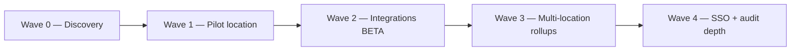

# Enterprise MVP spec — OS Kitchen

**Policy:** `enterprise-mvp-spec-v1`  
**Date:** 2026-06-02  
**Owner:** Product + Founder + Engineering  
**Status:** **Specification** — not a shipped product tier claim  
**Pilot baseline:** [`artifacts/pilot-gono-go-summary.json`](../artifacts/pilot-gono-go-summary.json) — **NO-GO** · **0 signed LOI** · **0 active pilots**

This document defines the **minimum viable Enterprise offering** OS Kitchen can honestly sell and implement for multi-location operators — what is **in scope today**, what requires **pilot proof**, and what remains **roadmap-only**. Use it for RFP scoping, SOW drafts, and internal build prioritization.

**Hard rule:** Do **not** contract features marked **Roadmap** or **Pilot-only** as production-ready without a signed addendum referencing this spec and [`sales-limitation-sheet.md`](./sales-limitation-sheet.md).

**Related:** [`enterprise-procurement-pack.md`](./enterprise-procurement-pack.md) · [`ENTERPRISE_IMPLEMENTATION_PLAYBOOK.md`](./ENTERPRISE_IMPLEMENTATION_PLAYBOOK.md) · [`soc2-readiness-assessment.md`](./soc2-readiness-assessment.md) · [`integration-escalation-matrix.md`](./integration-escalation-matrix.md) · [`pilot-acceptance-criteria.md`](./pilot-acceptance-criteria.md)

---

## Target buyer

| Attribute | Enterprise MVP ICP |
|-----------|-------------------|
| **Size** | 3–25 locations (pilot scope ≤5 locations) |
| **Operator type** | Full-service, QSR, or commissary with central ops |
| **Trigger** | Outgrown single-location tools; needs consolidated kitchen + orders + procurement |
| **Buyer** | Owner/COO + IT/procurement (security questionnaire expected) |
| **Not a fit (yet)** | Franchise HQ with 100+ units · mandatory SCIM day-one · 24/7 SLA without [`support-tier-plan.md`](./support-tier-plan.md) |

---

## Enterprise MVP pillars

| Pillar | MVP intent | Delivery today | Enterprise MVP gate |
|--------|------------|:--------------:|:-------------------:|
| **Multi-location ops** | Location records, cross-location visibility | **Partial** — locations exist; rollups placeholder | 5-location pilot with executive dashboard smoke |
| **Multi-brand** | Brand model on menus/products/orders | **Partial** — brand model + optional `brandId` | Brand filters on pilot data path |
| **RBAC & permissions** | Role matrix, permission gates on risky actions | **Partial** — `lib/permissions.ts`, CI waves 1–4 | `test:ci:rbac-wave4` green on staging |
| **Audit & compliance hooks** | Audit log model, export gates, retention page | **Partial** — not full action coverage | Critical mutations instrumented per registry |
| **Identity (SSO)** | SAML/OIDC via Supabase for pilot tenants | **Pilot foundation** — schema + callback; staging smoke **SKIPPED** | [`sso-idp-smoke-test-plan.md`](./sso-idp-smoke-test-plan.md) PASS |
| **Integrations** | WooCommerce + Shopify golden path; delivery BETA | **17 LIVE partner integrations** (7 BETA + 1 PLACEHOLDER) | G1–G4 per [`live-integration-definition-of-done.md`](./live-integration-definition-of-done.md) |
| **Marketplace / procurement** | Vendor catalog, PO workflow | **WIP** — migration + UI in progress | Staging checkout E2E + cross-tenant isolation |
| **API & white-label** | ENTERPRISE plan gates in `feature-registry.ts` | **Partial** — API access flag; white-label settings page | Contracted scope + rate limits documented |
| **Security posture** | Tenant isolation, encryption, incident process | **Documented** — not SOC 2 certified | Questionnaire pack + tabletop incident drill |
| **Support & SLA** | Business-hours escalation | **Founder on-call** — no 24/7 | [`incident-response-process.md`](./incident-response-process.md) acknowledged in SOW |

---

## In scope — Enterprise MVP (contractable with caveats)

Features that may appear in an Enterprise MVP SOW **only** with the honesty labels below:

| Feature | Plan gate | Honesty label | Evidence |
|---------|-----------|---------------|----------|
| Multi-location records | `ENTERPRISE` · `pos_multi_location` | **LIVE (core)** | `docs/MULTI_LOCATION.md` |
| Organization / workspace model | Platform | **LIVE (foundation)** | Default backfill migration |
| Staff roles & invites | `TEAM`+ | **LIVE** | Staff management surfaces |
| Executive / enterprise reports | `ENTERPRISE` | **Partial** — placeholder rollups | `/dashboard/analytics` |
| Audit log center + export | Platform | **Partial** — coverage gaps | `/dashboard/security/audit-logs` |
| White-label settings | `ENTERPRISE` | **Partial** — UI only | Gated settings page |
| API access (scoped) | `ENTERPRISE` | **Contract-only** — no public SLA | OpenAPI manifest |
| WooCommerce / Shopify | `PRO`+ | **BETA** — golden path CI | Channel registry |
| DoorDash / Grubhub / Uber Eats | `TEAM`+ | **BETA** | Integration registry |
| SSO (SAML/OIDC) | Add-on | **Pilot foundation** — not default prod | `/dashboard/settings/security/sso` |
| Marketplace checkout → PO | Add-on | **WIP** — staging only until E2E PASS | Marketplace migration |

---

## Out of scope — Enterprise MVP (roadmap / separate SOW)

| Feature | Why excluded | Pointer |
|---------|--------------|---------|
| SOC 2 Type II attestation | Not certified — ~35% readiness | [`soc2-readiness-assessment.md`](./soc2-readiness-assessment.md) |
| SCIM provisioning | Depends on SSO R2 pilot | [`sso-scim-live-plan.md`](./sso-scim-live-plan.md) · [`scim-provisioning-rfc.md`](./scim-provisioning-rfc.md) |
| Uber Direct dispatch | **PLACEHOLDER** | [`uber-direct-implementation-plan.md`](./uber-direct-implementation-plan.md) |
| 24/7 phone support / P1 SLA | Bus factor 1 | [`support-tier-plan.md`](./support-tier-plan.md) |
| Org-level invoicing (non-Stripe) | Billing still user-centric | [`SCALE_READINESS_AUDIT.md`](./SCALE_READINESS_AUDIT.md) |
| Full workspace migration | Mixed `userId` / `workspaceId` | Resolver + migration plan |
| Automated scheduled reports | Manual export today | Enterprise reports roadmap |
| Partner payout automation | Commission placeholders only | Partner portal docs |

---

## Implementation waves (Enterprise MVP)

Aligned with [`ENTERPRISE_IMPLEMENTATION_PLAYBOOK.md`](./ENTERPRISE_IMPLEMENTATION_PLAYBOOK.md):

| Wave | Duration (indicative) | Exit criteria |
|:----:|:---------------------:|---------------|
| **0** | 1–2 weeks | Signed LOI · ICP qualified · staging env checklist PASS |
| **1** | 2–4 weeks | 1 location live on orders + KDS · operator golden path PASS |
| **2** | 2–3 weeks | Primary channel (Woo or Shopify) ingest smoke PASS |
| **3** | 2–4 weeks | ≤5 locations · executive dashboard pilot metrics baseline |
| **4** | 4–8 weeks | SSO staging smoke PASS (if contracted) · audit export drill |

**Pilot NO-GO blockers** (must clear before Wave 1): see [`pilot-gono-go-summary.json`](../artifacts/pilot-gono-go-summary.json) — Tier 1 staging, P0 proof, signed LOI.

---

## Definition of done — Enterprise MVP pilot

A pilot may be labeled **Enterprise MVP validated** when **all** rows PASS:

| # | Criterion | Owner | Proof |
|---|-----------|-------|-------|
| 1 | Signed LOI + ICP qualified | Legal/GTM | `PILOT_GONOGO_*` env + LOI on file |
| 2 | Staging environment checklist | Ops | [`staging-environment-checklist.md`](./staging-environment-checklist.md) |
| 3 | Operator golden path (Tier 2) | Ops | `smoke:pilot-operator-golden-path` |
| 4 | Cross-tenant isolation (incl. marketplace) | QA | `e2e/cross-tenant-isolation.spec.ts` |
| 5 | Primary channel smoke | Eng | P0 channel live smoke or documented SKIPPED |
| 6 | Incident + integration escalation acknowledged | CS | Runbook sign-off |
| 7 | Pilot acceptance criteria met | CS/Product | [`pilot-acceptance-criteria.md`](./pilot-acceptance-criteria.md) |
| 8 | No forbidden claims in customer comms | GTM | `forbidden-claims-enforcement` CI |

**SSO add-on:** Criterion 4b — `sso-idp-smoke` PASS when contract includes SSO.

---

## Pricing & packaging (Enterprise MVP)

| Element | Guidance |
|---------|----------|
| **Base** | `ENTERPRISE` plan — see [`marketplace-pricing-strategy.md`](./marketplace-pricing-strategy.md) |
| **Implementation** | Fixed-fee waves 0–1; T&M for custom integrations |
| **SSO add-on** | Separate line item until staging smoke PASS |
| **Marketplace** | Transaction fee TBD — not in base MVP until checkout E2E green |
| **SLA** | Business-hours best-effort only until hire #2 + support tier plan |

Do **not** quote 24/7 or SOC 2 in base Enterprise MVP pricing.

---

## Sales-safe claims (Enterprise MVP)

| Claim | OK? |
|-------|:---:|
| "Enterprise MVP spec defines our multi-location pilot scope" | ✓ |
| "RBAC, audit hooks, and tenant isolation are engineering priorities" | ✓ |
| "SSO is pilot foundation — staging proof required before production" | ✓ |
| "7 proprietary AI modules in production (configurable, camera-ready)" | ✓ (with [`ai-honesty-policy.md`](./ai-honesty-policy.md)) |
| "Enterprise-certified" / "SOC 2 compliant" / "SSO included standard" | ✗ |
| "All integrations LIVE" / "Marketplace fully operational" | ✗ |

Full registry: [`sales-safe-claims-registry.md`](./sales-safe-claims-registry.md)

---

## Open risks (June 2026)

| Risk | Impact | Mitigation |
|------|--------|------------|
| Mixed tenant scoping | IDOR during migration | Workspace resolver; cross-tenant E2E |
| SSO staging unproven | Enterprise deal blocker | P0 SSO smoke env vars |
| 17 LIVE integrations | Delivery expectations | BETA badges + limitation sheet for non-LIVE connectors |
| Bus factor 1 | SLA / incident capacity | [`bus-factor-mitigation.md`](./bus-factor-mitigation.md) |
| Marketplace WIP | Procurement story gap | Task 6 E2E + migration on staging |

---

## Revision history

| Version | Date | Change |
|---------|------|--------|
| `enterprise-mvp-spec-v1` | 2026-06-02 | Initial spec — Task 103 · honest NO-GO baseline |

**Next review:** After first signed LOI or Q3 2026 OKR checkpoint ([`q3-2026-okrs.md`](./q3-2026-okrs.md)).
