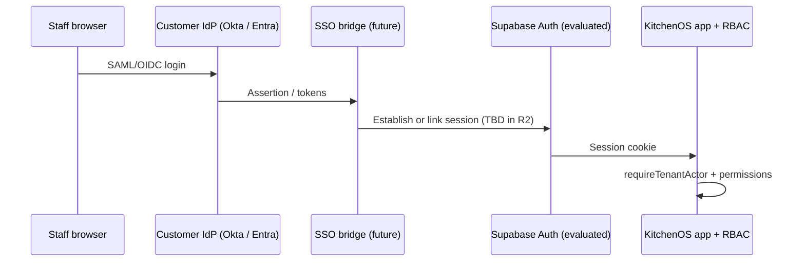

# Enterprise SSO / SAML Architecture Spike (R1)

**Status:** canonical **design-only** spike — not production delivery  
**Policy:** `era9-enterprise-sso-architecture-spike-v1` (`lib/enterprise/enterprise-sso-architecture-spike-policy.ts`)  
**Extends:** `era6-enterprise-identity-roadmap-v1` — delivery remains **`not_implemented`**  
**Companion:** [`enterprise-procurement-pack.md`](./enterprise-procurement-pack.md) §SSO and SAML roadmap  
**Date:** 2026-05-27 (Evolution Era 9 Cycle 1)

---

## Purpose and honesty rules

1. **R1 is architecture only** — no tenant IdP configuration, no SAML metadata upload, no SCIM endpoints.
2. **Procurement posture unchanged** — buyers may reference this spike as engineering intent; it is **not** a compliance or availability attestation.
3. **Matrix wins** — if marketing copy implies live SSO, `npm run verify-claims` and `era7-marketing-claims-governance-v1` govern GTM surfaces.
4. **Pilot path is R2** — this document defines prerequisites for a future pilot era, not a ship date.

**Unsafe headline:** “SSO included,” “SAML login live,” or “enterprise IdP integrated today.”

---

## Current production auth spine

| Layer | Today | Evidence |
|-------|--------|----------|
| Identity provider | **Supabase Auth** (email/password, magic link OTP where enabled) | `actions/auth.ts`, `app/auth/callback/route.ts` |
| Session | Supabase session cookies → `getSessionUser()` | `lib/auth.ts` |
| Tenant scope | `requireTenantActor()` / workspace membership | `lib/scope/require-tenant-actor.ts` |
| Authorization | Canonical permission keys + `requireMutationPermission` | `lib/permissions/mutation-access.ts`, `docs/rbac-permission-architecture.md` |
| Login UI | `/login` email form | `app/login/page.tsx` |
| Billing entitlements | `ssoOidc` flag exists on plan matrix — **not wired to production SSO** | `lib/billing/entitlements.ts` |

**Delivery status:** `not_implemented` for customer SAML/OIDC IdP per workspace.

---

## R1 spike scope (design only)

| In scope (R1) | Out of scope (R1) |
|---------------|-------------------|
| Document session bridge options | Production IdP metadata storage |
| Workspace ↔ IdP subject mapping model | Admin self-service IdP UI |
| Break-glass owner login design | SCIM Users/Groups API |
| Audit events for SSO login / deny | Multi-IdP per tenant |
| R2 pilot acceptance criteria | SOC 2 Type II attestation |

---

## Proposed target architecture

**Goal (R2+):** Allow an enterprise tenant to authenticate staff via **SAML 2.0 or OIDC** while preserving the existing KitchenOS workspace RBAC model.

**Integration options (R2 decision — not chosen in R1):**

| Option | Pros | Cons / risks |
|--------|------|----------------|
| **A — Supabase SAML SSO** (if plan/features fit) | Less custom session code | Vendor coupling; tenant metadata model TBD |
| **B — Custom OIDC bridge** | Full control of claims mapping | More security review; session hardening burden |
| **C — Hybrid** (OIDC for pilot, SAML later) | Faster pilot with one IdP | Two code paths to maintain |

**R1 recommendation:** Proceed to **R2 pilot** with **one IdP** (Okta *or* Microsoft Entra ID) and **Option A or B** chosen only after security review — not both in pilot.

---

## Session bridge and workspace mapping

1. **Stable subject key:** Map IdP `sub` / `NameID` → `UserProfile` or linked `ssoIdentity` row (schema TBD in R2).
2. **Workspace binding:** SSO login must resolve **exactly one** workspace membership (or explicit workspace picker post-auth for multi-workspace staff — defer to R3).
3. **Role source of truth:** KitchenOS `workspaceRole` / permission grants remain authoritative — IdP groups may **suggest** roles in R2 but must not bypass `requireMutationPermission`.
4. **Invite parity:** Existing staff invite flow remains until SCIM (R2+ dependency per procurement pack).

---

## Break-glass and operations

| Scenario | R1 design intent |
|----------|------------------|
| IdP outage | Retain **break-glass** email/password for designated `OWNER` accounts (config flag per workspace, audited) |
| Misconfigured SAML | Fail closed — no silent downgrade to wrong tenant |
| Offboarding | IdP deprovision does **not** auto-delete KitchenOS data in R2; session revoke + login deny (SCIM in later phase) |
| Audit | Log `sso.login_success`, `sso.login_denied`, `sso.break_glass_used` via `recordAuditLog` (event names TBD in R2) |

---

## RBAC and audit implications

- **No new permission keys in R1** — SSO is an auth transport; existing keys (`staff.manage`, etc.) unchanged.
- **Sensitive mutations** remain behind `requireMutationPermission` regardless of login method.
- **Export / audit center** access unchanged — SSO does not grant platform admin bypass.
- **CI:** Continue `test:ci:rbac-wave4` in `test:security`; SSO pilot must add negative tests in a future era.

---

## Explicitly not in R1

- Production SAML metadata endpoints
- Tenant admin IdP configuration screens
- SCIM provisioning
- SOC 2 / ISO certification claims
- Marketing or matrix updates implying **live** SSO

---

## R2 pilot prerequisites

1. Security review of chosen bridge (Option A or B).
2. Schema migration for IdP link table + workspace SSO settings (if needed).
3. Pilot tenant with one IdP and written break-glass runbook.
4. E2E smoke: login → dashboard → one guarded mutation → logout.
5. Update `era6-enterprise-identity-roadmap-v1` delivery table only when R2 ships code + tests.

---

## Procurement alignment

**Procurement answer (unchanged):** “SSO/SAML is on the roadmap; R1 architecture spike is complete; production auth today is email/session-based with workspace RBAC.”

**Evidence for diligence:** this document + [`enterprise-procurement-pack.md`](./enterprise-procurement-pack.md) + `npm run test:ci:enterprise-sso-spike:cert`.

**CI:** `test:ci:enterprise-identity-roadmap:cert` still governs forbidden delivery phrases in the procurement pack.
