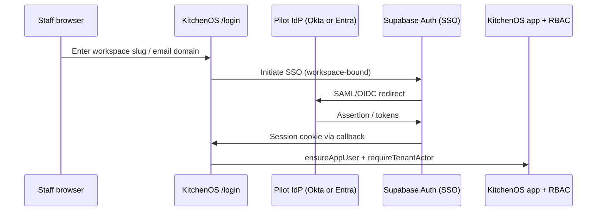

# Enterprise SSO R2 Pilot Design

**Status:** canonical **R2 pilot architecture decision** — not production delivery  
**Policy:** `era16-enterprise-sso-r2-pilot-v1` (`lib/enterprise/enterprise-sso-r2-pilot-era16-policy.ts`)  
**Extends:** `era9-enterprise-sso-architecture-spike-v1` (R1), `era13-enterprise-identity-recert-v1`  
**Delivery:** SSO **`pilot_foundation`** (schema only) — R2 pilot status **`schema_ready`**  
**Date:** 2026-05-28 (Evolution Era 16 Cycles 1–4)

---

## Purpose and honesty rules

1. **Cycle 1 closes the R1 ambiguity** — KitchenOS now has a single locked R2 integration path; no code ships in this cycle.
2. **Procurement posture unchanged for delivery** — buyers may cite this design as engineering intent; it is **not** SSO availability.
3. **Matrix wins** — `pilot_foundation` (schema only) until runtime login + staging smoke prove pilot readiness; **not** production SSO.
4. **One IdP in pilot** — Okta **or** Microsoft Entra ID per pilot tenant, not both code paths simultaneously.

**Unsafe headline:** “SSO included,” “SAML login live,” or “enterprise IdP integrated today.”

---

## Auth architecture inspection

Inspection date: **2026-05-28**. Evidence paths in `ENTERPRISE_SSO_R2_PILOT_ERA16_EVIDENCE_PATHS`.

| Layer | Current state | R2 implication |
|-------|---------------|----------------|
| Identity provider | **Supabase Auth** — email/password, magic link OTP, password reset | Extend via Supabase enterprise SSO, not parallel auth stack |
| Session | `@supabase/ssr` cookie session → `getSessionUser()` | SSO must land in same cookie session model |
| Profile bootstrap | `ensureAppUser()` on sign-in and `/auth/callback` | SSO callback must call same bootstrap path |
| Tenant scope | `requireTenantActor()` / workspace membership | IdP subject maps to existing `UserProfile.id` (Supabase user id) |
| Authorization | 57 permission keys + `requireMutationPermission` | SSO is transport only — no RBAC bypass |
| Login UI | `/login` email/password + gated **Sign in with SSO** (Era 16 Cycle 4) | Staging IdP smoke proof |
| Billing gate | `ssoOidc` entitlement on enterprise plan matrix — **wired** (Era 16 Cycle 4 admin + activation) | Staging IdP smoke proof |
| Schema | **`WorkspaceSsoSettings` + `SsoIdentity`** (Era 16 Cycle 2) | Runtime callback adapter (Cycle 3) |
| Callback | **`/auth/callback`** + `completeWorkspaceSsoCallback` (Era 16 Cycle 3) | Pilot admin wiring + login entry (Cycle 4) |

**Conclusion:** The production spine is Supabase-native. A custom OIDC bridge would duplicate session handling already owned by Supabase Auth and increase security review surface without pilot benefit.

---

## R2 path decision

**Selected path:** **`supabase_saml_sso`** (R1 Option **A**)

| Decision | Value |
|----------|--------|
| R2 pilot status | **`schema_ready`** (Cycle 2) |
| SSO delivery | **`pilot_foundation`** — schema + domain helpers only; **not** production SSO |
| Integration | Supabase SAML 2.0 / OIDC enterprise SSO as session bridge |
| Pilot IdP | **One** of Okta or Microsoft Entra ID per pilot tenant |
| Session bridge | IdP → Supabase Auth → existing cookies → `ensureAppUser` → RBAC |

**Why Option A:**

- Reuses `app/auth/callback/route.ts` code exchange flow where applicable.
- Avoids maintaining a parallel JWT/session stack (Option B).
- Aligns with existing Supabase project and `@supabase/ssr` middleware patterns.
- `ssoOidc` billing entitlement can gate workspace enablement in R2 Cycle 3.

---

## Rejected alternatives

| Path | R1 label | Era 16 decision | Reason |
|------|----------|-----------------|--------|
| Custom OIDC bridge | Option B | **Rejected for R2 pilot** | Duplicates Supabase session; higher hardening burden |
| Hybrid OIDC + SAML | Option C | **Rejected for R2 pilot** | Two auth paths in pilot increases ops and test matrix |
| Roadmap-only (no decision) | Option D | **Rejected** | R1 spike + auth inspection sufficient to lock design |

Option B may be revisited **only** if Supabase enterprise SSO cannot satisfy a signed pilot tenant’s IdP requirements — requires written security review and era decision.

---

## Target session bridge (Supabase SAML SSO)

**R2 implementation constraints:**

1. Fail closed on workspace ↔ IdP mismatch — no cross-tenant login.
2. SSO users must resolve to an **existing** workspace membership or controlled invite flow (no auto-provision without explicit pilot config).
3. Break-glass email/password remains for designated `OWNER` accounts when workspace flag enabled.
4. Callback adapter (`era16-enterprise-sso-r2-runtime-v1`) validates via `validateSsoCallbackSession` when `/auth/callback?sso_workspace_id=` is present — **callback_adapter** remains fail-closed until `PILOT_ACTIVE`.
5. Pilot admin (`era16-enterprise-sso-r2-admin-v1`) — Settings → Security → SSO pilot configures IdP; **Sign in with SSO** on `/login` requires workspace UUID + `PILOT_ACTIVE` gate (**pilot_admin_wiring**).

---

## Workspace mapping and RBAC

1. **Subject key:** IdP `sub` / SAML `NameID` stored in `SsoIdentity` row linked to `UserProfile.id` (Supabase auth user id).
2. **Workspace binding:** `WorkspaceSsoSettings` (R2 schema) holds IdP metadata reference, enabled flag, allowed email domains, pilot IdP vendor.
3. **Role source of truth:** KitchenOS `workspaceRole` and permission grants — IdP groups may **suggest** roles in R3; R2 does not auto-elevate.
4. **Invite parity:** Manual staff invite flow remains until SCIM (post-R2).

**No new permission keys in R2 design** — existing mutation registry unchanged.

---

## Break-glass and operations

| Scenario | R2 design intent |
|----------|------------------|
| IdP outage | Workspace flag allows break-glass email/password for `OWNER` only; audited |
| Misconfigured SAML metadata | Fail closed — login error, no wrong-tenant session |
| Offboarding | IdP deprovision → session revoke on next request; no SCIM auto-delete in R2 |
| Audit events | `sso.login_success`, `sso.login_denied`, `sso.break_glass_used` via `recordAuditLog` (R2 Cycle 3) |

---

## Implementation phases (Cycles 2–4)

| Cycle | Scope | Deliverables |
|-------|--------|--------------|
| **2** | Schema + settings model | **Complete (Era 16 Cycle 2)** — `WorkspaceSsoSettings`, `SsoIdentity`, `era16-enterprise-sso-r2-schema-v1`; migration `20260528120000_enterprise_sso_r2_schema`; defaults `enabled=false` |
| **3** | Callback adapter + guardrails | **Complete (Era 16 Cycle 3)** — `era16-enterprise-sso-r2-runtime-v1`; `validateSsoCallbackSession`; `/auth/callback?sso_workspace_id=`; `ssoOidc` entitlement gate; audit `sso.login_*`; **no** production SSO UI |
| **4** | Pilot admin wiring | **Complete (Era 16 Cycle 4)** — `era16-enterprise-sso-r2-admin-v1`; Settings → Security → SSO pilot; `/login` Sign in with SSO; `smoke:enterprise-sso-r2-pilot`; delivery **pilot_foundation** |
| **5+** | Staging IdP smoke proof | **Era 17 Cycle 1 plan ready** — `era17-enterprise-sso-idp-staging-smoke-v1`; `docs/enterprise-sso-idp-staging-smoke-plan.md`; `smoke:enterprise-sso-idp-staging`; Cycle 2 operator login proof; Cycle 3 **pilot_ready** gate only with artifact |

**Explicitly not in Cycles 2–4 unless era expands scope:**

- SCIM Users/Groups API
- Admin self-service IdP metadata UI (R3)
- SOC 2 attestation
- Multi-IdP per tenant

---

## R2 pilot acceptance criteria

1. One pilot tenant with Okta **or** Entra ID configured in Supabase + KitchenOS workspace settings.
2. Staff SSO login establishes Supabase session and passes `requireTenantActor` on dashboard.
3. One guarded mutation (e.g. production calendar or orders) succeeds under SSO session with existing RBAC.
4. Break-glass owner login works when IdP unavailable (staging drill).
5. Negative tests: wrong workspace, disabled SSO, invalid assertion → deny without session.
6. Procurement pack and feature matrix updated **only** after criteria 1–5 pass — delivery status may move to `pilot` not `live`.

---

## Procurement alignment

**Procurement answer (unchanged for production delivery):** “SSO/SAML is **not** in production today. Era 16 R2 design + schema + callback adapter define the Supabase SAML SSO pilot path; current staff auth is email/session-based with workspace RBAC.”

**Evidence:** this document + [`enterprise-sso-architecture-spike-r1.md`](./enterprise-sso-architecture-spike-r1.md) + [`enterprise-procurement-pack.md`](./enterprise-procurement-pack.md) + `npm run smoke:enterprise-sso-r2-pilot`.

**CI chain:** `test:ci:enterprise-identity-roadmap:cert` includes Era 16 R2 pilot cert.

---

## Era 17 SSO IdP staging smoke plan (2026-05-28)

**Policy:** `era17-enterprise-sso-idp-staging-smoke-v1` — **plan_ready**; delivery remains **pilot_foundation**.

| Cycle | Scope | Status |
|-------|--------|--------|
| **1** | IdP staging smoke plan + env documentation + orchestrator | **Complete** — [`enterprise-sso-idp-staging-smoke-plan.md`](./enterprise-sso-idp-staging-smoke-plan.md); `smoke:enterprise-sso-idp-staging` |
| **2** | Staging IdP login proof | **Engineering complete — awaiting operator** — `era17-enterprise-sso-idp-login-proof-v1`; smoke executed → **SKIPPED WITH REASON** (`overall: SKIPPED`; 6 prerequisite env vars unset) until staging + IdP secrets |
| **3** | Qualified pilot gate | **Gate wired — awaiting Cycle 2 proof** — `era17-enterprise-sso-pilot-ready-v1`; `smoke:enterprise-sso-pilot-ready-gate`; delivery **pilot_foundation** until `loginProofStatus: proof_passed` |
| **4** | SSO operator runbook | **Complete** — `era17-enterprise-sso-operator-runbook-v1`; [`enterprise-sso-operator-runbook-era17.md`](./enterprise-sso-operator-runbook-era17.md); **operator_runbook_ready**; delivery **pilot_foundation** unchanged |
| **5** | SSO tenant mapping hardening | **Complete** — `era17-enterprise-sso-tenant-mapping-v1`; **tenant_mapping_test_backed** |
| **6** | SSO procurement sync | **Complete** — `era17-enterprise-sso-procurement-sync-v1`; **procurement_sync_complete**; FAQ **pilot_foundation** |

**Ops doc:** Okta/Entra test tenant, Supabase SAML, workspace mapping, break-glass, rollback, negative tests.

**Operator runbook:** [`enterprise-sso-operator-runbook-era17.md`](./enterprise-sso-operator-runbook-era17.md) — break-glass, rollback, support boundaries, entitlements, audit events (`era17-enterprise-sso-operator-runbook-v1`).

**Honest scope:** Does **not** claim production SSO, qualified pilot-ready delivery, SOC2, or SCIM until Cycle 2–3 evidence exists.

---

## Era 17 SSO IdP login proof (2026-05-28)

**Policy:** `era17-enterprise-sso-idp-login-proof-v1` — Cycle 2 operator evidence path; **awaiting_operator_proof**; delivery **pilot_foundation**.

Operator proof env vars: `SSO_STAGING_OPERATOR_EMAIL`, `SSO_STAGING_LOGIN_SCREENSHOT_PATH`, `SSO_STAGING_AUDIT_EVENT_REF`, `SSO_STAGING_NEGATIVE_TEST_NOTE`.

**CI:** `test:ci:enterprise-sso-idp-login-proof-era17:cert` (chained in `test:ci:enterprise-sso-idp-staging-era17:cert`).

---

## Era 17 SSO pilot_ready gate (2026-05-28)

**Policy:** `era17-enterprise-sso-pilot-ready-v1` — **awaiting_idp_login_proof**; delivery **pilot_foundation** until Cycle 2 artifact validates.

1. Run **`npm run smoke:enterprise-sso-idp-staging`** — Cycle 2 must produce `loginProofStatus: proof_passed`.
2. Run **`npm run smoke:enterprise-sso-pilot-ready-gate`** — review **`artifacts/enterprise-sso-pilot-ready-gate-summary.json`**.
3. `ssoDeliveryStatus` becomes **pilot_ready** only when input artifact `overall: PASSED` and `loginProofStatus: proof_passed`.
4. Missing or skipped Cycle 2 proof → **pilot_foundation** (exit 0) — not fake promotion.
5. Production SSO for all tenants, SOC2, and SCIM remain forbidden.

**Execution status (2026-05-28):** gate smoke re-run → **ssoDeliveryStatus: pilot_foundation** (`gateOutcome: pilot_foundation_awaiting_proof`; Cycle 2 **SKIPPED** — 6 prerequisite env vars unset). **Do not claim qualified pilot-ready SSO in sales or procurement until gate shows promotionAllowed.**

**Enforcement:** `test:ci:enterprise-sso-pilot-ready-era17:cert` (chained in `test:ci:enterprise-sso-idp-staging-era17:cert`)
