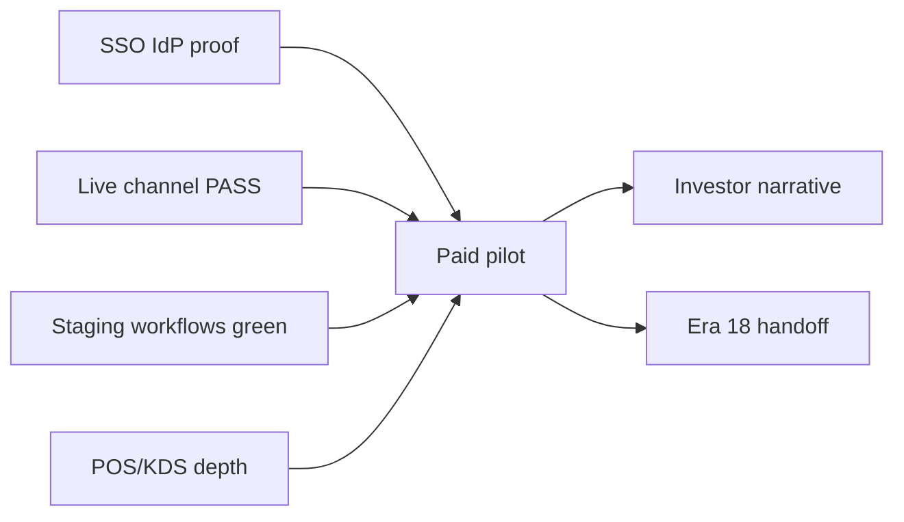

# Evolution Era 17 — Strategic Execution Map

**Date:** 2026-05-28  
**Baseline:** `docs/full-strategic-reaudit-2026-05-28-era16.md` @ `c88be6b`  
**Theme:** **Commercial ops proof** — first-green staging evidence, SSO IdP pilot_ready, paid pilot execution, selective product depth  
**Cycles:** **45** planned (bands A–L); one theme per cycle; do not reopen Era 4–16 unless regression proven

---

## Era 17 Principles

1. **Evidence over policy** — prefer PASS artifacts (GitHub runs, smoke JSON, operator sign-offs) over new policy modules when Era 16 cert exists.
2. **No false enterprise claims** — SSO stays qualified until `pilot_ready` with IdP proof; SOC2/SCIM unchanged.
3. **Do not re-run** — POS browser E2E policy, cron re-archive, inventory/rewards unlock without explicit era decision.
4. **Commercial hardening > feature sprawl** — Era 17 is **not** aggressive greenfield build; depth on pilot-critical paths only.

---

## Workstream A — Enterprise Identity / SSO Delivery (Cycles 1–6)

| Cycle Band | Goal | Tasks | Acceptance Criteria | Validation | Risks | Owner |
|------------|------|-------|---------------------|------------|-------|-------|
| **1** | IdP staging smoke plan | Document Okta/Entra test tenant; env vars; break-glass | Runbook section in SSO design doc | Doc review | Wrong tenant mapping | Security |
| **2** | Staging IdP login proof | Configure Supabase SAML; one workspace pilot | Owner completes SSO login → dashboard | Screenshot + audit `sso.login_success` | IdP misconfig | Platform |
| **3** | `pilot_ready` policy gate | New policy `era17-enterprise-sso-pilot-ready-v1` if proof exists | Delivery status `pilot_ready` only with evidence artifact | `test:ci:enterprise-sso-*-era17:cert` | Claiming production | Security |
| **4** | SSO operator runbook | Support boundaries, rollback, entitlement `ssoOidc` | `commercial-pilot-runbook.md` updated | pilot cert chain | Over-promising | GTM |
| **5** | Domain / email mapping hardening | Edge cases: denied domain, wrong workspace | Unit tests for callback guard | SSO unit suite | Cross-tenant login | Platform |
| **6** | Procurement pack sync | FAQ answers match `pilot_ready` or honest partial | procurement pack § SSO | procurement cert | Legal mismatch | Product |

---

## Workstream B — Live Channel Proof / Integrations (Cycles 7–10)

| Cycle Band | Goal | Tasks | Acceptance Criteria | Validation | Risks | Owner |
|------------|------|-------|---------------------|------------|-------|-------|
| **7** | Woo live smoke PASS | Staging credentials; `smoke:woo-shopify-live` | `channel-live-smoke-summary.json` = PASS or documented FAIL | smoke script exit 1 on real failure | Flaky webhooks | Integrations |
| **8** | Shopify live smoke PASS | Same orchestrator | Artifact committed to ops evidence store (not git secrets) | workflow_dispatch | API version drift | Integrations |
| **9** | GitHub woo-shopify workflow green | `woo-shopify-staging-smoke.yml` | GitHub run URL recorded in ops log | Actions PASS | Secret rotation | DevOps |
| **10** | Channel pilot playbook | Single-page operator steps for pilot ICP | Linked from commercial runbook | GO/NO-GO evaluator PASS | Scope creep | GTM |

---

## Workstream C — Webhook Security / Partner Trust (Cycles 11–14)

| Cycle Band | Goal | Tasks | Acceptance Criteria | Validation | Risks | Owner |
|------------|------|-------|---------------------|------------|-------|-------|
| **11** | Replay P1 routes (Stripe-adjacent) | Extend dedupe per matrix P1 list | Cert for new routes | webhook-replay cert | Breaking providers | Security |
| **12** | Commerce webhook drill | Operator checklist for Stripe/Woo/Shopify | Runbook section | manual sign-off | — | Ops |
| **13** | Public POST abuse review | Rate limits on high-risk routes | Document in security matrix | security tests | DDoS | Platform |
| **14** | Partner webhook docs | Update API contract maturity doc | OpenAPI + webhook section | public-api cert | — | Platform |

---

## Workstream D — Paid Pilot Execution (Cycles 15–20)

| Cycle Band | Goal | Tasks | Acceptance Criteria | Validation | Risks | Owner |
|------------|------|-------|---------------------|------------|-------|-------|
| **15** | Pilot ICP + contract template | Qualifying language only | Legal review of forbidden claims | evidence pack cert | Mis-sale | GTM |
| **16** | Tier 0/1 preflight on release branch | governance bundles + claims strict | PASS recorded | CI logs | Skipped CI | DevOps |
| **17** | Staging operator golden path | 45–60 min checklist executed | Signed PASS/FAIL template | runbook Tier 2 | — | Ops |
| **18** | First paid pilot LOI/customer | Execute GO/NO-GO evaluator | GO with qualifications documented | commercial-pilot-summary | Support load | Founder |
| **19** | Pilot success metrics baseline | Orders/day, checkout, KDS bump | Dashboard or export snapshot | analytics | — | Product |
| **20** | Pilot retrospective + rollback test | Rollback plan exercised once | Runbook rollback section validated | tabletop | Data loss | Ops |

---

## Workstream E — POS Commercial Depth (Cycles 21–24)

| Cycle Band | Goal | Tasks | Acceptance Criteria | Validation | Risks | Owner |
|------------|------|-------|---------------------|------------|-------|-------|
| **21** | Manager override / discount depth | Unit tests for edge cases | No new browser E2E policy | pos money-path cert | Scope creep | Product |
| **22** | POS tablet UX polish | Touch targets, error states on terminal | UX review checklist | manual | — | UX |
| **23** | POS operator runbook | Rush-hour software-only guidance | Doc in ops canon | — | Offline claim | Ops |
| **24** | Receipt / shift report spot-check | Closeout math already tested — document | Runbook reference | unit tests exist | — | Ops |

---

## Workstream F — KDS / Production Operational Depth (Cycles 25–28)

| Cycle Band | Goal | Tasks | Acceptance Criteria | Validation | Risks | Owner |
|------------|------|-------|---------------------|------------|-------|-------|
| **25** | KDS staging Playwright PASS | Secrets + `playwright-kds-staging.yml` | GitHub PASS URL | e2e workflow | Flake | QA |
| **26** | Operational sign-off with real URL | `smoke:operational-signoff-era16` on staging | summary JSON with operator email | smoke | — | Kitchen |
| **27** | Production calendar operator drill | `smoke:production-calendar` | PASS on staging | smoke | — | Kitchen |
| **28** | Qualified KDS sales one-pager | No rush-hour language | marketing claims audit | verify-claims | Overclaim | GTM |

---

## Workstream G — Inventory / Costing (Cycles 29–31)

| Cycle Band | Goal | Tasks | Acceptance Criteria | Validation | Risks | Owner |
|------------|------|-------|---------------------|------------|-------|-------|
| **29** | Reconfirm POS-only lock | No storefront hook without era unlock | `test:ci:inventory-depletion:cert` | cert PASS | Accidental unlock | Platform |
| **30** | Pilot inventory messaging | Train sales on POS-only depletion | Matrix + claims aligned | `test:ci:pilot-inventory-messaging-era17:cert` + `smoke:pilot-inventory-messaging` | Unified stock claim | GTM | **Done** — `era17-pilot-inventory-messaging-v1` |
| **31** | Costing pilot spot-check | Recipe → margin report for pilot menu | Manual QA on staging | `test:ci:costing-pilot-spotcheck-era17:cert` + `smoke:costing-pilot-spotcheck` | Bad data | Ops | **Done** — `era17-costing-pilot-spotcheck-v1` |

---

## Workstream H — UX / Operator Speed (Cycles 32–34)

| Cycle Band | Goal | Tasks | Acceptance Criteria | Validation | Risks | Owner |
|------------|------|-------|---------------------|------------|-------|-------|
| **32** | Nav maturity sweep on new routes | `page-maturity-honesty` | nav cert PASS | `test:ci:nav-maturity-sweep-era17:cert` + `smoke:nav-maturity-sweep-era17` | — | Product | **Done** — `era17-nav-maturity-sweep-v1` |
| **33** | Permission-denied UX consistency | Spot-check POS/KDS/dashboard | Checklist | `test:ci:permission-denied-ux-era17:cert` + `smoke:permission-denied-ux` | — | UX | **Done** — `era17-permission-denied-ux-v1` |
| **34** | Integration setup wizard friction | Reduce steps for Woo/Shopify pilot | Operator feedback | `test:ci:channel-pilot-setup-wizard-era17:cert` + `smoke:channel-pilot-setup-wizard` | — | Product | **Done** — `era17-channel-pilot-setup-wizard-v1` |

---

## Workstream I — Public API / Developer Platform (Cycles 35–37)

| Cycle Band | Goal | Tasks | Acceptance Criteria | Validation | Risks | Owner |
|------------|------|-------|---------------------|------------|-------|-------|
| **35** | Per-route scope enforcement (bounded) | Highest-risk routes first | public-api cert extended | contract tests | Breaking partners | Platform |
| **36** | Partner smoke with API key | `smoke:public-api-live` on staging | summary artifact | smoke | — | Platform |
| **37** | Partner onboarding doc | Checklist aligned with beta posture | doc in canon index | review | SLA claim | GTM |

---

## Workstream J — Typecheck / Monolith Scalability (Cycles 38–40)

| Cycle Band | Goal | Tasks | Acceptance Criteria | Validation | Risks | Owner |
|------------|------|-------|---------------------|------------|-------|-------|
| **38** | Full typecheck CI profile | If quality job OOM, document heap/fix | `typecheck:full` PASS or documented flake | CI | CI blocked | DevOps |
| **39** | Slice ownership map | Which team owns which slice | devops doc | — | — | Platform |
| **40** | Schema change discipline | No accidental model sprawl in pilot fixes | PR checklist | review | Debt | Platform |

---

## Workstream K — GTM / Investor Readiness (Cycles 41–43)

| Cycle Band | Goal | Tasks | Acceptance Criteria | Validation | Risks | Owner |
|------------|------|-------|---------------------|------------|-------|-------|
| **41** | Investor narrative v2 | Post-pilot metrics + honest gaps | 1-pager | founder review | Overclaim | GTM |
| **42** | Competitor matrix refresh | `competitor-feature-gap-matrix.md` | Matches re-audit §6 | doc review | Stale | Product |
| **43** | Case study draft (pilot) | With customer permission | Published or internal | legal | — | GTM |

---

## Workstream L — Scorecard / Era 18 Handoff (Cycles 44–45)

| Cycle Band | Goal | Tasks | Acceptance Criteria | Validation | Risks | Owner |
|------------|------|-------|---------------------|------------|-------|-------|
| **44** | Era 17 scorecard refresh | `era17-scorecard-refresh-v1` policy + doc | `test:ci:scorecard:cert` | cert | Score inflation | Platform |
| **45** | Era 18 handoff input | `next-master-prompt-input-*-era18.md` | Re-audit decision documented | review | — | Platform |

---

## Cycle Dependency Graph (simplified)

---

## Era 17 Success Definition

Era 17 succeeds when **all** are true:

1. At least one **paid pilot** executed with signed qualified contract and GO/NO-GO artifact.
2. **SSO** reaches `pilot_ready` with IdP staging login evidence OR explicit deferral with risk accepted.
3. **Two** of three staging workflows have GitHub **PASS** (e2e-staging, woo-shopify, kds-staging).
4. Woo **or** Shopify live smoke summary is **PASS** on staging.
5. Governance bundles remain green; no forbidden claims in marketing strict mode.
6. Era 17 scorecard published without inflating blended score above evidence.

---

## Deferred to Era 18+ (unless explicit unlock)

- Storefront inventory depletion (`era5-pos-only-gtm-lock-v1`)
- Unified cross-channel rewards ledger
- Offline POS / hardware certification
- DoorDash/Uber Eats/Grubhub LIVE
- SOC2 Type II / SCIM
- Rush-hour KDS certification
- Public API production SLA
