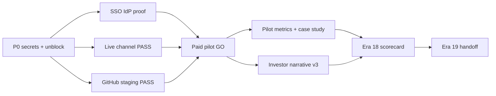

# Evolution Era 18 — Global Leap Execution Map

**Date:** 2026-05-28  
**Baseline:** `docs/full-product-strategic-reaudit-2026-05-28-era17.md` @ `5e00dd4`  
**Theme:** **Execute staging proof and first paid pilot** — evidence over policy; leapfrog only after proof  
**Cycles:** **48** planned (bands A–N); one theme per cycle; do not reopen Era 4–17 unless regression proven

---

## Era 18 Principles

1. **PASS artifacts before promotion** — smoke JSON, GitHub run URLs, signed operator attestation beat new policy modules.  
2. **No false enterprise claims** — SSO `pilot_ready` only with IdP artifact; never production SSO for all.  
3. **Do not re-run** — POS browser E2E, inventory/rewards unlock, offline POS, marketplace LIVE without explicit era unlock decision.  
4. **Commercial execution > feature sprawl** — first paid pilot is the north star for cycles A–C.  
5. **Full re-audit trigger** — after first paid pilot completes, SSO `pilot_ready`, or >50 new API routes.

---

## Workstream A — Commercial Pilot Execution (Cycles 1–8)

| Cycle | Goal | Tasks | Acceptance | Validation | Risk | Owner | Impact |
|------:|------|-------|------------|------------|------|-------|--------|
| 1 | Staging secrets vault | Document all P0 env vars in ops vault | Checklist complete | `smoke:p0-staging-proof-unblock --checklist-only` | Secret leak | DevOps | Unblocks all P0 |

**Cycle 1 status (2026-05-28):** `docs/era18-p0-staging-proof-ops-checklist.md` + env catalog (11 vars) in policy; `--checklist-only` enhanced; **ops_checklist_complete**; `p0ProofStatus` still **awaiting_ops_credentials**.
| 2 | P0 unblock re-run | Configure 11 missing vars | `p0ProofStatus: proof_passed` | `smoke:p0-staging-proof-unblock` | Partial PASS | Ops | Release confidence |
| 3 | Tier 0 GO/NO-GO green | Fix tier0 failures | `tier0ProofStatus=proof_passed` | `smoke:pilot-tier-preflight` | CI flake | DevOps | Pilot gate |
| 4 | Tier 2 golden path | 45–60 min staging checklist | Operator sign-off artifact | `smoke:pilot-operator-golden-path` | — | Ops | Pilot ready |
| 5 | ICP qualification | Real prospect profile | `icpQualified: true` | GO/NO-GO evaluator | Bad fit | GTM | Support load |
| 6 | Forbidden claims pre-contract | Release branch scan | `claimsEnforcementProofStatus=proof_passed` | `smoke:pilot-forbidden-claims-enforcement` | Mis-sale | GTM | Legal safety |
| 7 | First LOI / contract | Signed qualified pilot agreement | Customer record in artifact | `smoke:pilot-gono-go` → GO | Over-promise | Founder | Revenue |
| 8 | Pilot kickoff + retro template | Weekly check-ins scheduled | Retro doc started | runbook § pilot ops | Support overload | Founder | Learning |

---

## Workstream B — SSO pilot_ready and Enterprise Identity (Cycles 9–14)

| Cycle | Goal | Tasks | Acceptance | Validation | Risk | Owner | Impact |
|------:|------|-------|------------|------------|------|-------|--------|
| 9 | Okta/Entra test tenant | Configure Supabase SAML | IdP reachable | manual | Misconfig | Security | Enterprise wedge |
| 10 | SSO IdP browser login | Operator completes login → dashboard | `loginProofStatus: proof_passed` | `smoke:enterprise-sso-idp-staging` | Cross-tenant | Platform | **P0** |
| 11 | SSO negative tests | Wrong domain/workspace denied | Audit events captured | unit + manual | Security | Security | Trust |
| 12 | pilot_ready gate promotion | Gate evaluates PASS artifact | `ssoDeliveryStatus: pilot_ready` | `smoke:enterprise-sso-pilot-ready-gate` | Over-claim | Security | Procurement |
| 13 | Procurement FAQ update | Match pilot_ready or honest partial | FAQ synced | procurement cert | Legal | Product | Deals |
| 14 | Break-glass drill | IdP down scenario | Drill note in artifact | operator runbook | Lockout | Ops | Enterprise |

---

## Workstream C — Live Channel Proof (Cycles 15–20)

| Cycle | Goal | Tasks | Acceptance | Validation | Risk | Owner | Impact |
|------:|------|-------|------------|------------|------|-------|--------|
| 15 | Woo staging credentials | Connection row + encryption | DB row exists | manual | Credential rot | Integrations | Channel proof |
| 16 | Woo live smoke PASS | Run live orchestrator | Woo step PASSED | `smoke:woo-shopify-live --provider woocommerce` | Flaky webhook | Integrations | **P0** |
| 17 | Shopify live smoke PASS | Same for Shopify | Shopify step PASSED | `--provider shopify` | API drift | Integrations | **P0** |
| 18 | GitHub woo-shopify workflow | workflow_dispatch green | Run URL in artifact | Actions PASS | Secrets | DevOps | CI proof |
| 19 | Channel pilot execution | Operator follows playbook | Signed checklist | `channel-pilot-playbook` | Scope creep | GTM | Pilot package |
| 20 | External order → hub drill | End-to-end with live order | Order in hub | manual + tests | Data mismatch | Ops | Trust |

---

## Workstream D — Staging / DevOps Evidence (Cycles 21–25)

| Cycle | Goal | Tasks | Acceptance | Validation | Risk | Owner | Impact |
|------:|------|-------|------------|------------|------|-------|--------|
| 21 | e2e-staging GitHub PASS | Secrets + dispatch | URL recorded | `smoke:staging-workflows-first-green` | Flake | DevOps | **P0** |
| 22 | playwright-kds-staging PASS | KDS secrets | URL recorded | GitHub workflow | Flake | QA | KDS proof |
| 23 | storefront-staging-gate PASS | Storefront secrets | URL recorded | workflow | — | DevOps | SF proof |
| 24 | Paid-pilot-gate workflow | Align with GO/NO-GO | Green on release branch | `paid-pilot-gate.yml` | — | DevOps | Release |
| 25 | Rollback drill execution | Tabletop + doc | `pilot-rollback-drill` PASSED | smoke | Data loss fear | Ops | Safety |

---

## Workstream E — Webhook / API Partner Hardening (Cycles 26–29)

| Cycle | Goal | Tasks | Acceptance | Validation | Risk | Owner | Impact |
|------:|------|-------|------------|------------|------|-------|--------|
| 26 | Webhook replay P2 routes | Next matrix batch | Cert extended | webhook cert | Provider break | Security | Trust |
| 27 | Commerce webhook drill exec | Stripe/Woo/Shopify tabletop | Drill signed | `smoke:commerce-webhook-drill` | — | Ops | Incident ready |
| 28 | Public API live smoke | Staging API key | PASS artifact | `smoke:public-api-live` | — | Platform | Partners |
| 29 | Partner onboarding v2 | Checklist + scopes doc | Doc in canon | review | SLA claim | GTM | Developer |

---

## Workstream F — POS Commercial Depth (Cycles 30–33)

| Cycle | Goal | Tasks | Acceptance | Validation | Risk | Owner | Impact |
|------:|------|-------|------------|------------|------|-------|--------|
| 30 | Manager discount UI | Wire to existing guards | UX review | manual + unit | Scope | Product | Cashier flow |
| 31 | Shift variance approval UI | Manager workflow | Checklist | manual | — | Ops | Closeout |
| 32 | POS pilot feedback loop | First pilot cashier notes | Issues triaged | retro | — | UX | Speed |
| 33 | Receipt template polish | Branding + reprint | Spot check | existing tests | — | Product | Polish |

**Constraint:** No new POS browser E2E policy; tier-2b sustain only.

---

## Workstream G — KDS / Production Operational Excellence (Cycles 34–37)

| Cycle | Goal | Tasks | Acceptance | Validation | Risk | Owner | Impact |
|------:|------|-------|------------|------------|------|-------|--------|
| 34 | KDS operational sign-off | Real staging URL | `operational-signoff` PASSED | `smoke:operational-signoff-staging` | — | Kitchen | Sales qual |
| 35 | Production calendar drill | Operator moves tasks | drill PASSED | `smoke:production-calendar-drill` | — | Kitchen | Prep ICP |
| 36 | KDS qualified sales update | Post-proof one-pager | No rush-hour language | claims audit | Overclaim | GTM | Honest sell |
| 37 | Expo/station routing depth | Routing edge cases | Unit tests | kds cert | — | Product | Kitchen trust |

---

## Workstream H — Inventory / Costing / Purchasing (Cycles 38–40)

| Cycle | Goal | Tasks | Acceptance | Validation | Risk | Owner | Impact |
|------:|------|-------|------------|------------|------|-------|--------|
| 38 | POS-only lock recert | No accidental unlock | cert PASS | `smoke:pos-only-inventory-lock` | GTM trap | Platform | Honesty |
| 39 | Pilot menu costing sign-off | Accountant review one menu | Sign-off doc | costing spot check | Bad data | Finance | Margin trust |
| 40 | Purchasing pilot path | PO → receive for pilot SKU | Manual PASS | RBAC tests | — | Ops | Ops depth |

**Constraint:** Storefront depletion unlock requires explicit era decision — not Era 18 default.

---

## Workstream I — CRM / Loyalty / Gift Card (Cycles 41–42)

| Cycle | Goal | Tasks | Acceptance | Validation | Risk | Owner | Impact |
|------:|------|-------|------------|------------|------|-------|--------|
| 41 | Dual-ledger sales training | Update pilot onboarding | Quiz/checklist | cross-channel smoke | Mis-sell | GTM | Support |
| 42 | CRM pilot attribution | Track pilot customer LTV | Export snapshot | CRM tests | — | Growth | Case study |

---

## Workstream J — UX / Navigation / Operator Speed (Cycles 43–45)

| Cycle | Goal | Tasks | Acceptance | Validation | Risk | Owner | Impact |
|------:|------|-------|------------|------------|------|-------|--------|
| 43 | Role-based home MVP | Cashier/kitchen focused entry | UX review | nav cert | — | Product | Square gap |
| 44 | Permission denied sweep v2 | POS/KDS/new routes | cert PASS | permission-denied smoke | — | UX | Trust |
| 45 | Pilot onboarding UX | Reduce time-to-first-order | Metric captured | manual | — | Product | TTV |

---

## Workstream K — Enterprise Procurement / Investor (Cycles 46–47)

| Cycle | Goal | Tasks | Acceptance | Validation | Risk | Owner | Impact |
|------:|------|-------|------------|------------|------|-------|--------|
| 46 | Investor one-pager v3 | Real pilot metrics | KPIs populated | metrics baseline PASSED | Overclaim | GTM | Fundraise |
| 47 | Case study publish gate | Customer approval | Published or internal-only | case study smoke | Legal | GTM | Social proof |

---

## Workstream L — Technical Debt / Scale (Cycle 48 partial band)

| Cycle | Goal | Tasks | Acceptance | Validation | Risk | Owner | Impact |
|------:|------|-------|------------|------------|------|-------|--------|
| 48 | Era 18 scorecard + re-audit trigger | `era18-scorecard-refresh-v1` | Blended score honest | `test:ci:scorecard:cert` | Inflation | Platform | Era 19 handoff |

**Parallel (sustain throughout Era 18):** typecheck slices green; mutation linter; 16 cron gate; governance bundles; claims strict.

---

## Workstream M — Competitor Leapfrog (Conditional — after Cycle 7 GO)

| Cycle | Goal | Trigger | Acceptance |
|------:|------|---------|------------|
| M1 | Table service MVP | Pilot requests FOH | Preview → beta for tables |
| M2 | Labor dashboard polish | Pilot uses scheduling | beta UX sign-off |
| M3 | QuickBooks export drill | Pilot accountant | Export PASS + doc |

*Only start M-band after first paid pilot GO to avoid sprawl.*

---

## Workstream N — Era 19 Handoff (End of Era 18)

| Deliverable | Criteria |
|-------------|----------|
| `next-master-prompt-input-*-era19.md` | Era 18 outcomes documented |
| Full re-audit (conditional) | If paid pilot + SSO pilot_ready achieved |
| Era 19 theme proposal | Likely: **scale pilot + commercial depth** or **enterprise expansion** |

---

## Era 18 Success Definition

Era 18 succeeds when **all** are true:

1. **First paid pilot** executed with signed qualified contract and GO/NO-GO artifact **GO** (with documented qualifications).  
2. **P0 staging proof** `proof_passed` — SSO IdP, GitHub first-green, Woo **or** Shopify live smoke.  
3. **SSO** reaches `pilot_ready` **OR** explicit written deferral for non-SSO pilot ICP only.  
4. **Two** of three staging GitHub workflows have recorded **PASS** URLs.  
5. **Pilot metrics baseline** `overall: PASSED` with real customer data.  
6. Governance bundles remain green; forbidden claims enforced pre-contract.  
7. Era 18 scorecard published without inflating blended score above evidence.

---

## Cycle Dependency Graph

---

## Deferred to Era 19+ (unless explicit unlock)

- Storefront/API inventory depletion (`era5-pos-only-gtm-lock-v1`)  
- Unified cross-channel rewards ledger  
- Offline POS / hardware certification  
- DoorDash/Uber Eats/Grubhub LIVE  
- SOC2 Type II / SCIM  
- Rush-hour KDS certification  
- Public API production SLA  
- Broad AI copilot expansion  
