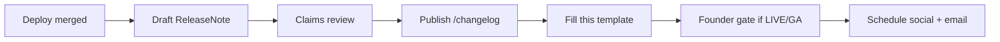

# Feature announcement template

**Policy:** `feature-announcement-template-v1`  
**Updated:** 2026-06-02  
**Owner:** Marketing + PM + Founder (claims gate)  
**Status:** template — not a published announcement  
**Related:** [`release-notes-process.md`](./release-notes-process.md) · [`sales-safe-claims-registry.md`](./sales-safe-claims-registry.md) · [`ai-moats-honest-positioning.md`](./ai-moats-honest-positioning.md) · [`design-partner-email-sequence.md`](./design-partner-email-sequence.md)

Use this template for **external feature announcements** (LinkedIn, beta email, blog post, design-partner Slack) — not for internal release notes. Every public announcement must pass the same claims gate as `/changelog` publish.

**Honesty rule:** Announce what shipped in code with maturity labels. BETA ≠ GA. No customer logos, KPIs, or “national network” language without written proof.

---

## When to use which artifact

| Artifact | Audience | Tone | Owner |
|----------|----------|------|-------|
| **Release note** (`/changelog`) | Operators, support, prospects | Factual changelog | PM + Eng — [`release-notes-process.md`](./release-notes-process.md) |
| **Feature announcement** (this doc) | Broader GTM, social, email | Story + CTA | Marketing |
| **Roadmap doc** | Internal / investor | Future tense | PM |
| **Case study** | Post-pilot only | Customer proof | Marketing — [`case-study-template.md`](./case-study-template.md) when available |

**Publish announcement only after:** prod deploy verified + claims review PASS + (if BETA) **Known limitations** section included.

---

## Announcement types

| Type | Use when | Maturity badge in headline |
|------|----------|----------------------------|
| **A — BETA ship** | New module or integration scaffold live | **BETA** required |
| **B — Pilot milestone** | Design partner cohort, staging golden path | **Pilot** / **Design partner** |
| **C — Improvement** | UX, performance, mobile — no new sales claim | Optional |
| **D — LIVE promotion** | Integration passes LIVE DoD | **LIVE** only with Founder sign-off — [`live-integration-definition-of-done.md`](./live-integration-definition-of-done.md) |

Do **not** use Type D until smoke pass + real credentials + 24h uptime + error rate < 1% documented.

---

## Fill-in fields

| Field | Example |
|-------|---------|
| `[FEATURE_NAME]` | Marketplace catalog filters |
| `[ANNOUNCEMENT_DATE]` | 2026-06-15 |
| `[VERSION_LABEL]` | 0.2.1-beta |
| `[MATURITY]` | BETA · pilot_ready · LIVE |
| `[PRIMARY_ROUTE]` | `/dashboard/marketplace/catalog` |
| `[OPERATOR_OUTCOME]` | Filter HoReCa SKUs by category on mobile |
| `[CAVEAT_ONE_LINER]` | Vendor catalog empty until seeding completes in your workspace |
| `[CTA_URL]` | `https://kitchenos.com/book-demo?utm_source=announcement&utm_campaign=[slug]` |
| `[CHANGELOG_URL]` | `https://kitchenos.com/changelog/[slug]` |
| `[AUTHOR_NAME]` | Alex — Founder |
| `[SLUG]` | june-2026-marketplace-filters |

---

## Master template (copy block)

Use for blog, email body, or LinkedIn long post. Delete sections that do not apply.

```markdown
# [FEATURE_NAME] — now in OS Kitchen ([MATURITY])

**Shipped:** [ANNOUNCEMENT_DATE] · **Version:** [VERSION_LABEL]

## What changed

[OPERATOR_OUTCOME] — one sentence in plain language.

**Who it's for:** [ICP segment — e.g. commissary buyers, meal-prep operators, marketplace vendors]

**Where to find it:** [PRIMARY_ROUTE]

## Why it matters

2–3 bullets — outcomes, not engineering internals:

- …
- …
- …

## Honest scope ([MATURITY])

- [CAVEAT_ONE_LINER]
- [Second limitation — e.g. BETA integration, POS-scoped inventory, synthetic camera default]
- Not a replacement for [incumbent] for [specific gap — e.g. Toast hardware bundles]

## What's next

Roadmap teaser in **future tense** only — no shipped claims:

- …

## Try it

- **Operators:** [CTA_URL] or open [PRIMARY_ROUTE] in your workspace
- **Release details:** [CHANGELOG_URL]

---
OS Kitchen — operating system for commissaries and multi-channel food operators.
Seven proprietary AI modules in production at qualified maturity. Honest BETA labels on integrations.
```

---

## Short-form templates

### LinkedIn post (≤1,300 characters)

```
We shipped [FEATURE_NAME] ([MATURITY]) in OS Kitchen.

[OPERATOR_OUTCOME]

Built for [ICP segment]. Find it at [PRIMARY_ROUTE].

Honest scope: [CAVEAT_ONE_LINER]. Not [forbidden claim — e.g. Sysco parity / magic AGI].

Details → [CHANGELOG_URL]
Demo → [CTA_URL]

#restauranttech #horeca #ghostkitchen
```

### Beta / design partner email

**Subject:** `[MATURITY] — [FEATURE_NAME] is live in your staging workspace`

```
Hi [FIRST_NAME],

We published [FEATURE_NAME] ([MATURITY]) in [VERSION_LABEL].

What you can do now:
• [OPERATOR_OUTCOME]
• Open [PRIMARY_ROUTE]

Known limitations:
• [CAVEAT_ONE_LINER]
• [Second caveat]

Please reply with feedback in this week's sync — especially if [specific workflow] breaks.

Changelog: [CHANGELOG_URL]

Thanks,
[AUTHOR_NAME]
```

### Slack (#design-partners)

```
📦 *[FEATURE_NAME]* ([MATURITY]) — [ANNOUNCEMENT_DATE]

[OPERATOR_OUTCOME]
Route: `[PRIMARY_ROUTE]`

⚠️ Caveats: [CAVEAT_ONE_LINER]

Changelog: [CHANGELOG_URL] · Questions in thread
```

### X / Twitter (≤280 characters)

```
[FEATURE_NAME] ([MATURITY]) → [OPERATOR_OUTCOME short]

Honest scope: [CAVEAT_ONE_LINER short]

[CHANGELOG_URL]
```

---

## Headline formulas (pick one)

| Formula | Example |
|---------|---------|
| `[Feature] for [ICP] — [MATURITY]` | Marketplace catalog filters for commissary buyers — BETA |
| `Now in OS Kitchen: [outcome]` | Now in OS Kitchen: daily briefing on Today Command Center |
| `[Verb] [workflow] without [pain]` | Run weekly preorders without spreadsheet cutoffs — pilot_ready |
| **Avoid** | “Revolutionary”, “untouchable”, “100% automated”, “national launch” |

Always include **`[MATURITY]`** in the headline or first line for BETA/pilot_ready features.

---

## Claims review checklist (required)

Before any external send, verify each row:

| # | Check | Pass when |
|---|-------|-----------|
| 1 | Feature exists in prod/staging as described | Eng confirms route + behavior |
| 2 | Maturity label matches [`feature-maturity-matrix.md`](./feature-maturity-matrix.md) | BETA / pilot_ready / LIVE aligned |
| 3 | No forbidden phrases | [`sales-safe-claims-registry.md`](./sales-safe-claims-registry.md) § Forbidden |
| 4 | No customer name/logo unless Gate C | [`pilot-acceptance-criteria.md`](./pilot-acceptance-criteria.md) |
| 5 | AI claims per module doc | [`ai-moats-honest-positioning.md`](./ai-moats-honest-positioning.md) |
| 6 | Integration claims per DoD | LIVE only with [`live-integration-definition-of-done.md`](./live-integration-definition-of-done.md) |
| 7 | **Known limitations** present if BETA | At least one caveat in body |
| 8 | UTM / links work | `[CTA_URL]`, `[CHANGELOG_URL]` tested |
| 9 | Founder sign-off if first LIVE integration or marketplace GA language | Email/Slack approval on file |
| 10 | `verify-claims` clean on quoted copy | `MARKETING_CLAIMS_STRICT=1 npm run verify-claims` |

---

## Forbidden copy (never in announcements)

| Forbidden | Replace with |
|-----------|--------------|
| untouchable / unbreakable moat | seven proprietary AI modules in production |
| unified cross-channel inventory depletion | POS-scoped depletion when configured |
| live DoorDash / Uber Eats (unless LIVE DoD met) | BETA / partner-gated |
| guaranteed revenue / margin lift | deterministic briefing; pilot metrics TBD |
| our customer [Name] (no LOI) | design partner program open |
| national vendor / supplier network | BETA scaffold; vendor seeding in progress |
| production-certified hardware POS | in-browser software POS |
| SOC 2 Type II certified | roadmap — not in pilot term |

---

## Example announcements (safe wording)

### Example A — BETA marketplace feature

**Headline:** Marketplace catalog filters for HoReCa buyers — BETA

**What changed:** Buyers can filter `/dashboard/marketplace/catalog` by parent category on desktop and mobile drawer.

**Honest scope:** Catalog empty until categories and vendors are seeded in your workspace; not Amazon Business parity.

**Do not say:** “Launching the national HoReCa marketplace.”

---

### Example B — AI module (Today briefing)

**Headline:** AI Restaurant Brain daily briefing on Today Command Center — pilot_ready

**What changed:** Deterministic daily briefing from hub, KDS, and inventory signals on `/dashboard/today`.

**Honest scope:** Rules + structured data — not LLM magic or guaranteed revenue lift; kitchen camera remains synthetic by default.

**Do not say:** “AI manager replaces your GM.”

---

### Example C — Integration scaffold (DoorDash)

**Headline:** DoorDash webhook ingest scaffold — BETA

**What changed:** Signed webhook path and health dashboard hooks when env-gated credentials configured.

**Honest scope:** Not LIVE marketplace ops; partner credentials and staging smoke required before sales claim upgrade.

**Do not say:** “Live DoorDash integration.”

---

## Distribution matrix

| Channel | Type A BETA | Type B Pilot | Type C Improve | Type D LIVE |
|---------|:-----------:|:------------:|:--------------:|:-----------:|
| `/changelog` | Required | Required | Required | Required |
| LinkedIn | Optional | Optional | Optional | Founder-approved |
| Beta email | Yes | Yes | If user-visible | Yes + CS brief |
| Design partner Slack | Yes | Yes | Optional | Yes |
| Homepage hero | No | No | No | Rare — Legal review |
| Paid ads | No | No | No | Not until reference customer |

---

## Workflow (announcement + release note)



1. Publish [`release-notes-process.md`](./release-notes-process.md) Step 4 first — announcement links to changelog.
2. Copy master template → fill fields → run claims checklist.
3. Schedule social 24–48h after changelog (avoid announcing before deploy visible).
4. Log in CRM: `feature_announcement_[SLUG]_sent`.

---

## Related docs

| Doc | Use |
|-----|-----|
| [`release-notes-process.md`](./release-notes-process.md) | Changelog publish workflow |
| [`sales-safe-claims-registry.md`](./sales-safe-claims-registry.md) | Verdict vocabulary |
| [`design-partner-email-sequence.md`](./design-partner-email-sequence.md) | Outbound tone for pilots |
| [`founding-customer-story.md`](./founding-customer-story.md) | Pre-customer narrative guardrails |
| [`BETA_EMAIL_SEQUENCES.md`](./BETA_EMAIL_SEQUENCES.md) | Automated beta triggers |

---

## Pre-send checklist (printable)

- [ ] Release note published at `[CHANGELOG_URL]`
- [ ] `[MATURITY]` in headline or first line
- [ ] **Honest scope** / **Known limitations** section filled
- [ ] No forbidden phrases; verify-claims PASS on body text
- [ ] No customer logos or KPIs without approval
- [ ] Links and UTM params tested
- [ ] Founder sign-off captured if Type D or marketplace GA language
- [ ] Support macro updated if UX breaking or new route
