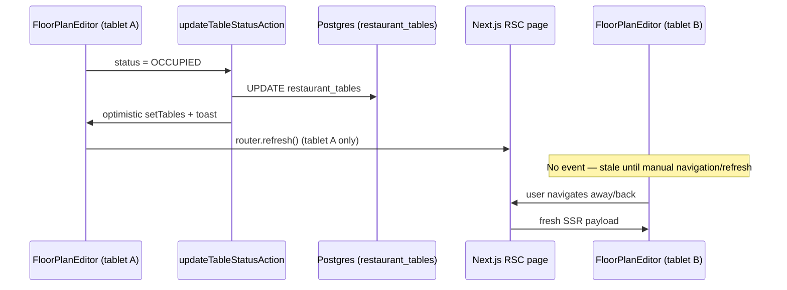
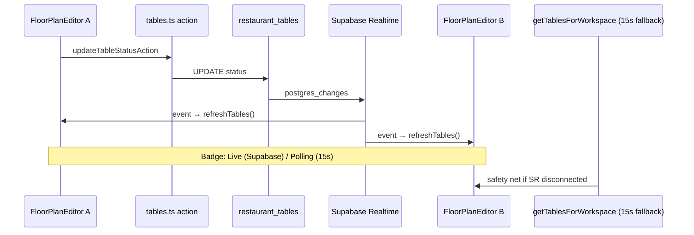

# Floor Plan WebSocket RFC — Realtime Table Sync

**Status:** Draft for engineering review — **not implemented**; floor plan is refresh-only today  
**Audience:** Restaurant product, kitchen/FOH engineering, DevOps  
**Policy:** `floor-plan-realtime-rfc-v1`  
**Related:** [`kds-websocket-rfc.md`](./kds-websocket-rfc.md) · [`services/kds-websocket.ts`](../services/kds-websocket.ts) · [`components/restaurant/floor-plan-editor.tsx`](../components/restaurant/floor-plan-editor.tsx)

---

## Summary

KitchenOS floor plan (`/dashboard/floor-plans`) uses **SSR + `router.refresh()` + `useSyncedServerState`** — not WebSocket. Host seating a table on tablet A does not appear on tablet B until manual refresh. KDS already ships **Supabase Realtime + polling fallback** (`services/kds-websocket.ts`).

**Recommendation:** Add **`services/floor-plan-realtime.ts`** mirroring the KDS transport abstraction — Supabase `postgres_changes` on `restaurant_tables` filtered by `workspace_id`, with **15s polling fallback** and honest connection badge. Defer Pusher/self-hosted unless staging SLO fails.

**Honesty today:** Say **"refresh-based floor view (BETA)"** — not "real-time table sync."

---

## Problem

| Requirement | Target | Why it matters |
|-------------|--------|----------------|
| Table status fan-out | p95 &lt; 2s across devices | Host, server, manager see same occupancy |
| Seat / clear / transfer | &lt; 1s visible on all floor screens | Prevents double-seating |
| Layout drag (editor) | Optimistic local + eventual persist | Editor already persists via `updateTablePosition` |
| Degraded mode | Floor usable on Wi-Fi blip | Polling fallback mandatory |
| Tenant isolation | Workspace A tables never on B channel | Cross-tenant = P0 |
| Vercel compatibility | No WS on serverless routes | Client-side Supabase only |

**Current gap:** `useSyncedServerState` syncs props after **full page refresh** only — competitor audit flags **behind TouchBistro live floor sync** ([`competitor-audit-report.md`](../artifacts/competitor-audit-report.md)).

---

## Current architecture (refresh-only)



| Component | Path |
|-----------|------|
| Page | `app/dashboard/floor-plans/page.tsx` |
| Editor | `components/restaurant/floor-plan-editor.tsx` |
| View (legacy grid) | `components/restaurant/floor-plan.tsx` |
| Sync hook | `hooks/use-synced-server-state.ts` |
| Service | `services/restaurant/table-service.ts` |
| Mutations | `actions/restaurant/tables.ts` |
| Model | `RestaurantTable` in `prisma/schema.prisma` |

**Data on wire:** `id`, `name`, `status`, `positionX/Y`, `currentOrderId`, `currentOrderCustomer` (from active orders join).

---

## Options compared

### Option A — Supabase Realtime (recommended)

**How it works:** Browser subscribes to `postgres_changes` on `public.restaurant_tables` with filter `workspace_id=eq.{workspaceId}`. On INSERT/UPDATE/DELETE → patch local state or call `getTablesForWorkspace` server action (same pattern as KDS refresh).

| Dimension | Assessment |
|-----------|------------|
| **Latency** | 100–400 ms replication + action RTT → **0.5–2 s** p95 (same region) |
| **Cost** | No new vendor if Supabase already used for KDS/auth |
| **Complexity** | **Low** — reuse `services/kds-websocket.ts` patterns |
| **Tenant isolation** | Filter `workspace_id`; verify RLS on `restaurant_tables` |
| **Vercel fit** | **Excellent** — WS terminates at Supabase |
| **Failure modes** | Disconnect → 15s poll reload |

**Pros:** Stack parity with KDS; one ops story.  
**Cons:** Fires on any column change (including drag during edit — debounce or ignore self-origin).

### Option B — Pusher / Ably channels

| Dimension | Assessment |
|-----------|------------|
| **Latency** | Sub-second possible |
| **Cost** | New vendor + channel pricing |
| **Complexity** | **Medium** — server must publish after mutations |
| **Tenant isolation** | Private channels per workspace |

**Defer** until Supabase proof fails or enterprise requires dedicated realtime SLA.

### Option C — Self-hosted WebSocket

**Not recommended for pilot** — operational burden, no long-lived connections on Vercel, duplicates KDS investment.

---

## Proposed architecture



### New module: `services/floor-plan-realtime.ts`

Mirror KDS surface:

```typescript
export type FloorPlanRealtimeTransport = "supabase" | "polling";

export function isFloorPlanRealtimeEnabled(env): boolean;
export function subscribeFloorPlanUpdates(options: {
  workspaceId: string;
  onRefresh: () => void;
  onConnectionChange: (live: boolean) => void;
}): { transport; disconnect };
```

### Feature flag

| Env | Default | Behavior |
|-----|---------|----------|
| `NEXT_PUBLIC_FLOOR_PLAN_REALTIME_ENABLED` | `true` when Supabase configured | Realtime + poll |
| `false` | — | Polling only (15s) |

### Channel naming

```
floor-plan-{workspaceId}
```

Table: `public.restaurant_tables` · filter: `workspace_id=eq.{workspaceId}`

### UI changes

| Change | File |
|--------|------|
| Connection badge | `floor-plan-editor.tsx` header |
| Subscribe on mount | `useFloorPlanRealtime` hook (new) |
| Remove spurious `router.refresh()` after every mutation when live | editor actions |

---

## Event handling rules

| Event | Client behavior |
|-------|-----------------|
| `status` change | Patch table in local state or full reload |
| `position_x/y` change | Update canvas if not local drag in progress |
| `INSERT` / `DELETE` | Full reload (infrequent) |
| Self-origin mutation | Ignore Realtime echo within 500 ms (debounce) |

**Order linkage:** When `orders.status` changes, table occupancy may change — Phase 2 subscribe to `orders` where `table_id IS NOT NULL` OR derive occupancy from periodic reload (simpler Phase 1).

---

## SLO targets (staging proof)

| Metric | p50 | p95 | Proof |
|--------|-----|-----|-------|
| Status change → peer device visible | &lt; 800ms | **&lt; 2s** | Two tablets, 50 transitions |
| Realtime session availability | — | — | ≥ 95% during service window |
| Polling fallback bound | — | **15s** | When Realtime disconnected |

Artifact: `artifacts/floor-plan-realtime-proof-summary.json` (future).

---

## Security

| Check | Requirement |
|-------|-------------|
| RLS | `restaurant_tables` readable only for workspace members |
| Channel filter | Must use `workspace_id`, not legacy `user_id` alone |
| Mutations | Existing `pos.access` + `require-restaurant-table-mutation` unchanged |
| Pen test | Include in [`pen-test-plan.md`](./pen-test-plan.md) scope |

---

## Phased delivery

### Phase 0 — Honesty (now)

- Marketing/docs: **refresh-based**, not real-time
- Competitor matrix: **ONLY_WITH_CAVEAT** / **NO** for live occupancy claim

### Phase 1 — Realtime transport (2 weeks)

| Task | Exit |
|------|------|
| `services/floor-plan-realtime.ts` | Unit tests mirror KDS |
| `useFloorPlanRealtime` hook | Editor subscribes |
| Connection badge | Live / Polling visible |
| RLS audit on `restaurant_tables` | Documented PASS |

### Phase 2 — Order ↔ table linkage (1 week)

| Task | Exit |
|------|------|
| Occupancy updates when order seated/cleared | Without full page refresh |
| E2E two-session test | Staging authed |

### Phase 3 — Pilot proof

| Task | Exit |
|------|------|
| Staging two-tablet drill | p95 &lt; 2s |
| Update capability matrix | BETA → pilot_ready with artifact |

---

## Migration from refresh-only

1. Ship Realtime behind flag default **off** in first deploy  
2. Enable on staging → run proof  
3. Enable production per workspace pilot flag  
4. Keep `useSyncedServerState` for SSR hydration — Realtime triggers refresh callback that updates server props via server action fetch

**No breaking changes** to `actions/restaurant/tables.ts` — mutations unchanged.

---

## Forbidden claims until Phase 3 PASS

- "Real-time floor plan like TouchBistro"
- "Instant table sync across all devices"
- "WebSocket-powered hospitality floor"

**Allowed today:**

- "Drag-and-drop floor plan editor (BETA)"
- "Table status management with refresh-based sync"

---

## References

- KDS RFC: [`kds-websocket-rfc.md`](./kds-websocket-rfc.md)
- KDS transport: [`services/kds-websocket.ts`](../services/kds-websocket.ts)
- Sync hook: [`hooks/use-synced-server-state.ts`](../hooks/use-synced-server-state.ts)
- Competitor audit: [`artifacts/competitor-audit-report.md`](../artifacts/competitor-audit-report.md)
- POS architecture limits: [`POS_ARCHITECTURE.md`](./POS_ARCHITECTURE.md)
