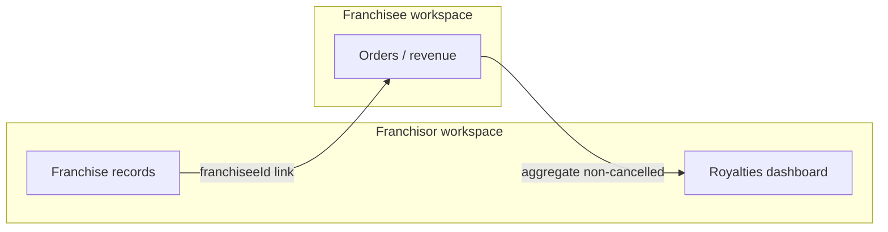

# Franchise management tools plan — OS Kitchen

**Policy:** `franchise-management-plan-v1`  
**Date:** 2026-06-02  
**Owner:** Product + Enterprise + Partner PM  
**Scope:** Franchisor ↔ franchisee operations — royalties, workspace linkage, partner rollups — **not** full FDD/legal franchise OS  
**Status:** **Royalties MVP shipped · no franchise CRUD UI · no pilot PASS · pilot NO-GO**

This document defines OS Kitchen’s **franchise management** maturity: what exists today, how it differs from multi-location comparison ([`multi-location-reporting-plan.md`](./multi-location-reporting-plan.md)), certification gates, and roadmap vs Toast/Revel/Oracle franchise depth.

**Honesty rule:** Royalties are **order-total × rate** on linked franchisee workspaces — not certified accounting, not brand compliance enforcement, not menu lockdown. **0** live franchisor customers. Do **not** sell “franchise engine” or “Toast franchise parity.”

**Related:** [`enterprise-mvp-spec.md`](./enterprise-mvp-spec.md) · [`PARTNER_ARCHITECTURE.md`](./PARTNER_ARCHITECTURE.md) · [`sales-limitation-sheet.md`](./sales-limitation-sheet.md) · [`multi-location-reporting-plan.md`](./multi-location-reporting-plan.md) · `services/franchise/franchise-service.ts`

---

## Executive summary

| Dimension | June 2026 |
|-----------|-----------|
| **`Franchise` model** | Shipped — name, `franchiseeId`, `royaltyRate`, `status` |
| **Royalties dashboard** | Shipped — `/dashboard/franchise/royalties` |
| **CSV export** | Shipped — `/api/export/franchise-royalties` |
| **Franchise CRUD UI** | **Not shipped** — records via DB/seed/admin |
| **Brand / menu enforcement** | **Not shipped** |
| **Franchisee self-service portal** | **Not shipped** |
| **Partner franchise org type** | Shipped — `FRANCHISE_GROUP` in partner model |
| **Live franchisor tenant** | **0** |
| **Pilot** | **NO-GO** — [`pilot-gono-go-summary.json`](../artifacts/pilot-gono-go-summary.json) |

**Safe headline:** “Calculate franchise royalties from linked franchisee order revenue — with CSV export; full franchisor OS on roadmap.”

**Forbidden:** “Enterprise franchise platform,” “Brand-wide menu control,” “Royalty accounting certified,” “100+ unit franchise HQ ready,” “Oracle/Revel franchise parity.”

---

## Franchise vs multi-location (do not conflate)

| Question | Use | Doc |
|----------|-----|-----|
| “How do my **owned** sites compare?” | Multi-location analytics | [`multi-location-reporting-plan.md`](./multi-location-reporting-plan.md) |
| “What do **franchisees** owe me in royalties?” | Franchise royalties | This plan |
| “How does my **agency** see clients?” | Partner OS | [`PARTNER_ARCHITECTURE.md`](./PARTNER_ARCHITECTURE.md) |



**Revenue basis today:** `Order.total` for `franchiseeId` since period start — **not** net sales, not payment-cleared, not location-scoped unless franchisee uses locations consistently.

---

## What ships today (Phase 1 — Royalties MVP)

| Capability | Evidence | Limitation |
|------------|----------|------------|
| Data model | `prisma` `Franchise` | No UI to create/edit |
| Royalty calc | `calculateRoyalties` | Flat % on order totals |
| Period toggle | month / quarter | Calendar boundaries only |
| Dashboard | `app/dashboard/franchise/royalties/page.tsx` | Empty state if no franchises |
| CSV export | `royaltiesToCSV` + export route | RBAC via `requireReportExportActor` |
| Tenant scope | `franchiseListWhereForOwner` | Owner-scoped franchises only |
| Nav entry | `final-navigation-groups.ts` | Orphan sprawl — [`nav-sprawl-audit.md`](./nav-sprawl-audit.md) |
| Advanced settings note | Parent/child via `UserProfile` metadata | Not self-serve |

### Royalty calculation (current logic)

```typescript
// services/franchise/franchise-service.ts (conceptual)
totalRevenue = sum(Order.total where franchiseeId, not CANCELLED, since period start)
royaltyAmount = totalRevenue × (royaltyRate / 100)
```

| Input | Behavior |
|-------|----------|
| `royaltyRate` | Default **5%** on model — per-franchise override |
| `status` | Only **ACTIVE** franchises |
| Refunds / partials | **Not** netted in v1 — roadmap |
| Tax / tips | Included in `Order.total` if stored there |

**Sales:** “Estimated royalties from POS order totals — finance must reconcile before invoicing.”

---

## Workspace linkage model

| Pattern | Implementation | Maturity |
|---------|----------------|----------|
| Franchisor owns `Franchise` rows | `userId` = franchisor owner | Shipped |
| Franchisee workspace | `franchiseeId` → franchisee `UserProfile` | Shipped |
| Parent / child workspaces | Settings advanced copy — integration metadata | **Partial / manual** |
| `workspaceId` on Franchise | Optional FK | Set when migrated |

**Not shipped:** Automated franchisee onboarding, Docusign FDD, territory maps, opening/closing checklists.

---

## Maturity phases

| Phase | Name | Deliverables | Status | Sales |
|:-----:|------|--------------|--------|-------|
| **1** | **Royalties MVP** | Model + dashboard + CSV | **Shipped** | BETA — qualified |
| **2** | **Franchise admin UI** | CRUD, invite franchisee, rate history | Roadmap Q3–Q4 2026 | Do not sell |
| **3** | **Operational franchisee kit** | Menu templates, limited overrides, audits | 2027 | Roadmap |
| **4** | **Brand compliance** | Mandatory items, pricing bands, photo audits | 2027+ | Do not sell |
| **5** | **Financial franchise suite** | Net sales, ACH invoicing, GL codes | 2027+ | Partner with accounting |
| **6** | **Enterprise franchise HQ** | 100+ units, SCIM, SLA | Disqualify until Phase 5+ | [`enterprise-mvp-spec.md`](./enterprise-mvp-spec.md) |

---

## Phase 2 — Franchise admin & pilot certification

| # | Criterion | Owner |
|---|-----------|-------|
| 2.1 | Franchisor can create/edit `Franchise` in UI (rate, status, franchisee link) | Eng |
| 2.2 | Royalties match manual spreadsheet on **staging** (≥3 franchisees, 30 days orders) | QA + Finance |
| 2.3 | Export RBAC — non-exporter cannot download CSV | QA |
| 2.4 | Cross-tenant: franchisor A cannot see franchisor B franchises | Security |
| 2.5 | Refund-adjusted revenue option documented (even if v2) | Product |
| 2.6 | Forbidden claims CI — no “franchise engine” / “Toast franchise” | Marketing |
| 2.7 | Pilot franchisor signs royalty disclaimer | CS |

**Artifact:** `artifacts/franchise-pilot-cert.json`

**Gate to remove BETA label:** Phase 2.1–2.7 PASS + at least **1** design-partner franchisor (not necessarily paying).

---

## Phase 3 — Operational franchisee tools (preview)

| Feature | Value | Dependency |
|---------|-------|------------|
| Shared menu templates | Brand consistency | Menu module maturity |
| Limited local pricing | Franchisee autonomy | RBAC per location |
| Opening checklist | Ops standardization | Tasks / HACCP |
| Franchisee dashboard | Transparency | Separate auth / invite |
| Commissary link | Supply chain | Commissary module |

**Out of scope for 2026 H1:** Drive-thru brand timers, national marketing fund accounting, co-op ad spend.

---

## Partner OS overlap

[`PARTNER_ARCHITECTURE.md`](./PARTNER_ARCHITECTURE.md) covers **agencies** monitoring many client workspaces. Franchise groups may use **partner org type** `FRANCHISE_GROUP` for rollups — distinct from royalties math.

| Surface | Partner OS | Franchise royalties |
|---------|------------|---------------------|
| Primary user | Agency / SI | Franchisor brand owner |
| Billing | Partner contracts | Royalty % on franchisee sales |
| Data | Cross-workspace health | Franchisee order aggregates |

**Do not merge** partner billing with royalty invoices without legal review.

---

## Competitive positioning (honest)

| Vendor | Franchise depth | OS Kitchen June 2026 |
|--------|-----------------|------------------------|
| **Toast** | Mature franchise & enterprise | **Behind** — royalties MVP only |
| **Revel** | Permissions + franchise rollout | **Behind** |
| **Oracle / Simphony** | Enterprise franchise HQ | **Not a fit** — disqualify 100+ units |
| **Lightspeed** | Multi-location stronger than franchise | Comparable on **owned** sites only |
| **TouchBistro** | Limited franchise | Comparable on royalties **estimate** only |

See [`toast-gap-analysis.md`](./toast-gap-analysis.md) · [`competitor-comparison-honest.md`](./competitor-comparison-honest.md).

---

## Sales & marketing guardrails

| Question | Approved answer |
|----------|-----------------|
| “Franchise management?” | “We ship a royalties dashboard from linked franchisee order revenue — full franchisor toolkit is on our roadmap.” |
| “Menu lock for franchisees?” | “Not today — multi-location comparison for owned sites; franchise brand tools Phase 3+.” |
| “Replace royalty accountant?” | “No — export CSV for your finance team; we don’t file or collect royalties.” |
| Demo | Show empty state + **seeded** staging franchises — label **BETA** |

Enforced: [`sales-safe-claims-registry.md`](./sales-safe-claims-registry.md) · [`forbidden-claims`](../tests/unit/forbidden-claims-enforcement.test.ts) patterns.

**RFP disqualifiers:** 100+ units day-one · mandatory franchise menu enforcement · royalty ACH collection · franchisee self-service app · SOC2 + franchise SLA bundle without [`soc2-readiness-assessment.md`](./soc2-readiness-assessment.md).

---

## Metrics (post-pilot)

| Metric | Target (Phase 2+) |
|--------|-------------------|
| Franchisors onboarded | 1 design partner |
| Royalty calc variance vs finance | < 2% on pilot set |
| Time to export royalties | < 30s |
| Franchise CRUD without eng | 100% (Phase 2) |
| Support tickets / franchisor / month | Track |

**June 2026:** **SKIPPED** — no franchisor pilot.

---

## Risks & mitigations

| Risk | Mitigation |
|------|------------|
| Gross vs net revenue dispute | Document basis; Phase 2 refund adjustment |
| Wrong franchisee link | Admin UI + audit log (Phase 2) |
| Cross-tenant leak | `franchiseListWhereForOwner` + isolation tests |
| Over-selling vs Toast | Honest comparison + enterprise disqualifiers |
| Legal royalty collection | CSV only — no ACH in product v1 |

---

## Engineering backlog (prioritized)

| Priority | Item |
|----------|------|
| P0 | Phase 2 certification checklist execution |
| P1 | Franchise CRUD UI + invite franchisee |
| P1 | Net sales / refund-adjusted royalty option |
| P2 | Link royalties to [`multi-location-reporting-plan.md`](./multi-location-reporting-plan.md) Layer 4 |
| P2 | Partner `FRANCHISE_GROUP` rollup cards |
| P3 | Menu template push to franchisees |

---

## Related documents

| Doc | Use |
|-----|-----|
| [`multi-location-reporting-plan.md`](./multi-location-reporting-plan.md) | Owned-site comparison (Layer 4 deferral) |
| [`enterprise-mvp-spec.md`](./enterprise-mvp-spec.md) | Enterprise fit / disqualifiers |
| [`PARTNER_ARCHITECTURE.md`](./PARTNER_ARCHITECTURE.md) | Agency vs franchisor |
| [`purchase-order-automation-plan.md`](./purchase-order-automation-plan.md) | Franchisee supply POs |
| [`nav-sprawl-audit.md`](./nav-sprawl-audit.md) | Franchise nav visibility |
| [`support-tier-plan.md`](./support-tier-plan.md) | SLA before franchise HQ |

---

## Revision history

| Version | Date | Change |
|---------|------|--------|
| `franchise-management-plan-v1` | 2026-06-02 | Initial plan — Task 122 |

**Next action:** Phase 2 franchise admin UI · staging royalty reconciliation · keep “franchise engine” out of marketing until Phase 2 PASS.
