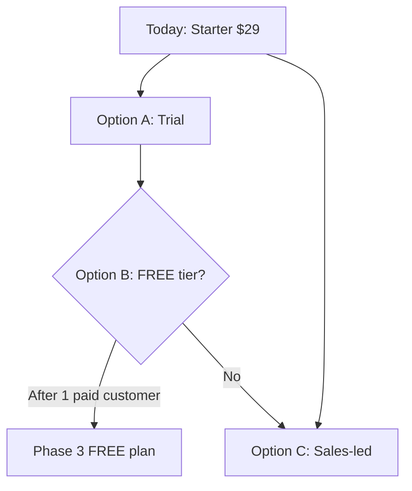
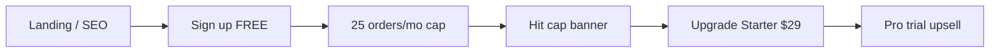

# Freemium entry point plan — OS Kitchen

**Policy:** `freemium-tier-plan-v1`  
**Date:** 2026-06-02  
**Owner:** Founder + Product + Finance + Marketing  
**Scope:** **Restaurant workspace** self-serve entry — not marketplace vendor FREE tier  
**Status:** **Strategy only** — **no FREE subscription plan in code · STARTER $29/mo is minimum · pilot NO-GO**

This document defines whether and how OS Kitchen adds a **$0 freemium workspace tier** for acquisition — versus **extended trial**, **sales-led Starter**, and **design-partner pilots**. It is the decision record before any schema or pricing-page change.

**Honesty rule:** Do **not** advertise “free forever” or “free POS” until Phase 3 ships with entitlements enforced in `feature-registry.ts` and `/pricing` updated. Today all workspaces default to **STARTER** billing semantics or trial — see `lib/billing/access.ts`.

**Related:** [`marketplace-pricing-strategy.md`](./marketplace-pricing-strategy.md) (vendor FREE ≠ restaurant freemium) · [`series-a-narrative.md`](./series-a-narrative.md) · [`sales-limitation-sheet.md`](./sales-limitation-sheet.md) · [`q3-2026-okrs.md`](./q3-2026-okrs.md) · `lib/billing/plan-registry.ts`

---

## Executive summary

| Dimension | Today (June 2026) |
|-----------|-------------------|
| **SubscriptionPlan enum** | `STARTER` · `PRO` · `TEAM` · `ENTERPRISE` — **no FREE** |
| **Entry price** | **$29/mo** Starter — `PLAN_REGISTRY.STARTER` |
| **Self-serve trial** | Marketing CTAs say “trial” — Stripe checkout on paid tiers |
| **Design partner** | $0 pilot via SOW — not productized freemium |
| **Vendor marketplace FREE** | Separate — `$0/mo, 5% commission` for suppliers only |
| **Paying customers** | **0** |
| **Recommended motion (Q3 2026)** | **Sales-led Starter + design partner** — defer public freemium until 1 paid convert |

**Safe headline today:** “Starter from $29/mo — design partner pilots available by application.”

**Forbidden today:** “Free POS forever,” “No credit card — full platform,” “Square free tier equivalent.”

---

## Strategic options

| Option | Pros | Cons | Decision (June 2026) |
|--------|------|------|----------------------|
| **A — Extended trial (14–30d Pro)** | Low eng cost; qualifies serious buyers | Churn at trial end; support load | **Pilot in Q3** after first LOI |
| **B — Freemium FREE workspace** | Top-of-funnel volume; PLG narrative | Support cost, abuse, margin on $0 | **Defer** until Phase 2 metrics |
| **C — Sales-led Starter only** | Aligned with design partner ICP | Slower top-of-funnel | **Current default** |
| **D — “Free tools” landing** | SEO for calculators, no workspace | No entitlement complexity | **Optional** marketing experiment |

**Series A posture:** Pre-revenue — prioritize **paid pilot conversion** over freemium MAU ([`series-a-narrative.md`](./series-a-narrative.md)).

---

## Proposed FREE tier (Phase 3 — not shipped)

If approved after **≥1 paying Starter/Pro customer** and support capacity review:

### Entitlements (strict caps)

| Limit | FREE | STARTER (reference) |
|-------|:----:|:-------------------:|
| **Price** | $0/mo | $29/mo |
| **Orders / month** | **25** | 100 |
| **Active menus** | **1** | 1 |
| **Staff seats** | **1** | 3 |
| **Integrations** | **0** | 0 |
| **Storefront** | Read-only preview **or** 1 live menu (TBD) | Enabled |
| **POS terminal** | **No** | Pro+ for POS |
| **AI modules** | Today CC read-only + 1 briefing/wk | Full per plan |
| **Marketplace buyer** | Browse only — **no checkout** | Included with workspace |
| **Support** | Community / docs only | Email — [`support-tier-plan.md`](./support-tier-plan.md) T1 |
| **Branding** | “Powered by OS Kitchen” footer | Removable on Pro+ |

### Feature gates (code changes required)

| Area | Change |
|------|--------|
| Prisma | Add `FREE` to `SubscriptionPlan` enum + migration |
| `PLAN_REGISTRY` | New `FREE` entry — `rank: 0`, `checkoutable: false` |
| `feature-registry.ts` | `FEATURE_MIN_PLAN` floor for FREE-only features |
| `canUseFeature` | Deny POS, integrations, marketplace checkout on FREE |
| Stripe | No price id — skip subscription or $0 Stripe product |
| `/pricing` | Fourth column or “Compare FREE” accordion — **not live until Phase 3** |
| Onboarding | Upgrade prompts at 80% order cap |

**Non-goals for FREE:** Multi-location, API, SSO, white-label, LIVE integrations, unlimited AI.

---

## Phased rollout

| Phase | Name | Deliverable | Gate | Target |
|:-----:|------|-------------|------|--------|
| **1** | **Decision + caps doc** | This plan approved by Founder | — | **Done (Task 117)** |
| **2** | **Trial experiment** | 14-day Pro trial via Stripe; measure convert | 1 design partner LOI | Q3 2026 |
| **3** | **FREE tier MVP** | Schema + registry + enforcement + pricing copy | Trial convert **≥15%** OR strategic PLG bet | Q1 2027 |
| **4** | **PLG optimization** | In-app upgrade, usage emails, cap banners | FREE MAU **<20%** of support tickets | Q2 2027 |

---

## Phase 2 — Extended trial (near-term)

Preferred **low-risk** acquisition path before FREE tier:

| # | Task | Owner |
|---|------|-------|
| 2.1 | Stripe trial on PRO price — 14 days, card required | Eng |
| 2.2 | Trial banner in `/dashboard/billing` | Product |
| 2.3 | Auto-downgrade to STARTER or read-only — **not FREE** | Eng |
| 2.4 | CS script — trial ≠ design partner pilot | CS |
| 2.5 | Metric: trial → paid within 30d | Marketing |

**Sales wording:** “Try Pro features for 14 days — Starter from $29/mo after.”

---

## Phase 3 — FREE tier engineering checklist

| # | Task | Owner |
|---|------|-------|
| 3.1 | Migration `SubscriptionPlan.FREE` | Eng |
| 3.2 | `PLAN_REGISTRY.FREE` + tests | Eng |
| 3.3 | Order limit cron / soft block at 25 | Eng |
| 3.4 | Marketplace browse without checkout | Eng |
| 3.5 | Forbidden claims: no “free POS” in CI | Marketing |
| 3.6 | Abuse: email verify + 1 workspace/email | Eng |
| 3.7 | Finance model — COGS per FREE workspace | Finance |

---

## Conversion funnel (target state)

**Upgrade triggers:** 80% order cap · integration attempt · POS page visit · marketplace checkout · second staff invite.

---

## Competitive context

| Competitor | Free motion | OS Kitchen response |
|------------|-------------|---------------------|
| **Square** | Free POS with processing fees | We are **software subscription** — don’t match “free POS” without card processing revenue |
| **Toast** | No meaningful freemium | Sales-led + commissary ICP |
| **Lightspeed** | Trial-led | Option A trial first |
| **Marketplace vendors** | Faire-style supplier free listing | Already **vendor FREE tier** — separate doc |

**Positioning:** Freemium is for **solo commissary / meal-prep evaluators** — not full-service restaurants needing POS + integrations day-one.

---

## Sales & marketing guardrails

| Question | Approved answer (today) |
|----------|-------------------------|
| “Is there a free plan?” | “Starter is $29/mo. Design partners may pilot under LOI. A limited free tier is on the roadmap — not live yet.” |
| “Same as Square free?” | “No — we don’t monetize via payment processing alone. Starter includes kitchen ops depth Square free tier omits.” |
| Vendor asking about free | Point to **vendor FREE** — [`marketplace-pricing-strategy.md`](./marketplace-pricing-strategy.md) |

| Forbidden | Why |
|-----------|-----|
| “Free forever full platform” | Entitlements not built |
| “Free POS” | POS gated to Pro+ |
| “No credit card ever” | Trial may require card in Phase 2 |

Enforced: [`sales-safe-claims-registry.md`](./sales-safe-claims-registry.md) · `tests/unit/forbidden-claims-enforcement.test.ts`.

---

## Economics (illustrative — Finance to model)

Assumptions for FREE tier at scale:

| Metric | Conservative | Notes |
|--------|:------------:|-------|
| FREE → Starter convert (90d) | 8–12% | Industry PLG benchmark |
| Support cost / FREE user / mo | $2–5 | Docs-first; no phone |
| Infra cost / FREE user / mo | $0.50–1.50 | Vercel + Supabase |
| Max FREE MAU before hire | **500** | Bus factor — [`bus-factor-mitigation.md`](./bus-factor-mitigation.md) |

**Break-even:** FREE only makes sense if convert rate × Starter LTV > support + infra at scale — model before Phase 3 launch.

---

## Metrics

| Metric | Phase 2 (trial) | Phase 3 (FREE) |
|--------|-----------------|----------------|
| Signups / month | Track | Track |
| Trial → paid % | Target **≥15%** | — |
| FREE → Starter % | — | Target **≥10%** @ 90d |
| Support tickets / signup | < 0.3 | < 0.15 |
| Order cap hit rate | — | **>40%** (validates upgrade prompt) |

**June 2026 baseline:** No self-serve signups tracked — **SKIPPED**. [`pilot-gono-go-summary.json`](../artifacts/pilot-gono-go-summary.json) **NO-GO**.

---

## Risks & mitigations

| Risk | Mitigation |
|------|------------|
| FREE users expect LIVE integrations | Hard gate + BETA badges |
| Support overload | Community-only tier; cap MAU |
| “Free POS” SEO bait | Forbidden claims CI |
| Cannibalize Starter revenue | Strict caps; no POS on FREE |
| Confusion with vendor FREE | Separate docs and UI labels |

---

## Related documents

| Doc | Use |
|-----|-----|
| [`marketplace-pricing-strategy.md`](./marketplace-pricing-strategy.md) | Vendor FREE tier (suppliers) |
| [`transparent-pricing-sales-guide.md`](./transparent-pricing-sales-guide.md) | vs Square “free” objection |
| [`design-partner-email-sequence.md`](./design-partner-email-sequence.md) | LOI path vs freemium |
| [`loi-design-partner-template.md`](./loi-design-partner-template.md) | $0 pilot contract |
| `lib/billing/plan-registry.ts` | Source of truth for paid tiers |

---

## Revision history

| Version | Date | Change |
|---------|------|--------|
| `freemium-tier-plan-v1` | 2026-06-02 | Initial plan — Task 117 |

**Next action:** Run Phase 2 trial experiment design · keep `/pricing` on paid tiers only · revisit FREE enum after first paid customer.
