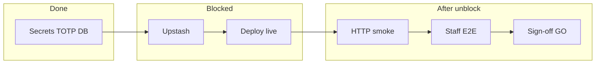

# Paid pilot — Ops handoff (100%)

**Generated:** 2026-05-18T09:38:33.545Z
**Queue progress:** 6/13 (46%)
**Current blocker:** `upstash` — Upstash REST credentials

## Two tracks

| Track | Command | Meaning |
|-------|---------|---------|
| **LOCAL 100%** | `npm run pilot:local:100` | Code + DB + local env (no Upstash/Vercel required) |
| **VERCEL GO** | paste Upstash + redeploy + `npm run pilot:100-next` | Production staging ready for pilot |

LOCAL 100% report exists — run `npm run pilot:local:100` to refresh.

## Definition of Done (Vercel GO)

| # | Criterion | Status |
|---|-----------|--------|
| 1 | Upstash REST ping OK | **BLOCKED** |
| 2 | `verify:staging-env` (no --local-pilot) | WARN local memory |
| 3 | Staging deploy HTTP 200 | **BLOCKED** (404) |
| 4 | `smoke:golden-path-http` | BLOCKED |
| 5 | Staff in workspace | pending |
| 6 | Manual golden path + sign-off | pending |

## Do this now (ordered)

### Step 1 — Upstash (~5 min) **YOU**

Paste file status: **template** — .env.upstash.paste.local still has example URL — replace with real Upstash REST credentials

```bash
# 1. Edit paste file with real REST credentials
code .env.upstash.paste.local   # or your editor

# 2. Ingest + verify
npm run pilot:upstash:gate
```

Console: https://console.upstash.com/redis → database → **REST API**

**DoD:** `npm run staging:ops:status` shows UPSTASH = OK.

### Step 2 — Redeploy staging (~15 min) **YOU**

```bash
npm run pilot:deploy:gate
# After redeploy in Vercel:
npm run pilot:deploy:gate -- --url=https://YOUR-NEW-PREVIEW.vercel.app
```

Probed URL: `https://xn---preview--staging-r4nxb5ja9d6q.vercel.app` → 404 on /api/health, /login

**DoD:** `npm run staging:url:probe` shows OK on at least one path.

### Step 3 — Automate remainder

```bash
npm run pilot:100-next
```

## Progress diagram



## Queue

- [x] deps (auto)
- [x] secrets (auto)
- [x] sync-env (auto)
- [x] totp (auto)
- [ ] upstash (ops)
- [x] staging-url (auto)
- [ ] deploy-live (ops)
- [x] db (auto)
- [ ] staff (product)
- [ ] http (auto)
- [ ] e2e-env (ops)
- [ ] golden-manual (product)
- [ ] signoff (all)

## Artifacts

| File | Purpose |
|------|---------|
| `docs/generated/NEXT_STEP_INSTRUCTIONS.md` | Live next-step guide |
| `docs/generated/PILOT_GO_NO_GO_STATUS.md` | `npm run pilot:go-no-go-report` |
| `.env.upstash.paste.local` | Paste Upstash credentials (gitignored) |
| `docs/PILOT_100_PERCENT_RUNBOOK.md` | Full runbook |

_Regenerate: `npm run pilot:ops:handoff`_
