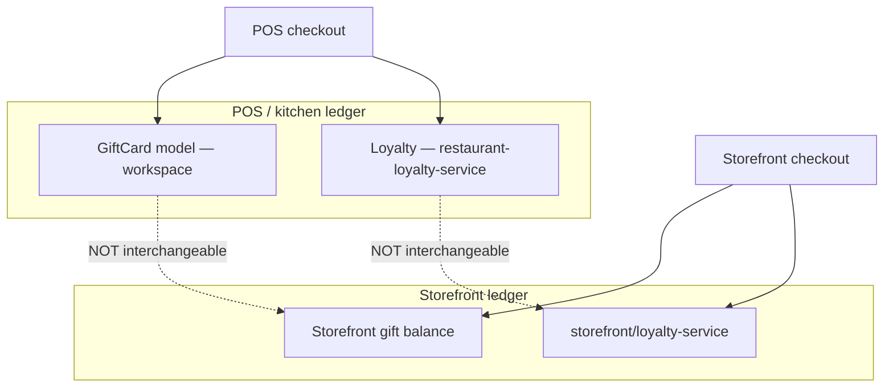

# Gift cards and loyalty plan — OS Kitchen

**Policy:** `gift-cards-loyalty-plan-v1`  
**Date:** 2026-06-02  
**Owner:** Product + CRM + Engineering  
**Scope:** Stored-value gift cards and restaurant loyalty — **storefront + POS paths**, not marketplace B2B  
**Status:** **Foundation shipped · dual-ledger honesty certified · unified cross-channel deferred · pilot NO-GO**

This document is the **strategic plan** for gift cards and loyalty: what exists in code, what sales may claim, how POS and storefront ledgers differ, and the roadmap to certified parity (not unified single balance).

**Honesty rule:** Do **not** claim “one gift card everywhere” or “Square Loyalty parity.” [`sales-limitation-sheet.md`](./sales-limitation-sheet.md): **separate ledgers — dual balance** across POS and storefront until a future era explicitly unlocks unification.

**Related:** [`crm-loyalty-growth-roadmap.md`](./crm-loyalty-growth-roadmap.md) · [`cross-channel-rewards-honesty-checklist.md`](./cross-channel-rewards-honesty-checklist.md) · `lib/rewards/cross-channel-rewards-era14-policy.ts` · [`toast-gap-analysis.md`](./toast-gap-analysis.md)

---

## Executive summary

| Dimension | Today (June 2026) |
|-----------|-------------------|
| **Gift cards — kitchen ledger** | Issue/redeem — `services/gift-cards/gift-card-service.ts` |
| **Gift cards — storefront ledger** | Separate — `services/storefront/gift-card-service.ts` |
| **Loyalty — restaurant program** | Points/tiers math — `services/loyalty/restaurant-loyalty-service.ts` |
| **Loyalty — storefront** | Separate service — `services/storefront/loyalty-service.ts` |
| **POS redemption** | `components/pos/loyalty-redeem-prompt.tsx` · POS CRM hooks |
| **Cross-channel unification** | **`deferred_locked`** — Era 14 policy |
| **E2E cross-channel proof** | **Not certified** — no default CI Playwright |
| **Live operator proof** | **0** paying customers |

**Safe headline:** “Gift cards and loyalty work within each channel — POS and storefront balances are separate until we certify unification.”

**Forbidden:** “Unified loyalty across all channels,” “One gift card online and in-store interchangeably,” “Toast/Square loyalty parity.”

---

## Architecture today (dual ledger)



| Surface | Admin UI | Public UI | Service |
|---------|----------|-----------|---------|
| Gift cards (kitchen) | `/dashboard/gift-cards` | — | `actions/gift-cards.ts` |
| Gift cards (storefront) | `/dashboard/storefront/gift-cards` | `/s/[slug]/gift-cards` | `actions/storefront/gift-cards.ts` |
| Loyalty (CRM) | `/dashboard/customers/loyalty` | — | `actions/loyalty.ts` |
| Loyalty (storefront) | `/dashboard/storefront/loyalty` | API redeem/balance routes | `services/storefront/loyalty-service.ts` |

**Policy lock:** `CROSS_CHANNEL_REWARDS_ERA14_UNIFICATION_STATUS = "deferred_locked"` — codes/balances from POS are **not** valid on storefront and vice versa ([`cross-channel-rewards-era14-policy.ts`](../lib/rewards/cross-channel-rewards-era14-policy.ts)).

---

## What ships today

### Gift cards

| Capability | Status | Evidence |
|------------|--------|----------|
| Issue card with balance | Shipped (kitchen) | `createGiftCard` — random or custom code |
| Lookup + redeem | Shipped | `lookupGiftCard`, `redeemGiftCard` |
| Balance API | Shipped | `/api/gift-cards/balance` |
| Storefront balance check | Partial | `storefront-gift-cards-client.tsx` |
| RBAC | Shipped | `tests/unit/storefront-gift-cards-rbac.test.ts` |
| Cross-channel redeem E2E | **Not certified** | Honesty CI only |

### Loyalty

| Capability | Status | Evidence |
|------------|--------|----------|
| Points per dollar + tier multipliers | Shipped | `calculateRestaurantLoyaltyEarn` |
| Item bonus rules | Shipped | `calculateItemBonusPoints` |
| Config forms | Shipped | `restaurant-loyalty-config-form.tsx`, `loyalty-rules-form.tsx` |
| Storefront redeem API | Shipped | `/api/storefront/loyalty/redeem` |
| POS redeem prompt | Shipped | `loyalty-redeem-prompt.tsx` |
| E2E loyalty spec | Exists | `e2e/restaurant-loyalty.spec.ts` — not staging PASS |
| Unified ledger | **Deferred** | Era 14 policy |

---

## Maturity phases

| Phase | Name | Scope | Status | Sales |
|:-----:|------|-------|--------|-------|
| **1** | **Dual-ledger foundation** | Separate POS + storefront services | **Shipped** | “Per-channel — not unified” |
| **2** | **Channel parity certification** | Unit + smoke PASS per channel | **In progress** | “Works on POS **or** storefront — ask which” |
| **3** | **Operator UX polish** | Single admin hub, clear ledger labels | Planned Q4 2026 | BETA badges on admin |
| **4** | **Unified ledger (optional era)** | Single balance cross-channel | **`deferred_locked`** | **Do not sell** until era unlock |
| **5** | **Growth automation** | Campaigns, winback, attribution | Roadmap | [`crm-loyalty-growth-roadmap.md`](./crm-loyalty-growth-roadmap.md) |

---

## Phase 2 — Parity certification (target H2 2026)

Gate before removing dual-ledger caveat from limitation sheet **for single-channel claims**:

| # | Criterion | Owner | Artifact |
|---|-----------|-------|----------|
| 2.1 | `npm run smoke:cross-channel-rewards` PASS | QA | CI log |
| 2.2 | `tests/unit/restaurant-loyalty-service.test.ts` green | Eng | CI |
| 2.3 | Gift card issue → redeem on **kitchen** path | QA | Manual script |
| 2.4 | Storefront gift balance check on staging | QA | Screenshot |
| 2.5 | POS redeem prompt wired in checkout smoke | QA | POS smoke |
| 2.6 | Sales deck reviewed — no unified balance imagery | Marketing | Checklist sign-off |
| 2.7 | Pilot operator uses **one channel only** in demo | CS | Demo script |

**Outcome:** Limitation sheet may add: “Gift card/loyalty certified **per channel** — dual ledger until Phase 4.”

---

## Phase 3 — Admin UX (Q4 2026)

| Item | Detail |
|------|--------|
| **Ledger badge** | “Kitchen” vs “Storefront” on every balance row |
| **Consolidated nav** | Link from `/dashboard/customers` hub — reduce sprawl |
| **Fraud controls** | Max issue amount, manager approval on large redeem |
| **Audit trail** | Issue/redeem/reversal in audit log registry |
| **Reporting** | Liability report — outstanding gift card balance |

---

## Phase 4 — Unified ledger (deferred — do not schedule without era decision)

Requirements before **`deferred_locked` → unlocked**:

| Prerequisite | Owner |
|--------------|-------|
| Product era sign-off (explicit prompt / ADR) | Founder |
| Schema migration — single `CustomerWallet` or linked accounts | Eng |
| Reconciliation job — merge duplicate customer profiles | Eng |
| Cross-channel Playwright E2E in staging CI | QA |
| Legal — stored value / escheatment by state | Legal |
| Pilot operator with **both** POS + storefront live | CS |

**Competitive note:** Square Loyalty wins on **unified SMB ledger** — we compete on **kitchen ops depth + honest labels**, not parity claims ([`toast-gap-analysis.md`](./toast-gap-analysis.md)).

---

## Phase 5 — Growth & campaigns (2027+)

From [`crm-loyalty-growth-roadmap.md`](./crm-loyalty-growth-roadmap.md):

1. Consent-aware email/SMS campaigns  
2. Abandoned cart / winback / birthday triggers  
3. Campaign attribution to order revenue  
4. VIP segments from LTV metrics  

**Guardrail:** No autonomous AI messaging without human-approved policy ([`ai-honesty-policy.md`](./ai-honesty-policy.md)).

---

## Sales & demo guardrails

| Scenario | Approved wording |
|----------|------------------|
| “Do gift cards work?” | “Yes — issue and redeem in dashboard. Storefront has its own gift path; balances are **not** automatically shared with POS today.” |
| “Loyalty like Toast?” | “We have points, tiers, and POS redeem — **dual ledger** until unified era. Not Toast parity.” |
| Demo both channels | Pick **one** channel per demo; label ledger in UI |
| Shopify loyalty sync | **Not LIVE** — manual/export only |

Run copy through [`sales-safe-claims-registry.md`](./sales-safe-claims-registry.md) · `tests/unit/forbidden-claims-enforcement.test.ts`.

---

## Proof commands

```bash
npm run smoke:cross-channel-rewards
npm test -- tests/unit/restaurant-loyalty-service.test.ts tests/unit/storefront-gift-cards-rbac.test.ts
npx playwright test e2e/restaurant-loyalty.spec.ts --project=chromium-authed
```

See [`cross-channel-rewards-honesty-checklist.md`](./cross-channel-rewards-honesty-checklist.md).

---

## Metrics (post-pilot)

| Metric | Phase 2 target | Notes |
|--------|----------------|-------|
| Gift cards issued / month | Baseline | Per workspace |
| Redemption rate | Track | Kitchen vs storefront separately |
| Loyalty enroll % of orders | Track | Per channel |
| Liability (outstanding GC balance) | Finance report | Monthly |
| Cross-channel mistaken redeem tickets | **0** | Support tag |

**June 2026:** No production usage — **SKIPPED**. [`pilot-gono-go-summary.json`](../artifacts/pilot-gono-go-summary.json) **NO-GO**.

---

## Risks & mitigations

| Risk | Mitigation |
|------|------------|
| Sales shows unified balance | Dual-ledger policy + limitation sheet |
| Customer expects Square parity | Disqualify or set channel expectation |
| Escheatment / compliance | Legal review before large GC programs |
| Fraud — brute-force codes | Rate limit balance API; longer codes |
| Scope creep to full CDP | Stay restaurant-first per CRM roadmap |

---

## Related documents

| Doc | Use |
|-----|-----|
| [`crm-loyalty-growth-roadmap.md`](./crm-loyalty-growth-roadmap.md) | Campaigns + attribution |
| [`cross-channel-rewards-honesty-checklist.md`](./cross-channel-rewards-honesty-checklist.md) | Pilot demo checklist |
| [`sales-limitation-sheet.md`](./sales-limitation-sheet.md) | Dual balance caveat |
| [`POS_ARCHITECTURE.md`](./POS_ARCHITECTURE.md) | POS checkout spine |
| [`freemium-tier-plan.md`](./freemium-tier-plan.md) | FREE tier — loyalty scope TBD |

---

## Revision history

| Version | Date | Change |
|---------|------|--------|
| `gift-cards-loyalty-plan-v1` | 2026-06-02 | Initial plan — Task 118 |

**Next action:** Run Phase 2 smoke cert · label ledgers in admin UI · keep unified claims locked until era unlock.
