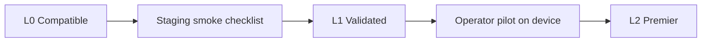

# Hardware partner program — OS Kitchen

**Policy:** `hardware-partner-program-v1`  
**Date:** 2026-06-02  
**Owner:** Founder + Product + Partnerships  
**Scope:** OEM / reseller / integrator relationships for **compatible devices** — not a proprietary terminal ecosystem  
**Status:** **Program design only** — **0 signed hardware partners · 0 certified device SKUs · pilot NO-GO**  
**Related:** [`kitchen-camera-honest-positioning.md`](./kitchen-camera-honest-positioning.md) · [`POS_ARCHITECTURE.md`](./POS_ARCHITECTURE.md) · [`restaurant-partnerships-strategy.md`](./restaurant-partnerships-strategy.md) · [`toast-gap-analysis.md`](./toast-gap-analysis.md) · [`offline-pos-plan.md`](./offline-pos-plan.md) (Task 115)

OS Kitchen is **software-first**: operators bring tablets, browsers, optional Stripe Terminal readers, label printers, and camera streams. This program defines how **third-party hardware vendors** can list compatibility — without implying Toast/Square-level bundled hardware today.

**Honesty rule:** Do **not** call a vendor a “hardware partner” until a signed compatibility agreement and at least one staging smoke pass are on file. Use *“compatible”* or *“in validation”* until then.

---

## Strategic posture

| Principle | What it means |
|-----------|---------------|
| **BYO device** | No OS Kitchen-branded terminal required for pilot |
| **Browser-first POS** | `/dashboard/pos` runs in modern Chromium/Safari — not native APK lock-in |
| **Honest payments** | Stripe Terminal path exists in code; **not** production-certified for all reader models |
| **Camera-ready, not bundled CV** | Kitchen Camera accepts stream URLs; OEM does not ship “AI box” claims |
| **No hardware moat yet** | Compete on unified ops + AI modules — defer terminal ecosystem parity |

**Safe headline:** “Works with common restaurant hardware — validated compatibility list in progress.”

**Forbidden:** “Certified hardware ecosystem,” “Toast Go equivalent,” “included terminal,” “offline-certified POS bundle.”

---

## Partner tiers

| Tier | Label | Requirements | OS Kitchen offers | Sales use |
|:----:|-------|--------------|-------------------|-----------|
| **L0** | **Compatible (self-declared)** | Vendor publishes spec sheet; we document browser/OS minimums | Listing on internal wiki only | “Likely works — not validated” |
| **L1** | **Validated** | Staging smoke on reference device + signed one-pager | “Validated with OS Kitchen” badge (staging) | Demo + design partner pilots |
| **L2** | **Premier (future)** | L1 + 2 operator references + support SLA | Co-marketing one-pager, joint webinar slot | Post-first-paid-pilot only |

**Current inventory:** **0 devices at L1 or L2.**

---

## Hardware categories & platform truth

| Category | OS Kitchen support today | Partner opportunity | Certification focus |
|----------|-------------------------|---------------------|---------------------|
| **Tablet / browser POS** | In-browser checkout — `app/dashboard/pos/*` | Rugged tablet OEMs, kiosk vendors | Touch targets, offline banner honesty, shift/register flows |
| **KDS / expo display** | Web KDS — station routing from order spine | Large-format display mounts | Bump latency, multi-station layout, permission-negative tests |
| **Receipt / label printer** | Receipt text generation; **no** universal USB driver | Epson/Star integrators | Print-from-browser or network bridge — document limits |
| **Card reader** | Stripe Terminal.js — `lib/payments/stripe-terminal-client.ts` | Stripe reader resellers | Simulated readers in dev; live reader smoke on staging |
| **Kitchen camera / NVR** | Stream URL + synthetic preview — `KITCHEN_CAMERA_SYNTHETIC` | IP camera OEM, NVR vendors | RTSP/HTTPS ingest, banner behavior when no stream |
| **Barcode / scan** | Packing scan hooks in settings architecture | Handheld scan vendors | WebUSB / keyboard wedge — per-integration |

**Non-goals (2026):** Cash-drawer pulse, proprietary firmware, exclusive OEM distribution, field-install fleet.

Evidence: [`POS_ARCHITECTURE.md`](./POS_ARCHITECTURE.md) non-goals — native Terminal USB, offline checkout, full table service.

---

## Validation checklist (L1)

Each candidate device completes **one staging workspace** run:

| # | Test | Pass criteria |
|---|------|---------------|
| 1 | Login + RBAC | Cashier vs manager permissions enforced |
| 2 | POS sale | Order created via order spine; receipt artifact |
| 3 | KDS bump | Station receives routed item; bump updates state |
| 4 | Terminal (if applicable) | Simulated or physical reader completes test payment |
| 5 | Camera (if applicable) | Stream URL configured OR synthetic banner visible |
| 6 | Print (if applicable) | Receipt/label outputs without PII leak in logs |
| 7 | Mobile viewport | Today Command Center usable at 390px width |

**Artifact:** `artifacts/hardware-validation-{vendor}-{sku}.json` (internal — not public until L1 signed).

---

## Partner application process

### Phase 0 — Inbound (now)

| Step | Owner | Output |
|------|-------|--------|
| 0.1 | Partnerships | Intake form: SKU, OS, connectivity, target ICP |
| 0.2 | Product | Category fit / disqualify (e.g., offline-only terminal) |
| 0.3 | Engineering | Assign staging smoke owner |
| 0.4 | Legal | Mutual NDA + compatibility one-pager (no exclusivity) |

### Phase 1 — First 3 L1 validations (H2 2026)

| Priority | Persona | Why |
|----------|---------|-----|
| 1 | **Stripe Terminal reader reseller** | Aligns with existing API path |
| 2 | **IP camera / NVR vendor** | Supports honest Kitchen Camera story |
| 3 | **Rugged Android tablet** | POS browser pilot ergonomics |

**Gate:** At least **1 signed design partner LOI** before public “Validated” badge — see [`loi-design-partner-template.md`](./loi-design-partner-template.md).

### Phase 2 — Co-marketing (2027+)

- Joint landing snippet on `/integrations` (BETA badge until LIVE criteria met)
- Hardware section on `/vendor` only if marketplace supply angle exists
- No paid booth spend until [`pilot-gono-go-summary.json`](../artifacts/pilot-gono-go-summary.json) reaches GO

---

## What partners get vs give

| Partner gives | OS Kitchen gives |
|---------------|------------------|
| Reference hardware (loan or discount) | Staging tenant + smoke script |
| L2 support contact for pilot escalations | Listing in compatibility doc (honest tier label) |
| Accurate spec sheet — no “AI included” overclaim | Feedback into [`kitchen-camera-honest-positioning.md`](./kitchen-camera-honest-positioning.md) |
| Permission to use logo after legal review | Intro to design partners **when** LOI pipeline active |

**We do not offer:** Revenue share on OS Kitchen subscriptions (2026), exclusive territories, or “certified by Toast competitor” language.

---

## Sales & marketing guardrails

| Scenario | Approved wording |
|----------|------------------|
| Prospect asks “Do you sell terminals?” | “Software-first — use your tablet or a validated reader; we don’t bundle proprietary hardware.” |
| Prospect compares to Toast Go | Link [`toast-gap-analysis.md`](./toast-gap-analysis.md) — disqualify if bundled hardware non-negotiable |
| Demo without physical reader | `NEXT_PUBLIC_STRIPE_TERMINAL_SIMULATED=1` — label as simulated |
| Kitchen Camera on sales call | Preview banner on until stream URL configured |
| Partner logo on website | Legal approved + L1 minimum |

Run public copy through [`sales-safe-claims-registry.md`](./sales-safe-claims-registry.md) and `verify-claims` CI.

---

## Disqualifiers (do not pursue)

- Vendor requires **offline-first** certification OS Kitchen cannot meet — see Task 115
- Exclusive POS lock-in that blocks Stripe Connect or data export
- “White-label OS Kitchen terminal” with our branding on OEM firmware
- National franchise rollout before [`franchise-management-plan.md`](./franchise-management-plan.md) (Task 122)
- Claims of **live computer vision** bundled with camera hardware

---

## Metrics (internal)

| Metric | Q3 2026 target | Current |
|--------|----------------|---------|
| Inbound hardware inquiries logged | 5 | 0 |
| L1 validations completed | 3 | 0 |
| Operator pilots on validated device | 1 | 0 |
| Public compatibility page live | 1 | 0 |
| Hardware-related support tickets | Track | — |

**Baseline:** [`pilot-gono-go-summary.json`](../artifacts/pilot-gono-go-summary.json) — **NO-GO** — no hardware KPIs in external decks until GO.

---

## Risks & mitigations

| Risk | Mitigation |
|------|------------|
| Over-certifying untested devices | L0 vs L1 labels; no “certified” without smoke JSON |
| Partner implies LIVE integrations | BETA badges on all integration cards |
| Support load from exotic printers | Document “best effort browser print” in limitation sheet |
| Camera OEM sells “AI appliance” | Contract clause: OS Kitchen provides software modules only |
| Toast parity objection in RFP | Early disqualify per gap analysis |

---

## Related documents

| Doc | Use |
|-----|-----|
| [`restaurant-partnerships-strategy.md`](./restaurant-partnerships-strategy.md) | P3 OEM track in partnership taxonomy |
| [`kitchen-camera-honest-positioning.md`](./kitchen-camera-honest-positioning.md) | Camera stream + synthetic banner |
| [`POS_ARCHITECTURE.md`](./POS_ARCHITECTURE.md) | Checkout spine + non-goals |
| [`sales-limitation-sheet.md`](./sales-limitation-sheet.md) | Prospect-facing limits |
| [`offline-pos-plan.md`](./offline-pos-plan.md) | Offline deferral |
| [`support-tier-plan.md`](./support-tier-plan.md) | Task 114 — support SLAs |

---

## Revision history

| Version | Date | Change |
|---------|------|--------|
| `hardware-partner-program-v1` | 2026-06-02 | Initial program — Task 113 |

**Next action:** Publish internal intake form · prioritize Stripe Terminal + IP camera vendors · run first L0→L1 smoke on staging.
