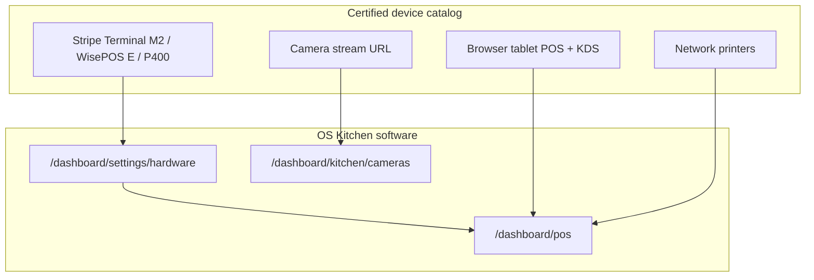

# Hardware Partnership Program — OS Kitchen

**Policy:** `hardware-partnership-program-v1`  
**Date:** 2026-06-02  
**Owner:** Founder + Product + Partnerships + Finance  
**Scope:** Certified device catalog, **partner pricing**, and co-sell rules for OEM / reseller / integrator hardware — not a proprietary terminal fleet  
**Status:** **Program design + reference catalog** — **0 signed hardware partners · staging validation in progress · pilot NO-GO**

OS Kitchen is **software-first**: restaurants use their own tablets, browsers, optional Stripe Terminal readers, printers, and camera streams. This document is the **customer- and partner-facing program definition**: which devices we list as certified (or in validation), what **partner pricing** means, and how it differs from Toast/Square bundled hardware.

**Companion doc (internal ops):** [`hardware-partner-program.md`](./hardware-partner-program.md) — intake, L0/L1/L2 tiers, smoke checklist.

**Product evidence:** [`stripe-terminal-hardware.md`](./stripe-terminal-hardware.md) · [`POS_HARDWARE_READINESS.md`](./POS_HARDWARE_READINESS.md) · [`no-hardware-lock-in-positioning.md`](./no-hardware-lock-in-positioning.md)

**Honesty rule:** A device is **not** “OS Kitchen Certified” until L1 staging smoke passes and legal one-pager is signed. Until then use **“Compatible”** or **“In validation.”** Do **not** sell bundled proprietary terminals.

---

## Executive summary

| Dimension | June 2026 |
|-----------|-----------|
| **Certified devices (L1+)** | **0** — reference catalog below is **target list** |
| **Compatible (L0) self-declared** | Stripe Terminal models, browser tablets, network printers, RTSP cameras |
| **Partner pricing** | Documented **restaurant bundle discounts** + **referral fees** — **not active until first signed partner** |
| **OS Kitchen sells hardware?** | **No** — partners or operators purchase devices; we sell software |
| **Stripe Terminal in product** | **BETA** — `/dashboard/settings/hardware` + POS card-terminal mode |

**Safe headline:** “Works with common restaurant hardware — certified list and partner pricing as partnerships close.”

**Forbidden:** “Included terminal,” “Toast Go equivalent,” “All readers certified,” “Free hardware with annual contract.”

---

## Certified device catalog (reference)

Devices move from **Compatible (L0)** → **Validated (L1)** → **Premier (L2)** per [`hardware-partner-program.md`](./hardware-partner-program.md). The table below is the **2026 target catalog** aligned with shipped software paths.

| Device / category | Example SKUs | OS Kitchen surface | Validation tier (today) | Notes |
|-------------------|--------------|-------------------|-------------------------|-------|
| **Stripe Reader M2** | `stripe_m2` | Settings → Payment hardware, POS terminal | **L0 — in validation** | Bluetooth mobile; see [`stripe-terminal-hardware.md`](./stripe-terminal-hardware.md) |
| **BBPOS WisePOS E** | `bbpos_wisepos_e` | Settings → Payment hardware, POS | **L0 — in validation** | Counter Wi‑Fi / Ethernet |
| **Verifone P400** | `verifone_p400` | Settings → Payment hardware, POS | **L0 — in validation** | Fixed lane Ethernet |
| **Tablet / iPad (browser)** | Customer-owned | `/dashboard/pos`, KDS web | **L0 — compatible** | Chromium/Safari; 390px+ layouts tested |
| **Kitchen display (browser)** | Customer-owned display | KDS / expo web | **L0 — compatible** | Station routing from order spine |
| **Network receipt printer** | Epson/Star (network) | Receipt generation + browser print | **L0 — best effort** | No universal USB driver — document limits |
| **IP camera / NVR** | RTSP/HTTPS stream URL | Kitchen Camera | **L0 — compatible** | Synthetic preview when no stream — honest banner |
| **Barcode wedge / WebUSB** | Handheld scanners | Packing / receiving | **L0 — per integration** | Keyboard wedge preferred for pilot |

**Artifact when L1 completes:** `artifacts/hardware-validation-{vendor}-{sku}.json` (internal).

---

## Partner pricing model

Partners are **OEMs, resellers, or integrators** — not OS Kitchen subscription resellers. Pricing has three layers:

### 1. Restaurant bundle pricing (co-sell)

When a **signed L1+ partner** sells hardware to an OS Kitchen customer, the restaurant may receive:

| Benefit | Typical range | Who funds | Active today |
|---------|---------------|-----------|--------------|
| **Reader discount** | 5–15% off list via partner promo code | Partner margin | **No** — template only |
| **Tablet/kiosk bundle** | $50–150 off rugged tablet SKUs | Partner + optional OS Kitchen marketing credit | **No** |
| **Installation credit** | 1–2 hours remote setup (partner labor) | Partner | **No** |
| **OS Kitchen software** | Standard plan pricing — **no hardware subsidy** | Restaurant | Yes (plans as listed) |

**Rule:** OS Kitchen does **not** discount SaaS to subsidize hardware in 2026. Any bundle is **partner-funded** or **co-marketing budget** — Finance sign-off required.

### 2. Partner referral economics (B2B)

| Partner tier | Referral trigger | OS Kitchen pays partner | Restaurant gets |
|--------------|------------------|-------------------------|-----------------|
| **Registered** | Intro call only | None | Standard trial |
| **Validated (L1)** | Pilot workspace + 30d active | **$250** one-time *after first paid month* (cap 10/qtr) | +1 month Pro credit *optional* |
| **Premier (L2)** | 2+ operator references | **$500** + joint webinar slot | Custom onboarding block |

*Amounts are **policy targets** — not accruing until first signed partner agreement.*

**We do not offer:** Revenue share on MRR, exclusive territories, or hardware resale margin on OS Kitchen invoices.

### 3. Partner wholesale (hardware only)

For partners who stock readers/tablets:

| SKU class | Suggested partner wholesale discount off MSRP | OS Kitchen role |
|-----------|-----------------------------------------------|-----------------|
| Stripe Terminal readers | Per Stripe distributor agreement | Enable Terminal in software only |
| Rugged Android tablet | 8–12% vs street (partner negotiates OEM) | Compatibility validation |
| IP camera (kitchen) | Partner standard disti margin | Stream URL + honest CV positioning |

OS Kitchen **never** takes title to inventory. Drop-ship or partner invoice only.

---

## Certification levels (summary)

| Level | Customer-facing label | Requirements |
|:-----:|----------------------|--------------|
| **L0** | Compatible | Spec sheet + minimum OS/browser; internal wiki |
| **L1** | **OS Kitchen Validated** | Staging smoke checklist passed + signed one-pager |
| **L2** | **Premier Partner** | L1 + 2 operator references + support SLA |

Full criteria: [`hardware-partner-program.md`](./hardware-partner-program.md#partner-tiers).

---

## Partner onboarding (abbreviated)

| Phase | Timeline | Deliverable |
|-------|----------|-------------|
| **Intake** | Week 0 | SKU list, connectivity, ICP, proposed pricing |
| **Staging smoke** | Week 1–2 | L1 checklist on reference device |
| **Legal** | Week 2–3 | Compatibility one-pager, logo use, pricing exhibit |
| **Launch** | Week 4+ | Listing on `/integrations` (BETA) + partner pricing sheet |

**Gate:** Public “Validated” badge only after **1 design partner LOI** on validated device — [`loi-design-partner-template.md`](./loi-design-partner-template.md).

---

## Sales guardrails

| Question | Approved answer |
|----------|-----------------|
| “Is the M2 certified?” | “In validation on staging — works with our Stripe Terminal path; full L1 badge after smoke sign-off.” |
| “Do you bundle hardware?” | “No — software-first. Partners may offer bundles; see Hardware Partnership Program when live.” |
| “Partner pricing?” | “Documented for signed partners — ask Partnerships for current exhibit.” |
| vs Toast/Square | [`toast-gap-analysis.md`](./toast-gap-analysis.md) — disqualify if proprietary terminal non-negotiable |

Run claims through [`sales-safe-claims-registry.md`](./sales-safe-claims-registry.md).

---

## Roadmap

| Quarter | Milestone |
|---------|-----------|
| **Q3 2026** | First L1 on Stripe WisePOS E + 1 tablet OEM |
| **Q4 2026** | Public compatibility page; partner pricing exhibit v1 |
| **2027** | L2 premier partner; optional `/hardware` marketing section |

**Baseline:** [`pilot-gono-go-summary.json`](../artifacts/pilot-gono-go-summary.json) — **NO-GO** — no hardware KPIs in decks until GO.

---

## Related documents

| Doc | Use |
|-----|-----|
| [`hardware-partner-program.md`](./hardware-partner-program.md) | Internal tiers, smoke tests, disqualifiers |
| [`stripe-terminal-hardware.md`](./stripe-terminal-hardware.md) | M2 / WisePOS E / P400 setup |
| [`support-tier-plan.md`](./support-tier-plan.md) | Support SLAs for partner escalations |
| [`enterprise-mvp-spec.md`](./enterprise-mvp-spec.md) | Enterprise hardware claims limits |
| [`sales-limitation-sheet.md`](./sales-limitation-sheet.md) | Prospect-facing limits |

---

## Revision history

| Version | Date | Change |
|---------|------|--------|
| `hardware-partnership-program-v1` | 2026-06-02 | Initial program — Market Domination feature 29 |

**Next action:** Sign first L1 partner · publish pricing exhibit · complete WisePOS E staging smoke JSON.
