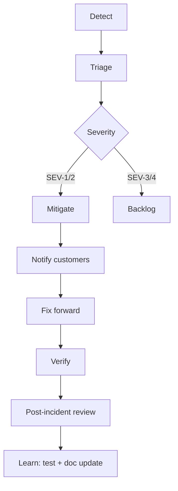

# Incident response process

**Policy:** `incident-response-process-v1`  
**Updated:** 2026-06-02  
**Owner:** Founder (on-call) · CS (customer comms)  
**Tactical playbooks:** [`INCIDENT_RESPONSE_RUNBOOK.md`](./INCIDENT_RESPONSE_RUNBOOK.md) · [`docs/runbooks/`](./runbooks/)  
**Parent:** [`bus-factor-mitigation.md`](./bus-factor-mitigation.md) · [`pilot-acceptance-criteria.md`](./pilot-acceptance-criteria.md)

This document defines the **end-to-end incident process** — how OS Kitchen detects, classifies, escalates, communicates, resolves, and learns from production issues. The runbook covers *what to run*; this doc covers *who does what, when, and how customers hear about it*.

**Honesty rule:** Business-hours best-effort until hire #2 — do not contract 24/7 SLA without [`support-tier-plan.md`](./support-tier-plan.md) (Task 114).

---

## Scope

| In scope | Out of scope |
|----------|--------------|
| Production + staging incidents affecting pilots | Local dev environment bugs |
| Tenant data, auth, payments, webhooks, crons | Feature requests disguised as incidents |
| Integration ingest outages (BETA/LIVE) | Partner-side-only outages (document + redirect) |
| Security reports (IDOR, webhook abuse) | Pen-test findings in non-prod without exploit path |

---

## Severity definitions

| Level | Definition | Examples | Ack target | Mitigate target |
|-------|------------|----------|:------------:|:---------------:|
| **SEV-1** | Active harm, data breach risk, or total prod outage | Cross-tenant data visible · prod 5xx sustained · payment double-charge | **15 min** (business hrs) · 2h off-hours best effort | **4h** workaround or rollback |
| **SEV-2** | Major feature broken for pilot tenant(s) | Cron stopped · webhook ingest failing · invites broken · checkout blocked | **1h** | **24h** fix or documented workaround |
| **SEV-3** | Degraded UX, non-critical integration | Slow list · UI bug · single BETA integration flake | Next business day | Next release train |
| **SEV-4** | Cosmetic / internal-only | Copy error · non-customer-facing report | Backlog | Backlog |

**Upgrade triggers:** Any doubt about tenant data → treat as **SEV-1** until ruled out.

---

## Roles & RACI

| Activity | On-call engineer | Founder | CS | Customer | Security |
|----------|:----------------:|:-------:|:--:|:--------:|:--------:|
| Triage + severity | **R/A** | C | I | — | C |
| Mitigation / rollback | **R** | A | I | — | C |
| Customer status update | C | A | **R** | I | — |
| Legal / breach notification | I | **A** | R | I | **R** |
| Post-incident review | **R** | A | C | — | C |
| Regression test / smoke add | **R** | C | — | — | — |

R = responsible · A = accountable · C = consulted · I = informed

**June 2026 reality:** On-call engineer = founder. CS = founder until hire. Document in [`bus-factor-mitigation.md`](./bus-factor-mitigation.md).

---

## Incident lifecycle



### Phase 1 — Detect

| Source | What to watch |
|--------|---------------|
| Sentry | Errors, `ops_signal` tags — [`sentry-setup.md`](./sentry-setup.md) |
| `/api/health` | DB, Supabase, Sentry sub-checks |
| Vercel logs | 5xx spikes, cron failures |
| Integration Health | Invalid webhook signature count |
| Customer report | Support ticket tagged `critical` / `security` |
| CI / smoke failure post-deploy | Release regression |

**Declare incident when:** SEV-1/2 criteria met OR two independent signals agree (e.g. Sentry + customer report).

### Phase 2 — Triage (≤15 min for SEV-1)

1. Assign **incident commander** (default: on-call engineer).
2. Set severity (table above); open internal timeline (doc or `/platform/incidents` if used).
3. Identify blast radius: one tenant vs all · one route vs platform.
4. Link tactical playbook from [`INCIDENT_RESPONSE_RUNBOOK.md`](./INCIDENT_RESPONSE_RUNBOOK.md) or [`docs/runbooks/`](./runbooks/).

**Do not** spend >30 min on root cause before mitigation for SEV-1.

### Phase 3 — Mitigate

Priority order:

| # | Action | When |
|---|--------|------|
| 1 | **Vercel rollback** to last known good deploy | Prod widespread 5xx or bad release |
| 2 | **Disable route** / feature flag | Isolated toxic endpoint |
| 3 | **Revert registry label** (integration LIVE → BETA) | Post-promotion error rate >1% | 
| 4 | **Pause cron** or webhook processing | Runaway failures — see webhook runbook |
| 5 | **Block tenant** (superadmin) | Active abuse or confirmed IDOR exploit |

Commands reference:

```bash
curl -sf "$PROD_URL/api/health" | jq .
npx prisma migrate status
npm run smoke:team-invites -- --owner-email=OWNER
```

Runbooks: [`WEBHOOK_FAILURE_RUNBOOK.md`](./runbooks/WEBHOOK_FAILURE_RUNBOOK.md) · [`CRON_FAILURE_RUNBOOK.md`](./runbooks/CRON_FAILURE_RUNBOOK.md) · [`DATABASE_MIGRATION_RUNBOOK.md`](./runbooks/DATABASE_MIGRATION_RUNBOOK.md)

### Phase 4 — Communicate

| Audience | SEV-1 | SEV-2 | SEV-3 |
|----------|-------|-------|-------|
| Affected pilot customer | Within **1h** of acknowledge | Within **4h** | Next sync |
| All pilots (if platform-wide) | Email + status note | Email if >4h outage | Changelog if user-visible |
| Internal | Slack/async thread immediately | Same day summary | Weekly digest |
| Public `/trust/status` | Major outage only — non-contractual | Optional | No |

**Customer template (SEV-1/2):**

> We identified an issue affecting [scope] on OS Kitchen starting at [UTC time]. We have [mitigated / rolled back / applied workaround]. Your data [is / is not] impacted per our initial assessment. Next update by [time]. Reference: INC-[YYYYMMDD]-[seq].

**Forbidden:** Claim “fully resolved” before verify phase PASS · blame partners without evidence · share other tenants’ data.

CS escalation: [`runbooks/SUPPORT_ESCALATION_RUNBOOK.md`](./runbooks/SUPPORT_ESCALATION_RUNBOOK.md)

### Phase 5 — Fix forward

After mitigation stabilizes:

1. Root cause on branch; **no** destructive SQL ([`migration-deployment-process.md`](./migration-deployment-process.md)).
2. Add regression test or extend smoke ([`release-notes-process.md`](./release-notes-process.md) hotfix path).
3. Deploy via staging → prod with on-call watching 24h for integration promotions.
4. Update `IDOR_MUTATION_INVENTORY.md` if tenancy-related.

### Phase 6 — Verify

| Check | PASS when |
|-------|-----------|
| Health | `/api/health` 200; affected sub-checks green |
| Customer path | Operator confirms golden path step that failed now works |
| Smokes | Targeted smoke PASS (team invites, webhook, checkout as applicable) |
| Error rate | Below 1% for integration incidents (LIVE DoD alignment) |
| No recurrence | 24h clean window for SEV-1 |

### Phase 7 — Post-incident review (within 5 business days)

Required for **SEV-1** and **SEV-2**; optional for SEV-3.

| Section | Content |
|---------|---------|
| Summary | One paragraph — customer impact |
| Timeline | UTC timestamps: detect → mitigate → fix → verify |
| Root cause | Technical + process gap |
| What went well | |
| Action items | Owner + due date (test, doc, vault, hire) |
| External comms | Final customer message sent? |

Store internally; link from release note **Security** section if customer-visible.

---

## Escalation matrix

| Condition | Escalate to | Action |
|-----------|-------------|--------|
| Cross-tenant data suspected | Founder + legal counsel | SEV-1; preserve logs; pause feature |
| Payment / Stripe anomaly | Founder + finance review | SEV-1; Stripe dashboard + webhook log |
| Mitigation not working in 2h (SEV-1) | Advisor with Vercel access | Rollback decision |
| Partner webhook abuse spike | Security review | Rate limits; rotate secrets |
| Customer threatens churn mid-pilot | Founder + CS | [`pilot-acceptance-criteria.md`](./pilot-acceptance-criteria.md) Gate B |
| Integration LIVE promotion regression | Integration owner | Revert to BETA per LIVE DoD |

Task 102 will expand integration-specific escalation: [`integration-escalation-matrix.md`](./integration-escalation-matrix.md).

---

## Incident types → playbook map

| Type | Severity default | Primary playbook |
|------|------------------|------------------|
| Tenant data / IDOR | SEV-1 | INCIDENT_RESPONSE § Tenant data |
| Production down | SEV-1 | Vercel rollback + health |
| Payment corruption | SEV-1 | Stripe webhook runbook + support |
| Cron failure | SEV-2 | [`CRON_FAILURE_RUNBOOK.md`](./runbooks/CRON_FAILURE_RUNBOOK.md) |
| Webhook signature spike | SEV-2 | [`WEBHOOK_FAILURE_RUNBOOK.md`](./runbooks/WEBHOOK_FAILURE_RUNBOOK.md) |
| Woo/Shopify ingest | SEV-2 | [`WOOCOMMERCE_WEBHOOK_RUNBOOK.md`](./runbooks/WOOCOMMERCE_WEBHOOK_RUNBOOK.md) / Shopify |
| Storefront outage | SEV-2 | [`STOREFRONT_OUTAGE_RUNBOOK.md`](./runbooks/STOREFRONT_OUTAGE_RUNBOOK.md) |
| Migration failed | SEV-2 | [`DATABASE_MIGRATION_RUNBOOK.md`](./runbooks/DATABASE_MIGRATION_RUNBOOK.md) |
| Email delivery | SEV-3 | [`EMAIL_FAILURE_RUNBOOK.md`](./runbooks/EMAIL_FAILURE_RUNBOOK.md) |
| POS checkout | SEV-2 | [`POS_CHECKOUT_ISSUE_RUNBOOK.md`](./runbooks/POS_CHECKOUT_ISSUE_RUNBOOK.md) |
| Import failure | SEV-3 | [`IMPORT_FAILURE_RUNBOOK.md`](./runbooks/IMPORT_FAILURE_RUNBOOK.md) |

Full index: [`STATUS_PAGE_AND_RUNBOOKS.md`](./STATUS_PAGE_AND_RUNBOOKS.md) · `/platform/runbooks`

---

## SLAs (pilot default)

From [`INCIDENT_RESPONSE_RUNBOOK.md`](./INCIDENT_RESPONSE_RUNBOOK.md) — **not** 24/7 unless contracted.

| Item | Pilot SLA |
|------|-----------|
| SEV-1 acknowledge | 15 min business hours · 2h off-hours best effort |
| SEV-1 mitigate or rollback | 4h |
| SEV-2 acknowledge | 1h |
| SEV-2 fix or workaround | 1 business day |
| Security IDOR report assessment | 48h |
| Confirmed P0 IDOR fix | 7 days |
| Post-incident review | 5 business days after close |

Gate B pilot acceptance: open SEV-1 >24h without mitigation = **REJECT pause** ([`pilot-acceptance-criteria.md`](./pilot-acceptance-criteria.md)).

---

## Tools & surfaces

| Tool | Use in incident |
|------|-----------------|
| Sentry | Stack traces, `ops_signal`, release correlation |
| `/api/health` | Automated sub-checks |
| `/trust/status` | Public non-contractual snapshot |
| `/platform/incidents` | Structured incident log (when used) |
| Integration Health dashboard | Webhook + connection status |
| `platform_audit` / DSR export | Tenancy investigation |
| Vercel | Rollback, logs, cron history |

Observability setup: [`observability-setup.md`](./observability-setup.md)

---

## Integration with other processes

| Process | Trigger |
|---------|---------|
| **LIVE DoD rollback** | Error rate >1% for 24h post-promotion → open SEV-2, revert BETA |
| **Release notes** | Customer-visible fix → hotfix note within 24h |
| **Pilot GO/NO-GO** | Repeated SEV-2 without remediation → Gate B CONDITIONAL/REJECT |
| **Forbidden claims** | Outage ≠ excuse for overstating recovery in marketing |
| **Bug triage** | SEV-3/4 → Task 104 backlog when published |

---

## Post-incident action item template

| ID | Action | Owner | Due | Done |
|----|--------|-------|-----|:----:|
| 1 | Add regression test: `tests/...` | Eng | | ☐ |
| 2 | Extend smoke: `npm run smoke:...` | Eng | | ☐ |
| 3 | Update runbook section | Eng | | ☐ |
| 4 | Vault / config fix documented | Ops | | ☐ |
| 5 | Customer final comms sent | CS | | ☐ |

---

## Drill cadence

| Drill | Frequency | Evidence |
|-------|-----------|----------|
| Rollback tabletop | Quarterly | `pilot_rollback_drill` in GO/NO-GO artifact |
| Webhook failure sim | Before each LIVE promotion | Staging runbook walkthrough |
| SEV-1 comms dry-run | Annually or pre-first pilot | CS template review |

Latest: rollback drill **PASS** — [`artifacts/pilot-gono-go-summary.json`](../artifacts/pilot-gono-go-summary.json)

---

## Related docs & tasks

| Resource | Topic |
|----------|-------|
| [`INCIDENT_RESPONSE_RUNBOOK.md`](./INCIDENT_RESPONSE_RUNBOOK.md) | Tactical steps |
| [`bus-factor-mitigation.md`](./bus-factor-mitigation.md) | On-call backup plan |
| [`pilot-acceptance-criteria.md`](./pilot-acceptance-criteria.md) | SEV-1 gates |
| [`live-integration-definition-of-done.md`](./live-integration-definition-of-done.md) | Promotion rollback |
| [`release-notes-process.md`](./release-notes-process.md) | Hotfix comms |
| Task 104 | `bug-triage-process.md` |
| Task 102 | `integration-escalation-matrix.md` |
| Task 112 | `ai-crisis-communication-template.md` |

---

## Next actions

1. Configure `SENTRY_DSN` on production — close detect gap ([`sentry-setup.md`](./sentry-setup.md)).
2. Add second Vercel admin for rollback when advisor available ([`bus-factor-mitigation.md`](./bus-factor-mitigation.md)).
3. Run next incident tabletop before first paid pilot production traffic.
