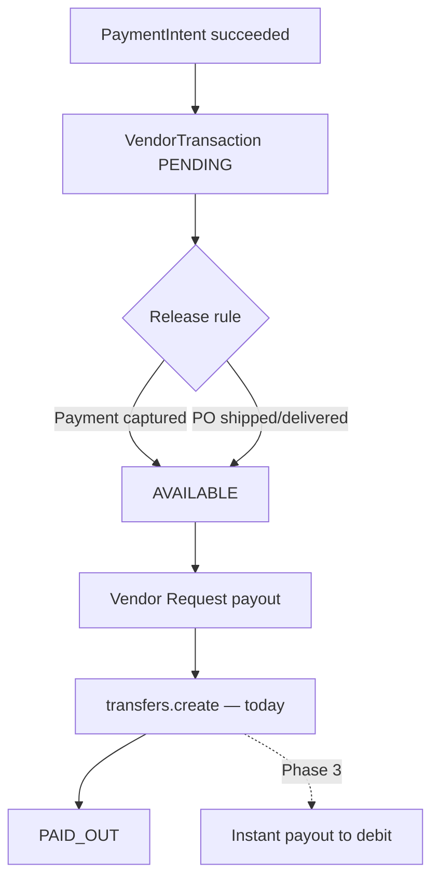

# Instant payouts plan — marketplace vendors

**Policy:** `instant-payouts-plan-v1`  
**Date:** 2026-06-02  
**Owner:** Product + Finance + Engineering  
**Scope:** Faster vendor liquidity after marketplace checkout — **Stripe Connect Express** path only  
**Status:** **Roadmap** — **standard manual payout shipped · instant payouts not implemented · 0 live GMV · pilot NO-GO**

This document defines how OS Kitchen will offer **instant vendor payouts** (minutes to debit card) versus today's **manual transfer + Stripe default bank schedule**, including fees, eligibility, fraud controls, and sales guardrails.

**Honesty rule:** Do **not** claim “instant payouts” or “same-day vendor cash” until Phase 3 staging proof passes. Today vendors use **`requestVendorPayoutAction`** → **`processPayout`** → Stripe **`transfers.create`** — not Stripe Instant Payouts API.

**Related:** [`stripe-connect-vendor-test-plan.md`](./stripe-connect-vendor-test-plan.md) · [`marketplace-pricing-strategy.md`](./marketplace-pricing-strategy.md) · [`vendor-seeding-execution.md`](./vendor-seeding-execution.md) · [`integration-escalation-matrix.md`](./integration-escalation-matrix.md) · [`sales-limitation-sheet.md`](./sales-limitation-sheet.md)

---

## Executive summary

| Dimension | Today (June 2026) |
|-----------|-------------------|
| **Connect path** | Env-gated — `MARKETPLACE_VENDOR_STRIPE_CONNECT=1` |
| **Funds flow** | Buyer PI → `application_fee` + destination transfer on charge |
| **Vendor balance states** | `PENDING` → `AVAILABLE` → `PAID_OUT` — `VendorTransaction` |
| **Release trigger** | Payment success **or** PO `SHIPPED`/`DELIVERED`/`COMPLETED` |
| **Payout initiation** | Vendor clicks **Request payout** — manual |
| **Stripe action** | `stripe.transfers.create` to connected account — `processPayout` |
| **Instant to debit card** | **Not built** — Stripe default Express bank payout schedule applies |
| **Live payout proof** | L4 in Connect test plan — **not PASS on staging** |

**Safe headline:** “Vendors receive payouts through Stripe Connect after orders complete — instant debit-card payouts planned as a Growth+ add-on.”

**Forbidden:** “Instant payouts live,” “Get paid in minutes today,” “Guaranteed same-day cash,” “Zero payout fees.”

---

## Payout models compared

| Model | Speed | OS Kitchen status | Stripe mechanism |
|-------|-------|-------------------|------------------|
| **A — Platform transfer (current)** | Manual request; funds hit Connect balance | **Shipped** — `processPayout` | `transfers.create` |
| **B — Standard Connect payout** | 2 business days (US default) | **Inherited from Stripe** — not OS Kitchen UI | Express automatic payout schedule |
| **C — Instant payout to debit** | ~30 minutes (Stripe) | **Roadmap Phase 3** | `stripe.payouts.create` with `method: instant` on connected account |
| **D — Platform float / early pay** | Same day (platform-funded) | **Out of scope 2026** — balance sheet risk | Not planned |

---

## What ships today (Model A)

| Step | Code / surface | Notes |
|------|----------------|-------|
| Checkout commission | `createPaymentIntent` — `stripe-connect-service.ts` | `application_fee_amount` |
| Release on pay | `releaseFunds` → `AVAILABLE` | Webhook `payment_intent.succeeded` |
| Release on fulfillment | `syncAvailableVendorTransactions` — `vendor-finance-service.ts` | PO status gate |
| Finance UI | `/vendor/finance` | Balance + payout history |
| Request payout | `requestVendorPayoutAction` → `processPayout` | Aggregates all `AVAILABLE` rows |
| Transfer | `stripe.transfers.create` | Requires `stripeAccountId` + flag on |
| Status update | `PAID_OUT` + `payoutId` | Logged; webhook `payout.paid` info-only today |

**Gap vs instant:** No `method: instant`, no debit-card eligibility check, no instant fee line item, no per-payout velocity limits.

Operator proof path: [`stripe-connect-vendor-test-plan.md`](./stripe-connect-vendor-test-plan.md) L4.

---

## Maturity phases

| Phase | Name | Deliverable | Target | Sales |
|:-----:|------|-------------|--------|-------|
| **1** | **Standard Connect proof** | L4 payout smoke PASS on staging | H2 2026 | “Stripe Connect payouts in test scope” |
| **2** | **Payout policy UX** | Clear copy: manual request + Stripe bank schedule | H2 2026 | No “instant” word |
| **3** | **Instant payout MVP** | Instant eligible on Growth+; fee disclosed | Q1 2027 | “Instant available — fee applies” |
| **4** | **Instant at scale** | Velocity limits, fraud review, 1099 alignment | Q2 2027+ | Enterprise vendor tier |

---

## Phase 3 — Instant payout MVP (design)

### Eligibility

| Rule | Rationale |
|------|-----------|
| Vendor tier **GROWTH+** only | Instant is paid feature — see fee table below |
| Connect status **`ready`** | `payouts_enabled` + `details_submitted` |
| Minimum **$10** available balance | Stripe instant minimums |
| Account age **≥ 30 days** OR **≥ $1k** historical GMV | Fraud mitigation |
| No open disputes | `platform-dispute-resolution-service` hold |
| US connected accounts only (v1) | Stripe instant geography limits |

### Fee structure (proposed — Finance sign-off required)

| Tier | Standard payout | Instant payout fee |
|------|-----------------|-------------------|
| **FREE** | Included (manual + Stripe schedule) | **Not available** |
| **GROWTH** | Included | **1.5%** of payout amount (min $0.50) — passed to vendor |
| **ENTERPRISE** | Included | **1.0%** (min $0.50) — or 5 instant/month included (TBD) |

Platform retains instant fee as **marketplace services revenue** — separate from GMV commission in [`marketplace-pricing-strategy.md`](./marketplace-pricing-strategy.md).

**Do not publish fees** until Phase 3 ships and legal reviews vendor terms.

### Engineering tasks (Phase 3)

| # | Task | Owner |
|---|------|-------|
| 3.1 | `/vendor/finance/instant-payouts` — instant eligibility + fee quote | Product — **MVP UI shipped** |
| 3.2 | `requestInstantPayoutAction` — validate eligibility server-side | Eng — `services/marketplace/instant-payouts-service.ts` |
| 3.3 | Call Stripe instant payout on connected account (or platform-initiated pattern per Stripe docs) | Eng |
| 3.4 | Ledger: `VendorTransaction` sub-row or `payoutMethod: instant` + fee column | Eng |
| 3.5 | Webhook handler upgrade — `payout.paid` / `payout.failed` → update UI + CS alert | Eng |
| 3.6 | Rate limit — max **3 instant/day/vendor** | Eng |
| 3.7 | Unit + staging smoke — extend Connect test plan L4b | QA |
| 3.8 | Vendor agreement addendum | Legal |

### Stripe references

- Connect Express [Instant Payouts](https://stripe.com/docs/connect/instant-payouts) — eligibility on connected account
- Platform must **not** commingle funds without Treasury / compliance review
- Test mode: use Stripe test instant payout simulation before production

---

## Risk & fraud controls

| Risk | Control |
|------|---------|
| Vendor churn after instant pull | Hold period option — keep 24h on first instant |
| Stolen Connect account | MFA on vendor cabinet; alert on new bank/debit |
| Buyer chargebacks after instant | Delay instant until PO `DELIVERED` + 48h for FREE tier path |
| Platform liquidity | **No platform-funded early pay** in 2026 — Stripe instant only |
| Fee disputes | Itemized payout receipt in finance UI |
| Velocity abuse | Daily cap + manual review flag > $5k instant |

Escalation: [`integration-escalation-matrix.md`](./integration-escalation-matrix.md) — Stripe Connect row.

---

## Vendor-facing copy (approved when Phase 3 live)

**Standard (today / Phase 2):**

> “Available balance pays out when you click **Request payout**. Funds move to your Stripe Express account; bank deposits follow Stripe’s schedule (typically 2 business days in the US).”

**Instant (Phase 3+ only):**

> “**Instant payout** sends funds to your linked debit card in about 30 minutes. A {fee}% fee applies. Available on Growth and Enterprise plans.”

**Never:**

> “Money hits your account instantly on every order.”

---

## Sales & marketing guardrails

| Audience | Allowed | Forbidden |
|----------|---------|-----------|
| `/vendor` landing | “Stripe Connect payouts when enabled in staging” | “Instant payouts included” |
| Pricing FAQ | Standard Connect path; instant **planned** | Specific instant fee before Phase 3 |
| vs Faire / distributors | “Software marketplace — you control payout timing via Stripe” | “Faster than Sysco terms” without proof |
| Enterprise RFP | Reference Phase 3 roadmap with dates TBD | Contractual instant SLA day-one |

Enforced: [`sales-safe-claims-registry.md`](./sales-safe-claims-registry.md) · forbidden claims CI.

---

## Metrics (post-launch)

| Metric | Phase 1 target | Phase 3 target |
|--------|----------------|----------------|
| Payout success rate (standard) | > 99% | > 99% |
| Median time REQUEST → `PAID_OUT` | < 5 min | < 2 min |
| Instant adoption (% of payouts) | — | 20–40% Growth+ vendors |
| Instant fee revenue / GMV | — | Track separately |
| Dispute rate post-instant | — | < 0.5% of instant volume |

**June 2026:** No production payouts — **SKIPPED**. Baseline: [`pilot-gono-go-summary.json`](../artifacts/pilot-gono-go-summary.json) **NO-GO**.

---

## Dependencies

| Dependency | Blocker for |
|------------|-------------|
| [`stripe-connect-vendor-test-plan.md`](./stripe-connect-vendor-test-plan.md) L4 PASS | Phase 1 |
| Seeded vendors + first buyer PO | Real instant pilot |
| [`vendor-seeding-execution.md`](./vendor-seeding-execution.md) D2–D3 | Connect onboarding |
| Finance instant fee approval | Phase 3 pricing |
| Vendor terms update | Phase 3 legal |

---

## Related documents

| Doc | Use |
|-----|-----|
| [`stripe-connect-vendor-test-plan.md`](./stripe-connect-vendor-test-plan.md) | L4 standard payout; L4b instant (future) |
| [`marketplace-pricing-strategy.md`](./marketplace-pricing-strategy.md) | Commission + vendor SaaS tiers |
| [`support-tier-plan.md`](./support-tier-plan.md) | Vendor payout escalation |
| [`sales-limitation-sheet.md`](./sales-limitation-sheet.md) | Marketplace BETA caveat |

---

## Revision history

| Version | Date | Change |
|---------|------|--------|
| `instant-payouts-plan-v1` | 2026-06-02 | Initial plan — Task 116 |

**Next action:** Complete Connect L4 on staging · ship Phase 2 payout policy copy on `/vendor/finance` · defer instant marketing until Phase 3 checklist.
