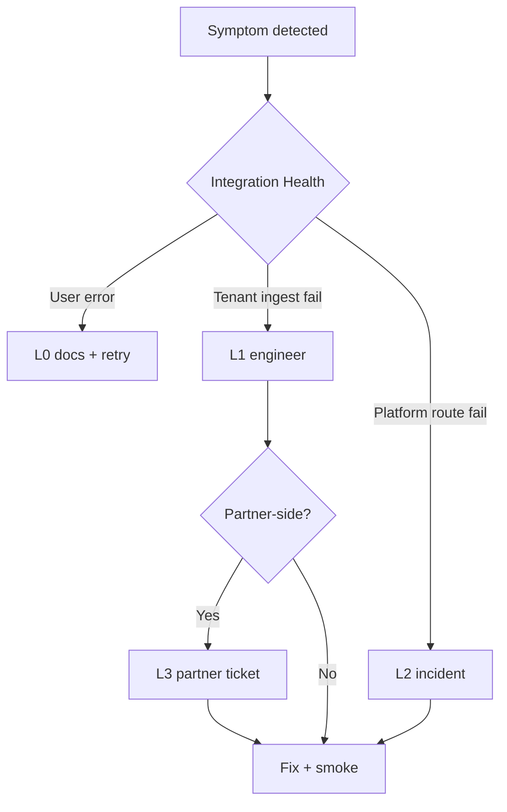

# Integration escalation matrix — OS Kitchen

**Policy:** `integration-escalation-matrix-v1`  
**Date:** 2026-06-02  
**Owner:** Integration engineering + CS + Founder  
**Scope:** Third-party and channel integrations — **0 LIVE partner integrations** as of June 2026  
**Parent:** [`incident-response-process.md`](./incident-response-process.md) · [`live-integration-definition-of-done.md`](./live-integration-definition-of-done.md) · [`beta-to-live-roadmap.md`](./beta-to-live-roadmap.md)

This matrix defines **who escalates what, when, and to whom** for integration failures — separate from platform-wide incidents. Use it when Integration Health degrades, webhooks fail, or a pilot tenant cannot connect a partner.

**Hard rule:** BETA integrations **never** auto-escalate to “LIVE fixed” in customer comms — label BETA until G1–G4 PASS ([`live-integration-definition-of-done.md`](./live-integration-definition-of-done.md)).

**Registry source:** `lib/integrations/integration-registry.ts` · `lib/channels/channel-registry.ts`

---

## Escalation levels

| Level | Name | Owner | Ack target (business hrs) | When |
|:-----:|------|-------|:-------------------------:|------|
| **L0** | Self-serve | Customer ops + CS | — | Setup docs, credential typos, Integration Health refresh |
| **L1** | Integration on-call | Engineer (founder) | **1h** | Signature failures, ingest stopped, OAuth errors, tenant-scoped |
| **L2** | Platform incident | Founder + engineer | **15 min** if SEV-1/2 | Multi-tenant webhook route down, credential decrypt failure, cross-tenant risk |
| **L3** | Partner escalation | Founder → partner support | **1 business day** open ticket | Partner API outage, merchant program block, cert/sandbox limits |

**Severity mapping:** Integration L1 ≈ SEV-3 · L2 ≈ SEV-2 · data/cross-tenant ≈ SEV-1 ([`incident-response-process.md`](./incident-response-process.md)).



---

## Matrix — delivery marketplaces (BETA)

| Integration | Status | Common symptom | L0 action | L1 trigger | L3 partner |
|-------------|--------|----------------|-----------|------------|------------|
| **DoorDash** | BETA | Orders not appearing | Verify webhook URL + `cid` · check BETA badge | Signature fail · poll cron empty 2h · menu sync 5xx | DoorDash developer / merchant support — merchant program required |
| **Grubhub** | BETA | Webhook 401/403 | Re-copy webhook secret · connection page | Ingest idempotency errors · sustained 5xx | Grubhub partner support (credentials via program) |
| **Uber Eats** | BETA | Store disconnected | OAuth reconnect · env vars checklist | Webhook secret mismatch · order normalize fail | Uber Eats API support portal |
| **Uber Direct** | PLACEHOLDER | Customer expects dispatch | **Do not enable prod** — cite PLACEHOLDER | N/A — redirect to roadmap | N/A until [`uber-direct-implementation-plan.md`](./uber-direct-implementation-plan.md) |

**Runbooks:** [`WEBHOOK_FAILURE_RUNBOOK.md`](./runbooks/WEBHOOK_FAILURE_RUNBOOK.md) · [`doordash-live-integration-plan.md`](./doordash-live-integration-plan.md)

**Customer wording:** “Delivery connector is **qualified beta** — we’re working with your partner credentials; not production-certified marketplace ops.”

---

## Matrix — commerce channels

| Integration | Status | Common symptom | L0 action | L1 trigger | L3 partner |
|-------------|--------|----------------|-----------|------------|------------|
| **WooCommerce** | NEEDS_CREDENTIALS / pilot | Sync stale | Re-save REST keys · webhook regenerate | Webhook signature fail · order import 0 >24h · G1 smoke SKIPPED | WooCommerce.com hosting / plugin conflict (customer site) |
| **Shopify** | NEEDS_CREDENTIALS / pilot | Markets sync drift | Re-auth OAuth · check app scopes | Webhook registry drift · B2B company import fail | Shopify Partner support + merchant admin |
| **Storefront (native)** | LIVE | Checkout fail | Stripe dashboard · product active | PaymentIntent fail · Connect misconfig | Stripe support (merchant account) |

**Runbooks:** [`WOOCOMMERCE_WEBHOOK_RUNBOOK.md`](./runbooks/WOOCOMMERCE_WEBHOOK_RUNBOOK.md) · [`SHOPIFY_WEBHOOK_RUNBOOK.md`](./runbooks/SHOPIFY_WEBHOOK_RUNBOOK.md) · [`STOREFRONT_OUTAGE_RUNBOOK.md`](./runbooks/STOREFRONT_OUTAGE_RUNBOOK.md)

**Promotion queue:** Woo #1 · Shopify parallel — [`beta-to-live-roadmap.md`](./beta-to-live-roadmap.md)

---

## Matrix — accounting & labor (BETA)

| Integration | Status | Common symptom | L0 action | L1 trigger | L3 partner |
|-------------|--------|----------------|-----------|------------|------------|
| **QuickBooks** | BETA | Export failed | Reconnect OAuth · date range | Token refresh loop · export 5xx | Intuit developer support |
| **Xero** | BETA | Sync not running | Re-auth · org selection | API rate limit sustained | Xero developer support |
| **7shifts** | BETA | Staff not syncing | API key rotate · mapping | Sync job fail 3x | 7shifts API support |
| **Homebase** | BETA | Schedule mismatch | Reconnect · timezone check | Webhook/poll errors | Homebase partner support |

**Customer wording:** “Accounting/labor connectors are **beta** — your accountant validates exported data.”

---

## Matrix — payments & identity

| Integration | Status | Common symptom | L0 action | L1 trigger | L3 partner |
|-------------|--------|----------------|-----------|------------|------------|
| **Stripe (platform)** | LIVE path | Webhook delay | Stripe dashboard events | `STRIPE_WEBHOOK_SECRET` mismatch · double charge suspicion → **SEV-1** | Stripe support (priority for payment incidents) |
| **Stripe Connect (marketplace)** | BETA env-gated | Vendor payout stuck | Connect Express dashboard | `application_fee` math wrong · transfer fail | Stripe Connect support |
| **SSO / IdP** | Pilot foundation | Login loop | Email/password fallback | SAML metadata error · staging smoke SKIPPED | Customer IdP admin (Okta/Azure AD) |

**Runbooks:** [`POS_CHECKOUT_ISSUE_RUNBOOK.md`](./runbooks/POS_CHECKOUT_ISSUE_RUNBOOK.md) · [`sso-idp-smoke-test-plan.md`](./sso-idp-smoke-test-plan.md)

---

## Symptom → escalation quick reference

| Symptom | Level | First responder | Max time before L2 |
|---------|:-----:|-----------------|:--------------------:|
| Invalid webhook signature (one tenant) | L1 | Integration engineer | 4h |
| All tenants same webhook route 5xx | L2 | Founder + incident commander | Immediate |
| OAuth token refresh fail (accounting) | L1 | Integration engineer | 8h |
| Partner status page outage | L3 | Founder opens partner ticket | 24h (document) |
| Customer told “LIVE” but registry BETA | L2 | CS + Founder (honesty incident) | Immediate |
| Uber Direct requested in production | L0 | Sales/CS — decline PLACEHOLDER | — |
| G1 smoke SKIPPED with vault gap | L1 | Ops + Eng — not customer fault | 48h internal |

---

## Internal escalation contacts (June 2026)

| Role | Contact | Scope |
|------|---------|-------|
| **Integration on-call (L1)** | Founder / engineering | All BETA ingest + OAuth |
| **Incident commander (L2)** | Founder | SEV-1/2 · multi-tenant |
| **CS comms** | Founder (until hire) | Pilot tenant updates |
| **Ops / vault** | Founder | Staging secrets · P0 smokes |
| **Legal** | External counsel (as needed) | Breach · contract |

**Bus factor:** Document backup contact in [`bus-factor-mitigation.md`](./bus-factor-mitigation.md) before scaling pilots.

---

## Partner escalation template (L3)

**Subject:** `[OS Kitchen] {Integration} — {Tenant slug} — {Symptom}`

```
Partner: {DoorDash / Shopify / …}
Environment: staging | production
Tenant: {workspace slug} (no PII in subject)
Symptom: {webhook 401 | OAuth | API 5xx}
Since: {UTC timestamp}
OS Kitchen request id / webhook event id: {id}
Customer impact: {orders not ingesting | export blocked}
Ask: {confirm partner-side outage | re-enable merchant | cert step}
BETA disclosure: OS Kitchen connector is beta — reference tenant pilot.
```

Attach: Integration Health screenshot · relevant Sentry link · webhook delivery log (redacted).

---

## CS customer update template (L1/L2)

**Subject:** OS Kitchen — update on {Integration} connection

> We’re investigating {symptom} affecting {scope}.  
> **Status:** {Investigating | Mitigated | Partner-side}.  
> **Impact:** {orders | exports | checkout}.  
> **Workaround:** {manual order entry | retry OAuth | use storefront only}.  
> **Honesty:** This integration is labeled **BETA** in Integration Health — not production-certified until our LIVE checklist completes.  
> Next update: {time} or when resolved.

---

## De-escalation & closure

| Step | Owner | Done when |
|------|-------|-----------|
| 1. Verify fix | Engineer | Integration Health green · sample event processed |
| 2. Run smoke | Engineer | Relevant smoke script PASS or documented SKIPPED reason |
| 3. Customer confirm | CS | Pilot operator acknowledges |
| 4. Post-incident note | Engineer | Link in support ticket · update runbook if new |
| 5. Registry review | PM | Do **not** promote BETA→LIVE from incident fix alone |

---

## Promotion vs escalation (do not confuse)

| Event | Action |
|-------|--------|
| Single tenant fixed after OAuth typo | L0/L1 close — stays BETA |
| G1–G4 PASS on reference tenant | LIVE promotion per [`beta-to-live-roadmap.md`](./beta-to-live-roadmap.md) |
| Partner cert obtained | Begin G2 — not automatic LIVE |
| Sales asks to remove BETA badge | **Deny** until DoD sign-off row |

---

## Verification checklist (quarterly)

- [ ] Every `INTEGRATION_REGISTRY` id has a matrix row
- [ ] WooCommerce + Shopify rows match channel-registry status
- [ ] Uber Direct marked PLACEHOLDER — no L3 partner column filled
- [ ] CS trained on BETA wording ([`customer-success-playbook.md`](./customer-success-playbook.md))
- [ ] Webhook matrix cross-ref [`artifacts/webhook-signature-matrix.md`](../artifacts/webhook-signature-matrix.md)
- [ ] After LIVE promotion — update row status + L3 partner account #

---

## Related documents

| Doc | Use |
|-----|-----|
| [`incident-response-process.md`](./incident-response-process.md) | Platform SEV-1/2 |
| [`runbooks/SUPPORT_ESCALATION_RUNBOOK.md`](./runbooks/SUPPORT_ESCALATION_RUNBOOK.md) | CS handoff |
| [`runbooks/WEBHOOK_FAILURE_RUNBOOK.md`](./runbooks/WEBHOOK_FAILURE_RUNBOOK.md) | Signature / replay |
| [`beta-to-live-roadmap.md`](./beta-to-live-roadmap.md) | Promotion order |
| [`doordash-live-integration-plan.md`](./doordash-live-integration-plan.md) | DoorDash G1–G4 |
| [`stripe-connect-vendor-test-plan.md`](./stripe-connect-vendor-test-plan.md) | Marketplace payouts |
| [`observability-setup.md`](./observability-setup.md) | Sentry + health |

---

*Generated as Task 102 — P2 PM. Next: [`enterprise-mvp-spec.md`](./enterprise-mvp-spec.md) (Task 103).*
