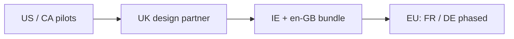
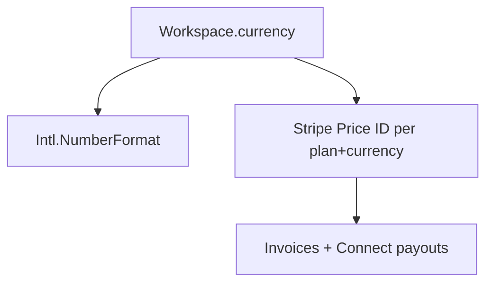

# International expansion plan — OS Kitchen

**Policy:** `international-expansion-plan-v1`  
**Date:** 2026-06-02  
**Owner:** Founder + Product + Engineering + Legal  
**Scope:** **UK-first** international go-to-market, **multi-currency** billing/display, **multi-language** product surfaces, and **GDPR** compliance — not full EU localization day-one  
**Status:** **Plan only** — **US/CA primary** · **GBP not default in product** · **dashboard i18n: en + fr partial** · **0 UK paying customers** · pilot NO-GO

This document defines how OS Kitchen expands beyond North America without over-claiming “global ready.” It sequences **United Kingdom** as the first international market, then EU adjacency, with honest gaps in currency, locale, tax, and data protection.

**Honesty rule:** Do **not** market “available in the UK/EU,” “GDPR compliant,” or “multi-currency enterprise” until the phase gates in § Roadmap are met and legal sign-off is on file.

**Related:** [`freemium-tier-plan.md`](./freemium-tier-plan.md) · [`soc2-readiness-assessment.md`](./soc2-readiness-assessment.md) · [`regional-tax-compliance.md`](./regional-tax-compliance.md) · [`sso-scim-live-plan.md`](./sso-scim-live-plan.md) · [`STOREFRONT_I18N_NAV_FOOTER_FOUNDATION.md`](./STOREFRONT_I18N_NAV_FOOTER_FOUNDATION.md) · `lib/i18n.ts` · `lib/onboarding/onboarding-locale-options.ts`

---

## Executive summary

| Dimension | Today (June 2026) | UK-first target |
|-----------|-------------------|-----------------|
| **Primary market** | US design partners | UK pilot after 1 US paid customer |
| **Workspace currency** | `USD` default; `currency` field on workspace | **GBP** selectable; Stripe GBP prices |
| **Dashboard language** | `en` + partial `fr` (`lib/i18n.ts`) | `en-GB` copy pass + `fr` storefront |
| **Storefront i18n** | EN/FR nav/footer labels map | UK English + VAT display |
| **GDPR** | Starter legal pages — **not finalized DPA** | UK GDPR program + ICO registration path |
| **Payments** | Stripe USD (Connect) | Stripe UK entity / GBP settlement |
| **Tax** | US-centric | UK VAT on digital services — see [`regional-tax-compliance.md`](./regional-tax-compliance.md) |

**Safe headline today:** “Built for US restaurants first — UK pilot roadmap available on request.”

**Forbidden today:** “GDPR certified,” “Fully localized for Europe,” “Multi-currency live everywhere.”

---

## Market sequencing

| Phase | Market | Trigger | Product scope |
|:-----:|--------|---------|---------------|
| **0** | US / CA | Now | Default — all features honest per limitation sheet |
| **1** | **United Kingdom** | ≥1 US paid + UK LOI | GBP, en-GB, GDPR pack, UK Stripe |
| **2** | Ireland + AU/NZ (English) | UK pilot live 90d | Shared en-GB strings, timezone packs |
| **3** | France | FR storefront + dashboard `fr` complete | VAT, French legal pages |
| **4** | DACH (DE) | Demand + localization budget | `de` locale, German subprocessor notices |

**Why UK first:** English-language sales motion, Stripe UK availability, GDPR alignment familiar to enterprise buyers, timezone overlap with US East, and **GB** already in `ONBOARDING_COUNTRIES`.

---

## United Kingdom — go-to-market

### ICP (UK pilot)

| Attribute | Target |
|-----------|--------|
| **Format** | Independent QSR / fast casual, 1–5 sites |
| **Size** | £500k–£3M turnover |
| **Trigger** | Outgrown legacy EPOS or spreadsheet ops |
| **Buyer** | Owner-operator + part-time ops manager |
| **Not yet** | NHS catering, large franchise HQ, mandatory UK-only hosting |

### UK-specific packaging

| Item | Approach |
|------|----------|
| **Pricing display** | £29 / £79 / £199 tier anchors (FX from USD list — Finance sets) |
| **Contract** | UK governing law addendum (legal template) |
| **Support hours** | GMT business hours — map to [`support-tier-plan.md`](./support-tier-plan.md) T1–T3 |
| **References** | Require 1 UK case study before public `/uk` landing |

### UK integrations (honest)

| Integration | Status | Notes |
|-------------|--------|-------|
| Stripe payments | **USD today** | Enable GBP balance + UK Connect for Phase 1 |
| Deliveroo / Just Eat | **BETA / roadmap** | Do not sell as LIVE — same as US delivery BETA |
| Xero / QuickBooks UK | **Roadmap** | Accounting export parity deferred |
| HMRC Making Tax Digital | **Out of scope 2026** | Partner or manual export |

---

## Multi-currency

### Current platform truth

| Layer | Behavior | Gap |
|-------|----------|-----|
| Workspace `currency` | Stored on workspace/kitchen — default `USD` | No GBP price catalog in Stripe |
| `ensure-owner-workspace` | Falls back `USD` | UK onboarding should default `GBP` when `country=GB` |
| `capital-revenue-aggregation` | Infers `GBP` if locale `en-gb` | Heuristic only — not billing truth |
| Owner briefing | Hardcoded `currency: "USD"` in places | Must respect workspace currency |
| Marketplace featured slots | `MARKETPLACE_FEATURED_SLOT_PRICING_USD` | No GBP table |
| Analytics / gtag | Often `USD` | Display currency mismatch risk |

### Multi-currency target architecture

| # | Requirement | Owner | Phase |
|---|-------------|-------|-------|
| 1 | `Workspace.currency` ISO 4217 enforced (`USD`, `GBP`, `EUR`) | Eng | 1 |
| 2 | Stripe Prices per currency on same `SubscriptionPlan` | Eng + Finance | 1 |
| 3 | `Intl.NumberFormat` with workspace currency in dashboard KPIs | Eng | 1 |
| 4 | Storefront checkout line items in workspace currency | Eng | 1 |
| 5 | FX display disclaimer if settlement currency ≠ display | Legal | 1 |
| 6 | Marketplace vendor payouts in vendor currency | Eng | 2 |
| 7 | Enterprise consolidated reporting (USD reporting currency) | Eng | 3 |

**Rule:** Never mix currencies in a single order total without explicit conversion line and audit.

---

## Multi-language

### Current platform truth

| Surface | Locales | Evidence |
|---------|---------|----------|
| Dashboard nav | `en`, `fr` | `lib/i18n.ts` — `Locale = "en" \| "fr"` |
| Storefront | EN/FR label maps | [`STOREFRONT_I18N_NAV_FOOTER_FOUNDATION.md`](./STOREFRONT_I18N_NAV_FOOTER_FOUNDATION.md) |
| Onboarding | Country picker includes **GB** | `onboarding-locale-options.ts` |
| Email / SMS | Primarily English | Resend templates not localized |
| Legal | English starter templates | `/legal/privacy` — not UK-finalized |

### Localization roadmap

| Phase | Deliverable | Scope |
|-------|-------------|-------|
| **L0** | **en-GB** string pass (spelling, date `DD/MM/YYYY`, VAT labels) | Dashboard + storefront |
| **L1** | Locale switcher on dashboard (user preference) | Settings → Language |
| **L2** | Complete `fr` dashboard dictionary parity with `en` | i18n extraction CI |
| **L3** | `de` pilot for DACH | Post-UK revenue |
| **L4** | RTL / Asian locales | **Defer** — no 2026 commitment |

### Translation operations

| Practice | Rule |
|----------|------|
| Source of truth | `en` keys in `lib/i18n.ts` |
| UK copy | Separate `en-GB` overrides file or key suffix — avoid forked logic |
| Professional translation | Required for `fr`/`de` customer-facing legal — not machine-only |
| CI | `storefront-i18n-structure` tests + missing-key lint (extend to dashboard) |

---

## GDPR & UK data protection

### Status: not production-ready for EU/UK claims

| Control area | Today | UK/EU requirement |
|--------------|-------|-------------------|
| Privacy policy | Engineering starter | UK ICO–aligned notice + lawful bases |
| DPA / SCCs | Template gaps | Supabase, Vercel, Stripe, Resend, Sentry DPAs filed |
| Data subject rights | `/legal/data-rights` stub | 30-day SAR/deletion SLA + audit trail |
| ROPA | Not published | Record of processing activities |
| DPO | Not appointed | Assess mandatory DPO (likely not at current scale) |
| UK representative | None | Required if no UK establishment — Art 27 UK GDPR |
| Cookie consent | Basic policy page | UK PECR + consent mode for analytics |
| Data residency | US-hosted Supabase/Vercel | Document transfers + SCCs — not EU region yet |
| Breach notification | [`incident-response-process.md`](./incident-response-process.md) | 72h ICO notification playbook |

### GDPR implementation phases

| Phase | Milestone | Gate |
|-------|-----------|------|
| **G0** | Legal review of privacy + cookie + data-rights pages | Counsel sign-off |
| **G1** | Subprocessor list on `/trust` + DPA download pack | [`soc2-readiness-assessment.md`](./soc2-readiness-assessment.md) P0 |
| **G2** | DSAR workflow (export + delete) instrumented in admin | Eng + audit log |
| **G3** | UK ICO registration (if required) + Art 27 rep letter | Legal |
| **G4** | DPIA for Kitchen Camera + CRM | Security review |
| **G5** | “UK GDPR ready for pilots” in procurement pack | Enterprise SOW only |

**Forbidden:** “GDPR compliant” badge until G0–G2 complete minimum.

### Lawful bases (draft — legal to finalize)

| Processing | Basis | Example |
|------------|-------|---------|
| Account + billing | Contract | Workspace subscription |
| Order fulfillment | Contract | Kitchen + POS operations |
| Product analytics | Legitimate interest / consent | PostHog — consent banner in UK |
| Marketing email | Consent | Double opt-in |
| AI features | Contract + transparency | Co-pilot suggestions — human approval |

---

## Engineering checklist (UK pilot)

| # | Task | Phase |
|---|------|-------|
| 1 | Default `currency=GBP` when onboarding `country=GB` | 1 |
| 2 | Stripe GBP products/prices for STARTER/PRO/TEAM | 1 |
| 3 | VAT line on invoices (Stripe Tax or manual) | 1 |
| 4 | `en-GB` date/number formatting utility | 1 |
| 5 | Timezone `Europe/London` in workspace settings | 1 |
| 6 | Remove hardcoded `USD` in briefing + analytics where workspace currency set | 1 |
| 7 | UK phone validation in staff invite | 2 |
| 8 | Delivery integration disclaimers on UK marketing | 1 |

---

## Roadmap timeline

| Quarter | Milestone |
|---------|-----------|
| **Q3 2026** | Legal: GDPR gap review · en-GB copy inventory · currency audit |
| **Q4 2026** | UK design partner LOI · GBP Stripe prices · G0–G1 privacy pack |
| **Q1 2027** | UK pilot live (1–3 sites) · DSAR workflow · support GMT |
| **Q2 2027** | Evaluate EU region hosting · `fr` dashboard parity |
| **H2 2027** | IE/AU expansion or DE if UK KPIs met |

**Dependency:** US paid customer + [`pilot-gono-go-summary.json`](../artifacts/pilot-gono-go-summary.json) trend toward GO before UK marketing spend.

---

## Sales & marketing guardrails

| Question | Approved answer |
|----------|-----------------|
| “Do you support the UK?” | “We are US-first; UK pilots are available by application with GBP and UK GDPR documentation in progress.” |
| “Is it GDPR compliant?” | “We maintain a GDPR readiness program and provide DPAs for enterprise pilots — we do not claim certification.” |
| “Multi-currency?” | “Workspace currency is supported at the data layer; GBP billing is rolling out with UK pilots — confirm with sales for your go-live date.” |
| “French dashboard?” | “Storefront supports FR labels; full French dashboard is on the roadmap.” |

Enforced: `npm run verify-claims` · [`sales-safe-claims-registry.md`](./sales-safe-claims-registry.md)

---

## Metrics (internal)

| Metric | Q4 2026 target | Current |
|--------|----------------|---------|
| UK inbound leads logged | 3 | 0 |
| UK design partner LOI | 1 | 0 |
| Workspaces with `currency=GBP` | 1 (pilot) | 0 |
| Hardcoded USD instances in dashboard | 0 critical paths | Audit pending |
| Legal pages counsel-reviewed | Yes | No |
| DSAR requests fulfilled &lt; 30d | 100% | N/A |

---

## Related documents

| Doc | Use |
|-----|-----|
| [`enterprise-mvp-spec.md`](./enterprise-mvp-spec.md) | Enterprise international addendum |
| [`enterprise-procurement-pack.md`](./enterprise-procurement-pack.md) | RFP data residency answers |
| [`marketing-analytics-setup.md`](./marketing-analytics-setup.md) | EU/UK ad pixel consent |
| [`native-mobile-defer-rfc.md`](./native-mobile-defer-rfc.md) | Mobile localization defer |

---

## Revision history

| Version | Date | Change |
|---------|------|--------|
| `international-expansion-plan-v1` | 2026-06-02 | Initial plan — Market Domination feature 33 |

**Next action:** Currency hardcode audit · legal kickoff for UK privacy pack · draft UK pilot LOI template.
