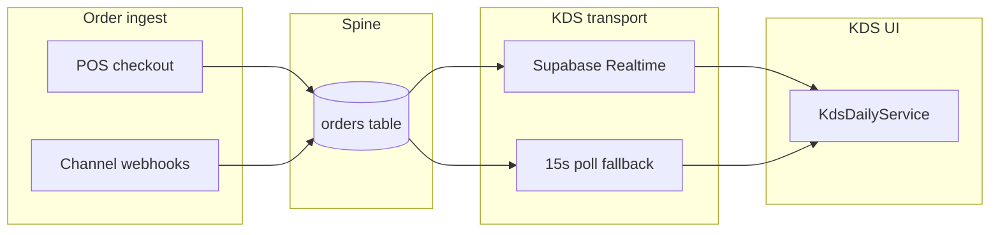

# KDS SLO Definition

**Status:** Draft — targets for pilot proof, not yet certified in production  
**Audience:** Kitchen engineering, DevOps, Product, VP Operations  
**Policy:** `era6-kds-realtime-smoke-v1`, `era11-kds-realtime-e2e-staging-v1`  
**Related:** [`kds-websocket-rfc.md`](./kds-websocket-rfc.md) · [`kds-v1-scope.md`](./kds-v1-scope.md) · [`kds-staging-smoke-checklist.md`](./kds-staging-smoke-checklist.md)

---

## Purpose

Define **Service Level Objectives (SLOs)** for KitchenOS Kitchen Display System (KDS) v1 so staging proof and pilot operations share one measurable bar. These targets govern **order visibility latency** on the daily-service ticket UI—not rush-hour throughput, item-level bumping, or multi-station load tests (explicitly out of v1 scope).

**Honesty rule:** Do not claim “rush-hour KDS certified” or “production Realtime SLO met” until error budgets below are measured on staging traffic for **7 consecutive days** with documented methodology.

---

## SLO summary

| Metric | p50 | p95 | p99 | Measurement window |
|--------|-----|-----|-----|-------------------|
| **Order → KDS ticket visible** | **&lt; 2s** | **&lt; 5s** | **&lt; 15s** | Rolling 7 days, staging + pilot tenants |
| **Bump / recall UI reflect** | **&lt; 1s** | **&lt; 3s** | **&lt; 8s** | Same |
| **Polling fallback max gap** | — | **≤ 15s** | **≤ 15s** | When Realtime not SUBSCRIBED |

The **15s p99** for order visibility aligns with `KDS_POLL_FALLBACK_MS` in `lib/kitchen/kds-realtime-smoke-policy.ts`—the worst-case honest bound when Supabase Realtime is disconnected.

---

## Service definition

**Service:** KDS daily-service queue at `/dashboard/kitchen` (`KdsDailyService`).

**User-facing outcome:** A line cook sees a new same-day order ticket shortly after it enters the unified order spine (POS, storefront, Woo/Shopify webhook, manual order).

**In scope events:**

- New order created with status not `CANCELLED` / `COMPLETED`
- Order status change (`CONFIRMED` → `READY` via bump, `READY` → `PREPARING` via recall)
- Same-tenant, same `user_id` filter as Realtime subscription

**Out of scope (v1):**

- Weekly preorder / production board (`KitchenScreenClient`)
- Item-level bumping, course firing, expo orchestration
- Rush-hour concurrent load (&gt; 30 tickets/min sustained)
- Offline tablet replay queue

---

## SLIs (indicators)

### SLI-1: Order ingest → KDS paint (`kds.order_visibility_latency_ms`)

**Start (T0):** Postgres `orders.updated_at` (or `created_at` for new rows) at commit.

**End (T1):** Browser receives refreshed queue where ticket `data-testid="kds-ticket-{orderId}"` would render (detected via Playwright, RUM, or client instrumentation).

**Formula:** `T1 - T0` in milliseconds.

**Valid samples:** Daily-service tenant, `kitchen.view` granted, KDS page open or navigated within 60s of T0.

### SLI-2: Bump action → expo column (`kds.bump_reflect_latency_ms`)

**Start:** `bumpDailyKdsOrderAction` server commit (`orders.status = READY`).

**End:** Ticket appears under `data-testid="kds-section-ready"` on the initiating screen (and ideally all subscribed screens in workspace).

### SLI-3: Realtime connection health (`kds.realtime_subscribed_ratio`)

**Definition:** Fraction of KDS sessions where Supabase channel status is `SUBSCRIBED` (UI label: `● Live (Supabase Realtime)`).

**Target:** **≥ 95%** of session-minutes during pilot hours (not an latency SLO—a availability SLI for transport).

### SLI-4: Refresh action duration (`kds.fetch_queue_duration_ms`)

**Definition:** Server-action round-trip for `fetchDailyKdsOrdersAction` (p50/p95).

**Target (informational):** p95 &lt; 800ms on staging—feeds into SLI-1 but measured separately for DB/query tuning.

---

## Architecture reference

| Component | Path |
|-----------|------|
| Transport abstraction | `services/kds-websocket.ts` |
| Feature flag | `NEXT_PUBLIC_KDS_REALTIME_ENABLED` |
| Poll intervals | 15s (disconnected) · 60s (safety net when live) |
| E2E proof | `e2e/kds-staging.spec.ts` (15s visibility assertion) |

---

## Methodology

### Where to measure

| Environment | Purpose | Required secrets |
|-------------|---------|------------------|
| **Staging** | Primary SLO proof | `E2E_STAGING_BASE_URL`, `E2E_LOGIN_*`, `ENABLE_KDS_V1_CERTIFIED=true` |
| **Pilot tenant (prod)** | Post-certification monitoring | Same app env + optional RUM |

### How to measure (phased)

| Phase | Method | Owner |
|-------|--------|-------|
| **P0 — Playwright** | `e2e/kds-staging.spec.ts`: POS sale → ticket visible `timeout: 15_000` | CI / weekly `playwright-kds-staging.yml` |
| **P1 — Staging synthetic** | Script: create order via API → poll KDS server action until ticket in response; emit histogram JSON | Integration eng |
| **P2 — Client RUM** | Optional `performance.mark('kds-refresh-start/end')` in `KdsDailyService.refresh` | Frontend |
| **P3 — DB correlation** | Compare `orders.updated_at` to `kitchen` audit events (`logKitchenOrderBumped`) | Analytics |

### Sample requirements

- **Minimum samples per window:** 100 order→KDS events (or full 7 days if lower volume).
- **Exclude:** Tests run with `NEXT_PUBLIC_KDS_REALTIME_ENABLED=false` (polling-only kill-switch drills).
- **Exclude:** Sessions where E2E skips (no POS, plan gate, permission denied).
- **Segment by:** `realtime_subscribed` true/false (expect p99 ≤ 15s only on fallback segment).

### Percentile calculation

- Use **histogram buckets** (Prometheus, Datadog, or JSON artifact from smoke script).
- Report **p50, p95, p99** per SLI over rolling 7 days.
- **Error budget:** 1% of events may exceed p99 threshold (15s visibility) before SLO breach.

---

## Alert definitions

| Alert | Condition | Severity | Runbook |
|-------|-----------|----------|---------|
| **KDS-Realtime-Degraded** | `kds.realtime_subscribed_ratio` &lt; 70% for 15 min | Warning | Check Supabase status; verify RLS; confirm `NEXT_PUBLIC_SUPABASE_*` on staging |
| **KDS-Visibility-SLO-Breach** | p95(`kds.order_visibility_latency_ms`) &gt; 5s for 1h | Page (pilot) | Inspect Vercel region vs Supabase; review `fetchDailyKdsOrdersAction` query; check DB latency |
| **KDS-P99-Budget-Exhausted** | &gt; 1% samples &gt; 15s in 24h | Critical (pilot) | Force poll-only drill; open incident; consider Pusher evaluation per RFC |
| **KDS-Fetch-Slow** | p95(`kds.fetch_queue_duration_ms`) &gt; 2s for 30 min | Warning | Prisma audit indexes on `orders(user_id, created_at, status)` |
| **KDS-Overdue-Backlog** | Cron `kds-overdue-alerts` notifies &gt; 3 operators in 1h | Info | Kitchen capacity, not transport—see `app/api/cron/kds-overdue-alerts/route.ts` |

**Notification channels (pilot):** Slack ops webhook (when configured), email to on-call alias—mirror webhook cron runbook pattern in `docs/OBSERVABILITY_WEBHOOK_CRON_RUNBOOK_RU.md`.

---

## Staging proof checklist

Before marking KDS transport **pilot_ready** for GTM:

- [ ] `e2e/kds-staging.spec.ts` PASS on staging URL (GitHub `playwright-kds-staging.yml` or manual)
- [ ] 7-day staging histogram: p50 &lt; 2s, p95 &lt; 5s, p99 &lt; 15s for SLI-1
- [ ] Bump/recall path PASS in same E2E run
- [ ] `kds.realtime_subscribed_ratio` ≥ 95% during business hours OR documented fallback-only tenant
- [ ] Cross-tenant isolation E2E PASS (`e2e/cross-tenant-isolation.spec.ts` when shipped)
- [ ] No forbidden GTM phrases (`KDS_REALTIME_FORBIDDEN_GTM_PHRASES` in policy module)

---

## Error budget policy

| SLO | Monthly error budget (99% target) | Breach action |
|-----|-----------------------------------|---------------|
| Order visibility p99 &lt; 15s | ~1% of events may exceed | Freeze KDS GTM claims; triage transport |
| Order visibility p95 &lt; 5s | ~5% of events may exceed | Performance sprint; index review |
| Realtime subscribed ≥ 95% | 5% session-minutes may be on poll fallback | Acceptable if p99 still met; else vendor review |

**Escalation:** Two consecutive weekly windows breaching p95 → re-open [`kds-websocket-rfc.md`](./kds-websocket-rfc.md) Phase 2 (Pusher evaluation).

---

## Relationship to ticket urgency (operational, not SLO)

Kitchen **overdue** UI threshold: **900 seconds (15 min)** — `KDS_OVERDUE_SECONDS` in `lib/kitchen/kds-queue-clarity-era18.ts`. This is an operator UX signal, not a transport SLO.

Cron push for overdue prep tickets: **10 minutes** — `app/api/cron/kds-overdue-alerts/route.ts`.

Do not conflate overdue kitchen timers with order→KDS latency SLOs.

---

## Forbidden claims until SLO proof

From `lib/kitchen/kds-realtime-smoke-policy.ts`:

- “realtime E2E certified” (partial — browser smoke only until staging histogram green)
- “rush-hour KDS certified”
- “production Realtime certified”
- “always-on Supabase Realtime”

Approved qualified language: **“KDS v1 pilot with 15s polling fallback and staging Realtime smoke.”**

---

## Next steps (engineering)

1. Add `scripts/smoke-kds-slo-staging.ts` — synthetic SLI-1 histogram writer → `artifacts/kds-slo-staging-summary.json` (future cycle; no new npm script registration required for doc).
2. Wire weekly staging workflow to run `e2e/kds-staging.spec.ts` in addition to `kds-realtime-staging.spec.ts`.
3. Optional client marks in `KdsDailyService.refresh` for P2 RUM.

---

## References

- `lib/kitchen/kds-realtime-smoke-policy.ts` — poll intervals, forbidden phrases
- `services/kds-websocket.ts` — transport + feature flag
- `e2e/kds-staging.spec.ts` — mutating staging E2E
- `e2e/kds-realtime-staging.spec.ts` — connection label smoke
- `docs/kds-websocket-rfc.md` — transport selection + Phase 2 triggers
- `docs/kds-v1-scope.md` — v1 boundary
