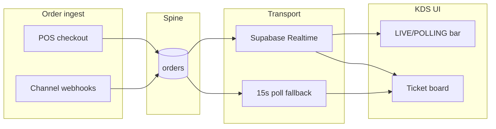

# KDS SLO Proof Plan

**Status:** Draft — proof methodology for Critical Features moat; **not yet certified**  
**Policy:** `critical-kds-realtime-slo-proof-v1` (`lib/kitchen/kds-slo-proof-policy.ts`)  
**Audience:** Kitchen engineering, DevOps, Product, VP Operations  
**Related:** [`kds-slo-definition.md`](./kds-slo-definition.md) · [`kds-sales-one-pager.md`](./kds-sales-one-pager.md) · [`kds-websocket-rfc.md`](./kds-websocket-rfc.md)

---

## Purpose

Define how KitchenOS **proves** Realtime KDS latency SLOs before sales and pilot contracts claim sub-second kitchen visibility. This plan targets the **LIVE (Supabase Realtime SUBSCRIBED)** transport path — the moat differentiator vs polling-only competitors.

**Honesty rule:** Do not claim SLO proof complete until `artifacts/kds-slo-proof-summary.json` shows a **7-day rolling window** meeting all targets below with ≥ 100 valid samples.

---

## SLO targets (LIVE transport)

| Metric | p50 | p95 | p99 | Scope |
|--------|-----|-----|-----|-------|
| **Order → KDS ticket visible** | **< 500ms** | **< 2s** | **< 5s** | Realtime SUBSCRIBED only |
| **Bump → expo column reflect** | **< 400ms** | **< 1.5s** | **< 4s** | Same |
| **Realtime session availability** | — | — | **≥ 95%** session-minutes | Pilot business hours |

### Fallback bound (not the moat claim)

When UI shows **POLLING** badge (`○ Polling fallback (15s)`), worst-case visibility is bounded by `KDS_POLL_FALLBACK_MS` (**15s p99**). See [`kds-slo-definition.md`](./kds-slo-definition.md) for the full-service definition including fallback.

**Sales line:** *"Sub-second tickets on LIVE Realtime; honest 15s safety net when disconnected."*

---

## Service definition

**Service:** KDS daily-service at `/dashboard/kitchen` (`KdsKitchenDailyClient` → `KdsDailyService`).

**In-scope events:**

- New order enters unified spine → ticket renders with `data-testid="kds-ticket-{orderId}"`
- Bump action → ticket moves to `data-testid="kds-section-ready"`
- Recall action → ticket returns to `data-testid="kds-section-prep"`

**Out of scope:**

- Weekly production board (`KitchenScreenClient`)
- Rush-hour load (> 30 tickets/min sustained)
- Item-level bumping, multi-station routing
- Offline tablet replay

---

## SLIs

### SLI-1: `kds.order_visibility_latency_ms` (LIVE segment)

| Field | Definition |
|-------|------------|
| **T0** | Postgres `orders.updated_at` at commit |
| **T1** | Client refresh completes and ticket ID appears in queue state |
| **Filter** | `data-mode="LIVE"` on `kds-realtime-status-badge` OR Realtime channel `SUBSCRIBED` |
| **Formula** | `T1 - T0` milliseconds |

### SLI-2: `kds.bump_reflect_latency_ms` (LIVE segment)

| Field | Definition |
|-------|------------|
| **T0** | `bumpDailyKdsOrderAction` server commit |
| **T1** | Ticket visible under expo section on initiating screen |

### SLI-3: `kds.realtime_subscribed_ratio`

Fraction of KDS session-minutes where badge mode is **LIVE** (`getKdsRealtimeBadgeMode(true)`).

---

## Architecture



| Component | Path |
|-----------|------|
| Realtime hook | `hooks/use-kds-realtime.ts` |
| Transport + reconnect | `services/kds-websocket.ts` |
| LIVE/POLLING UI | `app/dashboard/kitchen/kds-kitchen-realtime-bar.tsx` |
| SLO constants | `lib/kitchen/kds-slo-proof-policy.ts` |
| Poll fallback | `lib/kitchen/kds-realtime-smoke-policy.ts` |

---

## Proof phases

| Phase | Method | Output | Owner |
|-------|--------|--------|-------|
| **P0 — Unit policy lock** | `tests/unit/kds-slo-proof-plan-wiring.test.ts` | CI green | Engineering |
| **P1 — Playwright staging** | `e2e/kds-staging.spec.ts` + `e2e/kds-realtime-staging.spec.ts` | GitHub run URL | QA / DevOps |
| **P2 — Synthetic histogram** | `scripts/smoke-kds-slo-staging.ts` (future) | `artifacts/kds-slo-proof-summary.json` | Integration eng |
| **P3 — Client RUM** | `performance.mark` in `KdsDailyService.refresh` | Datadog / JSON export | Frontend |
| **P4 — 7-day window** | Aggregate P1–P3 per tenant | Signed proof summary | VP Ops |

### P1 acceptance (staging)

- POS sale → ticket visible within **5s** (Playwright hard timeout; expect p50 ≪ 5s on LIVE)
- LIVE badge visible when Supabase configured
- Bump + recall path PASS in same run

### P2 synthetic script (spec)

```bash
# Future — not required for doc-only cycle
ENABLE_KDS_V1_CERTIFIED=true node scripts/smoke-kds-slo-staging.ts \
  --tenant=$STAGING_TENANT \
  --samples=100 \
  --out=artifacts/kds-slo-proof-summary.json
```

**Histogram buckets (ms):** 0–250, 250–500, 500–1000, 1000–2000, 2000–5000, 5000+

**Pass criteria:** p50 < 500, p95 < 2000, p99 < 5000 on LIVE segment only.

---

## Sample requirements

- **Minimum:** 100 order→KDS events per 7-day window (`KDS_SLO_PROOF_MIN_SAMPLES`)
- **Exclude:** `NEXT_PUBLIC_KDS_REALTIME_ENABLED=false` drill runs
- **Exclude:** Permission denied / plan gate / E2E skip sessions
- **Segment:** Report LIVE and POLLING histograms separately

---

## Error budget

| SLO | Budget (99% target) | Breach action |
|-----|---------------------|---------------|
| Visibility p99 < 5s (LIVE) | ~1% events may exceed | Freeze Realtime GTM claims |
| Visibility p95 < 2s (LIVE) | ~5% events may exceed | Performance sprint |
| Realtime subscribed ≥ 95% | 5% session-minutes on POLLING | Acceptable if fallback p99 ≤ 15s |

**Escalation:** Two consecutive weekly breaches → re-open [`kds-websocket-rfc.md`](./kds-websocket-rfc.md) Phase 2 (Pusher evaluation).

---

## Alerts (pilot)

| Alert | Condition | Severity |
|-------|-----------|----------|
| **KDS-SLO-P95-Breach** | p95(SLI-1) > 2s for 1h on LIVE segment | Page (pilot) |
| **KDS-SLO-P99-Breach** | > 1% samples > 5s in 24h | Critical (pilot) |
| **KDS-Realtime-Degraded** | subscribed ratio < 70% for 15 min | Warning |

---

## Staging proof checklist

Before marking **SLO proof ready** for sales:

- [ ] `e2e/kds-staging.spec.ts` PASS on staging URL
- [ ] `e2e/kds-realtime-staging.spec.ts` PASS (LIVE badge smoke)
- [ ] 7-day LIVE histogram: p50 < 500ms, p95 < 2s, p99 < 5s
- [ ] `kds.realtime_subscribed_ratio` ≥ 95% during pilot hours
- [ ] `artifacts/kds-slo-proof-summary.json` committed or attached to pilot dossier
- [ ] No forbidden claims (`KDS_SLO_PROOF_FORBIDDEN_CLAIMS` in policy module)

---

## Forbidden claims until proof complete

- "Sub-500ms guaranteed for all tenants"
- "Rush-hour KDS certified"
- "Production Realtime SLO met" (without 7-day histogram)
- "Always-on Supabase Realtime"

**Approved qualified language:** *"KDS Realtime pilot — sub-2s p95 target on LIVE transport with 15s polling fallback; SLO proof in progress on staging."*

---

## Relationship to existing docs

| Document | Role |
|----------|------|
| [`kds-slo-definition.md`](./kds-slo-definition.md) | Full-service SLO incl. 15s fallback p99 |
| [`kds-qualified-sales-onepager-era17.md`](./kds-qualified-sales-onepager-era17.md) | Era 17 qualified pilot wording |
| **This plan** | Executable proof bar for Realtime moat (500ms / 2s / 5s) |

---

## References

- `lib/kitchen/kds-slo-proof-policy.ts`
- `hooks/use-kds-realtime.ts`
- `services/kds-websocket.ts`
- `e2e/kds-staging.spec.ts`
- `e2e/kds-realtime-staging.spec.ts`
- `docs/kds-sales-one-pager.md`
