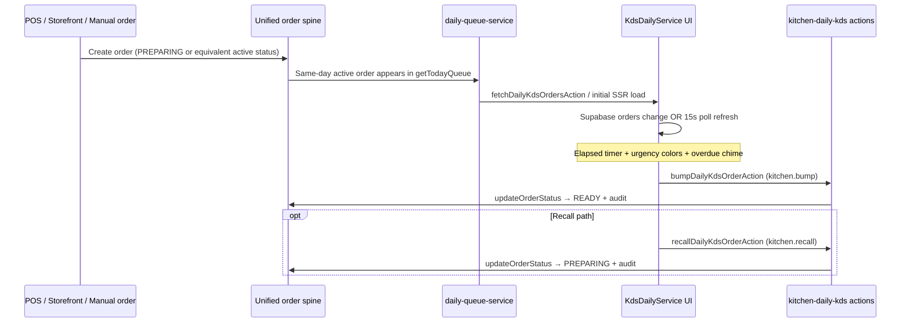

# KDS v1 Scope

Status: canonical scope boundary for KitchenOS KDS v1 certification  
Date: 2026-05-27  
Primary evidence: `actions/kitchen-daily-kds.ts`, `components/kitchen/kds-daily-service.tsx`, `services/kitchen-screen/daily-kds-service.ts`, `services/production/daily-queue-service.ts`, `app/dashboard/kitchen/page.tsx`, `tests/unit/kitchen-daily-kds-rbac.test.ts`, `docs/kds-kitchen-ops-roadmap.md`, `docs/feature-maturity-matrix.md`

## Purpose

Define what **KDS v1** means in Evolution Era 2 so engineering, QA, and GTM share one honest boundary. KDS v1 is **not** Toast-class kitchen orchestration. It is one **certified order-ticket workflow** on the existing unified order spine for daily-service operators.

Longer-term kitchen capabilities remain in `docs/kds-kitchen-ops-roadmap.md`. This document scopes only the first shippable certification slice.

## Strategic Position

| Dimension | KDS v1 target | Explicitly not v1 |
|-----------|---------------|-------------------|
| Ticket unit | **One order ticket** from today's active queue | Item-level bumping, course firing, rush/hold |
| Operating context | **Daily service** tenants (`DAILY_SERVICE` operating mode) | Weekly preorder / batch production board as primary KDS |
| Stations | **Logical station label only** (table/source metadata); no station routing engine | Canonical station config, modifier routing, expo orchestration |
| Realtime | **Supabase Realtime + polling fallback** (`era6-kds-realtime-smoke-v1`) | Playwright Realtime E2E in default CI (`era8-kds-realtime-e2e-staging-v1` — staging Tier E only) |
| Permissions | Existing canonical `kitchen.*` keys | New parallel kitchen auth model |
| Maturity label today | `beta` | `production_certified` until v1 acceptance bar met |
| Maturity label after v1 | `pilot_ready` (qualified) behind rollout gate | "Restaurant-grade" or "rush-hour certified" claims |

## In Scope (KDS v1)

### 1. One ticket workflow — daily service queue

**Actor:** line cook, kitchen lead, or manager with `kitchen.view`.

**Flow:**

**Ticket fields (v1 minimum):**

- Order id, customer name, line item titles
- Order status (`PREPARING`, `READY`, etc.)
- Created-at elapsed timer
- Optional table name from order `sourceMetadataJson`
- Allergen conflict flag from `daily-queue-service` (server-derived; UI surfacing required in Cycle 19–20)

**Bump semantics:** order-level transition to `READY` via `updateOrderStatus` with `requiredPermission: "kitchen.bump"`.

**Recall semantics:** order-level transition back to `PREPARING` via `requiredPermission: "kitchen.recall"`.

### 2. Entry points

| Route | Role | Notes |
|-------|------|-------|
| `/dashboard/kitchen` | Primary KDS shell | Daily service → `KdsDailyService`; other modes → production work-item screen |
| `/dashboard/kitchen?fullscreen=1` | Fullscreen variant | Same component; layout params from search |
| `/dashboard/kitchen/fullscreen` | Redirect | Redirects to `?fullscreen=1` |
| `/dashboard/kitchen/tablet` | Tablet shell | Existing route; v1 must remain readable at arm's length |

Non-daily-service tenants continue using `KitchenScreenClient` + `productionWorkItem` rows. That path is **adjacent**, not v1-certified in this cycle band.

### 3. Station model (v1)

KDS v1 does **not** introduce new Prisma station entities.

| Concept | v1 behavior |
|---------|-------------|
| Station identity | Display-only: POS table metadata, order source label |
| Station filter | **Deferred** — `?station=` exists on kitchen page for production mode only |
| POS kitchen routing | `pos-kitchen-routing-service.ts` continues creating `ProductionWorkItem` rows for POS; separate from daily ticket bump path |
| Production stations | `ProductionWorkItem.station` string on batch/catering board — out of v1 certification |

**v1 rule:** certify the **order ticket queue** path only. Do not conflate with production work-item state machine in v1 acceptance.

### 4. Permissions

Reuse existing canonical keys from `lib/permissions/permissions.ts`:

| Permission | v1 use |
|------------|--------|
| `kitchen.view` | Load KDS tickets (`fetchDailyKdsOrdersAction`, page gate) |
| `kitchen.bump` | Bump order to `READY` |
| `kitchen.recall` | Recall `READY` → `PREPARING` |
| `kitchen.configure` | **Out of v1 certification** — station/mode UI for production board |
| `kitchen.expo.manage` | **Out of v1 certification** — expo handoff on work items |

**Enforcement:** all mutations via `requireMutationPermission` in `actions/kitchen-daily-kds.ts` with denial audits through `logKitchenPermissionDenied`.

**Negative tests required:** `tests/unit/kitchen-daily-kds-rbac.test.ts` (existing); extend in Cycle 19–20 if UI gates diverge.

### 5. Realtime / refresh strategy

**Primary:** Supabase Realtime channel on `public.orders` filtered by tenant `user_id`.

**Fallback:** client poll every **15s** when Realtime not subscribed; **60s** when subscribed (safety net).

**Server truth:** always re-fetch via `fetchDailyKdsOrdersAction` on change — no optimistic-only bump without server confirmation (bump action already awaits server result).

**Not in v1:** offline queue, conflict resolution, event sequencing proofs beyond existing integration smoke.

### 6. Allergen and modifier visibility (v1 gap closure target)

| Signal | Server today | UI today | v1 requirement |
|--------|--------------|----------|----------------|
| Allergen conflict | `hasAllergenConflict` in `getTodayQueue` | Not rendered in `KdsDailyService` | High-contrast badge on conflict tickets |
| Modifiers | Item title string only | Plain text chip | Emphasize modifier text in title; no new modifier parser |
| Customer allergies | From `kitchenCustomer.allergiesJson` | Not surfaced | Surface conflict badge; no separate acknowledgement flow in v1 |

Cycle 19–20 must close allergen UI gap before calling v1 pilot-ready.

### 7. SLA / urgency (v1 minimal)

Existing client behavior is in scope:

- Elapsed timer per ticket (1s local tick)
- Color bands: green → amber → orange → rose by age
- Overdue at **900s** (15 min) with optional chime
- Production cron `kds-overdue-alerts` exists for ops notifications — **not** part of v1 UI certification

No configurable per-tenant SLA targets in v1.

## Out of Scope (KDS v1)

Do **not** implement or claim for v1:

- Item-level or course-level bump/recall
- Rush ticket, hold/fire, expo coordination product
- Canonical station configuration UI and routing rules engine
- Offline / degraded KDS mode
- Native hardware certification (Bump Bar, Epson kitchen printers as certified devices)
- Label printing from KDS
- Kitchen performance analytics dashboards
- PWA driver modes (`docs/MOBILE_KDS_DRIVER_MODES.md`) as certified workflow
- Replacing production board / packing verification flows
- New Prisma models unless a P0 safety fix requires them
- Toast/Square/SpotOn parity claims

## Existing Code Map

| Layer | File | v1 role |
|-------|------|---------|
| Page gate | `app/dashboard/kitchen/page.tsx` | `kitchen.view`; mode switch |
| UI | `components/kitchen/kds-daily-service.tsx` | Ticket grid, bump/recall, realtime |
| Actions | `actions/kitchen-daily-kds.ts` | Permissioned fetch/bump/recall |
| Queue | `services/production/daily-queue-service.ts` | Today's active orders + allergen flag |
| Adapter | `services/kitchen-screen/daily-kds-service.ts` | Elapsed seconds wrapper |
| Audit | `services/kitchen/kitchen-permission-audit.ts` | Denial, bump, recall events |
| POS routing | `services/pos/pos-kitchen-routing-service.ts` | Adjacent; not v1 ticket path |
| Production board | `services/kitchen-screen/kitchen-screen-service.ts` | Adjacent; batch/catering |

## Test Strategy

### Existing (keep green)

| Test | Coverage |
|------|----------|
| `tests/unit/kitchen-daily-kds-rbac.test.ts` | Deny fetch/bump/recall; audit on denial; happy bump/recall |
| `tests/contracts/kds-ticket.contract.test.ts` | Minimal ticket DTO shape |

### Required before v1 `pilot_ready` (Cycle 19–20)

| Test | Intent |
|------|--------|
| Extend contract test | Full `KdsDailyOrder` / `TodayOrderItem` fields incl. `hasAllergenConflict` |
| Integration: queue → bump | Order in DB → appears in queue → bump → status READY + audit row |
| Realtime smoke (optional CI) | **Era 4 Cycle 10:** `docs/kds-staging-smoke-checklist.md` + `test:ci:kds-staging-smoke`; do not block CI on Supabase Realtime |
| UI/accessibility spot check | Fullscreen readability, bump target ≥44px, overdue aria labels |

### Explicit deferrals

- E2E rush-hour multi-station simulation
- Offline replay tests
- Hardware certification tests

## Rollout Gate (Cycle 19–20)

KDS v1 prototype ships **behind existing operating-mode gate**:

1. Tenant must resolve to `DAILY_SERVICE` (`isDailyServiceMode`).
2. Optional env **`ENABLE_KDS_V1_CERTIFIED=true`** for explicit pilot enablement in non-production/staging — **implemented** in `lib/kitchen/kds-v1-gate.ts`; production daily-service tenants enabled by default.
3. Default nav: `/dashboard/kitchen` remains visible only to actors with `kitchen.view`.
4. Maturity matrix stays **`beta`** until allergen UI + integration test land; then **`pilot_ready` (qualified)** with documented limitations — **Cycle 19–20 complete (Cycle 47)**.

No broad kitchen rewrite. No new top-level product module.

## v1 Acceptance Criteria

KDS v1 is complete when **all** are true:

1. Daily-service tenant sees today's active orders as order tickets on `/dashboard/kitchen`.
2. Actor with `kitchen.bump` can bump; without it, server denies with audit.
3. Actor with `kitchen.recall` can recall READY tickets; without it, denied.
4. Bump/recall mutate unified order status — not a shadow ticket store.
5. Realtime or polling refresh updates ticket list without manual reload.
6. Allergen conflict visible on affected tickets (high contrast).
7. `tests/unit/kitchen-daily-kds-rbac.test.ts` green; at least one integration test proves queue → bump.
8. Maturity matrix and backlog updated; no "production_certified" or "rush-hour" claim.
9. No new permission keys unless strictly necessary.
10. Production/batch kitchen board behavior unchanged for non-daily-service tenants.

## Relationship to Other Docs

| Document | Relationship |
|----------|--------------|
| `docs/kds-kitchen-ops-roadmap.md` | Long-term capability map; superset of v1 |
| `docs/feature-maturity-matrix.md` | Maturity label source of truth |
| `docs/rbac-permission-architecture.md` | Permission definitions |
| `docs/implementation-backlog.md` | `KOS-P1-002` execution tracker |
| `docs/qa-master-test-plan.md` | CI and manual QA tiers |
| `docs/kds-qualified-sales-onepager-era17.md` | **Era 17:** sales-safe pilot wording (`era17-kds-qualified-sales-onepager-v1`); no rush-hour claim |
| `docs/knowledge-base/16-kds-basics.md` | Operator-facing; update after v1 lands |

## Recommended Execution Sequence

1. **Cycle 17–18 (this doc):** scope locked — no surface expansion.
2. **Cycle 19–20:** allergen UI, integration test, optional `ENABLE_KDS_V1_CERTIFIED`, maturity bump to `pilot_ready` (qualified).
3. **Later eras:** station routing, expo, SLA config, offline — only after money-path and RBAC waves remain green.
