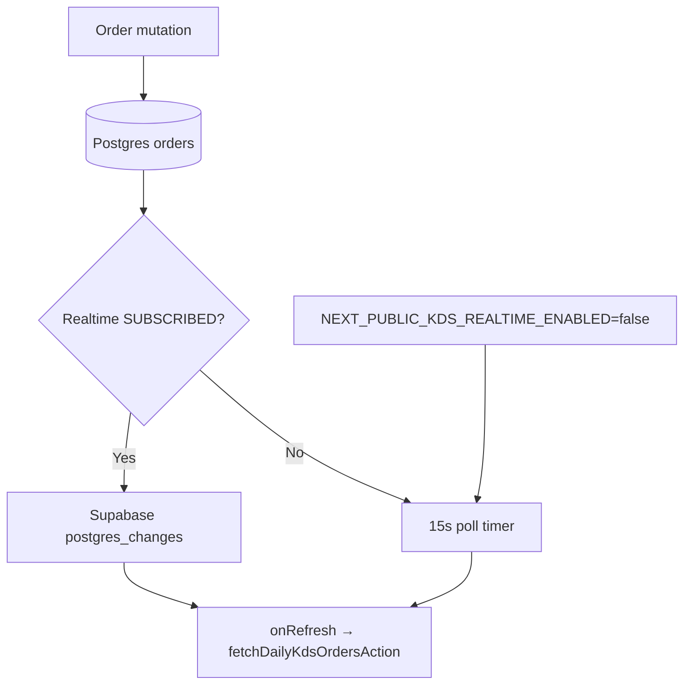

# KDS WebSocket Implementation Plan

**Status:** Engineering plan — pilot track  
**Audience:** Kitchen engineering, DevOps, VP Operations  
**Related:** [`kds-websocket-rfc.md`](./kds-websocket-rfc.md) · [`kds-slo-definition.md`](./kds-slo-definition.md) · [`kds-staging-smoke-checklist.md`](./kds-staging-smoke-checklist.md)

---

## Summary

KitchenOS KDS v1 uses **Supabase Realtime** (`postgres_changes` on `orders`) with a **15s polling fallback**. Transport abstraction is already shipped in `services/kds-websocket.ts` and wired from `components/kitchen/kds-daily-service.tsx`.

**Goal:** Certify sub-second ticket visibility on staging (p50 &lt; 2s) while keeping polling as permanent degraded mode. Do **not** add a separate WebSocket server for pilot.

| Dimension | Polling-only (fallback) | Supabase Realtime (target) |
|-----------|----------------------|----------------------------|
| Worst-case ticket gap | **15,000 ms** (15s) | **&lt; 500 ms** event + refresh RTT |
| p50 order visibility | ~7.5s average | **&lt; 2s** (SLO) |
| p95 order visibility | 15s cap | **&lt; 5s** (SLO) |
| Offline / Realtime down | Always works | Falls back to 15s poll automatically |

---

## Technology choice

**Supabase Realtime** — already in stack (`NEXT_PUBLIC_SUPABASE_URL`, anon key, RLS on `orders`).

| Why Supabase | Why not (pilot) |
|--------------|-----------------|
| Zero new vendor or infra | Pusher — extra cost + auth wiring |
| WebSocket terminates at Supabase, not Vercel | Self-hosted WS — ops burden, no pilot need |
| `services/kds-websocket.ts` abstraction allows swap later | Raw TCP server — out of v1 scope per RFC |

**Feature flag:** `NEXT_PUBLIC_KDS_REALTIME_ENABLED=false` forces polling-only (incident kill-switch).

---

## Current state (already shipped)

| Component | Path | Status |
|-----------|------|--------|
| Transport abstraction | `services/kds-websocket.ts` | ✅ Shipped |
| UI integration | `components/kitchen/kds-daily-service.tsx` | ✅ Uses `subscribeKdsOrderUpdates` |
| Poll policy | `lib/kitchen/kds-realtime-smoke-policy.ts` | ✅ 15s disconnected · 60s safety net when live |
| Unit tests | `tests/unit/kds-websocket.test.ts` | ✅ PASS |
| RFC + SLO docs | `docs/kds-websocket-rfc.md`, `docs/kds-slo-definition.md` | ✅ Draft |

**Not yet certified:** Staging latency SLO, rush-hour load, multi-screen fan-out, Playwright propagation proof (`KDS_REALTIME_SMOKE_HONEST_SCOPE.realtimePlaywrightCertified: false`).

---

## Implementation phases

### Week 1 — Proof of concept (staging)

**Objective:** Prove Realtime path delivers tickets faster than 15s poll on a single staging tenant.

| Task | Owner | Deliverable |
|------|-------|-------------|
| Enable Realtime on staging Supabase project | DevOps | Replication enabled for `orders` table |
| Verify RLS: tenant A cannot subscribe to tenant B rows | Security | Cross-tenant check in [`e2e/cross-tenant-isolation.spec.ts`](../e2e/cross-tenant-isolation.spec.ts) |
| Deploy with `NEXT_PUBLIC_KDS_REALTIME_ENABLED=true` | DevOps | Staging preview URL in vault (`E2E_STAGING_BASE_URL`) |
| Manual PoC: POS order → KDS paint | QA | Screen recording + timestamp log |
| Instrument SLI-1 | Engineering | Client log: `kds.order_visibility_latency_ms` on refresh |

**Exit criteria:** 10 consecutive orders visible on KDS in **&lt; 2s p50** with Realtime `SUBSCRIBED` label shown.

```bash
# Staging smoke (after vault 11/11)
npm run smoke:kds-staging -- --execute
npx playwright test e2e/kds-realtime-staging.spec.ts
```

---

### Week 2 — Integration hardening

**Objective:** Wire all order ingress paths through the same spine so Realtime fires for every channel.

| Task | Owner | Deliverable |
|------|-------|-------------|
| POS checkout → `orders` row | Engineering | Already wired; verify bump/recall mutations |
| Woo/Shopify webhook → Order Hub → KDS | Integration | Live smoke after vault (`smoke:woo-live`, `smoke:shopify-live`) |
| Uber Eats / DoorDash / Grubhub BETA ingest | Integration | Same `orders` table mutations per delivery plan |
| Connection status UX | Engineering | `● Live` / `○ Polling fallback (15s)` labels (existing) |
| Poll safety net | Engineering | Keep 60s interval when SUBSCRIBED — no removal |
| `workspace_id` filter spike | Engineering | RFC open question — document if multi-brand pilot needs it |

**Exit criteria:** Orders from **POS + at least one live channel** appear on KDS without manual refresh; fallback to poll verified by toggling flag off.

---

### Week 3 — Testing and SLO proof

**Objective:** Measure 7-day error budget on staging; document honest GTM boundary.

| Task | Owner | Deliverable |
|------|-------|-------------|
| Playwright propagation test | QA | Extend `e2e/kds-realtime-staging.spec.ts` — order inject → ticket visible |
| SLO dashboard or weekly report | DevOps | p50/p95/p99 for SLI-1, SLI-2, SLI-3 from `docs/kds-slo-definition.md` |
| Fallback rate alert | DevOps | Alert if &gt; 30% sessions on polling &gt; 15 min |
| Pilot runbook update | Product | [`kds-staging-smoke-checklist.md`](./kds-staging-smoke-checklist.md) signed |
| Forbidden claims audit | Product | No "rush-hour certified" until SLO met |

**Exit criteria:**

- p50 order visibility **&lt; 2s**, p95 **&lt; 5s** for 7 consecutive staging days
- Realtime subscribed ratio **≥ 95%** during pilot hours
- Polling fallback still passes when Realtime disabled

```bash
npm run test:ci:kds-realtime-smoke
npm run test:ci:kds-staging-smoke
```

---

## Fallback architecture (permanent)

Polling is **not** a temporary bridge — it is the degraded-mode contract.



| Mode | Trigger | User sees |
|------|---------|-----------|
| Live | Realtime `SUBSCRIBED` | `● Live (Supabase Realtime)` |
| Degraded | Disconnect / flag off / no Supabase env | `○ Polling fallback (15s)` |
| Safety net | Live + 60s timer | Background refresh even when connected |

---

## Metrics and success criteria

| Metric | Current (poll-only) | Target (Realtime live) | Source |
|--------|---------------------|------------------------|--------|
| Event → client callback | N/A | **&lt; 500 ms** typical | Supabase region RTT |
| Order → ticket visible (p50) | ~7.5s avg | **&lt; 2s** | SLI-1 |
| Order → ticket visible (p95) | **15s cap** | **&lt; 5s** | SLI-1 |
| Bump → UI reflect (p95) | 15s cap | **&lt; 3s** | SLI-2 |
| Realtime uptime | 0% | **≥ 95%** session-minutes | SLI-3 |

**Phase 2 trigger (re-open RFC):** p95 &gt; 5s for 7 days, or &gt; 50 concurrent KDS connections, or enterprise mandates Pusher.

---

## Dependencies and blockers

| Blocker | Unblocks |
|---------|----------|
| Vault 11/11 (`docs/vault-one-pager.md`) | Staging deploy, E2E, live channel ingest |
| `E2E_STAGING_BASE_URL` + login creds | Playwright Realtime proof |
| Supabase Realtime enabled on staging | Week 1 PoC |
| Woo/Shopify live smoke PASS | Week 2 multi-channel integration |

---

## Out of scope (v1)

- Separate Fly.io / Node WebSocket daemon
- Item-level bumping (row-level noise on `postgres_changes`)
- Rush-hour load test (&gt; 30 tickets/min sustained)
- Pusher migration (Phase 2 only)
- Certified native handheld hardware offline sync

---

## References

- `services/kds-websocket.ts` — transport + subscribe API
- `components/kitchen/kds-daily-service.tsx` — KDS UI consumer
- `lib/kitchen/kds-realtime-smoke-policy.ts` — intervals, labels, honest scope
- `e2e/kds-realtime-staging.spec.ts` — staging browser smoke
- `docs/kds-websocket-rfc.md` — vendor comparison and security checklist
- `docs/kds-slo-definition.md` — SLIs, error budgets, forbidden GTM phrases
