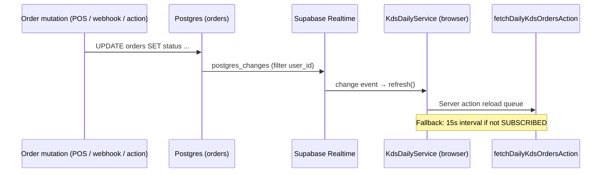

# KDS WebSocket RFC — Realtime Transport Selection

**Status:** Draft for engineering review  
**Audience:** Kitchen engineering, DevOps, Product  
**Policy:** `era6-kds-realtime-smoke-v1`, `era11-kds-realtime-e2e-staging-v1`  
**Related:** [`kds-v1-scope.md`](./kds-v1-scope.md) · [`kds-kitchen-ops-roadmap.md`](./kds-kitchen-ops-roadmap.md) · [`delivery-aggregator-plan.md`](./delivery-aggregator-plan.md)

---

## Summary

KitchenOS KDS v1 needs **near-real-time ticket updates** when orders enter `PREPARING`, bump to `READY`, or recall. Today the daily-service UI uses **Supabase Realtime** (`postgres_changes` on `orders`) with a **15s polling fallback**. This RFC compares that approach with **Pusher Channels** and a **self-hosted WebSocket** server, then recommends a phased path including feature flag `NEXT_PUBLIC_KDS_REALTIME_ENABLED`.

**Recommendation:** **Stay on Supabase Realtime for pilot** (zero new vendor, already wired). Implement `services/kds-websocket.ts` as a **transport abstraction** with polling fallback—not a separate bare-metal server in v1. Re-evaluate Pusher or self-hosted only if staging SLO proof fails (`docs/kds-slo-definition.md`, cycle 10).

---

## Problem

| Requirement | Target | Why it matters |
|-------------|--------|----------------|
| Order → KDS visibility | p50 &lt; 2s, p95 &lt; 5s, p99 &lt; 15s | Line cooks must see new tickets before expo pressure builds |
| Bump / recall fan-out | &lt; 1s to all screens in same workspace | Multi-station kitchens share one queue |
| Degraded mode | Kitchen still usable without WebSocket | Wi-Fi drops, Supabase outage, tablet sleep |
| Tenant isolation | Tenant A events never reach Tenant B | Cross-tenant leak = P0 security incident |
| Vercel compatibility | No long-lived connections on Next.js serverless | API routes cannot hold WebSocket upgrades |

**Current gap:** Realtime path is certified at **unit/smoke** level only—not rush-hour load or production-traffic SLO (`KDS_REALTIME_SMOKE_HONEST_SCOPE` in `lib/kitchen/kds-realtime-smoke-policy.ts`).

---

## Current architecture (as shipped)



| Component | Path |
|-----------|------|
| UI | `components/kitchen/kds-daily-service.tsx` |
| Policy | `lib/kitchen/kds-realtime-smoke-policy.ts` |
| Poll intervals | 15s disconnected · 60s safety net when live |
| Channel name | `kds-orders-{userId}` |
| Table subscription | `public.orders` · `user_id=eq.{userId}` |
| Status label | `● Live (Supabase Realtime)` / `○ Polling fallback (15s)` |

**Honesty:** Playwright staging smoke checks page load + connection label only (`e2e/kds-realtime-staging.spec.ts`)—not sub-second propagation.

---

## Options compared

### Option A — Supabase Realtime (current)

**How it works:** Browser Supabase client subscribes to `postgres_changes` on `orders`. Any row change matching `user_id` triggers a full queue refresh via server action.

| Dimension | Assessment |
|-----------|------------|
| **Latency** | Typical **100–400 ms** from commit to client callback (region-dependent). Full refresh adds server-action RTT (~200–800 ms). Expected end-to-end **0.5–2 s** in same region—within p50 target if DB and Vercel are co-located with Supabase. |
| **Cost (2026 estimates)** | Bundled with existing Supabase project. Pro plan ~**$25/mo** base; Realtime message/month limits apply on lower tiers. No incremental vendor if already on Supabase for auth + DB. |
| **Complexity** | **Low** — already implemented; uses `NEXT_PUBLIC_SUPABASE_URL` + anon key. |
| **Tenant isolation** | Filter on `user_id` + Supabase RLS on `orders`. Must verify RLS policies block cross-tenant reads. |
| **Vercel fit** | **Excellent** — WebSocket terminates at Supabase, not Vercel. |
| **Failure modes** | Realtime disconnect → 15s poll (already coded). Supabase outage → poll may also fail if API down. |
| **Multi-screen** | All screens for same `userId` share channel; workspace-scoped queues may need `workspace_id` filter when multi-location ships. |

**Pros:** No new infra; matches stack; polling fallback exists.  
**Cons:** Coupled to DB replication lag; `postgres_changes` fires on any column change (noisy); not ideal for high-frequency item-level bumps (v2).

---

### Option B — Pusher Channels (managed)

**How it works:** Server publishes `order.updated` events to a private channel after order mutations. Browser subscribes via Pusher JS SDK. KitchenOS would add publish calls in `bumpDailyKdsOrderAction`, webhook processors, etc.

| Dimension | Assessment |
|-----------|------------|
| **Latency** | **50–200 ms** global delivery (Pusher edge). Lower jitter than DB replication for push-only payloads. |
| **Cost (2026 estimates)** | Sandbox free (limited). Production **~$49–99/mo** (Startup/Growth) + overages on connections/messages. 5 kitchens × 3 screens ≈ 15 connections—well within small plans; cost scales with message volume on busy sites. |
| **Complexity** | **Medium** — new secrets (`PUSHER_APP_ID`, `KEY`, `SECRET`, `CLUSTER`); authorize private channels server-side; publish from every order write path. |
| **Tenant isolation** | Private channel per workspace: `private-kds-{workspaceId}` + auth endpoint. |
| **Vercel fit** | **Good** — client connects to Pusher; server only REST publish. |
| **Failure modes** | SDK reconnect built-in; still need polling fallback (same 15s policy). |
| **Multi-screen** | Native fan-out; purpose-built for pub/sub. |

**Pros:** Decoupled from Postgres replication; mature reconnect; explicit event schema.  
**Cons:** Extra vendor + cost; must instrument all mutation paths; another secret in vault.

---

### Option C — Self-hosted WebSocket

**How it works:** Dedicated WS service (Node `ws`, **Soketi**, or custom) on Fly.io / Railway / ECS. Redis pub/sub for horizontal scale. Next.js publishes events via HTTP internal API or Redis.

| Dimension | Assessment |
|-----------|------------|
| **Latency** | **20–100 ms** single-region if WS host near Vercel + DB. Cross-region adds RTT. |
| **Cost (2026 estimates)** | **$5–40/mo** small VM + **$10–25/mo** Redis (Upstash/Fly). Engineering cost dominates. |
| **Complexity** | **High** — deploy, TLS, auth (JWT on connect), reconnect, backpressure, monitoring, on-call. |
| **Tenant isolation** | Custom — must implement room ACLs correctly (high audit risk). |
| **Vercel fit** | **Requires separate service** — cannot run WS on Vercel serverless. |
| **Failure modes** | You own failover, cert rotation, DDoS. |
| **Multi-screen** | Full control of protocol (item-level events in v2). |

**Pros:** Lowest marginal message cost at scale; full protocol control; no third-party Realtime limits.  
**Cons:** Not justified for pilot; security and ops burden; conflicts with “minimal scope” constitution.

---

## Comparison matrix

| Criterion | Supabase Realtime | Pusher | Self-hosted WS |
|-----------|-------------------|--------|----------------|
| Time to pilot | ✅ Done | ~2–3 weeks | ~4–6 weeks |
| Monthly cost (pilot) | ~$0 incremental | ~$49+ | ~$15–65 + eng |
| p50 latency (est.) | 0.5–2 s | 0.3–1 s | 0.2–0.8 s |
| Ops burden | Low | Low | High |
| Vercel-native | Yes | Yes | No (sidecar) |
| Polling fallback | ✅ Implemented | Must add | Must add |
| Item-level events (v2) | Awkward | Good | Best |
| Vendor lock-in | Supabase | Pusher | None |

---

## Decision

### Pilot (KDS v1): **Option A — Supabase Realtime**

Rationale:

1. Already production-wired in `kds-daily-service.tsx` with honest fallback.
2. KitchenOS already depends on Supabase for auth/database—no vault expansion for pilot.
3. SLO targets (p50 &lt; 2s) are achievable with same-region Supabase + short poll fallback.
4. Constitution: minimal scope—avoid new infra before SLO proof fails.

### Feature flag: `NEXT_PUBLIC_KDS_REALTIME_ENABLED`

| Value | Behavior |
|-------|----------|
| `true` (default when Supabase configured) | Subscribe to Realtime; show live status label |
| `false` | Skip Realtime subscription; **polling only** (15s); show poll banner |

Use for: staging debug, A/B latency measurement, incident kill-switch without redeploying Supabase.

### Phase 2 trigger (consider Pusher)

Re-open vendor selection when **any** of:

- Staging SLO proof: p95 &gt; 5s for 7 days with Realtime `SUBSCRIBED`
- &gt; 50 concurrent KDS connections on one project (Supabase Realtime limits)
- Item-level bump/recall v2 requires sub-second fan-out without full-row postgres noise
- Enterprise customer mandates non-Supabase realtime vendor

### Phase 3 (self-hosted)

Only if message volume makes Pusher &gt; **$300/mo** or custom protocol (offline sync, kitchen hardware) is required.

---

## Proposed implementation (cycle 8)

Add `services/kds-websocket.ts` as **transport abstraction**, not necessarily a raw TCP server:

```typescript
// Conceptual API (cycle 8 deliverable)
export type KdsRealtimeTransport = "supabase" | "polling";

export function resolveKdsTransport(): KdsRealtimeTransport {
  if (process.env.NEXT_PUBLIC_KDS_REALTIME_ENABLED === "false") return "polling";
  if (process.env.NEXT_PUBLIC_SUPABASE_URL) return "supabase";
  return "polling";
}

export function subscribeKdsOrderUpdates(opts: {
  userId: string;
  onRefresh: () => void;
  onConnectionChange: (live: boolean) => void;
}): () => void; // unsubscribe
```

Refactor `KdsDailyService` to call `subscribeKdsOrderUpdates` instead of inline Supabase code. Keeps one place to swap Pusher later.

**Not in scope for cycle 8:** Separate Fly.io WebSocket daemon.

---

## Security checklist

| Control | Supabase | Pusher | Self-hosted |
|---------|----------|--------|-------------|
| Channel scoped to tenant | `user_id` / `workspace_id` filter | Private channel auth | Custom JWT rooms |
| RLS on source table | Required | N/A (events from server) | N/A |
| Least-privilege anon key | Supabase dashboard | N/A | N/A |
| Replay / ordering | Full refresh idempotent | Event id + version | Custom |
| Audit | Order audit log (existing) | Publish log optional | Connection log |

Before pilot: run cross-tenant isolation E2E (cycle 18) with KDS page open.

---

## Observability

| Signal | Source |
|--------|--------|
| Connection state | UI label + optional client metric `kds.realtime.connected` |
| Refresh latency | Server-action timing on `fetchDailyKdsOrdersAction` |
| Poll fallback rate | % sessions with `realtimeConnected=false` |
| SLO dashboards | See `docs/kds-slo-definition.md` (cycle 10) |

Alert if &gt; 30% of sessions on polling fallback for 15 minutes (Realtime degradation).

---

## Migration plan (if moving to Pusher later)

1. Dual-publish: Supabase refresh **and** Pusher event (1 week staging).
2. Feature flag `NEXT_PUBLIC_KDS_REALTIME_TRANSPORT=pusher|supabase`.
3. Compare SLO side-by-side.
4. Cut over; keep 15s poll as ultimate fallback.
5. Remove `postgres_changes` subscription when Pusher stable.

---

## Open questions

1. **Workspace vs user channel:** Multi-brand workspaces may need `workspace_id` filter instead of `user_id` when staff share a kitchen login.
2. **Order Hub → KDS path:** Aggregator webhooks (Uber Eats) must emit same spine mutations so Realtime fires—see delivery aggregator plan.
3. **Production tablet mode:** iOS/Android WebView sleep may drop Realtime; poll fallback is mandatory permanently.

---

## References

- `components/kitchen/kds-daily-service.tsx` — current Realtime + poll
- `lib/kitchen/kds-realtime-smoke-policy.ts` — intervals and labels
- `e2e/kds-realtime-staging.spec.ts` — staging browser smoke
- `docs/kds-v1-scope.md` — v1 Realtime boundary
- Supabase Realtime docs: https://supabase.com/docs/guides/realtime
- Pusher Channels docs: https://pusher.com/docs/channels
