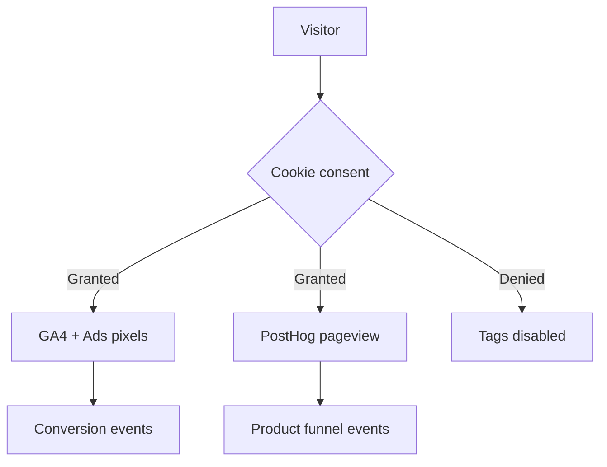

# Marketing analytics setup — OS Kitchen

**Policy:** `marketing-analytics-setup-v1`  
**Date:** 2026-06-02  
**Owner:** Marketing + Engineering  
**Scope:** Public marketing measurement — GA4, PostHog, ad pixels, consent, conversion events  
**Status:** **Code shipped · env optional** — most tags inactive until keys set on production  
**Related:** [`observability-setup.md`](./observability-setup.md) (Sentry/OTel — engineering) · [`seo-audit.md`](./seo-audit.md) · [`sales-safe-claims-registry.md`](./sales-safe-claims-registry.md)

This document is the **marketing analytics runbook** — how to configure, verify, and report on top-of-funnel and signup funnels. It does **not** replace product analytics inside the dashboard (orders, KDS, pilot metrics).

**Honesty rule:** Analytics prove **traffic and funnel mechanics** — not customer count, revenue, or “market traction.” Pre-pilot baseline: **0 signed LOI · pilot NO-GO** ([`artifacts/pilot-gono-go-summary.json`](../artifacts/pilot-gono-go-summary.json)).

---

## Architecture overview

| Layer | Tool | Purpose | Active when |
|-------|------|---------|-------------|
| **Marketing web** | GA4 (`gtag.js`) | Pageviews, signup/pricing conversions | `NEXT_PUBLIC_GA_MEASUREMENT_ID` + consent |
| **Product funnel** | PostHog | Signup → onboarding → first order | `NEXT_PUBLIC_POSTHOG_KEY` |
| **Paid social** | Meta Pixel | Ads attribution | `NEXT_PUBLIC_META_PIXEL_ID` + consent |
| **Paid social** | LinkedIn Insight | B2B ads attribution | `NEXT_PUBLIC_LINKEDIN_PARTNER_ID` + consent |
| **Paid search** | Google Ads | Conversion tracking | `NEXT_PUBLIC_GOOGLE_ADS_ID` + consent |
| **Performance** | Web Vitals reporter | CWV → PostHog `web_vitals` | PostHog key set |
| **Errors (eng)** | Sentry | Not marketing — see observability doc | `SENTRY_DSN` |



**Consent gate:** All marketing tags default **denied** until user accepts [`CookieConsent`](../../components/analytics/cookie-consent.tsx) — `grantMarketingConsent()` in `lib/analytics/marketing-consent.ts`.

---

## Environment variables

Set in **Vercel Production** (and Preview for staging validation). See `.env.example`.

| Variable | Required | Example | Component |
|----------|:--------:|---------|-----------|
| `NEXT_PUBLIC_GA_MEASUREMENT_ID` | For GA4 | `G-XXXXXXXXXX` | `components/analytics/google-analytics.tsx` |
| `NEXT_PUBLIC_POSTHOG_KEY` | For product funnel | `phc_…` | `components/analytics/posthog-provider.tsx` |
| `NEXT_PUBLIC_POSTHOG_HOST` | No | `https://us.i.posthog.com` | PostHog (default US cloud) |
| `NEXT_PUBLIC_META_PIXEL_ID` | For Meta ads | numeric id | `components/analytics/meta-pixel.tsx` |
| `NEXT_PUBLIC_LINKEDIN_PARTNER_ID` | For LinkedIn ads | numeric id | `components/analytics/linkedin-insight.tsx` |
| `NEXT_PUBLIC_GOOGLE_ADS_ID` | For Ads conversions | `AW-…` | `lib/analytics/gtag-events.ts` |

**Storefront note:** Guest storefront uses `components/storefront/storefront-analytics-scripts.tsx` — if GTM is configured, standalone gtag is **not** double-injected ([`STOREFRONT_SEO_RENDERING.md`](./STOREFRONT_SEO_RENDERING.md)).

---

## Setup checklist (production)

| # | Step | Owner | Done |
|---|------|-------|:----:|
| 1 | Create GA4 property + web data stream | Marketing | ☐ |
| 2 | Set `NEXT_PUBLIC_GA_MEASUREMENT_ID` on Vercel Production | Eng | ☐ |
| 3 | Create PostHog project (US cloud) | Marketing | ☐ |
| 4 | Set `NEXT_PUBLIC_POSTHOG_KEY` (+ optional host) | Eng | ☐ |
| 5 | Configure ad pixel IDs if running paid campaigns | Marketing | ☐ |
| 6 | Deploy + verify consent banner on `/` | QA | ☐ |
| 7 | Accept cookies in test browser → confirm GA realtime | Marketing | ☐ |
| 8 | Submit sitemap in Search Console | Marketing | ☐ |
| 9 | Document baseline metrics (week 0) | PM | ☐ |

**Staging:** Use separate GA4 stream or PostHog project — never mix staging events with production dashboards.

---

## Event taxonomy

### GA4 / gtag (marketing)

Implemented in `lib/analytics/gtag-events.ts`:

| Event | Trigger | Params |
|-------|---------|--------|
| `$pageview` | Route change (via gtag config) | `page_path` |
| `sign_up` | Successful signup | `method: email` |
| `view_pricing` | Pricing page view | — |
| `conversion` | Google Ads | `send_to`, `value`, `currency` |

**Call sites:** `trackSignupConversion()` in signup form · `trackPricingView()` on pricing page.

### PostHog (product funnel)

Typed events in `lib/analytics/product-events.ts` → `captureProductEvent()`:

| Event | When to fire | Properties (examples) |
|-------|--------------|----------------------|
| `signup_completed` | Account created | `plan`, `source` |
| `onboarding_step_completed` | Launch wizard step | `step_id` |
| `first_order_created` | First order in workspace | `channel` |
| `storefront_published` | Storefront goes live | — |
| `pos_first_use` | First POS checkout | — |
| `pilot_day_30` | Day-30 pilot milestone | `workspace_id` (hashed) |
| `web_vitals` | CWV report | LCP, INP, CLS |
| `roi_lead_submitted` | ROI calculator lead | — |
| `nps_submitted` | NPS prompt | `score` |
| `briefing_click` | AI briefing CTA | — |

PostHog also captures `$pageview` on pathname change via `PostHogProvider`.

**PII rule:** Do not send email, name, or raw tenant IDs to GA4/Ads. PostHog identify only after consent + documented policy.

---

## Recommended dashboards

### GA4 (marketing)

| Dashboard | Metrics | Use |
|-----------|---------|-----|
| **Acquisition** | Sessions, source/medium, landing page | ICP page performance (`/shopify`, `/vendor`) |
| **Engagement** | Avg engagement time, scroll | Content quality |
| **Conversions** | `sign_up`, `view_pricing` | Funnel top |
| **Geo** | Country/region | Geo landing page ROI |

### PostHog (product)

| Funnel | Steps |
|--------|-------|
| **Signup → value** | `$pageview` → `signup_completed` → `onboarding_step_completed` → `first_order_created` |
| **Storefront** | `signup_completed` → `storefront_published` |
| **Pilot health** | `first_order_created` → `pilot_day_30` → `nps_submitted` |

Create insights in PostHog UI after key is live — export weekly screenshot to [`mvp-marketing-dashboard.md`](./mvp-marketing-dashboard.md) (Task 111).

---

## Consent & privacy

| Requirement | Implementation |
|-------------|----------------|
| Default deny | GA4 consent mode `analytics_storage: denied` on load |
| Opt-in | Cookie banner → `grantMarketingConsent()` |
| Opt-out | `denyMarketingConsent()` clears ad storage |
| Cookie name | `kitchenos-cookie-consent=true` |
| Legal pages | `/legal/privacy` · `/legal/cookies` |

**GDPR/CCPA:** Do not enable ad pixels in EU/CA campaigns until legal review of DPA + consent copy. Document subprocessors (Google, Meta, LinkedIn, PostHog) in enterprise questionnaire pack.

---

## Verification steps

### After deploy

```bash
# 1. Health (Sentry separate from marketing)
curl -s https://YOUR_DOMAIN/api/health | jq '.checks.observability'

# 2. Manual browser test
# - Open / in incognito
# - Reject cookies → Network tab: no gtag hits
# - Accept cookies → gtag collect requests appear
# - Complete test signup on staging → sign_up event in GA4 DebugView
```

### GA4 DebugView

1. Install [Google Analytics Debugger](https://chrome.google.com/webstore) extension
2. Accept marketing cookies on site
3. Trigger `view_pricing` and test signup
4. Confirm events in GA4 → Admin → DebugView

### PostHog live events

1. Set key on Preview deployment
2. Navigate dashboard routes
3. PostHog → Activity → verify `$pageview` and product events

---

## Reporting cadence

| Cadence | Report | Owner | Audience |
|---------|--------|-------|----------|
| **Weekly** | Sessions, signups, top landing pages | Marketing | Founder |
| **Bi-weekly** | PostHog funnel drop-offs | Product | Eng + GTM |
| **Monthly** | SEO + paid ROAS (if ads live) | Marketing | Founder |
| **Pre-pilot** | Baseline only — no external KPI claims | PM | Internal |

Align monthly review with [`pilot-metrics-review-process.md`](./pilot-metrics-review-process.md) once pilots start.

---

## What not to claim externally

| Metric | Safe to cite? | Notes |
|--------|:-------------:|-------|
| “X monthly visitors” | Only with live GA4 + date range | Not before baseline captured |
| “Y% signup conversion” | Internal only pre-pilot | Sample size too small |
| “Product-market fit proven” | **No** | Requires signed customers + retention |
| PostHog funnel screenshots | Sales deck with “internal beta” label | [`sales-safe-claims-registry.md`](./sales-safe-claims-registry.md) |
| Sentry error rate | Engineering only | Not marketing proof |

---

## Troubleshooting

| Symptom | Likely cause | Fix |
|---------|--------------|-----|
| No GA4 data | Missing env var or consent denied | Set `NEXT_PUBLIC_GA_MEASUREMENT_ID`; accept cookies |
| Double pageviews | GTM + gtag both active | Use one path — see storefront note |
| PostHog silent | Key unset or `posthog-js` not installed | `npm install posthog-js`; set key |
| Ads conversions missing | Consent denied or wrong `send_to` | Verify `NEXT_PUBLIC_GOOGLE_ADS_ID` + label |
| Events in staging pollute prod | Same property ID | Separate streams/projects |

---

## Related documents

| Doc | Topic |
|-----|-------|
| [`observability-setup.md`](./observability-setup.md) | Sentry, OpenTelemetry, `/api/health` |
| [`ops/PRODUCTION_OBSERVABILITY_SETUP.md`](./ops/PRODUCTION_OBSERVABILITY_SETUP.md) | Sentry + PostHog quick ref |
| [`seo-audit.md`](./seo-audit.md) | Organic + GA4 conversion wiring |
| [`linkedin-content-plan.md`](./linkedin-content-plan.md) | Task 107 — content + UTM discipline |
| [`marketing-page-audit.md`](./marketing-page-audit.md) | Task 90 — public page inventory |
| [`ai-honesty-policy.md`](./ai-honesty-policy.md) | Claims on AI landing pages |

---

## Revision history

| Version | Date | Change |
|---------|------|--------|
| `marketing-analytics-setup-v1` | 2026-06-02 | Initial setup guide — Task 106 |

**Next action:** Create GA4 + PostHog projects → set Vercel env vars → capture week-0 baseline before paid spend.
