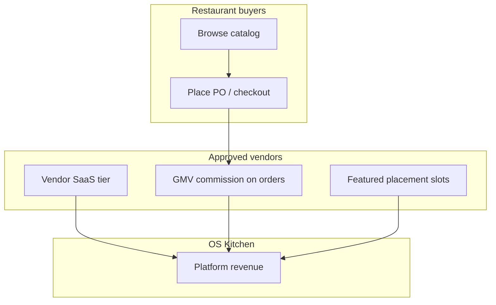

# Marketplace pricing strategy — OS Kitchen

**Policy:** `marketplace-pricing-strategy-v1`  
**Date:** 2026-06-02  
**Owner:** Founder + PM + Finance  
**Status:** **BETA** — pricing **coded and documented**; **no live GMV** · pilot terms negotiable  
**Source of truth (code):** `lib/marketplace/billing-integration-types.ts` · `lib/marketplace/featured-placement-types.ts` · `lib/marketplace/vendor-settings-types.ts`

This document defines how OS Kitchen **monetizes the HoReCa B2B marketplace** — vendor SaaS tiers, GMV commission, featured placements, and pilot exceptions. It supports sales, vendor recruitment, and Series A unit-economics modeling.

**Hard rule:** Do **not** claim a live marketplace network, guaranteed take rate, or published vendor pricing on `/pricing` until Task 109 ships public copy and pilot vendors are onboarded.

**Related:** [`vendor-seeding-strategy.md`](./vendor-seeding-strategy.md) · [`marketplace-b2b-supply-angle.md`](./marketplace-b2b-supply-angle.md) · [`stripe-connect-vendor-test-plan.md`](./stripe-connect-vendor-test-plan.md) · [`sales-safe-claims-registry.md`](./sales-safe-claims-registry.md) · [`transparent-pricing-sales-guide.md`](./transparent-pricing-sales-guide.md) · Task 109 `/pricing` marketplace copy

---

## Executive summary

| Dimension | Current state |
|-----------|---------------|
| **Marketplace maturity** | Scaffold BETA — migration + UI shipped; catalog empty until vendor seed |
| **Revenue streams** | (1) Vendor SaaS subscription · (2) GMV commission · (3) Featured placement ads |
| **Buyer fees** | **None** — restaurants pay vendor list price + Stripe processing |
| **Vendor default tier** | FREE ($0/mo, 5% commission) |
| **Live transactions** | **0** — Stripe Connect path env-gated (`MARKETPLACE_VENDOR_STRIPE_CONNECT`) |
| **Public pricing page** | Restaurant SaaS only — marketplace fees **not yet on `/pricing`** (Task 109) |

**Strategic intent:** Dual-sided monetization without taxing buyers — suppliers pay for visibility and lower take rate via subscription, similar to Faire/Amazon Business but scoped to HoReCa supply categories.

---

## Revenue model



| Stream | Who pays | When charged | Code reference |
|--------|----------|--------------|----------------|
| **Vendor SaaS** | Supplier | Monthly (calendar period) | `VENDOR_PLAN_MONTHLY_FEE_USD` |
| **GMV commission** | Supplier (deducted at payout) | Per completed marketplace order | `commissionRateForPlan()` → Stripe `application_fee_amount` |
| **Featured placements** | Supplier | Upfront per slot/week | `MARKETPLACE_FEATURED_SLOT_PRICING_USD` |
| **Buyer subscription** | — | **Not applicable** | Marketplace access included in restaurant workspace plans |

---

## Vendor plan tiers (source of truth)

Prices and commission rates are **implemented in code** — update registry + this doc together when changing.

| Tier | Monthly fee | Commission on GMV | Target vendor | Key entitlements (positioning) |
|------|------------:|------------------:|---------------|--------------------------------|
| **FREE** | $0 | **5.0%** | Pilot / long-tail suppliers | Catalog listing, basic vendor cabinet |
| **GROWTH** | **$99** | **3.5%** | Active regional distributors | Featured slots, analytics exports, priority support |
| **ENTERPRISE** | **$299** | **2.0%** | National / multi-category suppliers | API access, custom delivery zones, dedicated success |

**Implementation:**

```55:67:lib/marketplace/billing-integration-types.ts
export const VENDOR_PLAN_MONTHLY_FEE_USD: Record<VendorPlanTier, number> = {
  FREE: 0,
  GROWTH: 99,
  ENTERPRISE: 299,
};

export function commissionRateForPlan(planTier: VendorPlanTier): number {
  if (planTier === "ENTERPRISE") return 2;
  if (planTier === "GROWTH") return 3.5;
  return 5;
}
```

**Vendor-facing copy:** `VENDOR_PLAN_OPTIONS` in `lib/marketplace/vendor-settings-types.ts` — vendor cabinet plan picker must match this table.

**Proration:** Plan upgrades mid-cycle use `calculatePlanUpgradeProration()` — charge delta for remaining days in billing period.

---

## GMV commission mechanics

### At checkout (Stripe Connect)

When `MARKETPLACE_VENDOR_STRIPE_CONNECT=1` and vendor has `stripeAccountId`:

1. Buyer pays **full order total** via PaymentIntent
2. Platform retains **`application_fee_amount`** = `orderTotal × commissionRate`
3. Remainder transfers to vendor Connect account via `transfer_data.destination`

**Code:** `services/marketplace/stripe-connect-service.ts` — commission read from `order.vendor.commissionRate` (DB default 5.0%, synced on plan change).

### Monthly invoicing (fallback / reconciliation)

Vendor billing document tracks:

- **`saas_subscription`** line — monthly plan fee
- **`marketplace_commission`** line — aggregated commission for period

**Code:** `buildMarketplaceVendorInvoice()` in `billing-integration-types.ts`.

### Example economics (Growth tier)

| Metric | Value |
|--------|------:|
| Monthly GMV through OS Kitchen | $20,000 |
| Commission rate | 3.5% |
| Commission revenue | $700 |
| SaaS fee | $99 |
| **Platform revenue (month)** | **$799** |
| Vendor net (before Stripe fees) | ~$19,201 − Stripe processing |

*Illustrative only — not customer proof.*

---

## Featured placement pricing

Optional **pay-to-promote** inventory for vendors on Growth+ (sales discretion on FREE during pilot).

| Slot | Weekly price (USD) | Placement |
|------|-------------------:|-----------|
| **Homepage hero** | $299 | Marketplace landing hero banner |
| **Catalog top** | $149 | Top row in buyer catalog |
| **Category spotlight** | $99 | Parent category page highlight |
| **Search boost** | $49 | Boost badge in search results |

**Code:** `MARKETPLACE_FEATURED_SLOT_PRICING_USD` in `lib/marketplace/featured-placement-types.ts`.

**Performance tracking:** views · clicks · conversions per placement — admin analytics includes featured revenue (`sumFeaturedPlacementRevenue`).

**Pilot policy:** First design partner may receive **4 weeks catalog_top at $0** in exchange for SKU depth + case study rights — document in vendor LOI, not public pricing.

---

## Buyer-side pricing

| Question | Answer |
|----------|--------|
| Does the restaurant pay OS Kitchen to use marketplace? | **No separate marketplace fee** — access is part of workspace subscription (Starter+) |
| What does buyer pay at checkout? | Vendor product price + tax/shipping as configured + **Stripe card processing** |
| Approval gates / PO workflow | Included — no per-PO platform fee in v1 |
| Compare to Sysco/US Foods? | OS Kitchen is **software + curated B2B catalog**, not a distributor of record |

**Sales wording:** "Your OS Kitchen subscription includes marketplace browse and ordering. You pay suppliers directly through checkout — OS Kitchen takes a commission from the vendor side, not an extra line on your invoice."

---

## Pilot & design-partner pricing (June–Q3 2026)

Until **3–5 seeded vendors** and first external buyer PO ([`vendor-seeding-strategy.md`](./vendor-seeding-strategy.md)):

| Stakeholder | Pilot offer | Guardrails |
|-------------|-------------|------------|
| **Design partner vendor** | FREE tier + **3.5% commission cap** for 90 days OR waived first $10k GMV | Signed LOI / pilot appendix; not advertised publicly |
| **Design partner buyer** | No change to restaurant SaaS — optional **Pro trial extension** for marketplace feedback | No "free supplies" claim |
| **Internal demo vendor** | Staging-only catalog; $0 fees | Label: "Staging demo — not live supplier" |
| **Featured slots** | 50% pilot discount or bundled with Growth annual prepay | Finance approval |

**Negotiation ceiling (founder approval):**

- Minimum commission: **2%** (Enterprise floor — do not go lower without volume commit)
- Maximum SaaS waiver: **6 months FREE tier** for anchor vendor in strategic category
- Never promise **0% commission in perpetuity**

---

## Competitive positioning

| Competitor model | Their take | OS Kitchen angle |
|------------------|-----------|------------------|
| **Traditional broadline (Sysco, US Foods)** | Embedded in product margin | Transparent **software commission** + vendor sets list price |
| **Faire / wholesale marketplaces** | ~15–25% first order, lower on repeat | **Lower headline take** (5% default) with SaaS trade-off |
| **Amazon Business** | Referral fees vary by category | HoReCa-specific taxonomy + PO integration with Kitchen OS ops |
| **Toast/Square marketplaces** | N/A for B2B supply | **Different category** — do not claim parity |

**Honest gap:** OS Kitchen has **no logistics network, credit terms, or field sales force** — marketplace value is **discovery + integrated PO + ops workflow**, not next-day truck delivery nationwide.

---

## Unit economics targets (Series A modeling)

Directional targets once marketplace is **live** (not current):

| Metric | Target (12 mo post-GA) | Notes |
|--------|------------------------|-------|
| Blended take rate | **3.5–4.5%** of GMV | Mix of FREE/Growth vendors |
| Vendor SaaS attach | **30%** on Growth+ | After 90-day FREE pilot |
| Featured / vendor ads | **10%** of marketplace revenue | Optional upsell |
| Marketplace GMV / active buyer | **$2k/mo** median | Illustrative — validate in pilot |
| CAC payback (vendor) | < 6 mo | Requires outbound + category anchor |

**Current reality:** GMV = **$0** · take rate = **N/A** · attach = **N/A** — use this section for investor **modeling only**.

---

## What sales can say

| Claim | Verdict | Wording |
|-------|:-------:|---------|
| B2B HoReCa marketplace in product | **ONLY_WITH_CAVEAT** | "Marketplace module in BETA — pilot onboarding" |
| Vendor tiers FREE / Growth / Enterprise | **YES (internal/vendor deck)** | Quote exact $ and % from this doc |
| Buyer pays no marketplace surcharge | **YES** | With restaurant SaaS caveat |
| Live supplier network | **NO** | Until seeded vendors + production checkout |
| Published marketplace fees on website | **NO** | Task 109 — `/pricing` not updated yet |
| Guaranteed lowest commission vs Faire | **NO** | Competitive direction only |
| Stripe Connect payouts to vendors | **ONLY_WITH_CAVEAT** | Staging smoke — [`stripe-connect-vendor-test-plan.md`](./stripe-connect-vendor-test-plan.md) |

Enforced by: `npm run verify-claims` · [`sales-safe-claims-registry.md`](./sales-safe-claims-registry.md)

---

## What not to say

| Forbidden | Say instead |
|-----------|-------------|
| "Live marketplace with hundreds of vendors" | "Marketplace BETA — design partner onboarding" |
| "Zero fees for vendors forever" | "Pilot terms negotiable — standard tiers in vendor agreement" |
| "Restaurants save 20% vs Sysco" | "Vendors set their own prices — we don't guarantee savings" |
| "Marketplace fees on /pricing" | "Restaurant plans on /pricing; vendor commercial terms in vendor onboarding" |

---

## Implementation checklist

Before GA marketplace pricing announcement:

- [ ] 3+ approved vendors with ACTIVE SKUs in production
- [ ] `e2e/marketplace-checkout.spec.ts` PASS on staging
- [ ] Stripe Connect production keys + `application_fee_amount` verified
- [ ] Vendor plan picker matches `VENDOR_PLAN_MONTHLY_FEE_USD` + commission table
- [ ] Monthly vendor invoice generation tested (`marketplace_commission` line)
- [ ] Featured placement purchase flow tested
- [ ] `/pricing` updated with marketplace section (Task 109)
- [ ] `config/marketing/claims-registry.json` rows for marketplace fees
- [ ] Legal: vendor terms + commission schedule in vendor agreement template

---

## Roadmap

| Phase | Timeline | Pricing action |
|-------|----------|----------------|
| **0 — Now** | Jun 2026 | Internal tiers coded; pilot LOI exceptions only |
| **1 — Pilot** | Q3 2026 | 3–5 vendors on FREE/Growth; measure GMV + attach |
| **2 — Public vendor pricing** | Q3–Q4 2026 | `/vendor` + `/pricing` marketplace section (Task 109) |
| **3 — Optimize** | Q4 2026+ | A/B featured slot pricing; annual Growth prepay discount |
| **4 — Enterprise supply** | 2027 | Custom commission schedules in enterprise vendor contracts |

---

## Related artifacts

| Artifact | Use |
|----------|-----|
| [`vendor-seeding-strategy.md`](./vendor-seeding-strategy.md) | Initial supply |
| [`vendor-seeding-execution.md`](./vendor-seeding-execution.md) | Execution plan (Task 105) |
| [`stripe-connect-vendor-test-plan.md`](./stripe-connect-vendor-test-plan.md) | Payout verification |
| [`series-a-narrative.md`](./series-a-narrative.md) | Investor marketplace GMV story |
| [`soc2-readiness-assessment.md`](./soc2-readiness-assessment.md) | Enterprise vendor data handling |
| `app/vendor/page.tsx` | Vendor recruitment landing (Task 65) |

---

*Generated as Task 96 — P2 PM. Next: [`sales-demo-environment.md`](./sales-demo-environment.md) (Task 97).*
