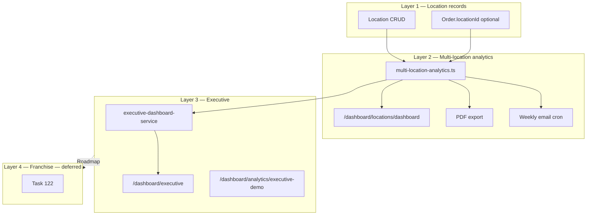

# Multi-location consolidated reporting plan — OS Kitchen

**Policy:** `multi-location-reporting-plan-v1`  
**Date:** 2026-06-02  
**Owner:** Product + Analytics + Enterprise PM  
**Scope:** Cross-location rollups for operators with **2–25 sites** — not franchise royalty or GL consolidation  
**Status:** **Analytics shipped · executive rollups partial · no staging pilot PASS · pilot NO-GO**

This document is the **strategic plan** for consolidated multi-location reporting: what dashboards and crons exist, what “consolidated” means honestly, certification gates, and roadmap vs franchise tools (Task 122).

**Honesty rule:** [`enterprise-mvp-spec.md`](./enterprise-mvp-spec.md) lists executive reports as **Partial — placeholder rollups**. Do **not** sell “enterprise-grade consolidated P&L” or “franchise royalty dashboard” until Phase 4+. Treat [`multi-location-reporting-competitive-positioning.md`](./multi-location-reporting-competitive-positioning.md) as **sales talk track** — this plan is **maturity authority**.

**Related:** [`MULTI_LOCATION.md`](./MULTI_LOCATION.md) · [`enterprise-mvp-spec.md`](./enterprise-mvp-spec.md) · [`sales-limitation-sheet.md`](./sales-limitation-sheet.md) · [`franchise-management-plan.md`](./franchise-management-plan.md) (Task 122) · `services/analytics/multi-location-analytics.ts`

---

## Executive summary

| Dimension | Today (June 2026) |
|-----------|-------------------|
| **Location model** | Shipped — `Location` + optional `Order.locationId` |
| **Multi-location dashboard** | Shipped — `/dashboard/locations/dashboard` |
| **Comparison table** | Revenue, orders, labor %, food cost % vs network avg |
| **Executive overview** | Shipped — `loadExecutiveOverview` — **workspace-level, not full rollup product** |
| **Weekly email cron** | Shipped — `/api/cron/multi-location-weekly-report` |
| **PDF export** | Shipped — `MultiLocationPdfExportButton` |
| **Plan gate** | **`multi_location`** · **ENTERPRISE** for full executive path |
| **Unassigned orders** | Reported separately — migration to `locationId` ongoing |
| **Live multi-unit customer** | **0** |

**Safe headline:** “Compare locations side-by-side on orders, revenue, and labor — with network averages and weekly email; executive rollups still maturing.”

**Forbidden:** “Real-time franchise dashboard,” “Consolidated GL,” “TouchBistro/Lightspeed reporting parity certified,” “All metrics live for every location.”

---

## Reporting layers

| Layer | Question answered | Maturity |
|-------|-------------------|----------|
| **1** | “Where are my kitchens?” | **LIVE (core)** |
| **2** | “How does Site A vs B perform this month?” | **BETA** — code shipped; pilot unproven |
| **3** | “How is the business overall?” | **Partial** — KPIs exist; rollup gaps |
| **4** | “Franchisee royalties & brand rollups?” | **Roadmap** — Task 122 |

---

## What ships today (Layer 2)

| Capability | Implementation | Caveat |
|------------|----------------|--------|
| Location comparison | `loadMultiLocationAnalyticsSnapshot` | Requires `locationId` on orders for accuracy |
| Custom date range | `AnalyticsFilterBar` / `MultiLocationCustomDateForm` | Timezone = workspace default |
| vs network average | `applyMultiLocationComparisonMetrics` | Green/red highlighting |
| Labor % | `StaffShift` groupBy location | Needs location-scoped shifts |
| Food cost % | `loadFoodCostPctByLocation` | **“—”** if costing not mapped |
| Unassigned bucket | `unassignedOrders` / `unassignedRevenue` | Honesty — not hidden |
| PDF export | Dashboard button | Static snapshot |
| Weekly digest | `multi-location-weekly-report` cron | Requires cron + email configured |
| Tests | `tests/unit/multi-location-analytics.test.ts` | Unit only — staging E2E optional |

**Routes:** `/dashboard/locations` · `/dashboard/locations/dashboard` · `/dashboard/executive`

---

## Layer 3 — Executive dashboard (partial)

| Source | Scope |
|--------|-------|
| `executive-dashboard-service.ts` | Orders, revenue, channels, health score, insights |
| AI modules | Brain, benchmarks, food-cost alerts consume `loadExecutiveOverview` |
| Demo | `/dashboard/analytics/executive-demo` — **synthetic only** |

**Gaps (enterprise spec):**

- Cross-location **inventory** rollup — not certified  
- Cross-location **marketplace PO** spend — WIP  
- **Scheduled board packs** — manual export today  
- **Brand-level** filters — partial model only  

**Sales:** Point prospects to **location dashboard** for site comparison; **executive** for owner KPIs with “partial rollup” label.

---

## Maturity phases

| Phase | Name | Deliverable | Gate | Target |
|:-----:|------|-------------|------|--------|
| **1** | **Foundation** | Location model + analytics service | — | **Done** |
| **2** | **Pilot certification** | 5-location design partner · data quality | 1 signed LOI | H2 2026 |
| **3** | **Executive rollup v1** | Executive dashboard pulls certified ML snapshot | Phase 2 PASS | Q4 2026 |
| **4** | **Scheduled reporting** | Board PDF + email templates in product | Phase 3 | Q1 2027 |
| **5** | **Franchise / brand** | Royalty + franchisee views | Task 122 | 2027+ |

---

## Phase 2 — Pilot certification checklist

Before removing “placeholder rollups” language from enterprise spec:

| # | Criterion | Owner |
|---|-----------|-------|
| 2.1 | ≥ **90%** of pilot orders have `locationId` | CS + operator |
| 2.2 | `e2e/multi-location-dashboard.spec.ts` PASS on staging | QA |
| 2.3 | Weekly cron sends to pilot inbox (Monday) | Ops |
| 2.4 | Food cost % validated on ≥1 location with costing | Finance |
| 2.5 | PDF export reviewed in GM meeting (artifact) | CS |
| 2.6 | Executive demo uses **live** dashboard — not synthetic | Sales |
| 2.7 | Forbidden claims: no “franchise dashboard” | Marketing |

**Artifact:** `artifacts/multi-location-pilot-cert-{tenant}.json`

---

## Phase 3 — Executive rollup v1 (engineering)

| Task | Detail |
|------|--------|
| Unified date filter | Executive + location dashboards share range |
| Drill-down | KPI click → location-filtered orders |
| Marketplace spend | Roll up PO totals by buyer location (when marketplace LIVE) |
| Health score | Per-location contribution to network score |
| RBAC | `reports.read.*` + `multi_location` plan gate |

---

## Data quality & migration

| Issue | Mitigation |
|-------|------------|
| Legacy orders without `locationId` | Show **unassigned** bucket; migration tool |
| Single-location operators | Hide comparison UI when `totalLocations < 2` |
| Staff shifts not location-scoped | Labor % null — document in UI |
| Multi-brand same workspace | Brand filter Phase 3+ |
| Cross-workspace rollup | **Out of scope** — one workspace = one org |

See [`MULTI_LOCATION.md`](./MULTI_LOCATION.md) — location switcher still lightweight.

---

## Plan gates & entitlements

| Feature | Min plan | Feature key |
|---------|----------|-------------|
| Location records | **ENTERPRISE** (contract) | `multi_location` |
| Location dashboard | **TEAM**+ (visibility) | Analytics module |
| Executive dashboard | **ENTERPRISE** | `reports.read.executive` |
| POS multi-location | **ENTERPRISE** | `pos_multi_location` |

Source: `lib/plans/feature-registry.ts` · [`sales-safe-claims-registry.md`](./sales-safe-claims-registry.md)

---

## Sales & marketing guardrails

| Question | Approved answer |
|----------|-----------------|
| “Multi-location reporting?” | “Location comparison dashboard with PDF and weekly email — executive rollups maturing; best fit for 2–25 sites on Enterprise.” |
| “Franchise royalties?” | “Not today — see roadmap Task 122; we do operational comparison, not royalty accounting.” |
| “vs Lightspeed addon?” | “Comparison table included in platform — pilot proof in progress; don’t claim every metric for every site.” |
| Demo with one location | Show structure + **synthetic executive demo** — label clearly |

**Not allowed:** Real-time franchise network, consolidated tax/GL, guaranteed food cost at all sites.

---

## Metrics (post-pilot)

| Metric | Target |
|--------|--------|
| Orders with `locationId` | > 95% |
| Weekly email open rate | Baseline |
| PDF exports / month | Track adoption |
| Support tickets “wrong location numbers” | < 2 / quarter |
| Time to answer “which site underperformed?” | < 5 min in dashboard |

**June 2026:** No production tenants — **SKIPPED**. [`pilot-gono-go-summary.json`](../artifacts/pilot-gono-go-summary.json) **NO-GO**.

---

## Risks & mitigations

| Risk | Mitigation |
|------|------------|
| Competitive doc says “production-ready” | This plan + enterprise spec partial label |
| Unassigned orders skew rankings | Unassigned row + migration |
| Over-selling franchise | Task 122 separate; disqualify royalty RFPs |
| Cron/email misconfig | Staging checklist in [`staging-environment-checklist.md`](./staging-environment-checklist.md) |
| AI modules use executive data | Same honesty as human-facing dashboards |

---

## Related documents

| Doc | Use |
|-----|-----|
| [`multi-location-reporting-competitive-positioning.md`](./multi-location-reporting-competitive-positioning.md) | Sales pitch (qualified) |
| [`MULTI_LOCATION.md`](./MULTI_LOCATION.md) | Location setup |
| [`enterprise-mvp-spec.md`](./enterprise-mvp-spec.md) | Contract scope |
| [`franchise-management-plan.md`](./franchise-management-plan.md) | Task 122 — franchise layer |
| [`q3-2026-okrs.md`](./q3-2026-okrs.md) | Executive metrics OKRs |

---

## Revision history

| Version | Date | Change |
|---------|------|--------|
| `multi-location-reporting-plan-v1` | 2026-06-02 | Initial plan — Task 120 |

**Next action:** Run Phase 2 checklist on staging · migrate pilot `locationId` · align competitive positioning doc with BETA label.
