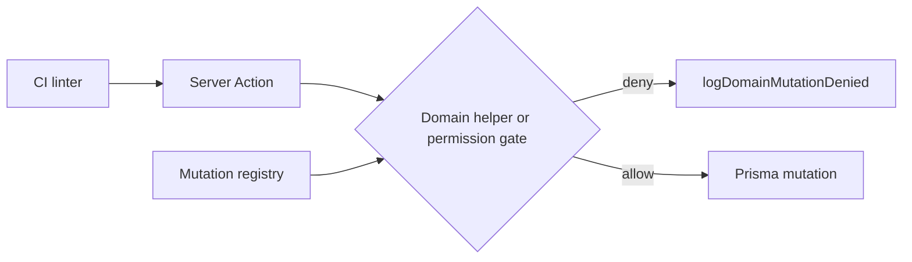

# Mutation Registry — Enterprise Sales Brief

**Product:** OS Kitchen  
**Audience:** Enterprise security, procurement, and IT reviewers  
**Policy:** `era16-mutation-registry-linter-v1`  
**Dashboard:** `/dashboard/platform/mutation-registry`

---

## Executive summary

OS Kitchen ships a **canonical mutation registry** that maps every governed server-side write to workspace RBAC permissions. The registry combines:

1. **Domain mutation helpers** — reusable gates (`requirePosMutation`, `requireIntegrationsActor`, etc.)
2. **Action operation catalog** — primary mutations from the `actions/` tree with permission bindings and risk tiers

Enterprise minimum: **100+ governed entries**. Current counts are visible live on the mutation registry dashboard.

---

## Why this matters for enterprise buyers

| Concern | OS Kitchen answer |
|--------|-------------------|
| Least privilege | Every mutation maps to a `PermissionKey` or documented exception |
| Auditability | Domain helpers log denials via `logDomainMutationDenied` |
| Regression prevention | CI linter blocks new ungoverned mutations in `actions/` |
| Procurement evidence | Dashboard + this doc for security questionnaire responses |

---

## Architecture

**Source modules:**

- `lib/permissions/domain-mutation-registry.ts` — domain helpers + unified registry
- `lib/permissions/action-mutation-registry.ts` — action operation catalog
- `lib/permissions/mutation-registry-linter.ts` — static compliance scan

---

## Risk tiers

Action operations are classified for security review prioritization:

| Tier | Examples | Review focus |
|------|----------|--------------|
| **critical** | Billing, refunds, workspace settings | SOC2 change control |
| **high** | Integrations, CRM, production | Role template validation |
| **medium** | Orders, kitchen bump | Staff role defaults |
| **low** | Read/preview operations | Informational |

---

## Documented exceptions

Some surfaces use capability matrices instead of a single permission key (copilot, feedback). These are explicitly listed in `mutation-access-policy.ts` — not hidden gaps.

---

## Demo script (5 minutes)

1. Open **Settings → Compliance** — note RBAC posture.
2. Navigate to **Platform → Mutation registry** (`/dashboard/platform/mutation-registry`).
3. Show total entry count (100+) and zero linter violations.
4. Expand a high-risk domain (e.g. `pos`, `integrations`) — point to critical operation count.
5. Reference CI: `npm run cert:mutation-registry-linter-era16`.

---

## Competitive moat

Competitors often document RBAC at the UI menu level. OS Kitchen maintains a **machine-verifiable registry** tied to server actions — the same layer attackers target. The linter ensures the registry cannot silently rot as the product ships new features.

---

## Next steps for pilot

- Export domain summary CSV from dashboard (procurement appendix).
- Map customer IdP groups to OS Kitchen staff templates.
- Run wave-4 RBAC cert before go-live: `npm run test:ci:mutation-access-consolidation:cert`.
