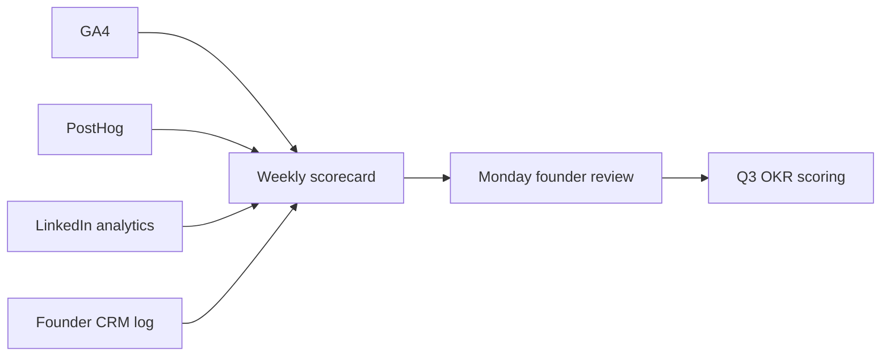

# MVP marketing dashboard — OS Kitchen

**Policy:** `mvp-marketing-dashboard-v1`  
**Date:** 2026-06-02  
**Owner:** Marketing + Founder  
**Scope:** **Manual weekly scorecard** for pre-pilot GTM — not a built product UI  
**Status:** **Template ready** — populate after GA4/PostHog env live · baseline **0 customers · NO-GO**  
**Related:** [`marketing-analytics-setup.md`](./marketing-analytics-setup.md) · [`linkedin-content-plan.md`](./linkedin-content-plan.md) · [`webinar-strategy.md`](./webinar-strategy.md) · [`q3-2026-okrs.md`](./q3-2026-okrs.md)

This document defines the **MVP marketing dashboard** — which metrics to track, where to pull them, how often to review, and what **not** to claim externally. Use a spreadsheet (Google Sheets / Notion) mirroring the sections below until a BI tool is justified.

**Honesty rule:** Dashboard numbers are **internal operating metrics** — not investor slides unless labeled with date range and “pre-revenue baseline.” Never extrapolate webinar registrations into ARR.

---

## Dashboard architecture



| Layer | Tool | Update frequency |
|-------|------|------------------|
| **Traffic & conversions** | GA4 | Weekly |
| **Product funnel** | PostHog | Weekly |
| **Social** | LinkedIn company + founder | Weekly |
| **Pipeline** | Manual CRM (spreadsheet) | Weekly |
| **Content** | Execution log + calendar | Bi-weekly |
| **Pilot gate** | `pilot-gono-go-summary.json` | Monthly |

**Setup:** Complete [`marketing-analytics-setup.md`](./marketing-analytics-setup.md) checklist before Week 0 baseline row.

---

## Weekly scorecard (copy to spreadsheet)

**Tab name:** `Weekly` · **Rows:** one per ISO week · **Owner:** Marketing

### Section A — Traffic (GA4)

| Metric | Source | Week N | WoW Δ | Q3 target (directional) |
|--------|--------|:------:|:-----:|:------------------------:|
| Sessions (all) | GA4 → Traffic | | | Baseline → +20% MoM |
| Sessions (`linkedin` / `organic` / `direct`) | GA4 → Acquisition | | | Track mix |
| `/pricing` views | GA4 → Pages | | | — |
| `/shopify` views | GA4 → Pages | | | — |
| `/vendor` views | GA4 → Pages | | | 2+/week from LinkedIn |
| `/demo` views | GA4 → Pages | | | — |
| `sign_up` events | GA4 → Events | | | — |
| `view_pricing` events | GA4 → Events | | | — |

### Section B — Product funnel (PostHog)

| Metric | Source | Week N | Notes |
|--------|--------|:------:|-------|
| `$pageview` (marketing + app) | PostHog | | |
| `signup_completed` | PostHog funnel | | |
| `onboarding_step_completed` | PostHog | | |
| `first_order_created` | PostHog | | Internal/demo only pre-pilot |
| Funnel drop-off (signup → step 1) | PostHog | | % |

### Section C — Social (LinkedIn)

| Metric | Source | Week N | Target |
|--------|--------|:------:|:------:|
| Company post impressions | LinkedIn analytics | | +20% MoM |
| Company engagement rate | LinkedIn | | — |
| Founder post impressions | LinkedIn profile | | 1 post/week |
| Profile → site clicks (UTM) | GA4 `utm_source=linkedin` | | 50+/month |
| Inbound DMs (design partner) | Manual count | | 3 conversations/month |

### Section D — Pipeline (manual CRM)

| Metric | Source | Week N | Q3 KR link |
|--------|--------|:------:|------------|
| Discovery calls held | Calendar / CRM | | O1 |
| LOI drafts sent | CRM | | O1 |
| LOIs signed | CRM + legal | | O1 · **0 baseline** |
| `/contact-sales` form fills | Email / form export | | O1 |
| Webinar registrations | Registration tool | | [`webinar-strategy.md`](./webinar-strategy.md) |
| Webinar attendees | Zoom report | | — |
| Vendor inbound (`/vendor`) | GA4 + email | | O2 marketplace |

### Section E — Content execution

| Metric | Source | Week N |
|--------|--------|:------:|
| LinkedIn company posts published | Content calendar | 2 |
| Founder posts published | Content calendar | 1 |
| Blog / changelog updates | Git log / CMS | — |
| Webinar scheduled (Y/N) | Calendar | — |

---

## Week 0 baseline template (fill once)

Capture **one row** when GA4 + PostHog first go live:

```text
Week 0 baseline — YYYY-MM-DD
GA4 sessions (7d): ___
sign_up events (7d): ___
PostHog signup_completed (7d): ___
LinkedIn company impressions (7d): ___
LOIs signed: 0
Pilot GO/NO-GO: NO-GO
Notes: Analytics env verified — consent banner PASS
```

Store screenshot in shared drive; reference in [`q3-2026-okrs.md`](./q3-2026-okrs.md) monthly review.

---

## Monthly rollup

**Tab name:** `Monthly` · **Owner:** Founder + Marketing

| Metric | Jul | Aug | Sep | Q3 OKR |
|--------|:---:|:---:|:---:|:------:|
| Total sessions | | | | Awareness |
| Total signups | | | | O1 support |
| LOIs signed (cumulative) | | | | **O1 KR** |
| Discovery calls (cumulative) | | | | O1 |
| Webinars delivered | | | | O4 / webinar strategy |
| `/vendor` sessions | | | | Marketplace |
| Organic search clicks (GSC) | | | | SEO (when GSC live) |

**Pilot gate row (read-only from artifact):**

| Check | Source | Jul | Aug | Sep |
|-------|--------|:---:|:---:|:---:|
| `pilot-gono-go-summary.json` decision | `npm run smoke:pilot-gono-go` or artifact | | | |
| P0 staging proof | Staging checklist | | | |
| LIVE integrations count | Integration registry | **0** | | |

---

## Review cadence

| Meeting | When | Attendees | Inputs | Outputs |
|---------|------|-----------|--------|---------|
| **Weekly marketing standup** | Monday 30 min | Founder, Marketing | Weekly scorecard A–E | Top post, blockers, next posts |
| **Monthly OKR score** | First Fri of month | Founder, PM | Monthly rollup + OKR doc | KR scores 0.0–1.0 |
| **Quarterly retro** | End of Sep | All | Full Q3 tabs | Q4 dashboard revision |

**Agenda (weekly):**

1. WoW traffic + signup delta (5 min)  
2. LinkedIn top/bottom post — why (5 min)  
3. Pipeline: calls, LOIs, DMs (10 min)  
4. Next week content from [`linkedin-content-plan.md`](./linkedin-content-plan.md) (5 min)  
5. Claims check — any external number published? (5 min)

---

## Alert thresholds (internal)

| Signal | Threshold | Action |
|--------|-----------|--------|
| Sessions drop >40% WoW | Red | Check deploy, consent banner, sitemap |
| Signups = 0 for 2 weeks | Yellow | Review signup flow, `/pricing` CTA |
| LOI stuck at 0 after 8 weeks outbound | Yellow | Revise ICP, partnership outreach |
| Forbidden claim in public post | Red | [`sales-safe-claims-registry.md`](./sales-safe-claims-registry.md) + correction |
| Webinar attendance <25% registered | Yellow | [`webinar-strategy.md`](./webinar-strategy.md) retro |

---

## What not to put on the dashboard

| Exclude | Why |
|---------|-----|
| **MRR / ARR** | Pre-revenue — $0 baseline |
| **“Customers”** | 0 signed LOI |
| **LIVE integration count as marketing KPI** | Engineering gate — 0 today |
| **Vanity followers without engagement** | Misleading pre-pilot |
| **ROI calculator outputs as fact** | Illustrative only — [`pricing-page`](../../components/marketing/pricing-page.tsx) |
| **Competitor dunk metrics** | Not measurable honestly |

---

## Spreadsheet structure (recommended)

| Tab | Purpose |
|-----|---------|
| `Weekly` | Sections A–E per ISO week |
| `Monthly` | Rollups + OKR linkage |
| `Baseline` | Week 0 snapshot + screenshots |
| `CRM` | Lead list: name, ICP score, stage, source UTM |
| `Content` | 4-week calendar from LinkedIn plan |
| `Webinars` | Registrations, attendance, follow-ups |

**Optional export:** Append weekly summary line to `artifacts/execution-log.txt` for audit trail (founder discretion).

---

## Q3 dashboard targets (from OKRs)

| OKR | Dashboard metrics |
|-----|-------------------|
| **O1** Design partner | LOIs signed, discovery calls, `/contact-sales` fills |
| **O2** Staging / pilot | Pilot artifact PASS rows (monthly, not weekly vanity) |
| **O3** LIVE integration | LIVE count from registry (monthly) |
| **O4** GTM execution | LinkedIn posts, webinar delivered, sessions trend |

Full KR definitions: [`q3-2026-okrs.md`](./q3-2026-okrs.md).

---

## Related documents

| Doc | Use |
|-----|-----|
| [`marketing-analytics-setup.md`](./marketing-analytics-setup.md) | Tool setup + event names |
| [`linkedin-content-plan.md`](./linkedin-content-plan.md) | Content KPIs |
| [`webinar-strategy.md`](./webinar-strategy.md) | Webinar tab fields |
| [`restaurant-partnerships-strategy.md`](./restaurant-partnerships-strategy.md) | Partnership-sourced leads |
| [`pilot-metrics-review-process.md`](./pilot-metrics-review-process.md) | Post-kickoff metrics (future) |

---

## Revision history

| Version | Date | Change |
|---------|------|--------|
| `mvp-marketing-dashboard-v1` | 2026-06-02 | Initial dashboard spec — Task 111 |

**Next action:** Create Google Sheet from Section A–E → capture Week 0 after analytics env live.
