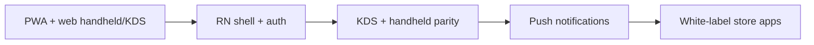
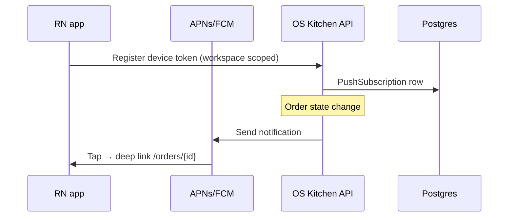

# Native mobile app plan — OS Kitchen

**Policy:** `native-mobile-app-plan-v1`  
**Date:** 2026-06-02  
**Owner:** Founder + Product + Engineering + Design  
**Scope:** **React Native** (iOS + Android) roadmap, **white-label** branded apps, and **push notifications** — not replacing PWA for pilot  
**Status:** **Plan only** — **no App Store / Play listing · PWA is production path · pilot NO-GO**

This document is the **forward-looking product plan** for a downloadable native app. It complements [`native-mobile-defer-rfc.md`](./native-mobile-defer-rfc.md), which formalizes **deferral through pilot**. Use this plan for enterprise RFPs, investor roadmap slides, and engineering sequencing **after** P0 web proof passes.

**Honesty rule:** Do **not** claim “native app available,” “download on App Store,” or “push alerts on mobile” until Phase 2+ ships and `verify-claims` passes. Today operators use **browser + PWA** — see [`MOBILE_OPS_EXPERIENCE.md`](./MOBILE_OPS_EXPERIENCE.md).

**Related:** [`app/branding/page.tsx`](../app/branding/page.tsx) · [`services/branding/white-label-service.ts`](../services/branding/white-label-service.ts) · [`PARTNER_WHITE_LABEL.md`](./PARTNER_WHITE_LABEL.md) · [`pen-test-plan.md`](./pen-test-plan.md) · `public/manifest.webmanifest`

---

## Executive summary

| Dimension | Today (June 2026) | Target (first native GA) |
|-----------|-------------------|---------------------------|
| **Primary mobile surface** | Responsive web + PWA | **Unchanged** until native beta proven |
| **React Native app** | **Not started** | Q2 2027 internal + TestFlight (indicative) |
| **White-label mobile** | Web white-label settings only | Enterprise add-on post-native shell |
| **Push (APNs / FCM)** | **Not shipped** | Order-ready + KDS bump (opt-in) |
| **Offline** | Server-side POS queue (partial) | **Not** full SQLite sync in v1 |
| **Engineering headcount** | **1** | Native requires hire #2 or contractor |

**Safe headline today:** “Full kitchen ops on the devices you already own — install our PWA from the browser.”

**Forbidden today:** “Download our iOS/Android app,” “Native push notifications,” “App Store listing live.”

---

## Strategic posture

| Principle | Decision |
|-----------|----------|
| **Web-first forever** | Native augments; does not replace dashboard web |
| **Shared API** | No duplicate business logic — REST + existing session cookies / token bridge |
| **Pilot scope** | **Zero** native work until [`native-mobile-defer-rfc.md`](./native-mobile-defer-rfc.md) revisit triggers (≥2) |
| **White-label** | Reuse `white-label-service` tokens → RN theme + app icons |
| **Security** | Native = new pen-test surface — budget before GA |

---

## What ships today (web / PWA)

| Surface | Route / asset | Native parity target |
|---------|---------------|----------------------|
| Installable PWA | `manifest.webmanifest`, `sw.js` | N/A — keep improving |
| Handheld POS | `/dashboard/pos/handheld` | Phase 2 |
| KDS tablet | `/kds`, `/dashboard/kitchen/tablet` | Phase 2 |
| Driver mode | `/driver` | Phase 3 |
| White-label web | `/branding`, `/dashboard/settings/white-label` | Phase 4 (store binaries) |
| Push | — | Phase 3 |

Evidence: [`HANDHELD_ORDERING.md`](./HANDHELD_ORDERING.md) · [`native-mobile-defer-rfc.md`](./native-mobile-defer-rfc.md).

---

## React Native architecture (proposed)

### Monorepo layout

| Package | Purpose |
|---------|---------|
| `apps/mobile` | Expo SDK 52+ (managed workflow) — iOS + Android |
| `packages/mobile-ui` | Shared components (tokens from design system) |
| `packages/api-client` | Typed client from OpenAPI manifest — `lib/api/openapi-manifest.json` |

### Tech choices

| Layer | Choice | Rationale |
|-------|--------|-----------|
| Framework | **React Native + Expo** | OTA updates for ops fixes; single team skill (React) |
| Navigation | Expo Router | Aligns with Next.js mental model |
| Auth | Supabase Auth RN SDK + secure storage | Same IdP as web |
| State | TanStack Query | Match web data-fetch patterns |
| Payments | **WebView or deep link to web POS** | Avoid duplicating Stripe Terminal native SDK in v1 |
| CI | EAS Build + internal distribution | TestFlight / Play internal track |

### v1 feature scope (MVP)

| In scope | Out of scope v1 |
|----------|-----------------|
| Login + workspace switch | Full dashboard parity |
| KDS bump + station filter | Offline SQLite inventory |
| Handheld order list + send to kitchen | Native card-present SDK |
| Order-ready **push** (staff opt-in) | Drive-thru timer module |
| Deep link from push → order detail | Franchise multi-brand native builds |

---

## White-label mobile

### Web today

| Capability | Status | Path |
|------------|--------|------|
| Logo + primary color | Shipped (settings) | `white-label-service.ts` |
| Branded manifest (PWA) | Shipped | `/branding` |
| Custom domain storefront | Partial | Enterprise |

### Native white-label (Phase 4)

| Deliverable | Description |
|-------------|-------------|
| **Flavor matrix** | `com.oskitchen.{partnerSlug}` bundle IDs — max 5 partners in v1 |
| **Asset pipeline** | Export icons/splash from branding API → EAS `app.config` per tenant |
| **Legal** | Partner is **data controller** for their staff app listing — DPA addendum |
| **Store submission** | OS Kitchen ops runs App Store Connect / Play Console per partner (fee pass-through) |
| **OTA theming** | JS bundle theme tokens — not store resubmit for color tweaks |

**Enterprise gate:** `ENTERPRISE` plan + signed white-label SOW — see [`PARTNER_WHITE_LABEL.md`](./PARTNER_WHITE_LABEL.md).

**Forbidden:** “Your own branded app in the store” before Phase 4 contract + binary shipped.

---

## Push notifications

### Use cases (prioritized)

| # | Event | Audience | Channel |
|---|-------|----------|---------|
| 1 | Order ready for pickup | FOH handheld | APNs / FCM |
| 2 | KDS bump / expo delay | Kitchen lead | APNs / FCM |
| 3 | Low inventory alert | Manager | APNs / FCM (digest) |
| 4 | Co-pilot exception | Owner | **Defer** — email first |

### Architecture

| Component | Path (proposed) |
|-----------|-----------------|
| Device registry | `POST /api/mobile/push/register` |
| Sender service | `services/notifications/mobile-push-service.ts` (future) |
| Preferences | `/dashboard/settings/notifications` — per role |
| Consent | Opt-in on first launch + settings toggle (GDPR / UK) |

### Policy

| Rule | Detail |
|------|--------|
| Opt-in default | **Off** until user enables |
| PII in payload | Order # only — no customer phone in notification body |
| Quiet hours | Respect workspace timezone — no 2am bumps |
| Web push | **Defer** — native first; PWA push is Phase 5 |

---

## Phased roadmap

| Phase | Timeline | Deliverable | Unlocks sales |
|:-----:|----------|-------------|---------------|
| **0** | Now | This plan + defer RFC | “Roadmap — PWA today” |
| **1** | Q4 2026 | RN spike: auth + KDS read-only (internal) | Nothing public |
| **2** | Q1 2027 | Handheld POS parity + TestFlight beta | “Beta with select pilots” |
| **3** | Q2 2027 | Push (order-ready) + production GA | “Native app available” |
| **4** | H2 2027 | White-label store binaries (1–3 partners) | Enterprise SOW |
| **5** | 2028+ | Web Push + offline v2 | Parity with competitors |

**Gate:** Phase 1 starts only when [`native-mobile-defer-rfc.md`](./native-mobile-defer-rfc.md) revisit triggers are met (≥2) **and** P0 staging proof is GO.

---

## Revisit triggers (from defer RFC)

| # | Trigger |
|---|---------|
| 1 | ≥2 paid pilot LOIs require App Store app |
| 2 | PWA install &lt;50% on tablets after CS training |
| 3 | Enterprise MDM mandate on &gt;$100k ARR deal |
| 4 | P0 + Tier 2 proof PASS |
| 5 | Web pen test PASS |

---

## Engineering checklist (Phase 1 spike)

| # | Task | Owner |
|---|------|-------|
| 1 | Expo app scaffold in `apps/mobile` | Eng |
| 2 | Supabase auth + secure refresh | Eng |
| 3 | KDS poll `/api/kitchen/...` or RSC proxy BFF | Eng |
| 4 | EAS internal build pipeline | Eng |
| 5 | Threat model doc (OWASP MASVS L1) | Security |
| 6 | App Store / Play developer accounts | Ops |
| 7 | Push spike (FCM only on Android first) | Eng |

---

## Sales & marketing guardrails

| Question | Approved answer |
|----------|-----------------|
| “Do you have an app?” | “Use our PWA on iPad or phone — full-screen from the browser. Native app is on the 2027 roadmap.” |
| “White-label app?” | “Web white-label today; branded App Store builds are Enterprise roadmap Phase 4.” |
| “Push when order is ready?” | “Not on mobile yet — in-app and email notifications on web; native push planned Q2 2027.” |
| vs Toast/Square native | [`toast-gap-analysis.md`](./toast-gap-analysis.md) — we compete on unified ops, not app store presence day-one |

Enforced: `npm run verify-claims` · [`sales-safe-claims-registry.md`](./sales-safe-claims-registry.md)

---

## Metrics (post-GA)

| Metric | Target |
|--------|--------|
| TestFlight beta operators | 3 |
| D7 retention (native KDS users) | &gt;60% |
| Push opt-in rate | &gt;40% of handheld users |
| Crash-free sessions | &gt;99.5% |
| White-label apps live | 1 partner |

**June 2026 baseline:** All **SKIPPED** — no native binary.

---

## Related documents

| Doc | Use |
|-----|-----|
| [`native-mobile-defer-rfc.md`](./native-mobile-defer-rfc.md) | Pilot deferral decision |
| [`MOBILE_OPS_EXPERIENCE.md`](./MOBILE_OPS_EXPERIENCE.md) | Web mobile ops |
| [`MOBILE_KDS_DRIVER_MODES.md`](./MOBILE_KDS_DRIVER_MODES.md) | KDS / driver routes |
| [`PARTNER_WHITE_LABEL.md`](./PARTNER_WHITE_LABEL.md) | Partner branding |
| [`international-expansion-plan.md`](./international-expansion-plan.md) | GDPR for push consent |

---

## Revision history

| Version | Date | Change |
|---------|------|--------|
| `native-mobile-app-plan-v1` | 2026-06-02 | Initial plan — Market Domination feature 37 |

**Next action:** Revisit defer RFC triggers quarterly · do not open `apps/mobile` until Phase 1 gate.
