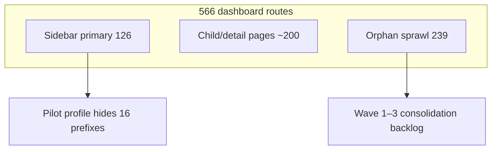

# Navigation sprawl audit — OS Kitchen

**Policy:** `nav-sprawl-audit-v1`  
**Date:** 2026-06-02  
**Owner:** Product + Engineering  
**Method:** Sidebar IA vs filesystem route inventory — extends [`navigation-audit.md`](./navigation-audit.md)  
**Canonical IA:** `lib/navigation/final-navigation-groups.ts` · **Pilot filter:** `lib/navigation/release-navigation.ts`

This document analyzes **nav sprawl** — routes that exist in the App Router but are absent from the default sidebar, duplicated across modules, or hidden only by env profile. It answers: *what should pilots see, what stays deep-link only, and what to consolidate next.*

**Honesty rule:** Sprawl is an engineering surface-area fact — not a sales claim. Do not tell prospects “566 modules” without maturity labels; use pilot profile + limitation sheet.

---

## Executive summary

| Metric | Count | Notes |
|--------|------:|-------|
| Dashboard routes (`/dashboard/*`) | **566** | Full filesystem scan — [`navigation-audit.md`](./navigation-audit.md) |
| Sidebar links (`FINAL_NAVIGATION_GROUPS`) | **126** | 12 top-level groups |
| **Sprawl gap** (routes not primary sidebar entry) | **~440** | Includes dynamic `[id]` detail pages — expected |
| **Orphan bucket** (“Other modules”) | **239** | Largest consolidation target |
| Pilot-hidden sidebar prefixes | **16** | `PILOT_HIDDEN_HREF_PREFIXES` |
| Platform admin (out of tenant nav) | **57** | Correct isolation |

**Verdict:** Sprawl is **intentional breadth** for engineering + demo depth. **Pilot profile** (`NEXT_PUBLIC_NAV_RELEASE_PROFILE=pilot`) is the primary GTM mitigation today — not route deletion.

---

## Sprawl definition

| Term | Meaning |
|------|---------|
| **In-sidebar** | `href` listed in `FINAL_NAVIGATION_GROUPS` |
| **Deep-link only** | Route exists; reachable via URL, command palette, or in-app links — not in default sidebar |
| **Orphan (sprawl)** | No sidebar entry **and** no parent module landing in sidebar — user must guess URL or search |
| **Pilot-hidden** | Removed from sidebar when `NavReleaseProfile === "pilot"` — route still exists |
| **Platform-only** | `/platform/*` — super-admin; never tenant sidebar |

---

## Sidebar vs route coverage



| Coverage class | Est. routes | Examples |
|----------------|------------:|----------|
| Sidebar landing + children | ~180 | `/dashboard/orders` → `/dashboard/orders/[id]` |
| Linked from sidebar module | ~90 | `/dashboard/analytics/food-cost` from Insights |
| **Orphan sprawl** | **239** | `/dashboard/calendar`, franchise, commissary deep tools |
| Demo / preview / internal | ~15 | `/dashboard/demo/*`, visual-test |
| Settings deep tree | ~42 | Under `/dashboard/settings/*` without sidebar leaf |

---

## Orphan buckets (priority order)

From [`navigation-audit.md`](./navigation-audit.md) category matrix — **In sidebar? = Orphan / deep link**.

| Rank | Bucket | Routes | Sprawl risk | Pilot action |
|------|--------|-------:|:-----------:|--------------|
| 1 | **Dashboard — Other modules** | 239 | High — demo confusion, sales overclaim | Hide via pilot profile; consolidate Wave 1 |
| 2 | **Settings & locations** | 65 | Medium — necessary but deep | Keep; improve Launch Wizard links |
| 3 | **Platform & developer** | 19 | Medium — power users only | Owner-only + internal group ✓ |
| 4 | **Demo, training & preview** | 15 | Medium — staging noise | Collapse under `/dashboard/demo` |
| 5 | Storefront & customers (partial) | ~20 orphan | Low — many are `[id]` pages | OK as detail routes |

---

## Duplicate & confusing paths

Routes that increase sprawl without unique IA — **consolidation candidates**.

| Issue | Routes | Recommendation |
|-------|--------|----------------|
| Dual order hub | `/dashboard/order-hub` **and** `/dashboard/orders/hub` | Pick canonical; redirect other (Wave 1) |
| Customer dedupe | `/dashboard/customers/dedupe` + `/deduplication` | Merge to one route |
| Integration entry | `/dashboard/integrations` vs `/dashboard/sales-channels` | Sidebar uses sales-channels; document alias |
| Gift cards | `/dashboard/gift-cards` + storefront gift-cards | Cross-link; single primary in Customers |
| Loyalty | customers/loyalty + storefront/loyalty | Business-mode primary; hide duplicate in pilot |
| Referrals | `/dashboard/referrals` + storefront/referrals | Same pattern as loyalty |
| Analytics sprawl | 35+ `/dashboard/analytics/*` | Insights group covers 8; rest deep-link + maturity badges |

---

## Pilot navigation profile

**Env:** `NEXT_PUBLIC_NAV_RELEASE_PROFILE=pilot` (default staging/sales demo)  
**Code:** `services/modules/module-release-service.ts` → `filterNavGroupsForPilotRelease()`

### Hidden prefixes (sidebar only)

| Prefix | Why hidden |
|--------|------------|
| `/dashboard/forecast` | BETA AI — not pilot-safe headline |
| `/dashboard/purchasing` | ERP-adjacent depth |
| `/dashboard/costing` | Requires recipe accuracy |
| `/dashboard/reports` | Enterprise reporting sprawl |
| `/dashboard/copilot` | Internal AI experiments |
| `/dashboard/meal-plans` | BETA subscriptions |
| `/dashboard/catering-quotes` | Niche workflow |
| `/dashboard/training` | CS/onboarding — not daily ops |
| `/dashboard/partner` | Partner portal |
| `/dashboard/developer` | API keys — owner deep link |
| `/dashboard/executive` | Executive dashboard — demo separately |
| `/dashboard/import-export` | Migration power tool |
| `/dashboard/growth` | Internal growth experiments |
| `/dashboard/beta-applications` | Internal |
| `/dashboard/implementation/enterprise` | Enterprise RFP scope |

**Gap:** Pilot profile hides **16 prefixes** but **239 orphan routes** remain URL-accessible — sales demos should use **owner workspace + pilot env**, not `full` profile.

### Enable for staging / sales demo

```bash
# .env.staging / Vercel preview for design partners
NEXT_PUBLIC_NAV_RELEASE_PROFILE=pilot
```

Verify in browser: Insights lacks Forecast/Executive/Copilot; Setup lacks Training when filtered.

---

## Sprawl by sidebar group (full profile)

| Group | Sidebar links | Related route tree (est.) | Sprawl ratio |
|-------|:-------------:|:-------------------------:|:------------:|
| Core | 6 | ~25 | Low |
| Operations | 13 | ~45 | Medium |
| Commerce | 18 | ~80 | High (integrations) |
| Menus | 7 | ~35 | Medium |
| Customers | 8 | ~57 | High (CRM depth) |
| Inventory & finance | 19 | ~90 | High |
| Food safety | 6 | ~8 | Low |
| Marketing | 2 | ~12 | Medium |
| Insights | 15 | ~35 | High (analytics) |
| Setup | 9 | ~25 | Medium |
| Admin | 15 | ~65 | High (settings) |
| Internal | 4 | ~19 | OK (owner-only) |

**Highest sprawl ratio:** Commerce, Customers, Inventory & finance, Insights.

---

## Consolidation waves (backlog)

### Wave 1 — Quick wins (1–2 sprints)

| Action | Routes affected | Owner |
|--------|----------------:|-------|
| Canonical order hub redirect | 1 duplicate | Engineering |
| Merge customer dedupe paths | 1 | Engineering |
| Add `robots` noindex on visual-test routes | 4 | Engineering |
| Document pilot env on sales demo checklist | — | CS |
| Expand `PILOT_HIDDEN_HREF_PREFIXES` for franchise/commissary deep links | ~12 | Product |

### Wave 2 — IA cleanup (Q3)

| Action | Routes affected | Owner |
|--------|----------------:|-------|
| Collapse `/dashboard/demo/*` + training under Setup hub | ~15 | Product + Eng |
| Analytics: tier-1 in sidebar, tier-2 behind “Advanced analytics” hub | ~20 | Product |
| Settings: grouped settings index with search | ~30 | Design |
| Command palette as primary orphan discovery | ~440 | Eng |

### Wave 3 — Enterprise / franchise (post-pilot)

| Action | Notes |
|--------|-------|
| Franchise + multi-brand routes | Keep deep-link; enterprise SOW only |
| Platform admin | Stay outside tenant nav |
| Commissary transfers | Commissary ICP — link from Operations when pilot proves |

---

## Maturity & visibility (sprawl safety)

Sprawl is safer when maturity is visible:

| Mechanism | File | Purpose |
|-----------|------|---------|
| Module readiness badges | `dashboard-nav.tsx` | LIVE / BETA / PLACEHOLDER on sidebar |
| Nav maturity rules | `nav-maturity-governance.ts` | Prefix → maturity mapping |
| Role filter | `nav-role-filter.ts` | STAFF vs OWNER strips |
| Era 17 sweep | `nav-maturity-sweep-era17-policy.ts` | CI proof for preview routes |

**Sales rule:** If a route is PLACEHOLDER, it must not appear in pilot sidebar even under `full` profile — track in Wave 1 backlog.

---

## GTM & demo guidance

| Audience | Nav profile | Show |
|----------|-------------|------|
| Design partner pilot | `pilot` | Today, Orders, POS, KDS, Production, Storefront, Integrations health |
| Sales demo (honest) | `pilot` | Same + explicit BETA badges |
| Engineering dogfood | `full` | All sidebar groups |
| Investor deep dive | `full` + disclaimer | Breadth as **roadmap surface**, not LIVE claims |

**Do not:** Paste `/dashboard/*` URLs from `full` profile into marketing. **Do:** Link `/demo` and Today Command Center.

Cross-ref: [`sales-limitation-sheet.md`](./sales-limitation-sheet.md) · [`demo-video-script-today.md`](./demo-video-script-today.md)

---

## Verification commands

```bash
# Regenerate full route inventory
node scripts/generate-navigation-audit.mjs

# Nav maturity sweep (CI)
npm run smoke:nav-maturity-sweep-era17

# Count sidebar links
grep -c 'href: "/dashboard' lib/navigation/final-navigation-groups.ts
```

---

## Success metrics (sprawl reduction)

Track quarterly — internal only:

| Metric | Baseline (Jun 2026) | Q3 target |
|--------|--------------------:|----------:|
| Orphan bucket routes | 239 | ≤180 |
| Duplicate hub paths | 2+ | 0 |
| Pilot-hidden prefixes | 16 | 24 |
| Sidebar links (full profile) | 126 | ≤120 after dedupe |
| Sales demos on `pilot` profile | Unknown | 100% |

---

## Related docs

| Doc | Use |
|-----|-----|
| [`navigation-audit.md`](./navigation-audit.md) | Full 566-route inventory + appendix |
| [`NAVIGATION_TAXONOMY_CLEANUP.md`](./NAVIGATION_TAXONOMY_CLEANUP.md) | Taxonomy consolidation |
| [`NAVIGATION_AND_MODULE_UX_AUDIT.md`](./NAVIGATION_AND_MODULE_UX_AUDIT.md) | UX patterns |
| [`sales-demo-environment.md`](./sales-demo-environment.md) | Task 97 — demo env setup |
| Task 42 | Navigation audit (route census) |
| Task 71 | This document |

---

## Audit metadata

| Field | Value |
|-------|-------|
| Auditor | 122-task cycle #71 |
| Sprawl gap | ~440 / 566 dashboard routes outside primary sidebar |
| Next review | After Wave 1 redirect PR or pilot profile expansion |
