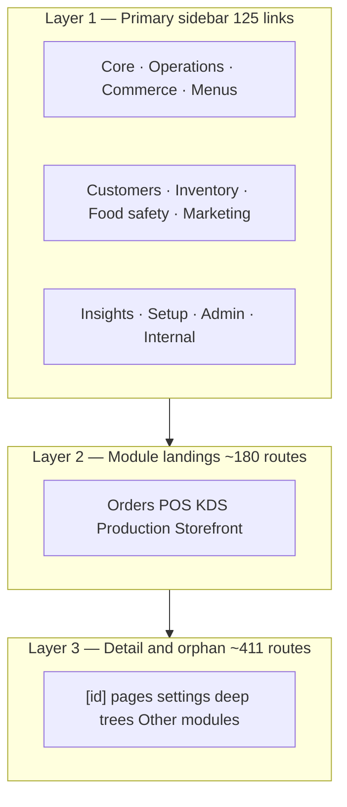

# Navigation IA audit — OS Kitchen

**Version:** 1.0 · **June 2026  
**Policy:** `navigation-ia-audit-v1`  
**Method:** Filesystem scan of `app/**/page.tsx` + maturity rules in `lib/navigation/nav-maturity-governance.ts`  
**Canonical sidebar IA:** `lib/navigation/final-navigation-groups.ts`  
**Full route appendix:** [`navigation-audit.md`](./navigation-audit.md) (regenerate with `node scripts/generate-navigation-audit.mjs`)

---

## Executive summary

| Metric | Count | Notes |
|--------|------:|-------|
| **Total App Router pages** | **801** | `page.tsx` files under `app/` (route groups stripped) |
| Dashboard (`/dashboard/*`) | 591 | Operator shell — primary IA scope |
| Non-dashboard | 210 | Marketing, storefront guest, vendor, platform, auth |
| Sidebar primary links | 125 | 12 groups in `FINAL_NAVIGATION_GROUPS` |
| Routes under **Preview** maturity | 60 | Hidden unless “Show all modules” |
| Routes under **Internal** maturity | 34 | GTM / platform surfaces only |
| **Duplicate hub paths** | 7 pairs | Consolidation backlog (Wave 1) |
| Preview maturity rule prefixes | 26 | Longest-prefix wins in nav governance |

**Verdict:** OS Kitchen maps **801 pages** across a **12-group sidebar IA**. ~74% of dashboard routes are **deep-link or orphan sprawl** (not primary sidebar entries). Pilot GTM relies on `NEXT_PUBLIC_NAV_RELEASE_PROFILE=pilot` + maturity badges — not route deletion.

---

## IA layers



| Layer | Est. routes | Discovery |
|-------|------------:|-----------|
| Sidebar primary | 125 | Always visible (profile-filtered) |
| Module children | ~180 | Linked from sidebar parent |
| Deep-link / orphan | ~411 | URL, command palette, in-app links |
| Non-dashboard | 210 | Marketing, guest storefront, vendor |

---

## Page map by surface (801)

| Surface | Routes | Primary audience | In default sidebar? |
|---------|-------:|------------------|:-------------------:|
| Dashboard — Other modules | 248 | Operator (power) | Orphan / deep link |
| Dashboard — Settings & locations | 68 | Owner / admin | Partial |
| Dashboard — Storefront & customers | 57 | Owner / marketing | Partial |
| Platform admin | 57 | Super-admin | N/A (tenant isolated) |
| Other public & utility | 45 | Public / mixed | N/A |
| Dashboard — Integrations & channels | 44 | Owner | Partial |
| Dashboard — Analytics & reports | 38 | Owner / manager | Partial |
| Dashboard — Menu, inventory & purchasing | 28 | Ops / chef | Partial |
| Public marketing & ICP | 24 | Prospect | N/A |
| Storefront (guest) | 22 | Guest diner | N/A |
| Trust, legal & resources | 21 | Public | N/A |
| Dashboard — Platform & developer | 20 | Owner / eng | Orphan |
| Dashboard — Staff & labor | 18 | Manager | Partial |
| Developers & help | 17 | Public / dev | N/A |
| Dashboard — Demo, training & preview | 15 | CS / demo | Orphan |
| Dashboard — Kitchen & production | 15 | Kitchen ops | Partial |
| Vendor portal | 13 | Marketplace vendor | N/A |
| Dashboard — Marketplace | 12 | Owner B2B | Partial |
| Dashboard — POS & KDS | 11 | Cashier / expo | Partial |
| Dashboard — Food safety & compliance | 8 | Compliance lead | Partial |
| Dashboard — Orders & receivables | 6 | Ops | Partial |
| Visual test (internal) | 4 | Engineering | N/A — noindex |
| Dashboard — Today & command center | 3 | Owner (home) | Partial |
| Auth | 3 | All users | N/A |
| Standalone operator surfaces | 2 | KDS / driver | N/A |
| B2B pay flows | 2 | Billing | N/A |

Counts from June 2026 filesystem scan. Category totals sum to 801.

---

## Sidebar IA (12 groups)

Production groups in `lib/navigation/final-navigation-groups.ts`:

| # | Group | Sidebar links | Highest sprawl module |
|---|-------|:-------------:|---------------------|
| 1 | Core | 6 | Today, Orders, POS |
| 2 | Operations | 13 | Production, KDS, Routes |
| 3 | Commerce | 18 | Integrations, Sales channels |
| 4 | Menus | 7 | Menu builder |
| 5 | Customers | 8 | CRM depth |
| 6 | Inventory & finance | 19 | Costing, purchasing |
| 7 | Food safety | 6 | Compliance |
| 8 | Marketing | 2 | Campaigns |
| 9 | Insights | 15 | Analytics tree |
| 10 | Setup | 9 | Onboarding |
| 11 | Admin | 15 | Settings |
| 12 | Internal | 4 | Owner-only tools |

**Pilot profile** (`NEXT_PUBLIC_NAV_RELEASE_PROFILE=pilot`) hides 16 href prefixes via `filterNavGroupsForPilotRelease()` — see [`nav-sprawl-audit.md`](./nav-sprawl-audit.md).

---

## Duplicate and confusing paths

Routes that create IA debt — **Wave 1 consolidation** targets.

| Issue | Routes | Canonical pick | Status |
|-------|--------|----------------|--------|
| Dual order hub | `/dashboard/order-hub` · `/dashboard/orders/hub` | `/dashboard/order-hub` | Redirect candidate |
| Customer dedupe | `/dashboard/customers/dedupe` · `/dashboard/customers/deduplication` | Single path | Merge |
| Integration entry | `/dashboard/integrations` · `/dashboard/sales-channels` | Sidebar uses **sales-channels** | Document alias |
| Gift cards | `/dashboard/gift-cards` · `/dashboard/storefront/gift-cards` | Storefront primary in Commerce | Cross-link |
| Loyalty | `/dashboard/customers/loyalty` · `/dashboard/storefront/loyalty` | Business-mode primary | Pilot hides duplicate |
| Referrals | `/dashboard/referrals` · `/dashboard/storefront/referrals` | Storefront primary | Cross-link |
| Reservations | `/dashboard/reservations` · `/dashboard/storefront/reservations` | Storefront primary (both Preview) | Unify copy |

**Analytics sprawl:** 35+ `/dashboard/analytics/*` routes — Insights sidebar covers 8; remainder are deep-link with maturity badges.

---

## Preview routes (60 pages)

Preview exposure = hidden from focused sidebar unless operator enables **Show all modules** (`navScopeAll`). UI must show `PageMaturityRouteNotice` or inline honesty copy.

### Maturity rule prefixes (26)

| Prefix | Matrix family |
|--------|---------------|
| `/dashboard/settings/security/sso` | Enterprise SSO pilot |
| `/dashboard/inventory/pos-impacts` | Inventory counts and waste |
| `/dashboard/costing/theft` | Costing and margin |
| `/dashboard/marketing/holiday-packages` | Growth campaigns |
| `/dashboard/integrations/7shifts` | 7shifts scheduling sync |
| `/dashboard/integrations/doordash` | DoorDash marketplace BETA |
| `/dashboard/integrations/grubhub` | Grubhub marketplace BETA |
| `/dashboard/integrations/uber-eats` | Uber Eats marketplace BETA |
| `/dashboard/integrations/extensions` | App marketplace extensions |
| `/dashboard/integrations/outbound-webhooks` | Partner outbound webhooks |
| `/dashboard/integrations/oauth-apps` | OAuth sandbox apps |
| `/dashboard/gift-cards` | Gift cards |
| `/dashboard/customers/loyalty` | Loyalty programs |
| `/dashboard/storefront/gift-cards` | Storefront gift cards |
| `/dashboard/storefront/loyalty` | Storefront loyalty |
| `/dashboard/meal-plans` | Meal subscriptions |
| `/dashboard/pos/tabs` | Bar tabs |
| `/dashboard/pos/handheld` | Handheld ordering |
| `/dashboard/tables` | Tables and restaurant service |
| `/dashboard/copilot` | Copilot / AI insights |
| `/dashboard/forecast` | Forecasting |
| `/dashboard/storefront/reservations` | Reservations |
| `/dashboard/reservations` | Reservations |
| `/dashboard/food-safety` | Food safety and compliance |
| `/dashboard/staff/payroll` | Payroll export |
| `/dashboard/marketing/email-campaigns` | Growth campaigns |

### Other non-default exposures

| Exposure | Rule prefixes | Mapped routes |
|----------|---------------|-------------:|
| **Placeholder** | `/dashboard/integrations/uber-direct`, `/dashboard/routes/uber-direct` | 2 |
| **Hidden default** | `/dashboard/go-live`, `/dashboard/franchise`, `/dashboard/executive`, … | 12 |
| **Internal** | `/dashboard/demo/scenarios`, `/dashboard/growth`, `/dashboard/developer`, … | 34 |

### Path-segment “preview” routes (filesystem)

32 routes contain `preview`, `demo`, `training`, or `visual-test` in the URL (e.g. `/dashboard/demo/*`, `/visual-test/*`). These are **engineering/demo surfaces** — exclude from sitemap and sales demos.

---

## Orphan sprawl (248 routes)

Largest bucket: **Dashboard — Other modules** — no sidebar parent. Examples:

- `/dashboard/accounting/*`, `/dashboard/audit-logs`, `/dashboard/brands`
- `/dashboard/calendar`, `/dashboard/commissary/*`, `/dashboard/franchise/*`
- `/dashboard/implementation/*`, `/dashboard/playbooks/*`

**Mitigation today:** pilot nav profile + command palette + Launch Wizard deep links. **Target (Q3):** reduce orphan bucket from 248 → ≤180 — see [`nav-sprawl-audit.md`](./nav-sprawl-audit.md) Wave 1–3.

---

## Sales-safe IA guidance

| Audience | Nav profile | Safe entry points |
|----------|-------------|-------------------|
| Design partner pilot | `pilot` | `/dashboard/today`, Orders, POS, KDS, Production, Integrations health |
| Sales demo | `pilot` | Same + explicit Preview/BETA badges |
| Engineering dogfood | `full` | All 12 sidebar groups |
| Investor deck | `full` + disclaimer | Breadth = roadmap surface, not LIVE claims |

**Do not** paste orphan `/dashboard/*` URLs into marketing. **Do** link `/demo`, `/pricing`, `/trust`.

Cross-ref: [`sales-limitation-sheet.md`](./sales-limitation-sheet.md) · [`feature-maturity-matrix.md`](./feature-maturity-matrix.md)

---

## Verification & regeneration

```bash
# Regenerate full 801-route appendix (docs/navigation-audit.md)
node scripts/generate-navigation-audit.mjs

# Nav maturity CI sweep
npm run smoke:nav-maturity-sweep-era17
npm run test:ci:nav-maturity-sweep-era17

# Count sidebar hrefs
grep -c 'href: "/dashboard' lib/navigation/final-navigation-groups.ts
```

---

## Related docs

| Document | Purpose |
|----------|---------|
| [`navigation-audit.md`](./navigation-audit.md) | Full route inventory appendix (801 paths) |
| [`nav-sprawl-audit.md`](./nav-sprawl-audit.md) | Sprawl gap, pilot hidden prefixes, consolidation waves |
| [`NAVIGATION_AND_MODULE_UX_AUDIT.md`](./NAVIGATION_AND_MODULE_UX_AUDIT.md) | UX patterns |
| [`NAVIGATION_TAXONOMY_CLEANUP.md`](./NAVIGATION_TAXONOMY_CLEANUP.md) | Taxonomy consolidation plan |

---

## Audit metadata

| Field | Value |
|-------|-------|
| Task | DES-01 — navigation IA audit |
| Pages mapped | **801** |
| Duplicate pairs flagged | **7** |
| Preview routes (maturity) | **60** (26 rule prefixes) |
| Next review | After Wave 1 redirect PR or DES-09 nav maturity hide |
