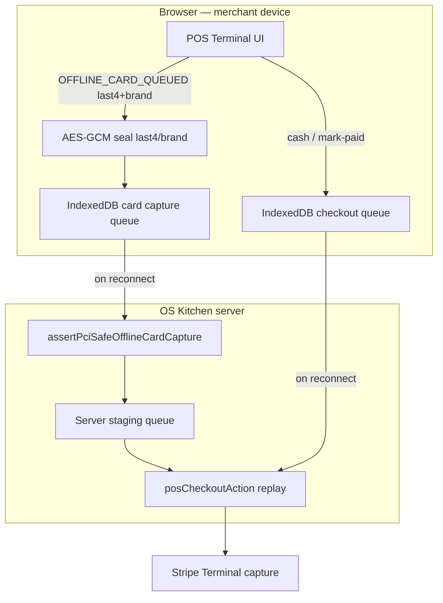

# Offline POS queue — PCI scope review

**Policy:** `offline-pos-pci-review-absolute-final-v1`  
**Date:** 2026-06-06  
**Owner:** Engineering + Compliance  
**Scope:** PCI-DSS boundary review for browser offline POS checkout queue and card-metadata staging  
**Status:** **Engineering review complete — not QSA-certified · pilot NO-GO for offline card**

This document is the **formal PCI review** for Task 39: what cardholder data (CHD) may touch OS Kitchen, what is blocked, how device-local encryption works, and what remains before any “offline card” sales claim.

**Authority chain:** This review supersedes informal notes in UI copy. Strategic roadmap: [`docs/offline-pos-plan.md`](./offline-pos-plan.md). Operator steps: [`POS_OFFLINE_MODE.md`](./POS_OFFLINE_MODE.md). Wiring: [`docs/pos-offline-queue-era170-setup.md`](./pos-offline-queue-era170-setup.md).

**Related:** [`POS_ARCHITECTURE.md`](./POS_ARCHITECTURE.md) · [`pos-offline-queue-era170-setup.md`](./pos-offline-queue-era170-setup.md) · [`sales-limitation-sheet.md`](./sales-limitation-sheet.md) · [`sales-safe-claims-registry.md`](./sales-safe-claims-registry.md)

---

## Executive summary

| Dimension | Finding |
|-----------|---------|
| **Full PAN / CVV / track data** | **Never stored** — blocked at validation layer |
| **Permitted offline card fields** | `last4`, `cardBrand`, opaque `paymentIntentId` / `stripeOfflineReference` |
| **Device storage** | IndexedDB queues — AES-GCM seal when Web Crypto available |
| **Server storage** | Staged metadata only — `assertPciSafeOfflineCardCapture` on ingest |
| **PCI SAQ path (target)** | **SAQ A-EP or SAQ D** depending on Stripe Terminal scope — **not SAQ A** for POS card staging |
| **EMV store-and-forward** | **Out of scope** — Phase 4 roadmap per offline-pos-plan |
| **Production certification** | **Not granted** — cash queue BETA; card queue engineering preview only |
| **Sales claim** | “PCI-safe last4/brand staging” — **not** “PCI certified offline POS” |

**Safe headline:** “OS Kitchen never stores full card numbers — offline queue holds last4, brand, and Stripe opaque references until reconnect.”

**Forbidden:** “PCI Level 1 certified,” “EMV offline,” “Card works without connectivity,” “SAQ-A for POS.”

---

## Cardholder data boundary

### Never permitted (blocked in code)

| Data element | Enforcement | Code path |
|--------------|-------------|-----------|
| Primary Account Number (PAN) | Regex scan + field denylist | `lib/pos/offline-card-pci.ts` → `scanForForbiddenCardholderData` |
| CVV / CVC | Regex + forbidden keys | Same |
| Magnetic stripe / track | Regex + forbidden keys | Same |
| EMV chip payload | Forbidden key `emv`, `chipdata` | `assertPciSafeOfflineCardCapture` |

Forbidden keys rejected at ingest: `pan`, `cardnumber`, `cvv`, `cvc`, `track1`, `track2`, `magstripe`, `emv`, `chipdata`, and variants.

### Permitted offline card metadata

| Field | Max scope | Validation |
|-------|-----------|------------|
| `last4` | Exactly 4 digits | Stripped to digits, length check |
| `cardBrand` | 32 chars, no PAN patterns | `scanForForbiddenCardholderData` |
| `paymentIntentId` | Stripe `pi_*` opaque id | Format regex |
| `stripeOfflineReference` | ≤255 chars, no PAN patterns | Length + scan |
| `amountCents`, `registerId`, `offlineSaleId` | Operational — not CHD | Type coercion |

Unit proof: `tests/unit/offline-pos-pci-encryption.test.ts`, `lib/pos/offline-card-pci.ts`.

---

## Data flow (offline queue)

### Queue surfaces

| Queue | IndexedDB name | Contents | PCI class |
|-------|----------------|----------|-----------|
| Checkout | `kitchenos-offline-pos` | Order lines, payment mode, register — **no CHD** | Operational |
| Card capture | `kitchenos-offline-card` | Sealed last4, brand, optional `pi_*` | **PCI-adjacent metadata** |

Wiring: `lib/pos/offline-pos-queue.ts`, `lib/pos/offline-card-client-queue.ts`, `services/pos-offline-queue.ts`, `services/pos/offline-card-service.ts`.

---

## Device-local encryption

| Property | Detail |
|----------|--------|
| Algorithm | AES-GCM v1 (`offline-pci-v1` key in `kitchenos-offline-pci-keys`) |
| Fallback | **Blocked** — `OFFLINE_CARD_QUEUED` disabled when Web Crypto / IndexedDB unavailable (no base64 noop) |
| Fields sealed | `last4`, `cardBrand`, `paymentIntentId` |
| Key scope | **Per browser profile** — not synced across devices |
| Rotation | Not implemented — clear IndexedDB on device wipe |

**Limitation:** Device-local encryption protects against casual inspection of IndexedDB — **not** a substitute for HSM or PCI P2PE. Treat as defense-in-depth for last4/brand only.

Code: `lib/pos/offline-pci-local-encryption.ts` → `sealOfflinePciField`, `sealOfflinePciRecord`.

---

## Server-side controls

| Control | Implementation |
|---------|----------------|
| Ingest validation | `assertPciSafeOfflineCardCapture` before staging |
| Payment mode guard | `posPaymentAllowedWhileOffline` blocks false PAID for card |
| Idempotent replay | `offlineSaleId` on checkout payload |
| Auto-sync retry | Max 3 retries — `OFFLINE_POS_AUTO_SYNC_RETRY_LIMIT` |
| Conflict handling | `conflict` / `manual_review` — staff resolution required |

Policy id: `pos-offline-queue-v2` — `services/pos-offline-queue.ts`.

---

## PCI SAQ scope assessment (engineering opinion — not legal advice)

| Surface | Likely SAQ | Notes |
|---------|------------|-------|
| Storefront Stripe Checkout | **SAQ A** | Card data on Stripe hosted fields — no CHD on OS Kitchen |
| POS cash offline queue | **Out of PCI card scope** | No card data |
| POS offline last4/brand staging | **SAQ A-EP or SAQ D fragment** | Merchant environment stores **account data subset** — requires QSA review |
| Stripe Terminal (online capture) | **Stripe PCI scope** | Reader + Stripe Terminal SDK — OS Kitchen receives tokens only |

**Open question for QSA:** Does staging last4 + brand in application IndexedDB + server DB constitute “storage of account data” under PCI DSS v4? **Assume yes until counsel/QSA says otherwise.**

**Action:** Do not attach SAQ attestation to pilot SOW until QSA sign-off on this review.

---

## Review checklist (human gate)

| # | Item | Owner | Status |
|---|------|-------|--------|
| R1 | Confirm no PAN/CVV/track in server logs or Sentry breadcrumbs | Eng | **Pass** — validation blocks ingest |
| R2 | Confirm UI never collects full card number offline | Eng | **Pass** — last4 input only, 4-digit max |
| R3 | Stripe Terminal capture path documented | Eng | **Pass** — capture on reconnect only |
| R4 | Sales forbidden-claims scan excludes “PCI certified offline POS” | Marketing | **Pass** — registry + CI |
| R5 | QSA or PCI counsel review of last4/brand staging | Legal | **Engineering pre-review complete (P2-44 retain-empty-only) — external QSA pending** |
| R6 | Pen test of IndexedDB extraction on shared tablet | Security | **Pending** |
| R7 | Pilot operator attestation for cash-only offline | CS | **Pending** — Phase 2 offline-pos-plan |
| R8 | Insurance / liability review for queued card metadata | Founder | **Pending** |

**Gate to remove “No offline POS” from limitation sheet (cash only):** R7 + Phase 2 criteria in [`offline-pos-plan.md`](./offline-pos-plan.md).

**Gate to allow offline card sales claims:** R5 + R6 + R8 + Phase 4 EMV path — **defer H2 2027+**.

---

## Threat model (summary)

| Threat | Mitigation | Residual risk |
|--------|------------|---------------|
| Staff enters full PAN in last4 field | 4-digit input + server validation | Low — UI maxlength 4 |
| Malicious extension reads IndexedDB | Device-local AES-GCM | Medium on shared/unlocked tablets |
| Replay duplicate order on sync | Idempotent `offlineSaleId` | Low |
| False PAID while offline | `posPaymentAllowedWhileOffline` guard | Low |
| Network MITM on sync | HTTPS + session auth | Standard web app risk |
| Claim EMV offline parity | Sales guardrails + this doc | Reputational if ignored |

---

## Sales & marketing guardrails

| Audience | Allowed | Forbidden |
|----------|---------|-----------|
| **Engineering docs** | “PCI-safe last4/brand boundary” | “PCI DSS certified” |
| **Pilot SOW** | “Cash may queue; card metadata staging BETA — not EMV offline” | “Offline card payments included” |
| **Public marketing** | “Never stores full card numbers” | “Production-ready offline card POS” |
| **vs Toast/Square** | “No hub — browser queue, card blocked until online” | “Toast offline parity” |

Enforced: [`sales-safe-claims-registry.md`](./sales-safe-claims-registry.md) · `offline-mode-default` claim.

---

## Code reference index

| Path | Role |
|------|------|
| `lib/pos/offline-card-pci.ts` | CHD boundary validation |
| `lib/pos/offline-pci-local-encryption.ts` | Device-local AES-GCM |
| `lib/pos/offline-pos-queue.ts` | Browser checkout IndexedDB |
| `lib/pos/offline-card-client-queue.ts` | Browser card capture IndexedDB |
| `lib/pos/offline-pos-auto-sync.ts` | Reconnect sync coordinator |
| `services/pos-offline-queue.ts` | Server staging + PCI assert |
| `services/pos/offline-card-service.ts` | Card capture sync |
| `components/dashboard/pos-terminal/payment-panel.tsx` | Offline card last4/brand UI |
| `components/pos/offline-card-sync-panel.tsx` | Queued capture status UI |
| `tests/unit/offline-pos-pci-encryption.test.ts` | Seal/unseal + auto-sync tests |

CI: `npm run test:ci:offline-pos-pci-review` · `npm run test:ci:pos-offline-queue-era170`.

---

## Open gaps & remediation

| Gap | Priority | Remediation |
|-----|----------|-------------|
| QSA review not completed | P0 before card sales | Engage PCI counsel — attach this doc |
| No production staging PASS artifact | P1 | Phase 2 — `e2e/pos-offline-queue.spec.ts` on staging |
| Key rotation for device PCI seal | P2 | Document manual clear; future key versioning |
| Shared-tablet extraction test | P2 | Pen test R6 |
| EMV store-and-forward | P4 defer | Phase 4 offline-pos-plan |

---

## Revision history

| Version | Date | Change |
|---------|------|--------|
| `offline-pos-pci-review-absolute-final-v1` | 2026-06-06 | Initial PCI review — Absolute Final Task 39 |

**Next action:** Schedule QSA/counsel review (R5) · keep card offline blocked in production pilots · run `npm run test:ci:offline-pos-pci-review` in CI.
