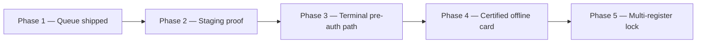

# Offline POS mode plan — OS Kitchen

**Policy:** `offline-pos-plan-v1`  
**Date:** 2026-06-02  
**Owner:** Product + Engineering  
**Scope:** Degraded connectivity strategy for in-browser POS — **not** Toast Hub / EMV store-and-forward parity  
**Status:** **Phase 1 shipped (engineering preview)** — **not production-certified · staging smoke SKIPPED · pilot NO-GO**

This document is the **strategic plan** for offline-capable POS: what exists in code today, what sales may say, what remains roadmap, and how we reach honest “offline-ready” certification.

**Honesty rule:** [`sales-limitation-sheet.md`](./sales-limitation-sheet.md) lists **“No offline POS”** for pilot contracts — meaning **no certified offline card capture or rush-hour guarantee**. Cash/mark-paid **browser queue** exists but is **BETA** until Phase 2 proof passes.

**Related:** [`POS_ARCHITECTURE.md`](./POS_ARCHITECTURE.md) · [`POS_OFFLINE_MODE.md`](./POS_OFFLINE_MODE.md) · [`offline-first-pos-competitive-positioning.md`](./offline-first-pos-competitive-positioning.md) · [`toast-gap-analysis.md`](./toast-gap-analysis.md) · [`hardware-partner-program.md`](./hardware-partner-program.md)

---

## Executive summary

| Dimension | Today (June 2026) |
|-----------|-------------------|
| **Offline queue** | Shipped — IndexedDB client queue + server replay |
| **Payment modes offline** | **Cash** + offline-safe mark-paid paths only |
| **Card offline** | **Blocked** — `posPaymentAllowedWhileOffline` guards placeholder card |
| **Stripe Terminal pre-auth staging** | Metadata only — **not EMV store-and-forward** |
| **Multi-device table conflicts** | Detection + manual review — not realtime lock |
| **Staging / E2E proof** | Unit + E2E exist; **no PASS artifact in pilot GO gate** |
| **Sales claim** | “Degraded cash queue in browser” — **not** “offline POS ready” |

**Safe headline:** “Browser POS queues cash sales when connectivity drops — card stays blocked until online.”

**Forbidden:** “Offline POS ready,” “Toast offline parity,” “EMV store-and-forward,” “Zero sync failures.”

---

## Maturity phases

| Phase | Name | Scope | Status | Sales |
|:-----:|------|-------|--------|-------|
| **1** | **Browser cash queue** | IndexedDB enqueue, sync on reconnect, conflict rows | **Shipped** | BETA — pilot only with caveat |
| **2** | **Staging certification** | E2E smoke PASS + 100-order stress + ops sign-off | **Not PASS** | Still “no offline POS” in limitation sheet |
| **3** | **Terminal capture-on-reconnect** | Pre-auth metadata → Stripe Terminal when online | **Partial code** | Never “card works offline” |
| **4** | **EMV store-and-forward** | Certified reader offline path | **Roadmap H2 2027+** | Do not mention until Phase 4 checklist |
| **5** | **Inventory + multi-device** | Offline stock reservation, register locks | **Roadmap** | Enterprise add-on only |

---

## What ships today (Phase 1)

Evidence paths — do not re-implement; extend via phases above.

| Capability | Implementation | Limitation |
|------------|----------------|------------|
| Default queue on | `mergePosSettings()` → `offlineQueueEnabled: true` — `lib/pos/pos-settings.ts` | Workspace can disable |
| Client queue | `enqueueOfflinePosCheckout` — `lib/pos/offline-pos-queue.ts` | Single browser profile |
| Server replay | `posCheckoutAction` → `checkoutPosSale` with `offlineSaleId` | Requires reconnect |
| Conflict handling | `conflict` / `manual_review` status — `services/pos-offline-queue.ts` | Staff must resolve |
| UI indicators | `OfflineIndicator`, `OfflineSyncStatusBar` | Informational only |
| Card guard | `posPaymentAllowedWhileOffline` | Blocks false PAID |
| Tests | `tests/unit/pos-offline-queue.test.ts`, `e2e/pos-offline-queue.spec.ts` | Local/CI — not staging PASS |

Operator runbook: [`POS_OFFLINE_MODE.md`](./POS_OFFLINE_MODE.md).

---

## Phase 2 — Staging proof (target H2 2026)

Gate before removing “No offline POS” from limitation sheet **for cash path only**:

| # | Criterion | Owner | Artifact |
|---|-----------|-------|----------|
| 2.1 | `e2e/pos-offline-queue.spec.ts` green on staging | QA | CI run link |
| 2.2 | 100-order stress — `stressTestOfflineQueue` | Eng | Test log |
| 2.3 | Conflict resolution drill documented | CS | Runbook update |
| 2.4 | Pilot operator 4h simulated outage (cash only) | CS + operator | Pilot notes |
| 2.5 | No Sev-1 from duplicate replay in 7 days | Eng | Sentry tag review |
| 2.6 | Forbidden-claims scan — no “offline POS ready” in marketing | Marketing | CI PASS |

**Outcome:** Update limitation sheet to **“Cash offline queue — BETA, not card offline”** (wording TBD after 2.4).

---

## Phase 3 — Terminal pre-auth on reconnect (target Q4 2026)

| Item | Detail |
|------|--------|
| **Goal** | Stage Stripe Terminal pre-auth metadata offline; capture when reader online |
| **Code** | `storeOfflinePreAuthorization` — `services/pos-offline-queue.ts` |
| **Not in scope** | EMV certification, store-and-forward on reader firmware |
| **UI** | Clear banner: “Card capture requires connection” |
| **Dependency** | Stripe Terminal staging smoke — `lib/payments/stripe-terminal-client.ts` |

**Sales:** “Pre-auth can be staged — capture when terminal reconnects” — never “pay offline with card.”

---

## Phase 4 — Certified offline card (roadmap — defer)

Requirements before any EMV / store-and-forward claim:

| Prerequisite | Notes |
|--------------|-------|
| Stripe Terminal or partner reader certification path | Legal + PCI scope review |
| Hardware partner L1 validation | [`hardware-partner-program.md`](./hardware-partner-program.md) |
| Dedicated offline SRE runbook | Separate from cash queue |
| Insurance / liability review | Founder + legal |
| 24/7 support tier | [`support-tier-plan.md`](./support-tier-plan.md) T4 |

**Competitive context:** Toast Hub ~$1,200 — we do **not** compete on hub bundle; software-first BYOD remains positioning per [`toast-gap-analysis.md`](./toast-gap-analysis.md).

---

## Phase 5 — Multi-register & inventory (roadmap)

| Gap | Risk if ignored | Plan |
|-----|-----------------|------|
| Multi-device same-table edits | Double seat / split check errors | Expand `detectOfflineTableConflicts` |
| Inventory oversell offline | Stock negative on sync | Offline reservation tokens — not started |
| Multi-location offline | Cross-store drift | Out of scope until franchise plan (Task 122) |

---

## Architecture constraints (unchanged)

From [`POS_ARCHITECTURE.md`](./POS_ARCHITECTURE.md) non-goals until Phase 4+:

- Offline-tolerant checkout **without** eventual server round-trip (local-only forever)
- Native USB printer / cash-drawer pulse offline
- Full table-service floor plan offline

**Single order spine preserved:** All replays must call `createOrderViaCenter` — no shadow ledger.

---

## Operator playbook (summary)

1. **Flaky Wi‑Fi:** Use cash or mark-paid-after-external-terminal modes.
2. **Go offline (DevTools or real outage):** Complete sale — row queues in IndexedDB.
3. **Reconnect:** Watch sync bar — resolve `conflict` rows in POS terminal UI.
4. **Do not** force card placeholder offline — UI blocks intentionally.
5. **Disable queue** if policy requires live server ack: `offlineQueueEnabled: false` in `posSettingsJson`.

Full steps: [`POS_OFFLINE_MODE.md`](./POS_OFFLINE_MODE.md).

---

## Sales & marketing guardrails

| Audience | Allowed | Forbidden |
|----------|---------|-----------|
| **Pilot SOW** | “Cash may queue locally; sync on reconnect; conflicts require review” | “Offline POS included” without BETA label |
| **Public marketing** | “Degraded connectivity handling for browser POS” | “Production-ready offline POS” |
| **vs Toast** | “No $1,200 hub — browser queue on BYOD tablet” | “Toast offline parity” |
| **vs Square** | “No proprietary terminal required for cash queue” | “Square Terminal equivalent offline” |

Enforced by [`sales-safe-claims-registry.md`](./sales-safe-claims-registry.md) · `tests/unit/forbidden-claims-enforcement.test.ts`.

---

## Competitive positioning (honest)

| Platform | Offline model | OS Kitchen today |
|----------|---------------|------------------|
| **Toast** | Hub + proprietary stack, EMV on hardware | No hub — **no EMV offline** |
| **Square** | Terminal store-and-forward | **Cash queue only** |
| **Lightspeed** | Varies by region / hardware | Browser-first deferral |

**Disqualify** prospects where **offline card** is non-negotiable day-one — see [`design-partner-email-sequence.md`](./design-partner-email-sequence.md) disqualifier `offline_pos`.

---

## Metrics (post-pilot)

| Metric | Phase 2 target | Measurement |
|--------|----------------|-------------|
| Sync success rate (cash queue) | > 98% | Server replay logs |
| Conflict rate | < 2% of queued sales | `conflict` row count |
| Time-to-sync after reconnect | p95 < 60s | Client telemetry |
| False PAID incidents | **0** | Support tickets + audit |

**June 2026:** No production tenants — metrics **SKIPPED**. Baseline: [`pilot-gono-go-summary.json`](../artifacts/pilot-gono-go-summary.json) **NO-GO**.

---

## Risks & mitigations

| Risk | Mitigation |
|------|------------|
| Sales overclaims offline | Limitation sheet + this plan + forbidden claims CI |
| Duplicate orders on sync | Idempotent `offlineSaleId` — already in queue payload |
| Inventory drift after outage | Phase 5 — until then document manual stock review |
| `offline-first-pos-competitive-positioning.md` “production-ready” drift | Treat as **sales draft**; this plan is authority for maturity |
| Card fraud offline | Keep card blocked offline — Phase 4 only with certification |

---

## Related documents

| Doc | Use |
|-----|-----|
| [`POS_OFFLINE_MODE.md`](./POS_OFFLINE_MODE.md) | Operator how-to |
| [`offline-first-pos-competitive-positioning.md`](./offline-first-pos-competitive-positioning.md) | Sales talk track (qualified wording) |
| [`sales-limitation-sheet.md`](./sales-limitation-sheet.md) | Prospect attachment |
| [`toast-gap-analysis.md`](./toast-gap-analysis.md) | Offline row in gap matrix |
| [`POS_ARCHITECTURE.md`](./POS_ARCHITECTURE.md) | Order spine + non-goals |
| [`hardware-partner-program.md`](./hardware-partner-program.md) | Reader validation |

---

## Revision history

| Version | Date | Change |
|---------|------|--------|
| `offline-pos-plan-v1` | 2026-06-02 | Initial strategic plan — Task 115 |

**Next action:** Run Phase 2 staging smokes · keep “No offline POS” on limitation sheet until 2.4 passes · reconcile competitive positioning doc headline with BETA label.
