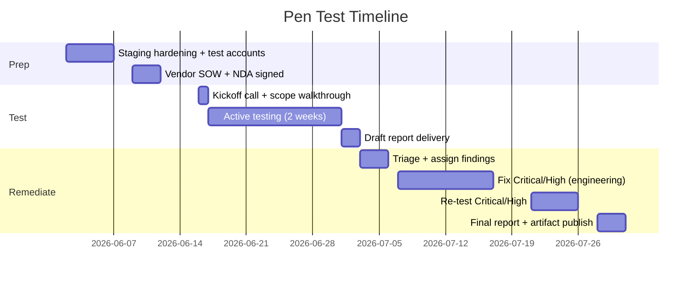

# Penetration Test Plan — KitchenOS Pilot & Enterprise Gate

**Status:** Planned — **not scheduled**  
**Audience:** Security, Engineering leadership, Procurement, VP Sales  
**Policy:** Honest defer per `docs/enterprise-procurement-pack.md` — no pen test report exists today  
**Related:** [`enterprise-procurement-pack.md`](./enterprise-procurement-pack.md) · [`scim-provisioning-rfc.md`](./scim-provisioning-rfc.md) · [`SOC2_ROADMAP_Q4.md`](./SOC2_ROADMAP_Q4.md) · [`staging-environment-setup.md`](./staging-environment-setup.md)

---

## Executive summary

KitchenOS has **strong engineering security baseline** (RBAC wave 4, webhook signature matrix, tenant actor scoping, CI security suite) but **no third-party penetration test** has been executed. Enterprise procurement questionnaires correctly list pen test as **deferred**.

This plan defines **scope**, **three vendor options with 2026 pricing bands**, and a **8–10 week timeline** from vendor selection to remediated re-test. Pen test is a **P1 gate** before enterprise SSO/SCIM pilot promotion and SOC 2 Type I observation — not required for meal-prep Pro/Team pilots that accept documented honest gaps.

**Do not claim:** “Pen tested,” “SOC 2 equivalent,” or “enterprise security certified” until final report + remediation artifact exists.

---

## Objectives

| Goal | Success metric |
|------|----------------|
| Validate tenant isolation | No cross-workspace data access via API, dashboard, or webhooks |
| Validate auth/RBAC | Privilege escalation, IDOR, mutation bypass blocked |
| Validate webhook ingress | Signature bypass, replay, payload injection on high-risk routes |
| Validate public surfaces | Storefront, Public API, cron endpoints, health probes |
| Produce buyer artifact | Executive summary + finding severity table + remediation tracker |
| Feed SOC 2 roadmap | Pentest report as Phase 1 evidence (`SOC2_ROADMAP_Q4.md`) |

---

## Scope

### In scope — production-equivalent staging

| Surface | URL / path pattern | Priority | Notes |
|---------|-------------------|----------|-------|
| **Staff dashboard** | `/dashboard/*`, `/login`, `/auth/callback` | P0 | Session cookies, RBAC, workspace scope |
| **Public storefront** | `/s/{storeSlug}/*`, checkout, order token | P0 | Customer PII, payment intent surface |
| **Public API v1** | `/api/v1/*` | P0 | API keys, scope enforcement (`orders:write`, etc.) |
| **Webhook ingress** | `/api/webhooks/*` (46 routes) | P0 | Signature verification matrix — see `artifacts/webhook-security-matrix-summary.json` |
| **Platform admin** | `/platform/*` | P0 | Impersonation audit, cross-tenant deny |
| **POS / Terminal** | `/api/pos/*`, `/dashboard/pos` | P1 | Card-present preview — no live card data in staging |
| **Cron / internal** | `/api/cron/*`, `/api/internal/*` | P1 | Secret header auth, no unauthenticated trigger |
| **Partner integrations** | WooCommerce, Shopify webhook handlers | P1 | Golden-path replay only on staging credentials |
| **SSO callback** | `/auth/callback?sso_workspace_id=` | P1 | When Era 17 staging IdP proof complete |
| **SCIM API** | `/api/scim/v2/*` | P2 | Only after SCIM RFC implementation ships |

**Environment:** Dedicated **staging** tenant(s) on Vercel preview or isolated staging project — never production customer data.

**Test accounts provided:**

| Role | Purpose |
|------|---------|
| Tenant A — OWNER | Baseline privileged user |
| Tenant A — STAFF | Limited mutation surface |
| Tenant B — OWNER | Cross-tenant isolation tests |
| Platform auditor | Read-only platform role |
| Public API key (scoped) | API abuse / scope bypass |
| Unauthenticated | Storefront + webhook negative tests |

### Out of scope (explicit)

| Item | Reason |
|------|--------|
| Production environment | Customer data risk; staging parity sufficient |
| Social engineering / vishing | Not in web-app pentest SOW |
| Physical hardware (Stripe readers, KDS tablets) | Separate hardware assessment if needed |
| DDoS / volumetric load | Covered by Vercel edge + separate load test |
| Supabase / Vercel platform internals | Vendor responsibility; subprocessor review only |
| Source code white-box (full) | Optional add-on; default is gray-box |
| Mobile native apps | Not shipped |

### Methodology

- **OWASP ASVS Level 2** (web application) — target for dashboard + API
- **OWASP API Security Top 10 (2023)** — Public API focus
- **OWASP WSTG** — manual + automated hybrid
- **Tenant isolation test cases** — custom script aligned with `e2e/cross-tenant-isolation.spec.ts` (when shipped)

**Deliverables from vendor:**

1. Executive summary (≤ 5 pages, buyer-shareable redacted version)
2. Technical finding report (CVSS 3.1 scored)
3. Remediation recommendations with effort estimates
4. Re-test of Critical/High findings (included in SOW)

---

## Attack scenarios (minimum test cases)

| ID | Scenario | Expected result |
|----|----------|-----------------|
| PT-01 | Tenant A JWT/session accesses Tenant B order by ID | 403/404, audit log |
| PT-02 | STAFF role calls OWNER-only mutation | Denied by `requireMutationPermission` |
| PT-03 | Webhook POST without valid signature | 401/403, no side effects |
| PT-04 | Webhook replay (duplicate event id) | Idempotent / rejected |
| PT-05 | Public API key with `orders:read` attempts `orders:write` | 403 |
| PT-06 | IDOR on `/order/{token}` — guess adjacent tokens | No cross-customer leak |
| PT-07 | Platform impersonation without audit trail | Blocked or fully audited |
| PT-08 | SQLi / NoSQLi on filter params | Parameterized queries hold |
| PT-09 | XSS in storefront theme / user-generated fields | CSP + encoding |
| PT-10 | SSRF via webhook URL fields (if any) | Blocked |
| PT-11 | Cron endpoint without `CRON_SECRET` | 401 |
| PT-12 | Rate limit bypass on public API | 429 with `X-RateLimit-*` (when shipped) |

---

## Vendor comparison — three options (2026 pricing)

Pricing bands for **single web application**, gray-box, ~2 testers, 2-week active testing, 1 re-test round. USD unless noted.

### Option A — Cobalt (recommended for pilot)

| Attribute | Detail |
|-----------|--------|
| **Model** | Pentest-as-a-Service platform; vetted researcher pool |
| **Strengths** | Fast scheduling (2–4 weeks lead); SaaS-native; buyer-recognized brand; Jira integration |
| **Weaknesses** | Less depth on complex multi-tenant logic vs boutique firms |
| **Typical scope** | 1 web app + API, ~40–80 hours |
| **Price band** | **$18,000 – $32,000** |
| **Timeline** | Kickoff → report: **3–4 weeks** |
| **Re-test** | Usually included for Critical/High (30 days) |
| **Best for** | First pen test before enterprise pilots; budget-conscious |

**Contact:** [cobalt.io](https://www.cobalt.io/) — Pentest quote via platform scoping wizard.

---

### Option B — Bishop Fox (recommended for enterprise procurement)

| Attribute | Detail |
|-----------|--------|
| **Model** | Boutique offensive security consultancy |
| **Strengths** | Deep manual testing; strong enterprise references; red team optional |
| **Weaknesses** | Higher cost; 6–8 week lead times common |
| **Typical scope** | Web + API + cloud config review (read-only AWS/Vercel metadata) |
| **Price band** | **$55,000 – $85,000** |
| **Timeline** | Kickoff → report: **5–7 weeks** |
| **Re-test** | Included (1 round, 60 days) |
| **Best for** | R365/Toast-scale enterprise deals requiring named firm on report |

**Contact:** [bishopfox.com](https://bishopfox.com/) — Application penetration testing SOW.

---

### Option C — Cure53 (recommended for webhook/API depth)

| Attribute | Detail |
|-----------|--------|
| **Model** | European boutique; renowned for browser/API audits |
| **Strengths** | Excellent written reports; strong on crypto, auth, and API edge cases |
| **Weaknesses** | EUR pricing; timezone coordination; limited availability |
| **Typical scope** | Web application security audit + source-assisted review (gray-box) |
| **Price band** | **€22,000 – €38,000** (~**$24,000 – $42,000** at 1.10 FX) |
| **Timeline** | Kickoff → report: **4–6 weeks** (booking queue) |
| **Re-test** | Negotiable; often **€4,000 – €8,000** add-on |
| **Best for** | Public API + 46-webhook matrix depth; engineering-led remediation |

**Contact:** [cure53.de](https://cure53.de/) — Web Application Security Audit.

---

### Vendor selection matrix

| Criterion | Cobalt | Bishop Fox | Cure53 |
|-----------|--------|------------|--------|
| Cost | ★★★★★ | ★★☆☆☆ | ★★★★☆ |
| Speed | ★★★★★ | ★★★☆☆ | ★★★★☆ |
| Enterprise brand | ★★★★☆ | ★★★★★ | ★★★★☆ |
| API/webhook depth | ★★★☆☆ | ★★★★☆ | ★★★★★ |
| Re-test included | ★★★★★ | ★★★★★ | ★★★☆☆ |

**Recommendation:** **Cobalt for first pilot pen test** (cycle 79 budget gate). Escalate to **Bishop Fox** if a signed enterprise deal requires a Big-4-adjacent firm name. Add **Cure53** API-only retainer if webhook findings exceed Medium after Cobalt.

---

## Timeline — 8–10 weeks (end to end)

Assumes vendor **Option A (Cobalt)** and staging environment ready.



| Week | Activity | Owner | Output |
|------|----------|-------|--------|
| **0** | Confirm staging URL, seed tenants A/B, rotate staging secrets | DevOps | [`staging-environment-setup.md`](./staging-environment-setup.md) checklist |
| **1** | Export webhook matrix + RBAC doc pack for vendor | Security eng | Vendor onboarding packet |
| **2** | Sign SOW, NDA, rules of engagement | Legal / CEO | Signed contract |
| **3** | Kickoff + credential handoff (1Password vault item) | Security + vendor | RoE document |
| **4–5** | Active penetration testing | Vendor | Daily finding notifications (Critical immediate) |
| **6** | Draft report review | Engineering | Triage spreadsheet |
| **7–8** | Remediate Critical + High | Engineering | PRs + CI green |
| **9** | Vendor re-test | Vendor | Clean re-test letter |
| **10** | Publish artifact + update procurement pack | Security | `artifacts/pen-test-summary.json` |

**Hard stop:** Any **Critical** finding open at week 8 blocks enterprise pilot promotion and SSO `pilot_ready` gate.

---

## Pre-engagement checklist

- [ ] Staging environment isolated from production DB
- [ ] Test users Tenant A / Tenant B provisioned with known passwords (vault)
- [ ] Public API test keys issued with minimal scopes
- [ ] Webhook test endpoints documented with sample payloads
- [ ] `CRON_SECRET`, webhook secrets rotated for staging-only values
- [ ] Sentry / logging enabled for vendor test window
- [ ] Emergency contact + kill switch (disable staging) documented
- [ ] Legal NDA + data processing addendum (no real customer PII)
- [ ] Cross-tenant E2E tests passing in CI (`e2e/cross-tenant-isolation.spec.ts`)

---

## Post-engagement artifacts

| Artifact | Path | Purpose |
|----------|------|---------|
| Executive summary (redacted) | `artifacts/pen-test-executive-summary.pdf` | Buyer sharing |
| Finding tracker | `artifacts/pen-test-findings.json` | CI/policy gates |
| Machine summary | `artifacts/pen-test-summary.json` | Orchestrator score bump |
| Remediation log | `docs/pen-test-remediation-log.md` | Engineering backlog |

**Policy gate (proposed):**

```json
{
  "scheduled": true,
  "vendor": "cobalt",
  "reportDate": "2026-07-28",
  "criticalOpen": 0,
  "highOpen": 0,
  "overall": "PASSED"
}
```

Until `overall: PASSED` — procurement answer remains: *“Third-party penetration test scheduled/completed per plan; report available under NDA after remediation.”*

---

## Budget summary

| Line item | Low | High |
|-----------|-----|------|
| Pen test (Option A) | $18,000 | $32,000 |
| Pen test (Option B) | $55,000 | $85,000 |
| Pen test (Option C) | $24,000 | $42,000 |
| Internal eng remediation (2 eng × 2 weeks) | $8,000 | $15,000 |
| Re-test (if not in SOW) | $0 | $8,000 |
| **Total first cycle (Option A)** | **$26,000** | **$47,000** |

Align with SOC 2 budget line in `SOC2_ROADMAP_Q4.md` ($15–40k tooling + audit); pen test is **additive** in year 1.

---

## Procurement FAQ (honest answers)

**Q: Has KitchenOS been penetration tested?**  
A: Not yet. This plan is approved; engagement targets Q2–Q3 2026 on staging. We do not claim pen test completion today.

**Q: Can we see the report?**  
A: After remediation, executive summary available under NDA. Full report for enterprise tier with signed DPA.

**Q: How does this relate to SOC 2?**  
A: Pentest is a gap item on our SOC 2 Type I roadmap (`SOC2_ROADMAP_Q4.md`). Type I target Q4 2026; pen test precedes auditor observation.

**Q: What about tenant isolation?**  
A: Automated cross-tenant tests in CI plus manual pen test PT-01/PT-07. See `enterprise-procurement-pack.md` Era 16–17 security matrix.

---

## References

- OWASP ASVS 4.0 — [owasp.org](https://owasp.org/www-project-application-security-verification-standard/)
- OWASP API Security Top 10 — [owasp.org](https://owasp.org/API-Security/)
- KitchenOS webhook matrix — `npm run cert:webhook-security-era16`
- KitchenOS RBAC — `lib/permissions/mutation-access.ts`
- CI security chain — `npm run test:security`
