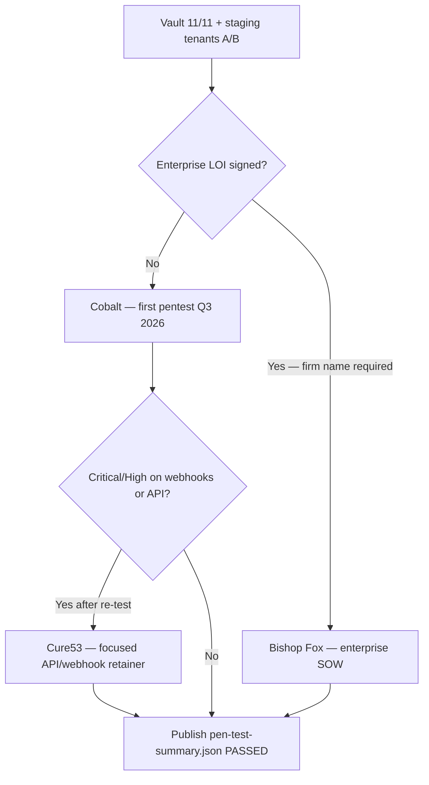

# Pen Test Vendor Selection

**Status:** **Vendor shortlist approved — engagement not scheduled**  
**Decision date:** 2026-06-01  
**Audience:** Founder, Security, Legal, VP Sales (enterprise deals)  
**Scope & timeline:** [`pen-test-plan.md`](./pen-test-plan.md)  
**Procurement:** [`enterprise-procurement-pack.md`](./enterprise-procurement-pack.md) · [`SOC2_ROADMAP_Q4.md`](./SOC2_ROADMAP_Q4.md)

---

## Executive decision

| Question | Answer |
|----------|--------|
| Has KitchenOS been pen tested? | **No** — honest defer until staging proof + vault ready |
| Shortlist size | **3 vendors** (below) |
| **Primary selection (first engagement)** | **Cobalt** — Pentest-as-a-Service, fastest path, buyer-recognized |
| **Enterprise escalation** | **Bishop Fox** — when signed deal requires boutique firm on cover page |
| **API/webhook depth add-on** | **Cure53** — if Cobalt surfaces Medium+ on webhook/API after re-test |
| Target window | **Q3 2026** after vault 11/11 + dedicated staging tenants A/B |
| Budget (first cycle) | **$26k–$47k** all-in (Cobalt + internal remediation) |

**Do not claim** “pen tested” or “enterprise security certified” until `artifacts/pen-test-summary.json` → `overall: PASSED`.

---

## Selection criteria (weighted)

| Criterion | Weight | Why it matters for KitchenOS |
|-----------|--------|------------------------------|
| Multi-tenant / IDOR depth | 25% | Workspace isolation is top buyer question |
| Webhook + Public API coverage | 20% | 46 webhook routes + `/api/v1/*` |
| Time to report | 15% | Pilot enterprise pipeline Q3–Q4 |
| Buyer/procurement recognition | 15% | R365-scale deals ask for firm name |
| Re-test included | 10% | Critical/High must close before SSO promotion |
| Total cost | 15% | Pre-revenue pilot budget gate |

---

## Vendor 1 — Cobalt (primary)

| Field | Detail |
|-------|--------|
| **Website** | [cobalt.io](https://www.cobalt.io/) |
| **Model** | Pentest-as-a-Service — vetted researcher pool, platform workflow |
| **Typical engagement** | 1 web app + REST API, gray-box, ~40–80 tester hours |
| **Price band (2026)** | **$18,000 – $32,000 USD** |
| **Lead time** | **2–4 weeks** to kickoff |
| **Report → re-test** | **3–4 weeks** active + **30-day** Critical/High re-test included |
| **Strengths** | Fast scheduling; Jira/Linear integration; SaaS buyers know the brand; cost-effective first test |
| **Weaknesses** | Less bespoke multi-tenant narrative than boutique; researcher rotation |
| **KitchenOS fit** | Strong for **first** staging pentest before meal-prep pilots scale to enterprise |

**Score (weighted):** **82/100**

**When to choose:** Default first engagement; budget &lt; $35k; need report within 6 weeks of vault ready.

**SOW must include:** Tenant A/B test accounts, `/api/webhooks/*` sample matrix, Public API scope bypass cases (PT-01–PT-12 from pen-test plan).

---

## Vendor 2 — Bishop Fox (enterprise escalation)

| Field | Detail |
|-------|--------|
| **Website** | [bishopfox.com](https://bishopfox.com/) |
| **Model** | Boutique offensive security consultancy |
| **Typical engagement** | Web + API + read-only cloud config review (Vercel/Supabase metadata) |
| **Price band (2026)** | **$55,000 – $85,000 USD** |
| **Lead time** | **6–8 weeks** to kickoff (common) |
| **Report → re-test** | **5–7 weeks** + **1 re-test round (60 days)** included |
| **Strengths** | Deep manual testing; enterprise references; optional red team; procurement “name brand” |
| **Weaknesses** | Cost; slower; overkill for first pilot pen test |
| **KitchenOS fit** | Use when **signed enterprise LOI** names pen test firm on security questionnaire |

**Score (weighted):** **78/100** (first cycle) · **91/100** (enterprise procurement context)

**When to choose:** Deal size &gt; $100k ARR; customer security team rejects PTaaS-only vendors; SOC 2 Type I auditor asks for named boutique.

**SOW must include:** Executive summary buyer-shareable under NDA; cloud config review addendum; explicit cross-tenant test cases PT-01, PT-07.

---

## Vendor 3 — Cure53 (API / webhook depth)

| Field | Detail |
|-------|--------|
| **Website** | [cure53.de](https://cure53.de/) |
| **Model** | European boutique — browser, API, and crypto/auth specialists |
| **Typical engagement** | Web application security audit + gray-box source-assisted review |
| **Price band (2026)** | **€22,000 – €38,000** (~**$24,000 – $42,000 USD** at 1.10 FX) |
| **Lead time** | **4–6 weeks** (booking queue) |
| **Report → re-test** | Re-test often **€4,000 – €8,000** add-on — negotiate upfront |
| **Strengths** | Excellent written reports; auth/signature/API edge cases; engineering-friendly findings |
| **Weaknesses** | EUR + timezone; re-test not always bundled; less US enterprise brand recognition |
| **KitchenOS fit** | Best **follow-on** if webhook signature or Public API issues need specialist depth |

**Score (weighted):** **80/100**

**When to choose:** Cobalt completes but webhook/API findings remain Medium+; engineering wants source-assisted review on `lib/webhooks/` and `/api/v1/*`.

**SOW must include:** Webhook replay + signature bypass suite; JWT/session analysis; optional 2-day source review block.

---

## Comparison matrix

| Criterion (weight) | Cobalt | Bishop Fox | Cure53 |
|--------------------|--------|------------|--------|
| Multi-tenant / IDOR (25%) | ★★★☆☆ | ★★★★★ | ★★★★☆ |
| Webhook + API (20%) | ★★★☆☆ | ★★★★☆ | ★★★★★ |
| Time to report (15%) | ★★★★★ | ★★★☆☆ | ★★★★☆ |
| Procurement brand (15%) | ★★★★☆ | ★★★★★ | ★★★★☆ |
| Re-test included (10%) | ★★★★★ | ★★★★★ | ★★★☆☆ |
| Cost (15%) | ★★★★★ | ★★☆☆☆ | ★★★★☆ |
| **Weighted total** | **82** | **78** (91 enterprise) | **80** |

---

## Recommended path



| Phase | Vendor | Trigger | Budget |
|-------|--------|---------|--------|
| **1 — First test** | Cobalt | Vault ready; cross-tenant E2E staging PASS | $18k–$32k |
| **2 — Enterprise** | Bishop Fox | Signed enterprise security questionnaire names vendor | $55k–$85k |
| **2b — API depth** | Cure53 | Cobalt Medium+ on PT-03–PT-05, PT-11 | $24k–$42k |
| Internal remediation | Engineering | All phases | $8k–$15k |

**Blocked until:** vault **0/11** → staging proof; do not pay vendor before [`staging-environment-setup.md`](./staging-environment-setup.md) checklist complete.

---

## RFP / quote checklist (send to all three)

Attach to vendor scoping email:

1. [`pen-test-plan.md`](./pen-test-plan.md) — scope, PT-01–PT-12, in/out of scope
2. `artifacts/webhook-security-matrix-summary.json` — route inventory
3. RBAC summary — `lib/permissions/mutation-access.ts` + wave-4 cert reference
4. Staging URL (when available) — **not production**
5. Test account matrix — Tenant A OWNER/STAFF, Tenant B OWNER, platform auditor, scoped API key
6. Rules of engagement — no prod, no DDoS, no social engineering, Critical same-day notify
7. Deliverables — executive summary (redacted), CVSS 3.1 report, re-test letter
8. NDA + DPA — no real customer PII in staging

**Quote must specify:** gray-box, staging-only, 1 re-test round, Critical/High remediation window, fixed fee cap.

---

## Engagement gates (honest)

| Gate | Status (2026-06-01) | Blocks vendor kickoff? |
|------|---------------------|-------------------------|
| Vault 11/11 | **0/11** | **Yes** — no staging credentials handoff |
| Dedicated staging tenants A/B | Not verified | **Yes** |
| Cross-tenant E2E staging | SKIPPED (vault) | **Yes** for PT-01 confidence |
| Webhook matrix artifact | Script exists | No — prep only |
| Legal NDA template | [`enterprise-procurement-pack.md`](./enterprise-procurement-pack.md) | Partial — finalize before sign |
| Budget approved | Not allocated | **Yes** — founder sign-off |

**Procurement answer today:** *“Third-party penetration test vendor selected (Cobalt primary); engagement scheduled post-staging proof Q3 2026. No report exists yet.”*

---

## Post-selection artifacts

| Artifact | When | Owner |
|----------|------|-------|
| Signed SOW + NDA | Week 0 post-approval | Legal |
| `artifacts/pen-test-vendor-selection.json` | After founder sign-off | Security |
| `artifacts/pen-test-summary.json` | After re-test PASS | Security |
| Update procurement pack row | Report redacted ready | GTM |

**Proposed selection record:**

```json
{
  "selectedVendor": "cobalt",
  "alternates": ["bishop_fox", "cure53"],
  "engagementStatus": "not_scheduled",
  "blockedBy": ["vault_0_of_11", "budget_pending"],
  "targetKickoff": "2026-Q3"
}
```

---

## Sign-off

| Role | Decision | Date |
|------|----------|------|
| Founder | Approve Cobalt as primary; Bishop Fox enterprise escalation | ☐ |
| Security eng | Confirm scope packet ready post-vault | ☐ |
| Legal | NDA + RoE template | ☐ |
| Finance | Budget line $26k–$47k (Phase 1) | ☐ |

---

## References

- Full scope & timeline: [`pen-test-plan.md`](./pen-test-plan.md)
- Webhook audit: [`scripts/audit-webhook-signatures-staging.sh`](../scripts/audit-webhook-signatures-staging.sh)
- Cross-tenant tests: `e2e/cross-tenant-isolation-staging.spec.ts`
- SOC 2 context: [`SOC2_ROADMAP_Q4.md`](./SOC2_ROADMAP_Q4.md)
- Stripe Terminal in scope: [`stripe-terminal-hardware-test-plan.md`](./stripe-terminal-hardware-test-plan.md)
