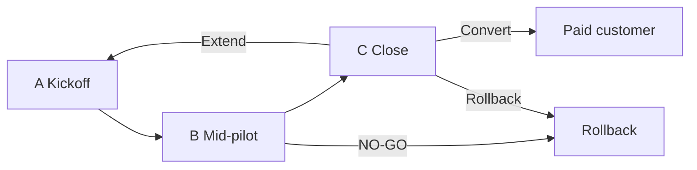

# Pilot acceptance criteria

**Policy:** `pilot-acceptance-criteria-v1`  
**Updated:** 2026-06-02  
**Owner:** Founder + CS + Sales  
**Parent:** [`pilot-execution-checklist.md`](./pilot-execution-checklist.md) · [`pilot-metrics-review-process.md`](./pilot-metrics-review-process.md) · [`commercial-pilot-runbook.md`](./commercial-pilot-runbook.md)

This document defines **objective pass/fail criteria** for accepting a design-partner or paid pilot at three gates: **kickoff**, **mid-pilot**, and **close**. Acceptance means the pilot may proceed to the next phase — not that OS Kitchen is GA-ready or that external marketing claims are unlocked.

**Honesty rule:** SKIPPED smoke artifacts, template metrics, and unsigned LOIs **fail** acceptance. Checkbox optimism does not count.

---

## Three acceptance gates

| Gate | When | Pilot checklist steps | Decision |
|------|------|----------------------|----------|
| **A — Kickoff accepted** | Before production traffic | 1–9 complete | Pilot workspace live; staging golden path signed |
| **B — Mid-pilot accepted** | Day 30–45 | 10–15 reviewed | GO / CONDITIONAL / NO-GO for continue |
| **C — Close accepted** | Day 60–90 | 16 signed | Convert to paid · extend LOI · rollback |



---

## Gate A — Kickoff acceptance (pre-production)

**Question:** Has OS Kitchen and the design partner completed enough to start real operator usage on staging (and optionally limited production)?

### Mandatory criteria (all must PASS)

| ID | Criterion | Evidence | Checklist step |
|----|-----------|----------|:--------------:|
| A1 | ICP qualified — no disqualifiers | `icpQualification.qualified: true` in GO/NO-GO artifact | 1 |
| A2 | Signed LOI or paid SOW on file | `loiSignedDate` + `customerName` set | 2 |
| A3 | Staging environment checklist complete | Domain, SSL, DB, crons, webhooks per [`staging-environment-checklist.md`](./staging-environment-checklist.md) | 3 |
| A4 | P0 staging smokes PASS | `p0ProofStatus: proof_passed` — not SKIPPED | 4 |
| A5 | Tier 0 engineering gate PASS | `npm run smoke:pilot-tier-preflight` | 5 |
| A6 | Forbidden claims verify PASS | `npm run smoke:pilot-forbidden-claims-enforcement` | 6 |
| A7 | Pilot workspace provisioned | Owner login + Launch Wizard accessible | 7 |
| A8 | Kickoff + rollback briefing completed | Meeting notes; rollback drill acknowledged | 8 |
| A9 | Operator golden path signed | `npm run smoke:pilot-operator-golden-path` or manual sign-off sheet | 9 |

### Acceptable waivers (document in writing only)

| Waiver | When allowed | Must record |
|--------|--------------|-------------|
| SSO pilot gate SKIPPED | SOW excludes enterprise SSO | `PILOT_GONOGO_SSO_PILOT_REQUIRED=0` |
| Channel = storefront only | No Woo/Shopify in SOW | Step 10 marked N/A |
| Metrics baseline SKIPPED | Pre-kickoff — expected | R1 scheduled Day 7–14 |

**Kickoff FAIL if:** Any of A1–A6 fails · A9 incomplete · customer refuses BETA honesty labels.

**Kickoff accepted wording (internal):** “Qualified pilot kickoff — staging golden path complete; production traffic requires Gate A12 from checklist step 12.”

---

## Gate B — Mid-pilot acceptance (continue / conditional / stop)

**Question:** Should this pilot continue past day 45?

### Engineering & ops criteria

| ID | Criterion | PASS when | FAIL when |
|----|-----------|-----------|-----------|
| B1 | Tier 0 still green on current SHA | `tier0ProofStatus: proof_passed` | CI regression unmitigated > 7 days |
| B2 | No open Sev-1 without mitigation | Zero unresolved tenant-data or payment incidents | Active Sev-1 > 24h |
| B3 | Rollback drill current | `rollbackProofStatus: proof_passed` within 90 days | Drill expired or failed |
| B4 | Integration scope honest | Only BETA/LIVE labels matching registry | Customer told LIVE for BETA integration |
| B5 | P0 smokes | PASS or documented SKIPPED with remediation date | SKIPPED with no ops owner |

### Operator & product criteria

| ID | Criterion | PASS when | FAIL when |
|----|-----------|-----------|-----------|
| B6 | First live order path | Order in hub + KDS bump (step 11) | No orders by Day 14 without agreed plan |
| B7 | Weekly sync attendance | ≥80% of scheduled syncs held | <50% attendance without reschedule |
| B8 | Production traffic gate | Step 12 written GO from Founder | Production used before step 12 |
| B9 | Role checklists complete | `PILOT_GONOGO_ROLE_CHECKLISTS_COMPLETE=1` | Owner/manager/kitchen checklists incomplete |

### Metrics criteria (from R1 + R3)

| ID | Criterion | PASS when | FAIL when |
|----|-----------|-----------|-----------|
| B10 | Week 2 baseline captured | `baselineProofStatus: proof_captured`, 6/6 KPIs | Still SKIPPED after Day 21 |
| B11 | Operator feedback | `operator_feedback_score` ≥ **3.5** (SOW may require 4.0) | Score < 3.5 with no remediation |
| B12 | Support trend | No unexplained spike > 2× week-2 baseline | Ticket spike + no owner |
| B13 | Orders trend | Stable or improving vs week 2 (context: seasonality) | Flat/down + operator cites product blockers |

**Commands:**

```bash
npm run smoke:pilot-gono-go
npm run smoke:pilot-metrics-baseline
npm run cert:commercial-pilot-evidence-era16
```

### Mid-pilot decision matrix

| Outcome | Criteria met | Action |
|---------|--------------|--------|
| **ACCEPT — continue** | B1–B6 PASS · B10 captured · no Sev-1 | Proceed to close track; schedule R5 |
| **CONDITIONAL** | B10 PARTIAL or B11 3.5–3.9 with remediation plan | Founder sign-off; 30-day remediation window |
| **REJECT — pause** | B2 Sev-1 · B8 violated · B10 missing after Day 21 | Pause production traffic; ops war room |
| **REJECT — rollback** | Customer requests exit · repeated B11 FAIL · fraud/abuse | Execute [`pilot-rollback-drill-era17.md`](./pilot-rollback-drill-era17.md) |

**Mid-pilot does NOT unlock:** Case studies · investor KPI slides · LIVE integration registry changes · “production-certified” language.

---

## Gate C — Close acceptance (convert / extend / rollback)

**Question:** Did the pilot meet success criteria defined in LOI/SOW Exhibit C?

### Default success criteria (customize per SOW)

| ID | Criterion | Default target | Evidence |
|----|-----------|----------------|----------|
| C1 | Pilot duration completed | 60–90 days per LOI | Calendar + sync log |
| C2 | Metrics R5 signed | R1 + R3 + R5 reviews complete | Meeting notes + artifact |
| C3 | Six KPIs final capture | `overall: PASSED` on week 8 or close week | `pilot-metrics-baseline-summary.json` |
| C4 | Operator feedback | ≥ **4.0** / 5 (or SOW target) | Survey export |
| C5 | Golden path re-run | Operator can repeat path without CS hand-holding | Sign-off sheet |
| C6 | Forbidden claims re-run | `verify-claims` PASS at close SHA | CI log |
| C7 | Open P0 defects | Zero P0 open > 14 days | Support + engineering triage |
| C8 | Commercial decision recorded | Convert / Extend / Rollback | CRM + signed amendment |

### Close outcomes

| Outcome | Acceptance criteria | Next step |
|---------|---------------------|-----------|
| **Convert to paid** | C1–C8 PASS · customer confirms value | Paid SOW / MSA · update CRM |
| **Extend pilot** | CONDITIONAL at Gate B · remediation in flight | LOI amendment · new close date |
| **Rollback** | FAIL at Gate B or customer exit | Data export per DSR policy · disable workspace |
| **Case study (optional)** | Convert + written marketing approval | Separate release — not auto |

**Close FAIL for conversion if:** C3 SKIPPED · C4 below SOW minimum without waiver · C7 open P0 blockers · customer declines renewal.

---

## KPI acceptance thresholds

Customize in LOI Exhibit C before kickoff. Defaults below assume commissary / multi-channel preorder ICP.

| KPI | Minimum acceptable (close) | Stretch target | Measurement |
|-----|---------------------------|----------------|-------------|
| `orders_per_day` | ≥ 70% of week-2 baseline at close | Improving trend week 2 → 8 | Order hub export |
| `storefront_checkout_success_rate` | ≥ 90% (if storefront in SOW) | ≥ 95% | Checkout logs |
| `pos_checkout_completion` | PASSED manual sign-off | — | Tier-2b cash path test |
| `kds_bump_rate` | ≥ 85% bumps within SLA window | ≥ 95% | KDS session export |
| `support_tickets_per_week` | ≤ 2× week-2 rate at close | Declining trend | Support inbox |
| `operator_feedback_score` | ≥ 3.5 (default) · **4.0 for convert** | ≥ 4.5 | Survey |

**Rule:** Below minimum → **extend** or **rollback**, not convert — unless Founder + customer written waiver.

---

## What acceptance never grants

Even with Gate C **Convert**, do **not** automatically claim:

| Claim | Why blocked | Safe doc |
|-------|-------------|----------|
| LIVE third-party integrations | Separate LIVE DoD gates | [`live-integration-definition-of-done.md`](./live-integration-definition-of-done.md) |
| National marketplace network | Vendor seeding incomplete | [`vendor-seeding-strategy.md`](./vendor-seeding-strategy.md) |
| Customer case study | Requires marketing approval | Task 69 template |
| SOC2 / enterprise SSO production | Roadmap items | [`sales-limitation-sheet.md`](./sales-limitation-sheet.md) |
| Rush-hour KDS certified | No ops sign-off | Capability matrix |
| Investor-grade KPI proof | Single pilot ≠ portfolio proof | [`pilot-metrics-review-process.md`](./pilot-metrics-review-process.md) |

---

## Sign-off forms

### Gate A — Kickoff

| Field | Value |
|-------|-------|
| Customer | |
| Kickoff date | |
| A1–A9 | All PASS ☐ |
| Waivers (if any) | |
| CS sign-off | _________________ Date ______ |
| Founder sign-off (production gate step 12) | _________________ Date ______ |

### Gate B — Mid-pilot

| Field | Value |
|-------|-------|
| Review date (Day ___ ) | |
| Decision | ACCEPT / CONDITIONAL / REJECT |
| B10 baseline | proof_captured ☐ |
| Open remediation items | |
| Founder sign-off | _________________ Date ______ |

### Gate C — Close

| Field | Value |
|-------|-------|
| Close date | |
| Final decision | Convert / Extend / Rollback |
| C3 metrics overall | PASSED ☐ |
| C4 operator score | |
| Case study approved | Y / N |
| Sales sign-off | _________________ Date ______ |
| Founder sign-off | _________________ Date ______ |

---

## Artifact cross-reference

| Gate | Primary artifacts |
|------|-------------------|
| A | `artifacts/pilot-gono-go-summary.json` · staging checklist |
| B | `artifacts/pilot-metrics-baseline-summary.json` · evidence pack |
| C | Same + CRM record · optional renewal SOW |

**Re-run after material changes:**

```bash
npm run smoke:pilot-gono-go
npm run smoke:pilot-metrics-baseline
MARKETING_CLAIMS_STRICT=1 npm run verify-claims
```

---

## Current baseline (June 2026)

| Gate | Status | Blocker |
|------|--------|---------|
| A | **Not accepted** | No LOI · P0 smokes SKIPPED |
| B | N/A | No kickoff |
| C | N/A | No pilot |

Source: [`artifacts/pilot-gono-go-summary.json`](../artifacts/pilot-gono-go-summary.json) — `decision: NO-GO`

---

## Related docs & tasks

| Resource | Topic |
|----------|-------|
| [`pilot-execution-checklist.md`](./pilot-execution-checklist.md) | 16-step execution |
| [`pilot-metrics-review-process.md`](./pilot-metrics-review-process.md) | R0–R5 reviews |
| [`loi-design-partner-template.md`](./loi-design-partner-template.md) | Exhibit C targets |
| [`sales-limitation-sheet.md`](./sales-limitation-sheet.md) | Prospect honesty |
| [`PAID_PILOT_GO_NO_GO_CHECKLIST.md`](./PAID_PILOT_GO_NO_GO_CHECKLIST.md) | Engineering gates |
| Task 61 | `incident-response-process.md` |

---

## Next action

Before first design partner kickoff: customize **Exhibit C KPI targets** in LOI, then walk Gate A criteria with CS + Ops — do not provision production traffic until A1–A9 PASS.
