# Purchase order automation plan — OS Kitchen

**Policy:** `purchase-order-automation-plan-v1`  
**Date:** 2026-06-02  
**Owner:** Product + Purchasing + Marketplace PM  
**Scope:** Automated PO creation from **inventory demand** and **marketplace checkout** — human approval gates remain default  
**Status:** **Partial automation shipped · full workflow incomplete · marketplace BETA · pilot NO-GO**

This document defines how OS Kitchen automates purchase orders across **internal supplier POs** and **HoReCa marketplace POs**, what is safe to sell, and the roadmap to certified end-to-end automation.

**Honesty rule:** AI purchasing is **recommendation + optional auto-draft** — not autonomous procurement. [`ai-honesty-policy.md`](./ai-honesty-policy.md): human approval gates on high-impact actions. Default automation **`enabled: false`**.

**Related:** [`PURCHASING_ARCHITECTURE.md`](./PURCHASING_ARCHITECTURE.md) · [`PURCHASE_ORDER_WORKFLOW.md`](./PURCHASE_ORDER_WORKFLOW.md) · [`marketplace-pricing-strategy.md`](./marketplace-pricing-strategy.md) · [`vendor-seeding-execution.md`](./vendor-seeding-execution.md) · `services/ai/purchasing-automation.ts`

---

## Executive summary

| Track | Model | Automation today | Approval |
|-------|-------|------------------|----------|
| **A — Internal supplier PO** | `PurchaseOrder` + lines | AI auto-draft from demand — **`enabled: false` default** | Submit / approve / reject actions |
| **B — Marketplace B2B** | `MarketplacePurchaseOrder` | Checkout → PO; subtotal gate | `CheckoutApprovalGate` > limit → pending |
| **C — Recurring marketplace** | `MarketplaceRecurringOrder` | Schema exists — **minimal UI** | Manual |
| **EDI / direct** | `edi-service.ts` | Preview panels | Not production-certified |

| Dimension | June 2026 |
|-----------|-----------|
| **Live PO volume** | **0** (no paying customers) |
| **Line CRUD on internal PO** | Partial — audit noted gaps |
| **Receiving → stock** | Partial — hooks pending |
| **Marketplace checkout E2E** | Staging target — not PASS in GO gate |
| **xtraCHEF / Sysco parity** | **Not claimed** |

**Safe headline:** “Draft POs from inventory signals and marketplace carts — with approval gates and BETA labels.”

**Forbidden:** “Autonomous purchasing,” “Hands-free procurement,” “Sysco delivery network,” “Zero-touch PO without approval.”

---

## Architecture (two PO spines)

```mermaid
flowchart TB
  subgraph trackA [Track A — Internal purchasing]
    DEM[Ingredient demand / reorder queue]
    AI[purchasing-automation.ts]
    PO[PurchaseOrder DRAFT]
    APR[Approve / reject]
    REC[Receiving — partial]
  end
  subgraph trackB [Track B — Marketplace]
    CAT[Catalog / cart]
    CHK[checkout-service.ts]
    GATE[CheckoutApprovalGate]
    MPO[MarketplacePurchaseOrder]
    PAY[Stripe Connect — env gated]
  end
  DEM --> AI
  AI --> PO
  PO --> APR
  APR --> REC
  CAT --> CHK
  CHK --> GATE
  GATE --> MPO
  MPO --> PAY
```



**Do not merge ledgers** — internal `PurchaseOrder` and `MarketplacePurchaseOrder` are separate ([`prisma-optimization-audit.md`](./prisma-optimization-audit.md)).

---

## Track A — Internal supplier PO automation

### What ships

| Capability | Evidence | Limitation |
|------------|----------|------------|
| Draft PO create | `createDraftPurchaseOrderAction` | Supplier pick only — line editor gaps |
| PO list / detail | `/dashboard/purchasing/purchase-orders` | [`PURCHASE_ORDER_WORKFLOW.md`](./PURCHASE_ORDER_WORKFLOW.md) |
| Approval actions | `submitPurchaseOrderForApproval`, `approvePurchaseOrder`, `rejectPurchaseOrder` | RBAC — `tests/unit/purchasing-actions-rbac.test.ts` |
| Approval notify | `notifyPurchaseOrderApprovalRequest` | Email to owner |
| AI dashboard | `/dashboard/inventory/purchasing-ai` | Recommendations |
| **Auto-run** | `runPurchasingAutomationForWorkspace` | **`enabled: false` default** |
| Auto-approve cap | `AUTO_PURCHASE_AUTO_APPROVE_MAX = 500` USD | Above → `READY_FOR_REVIEW` |
| Confidence gate | `AUTO_PURCHASE_MIN_CONFIDENCE = 0.85` | Tunable in settings |
| Settings storage | `KitchenSettings.settingsCenterJson` · `aiPurchasingAutomation` | Per workspace |

### Automation settings (defaults)

```typescript
// lib/ai/purchasing-automation-types.ts
enabled: false
minConfidence: 0.85
maxDaysRemaining: 3
autoApproveMaxAmount: 500
```

### Operator flow (when enabled)

1. Review recommendations on **Purchasing AI** dashboard.  
2. Enable automation in settings (owner only).  
3. Cron or manual run creates draft POs grouped by supplier.  
4. POs ≤ **$500** may auto-approve; larger → **pending approval**.  
5. Owner approves → send → receiving (receiving maturity partial).

**Sales:** “AI-assisted draft POs with a dollar cap and approval queue — not fully autonomous.”

---

## Track B — Marketplace PO automation

### What ships

| Capability | Evidence | Limitation |
|------------|----------|------------|
| Cart → checkout | `services/marketplace/checkout-service.ts` | Connect flag off by default |
| Multi-vendor split | One PO per vendor | — |
| Approval gate UI | `CheckoutApprovalGate` | `MARKETPLACE_CHECKOUT_APPROVAL_LIMIT_USD` |
| Pending queue | `/dashboard/marketplace/orders?status=PENDING_APPROVAL` | Owner approve action |
| Email confirmation | Checkout service notification | Template basic |
| Recurring orders | Prisma model | UI minimal |

### Approval gate logic

| Subtotal | Result |
|----------|--------|
| ≤ approval limit (default USD) | **Auto-submit** POs |
| > limit | **Pending approval** until owner approves |

Component: `components/marketplace/checkout-approval-gate.tsx` (Task 88).

### Marketplace automation roadmap

| Phase | Feature |
|-------|---------|
| **B1** | Staging checkout E2E PASS |
| **B2** | Recurring order scheduler UI |
| **B3** | Par level → auto-add to cart (buyer-side) |
| **B4** | Vendor EDI ingest → marketplace PO (stretch) |

---

## Maturity phases (combined)

| Phase | Name | Scope | Status | Sales |
|:-----:|------|-------|--------|-------|
| **1** | **Manual + drafts** | Create PO, marketplace cart | **Shipped** | BETA |
| **2** | **Approval certified** | Internal + marketplace gates proven | Not PASS | “Approval workflow” |
| **3** | **AI auto-draft opt-in** | Track A automation with caps | Code shipped; default off | “AI-assisted” |
| **4** | **Receiving closure** | PO → receive → stock + cost | Partial | Qualified beta |
| **5** | **Recurring + EDI** | Track B recurring + supplier EDI | Roadmap | Do not sell |

---

## Phase 2 — Certification checklist

| # | Criterion | Track | Owner |
|---|-----------|-------|-------|
| 2.1 | Internal PO: submit → approve → status change | A | QA |
| 2.2 | Marketplace: cart → PO with gate | B | QA |
| 2.3 | `e2e/marketplace-checkout.spec.ts` PASS staging | B | QA |
| 2.4 | Auto-run creates PO with `enabled: true` in test workspace | A | Eng |
| 2.5 | No PO without audit row on approve/reject | A | Eng |
| 2.6 | Forbidden claims CI — no “autonomous purchasing” | Both | Marketing |
| 2.7 | Pilot operator signs off on approval UX | Both | CS |

**Artifact:** `artifacts/po-automation-pilot-cert.json`

---

## Phase 3 — AI automation guardrails

| Guardrail | Implementation |
|-----------|----------------|
| Default off | `DEFAULT_PURCHASING_AUTOMATION_SETTINGS.enabled: false` |
| Dollar cap | `autoApproveMaxAmount` — Finance sign-off to raise |
| Confidence floor | `minConfidence` ≥ 0.85 |
| Days remaining | Only short-run stockouts (`maxDaysRemaining: 3`) |
| Human override | All auto-approved POs visible in list; cancel allowed |
| No vendor commitment | Draft until **sent** — no legal PO email without send action |

**Cron:** Optional future job — not in production manifest until Phase 2 PASS.

---

## Sales & marketing guardrails

| Question | Approved answer |
|----------|-----------------|
| “Automated purchasing?” | “We draft POs from inventory signals and marketplace carts — you approve before spend commits.” |
| “Like MarketMan / xtraCHEF?” | “Similar approval workflow direction — we’re pre-customer; receiving integration still maturing.” |
| “Marketplace auto-reorder?” | “Recurring marketplace orders on roadmap; cart checkout with approval gate today.” |
| Demo | Show **approval gate** + **Purchasing AI** recommendations — label BETA |

Enforced: [`sales-safe-claims-registry.md`](./sales-safe-claims-registry.md) · [`sales-limitation-sheet.md`](./sales-limitation-sheet.md) (marketplace BETA).

---

## Metrics (post-pilot)

| Metric | Track A | Track B |
|--------|---------|---------|
| POs created / month | Baseline | Baseline |
| % requiring approval | Track | Track |
| Auto-approved $ (cap) | < cap unless opted up | N/A |
| Time draft → approved | Target < 24h | Target < 4h |
| Receiving match rate | Phase 4 | Vendor ship confirm |

**June 2026:** **SKIPPED** — [`pilot-gono-go-summary.json`](../artifacts/pilot-gono-go-summary.json) **NO-GO**.

---

## Risks & mitigations

| Risk | Mitigation |
|------|------------|
| Runaway auto-PO spend | Default off + $500 cap + approval |
| Duplicate POs | Idempotent supplier+day grouping in automation |
| Marketplace PO without Connect | Flag off — honest empty catalog |
| AI overconfidence | Confidence threshold + human review label |
| Legal PO sent in error | Separate **send** transition — not in auto-run v1 |

---

## Related documents

| Doc | Use |
|-----|-----|
| [`PURCHASING_ARCHITECTURE.md`](./PURCHASING_ARCHITECTURE.md) | Layering |
| [`PURCHASING_MODULE_AUDIT.md`](./PURCHASING_MODULE_AUDIT.md) | Known gaps |
| [`PURCHASING_QA_CHECKLIST.md`](./PURCHASING_QA_CHECKLIST.md) | QA steps |
| [`stripe-connect-vendor-test-plan.md`](./stripe-connect-vendor-test-plan.md) | Marketplace pay path |
| [`ai-moats-honest-positioning.md`](./ai-moats-honest-positioning.md) | Purchasing AI module |
| [`multi-location-reporting-plan.md`](./multi-location-reporting-plan.md) | PO spend rollups |

---

## Revision history

| Version | Date | Change |
|---------|------|--------|
| `purchase-order-automation-plan-v1` | 2026-06-02 | Initial plan — Task 121 |

**Next action:** Phase 2 certification on staging · keep automation default off · complete PO line editor before sales depth claims.
