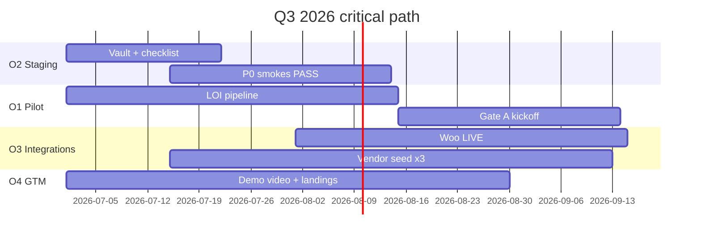

# Q3 2026 OKRs — OS Kitchen

**Policy:** `q3-2026-okrs-v1`  
**Period:** **July 1 – September 30, 2026** (Q3)  
**Owner:** Founder (accountable) · PM + Eng + Sales (contributors)  
**Status:** Planning doc — **baseline June 2, 2026: pre-revenue, pilot NO-GO**  
**Review cadence:** Weekly founder standup · Monthly OKR score (0.0–1.0 per KR)

This document sets **company-level Objectives and Key Results** for Q3 2026 — the quarter that must convert engineering depth into **design-partner proof**, **staging credibility**, and **first LIVE integrations**. OKRs are **outcome-focused**; task backlog lives in the 122-task executor and [`implementation-backlog.md`](./implementation-backlog.md).

**Hard rule:** Score a KR **0.0** if evidence is SKIPPED, template-only, or unsigned — same honesty as [`pilot-acceptance-criteria.md`](./pilot-acceptance-criteria.md).

**Related:** [`series-a-narrative.md`](./series-a-narrative.md) · [`pilot-execution-checklist.md`](./pilot-execution-checklist.md) · [`beta-to-live-roadmap.md`](./beta-to-live-roadmap.md) · [`sales-demo-environment.md`](./sales-demo-environment.md)

---

## Baseline snapshot (June 2, 2026)

| Dimension | Baseline | Source |
|-----------|----------|--------|
| Signed LOI / design partners | **0** | `pilot-gono-go-summary.json` |
| Paid pilots | **0** | Same |
| LIVE integrations | **0** | `beta-to-live-roadmap.md` |
| P0 staging smokes | **SKIPPED** | CI + vault matrix |
| Marketplace vendors (prod) | **0** | `vendor-seeding-strategy.md` |
| ARR | **$0** | — |
| Pilot GO/NO-GO | **NO-GO** | `reportjune2.md` |

**Q3 theme:** *From NO-GO to first qualified pilot kickoff and one LIVE integration — not Series A.*

---

## Scoring guide

| Score | Meaning |
|:-----:|---------|
| **1.0** | KR fully met with auditable evidence |
| **0.7** | Substantially met; minor gap documented |
| **0.4** | Partial progress; blocker owned |
| **0.0** | Not met, SKIPPED, or faked |

**Objective score:** Average of its KRs (unweighted unless noted).

**Company Q3 target:** **≥0.65** weighted average across O1–O4 (O5 is stretch).

---

## O1 — Design partner pipeline & pilot kickoff

**Objective:** Convert pre-revenue posture into **≥1 signed design partner** with Gate A kickoff accepted on staging.

**Why Q3:** Unblocks all traction metrics, case studies, and honest Series A prep (M1 in [`series-a-narrative.md`](./series-a-narrative.md)).

| KR | Key result | Baseline | Target (Sep 30) | Owner | Evidence |
|:--:|------------|----------|-----------------|-------|----------|
| **1.1** | Signed LOIs on file | 0 | **≥2** (1 anchor + 1 backup) | Founder / Sales | LOI PDF + `loiSignedDate` in GO/NO-GO artifact |
| **1.2** | ICP-qualified prospects in active pipeline | 0 | **≥8** qualified conversations | Sales | CRM stage + ICP checklist |
| **1.3** | Gate A kickoff accepted (≥1 pilot) | 0 | **≥1** pilot with A1–A9 PASS | CS + Founder | [`pilot-acceptance-criteria.md`](./pilot-acceptance-criteria.md) Gate A |
| **1.4** | Pilot metrics baseline captured | SKIPPED | **R1 complete** by Day 14 post-kickoff | CS | [`pilot-metrics-review-process.md`](./pilot-metrics-review-process.md) |
| **1.5** | Design partner email sequence sent | 0 | **≥3** partners through 3-email seq | Marketing | UTM + reply rate logged |

**Anti-KR:** Signing LOI without staging readiness — fails 1.3 even if 1.1 scores.

---

## O2 — Staging credibility & P0 proof

**Objective:** Make staging **demo- and pilot-trustworthy** — P0 smokes PASS in CI, not SKIPPED.

**Why Q3:** M2 milestone; required for Gate A4 and [`sales-demo-environment.md`](./sales-demo-environment.md) credibility.

| KR | Key result | Baseline | Target (Sep 30) | Owner | Evidence |
|:--:|------------|----------|-----------------|-------|----------|
| **2.1** | P0 staging smokes overall status | SKIPPED | **PASS** (`p0ProofStatus: proof_passed`) | Eng + Ops | `.github/workflows/p0-staging-smokes.yml` green run |
| **2.2** | Staging environment checklist | Partial | **100%** §1–§5 complete | Ops | [`staging-environment-checklist.md`](./staging-environment-checklist.md) signed |
| **2.3** | Tier 2 operator golden path | SKIPPED | **PASS** on staging URL | Eng | `smoke:pilot-operator-golden-path` artifact |
| **2.4** | Sentry enabled on staging + prod | `sentryServer.ok: false` | **Health check green** | Eng | [`sentry-setup.md`](./sentry-setup.md) + `/api/health` |
| **2.5** | Sales demo workspace resettable | Ad hoc | **Documented + tested** weekly | CS | [`sales-demo-environment.md`](./sales-demo-environment.md) checklist PASS |

**Dependency:** Vault secrets in GitHub Actions + Vercel staging — see staging checklist §3B.

---

## O3 — First LIVE integrations & marketplace supply

**Objective:** Promote **≥1 channel integration to LIVE** and seed **≥3 marketplace vendors** on staging for buyer demo path.

**Why Q3:** M4 path starts here; differentiates from “all BETA” posture ([`beta-to-live-roadmap.md`](./beta-to-live-roadmap.md)).

| KR | Key result | Baseline | Target (Sep 30) | Owner | Evidence |
|:--:|------------|----------|-----------------|-------|----------|
| **3.1** | WooCommerce LIVE (G1–G4) | BETA | **LIVE** on ≥1 reference tenant | Integrations | [`live-integration-definition-of-done.md`](./live-integration-definition-of-done.md) |
| **3.2** | Shopify LIVE (parallel) | BETA | **LIVE** same sprint as 3.1 or documented N/A | Integrations | Registry + claims CI |
| **3.3** | DoorDash promotion progress | BETA | **G1 + G2 PASS** (LIVE optional Q3) | Integrations | [`doordash-live-integration-plan.md`](./doordash-live-integration-plan.md) |
| **3.4** | Marketplace vendors seeded (staging) | 0 | **≥3 approved vendors**, 8+ SKUs each | PM + Ops | [`vendor-seeding-execution.md`](./vendor-seeding-execution.md) |
| **3.5** | Marketplace checkout E2E | Exists | **PASS** on staging CI | QA | `e2e/marketplace-checkout.spec.ts` green |
| **3.6** | First marketplace GMV (staging) | $0 | **≥$1k** test GMV through Connect | PM | Stripe test dashboard + PO records |

**Honesty:** 3.6 is **staging test GMV only** — not a public revenue claim.

---

## O4 — GTM, demos & honest positioning

**Objective:** Run **repeatable sales demos** and **public materials** that pass forbidden-claims CI.

**Why Q3:** Feeds LOI pipeline (O1) without overclaiming.

| KR | Key result | Baseline | Target (Sep 30) | Owner | Evidence |
|:--:|------------|----------|-----------------|-------|----------|
| **4.1** | Today Command Center demo video published | Script only | **≥1** recorded asset (90s) | Marketing | [`demo-video-script-today.md`](./demo-video-script-today.md) + hosted URL |
| **4.2** | ICP landing pages updated | Partial | **Shopify + 2 ICP** pages with marketplace + AI caveats | Marketing | Task 64 commit + `verify-claims` PASS |
| **4.3** | Forbidden claims CI | Unit test | **Green on main** every merge | Eng | `tests/unit/forbidden-claims-enforcement.test.ts` in CI |
| **4.4** | Sales demos conducted | 0 | **≥12** logged demos with limitation sheet sent | Sales | CRM + [`sales-limitation-sheet.md`](./sales-limitation-sheet.md) |
| **4.5** | `/pricing` marketplace section | Missing | **Published** vendor + buyer framing | Marketing | Task 109 + [`marketplace-pricing-strategy.md`](./marketplace-pricing-strategy.md) |

---

## O5 — Platform trust & bus factor (stretch)

**Objective:** Reduce enterprise objection surface — SOC2 path, SSO smoke, bus factor.

**Weight:** Stretch — **0.5×** in company average if not all met.

| KR | Key result | Baseline | Target (Sep 30) | Owner | Evidence |
|:--:|------------|----------|-----------------|-------|----------|
| **5.1** | SOC2 readiness assessment published | Done (Task 95) | **P0 gaps 1–3 closed** | Ops | [`soc2-readiness-assessment.md`](./soc2-readiness-assessment.md) checklist |
| **5.2** | SSO IdP staging smoke | SKIPPED | **PASS** or documented pilot waiver | Eng | [`sso-idp-smoke-test-plan.md`](./sso-idp-smoke-test-plan.md) |
| **5.3** | Bus factor mitigation | Plan doc | **≥1** contractor/advisor with repo + on-call access | Founder | [`bus-factor-mitigation.md`](./bus-factor-mitigation.md) |
| **5.4** | Incident tabletop exercise | None | **1** documented run | Founder | [`incident-response-process.md`](./incident-response-process.md) |

---

## Quarterly timeline



| Month | Focus | Exit criteria |
|-------|-------|---------------|
| **July** | O2 staging + O3 vendor seed start | Checklist 80% · 1 LOI in legal review |
| **August** | O1 kickoff + O3 Woo LIVE push | P0 smokes PASS · Gate A candidate ready |
| **September** | O1 Gate A + O4 GTM + score OKRs | ≥1 pilot live · Woo LIVE signed · Q3 review doc |

---

## Dependencies & risks

| Risk | Impact | Mitigation KR |
|------|--------|---------------|
| Vault secrets delayed | O2 blocked | 2.2 owner escalation Week 1 July |
| No LOI by Aug 15 | O1 fails | Founder outbound + design partner seq 1.5 |
| Woo partner/cert delay | O3.1 slips | Shopify-only LIVE with written Woo timeline |
| Marketplace empty in demos | O4 weak | 3.4 before external demo blitz 4.4 |
| Bus factor 1 | O5 + incident risk | 5.3 minimum viable backup |

---

## What Q3 does **not** include

| Out of scope | Reason |
|--------------|--------|
| **Series A fundraise active** | Requires M3 + M4 — Q4 2026 earliest |
| **Uber Direct LIVE** | PLACEHOLDER — Task 72 plan only |
| **SOC2 Type II report** | Observation starts Q1 2027 per SOC2 doc |
| **Production marketplace GA** | Staging pilot only |
| **Toast/Square parity claims** | Forbidden — [`sales-safe-claims-registry.md`](./sales-safe-claims-registry.md) |

---

## Weekly tracking template

Copy into Notion / Linear each Monday:

```markdown
## Week of YYYY-MM-DD

| OKR | KR | Status (R/Y/G) | Score | Blocker | Owner |
|-----|-----|----------------|-------|---------|-------|
| O1 | 1.1 | | | | |
| O2 | 2.1 | | | | |
| O3 | 3.1 | | | | |
| O4 | 4.4 | | | | |
```

**Red rule:** Any KR red **2 consecutive weeks** → founder review + scope cut elsewhere.

---

## End-of-quarter review (Sep 30, 2026)

| Deliverable | Owner |
|-------------|-------|
| OKR scorecard (O1–O5) | PM |
| Updated `pilot-gono-go-summary.json` | Eng |
| GO/NO-GO for Q4 paid conversion | Founder + CS |
| Q4 OKRs draft (Task backlog 98+) | PM |

**Success definition (Q3):** Company score **≥0.65** AND **(1.3 PASS OR 3.1 LIVE)** — proof of market engagement, not checkbox completion.

---

## Cross-reference map

| Milestone (Series A) | Q3 OKR |
|----------------------|--------|
| M1 First LOI | O1 · KR 1.1 |
| M2 P0 smokes PASS | O2 · KR 2.1 |
| M3 Paid convert | **Q4** — Gate C |
| M4 LIVE + case study | O3 · KR 3.1 + O1 mid-pilot |
| M5 SOC2 + SSO | O5 · KR 5.1–5.2 |

---

*Generated as Task 98 — P2 PM. Next: [`customer-success-playbook.md`](./customer-success-playbook.md) (Task 99).*
